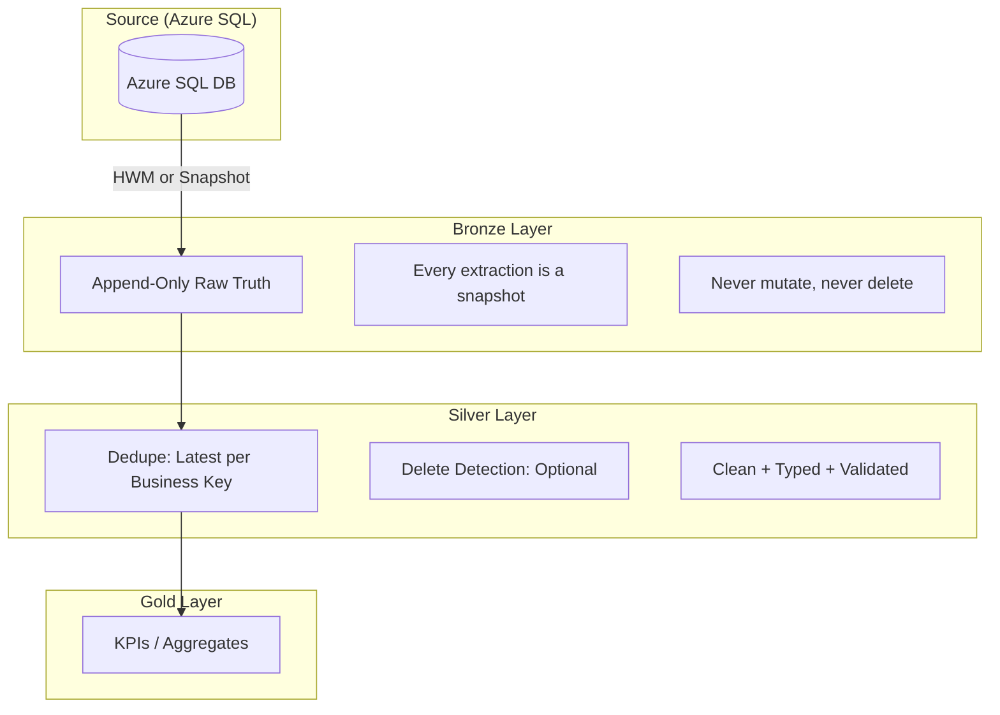
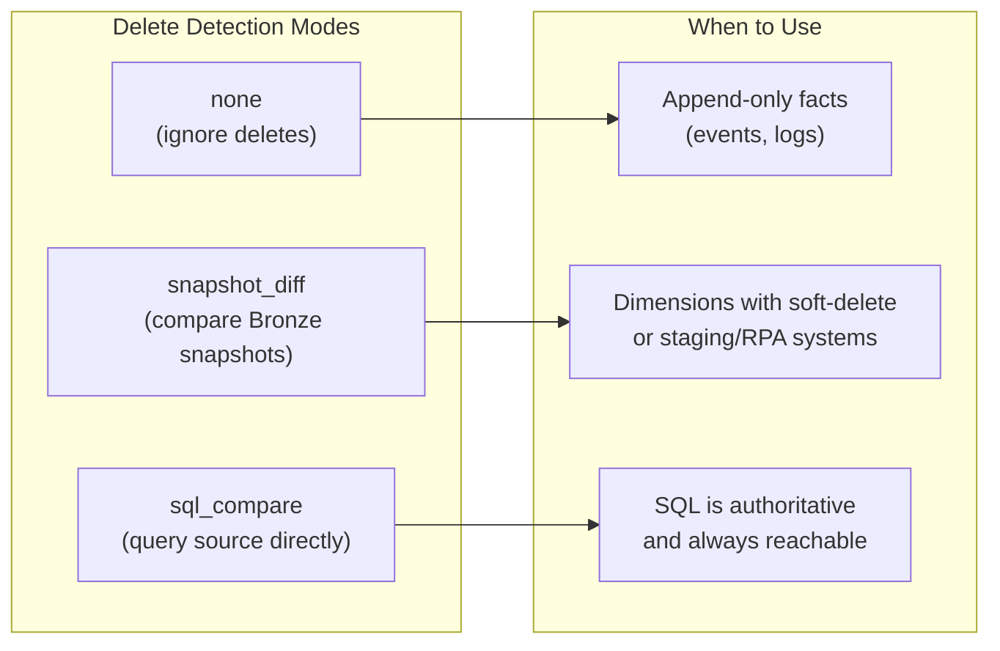
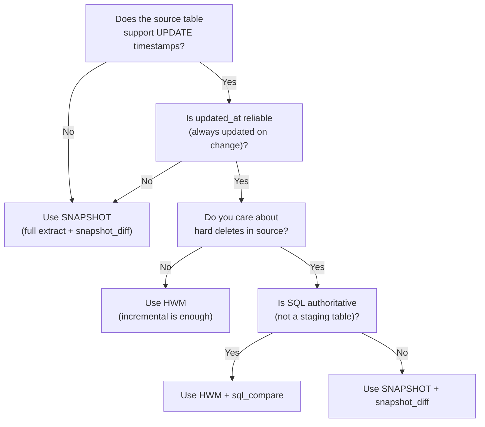

# Ingestion Correctness for Non-CDC Sources

> **Target Audience:** Data engineers implementing pipelines against Azure SQL Database or other sources without native Change Data Capture (CDC).

This document defines the architecture for achieving CDC-like correctness without real CDC, covering Bronze/Silver/Gold layer invariants, deduplication, and delete detection patterns.

---

## Table of Contents

1. [Core Invariants](#core-invariants)
2. [Bronze Layer: Append-Only Raw Truth](#bronze-layer-append-only-raw-truth)
3. [Silver Layer: Dedupe + Delete Detection](#silver-layer-dedupe--delete-detection)
4. [Delete Detection Patterns](#delete-detection-patterns)
5. [HWM vs Snapshot: Decision Guide](#hwm-vs-snapshot-decision-guide)
6. [YAML Configuration Reference](#yaml-configuration-reference)
7. [Quick Reference Table](#quick-reference-table)
8. [Common Pitfalls](#common-pitfalls)

---

## Core Invariants

```
Bronze = append-only raw truth
Silver = dedupe + clean + optional delete-detection
Gold   = KPIs (computed from clean Silver)
```



---

## Bronze Layer: Append-Only Raw Truth

### The Rule

```
Bronze = append(raw_row + _extracted_at + metadata)
```

**Never dedupe in Bronze. Never delete in Bronze.**

### What Goes Wrong Without Append-Only Bronze?

| Problem | Consequence |
|---------|-------------|
| **Overwrites destroy lineage** | You can't answer "what did the source say on Tuesday?" |
| **Reprocessing is impossible** | If Silver logic is wrong, you can't replay from Bronze |
| **Late-arriving data is lost** | If you overwrite with "current", late rows vanish |
| **Audit trail breaks** | Compliance (GDPR, SOX) requires provenance |

### Bronze YAML Example

```yaml
nodes:
  - name: bronze_customers
    read:
      connection: azure_sql
      format: sql
      table: dbo.Customers
      incremental:
        mode: stateful
        column: updated_at
        watermark_lag: 2h
    write:
      connection: bronze
      table: customers
      mode: append              # ALWAYS append for Bronze
      add_metadata: true        # adds _extracted_at, _source_file, etc.
```

---

## Silver Layer: Dedupe + Delete Detection

### Dedupe is REQUIRED

Every Silver table must declare:
- `keys`: business key columns
- `order_by`: how to pick the "latest" (typically `_extracted_at DESC`)

### What Goes Wrong Without Dedupe?

| Scenario | Problem |
|----------|---------|
| **HWM overlap** | Watermark lag pulls same row twice → duplicates in Silver |
| **Snapshot re-extraction** | Same row appears in batch N and batch N+1 → duplicates |
| **Source system backfills** | Row updated retroactively → old and new version both exist |
| **Retry after partial failure** | Same batch re-ingested → duplicates |

### Dedupe Logic

```sql
SELECT * EXCEPT(_rn) FROM (
    SELECT *,
           ROW_NUMBER() OVER (
               PARTITION BY {business_key}
               ORDER BY _extracted_at DESC, updated_at DESC
           ) as _rn
    FROM bronze
) WHERE _rn = 1
```

---

## Delete Detection Patterns

Delete detection is **optional** and has three modes:



### Mode: `none` (Default for Facts)

**Use when:** Immutable events (logs, transactions, sensor readings)

```yaml
transform:
  - dedupe:
      keys: [event_id]
      order_by: _extracted_at DESC
  # delete_detection omitted = none
```

**Why no delete detection for facts?**
- Facts don't delete by nature
- Wastes compute comparing millions of events
- Risk of accidentally soft-deleting valid events

---

### Mode: `snapshot_diff` (Compare Bronze Snapshots)

**Use when:**
- Dimensions (customers, products)
- Staging/RPA tables where SQL is NOT authoritative
- Source system doesn't support point-in-time queries

**Logic:**
```
deleted_keys = (keys in previous_snapshot) - (keys in current_snapshot)
```

**Implementation Concept:**
```python
# Uses Delta time travel (no batch_id column needed)
prev = delta_table.version(N-1).select(keys).distinct()
curr = delta_table.version(N).select(keys).distinct()
deleted = prev.exceptAll(curr)
```

**What goes wrong if we compare to SQL instead?**
- If SQL is a staging table, it may be empty between loads → false deletes
- If SQL has different retention than Bronze → false deletes
- If SQL is behind a firewall/VPN during processing → failures

**What goes wrong if we push this to Bronze?**
- Bronze becomes stateful (needs to know previous batch)
- Bronze loses append-only guarantee
- Can't replay Bronze independently

---

### Mode: `sql_compare` (Query Source Directly)

**Use when:**
- SQL is the **authoritative source of truth**
- You need real-time delete detection
- SQL is always reachable during Silver processing

**Logic:**
```sql
-- Keys in Silver but NOT in SQL = deleted
SELECT s.business_key
FROM silver s
LEFT ANTI JOIN sql_source ON s.business_key = sql_source.business_key
```

**What goes wrong if we compare too early (in Bronze)?**
- Bronze becomes coupled to SQL availability
- Can't process Bronze offline
- Latency spikes if SQL is slow

**What goes wrong if we compare too late (after Gold)?**
- KPIs already computed with ghost records
- Downstream dashboards show incorrect data
- Audit logs contaminated

**What goes wrong if SQL is NOT authoritative?**
- Staging tables empty between loads → everything looks deleted
- ERP snapshots → previous day's data appears deleted
- RPA extracts → intermittent failures look like deletes

---

## HWM vs Snapshot: Decision Guide



### Decision Matrix

| Source Characteristics | Ingestion Mode | Delete Mode |
|------------------------|----------------|-------------|
| Has `updated_at`, no hard deletes | HWM | `none` |
| Has `updated_at`, hard deletes, SQL = authoritative | HWM | `sql_compare` |
| Has `updated_at`, hard deletes, SQL = staging | HWM | `snapshot_diff` (periodic full extract) |
| No `updated_at`, full snapshot daily | SNAPSHOT | `snapshot_diff` |
| Append-only facts (immutable) | HWM on `event_id` or `created_at` | `none` |

### Hybrid Pattern for Updatable Facts

For tables like **downtime, production, energy** where:
- Records can be updated (corrections)
- Records can be hard-deleted (reversals)
- But volume is high

**Recommended approaches:**

1. **Use `sql_compare`** (simpler) - If source is authoritative and reachable, just use HWM with `sql_compare`. No full snapshots needed.

2. **Hybrid HWM + Snapshot** (complex) - If source is unreliable/staging:
   - Daily: HWM ingestion
   - Weekly: Full snapshot (enables `snapshot_diff`)
   - Requires filtering Bronze to latest snapshot in Silver

```yaml
# Option 1: sql_compare (recommended)
incremental:
  mode: stateful
  column: updated_at
  watermark_lag: 2h
# Then use detect_deletes with mode: sql_compare

# Option 2: Hybrid (only if sql_compare won't work)
# Use two separate pipeline runs or orchestrator-controlled mode
```

---

## YAML Configuration Reference

### Full Silver Node Example

```yaml
nodes:
  - name: silver_customers
    read:
      connection: bronze
      table: customers
    transform:
      steps:
        # REQUIRED: Deduplication
        - operation: deduplicate
          params:
            keys: [customer_id]
            order_by: _extracted_at DESC

        # OPTIONAL: Delete Detection (sql_compare recommended for HWM)
        - operation: detect_deletes
          params:
            mode: sql_compare
            keys: [customer_id]
            source_connection: azure_sql
            source_table: dbo.Customers
            soft_delete_col: _is_deleted
    write:
      connection: silver
      table: customers
      mode: upsert
      keys: [customer_id]
```

### Delete Detection Config Options

| Option | Type | Description |
|--------|------|-------------|
| `mode` | enum | `none`, `snapshot_diff`, `sql_compare` |
| `keys` | list | Business key columns for comparison |
| `soft_delete_col` | string | Column to flag deletes (default: `_is_deleted`). If null, hard-delete. |
| `source_connection` | string | For `sql_compare`: connection to query |
| `source_table` | string | For `sql_compare`: table to query |
| `source_query` | string | For `sql_compare`: custom query (overrides source_table) |
| `max_delete_percent` | float | Safety threshold: warn/error if more than X% would be deleted (default: 50) |
| `on_threshold_breach` | enum | Behavior when threshold exceeded: `warn`, `error`, `skip` |
| `on_first_run` | enum | Behavior when no previous version exists: `skip`, `error` |

---

## Quick Reference Table

| Table Type | Example | Ingestion | Delete Mode | Why |
|------------|---------|-----------|-------------|-----|
| **Immutable facts** | Events, logs, sensor data | HWM on `created_at` | `none` | Facts don't delete |
| **Mutable facts** | Downtime, production records | HWM on `updated_at` | `sql_compare` | Source is authoritative |
| **Dimensions (SQL auth)** | Customers from ERP | HWM on `updated_at` | `sql_compare` | ERP is truth |
| **Dimensions (staging)** | Staging from RPA | Full snapshot | `snapshot_diff` | Staging is ephemeral |
| **Reference data** | Country codes, units | Full snapshot | `snapshot_diff` | Rarely changes, small tables |

---

## Common Pitfalls

### 1. Never use `sql_compare` on staging tables

Staging tables may be truncated between loads. If Silver compares to an empty staging table, everything appears deleted.

### 2. Always add `watermark_lag`

Source systems have clock skew and replication lag. A 1-2 hour lag buffer prevents missed records.

```yaml
incremental:
  mode: stateful
  column: updated_at
  watermark_lag: 2h  # Safety buffer
```

### 3. Prefer soft-deletes over hard-deletes

Use `soft_delete_col: _is_deleted` instead of actually removing rows. This:
- Preserves audit trail
- Allows undo if delete detection was wrong
- Supports downstream "as-of" queries

### 4. Run periodic full snapshots for HWM tables

Even with reliable HWM, run a weekly full snapshot to:
- Catch missed updates (source bugs, clock issues)
- Detect hard deletes
- Validate HWM accuracy

---

## Summary

The architecture for non-CDC sources follows these principles:

1. **Bronze is stateless and append-only** — capture everything, decide nothing
2. **Silver owns deduplication** — mandatory, not optional
3. **Silver owns delete detection** — optional, with three explicit modes
4. **Gold assumes clean data** — no deduplication logic needed

This design achieves CDC-like correctness while keeping the logic simple, deterministic, and replayable.
