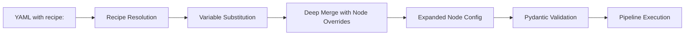

# Recipes

!!! tip "TL;DR"
    Recipes are reusable node-level templates with variable substitution.
    Write a pattern once, reuse it everywhere. **Zero boilerplate, full control.**

## Why Recipes?

In a typical data platform, you'll write the same patterns dozens of times:

- **Bronze**: "Load CSV, normalize columns, dedup, write Parquet" — repeated per source table
- **Silver**: "Dedup, validate, merge into target" — repeated per dimension/fact
- **Gold**: "Group by grain, aggregate measures" — repeated per report

Without recipes, each node is 15–30 lines of YAML. With recipes, it's **3–5 lines**.

### Before (without recipes)

```yaml
nodes:
  - name: dedup_users
    transformer: deduplicate
    params:
      keys: [user_id]
      order_by: "updated_at DESC"
    write:
      connection: silver
      format: parquet
      mode: overwrite

  - name: dedup_orders
    transformer: deduplicate
    params:
      keys: [order_id]
      order_by: "created_at DESC"
    write:
      connection: silver
      format: parquet
      mode: overwrite
```

### After (with recipes)

```yaml
nodes:
  - name: dedup_users
    recipe: silver_dedup
    recipe_vars:
      keys: [user_id]
      order_by: "updated_at DESC"
    write:
      connection: silver
      format: parquet

  - name: dedup_orders
    recipe: silver_dedup
    recipe_vars:
      keys: [order_id]
      order_by: "created_at DESC"
    write:
      connection: silver
      format: parquet
```

## How It Works



Recipes are resolved as a **YAML-to-YAML preprocessing step** before Pydantic validation:

1. **Load** built-in recipes + any inline recipes in your YAML
2. **Substitute** `${recipe.var_name}` placeholders with your `recipe_vars`
3. **Deep merge** the recipe template with your node-level overrides (your overrides win)
4. **Pass** the expanded config to the normal pipeline engine

This means recipes work with **every engine** (Pandas, Spark, Polars) and **every pattern** — they're purely a configuration convenience.

## Quick Start

### Using a Built-in Recipe

```yaml
pipelines:
  - pipeline: silver_pipeline
    nodes:
      - name: dedup_customers
        recipe: silver_dedup
        recipe_vars:
          keys: [customer_id]
          order_by: "updated_at DESC"
        write:
          connection: silver_output
          format: parquet
```

### Defining Your Own Recipe

```yaml
recipes:
  my_clean_and_write:
    description: "Standard cleanup and write to silver"
    required_vars: [target_table]
    optional_vars:
      write_mode: overwrite
    template:
      transform:
        steps:
          - function: normalize_column_names
          - function: trim_whitespace
      write:
        connection: silver
        format: delta
        table: "${recipe.target_table}"
        mode: "${recipe.write_mode}"

pipelines:
  - pipeline: silver
    nodes:
      - name: clean_users
        recipe: my_clean_and_write
        recipe_vars:
          target_table: dim_users

      - name: clean_orders
        recipe: my_clean_and_write
        recipe_vars:
          target_table: fact_orders
          write_mode: append    # Override the default
```

## Variable Substitution

Variables use the `${recipe.var_name}` syntax, chosen to avoid collision with existing `${ENV_VAR}`, `${vars.xxx}`, and `${date:xxx}` patterns.

### Type Preservation

When a placeholder is the **entire value**, the original type is preserved:

```yaml
# In recipe template:
params:
  keys: "${recipe.keys}"         # If keys is a list, stays a list
  limit: "${recipe.limit}"       # If limit is an int, stays an int

# In recipe_vars:
recipe_vars:
  keys: [user_id, email]         # → list preserved
  limit: 100                     # → int preserved
```

When a placeholder is **embedded in a string**, it's stringified:

```yaml
# Template:
table: "silver_${recipe.table_name}"

# recipe_vars:
recipe_vars:
  table_name: customers    # → "silver_customers"
```

### Required vs Optional Variables

```yaml
recipes:
  my_recipe:
    required_vars: [keys, target]           # Must be provided
    optional_vars:                            # Have defaults
      write_mode: overwrite
      format: parquet
    template:
      params:
        keys: "${recipe.keys}"
      write:
        format: "${recipe.format}"
        mode: "${recipe.write_mode}"
        table: "${recipe.target}"
```

Missing required variables produce clear error messages:

```
ValueError: Node 'my_node': Recipe 'my_recipe' requires variables ['target'].
Provided: ['keys']. Add the missing variables to recipe_vars.
```

## Deep Merge Rules

When a node specifies both a `recipe` and additional fields, they are deep-merged:

| Scenario | Rule | Example |
|----------|------|---------|
| `dict + dict` | Recursive merge (node wins on conflicts) | Node's `write.mode` overrides recipe's `write.mode`, but recipe's `write.format` is kept |
| `list` | Node replaces recipe list entirely | Node's `steps: [a, b]` replaces recipe's `steps: [x, y, z]` |
| `scalar` | Node wins | Node's `transformer: custom` overrides recipe's `transformer: dedup` |

### Example: Overriding Part of a Recipe

```yaml
- name: api_weather
  recipe: api_bronze_load
  recipe_vars:
    source_name: weather_api
  read:
    connection: weather_api_conn       # Added by node
    options:
      http:
        timeout_s: 60                  # Overrides recipe default (30)
      # retry config from recipe is KEPT (deep merge)
```

## Recipe Inheritance

Recipes can extend other recipes using the `extends` field. The child recipe inherits the parent's template, required_vars, and optional_vars, with the child's definitions taking precedence.

```yaml
recipes:
  base_silver:
    description: "Base silver pattern"
    optional_vars:
      write_mode: overwrite
    template:
      transform:
        steps:
          - function: normalize_column_names
          - function: trim_whitespace
      write:
        mode: "${recipe.write_mode}"

  silver_with_dedup:
    extends: base_silver
    description: "Silver + deduplication"
    required_vars: [keys, order_by]
    template:
      transformer: deduplicate
      params:
        keys: "${recipe.keys}"
        order_by: "${recipe.order_by}"
```

Using `silver_with_dedup` gives you the cleaning steps from `base_silver` **plus** the dedup transformer — without repeating the base template.

### Multi-Level Inheritance

```yaml
recipes:
  level_1:
    template:
      read: { format: csv }

  level_2:
    extends: level_1
    template:
      write: { mode: overwrite }

  level_3:
    extends: level_2
    template:
      transformer: noop
```

`level_3` gets `read.format`, `write.mode`, and `transformer` — all merged from the chain.

!!! warning "Circular Inheritance"
    Circular references (A extends B, B extends A) are detected and raise a clear error at resolution time.

## Built-in Recipes

Odibi ships with **12 built-in recipes** covering the most common medallion architecture patterns.

### Bronze Layer

| Recipe | Description | Required Vars |
|--------|-------------|---------------|
| `api_bronze_load` | HTTP API → Parquet with metadata, retry, rate limiting | `source_name` |
| `csv_bronze_load` | CSV → Parquet with column normalization and dedup | `keys` |
| `database_bronze_load` | Database → Parquet with incremental HWM loading | `hwm_column` |
| `reference_snapshot` | Full-refresh reference data with normalization | — |

### Silver Layer

| Recipe | Description | Required Vars |
|--------|-------------|---------------|
| `silver_clean` | Normalize names, trim whitespace | — |
| `silver_dedup` | Deterministic deduplication | `keys`, `order_by` |
| `silver_merge` | Dedup + upsert/merge into target | `keys`, `target` |
| `silver_scd2` | SCD Type 2 with standard columns | `keys`, `track_cols`, `effective_time_col`, `target` |
| `silver_validate_and_write` | Quality gates + quarantine routing | `tests` |
| `silver_full_conform` | Kitchen-sink: normalize, trim, dedup, merge | `keys`, `target` |

### Gold Layer

| Recipe | Description | Required Vars |
|--------|-------------|---------------|
| `gold_aggregate` | Grain + measures aggregation with audit columns | `grain`, `measures` |
| `gold_pivot_report` | Pivot data for reporting output | `index`, `columns`, `values` |

### Exploring Built-in Recipes

Use the CLI to discover and explore recipes:

```bash
# List all recipes
odibi list recipes

# Get full details for a recipe
odibi explain silver_scd2

# Get a copy-pasteable YAML template
odibi templates show silver_dedup
```

## Inline Recipes

Define project-specific recipes directly in your YAML file under the `recipes:` key:

```yaml
recipes:
  my_custom_recipe:
    description: "Company-specific pattern"
    required_vars: [source, target]
    template:
      read:
        connection: "${recipe.source}"
      transform:
        steps:
          - function: normalize_column_names
      write:
        connection: "${recipe.target}"
        format: delta
        mode: overwrite

pipelines:
  - pipeline: daily_load
    nodes:
      - name: load_products
        recipe: my_custom_recipe
        recipe_vars:
          source: erp_connection
          target: silver_connection
```

!!! note "Override Priority"
    Inline recipes with the same name as a built-in will **override** the built-in. This lets you customize built-in behavior for your project.

## Validation

### CLI Validation

The `odibi validate` command now checks recipe references:

```bash
odibi validate my_pipeline.yaml
```

It verifies:

- Referenced recipes exist (built-in or inline)
- All required variables are provided
- Variable types are correct

### Error Messages

Recipes are designed to give **business-analyst-friendly** error messages:

```
✗ my_pipeline.yaml has errors:
  - recipes: Node 'load_orders': Recipe 'silver_dedup' requires variables
    ['order_by']. Provided: ['keys']. Add the missing variables to recipe_vars.
```

## Complete Example

Here's a real-world pipeline using multiple recipes:

```yaml
recipes:
  company_bronze:
    extends: csv_bronze_load
    description: "Standard CSV ingestion for our data warehouse"
    optional_vars:
      keys: [id]
    template:
      write:
        connection: bronze_lake
        format: delta

pipelines:
  - pipeline: daily_warehouse
    nodes:
      # Bronze: Ingest raw CSVs
      - name: ingest_customers
        recipe: company_bronze
        recipe_vars:
          keys: [customer_id]
        read:
          connection: sftp_source
          path: customers/*.csv

      - name: ingest_orders
        recipe: company_bronze
        recipe_vars:
          keys: [order_id]
        read:
          connection: sftp_source
          path: orders/*.csv

      # Silver: Clean and conform
      - name: conform_customers
        recipe: silver_full_conform
        recipe_vars:
          keys: [customer_id]
          target: silver_lake/dim_customers
        depends_on: [ingest_customers]
        read:
          connection: bronze_lake
          path: customers

      - name: conform_orders
        recipe: silver_merge
        recipe_vars:
          keys: [order_id]
          target: silver_lake/fact_orders
        depends_on: [ingest_orders]
        read:
          connection: bronze_lake
          path: orders

      # Gold: Aggregate for reporting
      - name: daily_revenue
        recipe: gold_aggregate
        recipe_vars:
          grain: [order_date, product_category]
          measures:
            revenue: { column: amount, function: sum }
            order_count: { column: order_id, function: count }
        depends_on: [conform_orders]
        read:
          connection: silver_lake
          path: fact_orders
        write:
          connection: gold_lake
          table: daily_revenue_by_category
```

## Architecture Notes

### Resolution Order

1. Built-in recipes loaded from `odibi/recipes/builtins/*.yaml`
2. Inline recipes loaded from your YAML's `recipes:` key (overrides built-ins)
3. Inheritance chains resolved (`extends`)
4. Node recipe references expanded (variable substitution + deep merge)
5. `recipes:` key removed from config (consumed)
6. Expanded config passed to Pydantic validation → pipeline execution

### Design Decisions

| Decision | Rationale |
|----------|-----------|
| `${recipe.var}` syntax | Avoids collision with `${ENV_VAR}`, `${vars.x}`, `${date:x}` |
| YAML-to-YAML preprocessing | Works with all engines, no runtime overhead |
| Deep merge (not shallow) | Lets you override one nested field without losing others |
| Lists replace entirely | Prevents ambiguity about list ordering/dedup |
| Child wins on conflicts | Matches CSS/inheritance mental model |
| Built-ins are YAML files | Easy to read, copy, and customize |

### Extending the System

**Adding a new built-in recipe:**

1. Add your recipe to the appropriate YAML file in `odibi/recipes/builtins/`
2. Follow the naming convention: `{layer}_{action}` (e.g., `silver_validate`)
3. Always include a `description`
4. Declare `required_vars` for anything the user MUST provide
5. Use `optional_vars` with sensible defaults for everything else

**Creating a custom recipe YAML file** (for teams):

```yaml
# my_team_recipes.yaml — import via project config
recipes:
  team_standard_load:
    description: "Our team's standard load pattern"
    required_vars: [table_name]
    template:
      # ... your template
```
