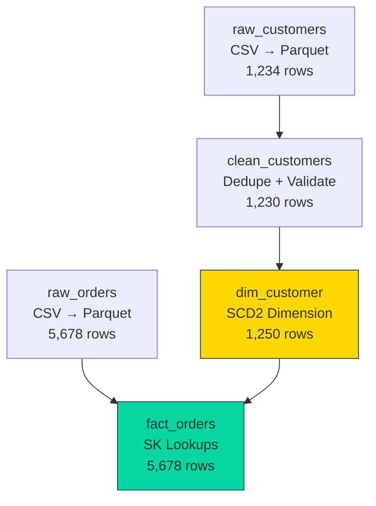

# How to Read a Data Story

> Every Odibi pipeline run generates an HTML "Data Story" — a comprehensive audit report. This guide teaches you how to interpret it.

---

## What Is a Data Story?

A **Data Story** is an auto-generated HTML report that answers:

1. **What happened?** (Lineage: input → transform → output)
2. **What does the data look like?** (Schema + sample rows)
3. **Did anything go wrong?** (Validation results, errors)
4. **Why was this done?** (Business logic from explanation sections)

**Think of it as:** A flight recorder for your data pipeline.

---

## Generating a Data Story

Stories are generated automatically when you configure them:

```yaml
story:
  connection: local_data  # Where to save HTML
  path: stories/          # Subfolder
  max_sample_rows: 20     # Rows to preview
  retention_days: 30      # Auto-cleanup old stories
```

View stories:

```bash
# List all stories
odibi story list

# Open latest story in browser
odibi story last

# Open specific story
odibi story show my_pipeline_20250111_143000.html
```

---

## Story Anatomy

A Data Story has **5 main sections:**

### 1. **Pipeline Summary** (Header)
### 2. **Lineage Graph** (Visual DAG)
### 3. **Node Details** (Per-node breakdown)
### 4. **Validation Results** (Quality checks)
### 5. **Execution Log** (Timeline + errors)

Let's walk through each section with examples.

---

## Section 1: Pipeline Summary

```
┌─────────────────────────────────────────────────────┐
│ Pipeline: sales_etl                                 │
│ Started: 2025-01-11 14:30:00                        │
│ Duration: 2m 35s                                    │
│ Status: ✅ SUCCESS                                   │
│ Nodes: 5 total (5 succeeded, 0 failed)             │
└─────────────────────────────────────────────────────┘
```

**What to Look For:**
- ✅ **Status: SUCCESS** → All nodes completed
- ⚠️ **Status: PARTIAL** → Some nodes succeeded, some failed
- ❌ **Status: FAILED** → Pipeline stopped early

**Duration** tells you if performance is degrading over time.

---

## Section 2: Lineage Graph

This is a visual dependency graph showing which nodes ran in what order.



**How to Read It:**
- **Boxes** = Nodes (pipeline steps)
- **Arrows** = Dependencies (A → B means "B depends on A")
- **Row counts** = Data volume at each step

**Red flags:**
- 🚩 Row count drops sharply (data loss?)
- 🚩 Unexpected dependencies (wrong `depends_on`?)

---

## Section 3: Node Details

Each node has a collapsible section with 4 tabs:

### Tab 1: **Schema**

```
┌─────────────────────────────────────────────────┐
│ Node: clean_customers                           │
├─────────────────────────────────────────────────┤
│ SCHEMA                                          │
│                                                 │
│ Column Name       Type        Nulls   Sample    │
│ ─────────────────────────────────────────────── │
│ customer_id       int64       0      12345      │
│ name              string      0      Alice      │
│ email             string      2      alice@...  │
│ city              string      0      Portland   │
│ signup_date       date        0      2025-01-01 │
└─────────────────────────────────────────────────┘
```

**What to Check:**
- **Type changes:** Did `int` become `string`? (Unintended?)
- **Null counts:** Expected vs actual
- **Column additions/removals:** Schema evolution

---

### Tab 2: **Sample Data**

```
┌─────────────────────────────────────────────────────────────────┐
│ SAMPLE DATA (first 10 rows)                                    │
├──────────┬─────────┬──────────────────┬──────────┬─────────────┤
│ cust_id  │ name    │ email            │ city     │ signup_date │
├──────────┼─────────┼──────────────────┼──────────┼─────────────┤
│ 1        │ Alice   │ alice@example... │ Portland │ 2025-01-01  │
│ 2        │ Bob     │ bob@example.com  │ Seattle  │ 2025-01-02  │
│ 3        │ Charlie │ NULL             │ Austin   │ 2025-01-03  │
└──────────┴─────────┴──────────────────┴──────────┴─────────────┘
```

**What to Check:**
- **NULL values:** Are they expected?
- **Data quality:** Do values look reasonable?
- **Outliers:** Prices of $999,999? Dates in 1970?

**Sensitive Data:**
If you marked columns as `sensitive: [email, ssn]`, they appear as:
```
│ email            │
├──────────────────┤
│ [REDACTED]       │
│ [REDACTED]       │
```

---

### Tab 3: **SQL / Transformation**

```sql
-- Step 1: Filter
SELECT * FROM raw_customers WHERE customer_id IS NOT NULL

-- Step 2: Custom Function
-- Function: calculate_customer_tier
-- Parameters: {"threshold": 1000}
```

**What to Check:**
- **SQL logic:** Does the WHERE clause make sense?
- **Custom functions:** Are parameters correct?

---

### Tab 4: **Explanation** (Business Logic)

This is where you document **why** you did something:

```markdown
## Customer Dimension

This table stores our customer master data with SCD Type 2 history tracking.

**Business Rules:**
- `customer_id` is the natural key from the source system
- We track changes to `name`, `email`, and `tier` over time
- Unknown customers get `customer_sk = 0` for orphan handling in facts

**SLA:**
- Runs daily at 2 AM ET
- Must complete within 30 minutes
- Alerts #data-team on failure
```

**Why It Matters:**
A junior engineer can understand the pipeline 6 months from now without asking you.

---

## Section 4: Validation Results

```
┌─────────────────────────────────────────────────┐
│ VALIDATION RESULTS                              │
├─────────────────────────────────────────────────┤
│ Node: clean_customers                           │
│                                                 │
│ ✅ not_null (customer_id): PASS                 │
│    All 1,230 rows have non-null customer_id     │
│                                                 │
│ ✅ unique (customer_id): PASS                   │
│    All values are unique                        │
│                                                 │
│ ⚠️ not_null (email): WARN                       │
│    2 rows have NULL email                       │
│    Rows: 3, 47                                  │
│                                                 │
│ ✅ row_count (min: 1): PASS                     │
│    1,230 rows (threshold: 1)                    │
└─────────────────────────────────────────────────┘
```

**Interpreting Results:**

| Icon | Meaning | Action |
|------|---------|--------|
| ✅ PASS | All checks passed | No action needed |
| ⚠️ WARN | Issue detected, but pipeline continued | Investigate, may need data fix |
| ❌ FAIL | Critical issue, pipeline stopped | Must fix before re-run |

**Example Decision:**

```
⚠️ not_null (email): WARN
2 rows have NULL email
```

**Questions to Ask:**
1. Is NULL email acceptable for our business?
2. Should we add a `fill_nulls` step with a default (e.g., "noemail@unknown.com")?
3. Should this be upgraded to `on_fail: abort` to enforce completeness?

---

### Validation With Quarantine

If you enabled quarantine:

```
┌─────────────────────────────────────────────────┐
│ ⚠️ Quarantine: 12 rows routed to quarantine     │
│    Path: data/quarantine/clean_customers.parquet│
│    Reason: Failed validation (negative amounts) │
└─────────────────────────────────────────────────┘
```

Now you can review quarantined rows separately.

---

## Section 5: Execution Log

```
14:30:00 [INFO] Starting pipeline: sales_etl
14:30:01 [INFO] Executing node: raw_customers
14:30:03 [INFO] Read 1,234 rows from customers.csv
14:30:03 [INFO] Wrote 1,234 rows to bronze/customers.parquet
14:30:03 [INFO] Executing node: clean_customers
14:30:05 [WARN] Validation warning: 2 NULL emails detected
14:30:05 [INFO] Wrote 1,230 rows to silver/customers.parquet
14:30:05 [INFO] Pipeline completed successfully
```

**What to Look For:**
- **Timing:** Which nodes are slow?
- **Warnings:** Any unexpected behavior?
- **Errors:** Stack traces for debugging

---

## Real-World Example: Diagnosing a Failed Pipeline

### Story Shows:

```
❌ STATUS: FAILED
Node: fact_orders (failed)

Validation Results:
❌ FK Validation: FAIL
   Column: customer_sk
   Missing keys in dim_customer: [9999, 10001]
   187 orphan records detected
```

### How to Interpret:

**Problem:** Fact table has customer_sk values that don't exist in dim_customer.

**Root Cause (Likely):**
- New orders arrived for customers not yet in dimension
- Dimension load failed/skipped
- Customer IDs in orders are corrupt

**Solution:**
1. Check dim_customer load status
2. Add `unknown_member: true` to dimension pattern (creates SK=0)
3. Set fact pattern to `orphan_handling: unknown` (routes orphans to SK=0)

**Updated Config:**

```yaml
# Dimension
pattern:
  type: dimension
  params:
    unknown_member: true  # Creates SK=0 for orphans

# Fact
pattern:
  type: fact
  params:
    orphan_handling: unknown  # orphans → SK=0
```

Re-run and verify in Story:

```
✅ FK Validation: PASS
   All customer_sk values found in dim_customer
   (187 rows routed to unknown_member SK=0)
```

---

## Tips for Different Roles

### Business Analysts
**Focus on:**
- Section 1 (Summary): Did it succeed?
- Section 2 (Lineage): Which tables were updated?
- Section 4 (Validation): Any quality issues?
- Tab 4 (Explanation): Business logic documentation

**Skip:**
- SQL details (unless curious)
- Execution log (unless debugging)

---

### Junior Data Engineers
**Focus on:**
- Section 2 (Lineage): Understand dependencies
- Section 3 (Node Details): Learn SQL patterns
- Section 4 (Validation): See what tests look like
- Section 5 (Log): Debug errors

**Practice:**
Generate stories for canonical examples and annotate them.

---

### Senior Data Engineers
**Focus on:**
- Performance (duration trends)
- Schema evolution (unexpected type changes)
- Validation coverage (are we testing the right things?)
- Explanation completeness (is logic documented?)

**Proactive Use:**
- Review stories weekly for drift
- Export stories for incident post-mortems
- Use as onboarding material for new team members

---

## Story Best Practices

### 1. **Always Add Explanations**

```yaml
nodes:
  - name: fact_sales
    explanation: |
      ## Sales Fact Table
      
      **Grain:** One row per order line item.
      
      **Business Rules:**
      - Orders < $0 are refunds (kept in fact)
      - Orphan customer_ids route to unknown_member (SK=0)
      
      **Freshness SLA:** Updated daily by 6 AM ET.
```

### 2. **Use Meaningful Node Names**

```yaml
# ❌ Bad (generic)
- name: node_1
- name: transform_2

# ✅ Good (descriptive)
- name: load_raw_orders
- name: dedupe_customers
- name: enrich_with_geo_data
```

### 3. **Configure Sensitive Columns**

```yaml
nodes:
  - name: load_users
    sensitive: [email, phone, ssn, ip_address]
```

Sample data appears as `[REDACTED]` in Story.

### 4. **Set Retention**

```yaml
story:
  retention_days: 30  # Auto-delete stories older than 30 days
```

Prevents story folder from growing unbounded.

---

## Advanced: Programmatic Story Access

Stories are just HTML. You can parse them programmatically:

```python
from bs4 import BeautifulSoup

with open("story.html") as f:
    soup = BeautifulSoup(f, "html.parser")
    
# Extract validation results
validations = soup.find_all("div", class_="validation-result")
for v in validations:
    if "FAIL" in v.text:
        print(f"Failed validation: {v.text}")
```

Or use the Odibi API:

```python
from odibi.story import StoryReader

story = StoryReader("story.html")
print(story.summary())
print(story.get_failed_validations())
```

---

## Related

- [Data Quality Overview](../validation/README.md)
- [Quality Gates](../features/quality_gates.md)
- [Explanation Feature](explanation_feature.md)
- [Observability](../features/observability.md)

---

[← Back to Guides](../README.md)
