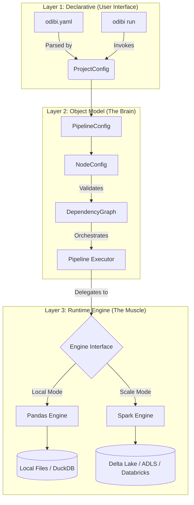

# The Definitive Guide to Odibi

**Version:** 2.4.0
**Audience:** Data Engineers, Analytics Engineers, Architects
**Prerequisites:** Basic Python and SQL knowledge
**Goal:** From "Hello World" to Enterprise Production

---

## Table of Contents

1.  [Introduction & Philosophy](#1-introduction--philosophy)
2.  [Architecture Deep Dive](#2-architecture-deep-dive)
3.  [The Object Model (Python API)](#3-the-object-model-python-api)
4.  [Context, State, and Dependencies](#4-context-state-and-dependencies)
5.  [Transformation Engineering](#5-transformation-engineering)
6.  [The Dual Engine: Pandas & Spark](#6-the-dual-engine-pandas--spark)
7.  [Declarative Configuration (YAML)](#7-declarative-configuration-yaml)
8.  [Observability: Data Stories](#8-observability-data-stories)
9.  [Reliability & Governance](#9-reliability--governance)
10. [Production Deployment Patterns](#10-production-deployment-patterns)
11. [Comprehensive End-to-End Example](#11-comprehensive-end-to-end-example)

---

## 1. Introduction & Philosophy

Odibi is a **Declarative Data Framework** designed to solve the "Two Language Problem" in data engineering:
1.  **Local Development** is often done in Python/Pandas on a laptop (fast iteration, small data).
2.  **Production** runs on distributed clusters like Spark/Databricks (high latency, massive data).

Traditionally, this requires rewriting code or wrapping Spark in complex local docker containers. Odibi provides a unified abstraction layer that allows the *exact same pipeline definition* to run on your MacBook (using Pandas) and on a 100-node Databricks cluster (using Spark).

### Core Principles

1.  **Declarative over Imperative:** Define *what* you want (Input -> Transform -> Output), not *how* to loop through files.
2.  **Code First, Configuration Second:** Learn the Python API to understand the system; use YAML for deployment.
3.  **Engine Agnostic:** Logic written for Odibi runs on Pandas (Local) and Spark (Scale) without code changes.
4.  **Observability by Default:** Every run generates a rich HTML "Data Story" with lineage, profile, and logs.

---

## 2. Architecture Deep Dive

Odibi is built on a **"Three Layer" Architecture**. Understanding these layers helps you debug and extend the framework.



*   **Layer 1 (YAML):** Simple configuration files.
*   **Layer 2 (Pydantic Objects):** The `odibi.config` module. This is where validation happens. If your graph has a cycle, or you miss a parameter, Layer 2 catches it before execution starts.
*   **Layer 3 (Engines):** The `odibi.engine` module. This adapts your abstract "Read CSV" command into `pd.read_csv(...)` or `spark.read.csv(...)`.

---

## 3. The Object Model (Python API)

The most effective way to learn Odibi is to build a pipeline using the Python classes directly. This demystifies the YAML tags.

### 3.1 The Hierarchy

1.  **`ProjectConfig`**: Top-level container. Holds global settings (Engine type, Retry policy, Connections).
2.  **`PipelineConfig`**: A logical grouping of tasks (e.g., "Daily Sales Batch").
3.  **`NodeConfig`**: A single step in the pipeline.
4.  **Operations**: `ReadConfig`, `TransformConfig`, `WriteConfig`.

### 3.2 Building a Complex Node Programmatically

Let's look at a feature-rich node configuration.

```python
from odibi.config import NodeConfig, ReadConfig, TransformConfig, WriteConfig, ErrorStrategy

node = NodeConfig(
    name="process_orders",
    description="Cleans orders and calculates tax",
    tags=["daily", "critical"],

    # 1. Dependency Management
    depends_on=["raw_orders", "ref_tax_rates"],

    # 2. Transformation Logic
    transform=TransformConfig(
        steps=[
            # Step A: Filter (SQL)
            "SELECT * FROM raw_orders WHERE status != 'CANCELLED'",
            # Step B: Custom Python Function
            {"function": "calculate_tax", "params": {"rate_source": "ref_tax_rates"}}
        ]
    ),

    # 3. Output Configuration
    write=WriteConfig(
        connection="silver_db",
        format="delta",
        table="orders_cleaned",
        mode="append"
    ),

    # 4. Reliability & Governance
    on_error=ErrorStrategy.FAIL_FAST,  # Stop whole pipeline if this fails
    sensitive=["customer_email"],      # Mask this column in logs/stories
    cache=True                         # Cache result in memory for downstream nodes
)
```

### 3.3 Node Operations Guide

| Operation | Description | Key Fields |
| :--- | :--- | :--- |
| **Read** | Ingests data from a connection. | `connection`, `format` (`csv`, `parquet`, `delta`, `sql`), `path`, `options` |
| **Transform** | Runs a sequence of steps. | `steps` (List of SQL strings or `{function: name, params: {}}` dicts) |
| **Transformer** | Runs a single "App-like" transformation. | `transformer` (Name string), `params` (Dict). Used for complex logic like SCD2 or Deduplication. |
| **Write** | Saves the result. | `connection`, `format`, `path`/`table`, `mode` (`overwrite`, `append`, `upsert`) |

---

## 4. Context, State, and Dependencies

In Odibi, you don't pass variables between functions. You rely on the **Dependency Graph**.

### 4.1 The Global Context (`odibi.context.Context`)
The Pipeline Executor maintains a Global Context.
*   **Registry:** When a node named `raw_orders` finishes, its result (DataFrame) is registered in the context under the key `"raw_orders"`.
*   **Access:** Downstream nodes request data from the context by name.
*   **Memory Management:** In the Pandas engine, this is a dictionary of DataFrames in RAM. In Spark, these are Temp Views registered in the Spark Session.

### 4.2 Dependency Resolution
When you define `depends_on=["node_A"]` for `node_B`:
1.  **Graph Construction:** Odibi builds a DAG (Directed Acyclic Graph).
2.  **Topological Sort:** It determines the execution order (A -> B).
3.  **Execution:**
    *   `node_A` runs. Output registered as `"node_A"`.
    *   `node_B` starts. It can now execute `SELECT * FROM node_A`.

### 4.3 The EngineContext (`odibi.context.EngineContext`)
When writing custom transformations, you interact with `EngineContext`, not the Global Context directly. This wraps the global state and provides uniform APIs.

| Method | Description |
| :--- | :--- |
| `context.df` | The DataFrame resulting from the *previous step* in the current node. |
| `context.get(name)` | Retrieve a DataFrame from an *upstream node* (Global Context). |
| `context.sql(query)` | Run SQL on `context.df`. Returns a new Context with updated `df`. |
| `context.register_temp_view(name, df)` | Register a DF manually for complex SQL joins. |

---

## 5. Transformation Engineering

While SQL is great for filtering and projection, complex logic belongs in Python. Odibi uses a registry pattern.

### 5.1 The `@transform` Decorator

You must register functions so Odibi can find them by name from the YAML configuration.

```python
from odibi.registry import transform

@transform
def categorize_users(context, params: dict):
    """
    Categorizes users based on spend.

    YAML:
      function: categorize_users
      params:
        threshold: 1000
    """
    threshold = params.get("threshold", 1000)

    # 1. Get Input
    df = context.df

    # 2. Use Engine-Native commands (Pandas/Spark agnostic via SQL)
    # Or check context.engine_type if you need specific optimization

    return context.sql(f"""
        SELECT
            *,
            CASE WHEN total_spend > {threshold} THEN 'VIP' ELSE 'Regular' END as category
        FROM df
    """).df
```

### 5.2 Transformer vs. Transform Steps
There are two ways to define logic in a node:

1.  **Top-Level Transformer (`transformer: "name"`)**:
    *   The node acts as a specific "App" (e.g., `deduplicate`, `scd2`).
    *   It usually takes the dependencies as input and produces one output.
    *   Use this for heavy, reusable logic (Slowly Changing Dimensions, Merges).

2.  **Transform Steps (`transform: { steps: [...] }`)**:
    *   A "Script" of sequential operations.
    *   Mixes SQL and lightweight Python functions.
    *   Use this for business logic specific to that pipeline (Filter -> Join -> Map -> Reduce).

---

## 6. The Dual Engine: Pandas & Spark

Odibi abstracts the engine, but knowing how they differ is crucial for performance.

### 6.1 Comparison

| Feature | Pandas Engine | Spark Engine |
| :--- | :--- | :--- |
| **Compute** | Single Node (CPU/RAM bound) | Distributed (Cluster) |
| **SQL** | DuckDB / PandasQL | Spark SQL (Catalyst) |
| **IO** | Local FS, S3/Blob (via fsspec) | HDFS, S3, ADLS (Native) |
| **Setup** | `pip install odibi` | `pip install odibi[spark]` |
| **Best For** | Dev, Testing, Small Data (<10GB) | Prod, Big Data (TB/PB) |

### 6.2 Spark-Specific Features
The Spark engine enables advanced Data Lakehouse features via `odibi.engine.spark_engine.SparkEngine`.

#### Delta Lake Integration
Odibi treats Delta Lake as a first-class citizen.

*   **Time Travel:**
    ```python
    ReadConfig(..., options={"as_of_version": 5})
    # OR
    ReadConfig(..., options={"as_of_timestamp": "2023-10-01"})
    ```

*   **Upserts (MERGE):**
    ```python
    WriteConfig(
        ...,
        format="delta",
        mode="upsert",
        options={"keys": ["user_id"]} # Matches on key, updates all other cols
    )
    ```

*   **Optimization (Write Options):**
    ```python
    WriteConfig(..., options={
        "optimize_write": "true",  # Auto-compaction
        "zorder_by": ["region"]    # Spatial indexing
    })
    ```

---

## 7. Declarative Configuration (YAML)

The YAML configuration is the deployment artifact. It maps 1:1 to the Pydantic models.

### 7.1 Project Structure
Recommended folder structure for an Odibi project:

```text
my_project/
├── odibi.yaml            # Main entry point
├── transforms.py         # Custom python logic (@transform)
├── data/                 # Local data (for dev)
├── stories/              # Generated reports
└── .env                  # Secrets (API keys)
```

### 7.2 Advanced YAML Features

#### Environment Variables
You can inject secrets or environment-specific paths using `${VAR_NAME}`.

```yaml
connections:
  snowflake:
    type: "sql_server"
    host: "${DB_HOST}"
    password: "${DB_PASSWORD}" # Redacted in logs automatically
```

#### YAML Anchors & Aliases
Reuse configuration blocks to keep YAML DRY (Don't Repeat Yourself).

```yaml
# Define a template
.default_write: &default_write
  connection: "datalake"
  format: "delta"
  mode: "overwrite"

nodes:
  - name: "customers"
    write:
      <<: *default_write
      table: "dim_customers"

  - name: "orders"
    write:
      <<: *default_write
      table: "fact_orders"
```

---

## 8. Observability: Data Stories

Running a pipeline blindly is dangerous. Odibi generates **Data Stories**.

### 8.1 What is a Story?
A Story is an HTML file generated at the end of a run. It answers:
1.  **Lineage:** "Where did this data come from?" (Visual Graph)
2.  **Profile:** "How many rows? How many nulls?" (Schema & Stats)
3.  **Sample:** "What does the data look like?" (Preview rows)
4.  **Logic:** "What code actually ran?" (SQL/Python snippet)

### 8.2 Configuration
Enable story generation in `ProjectConfig`.

```yaml
story:
  connection: "local_data" # Where to save the HTML
  path: "stories/"
  max_sample_rows: 20      # Number of rows to preview
  retention_days: 30       # Auto-cleanup old reports
```

### 8.3 OpenLineage
Odibi supports the OpenLineage standard for integration with tools like Marquez or Atlan.

```yaml
lineage:
  url: "http://localhost:5000" # Marquez URL
  namespace: "odibi_prod"
```

---

## 9. Reliability & Governance

### 9.1 Retries & Backoff
Network blips happen. Configure retries globally or per node.

```yaml
# Global setting in project config
retry:
  enabled: true
  max_attempts: 3
  backoff: "exponential" # linear, constant
```

### 9.2 Alerting
Send notifications when pipelines fail or succeed.

```yaml
alerts:
  - type: "slack"
    url: "${SLACK_WEBHOOK}"
    on_events: ["on_failure"] # on_start, on_success
    metadata:
      env: "production"
```

### 9.3 PII Protection
Prevent sensitive data from leaking into logs or Data Stories.

```yaml
nodes:
  - name: "load_users"
    # Masks columns in the 'Sample Data' section of the Story
    sensitive: ["email", "ssn", "phone_number"]
```

---

## 10. Production Deployment Patterns

### 10.1 The "Hybrid" Pattern
1.  **Develop Locally:** Use `engine: pandas` and local CSVs. Iterate fast.
2.  **Deploy to Cloud:**
    *   Switch `engine: spark`.
    *   Change connections to ADLS/S3.
    *   Use `odibi run` via a job scheduler (Airflow, Databricks Workflows).

### 10.2 CI/CD
Since Odibi logic is Python code and YAML config:
1.  **Linting:** Run `black` and `ruff` on your `transforms.py`.
2.  **Validation:** Run a script that loads `ProjectConfig(path="odibi.yaml")` to validate the graph structure *before* deployment.
3.  **Testing:** Use the Python API to run single nodes with mock data (Unit Tests).

---

## 11. Comprehensive End-to-End Example

This script demonstrates a complete workflow:
1.  Mocking data generation.
2.  Defining custom logic.
3.  Configuring a multi-stage pipeline (Bronze -> Silver -> Gold).
4.  Executing with error handling.

```python
import pandas as pd
import os
import logging
from odibi.config import (
    PipelineConfig, NodeConfig, ReadConfig, TransformConfig, WriteConfig,
    RetryConfig, ErrorStrategy
)
from odibi.pipeline import Pipeline
from odibi.registry import transform
from odibi.connections import LocalConnection

# ==========================================
# 0. Setup Environment
# ==========================================
# Create dummy data for the example
os.makedirs("data/landing", exist_ok=True)
os.makedirs("data/silver", exist_ok=True)
os.makedirs("data/gold", exist_ok=True)

# Generate Raw JSON Data (Simulating an API dump)
pd.DataFrame([
    {"id": 1, "user": "Alice", "tx_amount": 150.0, "ts": "2023-10-01T10:00:00"},
    {"id": 2, "user": "Bob",   "tx_amount": 20.0,  "ts": "2023-10-01T10:05:00"},
    {"id": 3, "user": "Alice", "tx_amount": -50.0, "ts": "2023-10-01T10:10:00"}, # Invalid
    {"id": 4, "user": "Eve",   "tx_amount": 1000.0, "ts": "2023-10-01T10:15:00"},
]).to_json("data/landing/transactions.json", orient="records")

# ==========================================
# 1. Custom Logic (Business Rules)
# ==========================================
@transform
def anomaly_detection(context, params):
    """
    Flags transactions that are 3 std devs above the mean.
    """
    df = context.df

    # Using SQL for statistical window function
    # This works in DuckDB (Pandas) and Spark SQL
    query = """
        SELECT
            *,
            AVG(tx_amount) OVER () as mean_amount,
            STDDEV(tx_amount) OVER () as std_amount,
            CASE
                WHEN tx_amount > (AVG(tx_amount) OVER () + 3 * STDDEV(tx_amount) OVER ())
                THEN true
                ELSE false
            END as is_anomaly
        FROM df
    """
    return context.sql(query).df

# ==========================================
# 2. Pipeline Definition
# ==========================================
pipeline_conf = PipelineConfig(
    pipeline="fraud_detection_batch",
    description="Ingests transactions and flags anomalies",
    nodes=[
        # --- Bronze Layer: Ingest Raw ---
        NodeConfig(
            name="bronze_tx",
            read=ReadConfig(
                connection="landing",
                format="json",
                path="transactions.json"
            ),
            # Keep raw data safe, minimal transform
            write=WriteConfig(
                connection="silver",
                format="parquet",
                path="bronze_tx.parquet",
                mode="overwrite"
            )
        ),

        # --- Silver Layer: Clean & Enrich ---
        NodeConfig(
            name="silver_tx",
            depends_on=["bronze_tx"],
            transform=TransformConfig(
                steps=[
                    # 1. Filter invalid amounts
                    "SELECT * FROM bronze_tx WHERE tx_amount > 0",
                    # 2. Run Anomaly Detection
                    {"function": "anomaly_detection", "params": {}}
                ]
            ),
            write=WriteConfig(
                connection="silver",
                format="parquet",
                path="silver_tx.parquet",
                mode="overwrite"
            )
        ),

        # --- Gold Layer: Business Aggregates ---
        NodeConfig(
            name="gold_user_summary",
            depends_on=["silver_tx"],
            transform=TransformConfig(
                steps=[
                    """
                    SELECT
                        user,
                        COUNT(*) as tx_count,
                        SUM(tx_amount) as total_volume,
                        SUM(CASE WHEN is_anomaly THEN 1 ELSE 0 END) as suspicious_tx_count
                    FROM silver_tx
                    GROUP BY user
                    """
                ]
            ),
            write=WriteConfig(
                connection="gold",
                format="csv",
                path="user_risk_report.csv",
                mode="overwrite"
            ),
            # Fail fast if report generation breaks
            on_error=ErrorStrategy.FAIL_FAST
        )
    ]
)

# ==========================================
# 3. Execution Wrapper
# ==========================================
def run_pipeline():
    print("🚀 Starting Fraud Detection Pipeline...")

    # Connections Definition
    connections = {
        "landing": LocalConnection(base_path="./data/landing"),
        "silver":  LocalConnection(base_path="./data/silver"),
        "gold":    LocalConnection(base_path="./data/gold")
    }

    # Initialize Pipeline
    pipeline = Pipeline(
        pipeline_conf,
        connections=connections,
        generate_story=True,
        story_config={
            "output_path": "data/stories",
            "max_sample_rows": 50
        },
        retry_config=RetryConfig(enabled=True, max_attempts=2)
    )

    # Run
    results = pipeline.run()

    # Logging Results
    print(f"\n⏱️ Duration: {results.duration:.2f}s")

    if results.failed:
        print(f"❌ Failed Nodes: {results.failed}")
        # Inspect specific error
        for node in results.failed:
            res = results.get_node_result(node)
            print(f"   Reason ({node}): {res.error}")
    else:
        print(f"✅ Success! Report generated at: {results.story_path}")

        # Verify output
        print("\n--- Risk Report ---")
        df = pd.read_csv("data/gold/user_risk_report.csv")
        print(df.to_string(index=False))

if __name__ == "__main__":
    run_pipeline()
```

This guide provides a solid foundation for using Odibi. Start with the Python API to understand the mechanics, and transition to YAML for production operations.
