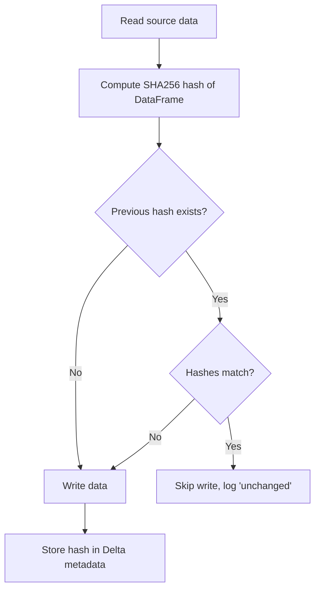

# Skip If Unchanged Pattern

> **Use Case:** Avoid redundant writes for snapshot tables that may not change between pipeline runs.

## The Problem

When ingesting snapshot data (full table extracts without timestamps), an hourly pipeline will append the same 192k rows 24 times per day if the source data doesn't change. This wastes:

- **Storage:** 24× the necessary data
- **Compute:** Unnecessary write operations
- **Query performance:** More files to scan

## The Solution

The `skip_if_unchanged` feature computes a hash of the DataFrame content before writing. If the hash matches the previous write, the write is skipped entirely.

```yaml
nodes:
  - name: bronze_data
    read:
      connection: azure_sql
      format: sql
      table: dbo.MySnapshotTable
    write:
      connection: bronze
      format: delta
      table: my_snapshot_table
      mode: append
      skip_if_unchanged: true
      skip_hash_sort_columns: [P_ID, DateId]  # For deterministic ordering
```

## How It Works



1. **Hash Computation:** Before writing, the entire DataFrame is converted to CSV bytes and hashed with SHA256
2. **Hash Storage:** The hash is stored in Delta table properties (`odibi.content_hash`)
3. **Comparison:** On subsequent runs, the new hash is compared to the stored hash
4. **Skip or Write:** If hashes match, the write is skipped; otherwise, data is written and hash updated

## Configuration Options

| Option | Type | Description |
|--------|------|-------------|
| `skip_if_unchanged` | bool | Enable hash-based skip detection |
| `skip_hash_columns` | list | Subset of columns to hash (default: all) |
| `skip_hash_sort_columns` | list | Columns to sort by before hashing (for determinism) |

## When to Use

✅ **Good fit:**
- Snapshot tables without `updated_at` timestamps
- Reference/dimension data that changes infrequently
- Tables where you don't know the change frequency

❌ **Not recommended:**
- Tables with reliable `updated_at` (use HWM instead)
- Append-only fact tables (new data every run)
- Very large tables (hash computation is expensive)

## Example: Global Manufacturing Data

```yaml
# Pipeline runs hourly for global coverage
# But this table only changes 1-2 times per day

nodes:
  - name: bronze_osmdssds_detail
    read:
      connection: azure_sql
      format: sql
      table: dbo.vw_OSMDSSDSEDetail
    write:
      connection: bronze
      format: delta
      table: osmdssds_detail
      mode: append
      add_metadata: true
      skip_if_unchanged: true
      skip_hash_sort_columns: [P_ID, DateId]
```

**Result:**
- Pipeline checks every hour (data is fresh when needed)
- Only writes when data actually changes (storage efficient)
- Logs show "Skipping write - content unchanged" for skipped runs

## Storage Impact

| Scenario | Daily Writes | Annual Rows (192k/snapshot) |
|----------|--------------|---------------------------|
| No skip (hourly) | 24 | 1.7 billion |
| With skip (2 changes/day) | 2 | 140 million |
| **Savings** | **92%** | **92%** |

## Limitations

1. **Delta only:** Currently only supported for Delta format
2. **Full DataFrame hash:** Computes hash of entire DataFrame (not row-by-row)
3. **Memory:** DataFrame must fit in driver memory for hashing
4. **First run:** Always writes on first run (no previous hash to compare)

## Related Patterns

- [Append-Only Raw Layer](append_only_raw.md) - Bronze layer best practices
- [Incremental Stateful](incremental_stateful.md) - For tables with timestamps
- [Smart Read](smart_read.md) - Full load pattern
