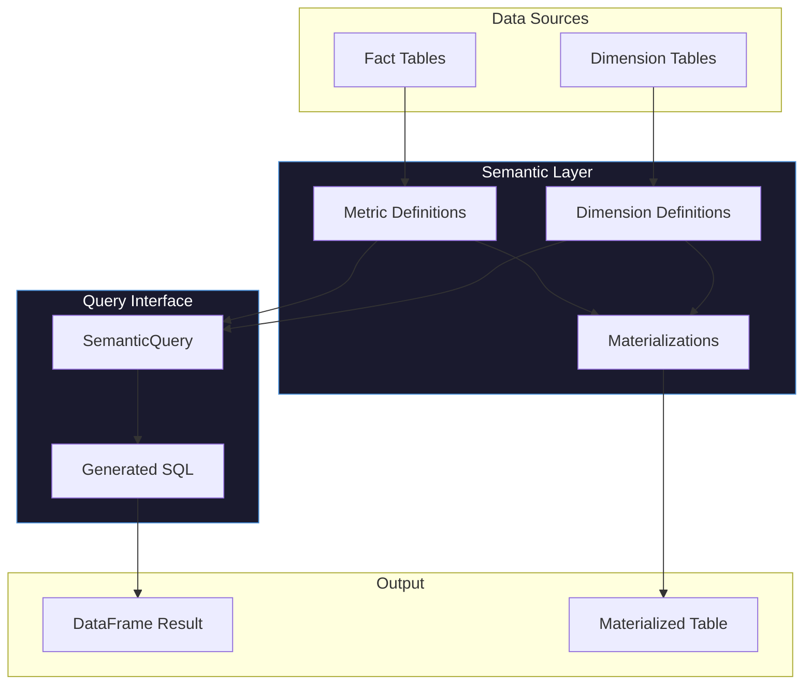
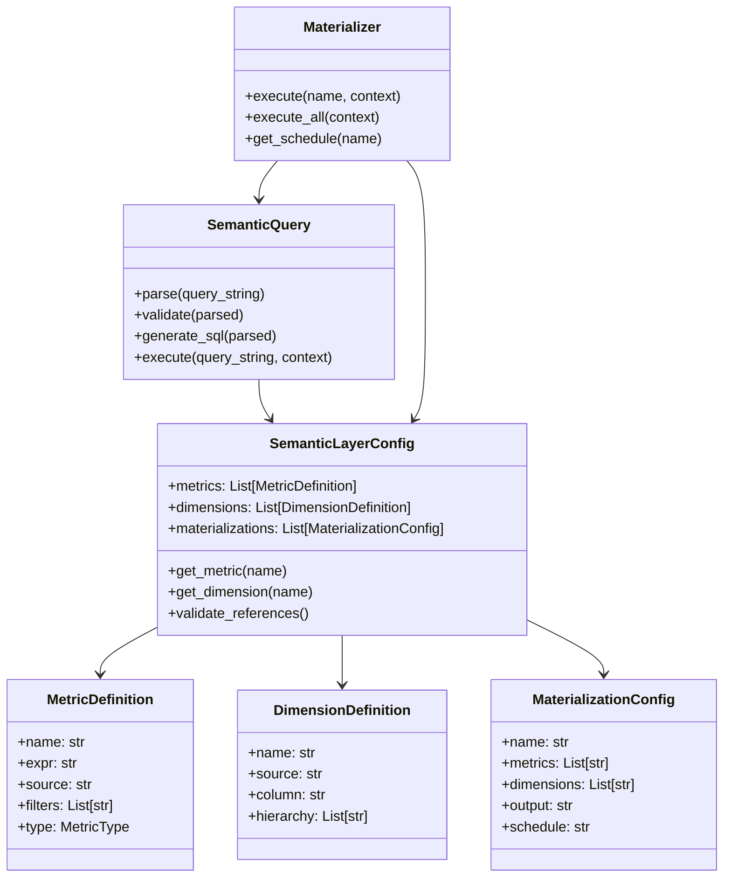

# Semantic Layer

The Odibi Semantic Layer provides a unified interface for defining and querying business metrics. Define metrics once, query them across any dimension combination.

## Overview



## Core Concepts

### Metrics

Metrics are measurable values that can be aggregated across dimensions. Examples:
- **revenue**: `SUM(total_amount)`
- **order_count**: `COUNT(*)`
- **avg_order_value**: `AVG(total_amount)`

Metrics are defined once and can be queried in any combination:

```yaml
metrics:
  - name: revenue
    expr: "SUM(total_amount)"
    source: fact_orders
    filters:
      - "status = 'completed'"
```

See [Defining Metrics](./metrics.md) for full documentation.

### Dimensions

Dimensions are attributes for grouping and filtering metrics. Examples:
- **region**: Geographic region
- **order_date**: Date hierarchy (year > quarter > month > day)
- **category**: Product category

Dimensions support hierarchies for drill-down:

```yaml
dimensions:
  - name: order_date
    source: dim_date
    hierarchy: [year, quarter, month, full_date]
```

See [Defining Metrics](./metrics.md#dimensions) for full documentation.

### Queries

Query the semantic layer with a simple string syntax:

```python
result = query.execute("revenue, order_count BY region, month", context)
```

The query interface:
1. Parses the query string
2. Validates metrics and dimensions exist
3. Generates SQL aggregation
4. Executes against source data
5. Returns DataFrame result

See [Querying](./query.md) for full documentation.

### Materializations

Pre-compute aggregated metrics at specific grain for faster querying:

```yaml
materializations:
  - name: monthly_revenue_by_region
    metrics: [revenue, order_count]
    dimensions: [region, month]
    output: gold/agg_monthly_revenue
    schedule: "0 2 1 * *"  # 2am on 1st of month
```

See [Materializing Metrics](./materialize.md) for full documentation.

---

## Quick Start

### 1. Define Your Semantic Layer

```yaml
# In odibi.yaml or separate semantic_layer.yaml
semantic_layer:
  metrics:
    - name: revenue
      description: "Total revenue from completed orders"
      expr: "SUM(total_amount)"
      source: fact_orders
      filters:
        - "status = 'completed'"
    
    - name: order_count
      expr: "COUNT(*)"
      source: fact_orders
    
    - name: avg_order_value
      expr: "AVG(total_amount)"
      source: fact_orders

  dimensions:
    - name: region
      source: fact_orders
      column: region
    
    - name: month
      source: dim_date
      column: month_name
      hierarchy: [year, quarter, month_name]
    
    - name: category
      source: dim_product
      column: category

  materializations:
    - name: monthly_revenue
      metrics: [revenue, order_count]
      dimensions: [region, month]
      output: gold/agg_monthly_revenue
```

### 2. Query Interactively

```python
from odibi.semantics import SemanticQuery, parse_semantic_config

# Load configuration
config = parse_semantic_config(yaml.safe_load(open("semantic_layer.yaml")))

# Create query interface
query = SemanticQuery(config)

# Execute queries
result = query.execute("revenue BY region", context)
print(result.df)

result = query.execute("revenue, order_count BY region, month", context)
print(result.df)

result = query.execute(
    "revenue BY category WHERE region = 'North'", 
    context
)
print(result.df)
```

### 3. Materialize for Performance

```python
from odibi.semantics import Materializer

materializer = Materializer(config)

# Execute single materialization
result = materializer.execute("monthly_revenue", context)

# Execute all materializations
results = materializer.execute_all(context)
```

---

## Architecture



---

## Benefits

### Single Source of Truth
Define metrics once, use everywhere. No more scattered aggregation logic.

### Self-Service Analytics
Business users can query metrics by name without knowing SQL.

### Performance
Materialize frequently-queried metric combinations for sub-second response.

### Governance
All metric definitions in version control with clear lineage.

---

## Next Steps

- [Defining Metrics](./metrics.md) - Create metric and dimension definitions
- [Querying](./query.md) - Query syntax and examples
- [Materializing](./materialize.md) - Pre-compute and schedule metrics
