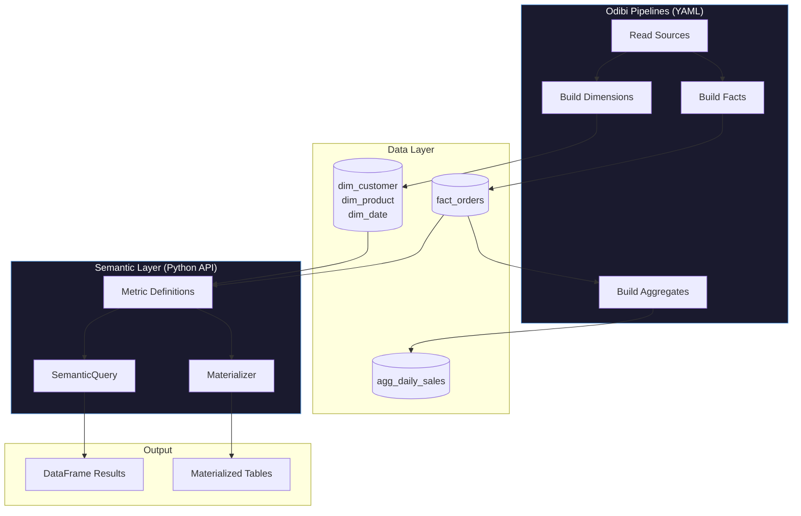
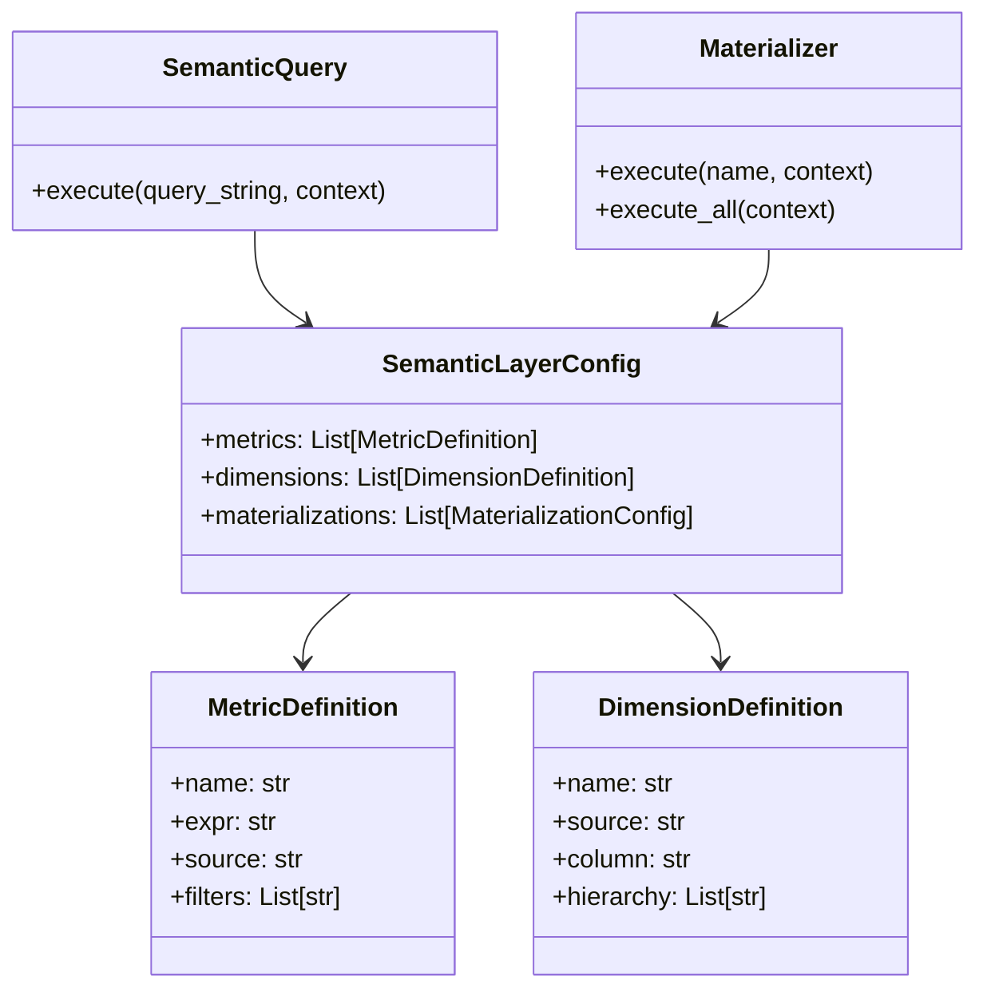

# Semantic Layer

The Odibi Semantic Layer provides a unified interface for defining and querying business metrics. Define metrics once, query them across any dimension combination.

## How It Fits Into Odibi

The semantic layer is a **separate module** from the core pipeline YAML. It's designed for:

1. **Ad-hoc metric queries** via Python API
2. **Scheduled metric materialization** to pre-compute aggregates
3. **Self-service analytics** where business users query by metric name

**It does NOT replace the pipeline YAML** - instead, it works alongside it:
- Pipelines build your **fact and dimension tables**
- The semantic layer **queries those tables** using metric definitions



---

## When to Use What

| Use Case | Solution |
|----------|----------|
| Build dimension tables | Use `transformer: dimension` in pipeline YAML |
| Build fact tables | Use `transformer: fact` in pipeline YAML |
| Build scheduled aggregates | Use `transformer: aggregation` in pipeline YAML |
| Ad-hoc metric queries | Use Semantic Layer Python API |
| Self-service BI metrics | Use Semantic Layer with materialization |

---

## Configuration

The semantic layer is configured via Python, not YAML. You can load config from a YAML file if desired:

```python
from odibi.semantics import SemanticQuery, Materializer, parse_semantic_config
import yaml

# Load from YAML (optional - can also build programmatically)
with open("semantic_config.yaml") as f:
    config = parse_semantic_config(yaml.safe_load(f))

# Query interface
query = SemanticQuery(config)
result = query.execute("revenue BY region", context)

# Materialization
materializer = Materializer(config)
materializer.execute("monthly_revenue", context)
```

### Example semantic_config.yaml

```yaml
metrics:
  - name: revenue
    description: "Total revenue from completed orders"
    expr: "SUM(total_amount)"
    source: fact_orders
    filters:
      - "status = 'completed'"
  
  - name: order_count
    expr: "COUNT(*)"
    source: fact_orders
  
  - name: avg_order_value
    expr: "AVG(total_amount)"
    source: fact_orders

dimensions:
  - name: region
    source: fact_orders
    column: region
  
  - name: month
    source: dim_date
    column: month_name
    hierarchy: [year, quarter, month_name]
  
  - name: category
    source: dim_product
    column: category

materializations:
  - name: monthly_revenue_by_region
    metrics: [revenue, order_count]
    dimensions: [region, month]
    output: gold/agg_monthly_revenue
    schedule: "0 2 1 * *"  # 2am on 1st of month
```

---

## Core Concepts

### Metrics

Metrics are measurable values that can be aggregated across dimensions:

```yaml
metrics:
  - name: revenue
    expr: "SUM(total_amount)"
    source: fact_orders
    filters:
      - "status = 'completed'"
```

### Dimensions

Dimensions are attributes for grouping and filtering:

```yaml
dimensions:
  - name: order_date
    source: dim_date
    hierarchy: [year, quarter, month, full_date]
```

### Queries

Query the semantic layer with a simple string syntax:

```python
result = query.execute("revenue, order_count BY region, month", context)
```

### Materializations

Pre-compute metrics at specific grain:

```yaml
materializations:
  - name: monthly_revenue
    metrics: [revenue, order_count]
    dimensions: [region, month]
    output: gold/agg_monthly_revenue
```

---

## Quick Start

### Option A: Unified Project API (Recommended)

The simplest way to use the semantic layer is through the unified `Project` API, which automatically resolves table paths from your connections:

```python
from odibi import Project

# Load project - semantic layer inherits connections from odibi.yaml
project = Project.load("odibi.yaml")

# Query metrics - tables are auto-loaded from connections
result = project.query("revenue BY region")
print(result.df)

# Multiple metrics and dimensions
result = project.query("revenue, order_count BY region, month")

# With filters
result = project.query("revenue BY category WHERE region = 'North'")
```

**odibi.yaml with semantic layer:**

```yaml
project: my_warehouse
engine: pandas

connections:
  gold:
    type: delta
    path: /mnt/data/gold

pipelines:
  - pipeline: build_warehouse
    nodes:
      - name: fact_orders
        write:
          connection: gold
          table: fact_orders
      - name: dim_customer
        write:
          connection: gold
          table: dim_customer

# Semantic layer at project level
semantic:
  metrics:
    - name: revenue
      expr: "SUM(total_amount)"
      source: $build_warehouse.fact_orders    # References node's write target
      filters:
        - "status = 'completed'"
  
  dimensions:
    - name: region
      source: $build_warehouse.dim_customer   # No path duplication!
      column: region
```

The `source: $build_warehouse.fact_orders` notation tells the semantic layer to:
1. Look up the `fact_orders` node in the `build_warehouse` pipeline
2. Read its `write.connection` and `write.table` config
3. Auto-load the Delta table when queried

**Alternative: connection.path notation**

For external tables not managed by pipelines, use `connection.path`:

```yaml
source: gold.fact_orders              # → /mnt/data/gold/fact_orders
source: gold.oee/plant_a/metrics      # → /mnt/data/gold/oee/plant_a/metrics (nested paths work!)
```

The split happens on the **first dot only**, so subdirectories are supported.

### Option B: Manual Setup

### 1. Build Your Data with Pipelines

First, use standard Odibi pipelines to build your star schema:

```yaml
# odibi.yaml - Build the data layer
project: my_warehouse
engine: spark

connections:
  warehouse:
    type: delta
    path: /mnt/warehouse

story:
  connection: warehouse
  path: stories

pipelines:
  - pipeline: build_star_schema
    nodes:
      - name: dim_customer
        read:
          connection: staging
          path: customers
        transformer: dimension
        params:
          natural_key: customer_id
          surrogate_key: customer_sk
          scd_type: 2
          track_columns: [name, region]
        write:
          connection: warehouse
          path: dim_customer

      - name: fact_orders
        depends_on: [dim_customer]
        read:
          connection: staging
          path: orders
        transformer: fact
        params:
          grain: [order_id]
          dimensions:
            - source_column: customer_id
              dimension_table: dim_customer
              dimension_key: customer_id
              surrogate_key: customer_sk
        write:
          connection: warehouse
          path: fact_orders
```

### 2. Define Semantic Layer

Create a semantic config (Python or YAML):

```python
from odibi.semantics import SemanticLayerConfig, MetricDefinition, DimensionDefinition

config = SemanticLayerConfig(
    metrics=[
        MetricDefinition(
            name="revenue",
            expr="SUM(total_amount)",
            source="fact_orders",
            filters=["status = 'completed'"]
        ),
        MetricDefinition(
            name="order_count",
            expr="COUNT(*)",
            source="fact_orders"
        )
    ],
    dimensions=[
        DimensionDefinition(
            name="region",
            source="dim_customer",
            column="region"
        )
    ]
)
```

### 3. Query Metrics

```python
from odibi.semantics import SemanticQuery
from odibi.context import EngineContext

# Setup context with your data
context = EngineContext(df=None, engine_type=EngineType.SPARK, spark=spark)
context.register("fact_orders", spark.table("warehouse.fact_orders"))
context.register("dim_customer", spark.table("warehouse.dim_customer"))

# Query
query = SemanticQuery(config)
result = query.execute("revenue BY region", context)
print(result.df.show())
```

---

## Architecture



---

## Next Steps

- [Defining Metrics](./metrics.md) - Create metric and dimension definitions
- [Querying](./query.md) - Query syntax and examples
- [Materializing](./materialize.md) - Pre-compute and schedule metrics
- [Pattern Docs](../patterns/README.md) - Build your data layer with patterns
