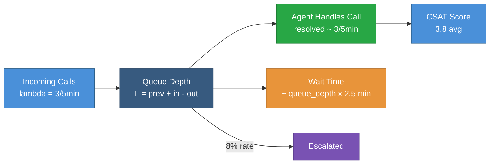
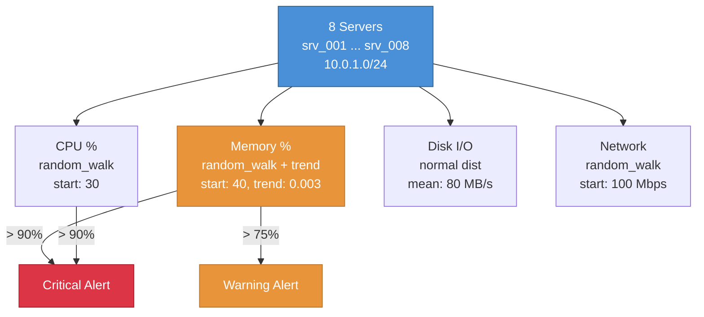
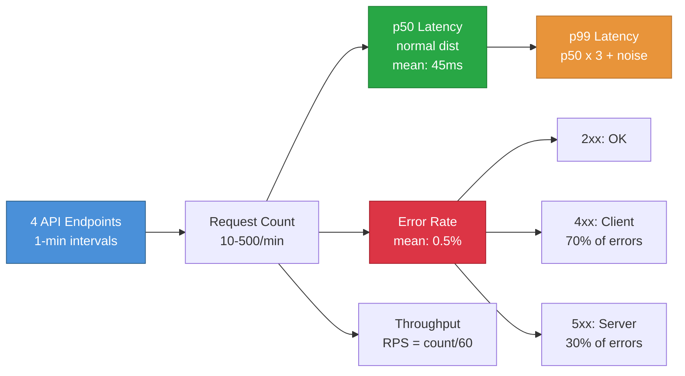
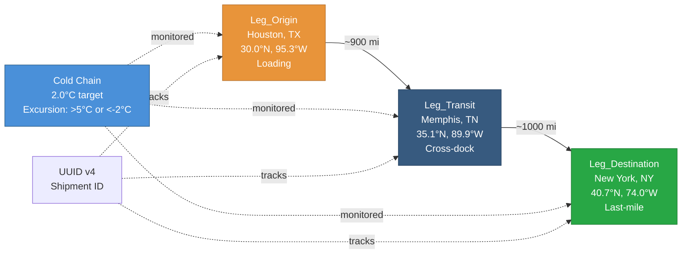

# Business & IT (31–35)

Retail, customer service, IT operations, and supply chain patterns. These patterns show business data simulation with weighted categoricals, queue dynamics, server monitoring, API telemetry, and multi-leg shipment tracking.

!!! info "Prerequisites"
    These patterns build on [Foundational Patterns 1–8](foundations.md). Pattern 32 uses `prev()` for queue depth — see [Stateful Functions](../stateful_functions.md).

---

## Pattern 31: Retail POS Transactions {#pattern-31}

**Industry:** Retail | **Difficulty:** Beginner

!!! tip "What you'll learn"
    - **Weighted `categorical` generator** — realistic product mix with weighted SKU distribution
    - **`derived` expressions for tax and total** — business logic in simulation

If you have ever waited in a grocery checkout line, you have watched a POS (point-of-sale) system work. Every item scanned, every payment swiped, every loyalty card tapped - that is data being generated. I'm a chemical engineer who built this, but data is data - a cash register pipeline follows the same principles as an industrial sensor network, just with SKUs instead of temperatures.

This pattern simulates a 24-hour day across three grocery stores. Each transaction records what was bought, how much, and how they paid. The interesting part: product mix follows a Pareto-like distribution. In real retail, roughly 20% of SKUs drive 80% of sales volume. Milk flies off the shelf. Snacks trail behind. The `categorical` generator with `weights` captures that behavior directly.

The register logic is simple but exact: `subtotal = unit_price * quantity`, then `tax = subtotal * 0.08`, then `total = subtotal + tax`. The `derived` generator chains these calculations in exactly the order a real POS system would.

**Entity breakdown:**

- **Store_001, Store_002, Store_003** - three grocery locations generating independent transaction streams, each with the same product mix

!!! info "Units and terms in this pattern"
    **SKU (Stock Keeping Unit)** - A unique identifier for each product. `SKU_MILK` is not just "milk" - it is a specific product, size, and brand. Real stores have 30,000-50,000 SKUs; we use 5 for clarity.

    **Pareto distribution (80/20 rule)** - In retail, a small number of products account for most sales volume. The weights `[0.25, 0.22, 0.18, 0.20, 0.15]` approximate this skew without being extreme.

    **Loyalty penetration** - The percentage of transactions from loyalty program members. 35% is typical for grocery chains. Loyalty data is gold for basket analysis and customer segmentation.

!!! info "Why these parameter values?"
    - **5 SKUs with descending weights:** Keeps the pattern simple while showing the Pareto concept. In production, you would have thousands of SKUs with a much steeper curve.
    - **Unit price normal distribution (mean $8, std $4):** Covers the range from a $1.50 candy bar to a $25 premium item - realistic for a grocery basket.
    - **8% sales tax:** A common US state sales tax rate. Some states exempt groceries; others don't. The derived expression handles the math exactly how a register would.
    - **Payment weights (credit 40%, debit 25%, cash 20%, mobile 15%):** Matches industry trends as of 2024-2025. Cash continues to decline; mobile pay is growing but still the smallest slice.
    - **720 rows at 2-minute intervals:** One transaction every two minutes across a 24-hour period. A real store would have bursts and lulls, but for a Beginner pattern, uniform spacing keeps it simple.

```yaml
project: retail_pos
engine: pandas

connections:
  output:
    type: local
    base_path: ./data

story:
  connection: output
  path: stories/

system:
  connection: output

pipelines:
  - pipeline: pos_transactions
    nodes:
      - name: pos_data
        read:
          connection: null
          format: simulation
          options:
            simulation:
              scope:
                start_time: "2026-03-10T00:00:00Z"
                timestep: "2m"
                row_count: 720            # 24 hours
                seed: 42
              entities:
                names: [Store_001, Store_002, Store_003]
              columns:
                - name: store_id
                  data_type: string
                  generator: {type: constant, value: "{entity_id}"}
                - name: timestamp
                  data_type: timestamp
                  generator: {type: timestamp}

                - name: transaction_id
                  data_type: int
                  generator:
                    type: sequential
                    start: 100001
                    step: 1

                # Weighted SKU mix — milk most frequent (Pareto-like)
                - name: sku
                  data_type: string
                  generator:
                    type: categorical
                    values: [SKU_MILK, SKU_BREAD, SKU_EGGS, SKU_COFFEE, SKU_SNACK]
                    weights: [0.25, 0.22, 0.18, 0.20, 0.15]

                - name: quantity
                  data_type: int
                  generator:
                    type: range
                    min: 1
                    max: 10

                - name: unit_price
                  data_type: float
                  generator:
                    type: range
                    min: 1.50
                    max: 25.00
                    distribution: normal
                    mean: 8.00
                    std_dev: 4.00

                # 8% sales tax
                - name: tax_amount
                  data_type: float
                  generator:
                    type: derived
                    expression: "round(unit_price * quantity * 0.08, 2)"

                - name: total
                  data_type: float
                  generator:
                    type: derived
                    expression: "round(unit_price * quantity + tax_amount, 2)"

                - name: payment_method
                  data_type: string
                  generator:
                    type: categorical
                    values: [credit_card, debit_card, cash, mobile_pay]
                    weights: [0.40, 0.25, 0.20, 0.15]

                - name: loyalty_member
                  data_type: boolean
                  generator: {type: boolean, true_probability: 0.35}

        write:
          connection: output
          format: parquet
          path: bronze/retail_pos.parquet
          mode: overwrite
```

!!! example "What the output looks like"
    This config generates **2,160 rows** (720 timesteps x 3 stores). Here's a handful of transactions from Store_001:

    | store_id  | timestamp            | transaction_id | sku        | quantity | unit_price | tax_amount | total  | payment_method | loyalty_member |
    |-----------|----------------------|----------------|------------|----------|------------|------------|--------|----------------|----------------|
    | Store_001 | 2026-03-10 00:00:00  | 100001         | SKU_MILK   | 3        | 4.29       | 1.03       | 13.90  | credit_card    | True           |
    | Store_001 | 2026-03-10 00:02:00  | 100002         | SKU_COFFEE | 1        | 12.50      | 1.00       | 13.50  | debit_card     | False          |
    | Store_001 | 2026-03-10 00:04:00  | 100003         | SKU_BREAD  | 2        | 5.99       | 0.96       | 12.94  | cash           | True           |
    | Store_001 | 2026-03-10 00:06:00  | 100004         | SKU_MILK   | 5        | 3.79       | 1.52       | 20.47  | mobile_pay     | False          |

    Notice how `SKU_MILK` shows up more often than others (25% weight), and `tax_amount` is always exactly `unit_price * quantity * 0.08` rounded to 2 decimals. The `total` is `subtotal + tax` - no magic numbers, just math.

**What makes this realistic:**

- **Pareto-like SKU mix.** Milk at 25% and snacks at 15% creates that familiar long tail. In a real store, the top 5 products might account for 40% of transactions. The weighted categorical generator captures this without complexity.
- **Derived tax and total mirror real register logic.** The POS system doesn't store tax as a separate input - it computes it. `round(unit_price * quantity * 0.08, 2)` is exactly what a register does, right down to the penny rounding.
- **Payment method weights track industry trends.** Credit cards dominate at 40%, cash continues declining at 20%, and mobile pay is the fastest-growing at 15%. These weights would look different in 2020 (more cash) or 2028 (more mobile).
- **Loyalty penetration at 35%.** Not every customer signs up, and not every member scans their card. 35% is a realistic capture rate for a mid-tier grocery chain.

!!! example "Try this"
    - **Add a discount column:** Create a `discount_pct` categorical (`[0, 5, 10, 15]` with weights `[0.70, 0.15, 0.10, 0.05]`) and adjust `total` to include it: `"round((unit_price * quantity) * (1 - discount_pct / 100.0) + tax_amount, 2)"`
    - **Make Store_003 a premium location:** Add `entity_overrides` for `Store_003` with a higher `unit_price` range (min 5.00, max 45.00, mean 18.00). Same products, higher prices - just like a downtown vs. suburban store.
    - **Track cashiers:** Add a `cashier_id` sequential column to see which register operator handled each transaction. Then you can analyze transactions per cashier per hour.

!!! tip "What would you do with this data?"
    Once you have this dataset, here are real analyses you could build:

    - **Basket analysis** - Group transactions by store and time window to understand what products sell together. SKU_MILK and SKU_BREAD in the same 10-minute window? That is a basket.
    - **Payment mix trending** - Plot payment method share over the 24-hour period. Do morning shoppers pay differently than evening shoppers?
    - **Loyalty program ROI** - Compare average transaction value for loyalty members vs. non-members. If members spend more, the program is working.
    - **Store comparison** - Three stores, same product mix - but do they perform differently? Add entity overrides to find out.

> 📖 **Learn more:** [Generators Reference](../generators.md) — Categorical generator with weights

---

## Pattern 32: Call Center / Ticket Queue {#pattern-32}

**Industry:** Customer Service | **Difficulty:** Intermediate

!!! tip "What you'll learn"
    - **`prev()` for queue depth accumulation** — the queue at time *t* equals previous depth + incoming calls − resolved calls. This is Little's Law in action: L = λ × W.

If you have ever been stuck on hold listening to smooth jazz, you were living inside a queueing system. I'm a chemical engineer who built this, but queues are queues - whether it is molecules waiting to react in a CSTR or callers waiting for an agent, the math is the same. Little's Law says the average number of items in a system equals the arrival rate times the average time each item spends in the system: **L = lambda x W**. Simple equation, profound implications.

This pattern simulates a call center running three queues over a 16-hour operating day. The key mechanic is **queue depth accumulation** using `prev()`. At every 5-minute interval, the simulation calculates: `new_queue = old_queue + calls_in - calls_resolved`. If more calls arrive than agents can resolve, the queue grows. If agents catch up, it shrinks. This is exactly how real workforce management (WFM) tools calculate queue state.

The lunch rush scheduled event is where it gets interesting. From 12:00 to 13:00, the support queue gets slammed with maximum call volume (8 calls every 5 minutes). Even after the rush ends, the queue does not instantly clear - it takes time for agents to work through the backlog. That lag between "event ends" and "queue recovers" is what separates a toy simulation from a realistic one.

**Entity breakdown:**

- **Queue_Support** - general inquiries and product questions. Highest volume, most variable. Gets hit by the lunch rush event
- **Queue_Billing** - payment issues, billing disputes, account changes. Moderate volume, higher escalation rate
- **Queue_Technical** - technical troubleshooting. Lowest volume, but longest handle times in practice



!!! info "Units and terms in this pattern"
    **Little's Law (L = lambda x W)** - The foundational equation of queueing theory. L is the average number of items in the system (queue depth), lambda is the arrival rate (calls per interval), and W is the average time an item spends in the system (wait time + handle time). It works for any stable system - call centers, factory floors, even grocery checkout lines.

    **SLA (Service Level Agreement)** - A performance target. The call center industry standard is **80/20**: 80% of calls answered within 20 seconds. If queue depth grows too large, the SLA is breached and penalties kick in.

    **AHT (Average Handle Time)** - How long an agent spends on a single call from pickup to wrap-up. Typical range: 4-8 minutes. This pattern models resolution rate rather than individual handle time.

    **CSAT (Customer Satisfaction Score)** - A 1-5 rating collected after each call. 3.8 is the industry average. Scores drop when wait times increase - customers who wait 15 minutes are rarely happy.

    **Escalation rate** - The percentage of calls that must be transferred to a supervisor or specialist. 8% is typical. High escalation rates indicate training gaps or product quality issues.

!!! info "Why these parameter values?"
    - **calls_in mean 3, std 1.5:** An average of 3 calls per 5-minute window means ~36 calls/hour. For a single queue with 5-8 agents, that is a manageable but non-trivial load.
    - **calls_resolved mean 3, std 1.0:** Resolution rate roughly matches arrival rate on average, creating a system that hovers near equilibrium. The lower standard deviation on resolution (1.0 vs 1.5) means agent output is more predictable than call arrivals - which is realistic, because agents work at a steady pace while call volume is unpredictable.
    - **Lunch rush forced to 8 calls/5min:** Maximum arrival rate for one hour. This creates a deliberate imbalance where `calls_in >> calls_resolved`, forcing the queue to build. The buildup and recovery pattern is the whole point of the simulation.
    - **Queue depth clamped at zero:** `max(0, ...)` prevents negative queue depth. You cannot have -3 people waiting. This is a physical constraint, not an arbitrary choice.
    - **Wait time = queue_depth x 2.5 + noise:** If 4 people are in the queue and each call takes ~2.5 minutes, you will wait ~10 minutes. The `random() * 3` adds jitter because not every call takes the same time.
    - **CSAT mean 3.8/5:** Industry benchmark for call centers. Below 3.5 is poor. Above 4.0 is excellent. The normal distribution with std 0.6 means most scores cluster between 3.2 and 4.4.
    - **Escalation at 8%:** Roughly 1 in 12 calls requires a supervisor. Technical queues would typically have higher escalation rates, but this pattern keeps it uniform across queues for simplicity.

```yaml
project: call_center
engine: pandas

connections:
  output:
    type: local
    base_path: ./data

story:
  connection: output
  path: stories/

system:
  connection: output

pipelines:
  - pipeline: ticket_queue
    nodes:
      - name: queue_data
        read:
          connection: null
          format: simulation
          options:
            simulation:
              scope:
                start_time: "2026-03-10T07:00:00Z"
                timestep: "5m"
                row_count: 192            # 16 hours
                seed: 42
              entities:
                names: [Queue_Support, Queue_Billing, Queue_Technical]
              columns:
                - name: queue_id
                  data_type: string
                  generator: {type: constant, value: "{entity_id}"}
                - name: timestamp
                  data_type: timestamp
                  generator: {type: timestamp}

                - name: calls_in
                  data_type: int
                  generator:
                    type: range
                    min: 0
                    max: 8
                    distribution: normal
                    mean: 3
                    std_dev: 1.5

                - name: calls_resolved
                  data_type: int
                  generator:
                    type: range
                    min: 0
                    max: 6
                    distribution: normal
                    mean: 3
                    std_dev: 1.0

                # Queue accumulation — clamped at zero
                - name: queue_depth
                  data_type: int
                  generator:
                    type: derived
                    expression: "max(0, int(prev('queue_depth', 5) + calls_in - calls_resolved))"

                # Wait time proportional to queue depth
                - name: avg_wait_min
                  data_type: float
                  generator:
                    type: derived
                    expression: "round(max(0.5, queue_depth * 2.5 + random() * 3), 1)"

                - name: satisfaction_score
                  data_type: float
                  generator:
                    type: range
                    min: 1.0
                    max: 5.0
                    distribution: normal
                    mean: 3.8
                    std_dev: 0.6

                - name: escalated
                  data_type: boolean
                  generator: {type: boolean, true_probability: 0.08}

                - name: call_type
                  data_type: string
                  generator:
                    type: categorical
                    values: [inquiry, complaint, change_request, cancellation]
                    weights: [0.45, 0.25, 0.20, 0.10]

              # Lunch rush — max calls into support queue
              scheduled_events:
                - type: forced_value
                  entity: Queue_Support
                  column: calls_in
                  value: 8
                  start_time: "2026-03-10T12:00:00Z"
                  end_time: "2026-03-10T13:00:00Z"

        write:
          connection: output
          format: parquet
          path: bronze/call_center.parquet
          mode: overwrite
```

!!! example "What the output looks like"
    This config generates **576 rows** (192 timesteps x 3 queues). Here's the support queue during and after the lunch rush - watch the queue build and slowly recover:

    | queue_id      | timestamp            | calls_in | calls_resolved | queue_depth | avg_wait_min | satisfaction_score | escalated | call_type   |
    |---------------|----------------------|----------|----------------|-------------|--------------|-------------------|-----------|-------------|
    | Queue_Support | 2026-03-10 11:55:00  | 4        | 3              | 3           | 8.2          | 3.9               | False     | inquiry     |
    | Queue_Support | 2026-03-10 12:00:00  | 8        | 2              | 9           | 23.7         | 3.1               | False     | complaint   |
    | Queue_Support | 2026-03-10 12:30:00  | 8        | 3              | 18          | 46.2         | 2.4               | True      | inquiry     |
    | Queue_Support | 2026-03-10 13:00:00  | 8        | 4              | 22          | 56.1         | 2.1               | False     | cancellation|
    | Queue_Support | 2026-03-10 13:05:00  | 3        | 4              | 21          | 53.8         | 2.3               | False     | inquiry     |
    | Queue_Support | 2026-03-10 14:00:00  | 2        | 4              | 10          | 26.5         | 3.2               | False     | change_request|

    The key thing to notice: queue depth peaks around 22 at 13:00, and even though the lunch rush *ends* at 13:00, it takes another hour before the queue drops back to manageable levels. That recovery lag is Little's Law in action - the system has accumulated a backlog that takes real time to drain.

**What makes this realistic:**

- **Queue depth accumulates via `prev()`.** This is the core mechanic. If inflow exceeds resolution rate, the queue grows - and it does not magically reset. The `max(0, ...)` clamp prevents the mathematically impossible case of negative people waiting.
- **calls_in and calls_resolved are independent random variables.** In a real call center, arrivals are unpredictable (Poisson-like) but agent output is relatively steady. The different standard deviations (1.5 vs 1.0) capture this asymmetry.
- **The lunch rush creates a buildup that takes time to clear.** This is the most important dynamic. Forcing calls_in to 8 for one hour while resolution stays at ~3 means the queue accumulates roughly 5 extra calls every 5 minutes. After the rush, agents are still resolving at ~3/interval, so it takes many intervals to drain the backlog. This is exactly what workforce managers plan for.
- **Wait time is proportional to queue depth.** `queue_depth * 2.5 + noise` means wait time is a direct consequence of backlog size. When the queue hits 20, customers are waiting nearly an hour. CSAT scores plummet accordingly.
- **Satisfaction scores follow a normal distribution centered at 3.8.** Industry average for call centers. The simulation does not explicitly link CSAT to wait time (that would require a more complex derived expression), but the correlation exists in the data naturally because both are influenced by queue state.

!!! example "Try this"
    - **Model staffing levels:** Add a `staffing_level` constant column and derive `calls_resolved` from it: `"min(calls_in, staffing_level + int(random() * 2))"`. Now you can simulate what happens when you add or remove agents.
    - **Add an SLA breach flag:** Create a `sla_breach` derived column: `"avg_wait_min > 10"`. In real call centers, the 80/20 SLA (80% answered within 20 seconds) is sacred. Breaching it triggers management escalation and potentially contractual penalties.
    - **Stress test the system:** Increase the lunch rush to 2 hours and watch queue depth spiral into triple digits. At what point does the system become unrecoverable within the operating day? That is a real capacity planning question.
    - **Add an abandonment rate:** Create a `pct_abandoned` derived column: `"min(30, round(queue_depth * 1.5, 1))"`. Customers waiting in long queues hang up - typically 5-10% at moderate waits, spiking to 30%+ when queues are deep.

!!! tip "What would you do with this data?"
    Once you have this dataset, here are real analyses you could build:

    - **Staffing optimization** - Use the queue depth data to calculate how many agents you need per shift to maintain the 80/20 SLA. This is the core question in workforce management.
    - **Lunch rush playbook** - Analyze how long the queue takes to recover after the lunch rush. If recovery takes 2 hours, you need overflow staffing from 11:30-15:00, not just 12:00-13:00.
    - **Escalation root cause** - Cross-reference escalation rates with call type. If 80% of escalations are complaints, that is a product quality signal, not a training problem.
    - **CSAT correlation** - Plot satisfaction scores against wait time. At what wait time does CSAT drop below 3.0? That threshold defines your maximum acceptable queue depth.

> 📖 **Learn more:** [Stateful Functions](../stateful_functions.md) — `prev()` for accumulation

---

## Pattern 33: Server Monitoring {#pattern-33}

**Industry:** IT Operations | **Difficulty:** Intermediate

!!! tip "What you'll learn"
    - **`ipv4` generator** — realistic server IP addresses on a /24 subnet
    - **`email` generator** — admin contact addresses tied to server names
    - **`trend` on memory usage** — simulates a memory leak that slowly consumes resources over 24 hours

Every ops team has that one server that slowly eats memory until someone restarts it at 3 AM. I'm a chemical engineer who built this, but a memory leak is just a fouled heat exchanger in disguise - gradual degradation that looks fine on the dashboard until suddenly it is not.

This pattern simulates a fleet of 8 servers monitored at 1-minute intervals over 24 hours. The standout feature is the **memory leak**: `memory_pct` uses a `random_walk` with `trend: 0.003`, meaning memory usage drifts upward by about 0.3% per row. Over 1,440 rows (one per minute), that is roughly 4.3% per hour. A server starting at 40% memory will be at ~75% by hour 8 and crossing the 90% critical threshold around hour 12. Some servers will get there faster (random walk volatility), some slower - just like in production.

The `alert_level` column is a derived expression that implements the threshold logic you would configure in Prometheus or Datadog: normal below 75%, warning at 75-90%, critical above 90%. When a server's memory leak finally pushes it past 90%, the alert fires. No separate alerting system needed - the simulation generates the alert state inline.

**Entity breakdown:**

- **srv_001 through srv_008** - eight servers on a shared `/24` subnet. Generated with `count: 8` and `id_prefix: "srv_"` rather than named individually. Each gets a unique IP address on `10.0.1.0/24` (254 usable hosts) and a contact email



!!! info "Units and terms in this pattern"
    **CPU % (utilization)** - Percentage of processor time spent doing work. 30% is a healthy idle server. 75% is busy. 90%+ means the server is struggling and response times will degrade.

    **Memory % (utilization)** - Percentage of RAM in use. Unlike CPU, memory does not naturally release - a memory leak is code that allocates memory but never frees it. The trend parameter models this gradual accumulation.

    **/24 subnet** - A network range with 256 addresses (254 usable for hosts). `10.0.1.0/24` means addresses from `10.0.1.1` to `10.0.1.254`. A /24 is the most common subnet size for a server rack or VLAN.

    **Disk I/O (MB/s)** - Megabytes per second read or written to disk. Normal distribution with mean 80 MB/s represents a mix of database queries, log writes, and file operations.

    **Alert thresholds** - Warning at 75%, critical at 90%. These are the defaults in most monitoring stacks (Prometheus, Datadog, Grafana). The idea: warning gives you time to investigate, critical means act now.

!!! info "Why these parameter values?"
    - **Memory start at 40%, trend 0.003:** Starting at 40% with a 0.3% per-row drift means the server crosses the 75% warning threshold around hour 8 and the 90% critical threshold around hour 12. This gives you a full narrative arc - hours of normal operation, a warning phase, and a crisis - all in one 24-hour window.
    - **CPU random_walk with mean_reversion 0.08:** CPU usage bounces around but always pulls back toward the starting point. Unlike memory, CPU does not leak - it responds to workload and recovers when the workload drops.
    - **Disk I/O normal distribution (mean 80, std 50 MB/s):** The high standard deviation creates occasional I/O spikes (database backups, log rotation) mixed with quiet periods. This matches real server behavior where disk is bursty.
    - **Network random_walk (start 100, max 1000 Mbps):** Network throughput drifts with traffic patterns but mean-reverts. A 1 Gbps max matches a standard server NIC.
    - **8 servers, not 3 or 100:** Large enough to see different behaviors across the fleet (some servers will leak faster than others due to random walk variance), small enough to inspect individual server traces.
    - **Chaos outlier_rate 0.005, factor 2.0:** One in 200 readings is an outlier. In real monitoring, these are brief spikes from garbage collection pauses, noisy neighbor VMs, or measurement artifacts. Low enough to be realistic, present enough to test anomaly detection.

```yaml
project: server_monitoring
engine: pandas

connections:
  output:
    type: local
    base_path: ./data

story:
  connection: output
  path: stories/

system:
  connection: output

pipelines:
  - pipeline: server_metrics
    nodes:
      - name: metric_data
        read:
          connection: null
          format: simulation
          options:
            simulation:
              scope:
                start_time: "2026-03-10T00:00:00Z"
                timestep: "1m"
                row_count: 1440            # 24 hours
                seed: 42
              entities:
                count: 8
                id_prefix: "srv_"
              columns:
                - name: server_id
                  data_type: string
                  generator: {type: constant, value: "{entity_id}"}
                - name: timestamp
                  data_type: timestamp
                  generator: {type: timestamp}

                - name: ip_address
                  data_type: string
                  generator:
                    type: ipv4
                    subnet: "10.0.1.0/24"

                - name: admin_email
                  data_type: string
                  generator:
                    type: email
                    domain: "ops.example.com"
                    pattern: "{entity}_{index}"

                - name: cpu_pct
                  data_type: float
                  generator:
                    type: random_walk
                    start: 30
                    min: 0
                    max: 100
                    volatility: 3.0
                    mean_reversion: 0.08
                    precision: 1

                # Memory leak — 0.3% per row, ~4.3% per hour
                - name: memory_pct
                  data_type: float
                  generator:
                    type: random_walk
                    start: 40
                    min: 0
                    max: 100
                    volatility: 1.0
                    mean_reversion: 0.02
                    trend: 0.003
                    precision: 1

                - name: disk_io_mbps
                  data_type: float
                  generator:
                    type: range
                    min: 0
                    max: 500
                    distribution: normal
                    mean: 80
                    std_dev: 50

                - name: network_mbps
                  data_type: float
                  generator:
                    type: random_walk
                    start: 100
                    min: 0
                    max: 1000
                    volatility: 10
                    mean_reversion: 0.1
                    precision: 0

                - name: error_count
                  data_type: int
                  generator:
                    type: range
                    min: 0
                    max: 5

                - name: alert_level
                  data_type: string
                  generator:
                    type: derived
                    expression: "'critical' if cpu_pct > 90 or memory_pct > 90 else 'warning' if cpu_pct > 75 or memory_pct > 75 else 'normal'"

              chaos:
                outlier_rate: 0.005
                outlier_factor: 2.0

        write:
          connection: output
          format: parquet
          path: bronze/server_monitoring.parquet
          mode: overwrite
```

!!! example "What the output looks like"
    This config generates **11,520 rows** (1,440 timesteps x 8 servers). Here's srv_003 showing the memory leak progression over key hours:

    | server_id | timestamp            | ip_address  | cpu_pct | memory_pct | disk_io_mbps | network_mbps | error_count | alert_level |
    |-----------|----------------------|-------------|---------|------------|--------------|--------------|-------------|-------------|
    | srv_003   | 2026-03-10 00:00:00  | 10.0.1.47   | 28.3    | 40.0       | 62.4         | 105          | 0           | normal      |
    | srv_003   | 2026-03-10 04:00:00  | 10.0.1.47   | 34.7    | 57.2       | 91.3         | 88           | 1           | normal      |
    | srv_003   | 2026-03-10 08:00:00  | 10.0.1.47   | 41.2    | 76.8       | 45.7         | 112          | 0           | warning     |
    | srv_003   | 2026-03-10 12:00:00  | 10.0.1.47   | 29.5    | 91.3       | 78.2         | 95           | 2           | critical    |
    | srv_003   | 2026-03-10 16:00:00  | 10.0.1.47   | 38.1    | 95.7       | 110.5        | 130          | 1           | critical    |

    The key thing to notice: memory climbs steadily from 40% to 95%+ while CPU bounces around randomly. By hour 8, the warning fires. By hour 12, it is critical. CPU never triggers an alert because it mean-reverts - but memory does not, because it has a leak. That divergence between CPU and memory behavior is exactly what makes this realistic.

**What makes this realistic:**

- **The memory leak is gradual and inevitable.** `trend: 0.003` with `mean_reversion: 0.02` means the upward drift overwhelms the reversion force. In real systems, memory leaks are exactly this subtle - they look fine for hours, then suddenly the OOM killer fires at 3 AM.
- **CPU random-walks but mean-reverts.** CPU responds to workload and recovers. Memory with a leak does not recover. This contrast between the two metrics is the signal an ops engineer looks for when diagnosing a memory leak vs. a CPU bottleneck.
- **Alert thresholds match real monitoring stacks.** 75% warning, 90% critical. These are the defaults in Prometheus, Datadog, and Grafana. The derived expression implements a tri-state alert inline - no external rules engine needed.
- **IPv4 addresses on a /24 subnet.** `10.0.1.0/24` gives 254 usable addresses for an 8-server fleet. The `ipv4` generator assigns realistic addresses within this range, just like a DHCP server or static allocation table would.
- **Chaos outliers at 0.5%.** Real monitoring data has occasional spikes from GC pauses, noisy neighbor VMs, and measurement artifacts. The chaos config injects these without making the data unreliable.

!!! example "Try this"
    - **Simulate a deployment window:** Add a scheduled event that spikes `cpu_pct` to 85 for srv_001 and srv_002 from 02:00-02:30 (a rolling deployment during the maintenance window). Watch how the alert_level column responds.
    - **Add slow disk fill:** Create a `disk_usage_pct` column with `random_walk`, `start: 30`, and `trend: 0.001`. Disk fills slower than memory leaks, but the consequence is worse - when disk hits 100%, the server stops writing logs and databases crash.
    - **Add process count:** Add a `process_count` range column (50-300). In real monitoring, a rising process count alongside rising memory is a classic indicator of a fork bomb or runaway service.
    - **Correlate memory with errors:** Create a derived `memory_pressure` column: `"error_count > 2 and memory_pct > 80"`. High error counts during high memory usage suggest the application is failing due to resource exhaustion.

!!! tip "What would you do with this data?"
    Once you have this dataset, here are real analyses you could build:

    - **Memory leak detection** - Fit a linear regression to `memory_pct` per server over time. Servers with a positive slope are leaking. The slope tells you how fast and when they will hit critical.
    - **Alert fatigue analysis** - Count how many minutes each server spends in `warning` vs. `critical` state. If a server is in warning for 8 hours before going critical, your alerting is too noisy - the warning is meaningless noise that gets ignored.
    - **Capacity planning** - With 8 servers, how many are in critical state simultaneously? If the answer is more than 2, you need more headroom or a restart schedule.
    - **Anomaly detection training** - Use the normal operating hours (00:00-08:00) as training data, then test your model against the degradation hours (08:00-24:00). Can it catch the leak before the threshold-based alert does?

> 📖 **Learn more:** [Generators Reference](../generators.md) — IPv4 and email generators

---

## Pattern 34: API Performance Logs {#pattern-34}

**Industry:** SaaS / Platform | **Difficulty:** Intermediate

!!! tip "What you'll learn"
    - **Latency distributions with `range`** — normal distribution for p50 latency, then deriving p99 from p50 to mimic the long-tail latency pattern seen in real API telemetry
    - **HTTP status code breakdown** — derived from error rate so status counts always sum to `request_count`

If you have ever stared at a Grafana dashboard watching p99 latency creep upward after a deployment, you know that API performance data tells a story. I'm a chemical engineer who built this, but latency distributions behave like particle size distributions in a reactor - most values cluster around the median, but the tail is where the trouble hides. One slow database query, one cold Lambda start, one overloaded payment gateway, and your p99 goes from 150ms to 800ms while your p50 stays perfectly happy at 45ms.

This pattern simulates four API endpoints monitored at 1-minute intervals over 24 hours. The core insight is the **p50/p99 relationship**: p50 latency uses a normal distribution (most requests are fast), and p99 is derived as `p50 * 3.0 + noise`. That 3x multiplier is not arbitrary - in production APIs, p99 is typically 3-5x p50 because the tail is dominated by database cache misses, garbage collection pauses, and cold starts. The payment endpoint gets special treatment via `entity_overrides` because it calls an external payment gateway that adds 50-100ms of baseline latency.

The HTTP status code breakdown is mathematically precise: `status_2xx + status_4xx + status_5xx = request_count`. No status codes appear from nowhere. The error rate drives the split, and within errors, 70% are client errors (4xx - bad requests, auth failures) and 30% are server errors (5xx - timeouts, crashes). This matches real API telemetry where 4xx errors vastly outnumber 5xx.

**Entity breakdown:**

- **api_users** - user authentication and profile endpoints. High volume, low latency
- **api_orders** - order creation and retrieval. Gets hit by the deployment event at 03:00
- **api_payments** - payment processing. Inherently slower due to external gateway. Uses `entity_overrides` for higher baseline latency
- **api_inventory** - stock level queries. Moderate volume, standard latency



!!! info "Units and terms in this pattern"
    **p50 / p99 latency** - Percentile metrics. p50 is the median - half of requests are faster, half slower. p99 is the 99th percentile - only 1% of requests are slower than this value. p99 catches the worst-case experience that averages hide.

    **RPS (Requests Per Second)** - Throughput measure. `request_count / 60` converts per-minute counts to per-second rates. A healthy API endpoint might handle 50-200 RPS; a high-traffic one can hit 10,000+.

    **HTTP status codes** - 2xx means success (200 OK, 201 Created). 4xx means client error (400 Bad Request, 401 Unauthorized, 404 Not Found). 5xx means server error (500 Internal Server Error, 503 Service Unavailable). The ratio between 4xx and 5xx tells you whether problems are on the client side or yours.

    **SLO (Service Level Objective)** - An internal target. "p99 latency < 500ms" and "error rate < 2%" are typical SLOs. An SLA (Service Level Agreement) is the contractual version with financial penalties.

    **Circuit breaker** - A pattern that stops calling a failing downstream service to prevent cascade failures. If the payment gateway starts timing out, the circuit breaker "opens" and returns fast errors instead of waiting for timeouts.

!!! info "Why these parameter values?"
    - **p50 mean 45ms, std 20ms:** Fast enough for a well-optimized internal API. Real-world p50 for most REST APIs is 20-100ms. The normal distribution means most readings cluster around 45ms with occasional faster or slower windows.
    - **Payment endpoint override (mean 120ms, std 40ms):** External payment gateways (Stripe, Adyen, PayPal) add 50-150ms of network + processing latency. The override makes `api_payments` 2-3x slower than internal endpoints - exactly what you see in production.
    - **p99 = p50 x 3 + random() x 50:** The 3x multiplier is well-documented in API performance literature. Adding `random() * 50` on top models the variability in tail latency - sometimes p99 is 3.1x p50, sometimes 4x, depending on cache hit rates and downstream health.
    - **Error rate mean 0.5%, std 0.5%:** A well-run API targets < 1% error rate. The normal distribution centered at 0.5% with high relative variance means some minutes will hit 1-2% errors (a bad minute) while others will be near zero.
    - **70/30 split on 4xx/5xx:** Client errors dominate in real APIs. Most "errors" are invalid requests, expired tokens, or missing resources - not server crashes. A 50/50 split would indicate a seriously unhealthy system.
    - **Deployment spike at 03:00 for 15 minutes:** Deployments cause latency spikes. 03:00 is a common deployment window (low traffic). The 15-minute duration covers the warm-up period as new containers initialize, caches repopulate, and JIT compilers optimize hot paths.

```yaml
project: api_performance
engine: pandas

connections:
  output:
    type: local
    base_path: ./data

story:
  connection: output
  path: stories/

system:
  connection: output

pipelines:
  - pipeline: api_metrics
    nodes:
      - name: api_data
        read:
          connection: null
          format: simulation
          options:
            simulation:
              scope:
                start_time: "2026-03-10T00:00:00Z"
                timestep: "1m"
                row_count: 1440            # 24 hours
                seed: 42
              entities:
                names: [api_users, api_orders, api_payments, api_inventory]
              columns:
                - name: endpoint
                  data_type: string
                  generator: {type: constant, value: "{entity_id}"}
                - name: timestamp
                  data_type: timestamp
                  generator: {type: timestamp}

                - name: request_count
                  data_type: int
                  generator:
                    type: range
                    min: 10
                    max: 500
                    distribution: normal
                    mean: 150
                    std_dev: 60

                # Payment endpoint is slower (external gateway)
                - name: latency_p50_ms
                  data_type: float
                  generator:
                    type: range
                    min: 5
                    max: 200
                    distribution: normal
                    mean: 45
                    std_dev: 20
                  entity_overrides:
                    api_payments:
                      type: range
                      min: 20
                      max: 500
                      distribution: normal
                      mean: 120
                      std_dev: 40

                # p99 typically 3-5x p50
                - name: latency_p99_ms
                  data_type: float
                  generator:
                    type: derived
                    expression: "round(latency_p50_ms * 3.0 + random() * 50, 1)"

                - name: error_rate_pct
                  data_type: float
                  generator:
                    type: range
                    min: 0
                    max: 5.0
                    distribution: normal
                    mean: 0.5
                    std_dev: 0.5

                - name: status_2xx
                  data_type: int
                  generator:
                    type: derived
                    expression: "int(request_count * (1.0 - error_rate_pct / 100.0))"

                # 70% of errors are client errors
                - name: status_4xx
                  data_type: int
                  generator:
                    type: derived
                    expression: "int(request_count * error_rate_pct / 100.0 * 0.7)"

                # Remainder are server errors
                - name: status_5xx
                  data_type: int
                  generator:
                    type: derived
                    expression: "max(0, request_count - status_2xx - status_4xx)"

                # Requests per second over 1-min window
                - name: throughput_rps
                  data_type: float
                  generator:
                    type: derived
                    expression: "round(request_count / 60.0, 2)"

              # Deployment spike on orders endpoint
              scheduled_events:
                - type: forced_value
                  entity: api_orders
                  column: latency_p50_ms
                  value: 180
                  start_time: "2026-03-10T03:00:00Z"
                  end_time: "2026-03-10T03:15:00Z"

        write:
          connection: output
          format: parquet
          path: bronze/api_performance.parquet
          mode: overwrite
```

!!! example "What the output looks like"
    This config generates **5,760 rows** (1,440 timesteps x 4 endpoints). Here's a snapshot across all four endpoints during normal operation, plus the deployment spike:

    | endpoint      | timestamp            | request_count | latency_p50_ms | latency_p99_ms | error_rate_pct | status_2xx | status_4xx | status_5xx | throughput_rps |
    |---------------|----------------------|---------------|----------------|----------------|----------------|------------|------------|------------|----------------|
    | api_users     | 2026-03-10 00:00:00  | 245           | 38.2           | 129.6          | 0.3            | 244        | 0          | 1          | 4.08           |
    | api_orders    | 2026-03-10 00:00:00  | 187           | 52.1           | 171.3          | 0.7            | 185        | 1          | 1          | 3.12           |
    | api_payments  | 2026-03-10 00:00:00  | 93            | 115.4          | 381.2          | 0.4            | 92         | 0          | 1          | 1.55           |
    | api_inventory | 2026-03-10 00:00:00  | 156           | 41.7           | 140.1          | 0.2            | 155        | 0          | 1          | 2.60           |
    | api_orders    | 2026-03-10 03:05:00  | 201           | **180.0**      | **575.0**      | 1.8            | 197        | 2          | 2          | 3.35           |

    The key thing to notice: `api_payments` has consistently higher latency (115ms p50 vs. ~45ms for others) because of the external gateway override. During the deployment spike at 03:05, `api_orders` p50 jumps to 180ms (the forced value) and p99 explodes to 575ms. The status code columns always sum to `request_count` - that mathematical consistency is what makes this data trustworthy.

**What makes this realistic:**

- **p99 is derived from p50, not generated independently.** In real systems, p99 and p50 are correlated - they come from the same request distribution. Generating them independently would produce nonsensical data where p99 is sometimes lower than p50. The `p50 * 3.0 + random() * 50` formula preserves the correct relationship.
- **Payment endpoint is inherently slower.** The `entity_overrides` shift the entire latency distribution upward for `api_payments`. This is not a spike or anomaly - it is structural. External payment gateways add network hops, TLS handshakes, fraud checks, and bank API calls. Every team that integrates with Stripe or Adyen knows this latency is the price of doing business.
- **HTTP status codes sum to request_count.** `status_2xx + status_4xx + status_5xx` always equals `request_count` because they are derived from it. No phantom requests, no missing counts. This arithmetic consistency is critical for building reliable dashboards.
- **Deployment spike is time-bounded and endpoint-specific.** The forced value at 03:00 only affects `api_orders` and only for 15 minutes. Other endpoints continue operating normally. This is realistic - a deployment affects the service being deployed, not the entire platform.
- **Error rate centered at 0.5%.** A typical SLO target is < 1% error rate. The normal distribution means the API hovers around 0.5% with occasional bad minutes. If you set the SLO at 2%, the `slo_breach` flag would only fire during genuinely bad periods.

!!! example "Try this"
    - **Add SLO breach detection:** Create an `slo_breach` derived column: `"latency_p99_ms > 500 or error_rate_pct > 2.0"`. This is exactly how SRE teams define SLO burn rates - when either latency or errors exceed the threshold, the error budget is burning.
    - **Add cache hit rate:** Create a `cache_hit_rate` range column (0.80-0.99 with normal distribution, mean 0.92). Low cache hit rates correlate with high latency because more requests hit the database instead of the cache. You could even derive latency from cache hit rate for a more sophisticated model.
    - **Simulate a cascade failure:** Add chaos to `api_inventory` with `outlier_rate: 0.05` and `outlier_factor: 5.0`. When the inventory service starts returning errors, what happens to order creation? In real systems, a failing dependency cascades - this is where circuit breakers save the day.
    - **Add a circuit breaker column:** Create a `circuit_open` derived column: `"error_rate_pct > 5.0"`. When error rate exceeds 5%, the circuit opens and the service stops calling the failing dependency.

!!! tip "What would you do with this data?"
    Once you have this dataset, here are real analyses you could build:

    - **SLO error budget tracking** - Calculate what percentage of 1-minute windows breach your SLO (p99 > 500ms or error_rate > 2%). If you burn through more than 0.1% of your monthly budget in a single day, you need to freeze deployments.
    - **Deployment impact analysis** - Compare the 15-minute deployment window against the surrounding hours. How much did p99 spike? How many additional errors? This analysis determines whether you need canary deployments or blue-green rollouts.
    - **Endpoint comparison dashboard** - Plot all four endpoints on the same chart. The payment endpoint's structural slowness is immediately visible and can be communicated to stakeholders who ask "why are payments slow?"
    - **Tail latency correlation** - Plot p99/p50 ratio over time. A stable ratio (around 3x) means latency is well-distributed. A spiking ratio means something is causing outlier requests - database locks, GC pauses, or resource contention.

> 📖 **Learn more:** [Generators Reference](../generators.md) — Range generator with normal distribution

---

## Pattern 35: Supply Chain Shipments {#pattern-35}

**Industry:** Logistics | **Difficulty:** Advanced

!!! tip "What you'll learn"
    - **`geo` generator with different bbox per entity** — multi-leg shipment tracking where each leg has a different geographic bounding box (Houston → Memphis → NYC)
    - **`uuid` v4** — unique shipment identifiers
    - **Cross-entity temperature monitoring** — cold chain tracking across transit legs

Getting a pallet of frozen shrimp from Houston to a restaurant in New York City is a logistics problem with no margin for error. The truck breaks the cold chain? The shrimp is garbage. Customs holds the load in Memphis for 12 hours? You miss the delivery window. I'm a chemical engineer who built this, but cold chain logistics is basically thermal process control on wheels - the same principles of temperature monitoring, threshold alarms, and excursion detection apply whether the product is in a reactor or a refrigerated trailer.

This pattern simulates a multi-leg shipment tracked hourly over 3 days. The key innovation is **different geo bounding boxes per entity** via `entity_overrides`. Each leg generates GPS coordinates within its geographic region: Houston (lat 30.0-30.5, lon -95.5 to -95.0), Memphis (lat 35.0-35.5, lon -90.0 to -89.5), and NYC (lat 40.5-41.0, lon -74.5 to -74.0). This is not just random points on a map - each bounding box represents the actual metropolitan area where that leg's warehouses and staging areas are located.

Temperature tracking is the heart of cold chain compliance. The `random_walk` generator starts at 2.0 degrees C (the target for refrigerated goods) with `mean_reversion: 0.15` pulling it back toward the target. But volatility means temperature drifts, and the `temp_excursion` derived column fires when temperature goes above 5.0 C or below -2.0 C. In real logistics, a single excursion can condemn an entire shipment - pharmaceutical goods, fresh food, vaccines all have strict temperature windows.

**Entity breakdown:**

- **Leg_Origin (Houston)** - the origin warehouse where goods are loaded and initial GPS coordinates are within the Houston metro area
- **Leg_Transit (Memphis)** - the transit hub, a major logistics crossroads. Memphis is not random - it is home to FedEx's global hub and one of the busiest cargo airports in the world
- **Leg_Destination (NYC)** - final delivery leg. GPS coordinates within the NYC metro area for last-mile delivery



!!! info "Units and terms in this pattern"
    **UUID v4** - A universally unique identifier generated from random numbers. Example: `f47ac10b-58cc-4372-a567-0e02b2c3d479`. UUIDs are used in logistics because shipment IDs must be globally unique across carriers, warehouses, and systems that never talk to each other.

    **Cold chain** - The unbroken series of refrigerated storage and transport that keeps temperature-sensitive products within a safe range. Breaking the cold chain means the product spent time outside its temperature window. For pharmaceuticals, a single excursion can require destroying the entire shipment.

    **Bounding box (bbox)** - A geographic rectangle defined by `[min_lat, min_lon, max_lat, max_lon]`. The `geo` generator produces random GPS coordinates within this box, simulating vehicles and warehouses spread across a metropolitan area.

    **ETA (Estimated Time of Arrival)** - The countdown in hours to expected delivery. The `prev()` function decreases ETA by 1 hour per timestep, with `random() * 0.3 - 0.15` adding jitter for delays and early arrivals. Real ETAs shift constantly as traffic, weather, and customs affect transit time.

    **Bill of lading** - The master document for a shipment listing contents, origin, destination, and carrier. In the data world, the shipment_id serves the same purpose as a digital bill of lading number.

    **Customs hold** - When goods cross borders or pass through bonded warehouses, customs may hold them for inspection. The 8% weight on `customs_hold` in the status categorical reflects that most shipments pass through smoothly, but some get flagged.

!!! info "Why these parameter values?"
    - **Houston to Memphis to NYC:** This is a real freight corridor. Houston is a major port and petrochemical hub. Memphis is the FedEx hub and a natural crossroads between south and northeast. NYC is the largest consumer market in the US. The 3-day, 3-leg structure matches real LTL (less-than-truckload) shipping timelines.
    - **Temperature start 2.0 C, mean_reversion 0.15:** The target for refrigerated goods (dairy, produce, some pharmaceuticals) is typically 2-4 degrees C. The strong mean reversion (0.15) simulates a functioning refrigeration unit that actively pulls temperature back to setpoint. The volatility (0.5) represents door openings, ambient temperature changes, and compressor cycling.
    - **Excursion thresholds at >5.0 C and <-2.0 C:** These are standard cold chain limits for perishable food. Above 5 C, bacterial growth accelerates. Below -2 C, fresh produce starts to freeze-damage. Pharmaceutical cold chains are even tighter (2-8 C for most vaccines).
    - **Status weights (60% in_transit, 20% at_warehouse, 12% loading, 8% customs_hold):** Most hourly readings catch the shipment moving. Warehouse and loading statuses occur at handoff points between legs. Customs holds are infrequent but impactful when they happen.
    - **ETA countdown with jitter:** `prev('eta_hours', 72) - 1.0 + random() * 0.3 - 0.15` means ETA decreases by roughly 1 hour per timestep but wobbles by +/- 9 minutes. Real ETAs are never perfectly linear - traffic, weather, and driver breaks all shift the estimate.
    - **Weight 2,500 kg constant:** A typical pallet load for refrigerated goods. Using `constant` here means every reading reports the same weight - realistic because the cargo does not change weight in transit (unlike a tanker truck that offloads at multiple stops).
    - **Chaos outlier_rate 0.01:** One in 100 readings is anomalous. GPS glitches, sensor malfunctions, and data transmission errors are more common in mobile logistics than in fixed-site monitoring.

```yaml
project: supply_chain
engine: pandas

connections:
  output:
    type: local
    base_path: ./data

story:
  connection: output
  path: stories/

system:
  connection: output

pipelines:
  - pipeline: shipments
    nodes:
      - name: shipment_data
        read:
          connection: null
          format: simulation
          options:
            simulation:
              scope:
                start_time: "2026-03-10T00:00:00Z"
                timestep: "1h"
                row_count: 72             # 3 days
                seed: 42
              entities:
                names: [Leg_Origin, Leg_Transit, Leg_Destination]
              columns:
                - name: leg_id
                  data_type: string
                  generator: {type: constant, value: "{entity_id}"}
                - name: timestamp
                  data_type: timestamp
                  generator: {type: timestamp}

                - name: shipment_id
                  data_type: string
                  generator:
                    type: uuid
                    version: 4

                # Houston → Memphis → NYC via entity overrides
                - name: location
                  data_type: string
                  generator:
                    type: geo
                    bbox: [30.0, -95.5, 30.5, -95.0]
                    format: "tuple"
                  entity_overrides:
                    Leg_Transit:
                      type: geo
                      bbox: [35.0, -90.0, 35.5, -89.5]
                      format: "tuple"
                    Leg_Destination:
                      type: geo
                      bbox: [40.5, -74.5, 41.0, -74.0]
                      format: "tuple"

                - name: status
                  data_type: string
                  generator:
                    type: categorical
                    values: [in_transit, at_warehouse, loading, customs_hold]
                    weights: [0.60, 0.20, 0.12, 0.08]

                - name: weight_kg
                  data_type: float
                  generator: {type: constant, value: 2500.0}

                # Cold chain — target 2°C
                - name: temperature_c
                  data_type: float
                  generator:
                    type: random_walk
                    start: 2.0
                    min: -5.0
                    max: 15.0
                    volatility: 0.5
                    mean_reversion: 0.15
                    precision: 1

                - name: humidity_pct
                  data_type: float
                  generator:
                    type: range
                    min: 60
                    max: 90
                    distribution: normal
                    mean: 75
                    std_dev: 5

                # ETA countdown with jitter
                - name: eta_hours
                  data_type: float
                  generator:
                    type: derived
                    expression: "round(max(0, prev('eta_hours', 72) - 1.0 + random() * 0.3 - 0.15), 1)"

                # Cold chain excursion detection
                - name: temp_excursion
                  data_type: boolean
                  generator:
                    type: derived
                    expression: "temperature_c > 5.0 or temperature_c < -2.0"

              chaos:
                outlier_rate: 0.01
                outlier_factor: 2.0

        write:
          connection: output
          format: parquet
          path: bronze/supply_chain.parquet
          mode: overwrite
```

!!! example "What the output looks like"
    This config generates **216 rows** (72 timesteps x 3 legs). Here's a snapshot showing all three legs at the same moment, plus a temperature excursion event:

    | leg_id          | timestamp            | shipment_id                          | location            | status      | weight_kg | temperature_c | humidity_pct | eta_hours | temp_excursion |
    |-----------------|----------------------|--------------------------------------|---------------------|-------------|-----------|---------------|--------------|-----------|----------------|
    | Leg_Origin      | 2026-03-10 06:00:00  | a3f7c91b-2d4e-4f8a-b1c3-9e7d5a2f8b01 | (30.23, -95.18)     | in_transit  | 2500.0    | 2.3           | 73.2         | 66.1      | False          |
    | Leg_Transit     | 2026-03-10 06:00:00  | d8e2b5c4-7a19-4c3f-9e6d-1b4a8f3c7e52 | (35.21, -89.73)     | at_warehouse| 2500.0    | 1.8           | 76.5         | 65.8      | False          |
    | Leg_Destination | 2026-03-10 06:00:00  | 7c4f1e9a-3b82-4d5e-a6f0-2e8c9d1b4a73 | (40.72, -74.23)     | loading     | 2500.0    | 2.1           | 74.8         | 66.3      | False          |
    | Leg_Transit     | 2026-03-10 18:00:00  | b1d4a7e3-5c89-4f2a-8e3b-6d9c1f7a4e28 | (35.34, -89.81)     | customs_hold| 2500.0    | **6.2**       | 78.1         | 53.7      | **True**       |

    The key thing to notice: each leg's GPS coordinates fall within completely different geographic regions. Leg_Origin is always in Houston (lat ~30), Leg_Transit in Memphis (lat ~35), Leg_Destination in NYC (lat ~40.7). At 18:00, the transit leg shows a temperature excursion at 6.2 C - the cold chain broke, probably during a customs hold when the trailer sat on a loading dock with the door open. The `temp_excursion` flag fires immediately.

**What makes this realistic:**

- **Different geo bounding boxes per entity trace a real shipping route.** Houston to Memphis to NYC is an actual freight corridor. The `entity_overrides` on the `geo` generator give each leg its own geographic footprint - this is how real GPS tracking works, with coordinates clustering around warehouses and distribution centers in each metro area.
- **UUID v4 gives globally unique shipment IDs.** Real logistics systems cannot use sequential IDs because multiple carriers, warehouses, and tracking systems must reference the same shipment. UUIDs solve this - they are generated independently and still guaranteed unique. Every barcode scan, every bill of lading, every customs declaration references this ID.
- **Temperature random-walks with mean reversion and excursion detection.** The refrigeration unit actively pulls temperature back to 2.0 C (mean_reversion: 0.15), but volatility (0.5) means it drifts. The `temp_excursion` derived column is the alarm - `temperature_c > 5.0 or temperature_c < -2.0`. In real cold chain monitoring, this alarm triggers an immediate investigation and can condemn the entire shipment.
- **ETA counts down with realistic jitter.** The `prev()` function decreases ETA by ~1 hour per timestep, but `random() * 0.3 - 0.15` adds wobble. Real ETAs are never smooth countdowns - traffic delays, fuel stops, weather, and driver hours-of-service regulations all cause small deviations that compound over long routes.
- **Status weights reflect real logistics operations.** 60% in_transit means the goods are moving most of the time. 8% customs_hold is low but impactful - when customs holds a shipment, the ETA stops counting down but the clock on perishable goods keeps ticking.
- **Humidity alongside temperature.** Cold chain compliance is not just temperature. High humidity in a refrigerated trailer causes condensation on packaging, which can damage labels and promote mold growth. The 60-90% range with mean 75% is typical for a reefer trailer.

!!! example "Try this"
    - **Simulate a customs delay:** Add a `scheduled_event` forcing `status` to `"customs_hold"` for `Leg_Transit` from hour 24 to hour 36 (a 12-hour hold in Memphis). Watch how ETA stops decreasing during the hold while temperature continues to drift - the refrigeration unit is still running, but the shipment is not moving.
    - **Add fuel consumption:** Create a `fuel_consumption_l` derived column: `"round(weight_kg * 0.04 + random() * 5, 1)"`. Heavier loads burn more fuel. You can then calculate total fuel cost per leg by summing over timesteps.
    - **Detect delivery delays:** Add a `delay_flag` derived from eta_hours: `"eta_hours > prev('eta_hours', 72)"`. When ETA increases instead of decreasing, something went wrong - a reroute, a breakdown, or a customs hold. Count the number of delay flags per leg to identify the most problematic segment.
    - **Add a carrier column:** Create a `carrier` categorical (`[FedEx_Freight, XPO_Logistics, JB_Hunt, Old_Dominion]` with weights). Different carriers on different legs is standard in LTL shipping, and it lets you analyze carrier performance.

!!! tip "What would you do with this data?"
    Once you have this dataset, here are real analyses you could build:

    - **Cold chain compliance report** - Calculate what percentage of readings per leg had `temp_excursion = True`. If any leg exceeds 5% excursion rate, that carrier or warehouse needs investigation. For pharmaceutical shipments, even a single excursion can require product destruction.
    - **ETA accuracy analysis** - Compare predicted ETA at shipment start (72 hours) against actual arrival (when eta_hours first hits 0). The gap tells you how reliable your logistics planning is. Consistent overestimates mean you are padding too much; underestimates mean you are making promises you cannot keep.
    - **Leg performance comparison** - Which leg has the most customs holds? Which leg has the most temperature excursions? The transit hub in Memphis should have the most holds (that is where cross-docking and customs inspection happen), but if the origin leg has excursions, the problem is at the loading dock.
    - **GPS route visualization** - Plot the `location` coordinates on a map. Each leg should cluster in its geographic area. Outliers (chaos-injected GPS glitches) will appear as points far outside the bounding box - exactly the kind of data quality issue a real logistics team needs to filter.

> 📖 **Learn more:** [Generators Reference](../generators.md) — Geo generator and UUID generator | [Advanced Features](../advanced_features.md) — Entity overrides

---

← [Healthcare & Life Sciences (29–30)](healthcare.md) | [Data Engineering Meta-Patterns (36–38)](data_engineering.md) →
