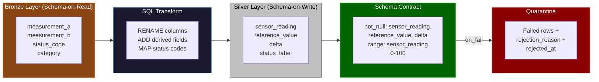
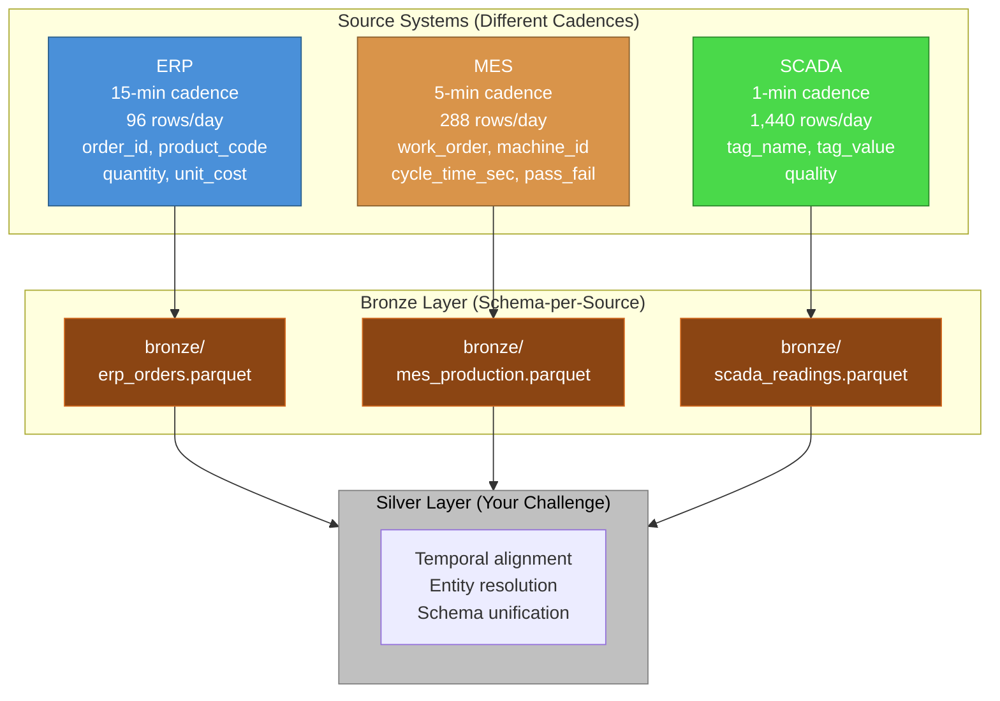

# Data Engineering Meta-Patterns (36–38)

Patterns for testing your data platform itself. These aren't about simulating a specific industry — they're about generating problematic data on purpose to validate that your pipelines handle edge cases correctly.

!!! info "Prerequisites"
    These patterns build on [Foundational Patterns 1–8](foundations.md), especially Pattern 1 (simulation as a bronze source) and Pattern 6 (stress testing). Pattern 37 requires familiarity with [Validation Tests](../../validation/tests.md).

---

## Pattern 36: Late-Arriving & Duplicate Data {#pattern-36}

**Industry:** Data Engineering | **Difficulty:** Intermediate

!!! tip "What you'll learn"
    - **`chaos` config for messy data** — using high `duplicate_rate` for retransmissions and `outlier_rate` for corrupt values. This is how you test that your downstream deduplication and data quality rules actually work.

Here's something I learned the hard way: your pipeline works great on clean data. Of course it does - you built it with clean data. The problem is that production data is never clean. IoT gateways retransmit on network timeout, giving you duplicates. Sensors drift out of calibration, giving you outliers. Historian systems batch-deliver readings hours after they were recorded, giving you late arrivals. If your pipeline can't handle all three at once, you don't have a pipeline - you have a demo.

This pattern is your crash test dummy. Instead of waiting for production to throw messy data at you (and finding out at 2 AM when your dashboard goes blank), you generate messy data on purpose. A 5% outlier rate and 3% duplicate rate are deliberately aggressive - way beyond the ~0.1-1% you'd see from a real historian. That's the point. If your dedup logic, range checks, and quarantine rules survive this, they'll survive anything production throws at them.

- **Duplicate rate (3%)** - simulates network retransmission, where an IoT gateway resends a reading because it didn't get an acknowledgment. The duplicate has the same timestamp and values but arrives as a second row. Your pipeline needs to pick one and discard the other.
- **Outlier rate (5%)** - simulates sensor corruption, calibration drift, or electrical noise. An outlier isn't just "a bit high" - with `outlier_factor: 5.0`, it's wildly outside normal range. A sensor reading of 50 suddenly spikes to 250. Your quality gate needs to catch this before it poisons an aggregate.
- **Quality codes** - borrowed from OPC UA, the industrial automation protocol. Every reading carries a quality flag: `good`, `suspect`, `bad`, or `missing`. Your transform logic can use this to filter before aggregation - don't average in a `bad` reading.
- **Sequential record IDs** - each reading gets a monotonically increasing `record_id`. After chaos injects duplicates, you'll have duplicate record IDs. A `unique` validation test on this column is the simplest way to detect retransmission duplicates.
- **Batch labels** - readings are tagged with which extraction batch they arrived in. Late-arriving data often shows up in a different batch than the one it belongs to chronologically.

!!! info "Units and terms in this pattern"
    **Deduplication** - The process of identifying and removing duplicate records. Strategies range from exact-match (same primary key) to fuzzy matching (similar timestamps within a window) to window-based (keep the latest record within a time window).

    **Outlier** - A data point that falls significantly outside the expected range. Detection methods include z-score (how many standard deviations from mean), IQR (interquartile range fences), and isolation forest (machine learning). This pattern uses brute-force injection via `outlier_factor` so you know exactly which records are outliers.

    **Quality code** - A metadata flag attached to each reading indicating trustworthiness. OPC UA defines: `good` (value is reliable), `suspect` (value might be okay but something is off), `bad` (value should not be used), `missing` (no value was recorded). Your transforms should filter on this before aggregation.

    **Bronze-to-silver cleansing** - In the medallion architecture, bronze holds raw data as-is. The bronze-to-silver transform is where you deduplicate, remove outliers, validate ranges, and apply quality filters. This pattern generates data that exercises every one of those operations.

    **Chaos config** - odibi's mechanism for injecting realistic data quality problems. `outlier_rate` controls what fraction of rows get corrupted values; `duplicate_rate` controls what fraction get duplicated. Both are applied after generation, so the "clean" data is generated first, then deliberately dirtied.

!!! info "Why these parameter values?"
    - **5% outlier rate:** Real systems produce 0.1-1% bad readings. We use 5% so that in 1,440 rows you get ~72 outliers - enough to test statistical detection methods, not just eyeball the data. If your pipeline handles 5%, it handles 0.5% easily.
    - **`outlier_factor: 5.0`:** This means outliers are 5x the normal range. A sensor reading of 50 becomes 250. This isn't subtle drift - it's the kind of spike a faulty 4-20mA transmitter produces when it shorts. Your range validation should catch these immediately.
    - **3% duplicate rate:** Network retransmission at 3% gives you ~43 duplicate rows in a 24-hour window. That's enough to test whether your dedup logic works by primary key, by timestamp window, or by some other strategy.
    - **Quality code weights [0.85, 0.08, 0.05, 0.02]:** 85% good readings is realistic for a well-maintained sensor network. The 8% suspect + 5% bad + 2% missing adds up to 15% questionable data - your downstream logic needs a strategy for each category.
    - **1-minute timestep, 1,440 rows:** Exactly 24 hours of minute-level data. This is a common SCADA polling interval and gives you enough data to test time-window dedup (e.g., "keep only one reading per 5-minute window").
    - **`volatility: 3.0` with `mean_reversion: 0.1`:** Creates a realistic random walk that stays roughly in the 0-100 range but wanders enough to look like a real process variable. The mean reversion pulls it back toward center, preventing runaway drift.

```yaml
project: late_arriving_data
engine: pandas

connections:
  output:
    type: local
    base_path: ./data

story:
  connection: output
  path: stories/

system:
  connection: output

pipelines:
  - pipeline: late_data
    nodes:
      - name: messy_sensor_data
        read:
          connection: null
          format: simulation
          options:
            simulation:
              scope:
                start_time: "2026-03-01T00:00:00Z"
                timestep: "1m"
                row_count: 1440            # 24 hours
                seed: 42
              entities:
                count: 1
                id_prefix: "source_"
              columns:
                - name: source_id
                  data_type: string
                  generator: {type: constant, value: "{entity_id}"}
                - name: timestamp
                  data_type: timestamp
                  generator: {type: timestamp}

                - name: record_id
                  data_type: int
                  generator:
                    type: sequential
                    start: 1
                    step: 1

                - name: sensor_value
                  data_type: float
                  generator:
                    type: random_walk
                    start: 50
                    min: 0
                    max: 100
                    volatility: 3.0
                    mean_reversion: 0.1
                    precision: 2

                - name: quality_code
                  data_type: string
                  generator:
                    type: categorical
                    values: [good, suspect, bad, missing]
                    weights: [0.85, 0.08, 0.05, 0.02]

                - name: source_system
                  data_type: string
                  generator: {type: constant, value: "historian_01"}

                - name: batch_label
                  data_type: string
                  generator:
                    type: categorical
                    values: [batch_a, batch_b, batch_c]
                    weights: [0.5, 0.3, 0.2]

              chaos:
                outlier_rate: 0.05          # 5% — deliberately aggressive
                outlier_factor: 5.0         # Extreme outliers
                duplicate_rate: 0.03        # 3% — simulates network retransmission
        write:
          connection: output
          format: parquet
          path: bronze/late_arriving_data.parquet
          mode: overwrite
```

!!! example "What the output looks like"
    This config generates **~1,483 rows** (1,440 base rows + ~43 duplicates from the 3% duplicate rate). Here's a snapshot showing normal data, an outlier, and a duplicate side by side:

    | source_id | timestamp            | record_id | sensor_value | quality_code | source_system | batch_label |
    |-----------|----------------------|-----------|--------------|--------------|---------------|-------------|
    | source_0  | 2026-03-01 00:00:00  | 1         | 50.00        | good         | historian_01  | batch_a     |
    | source_0  | 2026-03-01 00:01:00  | 2         | 52.31        | good         | historian_01  | batch_a     |
    | source_0  | 2026-03-01 00:02:00  | 3         | 48.77        | suspect      | historian_01  | batch_b     |
    | source_0  | 2026-03-01 00:03:00  | 4         | **247.15**   | good         | historian_01  | batch_a     |
    | source_0  | 2026-03-01 00:04:00  | 5         | 51.02        | good         | historian_01  | batch_a     |
    | source_0  | 2026-03-01 00:04:00  | **5**      | 51.02        | good         | historian_01  | batch_a     |

    The key things to notice: record 4 has a `sensor_value` of 247.15 - that's an outlier injected by chaos (the sensor was walking around 50, then jumped to 5x normal). Record 5 appears twice - same `record_id`, same timestamp, same values - that's a duplicate from retransmission. And record 3 has a `suspect` quality code even though its value looks fine. Your pipeline needs to handle all three cases.

**What makes this realistic:**

- **This is how real systems fail.** In production, you don't get one kind of bad data - you get all of them at once. A sensor drifts, the gateway retransmits, the historian batch-delivers stale readings, and your dashboard shows garbage. This pattern puts all of those failure modes into a single dataset so you can test your defenses together, not in isolation.
- **Quality codes aren't just metadata - they're your first line of defense.** OPC UA quality flags are the sensor's own assessment of its reading. A `good` quality code with an outlier value means the sensor thinks it's fine but isn't (calibration drift). A `bad` quality code means the sensor knows something is wrong. Your transform logic should handle both cases differently.
- **The duplicate rate is higher than reality on purpose.** Real retransmission rates are typically 0.1-0.5%. We use 3% so you get enough duplicates (~43 in 1,440 rows) to actually verify your dedup logic works. If you can only find 2 duplicates in a dataset, you can't tell whether your dedup code caught all of them or just got lucky.
- **The batch labels create a join challenge.** When late-arriving data shows up in `batch_c` but chronologically belongs between records in `batch_a`, your pipeline needs to handle out-of-order inserts. This is the late-arriving dimension problem that makes incremental loading so tricky.

!!! example "Try this"
    - **Add quarantine validation:** Add a `validation` block to the write node with `type: range, column: sensor_value, min: 0, max: 100` and `on_fail: quarantine`. Run the pipeline and check the quarantine folder - you should find ~72 rows with outlier values that got caught.
    - **Test deduplication detection:** Add a `type: unique` validation test on `record_id`. This will flag the ~43 duplicate records. In a real pipeline, you'd follow this with a SQL transform that uses `ROW_NUMBER() OVER (PARTITION BY record_id ORDER BY timestamp)` to keep only the first occurrence.
    - **Crank up the chaos:** Set `duplicate_rate: 0.10` and `outlier_rate: 0.10`. Now 10% of your data is duplicated and 10% is corrupted. Does your pipeline still produce a clean output? This is your stress test.
    - **Filter by quality code:** Add a SQL transform step that drops rows where `quality_code IN ('bad', 'missing')` before your range validation. This mimics how real bronze-to-silver layers use the source system's own quality assessment as a pre-filter.

!!! tip "What would you do with this data?"
    Once you have this dataset, here are real data engineering tests you could build:

    - **Dedup accuracy report** - Count records before and after deduplication. You know exactly how many duplicates chaos injected (3% of 1,440 = ~43), so you can verify your dedup logic catches all of them. Zero false negatives, zero false positives.
    - **Outlier detection benchmark** - Compare different detection methods against the known outliers. Does a z-score threshold of 3 catch the same outliers as an IQR fence? Which method has fewer false positives on the `suspect` quality-coded rows?
    - **Data quality dashboard** - Build a simple report showing: total rows ingested, duplicates removed, outliers quarantined, quality-code distribution, and net "clean" rows. This is the kind of operational report that tells you whether your bronze-to-silver layer is working.
    - **Late-arrival simulation** - Split the data by `batch_label` and process each batch sequentially. Does your incremental loading strategy handle records that arrive in `batch_c` but chronologically belong before records already loaded from `batch_a`?

> 📖 **Learn more:** [Advanced Features](../advanced_features.md) — Chaos configuration | [Validation Tests](../../validation/tests.md) — Quarantine mode for bad data

---

## Pattern 37: Schema Evolution Test {#pattern-37}

**Industry:** Data Engineering | **Difficulty:** Advanced

!!! tip "What you'll learn"
    - **Simulate → transform → validate loop** — the simulation node generates bronze data, a SQL transform renames columns and adds derived fields, and validation catches schema issues. This is how you test that your silver layer handles schema changes gracefully.

Schema evolution is the silent killer of data pipelines. One day an upstream system adds a column, renames a field, or changes a data type - and your pipeline either handles it gracefully or explodes at 6 AM on a Monday. The problem is that you can't test schema changes until they happen, and by then it's too late. Unless you simulate them first.

This pattern implements the standard medallion architecture as a two-node pipeline: bronze simulation into silver transform. The first node generates raw data with a known schema. The second node reads it back, renames columns (simulating how silver layers standardize naming), adds derived fields (like computing a `delta` between two measurements), and validates the output. The beauty of this setup is that you can deliberately break things. Add a column to bronze - does silver ignore it or crash? Remove a column that the SQL transform references - does validation catch the failure before it writes bad data? Rename a column - does your `CASE` statement still work? This is your schema contract test, and it runs in seconds.

- **Bronze node (schema-on-read)** - generates raw data with source-system naming conventions (`measurement_a`, `measurement_b`, `status_code`). This represents what your ingestion layer receives before any standardization. The schema is whatever the source sends - no guarantees.
- **Silver node (schema-on-write)** - reads bronze, renames columns to business-friendly names (`sensor_reading`, `reference_value`), adds derived columns (`delta`, `status_label`), and validates the result. This is your schema contract - the silver layer promises a specific set of columns with specific types and ranges.
- **SQL transform** - the `SELECT ... AS` aliases are how you decouple bronze naming from silver naming. If the source system renames `measurement_a` to `reading_a`, you change one line in the transform instead of updating every downstream consumer.
- **Derived columns** - `delta` (computed as `measurement_a - measurement_b`) and `status_label` (a CASE expression on `status_code`) are examples of silver-layer enrichment. These columns don't exist in bronze - they're created by the transform.
- **Validation as a schema contract** - the `not_null` and `range` tests on the silver node aren't just data quality checks. They're assertions about what the silver schema promises. If a derived column comes out null, it means the transform logic broke - probably because a bronze column it depends on disappeared.



!!! info "Units and terms in this pattern"
    **Medallion architecture** - A data lakehouse design pattern with three layers: bronze (raw, as-ingested), silver (cleansed, conformed, standardized), and gold (aggregated, business-ready). Each layer has increasingly strict schema guarantees. This pattern exercises the bronze-to-silver transition.

    **Schema-on-read vs. schema-on-write** - Two philosophies for when you enforce data structure. Schema-on-read (bronze) accepts whatever the source sends and interprets it at query time. Schema-on-write (silver) validates and enforces structure before data is stored. The tension between these two is what schema evolution testing is about.

    **Additive vs. breaking changes** - An additive change adds a new column that downstream consumers can ignore. A breaking change removes or renames a column that downstream consumers depend on. Additive changes are safe; breaking changes require coordination. This pattern lets you test both scenarios.

    **Column aliasing** - Using `SELECT column_a AS business_name` to decouple source naming from consumer naming. This is the simplest form of schema evolution handling - the source can rename columns and you only update the alias in one place.

    **Derived column** - A column computed from other columns rather than stored directly. `delta = measurement_a - measurement_b` is a derived column. If either input column disappears, the derived column becomes null (or the query fails), which is exactly what your validation should catch.

!!! info "Why these parameter values?"
    - **5-minute timestep, 288 rows:** Exactly 24 hours of data at 5-minute intervals. This is coarser than Pattern 36's 1-minute data because the focus here isn't on volume - it's on schema structure. 288 rows is enough to verify transforms without waiting for a large dataset to process.
    - **`measurement_a` as random walk (0-100):** Represents a continuous process variable like temperature. The random walk gives it realistic temporal correlation - each reading is related to the previous one, not independently random.
    - **`measurement_b` as normal distribution (mean 50, std 15):** Represents a reference value that varies independently. The normal distribution means most values cluster around 50, with occasional readings near the extremes. Combined with `measurement_a`, the computed `delta` column will show both positive and negative deviations.
    - **`status_code` weights [0.80, 0.10, 0.07, 0.03]:** 80% of readings are status 0 (ok), 10% are status 1 (warning), 7% are status 2 (error), and 3% are status 3 (critical). This distribution ensures the `CASE` expression in the transform gets exercised across all branches.
    - **Validation mode `warn`:** The silver node uses `mode: warn` instead of `mode: fail` so the pipeline continues even when validation finds problems. This lets you see how many rows fail validation without stopping the entire run - important when you're testing schema changes that might break things partially.
    - **Quarantine with `rejection_reason` and `rejected_at`:** Failed rows are written to a separate quarantine table with metadata explaining why they failed. This creates an audit trail - you can review quarantined rows to understand whether the schema change caused a data quality problem or a logic error in your transform.

```yaml
project: schema_evolution
engine: pandas

connections:
  output:
    type: local
    base_path: ./data

story:
  connection: output
  path: stories/

system:
  connection: output

pipelines:
  - pipeline: schema_test
    nodes:
      # ── Node 1: Simulate bronze data ──
      - name: bronze_data
        read:
          connection: null
          format: simulation
          options:
            simulation:
              scope:
                start_time: "2026-03-01T00:00:00Z"
                timestep: "5m"
                row_count: 288             # 24 hours
                seed: 42
              entities:
                count: 1
                id_prefix: "source_"
              columns:
                - name: source_id
                  data_type: string
                  generator: {type: constant, value: "{entity_id}"}
                - name: timestamp
                  data_type: timestamp
                  generator: {type: timestamp}

                - name: measurement_a
                  data_type: float
                  generator:
                    type: random_walk
                    start: 50
                    min: 0
                    max: 100
                    volatility: 2.0
                    mean_reversion: 0.1
                    precision: 2

                - name: measurement_b
                  data_type: float
                  generator:
                    type: range
                    min: 10
                    max: 90
                    distribution: normal
                    mean: 50
                    std_dev: 15

                - name: status_code
                  data_type: int
                  generator:
                    type: categorical
                    values: [0, 1, 2, 3]
                    weights: [0.80, 0.10, 0.07, 0.03]

                - name: category
                  data_type: string
                  generator:
                    type: categorical
                    values: [type_a, type_b, type_c]
                    weights: [0.5, 0.3, 0.2]
        write:
          connection: output
          format: parquet
          path: bronze/schema_test.parquet
          mode: overwrite

      # ── Node 2: Transform bronze → silver ──
      - name: silver_data
        read:
          connection: output
          format: parquet
          path: bronze/schema_test.parquet
        transform:
          steps:
            - sql: >
                SELECT
                  source_id,
                  timestamp,
                  measurement_a AS sensor_reading,
                  measurement_b AS reference_value,
                  status_code,
                  category,
                  measurement_a - measurement_b AS delta,
                  CASE
                    WHEN status_code = 0 THEN 'ok'
                    WHEN status_code = 1 THEN 'warn'
                    WHEN status_code = 2 THEN 'error'
                    ELSE 'critical'
                  END AS status_label
                FROM df
        validation:
          mode: warn
          tests:
            - type: not_null
              columns: [sensor_reading, reference_value, delta]
              on_fail: quarantine
            - type: range
              column: sensor_reading
              min: 0
              max: 100
              on_fail: quarantine
          quarantine:
            connection: output
            path: quarantine/schema_test
            add_columns:
              rejection_reason: true
              rejected_at: true
        write:
          connection: output
          format: parquet
          path: silver/schema_test.parquet
          mode: overwrite
```

!!! example "What the output looks like"
    The bronze node generates **288 rows** with source-system column names. The silver node transforms them into business-friendly names with derived fields. Here's a side-by-side comparison:

    **Bronze output (raw):**

    | source_id | timestamp            | measurement_a | measurement_b | status_code | category |
    |-----------|----------------------|---------------|---------------|-------------|----------|
    | source_0  | 2026-03-01 00:00:00  | 50.00         | 48.23         | 0           | type_a   |
    | source_0  | 2026-03-01 00:05:00  | 51.42         | 52.17         | 0           | type_b   |
    | source_0  | 2026-03-01 00:10:00  | 49.87         | 44.91         | 1           | type_a   |

    **Silver output (transformed):**

    | source_id | timestamp            | sensor_reading | reference_value | status_code | category | delta  | status_label |
    |-----------|----------------------|----------------|-----------------|-------------|----------|--------|--------------|
    | source_0  | 2026-03-01 00:00:00  | 50.00          | 48.23           | 0           | type_a   | 1.77   | ok           |
    | source_0  | 2026-03-01 00:05:00  | 51.42          | 52.17           | 0           | type_b   | -0.75  | ok           |
    | source_0  | 2026-03-01 00:10:00  | 49.87          | 44.91           | 1           | type_a   | 4.96   | warn         |

    The key things to notice: `measurement_a` became `sensor_reading`, `measurement_b` became `reference_value`, and two new columns appeared - `delta` (the difference) and `status_label` (human-readable status). The original `status_code` and `category` pass through unchanged. This is the bronze-to-silver contract in action.

**What makes this realistic:**

- **This is exactly how schema changes break pipelines.** In production, the ERP team renames a column from `measurement_a` to `reading_primary`. Your SQL transform still references `measurement_a`. It fails. But it fails in the transform step, not at query time three weeks later when a business analyst notices missing data. That's the whole point of the validate step - fast failure.
- **Additive changes are the easy case.** Add `measurement_c` to bronze. The silver SQL transform doesn't reference it, so it simply disappears from the output. No error, no crash - just a column that exists in bronze but not in silver. This is backward-compatible schema evolution, and it "just works."
- **Breaking changes are the hard case.** Remove `measurement_b` from bronze. The SQL transform references it as `reference_value`, and the `delta` computation divides by it. The query fails. The `not_null` validation on `delta` catches the null values. The quarantine table fills up with every single row tagged `rejection_reason: not_null_failed`. That's your signal that a breaking change happened upstream.
- **The CASE expression is a schema contract.** The `status_label` derived column maps integer codes to strings. If the source system adds status code 4 (which the CASE doesn't handle), it falls into the `ELSE 'critical'` bucket. That might be correct, or it might mask a new status you should handle explicitly. The validation layer gives you visibility into which rows hit the ELSE branch.

!!! example "Try this"
    - **Test additive evolution:** Add a `measurement_c` column to the bronze simulation (use `range` generator, min 0, max 50). Run the pipeline. Silver output should be identical - the new column is silently ignored because the SQL transform doesn't select it. This proves your pipeline handles additive changes safely.
    - **Test breaking evolution:** Remove the `measurement_b` column definition from the bronze simulation. Run the pipeline and watch the silver transform fail. Check the quarantine folder - every row should be there with a `not_null` rejection on the `delta` column.
    - **Add schema enforcement:** Add a `type: column_presence` validation test on the silver node listing `[sensor_reading, reference_value, delta, status_label]` as required columns. Now your pipeline explicitly asserts its output schema instead of relying on downstream consumers to notice when a column is missing.
    - **Test type evolution:** Change `status_code` from `int` to `string` in the bronze simulation. Does the CASE expression still work? (It depends on whether your SQL engine does implicit type coercion. This is the kind of subtle bug that only shows up in production.)

!!! tip "What would you do with this data?"
    Once you have this dataset, here are real data engineering workflows you could build:

    - **Schema contract CI test** - Run this pipeline as part of your CI/CD. If the bronze schema changes (simulated by editing the YAML), the pipeline should either pass cleanly (additive change) or fail with a clear error (breaking change). This is your automated regression test for schema evolution.
    - **Transform lineage report** - Map which bronze columns feed which silver columns. `measurement_a` -> `sensor_reading`, `measurement_a + measurement_b` -> `delta`. This is column-level lineage, and it tells you exactly which downstream fields break when a source column changes.
    - **Quarantine analysis** - When validation quarantines rows, analyze the `rejection_reason` column to categorize failures. Are they data quality issues (range violations) or schema issues (null derived columns)? The distinction tells you whether to fix the data or fix the transform.
    - **Schema diff dashboard** - Compare bronze and silver schemas across pipeline runs. Did new columns appear in bronze? Did silver output change shape? This is the operational view that tells you when schema evolution is happening before it causes a problem.

> 📖 **Learn more:** [Validation Tests](../../validation/tests.md) — Validation modes and quarantine | [Core Concepts](../core_concepts.md) — Multi-node pipelines

---

## Pattern 38: Multi-Source Bronze Merge {#pattern-38}

**Industry:** Data Engineering | **Difficulty:** Advanced

!!! tip "What you'll learn"
    - **Multiple simulation read nodes in one pipeline** — three separate source systems generate data at different cadences (15m ERP, 5m MES, 1m SCADA) into three bronze tables. This is the pattern for testing multi-source integration where your silver layer must merge data from different schemas and cadences.

This is the pattern that keeps me up at night - and the one I'm most glad I can simulate before production. In any manufacturing environment, you don't have one source of truth. You have three, four, maybe six different systems that each know a piece of the story. The ERP system knows what orders were placed and what they cost. The MES system knows which machine ran which work order and whether it passed quality checks. The SCADA system knows the actual process conditions - temperature, pressure, flow - at one-minute resolution. None of these systems talk to each other natively. That's your job as a data engineer.

The hard part isn't reading from three sources. The hard part is joining them. ERP reports every 15 minutes, MES every 5 minutes, and SCADA every minute. When you try to join an ERP order record timestamped at 08:15 with the SCADA reading that was happening at the same moment, you need a temporal join (sometimes called an ASOF join) - "find the closest SCADA reading to this ERP timestamp." And then there's entity resolution: ERP calls it `product_code: PROD_A`, MES calls it `machine_id: M01`, and SCADA calls it `tag_name: TT_101`. You need a mapping table to connect these three naming conventions. This pattern generates all three source datasets so you can build and test that integration layer before real data arrives.

- **ERP source (15-minute cadence, 96 rows/day)** - represents the enterprise planning layer. Each row is a production order with an `order_id`, `product_code`, `quantity`, and `unit_cost`. This is ISA-95 Level 4 data - business logistics. ERP systems batch-export at coarse intervals because business transactions don't happen every second.
- **MES source (5-minute cadence, 288 rows/day)** - represents the manufacturing execution layer. Each row is a production event with a `work_order`, `machine_id`, `cycle_time_sec`, and `pass_fail` result. This is ISA-95 Level 3 data - shop floor operations. MES captures what actually happened on the production line.
- **SCADA source (1-minute cadence, 1,440 rows/day)** - represents the process control layer. Each row is a sensor reading with a `tag_name`, `tag_value`, and `quality` flag. This is ISA-95 Level 2 data - real-time process monitoring. SCADA never sleeps; it captures every minute of every day.
- **Different seeds (42, 43, 44)** - each source generates completely independent data. No accidental correlation between ERP order quantities and SCADA tag values. In the real world, these systems don't share random number generators - and your test data shouldn't either.
- **Different schemas** - the three sources share only two columns (`source_id` and `timestamp`). Everything else is domain-specific. Your silver layer needs to handle this schema heterogeneity, either by creating separate silver tables or by building a unified model.



!!! info "Units and terms in this pattern"
    **ISA-95 level model** - An international standard that defines layers of a manufacturing enterprise. Level 4 is business planning (ERP), Level 3 is manufacturing operations (MES), Level 2 is process control (SCADA/DCS), Level 1 is sensors and actuators. Data flows up from sensors to business systems, getting more aggregated at each level. This pattern simulates Levels 2, 3, and 4.

    **Temporal join (ASOF join)** - A join that matches rows based on the closest timestamp rather than an exact match. When ERP records at 08:15 and SCADA records at 08:14:32 and 08:15:47, an ASOF join picks 08:14:32 as the closest match. This is essential when joining sources with different cadences.

    **Entity resolution** - The process of determining that `product_code: PROD_A` in ERP, `machine_id: M01` in MES, and `tag_name: TT_101` in SCADA all refer to the same production context. In real factories, this mapping lives in a master data table that someone (usually the data engineer) has to build and maintain.

    **Cadence** - How frequently a source system produces data. ERP at 15-minute cadence means one record every 15 minutes. SCADA at 1-minute cadence means one record every minute. When you join sources with different cadences, you get a many-to-one relationship: 15 SCADA readings for every 1 ERP record.

    **Tag naming convention** - SCADA systems use instrument tags like `TT_101` (Temperature Transmitter #101), `PT_201` (Pressure Transmitter #201), `FT_301` (Flow Transmitter #301), `LT_401` (Level Transmitter #401). The prefix indicates the measurement type; the number indicates the instrument loop. This convention comes from ISA-5.1 instrumentation standards.

!!! info "Why these parameter values?"
    - **15m/5m/1m cadences:** These are realistic polling intervals for each system type. ERP batch-exports at coarse intervals (you don't need order updates every second). MES captures production events at shop-floor speed. SCADA polls sensors continuously. The 15:5:1 ratio means you get 1 ERP record for every 3 MES records for every 15 SCADA records - your temporal join logic needs to handle this fan-out.
    - **96/288/1,440 rows per day:** All three sources cover exactly 24 hours. This makes timestamp alignment testing straightforward - every ERP record has corresponding MES and SCADA records within its time window. Change one source to 12 hours and you'll test how your join handles missing data from one side.
    - **ERP `product_code` weights [0.5, 0.3, 0.2]:** PROD_A is the high-volume product (50% of orders), PROD_C is the specialty product (20%). This uneven distribution is realistic - factories don't make equal amounts of everything. Your silver-layer aggregations need to handle the volume difference.
    - **MES `pass_fail` weights [0.95, 0.05]:** A 5% fail rate is high for a well-run production line (world-class is <1%), but it gives you enough failure records to test quality analytics. If you set it to 0.001, you'd only get 1-2 failures in 288 rows - not enough to draw conclusions.
    - **SCADA tag values as random walk:** Real process variables are temporally correlated - temperature at 08:15 is related to temperature at 08:14. The random walk generator captures this. Independent random values would look like noise, not a real process.
    - **SCADA quality weights [0.95, 0.03, 0.02]:** 95% good quality is realistic for a healthy SCADA system. The 3% bad + 2% uncertain gives your silver layer something to filter on. In a real integration, you'd drop bad-quality SCADA readings before joining with MES records.

```yaml
project: multi_source_merge
engine: pandas

connections:
  output:
    type: local
    base_path: ./data

story:
  connection: output
  path: stories/

system:
  connection: output

pipelines:
  - pipeline: bronze_sources
    nodes:
      # ── Source 1: ERP system (orders, 15-minute cadence) ──
      - name: source_erp
        read:
          connection: null
          format: simulation
          options:
            simulation:
              scope:
                start_time: "2026-03-01T00:00:00Z"
                timestep: "15m"
                row_count: 96              # 24 hours
                seed: 42
              entities:
                count: 1
                id_prefix: "erp_"
              columns:
                - name: source_id
                  data_type: string
                  generator: {type: constant, value: "{entity_id}"}
                - name: timestamp
                  data_type: timestamp
                  generator: {type: timestamp}

                - name: order_id
                  data_type: int
                  generator:
                    type: sequential
                    start: 5001
                    step: 1

                - name: product_code
                  data_type: string
                  generator:
                    type: categorical
                    values: [PROD_A, PROD_B, PROD_C]
                    weights: [0.5, 0.3, 0.2]

                - name: quantity
                  data_type: int
                  generator:
                    type: range
                    min: 1
                    max: 100

                - name: unit_cost
                  data_type: float
                  generator:
                    type: range
                    min: 5.0
                    max: 50.0
                    distribution: normal
                    mean: 20.0
                    std_dev: 8.0
        write:
          connection: output
          format: parquet
          path: bronze/erp_orders.parquet
          mode: overwrite

      # ── Source 2: MES system (production events, 5-minute cadence) ──
      - name: source_mes
        read:
          connection: null
          format: simulation
          options:
            simulation:
              scope:
                start_time: "2026-03-01T00:00:00Z"
                timestep: "5m"
                row_count: 288             # 24 hours
                seed: 43
              entities:
                count: 1
                id_prefix: "mes_"
              columns:
                - name: source_id
                  data_type: string
                  generator: {type: constant, value: "{entity_id}"}
                - name: timestamp
                  data_type: timestamp
                  generator: {type: timestamp}

                - name: work_order
                  data_type: int
                  generator:
                    type: sequential
                    start: 9001
                    step: 1

                - name: machine_id
                  data_type: string
                  generator:
                    type: categorical
                    values: [M01, M02, M03, M04]
                    weights: [0.30, 0.25, 0.25, 0.20]

                - name: cycle_time_sec
                  data_type: float
                  generator:
                    type: range
                    min: 30
                    max: 120
                    distribution: normal
                    mean: 60
                    std_dev: 15

                - name: pass_fail
                  data_type: string
                  generator:
                    type: categorical
                    values: [pass, fail]
                    weights: [0.95, 0.05]
        write:
          connection: output
          format: parquet
          path: bronze/mes_production.parquet
          mode: overwrite

      # ── Source 3: SCADA system (process tags, 1-minute cadence) ──
      - name: source_scada
        read:
          connection: null
          format: simulation
          options:
            simulation:
              scope:
                start_time: "2026-03-01T00:00:00Z"
                timestep: "1m"
                row_count: 1440            # 24 hours
                seed: 44
              entities:
                count: 1
                id_prefix: "scada_"
              columns:
                - name: source_id
                  data_type: string
                  generator: {type: constant, value: "{entity_id}"}
                - name: timestamp
                  data_type: timestamp
                  generator: {type: timestamp}

                - name: tag_name
                  data_type: string
                  generator:
                    type: categorical
                    values: [TT_101, PT_201, FT_301, LT_401]
                    weights: [0.25, 0.25, 0.25, 0.25]

                - name: tag_value
                  data_type: float
                  generator:
                    type: random_walk
                    start: 50
                    min: 0
                    max: 100
                    volatility: 2.0
                    mean_reversion: 0.1
                    precision: 2

                - name: quality
                  data_type: string
                  generator:
                    type: categorical
                    values: [good, bad, uncertain]
                    weights: [0.95, 0.03, 0.02]
        write:
          connection: output
          format: parquet
          path: bronze/scada_readings.parquet
          mode: overwrite
```

!!! example "What the output looks like"
    This pipeline generates **three separate bronze tables** with completely different schemas. Here's a snapshot from each at roughly the same moment:

    **ERP (bronze/erp_orders.parquet) - 96 rows:**

    | source_id | timestamp            | order_id | product_code | quantity | unit_cost |
    |-----------|----------------------|----------|--------------|----------|-----------|
    | erp_0     | 2026-03-01 00:00:00  | 5001     | PROD_A       | 47       | 18.32     |
    | erp_0     | 2026-03-01 00:15:00  | 5002     | PROD_B       | 23       | 24.15     |
    | erp_0     | 2026-03-01 00:30:00  | 5003     | PROD_A       | 61       | 16.78     |

    **MES (bronze/mes_production.parquet) - 288 rows:**

    | source_id | timestamp            | work_order | machine_id | cycle_time_sec | pass_fail |
    |-----------|----------------------|------------|------------|----------------|-----------|
    | mes_0     | 2026-03-01 00:00:00  | 9001       | M02        | 58.3           | pass      |
    | mes_0     | 2026-03-01 00:05:00  | 9002       | M01        | 63.7           | pass      |
    | mes_0     | 2026-03-01 00:10:00  | 9003       | M03        | 71.2           | fail      |

    **SCADA (bronze/scada_readings.parquet) - 1,440 rows:**

    | source_id | timestamp            | tag_name | tag_value | quality   |
    |-----------|----------------------|----------|-----------|-----------|
    | scada_0   | 2026-03-01 00:00:00  | TT_101   | 50.00     | good      |
    | scada_0   | 2026-03-01 00:01:00  | PT_201   | 52.31     | good      |
    | scada_0   | 2026-03-01 00:02:00  | FT_301   | 48.77     | uncertain |

    The key thing to notice: these three tables share only `timestamp` as a join key. The ERP row at 00:00 corresponds to MES rows at 00:00, 00:05, and 00:10 (3 records in the same 15-minute window) and SCADA rows at 00:00 through 00:14 (15 records). Your silver-layer join has to handle this 1:3:15 fan-out without duplicating ERP data or losing SCADA resolution.

**What makes this realistic:**

- **This is how every factory data integration project starts.** You have three systems that were never designed to talk to each other. ERP was bought by finance, MES was bought by operations, SCADA was installed by the automation vendor. They use different identifiers, different time intervals, and different schemas. Your data platform has to make sense of all three.
- **The cadence mismatch is the real challenge.** When you join ERP (15-minute) with SCADA (1-minute), you get a 15:1 fan-out. A naive inner join on timestamp produces zero rows because the timestamps never exactly match. You need either a temporal join (ASOF) that finds the nearest match, or a bucketing strategy that rounds all timestamps to a common interval. Both approaches have trade-offs, and this pattern lets you test them.
- **Entity resolution is a manual mapping exercise.** ERP's `product_code: PROD_A` doesn't appear anywhere in MES or SCADA. MES's `machine_id: M01` doesn't appear in ERP or SCADA. SCADA's `tag_name: TT_101` doesn't appear in ERP or MES. In a real factory, the data engineer builds a mapping table: PROD_A runs on M01, and M01's temperature sensor is TT_101. This pattern forces you to confront that mapping problem.
- **The three independent seeds prevent accidental correlation.** If all three sources used seed 42, the random values would be correlated in subtle ways that could mask join bugs. Different seeds ensure that any correlation you find in your silver layer is because your join logic put it there, not because the test data was secretly aligned.

!!! example "Try this"
    - **Add chaos to SCADA:** Set `outlier_rate: 0.01` on `source_scada` to inject bad sensor readings. Then build a silver-layer transform that joins MES production events with SCADA readings and see if the outliers propagate into your joined dataset. Your quality gate should filter bad SCADA readings *before* the join, not after.
    - **Change ERP to hourly:** Set `timestep: "1h"` and `row_count: 24` on `source_erp`. Now ERP data is even sparser - one record per hour vs. 60 SCADA records. Does your temporal join still work? Does your dashboard show gaps where ERP data is missing?
    - **Add a fourth source:** Create a quality inspection system (`source_qms`) with a 30-minute cadence, columns like `inspection_id`, `product_code`, `defect_type`, and `severity`. Now you have four sources to merge - and the QMS system shares `product_code` with ERP, giving you a direct join key (unlike MES and SCADA, which need entity resolution).
    - **Build the silver merge:** Add a second pipeline with a node that reads all three bronze tables and joins them using SQL. Start with the ERP-MES join (you can join on timestamp buckets), then add SCADA. This is the actual data engineering challenge this pattern is designed to test.

!!! tip "What would you do with this data?"
    Once you have these three bronze tables, here are real integration challenges you could solve:

    - **Temporal alignment layer** - Build a silver table that aligns all three sources to a common 15-minute window. For each window, take the ERP order (if any), the MES events (count, pass/fail ratio), and the SCADA averages (mean tag values, quality distribution). This is the foundation of any manufacturing analytics platform.
    - **Entity resolution table** - Create a mapping table that connects `product_code` to `machine_id` to `tag_name`. In this simulation, you'd define it manually (PROD_A -> M01 -> TT_101). In production, you'd mine it from historical co-occurrence. Either way, this pattern gives you the test data to validate your mapping.
    - **Cost-per-unit analysis** - Join ERP `unit_cost` with MES `cycle_time_sec` and `pass_fail` to calculate true cost per unit including scrap. Add SCADA process conditions to find which temperature ranges correlate with lower defect rates. This is the kind of cross-source insight that justifies the entire data platform.
    - **Data freshness monitoring** - Track the latest timestamp from each source. If SCADA stops updating but ERP and MES continue, your silver-layer join will produce rows with stale SCADA data. Build an alert that fires when any source falls behind by more than 2x its expected cadence.

> 📖 **Learn more:** [Core Concepts](../core_concepts.md) — Multi-node pipelines and data flow | [Validation Tests](../../validation/tests.md) — Testing merged data quality

---

← [Business & IT (31–35)](business_it.md)
