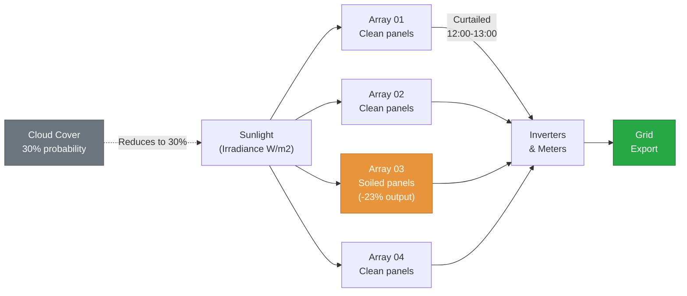
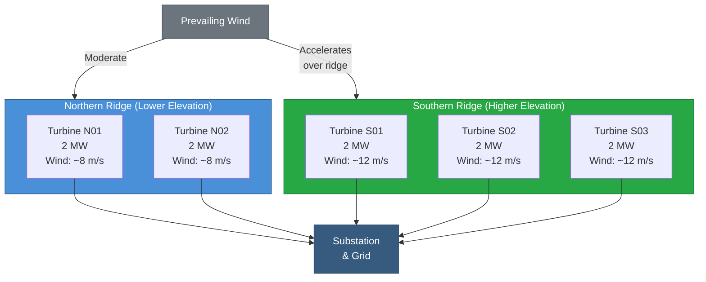
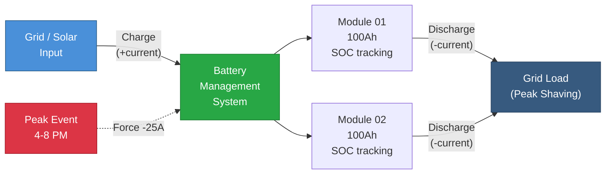

# Energy & Utilities (16–20)

Renewable energy, grid storage, and utility network patterns. These patterns model solar farms, wind turbines, battery systems, smart meters, and EV charging — showcasing the `boolean`, `geo`, `ipv4`, `uuid`, and `email` generators alongside energy-specific physics.

!!! info "Prerequisites"
    These patterns build on [Foundational Patterns 1–8](foundations.md). You should be familiar with [Generators Reference](../generators.md) and [Stateful Functions](../stateful_functions.md).

---

## Pattern 16: Solar Farm {#pattern-16}

**Industry:** Renewables | **Difficulty:** Intermediate

!!! tip "What you'll learn"
    - **`boolean` generator for cloud cover** — `is_cloudy` with `true_probability: 0.3` creates realistic intermittent shading
    - **Weather-to-power coupling** — derived expressions chain irradiance → panel temperature → efficiency → power output
    - **`prev()` for daily energy integration** — cumulative kWh accumulates over 24 hours, just like a real inverter's energy counter

If you've ever driven past a field of solar panels and wondered "how much power is that thing actually making right now?" - that's exactly what this pattern answers. Solar energy looks simple on the surface: sunlight hits a panel, electricity comes out. But the reality is a chain of physics that every solar engineer has to manage. Irradiance varies with clouds, panel temperature kills efficiency, dirt accumulates on glass, and the grid operator can tell you to shut down even when the sun is blazing.

This pattern models a four-array solar farm over a full 24-hour day at 5-minute resolution. Each array is a group of panels feeding into a shared inverter, and one of them (Array_03) has a soiling problem - dirty panels that reduce output by 20-25%. The simulation chains weather inputs through panel physics to electrical output, the same calculation a real monitoring system performs every few seconds. A grid curtailment event forces Array_01 offline during peak production, showing you how scheduled events model external constraints.

The `prev()` function handles energy integration - converting instantaneous power (kW) to cumulative energy (kWh) over the day. This is how every real inverter and revenue meter works: take the current power reading, multiply by the time interval, and add it to a running total. When you look at your utility bill, that number came from exactly this kind of integration.

**Entities and measured variables:**

- **Array_01, Array_02, Array_03, Array_04** - four independent panel arrays, each with its own inverter. Array_03 has soiling (dirty panels), and Array_01 gets curtailed at midday.
- **is_cloudy** - boolean flag indicating whether clouds are blocking direct sunlight at each 5-minute interval. When true, irradiance drops to 30% of clear-sky value - modeling the sharp power transients that make solar forecasting so challenging.
- **ambient_temp_c** - air temperature surrounding the panels, driven by a random walk between 15-38 C. This is the baseline for calculating panel temperature.
- **irradiance_w_m2** - solar energy hitting the panel surface, measured in watts per square meter. Clear-sky peak is about 1,000-1,100 W/m2 at solar noon. Array_03's soiling cap of 850 W/m2 represents about 23% transmission loss through dirty glass.
- **panel_temp_c** - actual temperature of the solar cells, always hotter than ambient because the panels absorb sunlight. Calculated using the NOCT relationship: panel temp = ambient + irradiance x 0.03.
- **efficiency_pct** - conversion efficiency of the panels, which decreases as panel temperature rises above 25 C. The -0.05 coefficient per degree models the real temperature coefficient of crystalline silicon cells.
- **power_kw** - instantaneous electrical output of each array, derived from irradiance, efficiency, and cloud state. The area factor of 2.0 scales the calculation to represent a realistic array size.
- **daily_energy_kwh** - cumulative energy produced since midnight, integrated from power using `prev()`. This is the number that determines revenue.



!!! info "Units and terms in this pattern"
    **W/m2 (watts per square meter)** - The intensity of sunlight hitting a surface. On a perfectly clear day at noon, you'll see about 1,000 W/m2. This is the fundamental input to any solar calculation.

    **NOCT (Nominal Operating Cell Temperature)** - The temperature a solar cell reaches under standard test conditions (800 W/m2, 20 C ambient, 1 m/s wind). In practice, panel temperature is approximated as ambient + irradiance x a coefficient (0.03 here). Hotter panels produce less power.

    **Temperature coefficient** - How much efficiency drops per degree above 25 C. For crystalline silicon panels, this is typically -0.3% to -0.5% per degree. At 45 C panel temp, you've lost about 8-10% of rated efficiency.

    **Soiling loss** - Dirt, dust, pollen, and bird droppings on panel glass block sunlight. A soiled array might lose 5-25% of output depending on location and cleaning schedule. Array_03's reduced irradiance cap models this.

    **Capacity factor** - The ratio of actual energy produced to the theoretical maximum if the panels ran at rated power 24/7. Solar farms typically achieve 15-25% capacity factor because the sun doesn't shine at night and clouds reduce output.

    **Grid curtailment** - When the grid operator tells a solar farm to reduce or stop production, usually because supply exceeds demand. This happens surprisingly often on sunny spring days when demand is low.

    **Inverter clipping** - When panels produce more DC power than the inverter can convert to AC. The excess is simply wasted. Not modeled here, but a real concern for oversized arrays.

!!! info "Why these parameter values?"
    - **Irradiance 0-1,100 W/m2:** Clear-sky irradiance at mid-latitudes peaks around 1,000-1,100 W/m2 at solar noon. The random walk models diurnal variation, though a real simulation would use a sinusoidal base curve.
    - **Ambient temp 15-38 C:** A warm spring day in a desert climate - typical of the US Southwest where large solar farms are sited.
    - **Soiling factor (Array_03 max 850 vs 1100 W/m2):** A 23% reduction matches a moderately soiled array that hasn't been cleaned in several months. Desert installations get dusty fast.
    - **Cloud probability 0.3:** Roughly 30% of 5-minute intervals have cloud cover, which is typical for a partly cloudy day. In reality, clouds cluster in time rather than appearing randomly, but this gives a reasonable intermittency profile.
    - **Temperature coefficient -0.05 per degree:** This translates to about -0.25%/C relative to 20% base efficiency, within the range of real silicon cell temperature coefficients.
    - **Curtailment window 12:00-13:00:** One hour at peak production. Grid operators curtail during midday because that's when solar supply exceeds demand - the "duck curve" phenomenon that California deals with daily.

```yaml
project: solar_farm
engine: pandas

connections:
  output:
    type: local
    base_path: ./data

story:
  connection: output
  path: stories/

system:
  connection: output

pipelines:
  - pipeline: solar
    nodes:
      - name: solar_data
        read:
          connection: null
          format: simulation
          options:
            simulation:
              scope:
                start_time: "2026-03-01T00:00:00Z"
                timestep: "5m"
                row_count: 288            # 24 hours
                seed: 42
              entities:
                names: [Array_01, Array_02, Array_03, Array_04]
              columns:
                - name: array_id
                  data_type: string
                  generator: {type: constant, value: "{entity_id}"}
                - name: timestamp
                  data_type: timestamp
                  generator: {type: timestamp}

                # Cloud cover — 30% chance of clouds at any timestep
                - name: is_cloudy
                  data_type: boolean
                  generator:
                    type: boolean
                    true_probability: 0.3

                - name: ambient_temp_c
                  data_type: float
                  generator:
                    type: random_walk
                    start: 22.0
                    min: 15.0
                    max: 38.0
                    volatility: 0.5
                    mean_reversion: 0.1
                    precision: 1

                # Solar irradiance — Array_03 has dirty panels (soiling)
                - name: irradiance_w_m2
                  data_type: float
                  generator:
                    type: random_walk
                    start: 600.0
                    min: 0.0
                    max: 1100.0
                    volatility: 30.0
                    mean_reversion: 0.05
                    precision: 0
                  entity_overrides:
                    Array_03:
                      type: random_walk
                      start: 450.0
                      min: 0.0
                      max: 850.0
                      volatility: 30.0
                      mean_reversion: 0.05
                      precision: 0

                # Panel temp rises with irradiance (NOCT relationship)
                - name: panel_temp_c
                  data_type: float
                  generator:
                    type: derived
                    expression: "ambient_temp_c + irradiance_w_m2 * 0.03"

                # Efficiency derates above 25°C (temp coefficient ~-0.4%/°C)
                - name: efficiency_pct
                  data_type: float
                  generator:
                    type: derived
                    expression: "max(0, 20.0 - 0.05 * max(0, panel_temp_c - 25.0))"

                # Power output — 2.0 is array area factor, cloud impact
                - name: power_kw
                  data_type: float
                  generator:
                    type: derived
                    expression: >
                      round(irradiance_w_m2 * efficiency_pct / 100.0
                      * 2.0 * (0.3 if is_cloudy else 1.0), 2)

                # Daily energy — 5-min integration via prev()
                - name: daily_energy_kwh
                  data_type: float
                  generator:
                    type: derived
                    expression: "round(prev('daily_energy_kwh', 0) + power_kw * 5.0 / 60.0, 2)"

              # Grid curtailment — Array_01 forced to 0 kW at midday
              scheduled_events:
                - type: forced_value
                  entity: Array_01
                  column: power_kw
                  value: 0
                  start_time: "2026-03-01T12:00:00Z"
                  end_time: "2026-03-01T13:00:00Z"

        write:
          connection: output
          format: parquet
          path: bronze/solar_farm.parquet
          mode: overwrite
```

!!! example "What the output looks like"
    This config generates **1,152 rows** (288 timesteps x 4 arrays). Here's a snapshot comparing all four arrays at a single timestep - notice how Array_03's soiling and cloud state affect power output:

    | array_id  | timestamp            | is_cloudy | ambient_temp_c | irradiance_w_m2 | panel_temp_c | efficiency_pct | power_kw | daily_energy_kwh |
    |-----------|----------------------|-----------|----------------|-----------------|--------------|----------------|----------|------------------|
    | Array_01  | 2026-03-01 10:00:00  | False     | 28.3           | 920             | 55.9         | 18.46          | 339.27   | 198.44           |
    | Array_02  | 2026-03-01 10:00:00  | False     | 27.1           | 885             | 53.7         | 18.57          | 328.69   | 192.17           |
    | Array_03  | 2026-03-01 10:00:00  | True      | 29.0           | 640             | 48.2         | 18.84          | 72.33    | 97.62            |
    | Array_04  | 2026-03-01 10:00:00  | False     | 26.8           | 905             | 53.9         | 18.55          | 335.76   | 195.88           |

    Array_03 stands out immediately: it's cloudy AND soiled, so its power drops to 72 kW while the clean arrays produce 330+ kW. The daily energy total for Array_03 is roughly half the others by 10 AM. This is exactly the kind of disparity that triggers a cleaning work order in a real solar O&M system.

**What makes this realistic:**

- **Boolean cloud cover creates real intermittency.** Power drops to 30% when `is_cloudy` is true, mimicking the sharp transients that real solar farms experience. On a partly cloudy day, power can swing from 100% to 30% and back in under a minute - this is why grid operators need fast-ramping backup generation.
- **Panel temperature derates efficiency using real physics.** The temperature coefficient (-0.05 per degree above 25 C) means that a panel at 55 C produces about 7.5% less power than the same panel at 25 C. This is a real engineering constraint - desert solar farms produce less per panel than cooler-climate installations despite having more sunlight.
- **`prev()` integrates energy exactly like a real meter.** The formula `daily_energy_kwh[t] = daily_energy_kwh[t-1] + power_kw x 5/60` is the trapezoidal integration method used by revenue-grade energy meters. The 5/60 converts a 5-minute interval to hours.
- **Array_03 soiling reduces peak irradiance from 1,100 to 850 W/m2.** A 23% reduction matches a moderately soiled array. In the US Southwest, panels can lose 0.5-1% output per day without cleaning - after a few months, 20-25% loss is common.
- **Grid curtailment forces Array_01 to zero during peak production (12:00-13:00).** This is a real and growing problem. California curtailed over 2.4 million MWh of solar in 2023 because midday supply exceeded demand. The scheduled event models exactly this constraint.

!!! example "Try this"
    - **Simulate an overcast day:** Change `true_probability` to `0.6` and compare daily energy totals against the 0.3 baseline. You'll see capacity factor drop from roughly 20% to under 12% - a bad day for solar revenue.
    - **Add wind cooling:** Create a `wind_speed_mps` column (random_walk, start 3, min 0, max 15) and modify `panel_temp_c` to subtract wind cooling: `"ambient_temp_c + irradiance_w_m2 * 0.03 - wind_speed_mps * 0.5"`. Wind cools panels and improves efficiency - this is why windy desert sites outperform calm ones.
    - **Extend to 48 hours:** Double to 576 rows and add a second curtailment event on day 2. Compare day-over-day energy production to see how weather and curtailment variability affects revenue forecasting.

!!! tip "What would you do with this data?"
    Once you have this dataset, here are real analyses you could build:

    - **Soiling detection model** - Compare Array_03's daily energy against the fleet average. A soiled array will consistently underperform by a percentage that grows over time. Real O&M teams use exactly this ratio to schedule panel washing crews.
    - **Curtailment impact report** - Calculate the energy Array_01 would have produced during 12:00-13:00 (interpolate from neighboring arrays) minus zero. That's your curtailment loss in kWh. Multiply by your PPA rate to get dollar impact.
    - **Cloud transient analysis** - Count how many times each array transitions from cloudy to clear (or vice versa) per hour. High transition rates stress inverter electronics and accelerate wear. This feeds into inverter replacement forecasting.
    - **Capacity factor dashboard** - Calculate actual daily energy divided by (rated power x 24 hours) for each array. Track this over time to catch degradation, soiling trends, or equipment problems before they become expensive.

> 📖 **Learn more:** [Generators Reference](../generators.md) — Boolean generator

---

## Pattern 17: Wind Turbine Fleet {#pattern-17}

**Industry:** Renewables | **Difficulty:** Intermediate

!!! tip "What you'll learn"
    - **`geo` generator for physical locations** — place turbines on a real coordinate grid using `bbox` format
    - **Entity overrides at scale** — differentiate geographic clusters (north vs south ridge) with different wind profiles

Wind energy is governed by one beautiful and brutal equation: power is proportional to the cube of wind speed. Double the wind speed and you get eight times the power. This cubic relationship is why wind farms are so sensitive to site selection - a hilltop that averages 8 m/s produces nearly three times more energy than a valley floor averaging 6 m/s. It's also why turbine manufacturers fight over every tenth of a meter per second in their marketing specs.

This pattern models a fleet of five 2MW wind turbines spread across two geographic clusters - a northern ridge (2 turbines) and a southern ridge (3 turbines). The southern cluster sits higher and catches more wind, modeled through entity overrides that give those turbines a windier profile (starting at 12 m/s vs 8 m/s for the north). The `geo` generator places each turbine on real coordinates in a Southern California wind corridor, so every row carries latitude/longitude data you could plot on a map.

The power curve implementation is the real thing. Below the cut-in speed (3 m/s), there isn't enough wind to overcome friction and the turbine produces zero power. Between cut-in and rated speed (12 m/s), power follows the cubic law. Above rated speed, the pitch control system feathers the blades to hold output at exactly 2,000 kW - producing more would overstress the generator. And above cut-out speed (25 m/s), the turbine shuts down entirely to protect itself from structural damage.

**Entities and measured variables:**

- **Turbine_N01, Turbine_N02** - northern cluster turbines on the lower ridge. These see moderate wind (starting at 8 m/s) and represent the baseline performance of the fleet.
- **Turbine_S01, Turbine_S02, Turbine_S03** - southern cluster turbines on the higher ridge. Entity overrides give them stronger wind profiles (starting at 12 m/s, higher max) to model the ridge effect where wind accelerates over elevated terrain.
- **location** - GPS coordinates generated by the `geo` generator within a bounding box in Southern California. Each turbine gets a fixed position within the wind corridor.
- **wind_speed_mps** - wind speed at hub height in meters per second. This is the primary input to the power curve. The random walk models the natural turbulence and gusting of real wind patterns.
- **wind_direction_deg** - compass direction the wind is blowing from (0-360 degrees). Important for yaw control - the nacelle must rotate to face into the wind. Also critical for wake analysis: a turbine directly downwind of another loses 10-40% of its potential power.
- **power_kw** - electrical output derived from the cubic power curve with cut-in, rated, and cut-out thresholds. This is the revenue-generating measurement.
- **rotor_rpm** - rotational speed of the blades, proportional to wind speed up to a maximum of 15 RPM. Real turbines use variable-speed generators that allow the rotor to slow or speed up to capture more energy across a range of wind conditions.
- **nacelle_temp_c** - temperature inside the nacelle housing (where the gearbox, generator, and control electronics live). Overheating triggers alarms and automatic shutdown to prevent gearbox damage - one of the most expensive failure modes.



!!! info "Units and terms in this pattern"
    **m/s (meters per second)** - Wind speed measurement. 1 m/s is about 2.2 mph. A gentle breeze is 3-5 m/s, a strong wind is 10-15 m/s, and hurricane-force starts at about 33 m/s.

    **Cut-in speed (3 m/s)** - The minimum wind speed needed to generate power. Below this, friction in the drivetrain exceeds the aerodynamic force on the blades and the turbine sits idle.

    **Rated speed (12 m/s)** - The wind speed at which the turbine reaches its maximum power output (2,000 kW for a 2 MW turbine). Above this, the pitch control system angles the blades to shed excess wind.

    **Cut-out speed (25 m/s)** - The safety shutdown threshold. Above this wind speed, the turbine brakes to a stop and locks the rotor to prevent structural damage. This is about 56 mph - serious wind.

    **Betz limit (59.3%)** - The theoretical maximum fraction of wind energy that any turbine can extract. No turbine can capture more than 59.3% of the kinetic energy in the wind. Real turbines achieve 35-45% at their best operating point.

    **Capacity factor** - Actual energy produced divided by theoretical maximum if the turbine ran at rated power 24/7. Onshore wind farms typically achieve 25-40% capacity factor. The southern cluster in this pattern will have a higher capacity factor than the northern cluster.

    **Wake effect** - A turbine extracts energy from the wind, leaving a "shadow" of slower, more turbulent air behind it. Downstream turbines in this wake produce 10-40% less power. Not modeled here, but a major factor in wind farm layout optimization.

    **Nacelle** - The housing at the top of the tower that contains the gearbox, generator, and control systems. It rotates (yaws) to face into the wind.

!!! info "Why these parameter values?"
    - **Northern wind start 8 m/s, southern start 12 m/s:** The 50% wind speed difference between clusters creates dramatically different power output (8 cubed = 512 vs 12 cubed = 1,728 - more than 3x). This models the ridge effect where wind accelerates as it flows over elevated terrain.
    - **Cut-in 3 m/s, rated 12 m/s, cut-out 25 m/s:** These are standard specifications for a modern 2 MW onshore turbine. The IEC 61400 standard classifies turbines by these thresholds.
    - **Volatility 0.8 (north) vs 1.0 (south):** Higher volatility on the southern ridge reflects the increased turbulence that comes with stronger winds over complex terrain. More power, but also more mechanical stress.
    - **Nacelle temp 20-65 C:** The gearbox generates significant heat during operation. 65 C is approaching the alarm threshold for most turbine models - prolonged operation above 70 C risks gearbox bearing failure, a repair that costs $300K+ and requires a crane.
    - **Rotor RPM capped at 15:** Large 2 MW turbines with 80-100m diameter rotors operate at low rotational speeds. The tip speed of the blade is what matters - at 15 RPM with a 45m blade, the tips are moving at about 70 m/s (155 mph).
    - **Geo bounding box [34.0, -118.5, 34.1, -118.4]:** This places the wind farm in the San Gabriel Mountains north of Los Angeles - a real wind corridor used by commercial wind farms.

```yaml
project: wind_turbine_fleet
engine: pandas

connections:
  output:
    type: local
    base_path: ./data

story:
  connection: output
  path: stories/

system:
  connection: output

pipelines:
  - pipeline: wind
    nodes:
      - name: turbine_data
        read:
          connection: null
          format: simulation
          options:
            simulation:
              scope:
                start_time: "2026-03-01T00:00:00Z"
                timestep: "10m"
                row_count: 144            # 24 hours
                seed: 42
              entities:
                names: [Turbine_N01, Turbine_N02, Turbine_S01, Turbine_S02, Turbine_S03]
              columns:
                - name: turbine_id
                  data_type: string
                  generator: {type: constant, value: "{entity_id}"}
                - name: timestamp
                  data_type: timestamp
                  generator: {type: timestamp}

                # Physical location — Southern California wind farm
                - name: location
                  data_type: string
                  generator:
                    type: geo
                    bbox: [34.0, -118.5, 34.1, -118.4]
                    format: tuple

                # Wind speed — southern cluster is windier (ridge effect)
                - name: wind_speed_mps
                  data_type: float
                  generator:
                    type: random_walk
                    start: 8.0
                    min: 0.0
                    max: 30.0
                    volatility: 0.8
                    mean_reversion: 0.08
                    precision: 1
                  entity_overrides:
                    Turbine_S01:
                      type: random_walk
                      start: 12.0
                      min: 2.0
                      max: 35.0
                      volatility: 1.0
                      mean_reversion: 0.06
                      precision: 1
                    Turbine_S02:
                      type: random_walk
                      start: 12.0
                      min: 2.0
                      max: 35.0
                      volatility: 1.0
                      mean_reversion: 0.06
                      precision: 1
                    Turbine_S03:
                      type: random_walk
                      start: 12.0
                      min: 2.0
                      max: 35.0
                      volatility: 1.0
                      mean_reversion: 0.06
                      precision: 1

                - name: wind_direction_deg
                  data_type: float
                  generator:
                    type: range
                    min: 0.0
                    max: 360.0

                # Cubic power curve: cut-in 3 m/s, rated at 12 m/s (2MW)
                - name: power_kw
                  data_type: float
                  generator:
                    type: derived
                    expression: >
                      round(0 if wind_speed_mps < 3
                      else (2000 if wind_speed_mps > 25
                      else 2000 * min(1.0, (wind_speed_mps / 12.0) ** 3)), 1)

                - name: rotor_rpm
                  data_type: float
                  generator:
                    type: derived
                    expression: >
                      round(0 if wind_speed_mps < 3
                      else min(15.0, wind_speed_mps * 1.2), 1)

                - name: nacelle_temp_c
                  data_type: float
                  generator:
                    type: random_walk
                    start: 35.0
                    min: 20.0
                    max: 65.0
                    volatility: 0.5
                    mean_reversion: 0.1
                    precision: 1

        write:
          connection: output
          format: parquet
          path: bronze/wind_turbines.parquet
          mode: overwrite
```

!!! example "What the output looks like"
    This config generates **720 rows** (144 timesteps x 5 turbines). Here's a snapshot comparing all five turbines at a single timestep - notice how the southern cluster's stronger wind translates to dramatically higher power:

    | turbine_id  | timestamp            | location              | wind_speed_mps | wind_direction_deg | power_kw | rotor_rpm | nacelle_temp_c |
    |-------------|----------------------|-----------------------|----------------|--------------------|----------|-----------|----------------|
    | Turbine_N01 | 2026-03-01 06:00:00  | (34.032, -118.467)    | 7.2            | 245.3              | 432.0    | 8.6       | 33.4           |
    | Turbine_N02 | 2026-03-01 06:00:00  | (34.058, -118.441)    | 8.5            | 251.7              | 710.6    | 10.2      | 36.1           |
    | Turbine_S01 | 2026-03-01 06:00:00  | (34.091, -118.423)    | 13.1           | 238.9              | 2000.0   | 15.0      | 42.8           |
    | Turbine_S02 | 2026-03-01 06:00:00  | (34.077, -118.448)    | 11.4           | 242.1              | 1714.3   | 13.7      | 40.2           |
    | Turbine_S03 | 2026-03-01 06:00:00  | (34.083, -118.410)    | 14.0           | 255.6              | 2000.0   | 15.0      | 44.5           |

    The cubic law is visible in the data. Turbine_N01 at 7.2 m/s produces only 432 kW, while Turbine_S01 at 13.1 m/s is already at the 2,000 kW rated cap. The southern turbines are producing 3-5x more power from wind that is only 50-80% stronger. That's the cube law at work, and it's why wind resource assessment is the most important phase of any wind project.

**What makes this realistic:**

- **The cubic power curve is the real physics of wind energy.** P is proportional to v cubed - this isn't an approximation, it's derived from kinetic energy equations (KE = 0.5 x rho x A x v^3). The derived expression implements the full power curve with cut-in, rated, and cut-out thresholds exactly as a real turbine controller does.
- **Cut-in at 3 m/s and rated at 12 m/s match typical 2MW turbine specs.** These thresholds come from manufacturer datasheets (Vestas V90, Siemens Gamesa SG 2.1-114, etc.). The power curve shape between cut-in and rated speed is the key differentiator between turbine models.
- **`geo` generator places turbines on a real coordinate grid.** The bounding box covers a Southern California wind corridor where commercial wind farms actually operate. Each turbine gets unique coordinates, so you could join this data with GIS layers for terrain analysis or wake modeling.
- **Southern cluster is windier via entity overrides.** The ridge effect (wind accelerates as it flows over elevated terrain) is one of the most important phenomena in wind resource assessment. The 50% wind speed difference between clusters translates to a 3x+ power difference thanks to the cubic law.
- **Nacelle temperature tracks independently.** Real turbines have dedicated temperature sensors on the gearbox, generator, and main bearing. Overheating is the leading cause of unplanned downtime. The random walk between 20-65 C means some timesteps will approach alarm thresholds, creating realistic maintenance alert scenarios.

!!! example "Try this"
    - **Simulate bearing degradation:** Add a `gearbox_vibration_mm_s` column using `random_walk` with `trend: 0.02` to model vibration increasing over time. In predictive maintenance, a rising vibration trend is the earliest indicator of bearing failure - typically detectable weeks before the gearbox actually fails.
    - **Add hub height differentiation:** Create a `hub_height_m` constant (80 for north turbines, 100 for south) using entity overrides. Taller towers access faster wind because wind speed increases with height following the wind shear power law.
    - **Model newer technology:** Lower the cut-in speed to 2.5 m/s and compare total energy production. Modern turbines with larger rotors can start generating at lower wind speeds, significantly improving capacity factor at moderate-wind sites.

!!! tip "What would you do with this data?"
    Once you have this dataset, here are real analyses you could build:

    - **Power curve validation** - Plot power_kw vs wind_speed_mps for each turbine. The scatter plot should follow the theoretical cubic curve. Deviations indicate blade icing, yaw misalignment, or control system problems. This is the single most important diagnostic tool in wind farm operations.
    - **Cluster performance comparison** - Calculate capacity factor (actual energy / rated energy) for north vs south clusters. Quantify exactly how much the ridge effect is worth in MWh and revenue. This informs future site selection decisions.
    - **Nacelle temperature anomaly detection** - Correlate nacelle_temp_c with power_kw. A turbine whose nacelle runs hotter than its peers at the same power level likely has a cooling system problem or excessive gearbox friction. Flag these before they become failures.
    - **Wind direction analysis** - Group power output by wind_direction_deg bins (N, NE, E, etc.). Some directions may cause wake interference between turbines. This analysis drives yaw offset strategies and curtailment schedules.

> 📖 **Learn more:** [Advanced Features](../advanced_features.md) — Entity overrides | [Generators Reference](../generators.md) — Geo generator

---

## Pattern 18: Battery Energy Storage System (BESS) {#pattern-18}

**Industry:** Energy Storage | **Difficulty:** Intermediate

!!! tip "What you'll learn"
    - **`prev()` for state-of-charge integration** — Coulomb counting, the same algorithm used in real battery management systems. SOC[t] = SOC[t-1] + current × Δt / capacity

Battery energy storage is the missing piece that makes renewables viable at scale. Solar produces power when the sun shines (midday), but demand peaks when people come home from work (evening). Wind blows strongest at night when nobody needs the electricity. Batteries bridge that gap - they absorb excess renewable energy when it's cheap and discharge it when the grid needs it most. Every utility in the world is deploying these systems as fast as they can build them.

This pattern models a two-module BESS installation over a 24-hour day at 5-minute resolution. Each module is an independent battery pack with its own battery management system (BMS) tracking state-of-charge, current, voltage, and temperature. The `prev()` function implements Coulomb counting - the same algorithm running inside every BMS on the planet. Current flows in (positive = charging) and out (negative = discharging), and the SOC accumulates those flows over time: SOC[t] = SOC[t-1] + I x dt / C x 100%.

The real power of this pattern is the peak shaving event. During the utility peak demand window (4-8 PM), a scheduled event forces both modules into aggressive discharge at -25A. This is exactly how BESS systems participate in demand response programs - the grid operator sends a dispatch signal, and the batteries dump stored energy to reduce peak load. The financial incentive is enormous: demand charges on commercial electricity bills can be $15-25 per kW of peak demand per month.

**Entities and measured variables:**

- **BESS_Module_01, BESS_Module_02** - two independent battery modules, each with a 100Ah capacity. In a real installation, modules are paralleled for redundancy and to allow maintenance on one while the other continues operating.
- **current_a** - battery current in amps. Positive values mean the battery is charging (absorbing energy from the grid or solar), negative values mean discharging (delivering energy). The random walk between -30A and +30A models the natural variation of charge/discharge cycles driven by grid signals.
- **voltage_v** - battery terminal voltage, which varies with state of charge and load. A lithium-ion battery pack at 400V nominal might range from 360V (nearly empty) to 420V (fully charged). The voltage curve is a key indicator of battery health.
- **soc_pct** - state of charge as a percentage, calculated via Coulomb counting using `prev()`. Clamped between 5% and 95% to model the battery protection limits that prevent deep discharge and overcharge - both of which cause permanent cell degradation.
- **power_kw** - instantaneous power in kilowatts, derived from P = I x V / 1000. Positive during charge, negative during discharge.
- **cycle_state** - categorical label derived from current: "charging" (I > 1A), "discharging" (I < -1A), or "idle" (in between). The 1A dead band prevents rapid cycling between states, matching how real BMS controllers implement hysteresis.
- **cell_temp_c** - battery cell temperature, which rises during both charge and discharge due to internal resistance (I^2R heating). The 15-45 C range spans normal operation to the point where thermal management systems start working hard. Above 45 C, most BMS systems reduce current to protect cell chemistry.



!!! info "Units and terms in this pattern"
    **SOC (State of Charge)** - The percentage of usable energy remaining in the battery. Think of it like a fuel gauge. 100% = full, 0% = empty. In practice, batteries are never operated to true 0% or 100% - the BMS enforces limits (5-95% here) to protect cell longevity.

    **Coulomb counting** - The standard method for tracking SOC. It integrates current over time: SOC[t] = SOC[t-1] + I x dt / Capacity. It's conceptually simple (just adding up how much charge went in or out) but drifts over time without periodic recalibration.

    **C-rate** - How fast a battery charges or discharges relative to its capacity. A 100Ah battery at 1C draws 100A and depletes in one hour. At 0.5C (50A) it takes two hours. At 0.25C (25A, used in the peak shaving event) it takes four hours. Higher C-rates generate more heat and reduce cycle life.

    **Depth of Discharge (DOD)** - How much of the battery's capacity is used per cycle. A cycle from 95% to 5% SOC is 90% DOD. Shallower cycles (say 80% to 40% = 40% DOD) dramatically extend battery life. Most BESS systems are designed for 60-80% DOD to balance utilization with longevity.

    **Round-trip efficiency** - The ratio of energy out to energy in. A battery with 90% round-trip efficiency wastes 10% of stored energy as heat. Lithium-ion batteries typically achieve 85-95% round-trip efficiency depending on C-rate and temperature.

    **Peak shaving** - Reducing peak demand by discharging batteries during the highest-load hours. Utilities charge commercial customers based on their peak demand (in kW), so shaving just a few hundred kW off the peak can save thousands of dollars per month.

!!! info "Why these parameter values?"
    - **Current range -30A to +30A:** At 400V nominal, this translates to roughly +/-12 kW per module - a reasonable size for a commercial/industrial BESS. The random walk models the variable charge/discharge commands that a real energy management system issues based on grid conditions and pricing signals.
    - **Voltage range 360-420V:** This spans the typical voltage curve of a lithium-ion battery pack. At 360V the pack is nearly depleted; at 420V it's nearly full. The voltage-SOC relationship is non-linear in real cells, but the random walk provides a reasonable approximation for simulation purposes.
    - **SOC clamp at 5-95%:** Operating outside this range damages lithium-ion cells. Deep discharge (below 5%) causes copper dissolution at the anode; overcharge (above 95%) causes lithium plating. Battery warranties typically require staying within these limits.
    - **100Ah capacity:** A moderately sized module. The Coulomb counting formula divides current by capacity (I x dt / C), so changing this value directly scales how fast SOC moves - a 200Ah battery takes twice as long to charge or discharge at the same current.
    - **Peak shaving at -25A, 4-8 PM:** A 0.25C discharge rate sustained for 4 hours would theoretically drain 100Ah from full. The 5% floor clamp will kick in before that, modeling the real situation where a BMS prevents over-discharge even when the grid operator wants more power.
    - **Cell temp 15-45 C:** Normal operating range for lithium-ion. Below 0 C, lithium plating risk increases; above 45 C, capacity degradation accelerates exponentially. Most BESS installations include HVAC systems to keep cells in this window.

```yaml
project: bess_storage
engine: pandas

connections:
  output:
    type: local
    base_path: ./data

story:
  connection: output
  path: stories/

system:
  connection: output

pipelines:
  - pipeline: bess
    nodes:
      - name: bess_data
        read:
          connection: null
          format: simulation
          options:
            simulation:
              scope:
                start_time: "2026-03-01T00:00:00Z"
                timestep: "5m"
                row_count: 288            # 24 hours
                seed: 42
              entities:
                names: [BESS_Module_01, BESS_Module_02]
              columns:
                - name: module_id
                  data_type: string
                  generator: {type: constant, value: "{entity_id}"}
                - name: timestamp
                  data_type: timestamp
                  generator: {type: timestamp}

                # Current: positive = charge, negative = discharge
                - name: current_a
                  data_type: float
                  generator:
                    type: random_walk
                    start: 0.0
                    min: -30.0
                    max: 30.0
                    volatility: 2.0
                    mean_reversion: 0.05
                    precision: 1

                - name: voltage_v
                  data_type: float
                  generator:
                    type: random_walk
                    start: 400.0
                    min: 360.0
                    max: 420.0
                    volatility: 1.0
                    mean_reversion: 0.1
                    precision: 1

                # SOC via Coulomb counting — 100Ah capacity, 5min interval
                # SOC[t] = SOC[t-1] + I × (5/60) / 100 × 100%
                # Clamped to 5–95% (battery protection)
                - name: soc_pct
                  data_type: float
                  generator:
                    type: derived
                    expression: >
                      round(max(5, min(95,
                      prev('soc_pct', 50)
                      + current_a * 5.0 / 60.0 / 100.0 * 100)), 1)

                - name: power_kw
                  data_type: float
                  generator:
                    type: derived
                    expression: "round(current_a * voltage_v / 1000.0, 2)"

                - name: cycle_state
                  data_type: string
                  generator:
                    type: derived
                    expression: "'charging' if current_a > 1 else 'discharging' if current_a < -1 else 'idle'"

                - name: cell_temp_c
                  data_type: float
                  generator:
                    type: random_walk
                    start: 25.0
                    min: 15.0
                    max: 45.0
                    volatility: 0.3
                    mean_reversion: 0.1
                    precision: 1

              # Peak shaving — force discharge during utility peak (4–8 PM)
              scheduled_events:
                - type: forced_value
                  entity: null
                  column: current_a
                  value: -25
                  start_time: "2026-03-01T16:00:00Z"
                  end_time: "2026-03-01T20:00:00Z"

        write:
          connection: output
          format: parquet
          path: bronze/bess_storage.parquet
          mode: overwrite
```

!!! example "What the output looks like"
    This config generates **576 rows** (288 timesteps x 2 modules). Here's a snapshot showing the transition from normal operation into the peak shaving event at 4 PM - notice the current jumping to -25A:

    | module_id      | timestamp            | current_a | voltage_v | soc_pct | power_kw | cycle_state  | cell_temp_c |
    |----------------|----------------------|-----------|-----------|---------|----------|--------------|-------------|
    | BESS_Module_01 | 2026-03-01 15:50:00  | 8.3       | 408.2     | 62.4    | 3.39     | charging     | 28.7        |
    | BESS_Module_02 | 2026-03-01 15:50:00  | -5.1      | 395.6     | 47.8    | -2.02    | discharging  | 31.2        |
    | BESS_Module_01 | 2026-03-01 16:00:00  | -25.0     | 406.1     | 62.4    | -10.15   | discharging  | 29.1        |
    | BESS_Module_02 | 2026-03-01 16:00:00  | -25.0     | 394.3     | 47.8    | -9.86    | discharging  | 31.5        |
    | BESS_Module_01 | 2026-03-01 16:05:00  | -25.0     | 405.8     | 60.3    | -10.15   | discharging  | 29.4        |
    | BESS_Module_02 | 2026-03-01 16:05:00  | -25.0     | 393.9     | 45.7    | -9.85    | discharging  | 31.9        |

    At 15:50, Module_01 was charging at 8.3A while Module_02 was discharging at -5.1A - normal independent operation. At 16:00, the peak shaving event kicks in and both modules snap to -25A discharge. You can see the SOC dropping at each 5-minute step (62.4 to 60.3 for Module_01). The power output jumps to about -10 kW per module - that's 20 kW of peak shaving capacity from this two-module system.

**What makes this realistic:**

- **Coulomb counting via `prev()` is the real BMS algorithm.** SOC[t] = SOC[t-1] + I x dt / C. This is how every battery management system on the market tracks state of charge - from your phone to a grid-scale BESS. The formula is simple, but it accumulates error over time, which is why real BMS systems periodically recalibrate using voltage-based methods at rest.
- **SOC clamped to 5-95% models real battery protection.** Lithium-ion cells suffer irreversible damage outside these limits. Below 5%, the copper current collector dissolves into the electrolyte. Above 95%, metallic lithium plates onto the anode, creating internal short circuit risk. Every battery warranty requires operating within these bounds.
- **Peak shaving at 4-8 PM matches real utility demand windows.** In most US electricity markets, the highest 15-minute demand reading each month sets the demand charge for the entire billing period. Shaving just 50 kW off that peak at $20/kW/month saves $1,000/month - every month. BESS systems pay for themselves through these savings.
- **`entity: null` applies the dispatch command plant-wide.** In a real BESS installation, the energy management system sends a single dispatch signal and all modules respond simultaneously. This is how coordinated dispatch works - you don't send individual commands to each battery rack.
- **Power computed from I x V matches real electrical measurement.** P = IV is fundamental. The fact that voltage varies with SOC and load means power isn't constant even at constant current - exactly what happens in real batteries.

!!! example "Try this"
    - **Double the capacity:** Change from 100Ah to 200Ah by replacing `/ 100.0` with `/ 200.0` in the SOC expression. Watch how the SOC moves half as fast - the battery lasts twice as long during peak shaving but also takes twice as long to charge. This tradeoff between capacity and responsiveness is a real engineering design decision.
    - **Track degradation:** Add a `degradation_pct` column using `random_walk` with `trend: 0.001` to model long-term capacity fade. Lithium-ion cells lose about 2-3% capacity per year under normal cycling - after 10 years, a BESS system might have only 70-80% of its original capacity remaining.
    - **Stress test the peak shaving:** Increase discharge current to -30A during the peak event. The SOC will hit the 5% floor faster, and the BMS clamp will force the battery to stop discharging before the event window ends. This models a real constraint: you can't dispatch energy you don't have.

!!! tip "What would you do with this data?"
    Once you have this dataset, here are real analyses you could build:

    - **Round-trip efficiency calculation** - Sum all energy charged (positive power x time) and all energy discharged (negative power x time) over the day. The ratio is your round-trip efficiency. Real BESS systems target 85-95%. If your simulated efficiency is significantly lower, it suggests the system is cycling too aggressively.
    - **Peak shaving ROI model** - Calculate the kW reduction during the 4-8 PM window. Multiply by your demand charge rate ($15-25/kW/month) to estimate monthly savings. Compare against the capital cost of the BESS system to determine payback period.
    - **Thermal management analysis** - Plot cell_temp_c against abs(current_a). Higher currents should correlate with higher temperatures (I^2R heating). If a module runs consistently hotter than its peer at similar currents, it may have a cooling system problem or degraded cells with higher internal resistance.
    - **Cycle counting** - Count full charge-discharge cycles per day (transitions through the full SOC range). Lithium-ion cells are typically warrantied for 3,000-6,000 cycles. Dividing warranty cycles by daily cycles gives you the expected system lifetime. This directly feeds into financial modeling.

> 📖 **Learn more:** [Stateful Functions](../stateful_functions.md) — `prev()` for integration patterns

---

## Pattern 19: Smart Meter Network {#pattern-19}

**Industry:** Utilities | **Difficulty:** Intermediate

!!! tip "What you'll learn"
    - **`ipv4` generator for network addresses** — generate realistic IP addresses within a subnet using CIDR notation
    - **High entity count with `count:` and `id_prefix:`** — simulate 50 meters at once without listing each name

Smart meters are the eyes and ears of the modern electrical grid. Every 15 minutes, millions of these devices measure how much electricity a home or business is using, what the voltage looks like, and whether the communication link is healthy. They report this data wirelessly over RF mesh networks back to the utility's head-end system. The sheer scale of data is staggering - a utility with 500,000 meters generates over 48 million readings per day. That's a data engineering problem as much as an electrical engineering one.

This pattern demonstrates how to simulate that scale efficiently. Instead of listing 50 entity names, you use `count: 50` with `id_prefix: "meter_"` and the framework generates meter_0 through meter_49 automatically. Each meter gets a unique IP address on a private /16 subnet (using the `ipv4` generator), reports consumption and power quality metrics, and occasionally retransmits duplicate readings - a realistic artifact of lossy RF mesh networks.

The pattern is intentionally simpler than the physics-heavy renewable energy patterns. The engineering challenge here isn't in the individual measurements (voltage and power factor are straightforward) but in handling the volume, the duplicates, and the network-level analytics. When you scale this to 500 or 5,000 meters, your pipeline's performance characteristics become the interesting problem.

**Entities and measured variables:**

- **meter_0 through meter_49** - 50 smart meters generated automatically using `count: 50`. In a real deployment, these would be scattered across a distribution feeder serving a neighborhood or small commercial district.
- **ip_address** - each meter's network address on a 10.100.0.0/16 private subnet. The /16 CIDR block provides 65,534 usable addresses, accommodating even large-scale deployments. Real AMI (Advanced Metering Infrastructure) networks use private IP ranges because the meters communicate over dedicated RF mesh, not the public internet.
- **consumption_kwh** - energy consumed during the 15-minute interval. The random walk between 0-5 kWh models a residential meter - typical homes use 0.5-2.0 kWh per 15-minute interval depending on time of day, season, and whether the HVAC is running.
- **voltage_v** - service voltage at the meter, clustered around 240V with a normal distribution (std dev 3V). Utilities are required to maintain voltage within +/-5% of nominal (228-252V for a 240V service). Voltage outside this range indicates distribution network problems.
- **power_factor** - the ratio of real power to apparent power, normally 0.90-1.0 for residential loads. Low power factor (below 0.85) wastes grid capacity and may incur penalties for commercial customers.
- **signal_strength_dbm** - RF signal strength of the meter's wireless communication link, measured in decibels relative to one milliwatt. Typical values range from -30 dBm (excellent, close to collector) to -90 dBm (marginal, at the edge of the mesh). Below -90 dBm, communication becomes unreliable.
- **meter_status** - operational state: active (95%), warning (4%), or offline (1%). The weighted categorical distribution reflects real-world reliability - most meters work fine, a few have intermittent issues, and a tiny fraction go dark.

!!! info "Units and terms in this pattern"
    **AMI (Advanced Metering Infrastructure)** - The complete system of smart meters, communication networks, and head-end software that enables two-way communication between utilities and meters. AMI replaced the old "walk up and read the dial" approach.

    **RF mesh networking** - Smart meters form a wireless mesh where each meter can relay data for its neighbors. If one meter can't reach the collector directly, it routes through nearby meters. This self-healing topology is why signal strength varies - meters at the mesh edge have weaker signals.

    **dBm (decibels relative to milliwatt)** - A logarithmic power measurement. -30 dBm is strong (1 microwatt), -60 dBm is moderate (1 nanowatt), -90 dBm is weak. Every 10 dBm decrease means 10x less signal power.

    **CIDR notation (/16)** - Specifies how many bits of the IP address define the network. A /16 subnet (like 10.100.0.0/16) has 65,534 usable host addresses - enough for a large meter deployment on a single network segment.

    **Power factor** - When voltage and current waveforms are perfectly aligned, power factor is 1.0 (all power does useful work). Motors and transformers cause the waveforms to shift out of phase, dropping power factor below 1.0. The "missing" power still flows through the wires but does no useful work - it just wastes grid capacity.

!!! info "Why these parameter values?"
    - **50 meters with `count:` shorthand:** Large enough to stress-test pipeline logic and demonstrate scale patterns, small enough to inspect the output manually. The `count: 50` approach generates 4,800 rows (50 x 96) - scale to `count: 500` for a more realistic load test.
    - **Voltage mean 240V, std dev 3V:** The normal distribution centered on 240V with sigma=3V means 99.7% of readings fall between 231-249V, well within the ANSI C84.1 standard range of 228-252V. The occasional reading near the edges represents real voltage sag/swell events.
    - **Power factor mean 0.95, min 0.85:** Residential power factor is typically 0.90-0.98. The 0.85 floor represents a home with old, inefficient motors (window AC units, older refrigerators). Commercial customers below 0.85 often face utility penalties.
    - **Signal strength mean -60 dBm, std dev 10:** This produces a realistic distribution from strong (-30 dBm, meter close to collector) to marginal (-90 dBm, mesh edge). Meters below -80 dBm are candidates for mesh optimization or collector relocation.
    - **Duplicate rate 0.005:** Half a percent of readings are duplicated, modeling RF mesh retransmissions. When a meter doesn't receive an acknowledgment from the collector, it resends the reading. Your pipeline needs to deduplicate these - a real data quality requirement.
    - **Outlier rate 0.01, factor 3x:** One percent of readings are anomalous (3x normal values). These represent meter malfunctions, transient grid events, or data corruption during transmission.

```yaml
project: smart_meter_network
engine: pandas

connections:
  output:
    type: local
    base_path: ./data

story:
  connection: output
  path: stories/

system:
  connection: output

pipelines:
  - pipeline: meters
    nodes:
      - name: meter_data
        read:
          connection: null
          format: simulation
          options:
            simulation:
              scope:
                start_time: "2026-03-01T00:00:00Z"
                timestep: "15m"
                row_count: 96             # 24 hours
                seed: 42
              entities:
                count: 50
                id_prefix: "meter_"
              columns:
                - name: meter_id
                  data_type: string
                  generator: {type: constant, value: "{entity_id}"}
                - name: timestamp
                  data_type: timestamp
                  generator: {type: timestamp}

                # Network address — /16 subnet accommodates large populations
                - name: ip_address
                  data_type: string
                  generator:
                    type: ipv4
                    subnet: "10.100.0.0/16"

                - name: consumption_kwh
                  data_type: float
                  generator:
                    type: random_walk
                    start: 0.5
                    min: 0.0
                    max: 5.0
                    volatility: 0.2
                    mean_reversion: 0.1
                    precision: 3

                # Voltage clustered around 240V (utility grid spec)
                - name: voltage_v
                  data_type: float
                  generator:
                    type: range
                    min: 228.0
                    max: 252.0
                    distribution: normal
                    mean: 240.0
                    std_dev: 3.0

                - name: power_factor
                  data_type: float
                  generator:
                    type: range
                    min: 0.85
                    max: 1.0
                    distribution: normal
                    mean: 0.95
                    std_dev: 0.03

                - name: signal_strength_dbm
                  data_type: float
                  generator:
                    type: range
                    min: -90.0
                    max: -30.0
                    distribution: normal
                    mean: -60.0
                    std_dev: 10.0

                - name: meter_status
                  data_type: string
                  generator:
                    type: categorical
                    values: [active, warning, offline]
                    weights: [0.95, 0.04, 0.01]

              chaos:
                outlier_rate: 0.01
                outlier_factor: 3.0
                duplicate_rate: 0.005     # AMI network retransmissions

        write:
          connection: output
          format: parquet
          path: bronze/smart_meters.parquet
          mode: overwrite
```

!!! example "What the output looks like"
    This config generates **4,800 rows** (96 timesteps x 50 meters). Here's a snapshot showing a few meters at one timestep - notice the variety in consumption, voltage, and signal strength across the network:

    | meter_id | timestamp            | ip_address    | consumption_kwh | voltage_v | power_factor | signal_strength_dbm | meter_status |
    |----------|----------------------|---------------|-----------------|-----------|--------------|---------------------|--------------|
    | meter_0  | 2026-03-01 08:00:00  | 10.100.23.41  | 1.247           | 241.2     | 0.96         | -52.3               | active       |
    | meter_1  | 2026-03-01 08:00:00  | 10.100.187.12 | 0.832           | 238.7     | 0.94         | -67.8               | active       |
    | meter_2  | 2026-03-01 08:00:00  | 10.100.5.209  | 2.105           | 242.1     | 0.91         | -44.1               | active       |
    | meter_12 | 2026-03-01 08:00:00  | 10.100.92.155 | 0.389           | 236.4     | 0.97         | -81.6               | warning      |
    | meter_31 | 2026-03-01 08:00:00  | 10.100.44.78  | 1.891           | 239.8     | 0.93         | -58.9               | active       |

    A few things to notice: meter_12 has a weak signal (-81.6 dBm) and is in "warning" status - this meter is at the edge of the RF mesh and may need a relay or collector repositioned. Consumption varies from 0.389 kWh (maybe a vacation home) to 2.105 kWh (running the dryer). Voltage varies by only a few volts across the network, which is expected on a well-regulated distribution feeder.

**What makes this realistic:**

- **`ipv4` on a /16 subnet accommodates real-scale meter populations.** A /16 gives 65,534 usable addresses - enough for a medium-sized utility's entire meter fleet on one network segment. Real AMI networks use private IP ranges (10.x.x.x or 172.16.x.x) because the meters communicate over dedicated RF infrastructure, not the public internet.
- **50 entities at once stress-tests your pipeline.** The `count: 50` shorthand generates 4,800 rows in one simulation without listing each entity name. This is the pattern for any scenario where entities are interchangeable (meters, sensors, vehicles) rather than individually distinct.
- **Voltage clustered around 240V matches utility grid specs.** The normal distribution with sigma=3V means 99.7% of readings fall within 231-249V, consistent with ANSI C84.1 Range A (the acceptable service voltage range). Readings near the 228V or 252V boundaries indicate a feeder that needs attention.
- **`duplicate_rate: 0.005` simulates real RF mesh behavior.** When a meter transmits a reading and doesn't receive an acknowledgment (due to interference, collision, or weak signal), it retransmits. Your pipeline must deduplicate these - typically by keying on meter_id + timestamp. This is a real data quality issue that every AMI data team deals with.
- **Signal strength in dBm with normal distribution around -60 dBm** produces a realistic spread. Meters close to the collector (strong signal) and at the mesh periphery (weak signal) are both represented. Signal strength correlates with data reliability - weak-signal meters produce more duplicates and more gaps.

!!! example "Try this"
    - **Scale to production:** Increase to `count: 500` for a real-scale deployment (48,000 rows). Measure your pipeline's memory usage and execution time. This is the test that reveals whether your transforms scale linearly or blow up.
    - **Add daily totals:** Create a `daily_total_kwh` derived column using `prev()`: `"round(prev('daily_total_kwh', 0) + consumption_kwh, 3)"`. This accumulates interval readings into the daily total that appears on a customer's bill - the same integration pattern used in the solar farm pattern.
    - **Model theft detection:** Add a `tamper_flag` boolean column with `true_probability: 0.001` for theft detection analytics. Revenue protection teams look for meters where consumption suddenly drops to near-zero but the tamper flag is set - indicating someone has bypassed the meter.

!!! tip "What would you do with this data?"
    Once you have this dataset, here are real analyses you could build:

    - **Network health dashboard** - Map signal_strength_dbm across the meter fleet. Identify clusters of weak-signal meters that indicate RF dead zones. These areas need additional collectors or relay meters to improve communication reliability.
    - **Voltage regulation analysis** - Plot voltage_v distributions by time of day. Morning and evening peaks (when everyone's cooking and running HVAC) should show lower voltages than midday. If any meter consistently reads below 228V or above 252V, flag it for the distribution engineering team.
    - **Duplicate detection pipeline** - Build a deduplication transform that identifies and removes retransmitted readings. Compare row counts before and after - the 0.5% duplicate rate should produce roughly 24 duplicate rows in 4,800. This is a practical data quality exercise that mirrors real AMI data pipelines.
    - **Consumption profiling** - Cluster meters by their 24-hour consumption patterns. You'll likely find groups: "daytime users" (home offices), "evening peakers" (commuters), and "flat loaders" (always-on commercial). These profiles drive demand forecasting and rate design.

> 📖 **Learn more:** [Generators Reference](../generators.md) — IPv4 generator and subnet notation

---

## Pattern 20: EV Charging Stations {#pattern-20}

**Industry:** Transportation | **Difficulty:** Intermediate

!!! tip "What you'll learn"
    - **`uuid` v5 for deterministic session IDs** — same seed produces the same IDs every run, making test assertions reproducible
    - **`email` generator for user contact** — generates realistic email addresses tied to entity names

EV charging is where transportation meets the electrical grid, and it's creating entirely new data engineering challenges. A single DC fast charger can draw 150kW - the same as 60 houses - and when five of them start simultaneously at a highway rest stop, the local transformer may not handle it. Charge point operators need real-time visibility into session activity, power draw, utilization rates, and payment processing to keep the lights on (literally) and the revenue flowing.

This pattern models a four-station EV charging network with two distinct charger types: DC fast chargers (Station_A_Fast, Station_B_Fast) delivering ~150kW for highway travelers who need a quick charge, and AC Level 2 chargers (Station_A_Slow, Station_B_Slow) delivering ~22kW for workplace or destination charging where vehicles sit for hours. The charger type and power level are derived from the entity name using a conditional expression - add a new station with "Fast" in the name and it automatically gets the DC Fast profile.

Each session gets a deterministic UUID v5 (reproducible across runs for testing) and a user contact email generated from the entity name. The `session_active` boolean tracks whether a vehicle is actually plugged in and charging - at 60% probability, this models a busy urban network where most chargers are occupied during business hours. Payment status uses a weighted categorical distribution reflecting real payment processing: 92% completed, 6% pending (still processing), and 2% failed (declined card or communication error).

**Entities and measured variables:**

- **Station_A_Fast, Station_B_Fast** - DC fast chargers using CCS or CHAdeMO connectors, delivering approximately 150kW. These serve highway and corridor charging where drivers need 80% charge in 20-30 minutes. The power includes a small random variation (150 +/- 10 kW) because real chargers fluctuate based on battery acceptance rate and thermal limits.
- **Station_A_Slow, Station_B_Slow** - AC Level 2 chargers delivering approximately 22kW through J1772 connectors. These serve workplace, retail, or hotel charging where vehicles sit for 2-8 hours. Power varies 22 +/- 3 kW based on the vehicle's onboard charger rating.
- **session_id** - UUID v5 (deterministic, seed-based) identifying each charging session. UUID v5 is critical for testing: the same seed produces the same IDs every run, making assertions stable. In production, you'd use UUID v4 (random) for real session tracking.
- **user_email** - generated email address tied to the entity name, representing the registered user or account associated with the session. Real OCPP (Open Charge Point Protocol) systems associate sessions with user accounts for billing.
- **charger_type** - derived from entity_id: "DC_Fast" for stations with "Fast" in the name, "AC_Level2" otherwise. This pattern means you can add a Station_C_Fast and it automatically gets the right classification - no additional configuration needed.
- **power_kw** - instantaneous power delivery, determined by charger type. DC fast at ~150kW, AC Level 2 at ~22kW. In reality, power decreases as the battery approaches 80% SOC (the charging curve tapers), but this simulation holds power roughly constant for simplicity.
- **energy_delivered_kwh** - energy delivered per 10-minute interval, calculated as power x time (10/60 hours). This is the billable quantity - what the customer pays for.
- **session_active** - boolean indicating whether a vehicle is actively charging. At 60% probability, roughly 2-3 of 4 stations are occupied at any given time - a reasonable utilization rate for an urban network.
- **payment_status** - transaction state: completed (92%), pending (6%), or failed (2%). Failed payments require manual follow-up or account flagging.

!!! info "Units and terms in this pattern"
    **DC Fast Charging (DCFC)** - High-power charging that bypasses the vehicle's onboard charger and feeds DC power directly to the battery. CCS (Combined Charging System) and CHAdeMO are the two main connector standards. Most new EVs support CCS at 150-350kW.

    **AC Level 2** - Moderate-power charging using the vehicle's built-in onboard charger (typically 7-22kW). Uses the standard J1772 connector in North America. This is what most home and workplace chargers provide.

    **OCPP (Open Charge Point Protocol)** - The industry-standard communication protocol between chargers and the central management system. OCPP handles session start/stop, metering, authorization, and billing. Most modern chargers support OCPP 1.6 or 2.0.

    **Session** - One continuous charging event from plug-in to plug-out. A session has a start time, end time, energy delivered, peak power, and payment status. Session data is the core business record for charge point operators.

    **Demand charges** - Utility charges based on the highest power draw (kW) during a billing period, not total energy (kWh). A site with four 150kW fast chargers could see demand charges of $3,000+/month if all four charge simultaneously. Smart charging algorithms stagger sessions to reduce peak demand.

    **Charging curve** - How fast a battery accepts charge at different SOC levels. Most EVs charge fastest between 10-60% SOC, then taper significantly above 80%. This is why fast charger marketing says "10-80% in 30 minutes" rather than "0-100%."

!!! info "Why these parameter values?"
    - **DC Fast at ~150kW:** This matches current-generation CCS chargers (Tesla Supercharger V3, Electrify America). Next-generation chargers push 350kW, but 150kW is the most common deployed power level today.
    - **AC Level 2 at ~22kW:** The maximum for three-phase AC Level 2. In North America, most Level 2 chargers deliver 7-11kW (single-phase), but 22kW is common in commercial installations and in Europe.
    - **Session active 60%:** This utilization rate represents a moderately busy urban network. Highway corridor chargers might see 30-40% utilization, while popular urban locations can exceed 80%. Utilization is the key financial metric for charge point operators.
    - **Payment success 92%:** Real payment processing failure rates for EV charging are higher than retail (2-5% vs <1%) because of poor cellular connectivity at remote sites, pre-authorization timeouts, and expired payment methods. The 2% failure rate in this simulation is conservative.
    - **UUID v5 (deterministic):** Using v5 instead of v4 ensures that running the simulation twice with the same seed produces identical session IDs. This makes test assertions stable and debugging reproducible - essential for pipeline development.
    - **10-minute timestep:** This balances resolution with data volume. Real OCPP systems report meter values every 5-60 seconds, but for analytics and billing, 10-15 minute aggregations are typical.

```yaml
project: ev_charging
engine: pandas

connections:
  output:
    type: local
    base_path: ./data

story:
  connection: output
  path: stories/

system:
  connection: output

pipelines:
  - pipeline: charging
    nodes:
      - name: charging_data
        read:
          connection: null
          format: simulation
          options:
            simulation:
              scope:
                start_time: "2026-03-01T00:00:00Z"
                timestep: "10m"
                row_count: 144            # 24 hours
                seed: 42
              entities:
                names: [Station_A_Fast, Station_A_Slow, Station_B_Fast, Station_B_Slow]
              columns:
                - name: station_id
                  data_type: string
                  generator: {type: constant, value: "{entity_id}"}
                - name: timestamp
                  data_type: timestamp
                  generator: {type: timestamp}

                # Deterministic session IDs — same seed = same UUIDs
                - name: session_id
                  data_type: string
                  generator:
                    type: uuid
                    version: 5

                # User contact email tied to entity name
                - name: user_email
                  data_type: string
                  generator:
                    type: email
                    domain: "evcharge.example.com"
                    pattern: "{entity}_{index}"

                # Charger type derived from entity name
                - name: charger_type
                  data_type: string
                  generator:
                    type: derived
                    expression: "'DC_Fast' if 'Fast' in entity_id else 'AC_Level2'"

                # Power: DC Fast ~150kW, AC Level 2 ~22kW
                - name: power_kw
                  data_type: float
                  generator:
                    type: derived
                    expression: >
                      150.0 + random() * 10
                      if 'Fast' in entity_id
                      else 22.0 + random() * 3

                # Energy delivered per 10-min interval
                - name: energy_delivered_kwh
                  data_type: float
                  generator:
                    type: derived
                    expression: "round(power_kw * 10.0 / 60.0, 2)"

                # Session active 60% of the time
                - name: session_active
                  data_type: boolean
                  generator:
                    type: boolean
                    true_probability: 0.6

                - name: payment_status
                  data_type: string
                  generator:
                    type: categorical
                    values: [completed, pending, failed]
                    weights: [0.92, 0.06, 0.02]

        write:
          connection: output
          format: parquet
          path: bronze/ev_charging.parquet
          mode: overwrite
```

!!! example "What the output looks like"
    This config generates **576 rows** (144 timesteps x 4 stations). Here's a snapshot showing the contrast between fast and slow chargers, and the mix of session states:

    | station_id       | timestamp            | session_id                           | user_email                          | charger_type | power_kw | energy_delivered_kwh | session_active | payment_status |
    |------------------|----------------------|--------------------------------------|-------------------------------------|--------------|----------|----------------------|----------------|----------------|
    | Station_A_Fast   | 2026-03-01 09:00:00  | 3f2504e0-4f89-5c2d-b9a8-303030303031 | station_a_fast_12@evcharge.example.com | DC_Fast      | 154.7    | 25.78                | True           | completed      |
    | Station_A_Slow   | 2026-03-01 09:00:00  | 8a1b2c3d-4e5f-5a6b-b7c8-d9e0f1a2b3c4 | station_a_slow_12@evcharge.example.com | AC_Level2    | 23.1     | 3.85                 | True           | completed      |
    | Station_B_Fast   | 2026-03-01 09:00:00  | c4d5e6f7-8a9b-5c0d-be1f-2a3b4c5d6e7f | station_b_fast_12@evcharge.example.com | DC_Fast      | 148.2    | 24.70                | False          | pending        |
    | Station_B_Slow   | 2026-03-01 09:00:00  | 1a2b3c4d-5e6f-5a7b-b8c9-d0e1f2a3b4c5 | station_b_slow_12@evcharge.example.com | AC_Level2    | 24.8     | 4.13                 | True           | completed      |

    The power difference between DC Fast (~150kW) and AC Level 2 (~22kW) is immediately visible - a fast charger delivers nearly 7x more energy per interval. Station_B_Fast shows an inactive session with "pending" payment - this could be a completed charge where the payment is still processing, or a charger sitting idle between sessions. The UUID v5 session IDs are deterministic: run this config again with the same seed and you'll get identical IDs.

**What makes this realistic:**

- **UUID v5 gives deterministic session IDs.** The same seed produces the same IDs every run. This is essential for pipeline testing - your test assertions can check for specific session IDs without worrying about randomness. In production, you'd switch to UUID v4 for unique, random session identifiers.
- **Email addresses tied to entity names create realistic user records.** Real OCPP systems associate every session with a user account or RFID token. The generated emails give you a joinable user dimension without needing a separate user entity.
- **Power levels match real charger specs.** DC fast at 150kW and AC Level 2 at 22kW reflect the two most common charger tiers deployed today. The small random variation models real-world fluctuation caused by battery acceptance rate, cable temperature, and grid voltage.
- **`charger_type` derived from `entity_id` is a self-documenting pattern.** Adding Station_C_Fast to the entity list automatically gives it the DC_Fast profile with 150kW power - zero additional configuration. This is the kind of convention-over-configuration design that scales well as networks grow.
- **Energy delivered per interval (power x 10/60) is the billable quantity.** This kW-to-kWh conversion is how every charge point operator calculates what the customer owes. At 150kW for 10 minutes, you deliver 25 kWh - about $7-10 at typical public charging rates.

!!! example "Try this"
    - **Model battery state:** Add `soc_start_pct` and `soc_end_pct` columns using `range` (start: 10-40%, end: 80-100%) to model battery state before and after charging. The difference (soc_end - soc_start) correlates with energy delivered and session duration - a useful consistency check.
    - **Add time-of-use pricing:** Create a `pricing_tier` categorical column with values `[peak, off_peak, super_off_peak]` and weights `[0.3, 0.5, 0.2]`. Multiply energy_delivered_kwh by tier-specific rates ($0.45, $0.25, $0.15/kWh) to model revenue under time-of-use pricing - the same structure utilities use to incentivize off-peak charging.
    - **Simulate communication failures:** Add chaos with `outlier_rate: 0.01` to model OCPP communication glitches between the charger and backend. Real charging networks deal with cellular connectivity drops, timeout errors, and meter value gaps that require interpolation.

!!! tip "What would you do with this data?"
    Once you have this dataset, here are real analyses you could build:

    - **Utilization dashboard** - Calculate the percentage of time each station has `session_active = True`. Compare fast vs slow chargers. High utilization (>70%) means you need more chargers at that site; low utilization (<30%) means the site may not be financially viable.
    - **Demand charge analysis** - Sum power_kw across all active stations at each timestep to find the site's peak demand. That peak (in kW) determines the demand charge for the entire billing period. A smart charging algorithm that prevents all four stations from charging simultaneously could save hundreds of dollars per month.
    - **Payment failure tracking** - Filter for `payment_status = 'failed'` and calculate the lost revenue (energy_delivered_kwh x rate). Identify whether failures correlate with specific stations (hardware problem) or times of day (network congestion). This feeds into operational decision-making about payment system reliability.
    - **Fast vs slow revenue comparison** - Calculate total energy and revenue per charger type. DC fast chargers deliver more energy per session but have higher hardware and demand charge costs. AC Level 2 chargers are cheaper to install but generate less revenue per hour. This analysis drives the charger mix decision for new sites.

> 📖 **Learn more:** [Generators Reference](../generators.md) — UUID generator (v4 vs v5) and email generator

---

← [Process Engineering (9–15)](process_engineering.md) | [Manufacturing & Operations (21–25)](manufacturing.md) →
