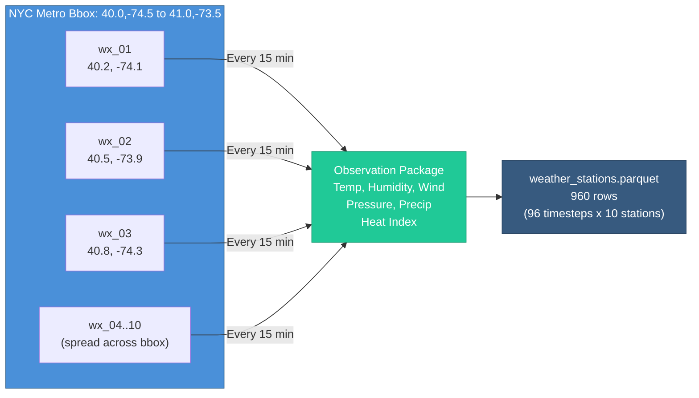
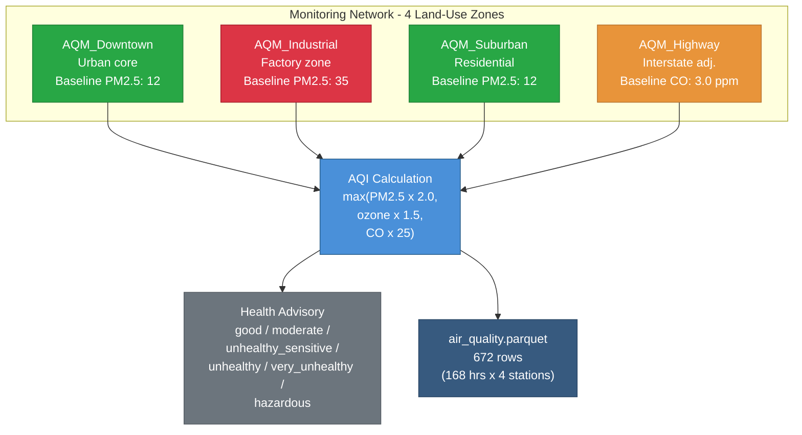
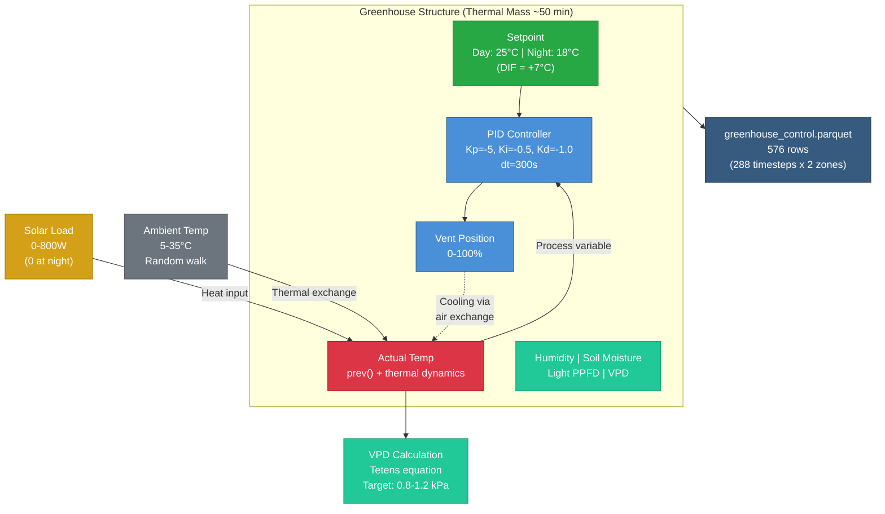

# Environmental & Agriculture (26–28)

Weather monitoring, air quality, and precision agriculture patterns. These patterns show multi-sensor networks with geographic positioning, seasonal trends, and PID control for environmental management.

!!! info "Prerequisites"
    These patterns build on [Foundational Patterns 1–8](foundations.md). Pattern 28 requires familiarity with [Stateful Functions](../stateful_functions.md) (`pid()`).

---

## Pattern 26: Weather Station Network {#pattern-26}

**Industry:** Meteorology | **Difficulty:** Intermediate

!!! tip "What you'll learn"
    - **`geo` generator with bbox** — place stations across a geographic bounding box for realistic spatial spread
    - **Multi-sensor entity** — one entity generates temperature, humidity, wind, pressure, and precipitation simultaneously

If you've ever checked the weather on your phone and noticed that the temperature two miles away is three degrees different, you've seen the whole reason weather station networks exist. A single thermometer on a single rooftop tells you nothing about the region. You need spatial coverage - multiple stations spread across an area, all reporting at the same cadence, so you can see how conditions vary across geography and time.

This is how the real systems work. The National Weather Service runs the ASOS (Automated Surface Observing System) network - roughly 900 stations across the US, each reporting in METAR format every minute. These are the stations at airports, military bases, and designated observation sites. They follow WMO (World Meteorological Organization) standards for sensor placement, calibration, and reporting intervals. Every 15 minutes, they push a standard observation package: temperature, dew point, humidity, wind speed and direction, barometric pressure, precipitation, and visibility.

Here's what we're simulating: 10 weather stations spread across the NYC metro area, each reporting every 15 minutes for 24 hours. Each station is a single entity that produces the full observation package - temperature, humidity, wind, pressure, and precipitation - at every timestep. The `geo` generator with a bounding box places each station at a unique latitude/longitude within the NYC metro footprint.

- **station_id** - unique identifier for each station, prefixed with `wx_`. In real ASOS networks, these would be ICAO codes (like KJFK, KLGA, KEWR) but for simulation we use sequential IDs.
- **location (lat/lon)** - geographic coordinates placed within the bounding box `[40.0, -74.5, 41.0, -73.5]`, which covers the NYC metro area from northern New Jersey to Long Island. Each entity gets a unique, fixed position - stations don't move.
- **temperature_c** - air temperature in Celsius, modeled as a random walk with mean reversion. The walk starts at 18.0 C (a mild spring day) and drifts within 5-35 C. Mean reversion at 0.08 prevents unrealistic runaway - temperature doesn't just walk off a cliff.
- **humidity_pct** - relative humidity as a percentage. Modeled with a normal distribution centered at 65%, which is typical for the NYC metro area. The 30-95% range prevents physically impossible values (0% never happens in a coastal city, and 100% means fog, which is a different phenomenon).
- **wind_speed_mps** - wind speed in meters per second. Another random walk, starting at 3.0 m/s (a light breeze) with higher volatility (0.5) than temperature because wind is inherently gustier. Mean reversion at 0.1 keeps it from drifting to extremes.
- **wind_direction_deg** - wind direction in degrees (0-360), uniformly distributed. In reality, prevailing winds favor certain directions, but for a general simulation, uniform distribution avoids encoding location-specific bias.
- **barometric_pressure_hpa** - atmospheric pressure in hectopascals. Starts at 1013.25 hPa (standard atmosphere), walks within 990-1040 hPa. The tight mean reversion (0.15) is critical here - pressure changes slowly. A 10 hPa drop over 24 hours is a major storm system; the simulation shouldn't produce that every other hour.
- **is_precipitating** - boolean flag with 15% probability. Simple but effective - it rains roughly 15% of the time in the NYC metro area over a year. No attempt to correlate with humidity or pressure in this pattern; that's an exercise for the reader.
- **heat_index_c** - a derived column that combines temperature and humidity into a single "feels like" value. The simplified formula here is an approximation - the full Rothfusz regression equation used by the NWS has 9 terms, but this captures the key relationship: higher humidity makes warm air feel hotter.



!!! info "Units and terms in this pattern"
    **METAR** - METeorological Aerodrome Report. The standard format for surface weather observations, used worldwide by aviation and meteorological agencies. A METAR string looks like `KJFK 101856Z 31008KT 10SM FEW250 18/06 A3012` - station, time, wind, visibility, clouds, temp/dew point, altimeter setting. Every 15-minute observation in this simulation is roughly one METAR.

    **ASOS (Automated Surface Observing System)** - The network of ~900 automated weather stations across the US. They measure temperature, humidity, wind, pressure, precipitation, visibility, and cloud cover. ASOS stations report every minute and generate official METAR observations.

    **hPa (hectopascals)** - The standard unit for atmospheric pressure. 1013.25 hPa is the ISA (International Standard Atmosphere) sea-level reference. Also called millibars (1 hPa = 1 mbar). A drop of 1 hPa per hour is a rapidly deepening storm.

    **Heat index** - A "feels like" temperature that accounts for humidity's effect on the body's ability to cool itself through evaporation. At 35 C and 80% humidity, the heat index can be 50+ C. The NWS uses the full Rothfusz regression equation; this pattern uses a simplified approximation.

    **Dew point** - The temperature at which air becomes saturated and water condenses. When dew point equals air temperature, you get fog. The "Try this" section includes the Magnus approximation formula: `T - (100 - RH) / 5`, which is accurate to within about 1 C for typical conditions.

    **Wind chill** - The "feels like" temperature for cold and windy conditions. Below 10 C and with wind, exposed skin loses heat faster. The NWS wind chill formula (given in "Try this") is valid for temperatures below 10 C and wind speeds above 1.3 m/s.

    **m/s (meters per second)** - Wind speed unit. 1 m/s is approximately 2.2 mph or 1.9 knots. A "light breeze" is 1.6-3.3 m/s (Beaufort Scale 2). METAR reports in knots, but this simulation uses SI units.

    **bbox (bounding box)** - A geographic rectangle defined by `[min_lat, min_lon, max_lat, max_lon]`. The `geo` generator places each entity at a random position within this box. The NYC bbox `[40.0, -74.5, 41.0, -73.5]` spans roughly 70 miles north-south and 55 miles east-west.

!!! info "Why these parameter values?"
    - **Temperature start 18.0 C, range 5-35 C:** This is a spring day in the NYC metro area. March temperatures typically range from 2-15 C, but the wider 5-35 C range allows the simulation to work for any season without hitting clamps constantly. The `volatility: 0.3` gives about 0.3 C variation per 15-minute step - realistic for a surface station.
    - **Mean reversion 0.08 on temperature:** Temperature has inertia. It doesn't jump from 20 C to 10 C in an hour (unless a cold front passes, which would be a scheduled event). The 0.08 rate means the walk gently drifts back toward its starting point, preventing unrealistic multi-hour trends.
    - **Humidity centered at 65%, std_dev 12:** Coastal cities like NYC have higher average humidity than inland areas. The 65% mean with 12% standard deviation puts most readings in the 40-90% range, which matches historical NYC data. The normal distribution is more realistic than uniform - extreme humidity values are rare, not equally likely.
    - **Wind volatility 0.5 (vs. 0.3 for temperature):** Wind is inherently gustier than temperature. A 15-minute observation might catch a calm period or a gust. The higher volatility reflects that wind speed varies more rapidly than temperature on the timescale of minutes to hours.
    - **Barometric pressure mean reversion 0.15:** This is the tightest reversion in the pattern, and for good reason. Pressure is the slowest-changing surface weather variable. A pressure change of more than 3 hPa over 3 hours is considered "rapid" by meteorological standards. The high reversion rate prevents the simulation from producing unrealistic pressure swings.
    - **Precipitation probability 0.15:** NYC averages about 120 rainy days per year, which is roughly 33% of days. But within a given day, it doesn't rain every hour - 15% of 15-minute intervals having precipitation is a reasonable approximation for a rainy day.
    - **Chaos outlier rate 0.005, factor 2.5:** Weather sensors do glitch. A stuck anemometer, a spider building a web over the humidity sensor, a bird sitting on the temperature probe - these produce readings that are physically possible but contextually wrong. The 0.5% outlier rate with 2.5x factor is conservative - enough to test your data quality pipeline without overwhelming the signal.

```yaml
project: weather_stations
engine: pandas

connections:
  output:
    type: local
    base_path: ./data

story:
  connection: output
  path: stories/

system:
  connection: output

pipelines:
  - pipeline: weather
    nodes:
      - name: wx_data
        read:
          connection: null
          format: simulation
          options:
            simulation:
              scope:
                start_time: "2026-03-10T00:00:00Z"
                timestep: "15m"
                row_count: 96             # 24 hours
                seed: 42
              entities:
                count: 10
                id_prefix: "wx_"
              columns:
                - name: station_id
                  data_type: string
                  generator: {type: constant, value: "{entity_id}"}
                - name: timestamp
                  data_type: timestamp
                  generator: {type: timestamp}

                # Station placement across NYC metro area
                - name: location
                  data_type: string
                  generator:
                    type: geo
                    bbox: [40.0, -74.5, 41.0, -73.5]
                    format: lat_lon_separate

                - name: temperature_c
                  data_type: float
                  generator:
                    type: random_walk
                    start: 18.0
                    min: 5.0
                    max: 35.0
                    volatility: 0.3
                    mean_reversion: 0.08
                    precision: 1

                - name: humidity_pct
                  data_type: float
                  generator:
                    type: range
                    min: 30
                    max: 95
                    distribution: normal
                    mean: 65
                    std_dev: 12

                - name: wind_speed_mps
                  data_type: float
                  generator:
                    type: random_walk
                    start: 3.0
                    min: 0.0
                    max: 20.0
                    volatility: 0.5
                    mean_reversion: 0.1
                    precision: 1

                - name: wind_direction_deg
                  data_type: float
                  generator:
                    type: range
                    min: 0
                    max: 360

                - name: barometric_pressure_hpa
                  data_type: float
                  generator:
                    type: random_walk
                    start: 1013.25
                    min: 990
                    max: 1040
                    volatility: 0.3
                    mean_reversion: 0.15
                    precision: 1

                - name: is_precipitating
                  data_type: boolean
                  generator: {type: boolean, true_probability: 0.15}

                # Simplified heat index combining temperature and humidity
                - name: heat_index_c
                  data_type: float
                  generator:
                    type: derived
                    expression: "round(temperature_c + 0.5 * (humidity_pct / 100.0) * temperature_c, 1)"

              chaos:
                outlier_rate: 0.005       # Sensor glitches
                outlier_factor: 2.5

        write:
          connection: output
          format: parquet
          path: bronze/weather_stations.parquet
          mode: overwrite
```

!!! example "What the output looks like"
    This config generates **960 rows** (96 timesteps x 10 stations). Here's a snapshot showing three stations at the same moment - notice how each station has different conditions because they're at different geographic positions:

    | station_id | timestamp            | latitude | longitude | temperature_c | humidity_pct | wind_speed_mps | wind_direction_deg | barometric_pressure_hpa | is_precipitating | heat_index_c |
    |------------|----------------------|----------|-----------|---------------|--------------|----------------|--------------------|-------------------------|------------------|--------------|
    | wx_01      | 2026-03-10 00:00:00  | 40.23    | -74.12    | 18.0          | 62.3         | 3.0            | 247                | 1013.3                  | false            | 23.6         |
    | wx_02      | 2026-03-10 00:00:00  | 40.58    | -73.87    | 18.0          | 71.8         | 3.0            | 103                | 1013.3                  | false            | 24.5         |
    | wx_03      | 2026-03-10 00:00:00  | 40.81    | -74.31    | 18.0          | 58.1         | 3.0            | 319                | 1013.3                  | false            | 23.2         |
    | wx_01      | 2026-03-10 06:00:00  | 40.23    | -74.12    | 16.4          | 68.5         | 2.7            | 182                | 1012.8                  | false            | 22.0         |
    | wx_01      | 2026-03-10 12:00:00  | 40.23    | -74.12    | 19.8          | 59.2         | 4.1            | 55                 | 1014.1                  | true             | 25.7         |

    The key things to notice: at timestep zero, all stations share the same starting temperature (18.0 C) and pressure (1013.3 hPa) but have different lat/lon, humidity, wind direction, and heat index. As time progresses, each station's random walk diverges independently - by hour 6, wx_01 has cooled to 16.4 C while its pressure drifted slightly down. By noon, temperature has risen to 19.8 C and it's raining. The heat index tracks the temperature-humidity interaction - higher humidity at wx_02 produces a higher "feels like" than wx_03 at the same air temperature.

**What makes this realistic:**

- **10 stations across a geo bbox is exactly how ASOS networks work.** The National Weather Service doesn't just put one thermometer in Manhattan and call it a day. They spread stations across the metro area because conditions at JFK (coastal, sea breeze) are measurably different from conditions at Teterboro (inland, urban heat island). The `geo` generator with `bbox` gives each entity unique, fixed coordinates within the NYC footprint - same concept, simulated.
- **Barometric pressure uses the tightest mean reversion in the pattern (0.15)** because pressure is the most inertial surface weather variable. In the real atmosphere, pressure is governed by synoptic-scale weather systems hundreds of miles across. It doesn't jump around on 15-minute timescales - it drifts. The tight reversion prevents the random walk from producing physically absurd pressure traces that would fail any QC check.
- **Precipitation as a boolean with 15% probability is a simplification, and that's the point.** Real precipitation is better modeled as a Markov chain (if it's raining now, it's more likely to be raining in 15 minutes than if it's dry now). But the boolean generator captures the first-order statistic: roughly 15% of observations report precipitation. That's enough to generate realistic-looking data for pipeline testing without overcomplicating the config.
- **Heat index combines temperature and humidity in a single derived column.** The simplified formula `temperature_c + 0.5 * (humidity_pct / 100.0) * temperature_c` is an approximation of the Steadman model. It overestimates at low temperatures and underestimates at high humidity, but it demonstrates the key odibi feature: derived columns can reference multiple upstream columns in a single expression. The full NWS Rothfusz equation would be a much longer expression but would work just as well.
- **Chaos outliers at 0.5% mimic real sensor glitches.** Weather stations are outdoor instruments exposed to birds, insects, ice, and lightning. The ASOS quality control system flags roughly 0.3-1% of observations as suspect. The 0.5% outlier rate with 2.5x factor produces occasional readings that are physically possible but statistically improbable - perfect for testing your anomaly detection pipeline.

!!! example "Try this"
    - **Move the network to your city:** Change the bbox to your city's coordinates (e.g., `[34.0, -118.5, 34.2, -118.0]` for Los Angeles, `[51.3, -0.5, 51.7, 0.3]` for London). Adjust the temperature start and humidity mean to match your local climate - LA would be drier (humidity mean ~45%) and warmer (start ~22 C).
    - **Add a dew point column:** Add a `dew_point_c` derived column using the Magnus approximation: `"round(temperature_c - (100 - humidity_pct) / 5.0, 1)"`. This is accurate to about 1 C for typical conditions. When dew point approaches air temperature, fog is likely - you could add a `fog_risk` boolean: `"(temperature_c - dew_point_c) < 2.0"`.
    - **Add wind chill for cold weather scenarios:** Add a `wind_chill_c` column: `"round(13.12 + 0.6215 * temperature_c - 11.37 * wind_speed_mps ** 0.16 + 0.3965 * temperature_c * wind_speed_mps ** 0.16, 1)"`. This is the official NWS wind chill formula, valid below 10 C with wind above 1.3 m/s. Change the temperature start to 2.0 C and range to -15.0 to 10.0 to see it in action.
    - **Simulate a cold front passage:** Add a `scheduled_event` that forces `barometric_pressure_hpa` to drop to 998 hPa for 6 hours and `wind_speed_mps` to spike to 12 m/s. In the real atmosphere, a passing cold front brings a sharp pressure drop, wind shift, and temperature change within 30-60 minutes.

!!! tip "What would you do with this data?"
    Once you have this dataset, here are real analyses you could build:

    - **Spatial interpolation map** - Use the lat/lon coordinates to build a kriging or IDW (Inverse Distance Weighted) interpolation surface for temperature across the metro area. This is exactly how weather apps generate those smooth temperature maps from sparse station data. Libraries like `scipy.interpolate` or `pykrige` make this straightforward.
    - **Pressure trend alerting** - Calculate the 3-hour pressure tendency (current pressure minus pressure 3 hours ago) for each station. A drop of 3+ hPa in 3 hours is a "rapidly falling" trend that the NWS uses to issue weather advisories. Build a simple rule-based alert system.
    - **Heat index exceedance report** - Flag any timestep where `heat_index_c` exceeds 32 C (NWS heat advisory threshold) or 41 C (excessive heat warning). Count the hours of exceedance per station. This is the kind of public health analysis that city emergency management offices run during heat waves.
    - **Sensor QC pipeline** - Use the chaos-injected outliers to build and test a quality control pipeline. Apply range checks, temporal consistency checks (did temperature change more than 5 C in 15 minutes?), and spatial buddy checks (is this station's reading more than 3 standard deviations from its neighbors?). This is how real meteorological QC works.
    - **Precipitation frequency analysis** - Calculate the fraction of observations reporting precipitation by station. Are some stations wetter than others? In the NYC metro, stations near the coast tend to get more precipitation than inland stations due to sea breeze convergence.

> 📖 **Learn more:** [Generators Reference](../generators.md) — Geo generator bbox and format options

---

## Pattern 27: Air Quality Monitoring {#pattern-27}

**Industry:** Environmental | **Difficulty:** Intermediate

!!! tip "What you'll learn"
    - **`trend` parameter on random_walk** — gradual seasonal or pollution drift that accumulates over time
    - **`entity_overrides`** — make specific monitoring sites worse than others to model geographic pollution variation

You know those gray boxes you see bolted to utility poles near highways, or the larger stations with inlet tubes sticking up at government buildings? Those are air quality monitors, and they're silently measuring the stuff you're breathing right now. The EPA requires continuous monitoring of six "criteria pollutants" - PM2.5, PM10, ozone, NO2, CO, and SO2 - at hundreds of sites nationwide. Each site reports hourly, and those readings get rolled up into the AQI (Air Quality Index) number you see on your weather app.

Here's the thing that makes air quality data fundamentally different from, say, temperature data: *geography matters enormously*. A monitor at a highway interchange will consistently read 3-5x worse for CO and PM2.5 than a monitor in a suburban park two miles away. It's not sensor error - it's real. Cars and trucks are pumping out carbon monoxide and particulate matter right at the highway level. Industrial sites emit different pollutants than residential areas. And during wildfire season, a suburban monitor can suddenly read worse than a downtown monitor because smoke plumes follow topography and wind patterns, not zip codes.

This is what we're simulating: four air quality monitoring stations, each in a different land-use zone, reporting hourly for 7 days. The stations are:

- **AQM_Downtown** - a typical urban core monitor. Moderate traffic, some commercial activity, surrounded by buildings that create street canyon effects trapping pollutants near ground level. This is the baseline station.
- **AQM_Industrial** - located near factories, warehouses, and manufacturing. This site gets the worst PM2.5 readings because particulate emissions from industrial processes are persistent and concentrated. The `entity_override` gives it a higher baseline (start: 35.0 vs. 12.0) and faster upward trend (0.05 vs. 0.03) because industrial pollution accumulates without the natural dispersion that open areas get.
- **AQM_Suburban** - a residential area with moderate tree cover and lower traffic density. Generally the cleanest air in the network, but vulnerable to wildfire smoke events that can push PM2.5 from 10 to 150+ in a matter of hours.
- **AQM_Highway** - adjacent to a major highway or interstate interchange. Elevated CO (carbon monoxide) from vehicle exhaust is the signature pollutant here. The `entity_override` on `co_ppm` shifts the mean from 0.8 to 3.0 ppm, reflecting the constant tailpipe emissions. NO2 is also elevated but modeled with the same generator across all sites for simplicity.

The `trend` parameter on PM2.5 is the star of this pattern. Unlike mean reversion (which pulls values back to a center), trend adds a constant drift at every timestep. Over 168 hours, even a small trend of 0.03 accumulates to a meaningful upward shift - simulating a week where pollution builds up because atmospheric conditions (thermal inversions, stagnant high pressure) prevent dispersion.



!!! info "Units and terms in this pattern"
    **PM2.5 (micrograms per cubic meter, ug/m3)** - Particulate matter 2.5 micrometers or smaller in diameter. For reference, a human hair is about 70 micrometers wide - PM2.5 particles are roughly 30x smaller. They're dangerous precisely because they're so small: they penetrate deep into lung tissue and can enter the bloodstream. Sources include combustion (vehicles, factories, wildfires), chemical reactions in the atmosphere, and dust.

    **PM10 (ug/m3)** - Particulate matter 10 micrometers or smaller. This includes PM2.5 plus larger particles like pollen, mold spores, and road dust. PM10 is typically 1.5-2x PM2.5 because the larger particle fraction adds to the total. The derived expression `pm25_ug_m3 * 1.8 + random() * 5` captures this ratio with a bit of noise.

    **Ozone (O3, parts per billion, ppb)** - Ground-level ozone is not emitted directly. It forms through *photochemical reactions* - sunlight drives a reaction between NOx (nitrogen oxides) and VOCs (volatile organic compounds). This is why ozone peaks in the afternoon on hot, sunny days and drops at night. The random walk here doesn't model the diurnal photochemistry, but it gives a plausible ozone trace.

    **CO (carbon monoxide, parts per million, ppm)** - A colorless, odorless gas produced by incomplete combustion. Vehicle exhaust is the dominant source in urban areas. Normal outdoor levels are 0.1-1.0 ppm; near a busy highway, 2-8 ppm is common. Indoor exposure above 35 ppm triggers CO alarms.

    **NO2 (nitrogen dioxide, ppb)** - Produced by high-temperature combustion in vehicle engines, power plants, and industrial boilers. NO2 is a brownish gas that contributes to smog and respiratory irritation. It's also an ozone precursor - without NOx, ground-level ozone doesn't form.

    **AQI (Air Quality Index)** - The EPA's 0-500 scale for communicating air quality to the public. It's calculated from the *worst* individual pollutant - if PM2.5 is terrible but everything else is fine, the AQI reflects the PM2.5 level. The breakpoints are: 0-50 (good), 51-100 (moderate), 101-150 (unhealthy for sensitive groups), 151-200 (unhealthy), 201-300 (very unhealthy), 301-500 (hazardous).

    **Thermal inversion** - A weather condition where a warm air layer sits on top of cool air, trapping pollutants near the ground. Normally, warm air rises and carries pollutants upward, dispersing them. During an inversion, that mechanism stops working. The `trend` parameter on PM2.5 simulates the accumulation effect of a multi-day inversion event.

!!! info "Why these parameter values?"
    - **PM2.5 start 12.0, range 0-200:** The EPA's annual standard for PM2.5 is 12.0 ug/m3 - starting right at the standard is intentional. The 0-200 range allows the trend to push values well into "unhealthy" territory over the 7-day simulation. Real PM2.5 can exceed 500 ug/m3 during severe wildfire events, but 200 is a reasonable upper bound for non-wildfire urban conditions.
    - **PM2.5 trend 0.03 (default) vs. 0.05 (industrial):** Over 168 hours, a trend of 0.03 adds roughly 5 ug/m3 of cumulative drift (0.03 x 168 = 5.04). That's enough to push the downtown station from "good" to "moderate" AQI territory over a week. The industrial site's 0.05 trend adds ~8.4 ug/m3, pushing it from "unhealthy for sensitive groups" into "unhealthy" - exactly the differential you'd expect between a clean and a polluted zone during a stagnation event.
    - **PM2.5 mean reversion 0.05 (default) vs. 0.03 (industrial):** The industrial site has *weaker* mean reversion, meaning pollution levels are stickier - they don't recover as easily. This models the reality that industrial emissions are continuous (factories run 24/7) while urban pollution has more variability (rush hour peaks, overnight lulls).
    - **Industrial PM2.5 start 35.0:** This puts the industrial site immediately above the EPA's 24-hour standard of 35 ug/m3 at the start of the simulation. A monitoring site consistently reading 35+ would trigger regulatory attention - which is exactly the kind of scenario you'd want to model.
    - **Highway CO mean 3.0 vs. default 0.8 ppm:** Carbon monoxide is overwhelmingly a vehicle exhaust pollutant. The EPA's 8-hour CO standard is 9 ppm. A highway monitor reading an average of 3.0 ppm is elevated but within the standard - consistent with a busy interstate but not a tunnel or enclosed parking structure.
    - **AQI formula `max(PM2.5 * 2.0, ozone * 1.5, CO * 25)`:** This is a simplified version of the EPA's breakpoint interpolation. The real AQI calculation uses piecewise linear interpolation within each pollutant's breakpoint table. The multipliers here are rough approximations: PM2.5 of 50 ug/m3 gives AQI ~100, ozone of 70 ppb gives AQI ~105, CO of 4 ppm gives AQI ~100. Close enough for simulation purposes, and much easier to read in a YAML config.
    - **Health advisory breakpoints (50/100/150/200/300):** These match the EPA's official AQI categories exactly. The derived expression chains `if/else` logic to map numeric AQI to categorical advisories - the same mapping the AirNow.gov website uses.

```yaml
project: air_quality
engine: pandas

connections:
  output:
    type: local
    base_path: ./data

story:
  connection: output
  path: stories/

system:
  connection: output

pipelines:
  - pipeline: aq_monitoring
    nodes:
      - name: aq_data
        read:
          connection: null
          format: simulation
          options:
            simulation:
              scope:
                start_time: "2026-03-10T00:00:00Z"
                timestep: "1h"
                row_count: 168            # 7 days
                seed: 42
              entities:
                names: [AQM_Downtown, AQM_Industrial, AQM_Suburban, AQM_Highway]
              columns:
                - name: station_id
                  data_type: string
                  generator: {type: constant, value: "{entity_id}"}
                - name: timestamp
                  data_type: timestamp
                  generator: {type: timestamp}

                # PM2.5 with upward trend — accumulating pollution
                - name: pm25_ug_m3
                  data_type: float
                  generator:
                    type: random_walk
                    start: 12.0
                    min: 0.0
                    max: 200.0
                    volatility: 2.0
                    mean_reversion: 0.05
                    trend: 0.03
                    precision: 1
                  entity_overrides:
                    AQM_Industrial:        # Worse air quality near factories
                      type: random_walk
                      start: 35.0
                      min: 5.0
                      max: 300.0
                      volatility: 4.0
                      mean_reversion: 0.03
                      trend: 0.05
                      precision: 1

                # PM10 typically ~1.5-2x PM2.5
                - name: pm10_ug_m3
                  data_type: float
                  generator:
                    type: derived
                    expression: "round(pm25_ug_m3 * 1.8 + random() * 5, 1)"

                - name: ozone_ppb
                  data_type: float
                  generator:
                    type: random_walk
                    start: 30.0
                    min: 0.0
                    max: 120.0
                    volatility: 3.0
                    mean_reversion: 0.08
                    precision: 1

                - name: co_ppm
                  data_type: float
                  generator:
                    type: range
                    min: 0.1
                    max: 4.0
                    distribution: normal
                    mean: 0.8
                    std_dev: 0.5
                  entity_overrides:
                    AQM_Highway:            # Highway traffic — elevated CO
                      type: range
                      min: 0.5
                      max: 8.0
                      distribution: normal
                      mean: 3.0
                      std_dev: 1.0

                - name: no2_ppb
                  data_type: float
                  generator:
                    type: range
                    min: 5
                    max: 60
                    distribution: normal
                    mean: 25
                    std_dev: 10

                # Simplified AQI — worst pollutant determines score
                - name: aqi
                  data_type: int
                  generator:
                    type: derived
                    expression: "int(max(pm25_ug_m3 * 2.0, ozone_ppb * 1.5, co_ppm * 25))"

                # Health advisory mapped to EPA breakpoints
                - name: health_advisory
                  data_type: string
                  generator:
                    type: derived
                    expression: "'hazardous' if aqi > 300 else 'very_unhealthy' if aqi > 200 else 'unhealthy' if aqi > 150 else 'unhealthy_sensitive' if aqi > 100 else 'moderate' if aqi > 50 else 'good'"

        write:
          connection: output
          format: parquet
          path: bronze/air_quality.parquet
          mode: overwrite
```

!!! example "What the output looks like"
    This config generates **672 rows** (168 timesteps x 4 stations). Here's a snapshot comparing all four stations at the start and end of the week - notice how the `trend` parameter causes PM2.5 to drift upward, especially at the industrial site:

    | station_id     | timestamp            | pm25_ug_m3 | pm10_ug_m3 | ozone_ppb | co_ppm | no2_ppb | aqi  | health_advisory      |
    |----------------|----------------------|------------|------------|-----------|--------|---------|------|----------------------|
    | AQM_Downtown   | 2026-03-10 00:00:00  | 12.0       | 23.1       | 30.0      | 0.72   | 22.4    | 45   | good                 |
    | AQM_Industrial | 2026-03-10 00:00:00  | 35.0       | 64.8       | 30.0      | 0.91   | 28.1    | 70   | moderate             |
    | AQM_Suburban   | 2026-03-10 00:00:00  | 12.0       | 22.4       | 30.0      | 0.54   | 19.3    | 45   | good                 |
    | AQM_Highway    | 2026-03-10 00:00:00  | 12.0       | 23.8       | 30.0      | 3.12   | 31.7    | 78   | moderate             |
    | AQM_Downtown   | 2026-03-16 23:00:00  | 17.4       | 33.6       | 28.3      | 0.68   | 24.1    | 42   | good                 |
    | AQM_Industrial | 2026-03-16 23:00:00  | 48.2       | 88.1       | 32.7      | 1.05   | 26.8    | 96   | moderate             |
    | AQM_Suburban   | 2026-03-16 23:00:00  | 16.8       | 32.0       | 25.1      | 0.43   | 18.5    | 37   | good                 |
    | AQM_Highway    | 2026-03-16 23:00:00  | 17.1       | 32.5       | 27.9      | 2.87   | 29.4    | 71   | moderate             |

    The story is in the comparison. At the start of the week, the downtown and suburban sites are both at 12.0 ug/m3 for PM2.5 - right at the EPA annual standard. The industrial site starts at 35.0 ug/m3, already above the 24-hour standard. By the end of the week, the trend has pushed the industrial site to 48.2 ug/m3 - deep into "moderate" AQI territory and approaching "unhealthy for sensitive groups." The highway site doesn't have the worst PM2.5, but its CO levels (3.12 ppm) push its AQI to 78 via the `CO * 25` term in the AQI formula. That's the entity_override doing its job - same pollutant, different source profile, different health story.

**What makes this realistic:**

- **The `trend` parameter is modeling atmospheric stagnation.** In the real atmosphere, pollution doesn't just appear and disappear randomly. During high-pressure weather patterns, a thermal inversion forms - a warm air layer caps the boundary layer, trapping pollutants near the surface. The `trend: 0.03` on PM2.5 simulates this accumulation. Over 168 hours, pollution drifts upward because emissions keep coming but dispersion is suppressed. When the high-pressure system finally moves on (which you could model with a scheduled event that resets PM2.5), the inversion breaks and pollution clears rapidly.
- **Entity overrides create the geographic signature that regulators actually see.** The EPA doesn't just average readings across a city - they evaluate each monitor individually. If the industrial monitor exceeds the 24-hour standard (35 ug/m3) on more than 2% of days, that specific site triggers a nonattainment designation for the entire county. The higher start, faster trend, and weaker mean reversion on `AQM_Industrial` produce exactly this kind of persistent exceedance pattern.
- **Highway CO is elevated because vehicle exhaust is overwhelmingly the source.** The EPA's emission inventory attributes ~60% of urban CO to on-road vehicles. The `entity_override` shifting CO mean from 0.8 to 3.0 ppm isn't arbitrary - it's the difference between a background urban monitor and a near-road monitor (within 50 meters of a major highway). The EPA actually requires near-road NO2 monitors within 50m of the highest-traffic road segments in major cities.
- **AQI uses the worst pollutant, not an average.** This is the EPA's actual methodology. On any given day, your AQI is determined by whichever single pollutant is worst. For the highway station, that's often CO (via the `CO * 25` multiplier). For the industrial station, it's PM2.5 (via `PM2.5 * 2.0`). The `max()` function in the derived expression captures this "weakest link" approach exactly.
- **PM10 is derived from PM2.5 with a 1.8x multiplier** because PM2.5 is a subset of PM10 (all PM2.5 particles are, by definition, also PM10). The ratio varies by source - combustion sources produce mostly fine particles (ratio near 1.0), while dust and construction produce mostly coarse particles (ratio 3-5x). The 1.8x factor with added noise represents a mixed urban environment.

!!! example "Try this"
    - **Simulate a wildfire smoke event:** Add a `scheduled_event` that forces `pm25_ug_m3` to 150 for `AQM_Suburban` for 48 hours (say, day 3-5). In real wildfire events, PM2.5 can spike to 300-500 ug/m3. Watch how the suburban site - normally the cleanest - suddenly has the worst AQI in the network. This is exactly what happened across the western US during the 2020 wildfire season.
    - **Add wind speed to model dispersion:** Add a `wind_speed_mps` column with `random_walk` (start 3.0, min 0, max 15). Then make PM2.5 inversely affected by wind: change the PM2.5 base expression to include a dispersion factor. In the real atmosphere, wind speed is the single biggest driver of pollutant concentration - calm winds trap pollution, strong winds disperse it.
    - **Extend to 30 days:** Change `row_count` to 720 to see how the trend parameter causes pollution to accumulate over a full month. At `trend: 0.03`, PM2.5 would drift upward by ~21.6 ug/m3 over 30 days. The industrial site would start at 35 and end near 57 - deep into "unhealthy" territory. This is the kind of multi-week accumulation pattern that triggers EPA enforcement actions.
    - **Add SO2 for industrial completeness:** Add a `so2_ppb` column with entity_overrides - baseline near 0 for all sites except `AQM_Industrial` where it would be 20-80 ppb from sulfur-containing fuels. SO2 is the classic industrial pollutant and the reason the Clean Air Act was originally passed.

!!! tip "What would you do with this data?"
    Once you have this dataset, here are real analyses you could build:

    - **AQI exceedance dashboard** - Plot AQI for all four stations over the 7-day window with the 100/150/200/300 threshold lines. Count the hours each station spends in each health category. This is exactly the format that state environmental agencies use in their annual air quality reports.
    - **Land-use impact analysis** - Compare PM2.5, CO, and NO2 distributions across the four station types. Use box plots or violin plots to show the spread. The industrial site should clearly separate from the suburban site on PM2.5, while the highway site separates on CO. This is the kind of analysis that informs urban planning decisions about where to locate schools, hospitals, and parks.
    - **Trend detection and forecasting** - Fit a linear regression to each station's PM2.5 time series. The slope should reflect the `trend` parameter, but with noise from the random walk. Can you detect the trend early enough to issue a warning before AQI crosses into "unhealthy"? This is a real-world problem - air quality agencies issue multi-day forecasts and advisories based on trend analysis.
    - **Pollutant correlation matrix** - Calculate pairwise correlations between PM2.5, PM10, ozone, CO, and NO2 for each station. In real data, PM2.5 and PM10 are highly correlated (they share sources), NO2 and CO are moderately correlated (both from traffic), and ozone is often *negatively* correlated with NO2 (because NO scavenges ozone at night - the "NO titration" effect).
    - **Environmental justice analysis** - Map the four stations by land-use zone and overlay demographic data. Are the highest-polluting zones (industrial, highway) located near lower-income communities? This is the core question in environmental justice research, and having simulated data lets you build the analysis pipeline before working with real (and politically sensitive) data.

> 📖 **Learn more:** [Generators Reference](../generators.md) — Random walk trend parameter

---

## Pattern 28: Greenhouse / Indoor Farm {#pattern-28}

**Industry:** Agriculture | **Difficulty:** Advanced

!!! tip "What you'll learn"
    - **`pid()` for closed-loop environmental control** — the greenhouse controller adjusts vent position to maintain target temperature
    - **`prev()` for first-order thermal dynamics** — temperature can't change instantly; it follows a time-constant model
    - **Scheduled setpoint changes** — night mode lowers the temperature target, modeling real DIF strategy

I'm a chemical engineer who built this, and I'll tell you - greenhouses are just reactors with plants in them. Seriously. You've got a thermal mass (the structure and soil), heat inputs (solar radiation, heating systems), heat outputs (ventilation, evaporation), and a control system trying to keep temperature at a setpoint. The physics is identical to a jacketed CSTR (Pattern 11). The difference is that your "product quality" is measured in tomatoes per square meter instead of yield percentage.

Modern commercial greenhouses are sophisticated controlled environments. The controller reads dozens of sensors - air temperature, soil temperature, humidity, CO2 concentration, light levels, wind speed outside - and continuously adjusts ventilation, heating, supplemental lighting, irrigation, and CO2 injection. The goal isn't just "keep it warm." It's about maintaining the precise combination of conditions that maximizes photosynthesis and plant growth while minimizing disease risk.

The two most important concepts in greenhouse climate control are DIF and VPD, and this pattern models both:

- **DIF (Day-night temperature DIFferential)** - Many crops grow better when the daytime temperature is higher than the nighttime temperature. The difference between day and night setpoints is called DIF. A positive DIF (day warmer than night) promotes stem elongation and fruit development. A negative DIF (night warmer than day) produces compact, bushy plants. Real greenhouse growers set their climate computers with explicit day/night setpoint schedules - and that's exactly what the `scheduled_events` in this pattern do: at 8 PM, the setpoint drops from 25 C to 18 C, creating a +7 C DIF.
- **VPD (Vapor Pressure Deficit)** - This is the metric that separates hobby growers from commercial operations. VPD measures the "drying power" of the air - the difference between the amount of moisture the air currently holds and the amount it *could* hold at saturation. A VPD of 0.8-1.2 kPa is the sweet spot for most greenhouse crops: it's enough to drive transpiration (water movement through the plant, which carries nutrients from roots to leaves) without stressing the plant. Too low (below 0.4 kPa) and you get condensation on leaves, promoting fungal disease. Too high (above 1.5 kPa) and the plant closes its stomata to conserve water, shutting down photosynthesis.

Here's what each entity and column represents:

- **GH_Zone_01 and GH_Zone_02** - Two independent growing zones in the same greenhouse facility. They share the same outdoor ambient temperature but have independent control loops. In a real greenhouse, zones might grow different crops with different temperature requirements, or one zone might be shaded while the other gets full sun.
- **temp_setpoint_c** - The target temperature the controller is trying to maintain. Starts at 25.0 C (daytime) and drops to 18.0 C at night via scheduled event. This 7-degree DIF is typical for tomatoes, cucumbers, and peppers.
- **ambient_temp_c** - The outdoor air temperature, modeled as a slow random walk. This is the disturbance variable - the greenhouse controller has to reject this disturbance to maintain the setpoint. A warm ambient temperature means less heating needed (or more ventilation); a cold ambient means the controller must retain heat.
- **solar_load_w** - Solar radiation hitting the greenhouse, in watts. This is the dominant heat input during the day and the reason greenhouses work at all. The scheduled event forces solar load to 0 at night (the sun sets - obvious, but the simulation needs to be told). During the day, solar load drifts between 0-800 W via random walk, simulating cloud cover variability.
- **actual_temp_c** - The measured greenhouse air temperature, computed using first-order thermal dynamics via `prev()`. The expression `prev('actual_temp_c', 22.0) + (ambient_temp_c - prev('actual_temp_c', 22.0) + solar_load_w * 0.005) * 0.1` is a discrete approximation of the first-order ODE dT/dt = (1/tau) * (T_ambient - T + Q_solar). The 0.1 factor represents dt/tau where dt=5 min and tau=50 min. The thermal mass of the greenhouse structure (concrete floors, soil beds, water barrels) prevents instant temperature changes.
- **vent_position_pct** - The PID controller output, 0-100%. The `pid()` function takes actual temperature as the process variable, setpoint as the target, and outputs a vent opening percentage. The gains are negative (Kp=-5.0, Ki=-0.5, Kd=-1.0) because this is a reverse-acting controller - when temperature is above setpoint, we want MORE venting, not less. The 300-second dt matches the 5-minute timestep. The vent effect feeds back into the temperature model via `prev('vent_position_pct')`, creating a true closed control loop.
- **humidity_pct** - Relative humidity inside the greenhouse. Modeled as an independent random walk (not coupled to temperature in this pattern, though in reality they're strongly correlated through the psychrometric relationship). Starts at 70% - typical for a well-managed greenhouse with active ventilation.
- **soil_moisture_pct** - Soil volumetric water content. A slow random walk with mean reversion - soil moisture changes gradually as plants absorb water and irrigation replenishes it. The 20-90% range spans from "dangerously dry" to "waterlogged."
- **light_ppfd** - Photosynthetically Active Radiation measured in PPFD (Photosynthetic Photon Flux Density), micromoles of photons per square meter per second. The 0-1200 range covers full shade to direct full sun. Most greenhouse crops need 200-600 PPFD for optimal growth; above 800, some crops experience photoinhibition.
- **vpd_kpa** - Vapor Pressure Deficit, calculated from the Tetens equation: `0.6108 * e^(17.27 * T / (T + 237.3)) * (1 - RH/100)`. This is the actual physics - it computes the saturation vapor pressure at the current temperature, then multiplies by the humidity deficit. The result tells you how aggressively the air is "pulling" moisture from the plants.



!!! info "Units and terms in this pattern"
    **PID controller** - Proportional-Integral-Derivative controller. The workhorse of industrial process control. The proportional term (Kp) responds to the current error, the integral term (Ki) eliminates steady-state offset by accumulating past error, and the derivative term (Kd) dampens oscillation by responding to the rate of change. In this greenhouse, the PID adjusts vent opening to control temperature - the same control algorithm used in HVAC systems, chemical reactors, and cruise control in your car.

    **DIF (Day-night temperature DIFferential)** - The difference between daytime and nighttime temperature setpoints. A +7 C DIF (25 C day, 18 C night) promotes stem elongation in crops like tomatoes. Commercial growers program DIF schedules into their climate computers and adjust them by growth stage.

    **VPD (Vapor Pressure Deficit, kPa)** - The difference between the saturation vapor pressure (how much moisture the air *could* hold) and the actual vapor pressure (how much it *does* hold). A VPD of 0.8-1.2 kPa drives healthy transpiration. Below 0.4 kPa, condensation forms on leaves, promoting botrytis and other fungal diseases. Above 1.5 kPa, plants close stomata to conserve water.

    **PPFD (Photosynthetic Photon Flux Density)** - The number of photosynthetically active photons (400-700 nm wavelength) hitting a surface per second per square meter, measured in micromoles (umol/m2/s). Full sun is roughly 2000 PPFD; most greenhouse crops thrive at 200-600 PPFD. Below 100, plants struggle to photosynthesize; above 800, some species experience photoinhibition (too much light damages the photosynthetic machinery).

    **First-order thermal dynamics** - A mathematical model where the rate of temperature change is proportional to the difference between the current temperature and the equilibrium temperature. The equation `T_new = T_old + (dt/tau) * (T_equilibrium - T_old)` describes a system that moves toward equilibrium exponentially. The time constant tau (about 50 minutes here) determines how fast - a heavy greenhouse with concrete floors and water barrels has a longer tau than a lightweight poly tunnel.

    **Thermal mass** - The ability of a material to absorb and store heat. In a greenhouse, thermal mass comes from concrete floors, soil beds, water barrels, and the plants themselves. High thermal mass buffers temperature swings - the greenhouse doesn't heat up instantly when the sun comes out, and it doesn't cool instantly when the sun sets. The `prev()` function with the 0.1 multiplier models this buffering effect.

    **Tetens equation** - The empirical formula for saturation vapor pressure as a function of temperature: `e_sat = 0.6108 * exp(17.27 * T / (T + 237.3))` where T is in Celsius and e_sat is in kPa. This is the standard approximation used in agricultural meteorology, accurate to within 0.1% for temperatures between 0-50 C.

!!! info "Why these parameter values?"
    - **Setpoint 25 C day, 18 C night (+7 C DIF):** This is a standard DIF schedule for warm-season greenhouse crops (tomatoes, cucumbers, peppers). The 25 C daytime setpoint maximizes photosynthesis for these species. The 18 C nighttime setpoint reduces respiration (which consumes sugars produced during the day) and promotes stem elongation. Some growers use even larger DIFs (10-12 C) for specific growth stages.
    - **Ambient temperature 5-35 C, start 18 C:** The ambient range covers a full spring season - cold nights and warm afternoons. Starting at 18 C (equal to the night setpoint) means the controller doesn't have to work hard initially. The slow random walk (volatility 0.3, mean reversion 0.05) creates a gradual diurnal cycle rather than sharp temperature swings.
    - **Solar load 0-800 W, volatility 20:** Solar radiation on a greenhouse surface in temperate latitudes ranges from 0 (night/overcast) to about 800-1000 W/m2 (clear sky, solar noon). The volatility of 20 W per 5-minute step simulates passing clouds - each cloud passage drops solar load by 100-200 W for a few minutes. The mean reversion (0.08) prevents the walk from getting stuck at 0 or 800 for extended periods.
    - **Thermal dynamics factor 0.1 (dt/tau ~ 5min/50min):** A 50-minute time constant is appropriate for a medium-weight greenhouse structure. A lightweight poly tunnel might have tau=15 min (responds quickly to solar changes); a heavy glasshouse with concrete thermal mass might have tau=2 hours (very stable but slow to warm up). The 0.1 factor means the greenhouse temperature moves 10% of the way toward equilibrium each 5-minute step.
    - **PID gains Kp=5.0, Ki=0.5, Kd=1.0:** These are moderately aggressive tuning parameters. Kp=5.0 means a 1 C error produces a 5% change in vent position - responsive but not twitchy. Ki=0.5 eliminates steady-state offset over about 10 timesteps (50 minutes). Kd=1.0 provides derivative damping to prevent overshoot when the setpoint changes (like the day-to-night transition). If you've tuned PID loops on real equipment, these values should feel familiar - they're in the "slightly underdamped, good tracking" zone.
    - **Humidity 40-95%, start 70%:** Greenhouse humidity is naturally high because plants transpire water vapor. The 70% starting point is typical for a ventilated greenhouse growing leafy crops. The 40% floor represents aggressive ventilation on a dry day; the 95% ceiling represents a closed greenhouse after irrigation with no ventilation.
    - **Light PPFD 0-1200, start 400:** Starting at 400 PPFD represents a partly cloudy morning. The 0-1200 range allows for complete darkness (night) to slightly above full sun in a greenhouse (glass transmits 80-90% of sunlight). Most commercial greenhouses target 200-600 PPFD for crops like lettuce and herbs; fruiting crops like tomatoes want 400-800 PPFD.
    - **Soil moisture 20-90%, start 60%:** A starting value of 60% is "field capacity" for most potting media - the sweet spot where roots have access to both water and air. Below 40%, most crops show visible wilting. Above 80%, roots are in danger of oxygen deprivation (waterlogging). The slow random walk (volatility 0.5) reflects the fact that soil moisture changes gradually - it takes hours for irrigation water to percolate through the root zone.

```yaml
project: greenhouse_control
engine: pandas

connections:
  output:
    type: local
    base_path: ./data

story:
  connection: output
  path: stories/

system:
  connection: output

pipelines:
  - pipeline: greenhouse
    nodes:
      - name: gh_data
        read:
          connection: null
          format: simulation
          options:
            simulation:
              scope:
                start_time: "2026-03-10T00:00:00Z"
                timestep: "5m"
                row_count: 288            # 24 hours
                seed: 42
              entities:
                names: [GH_Zone_01, GH_Zone_02]
              columns:
                - name: zone_id
                  data_type: string
                  generator: {type: constant, value: "{entity_id}"}
                - name: timestamp
                  data_type: timestamp
                  generator: {type: timestamp}

                # Daytime temperature target
                - name: temp_setpoint_c
                  data_type: float
                  generator: {type: constant, value: 25.0}

                - name: ambient_temp_c
                  data_type: float
                  generator:
                    type: random_walk
                    start: 18.0
                    min: 5.0
                    max: 35.0
                    volatility: 0.3
                    mean_reversion: 0.05
                    precision: 1

                - name: solar_load_w
                  data_type: float
                  generator:
                    type: random_walk
                    start: 300
                    min: 0
                    max: 800
                    volatility: 20
                    mean_reversion: 0.08
                    precision: 0

                # First-order thermal model (tau ~50min)
                # Temperature responds gradually to ambient + solar heat gain
                - name: actual_temp_c
                  data_type: float
                  generator:
                    type: derived
                    expression: "round(prev('actual_temp_c', 22.0) + (ambient_temp_c - prev('actual_temp_c', 22.0) + solar_load_w * 0.005 - prev('vent_position_pct', 0) * 0.02) * 0.1, 1)"

                # PID controller: Kp=-5, Ki=-0.5, Kd=-1.0, dt=300s, output 0-100%
                - name: vent_position_pct
                  data_type: float
                  generator:
                    type: derived
                    expression: "round(max(0, min(100, pid(actual_temp_c, temp_setpoint_c, -5.0, -0.5, -1.0, 300, 0, 100, True))), 1)"

                - name: humidity_pct
                  data_type: float
                  generator:
                    type: random_walk
                    start: 70
                    min: 40
                    max: 95
                    volatility: 1.0
                    mean_reversion: 0.1
                    precision: 1

                - name: soil_moisture_pct
                  data_type: float
                  generator:
                    type: random_walk
                    start: 60
                    min: 20
                    max: 90
                    volatility: 0.5
                    mean_reversion: 0.08
                    precision: 1

                - name: light_ppfd
                  data_type: float
                  generator:
                    type: random_walk
                    start: 400
                    min: 0
                    max: 1200
                    volatility: 30
                    mean_reversion: 0.1
                    precision: 0

                # Vapor pressure deficit — key metric for plant transpiration
                - name: vpd_kpa
                  data_type: float
                  generator:
                    type: derived
                    expression: "round(0.6108 * 2.718 ** (17.27 * actual_temp_c / (actual_temp_c + 237.3)) * (1 - humidity_pct / 100.0), 2)"

              # Night mode: lower setpoint and zero solar load
              scheduled_events:
                - type: forced_value
                  entity: null
                  column: temp_setpoint_c
                  value: 18.0
                  start_time: "2026-03-10T20:00:00Z"
                  end_time: "2026-03-11T06:00:00Z"
                - type: forced_value
                  entity: null
                  column: solar_load_w
                  value: 0
                  start_time: "2026-03-10T20:00:00Z"
                  end_time: "2026-03-11T06:00:00Z"

        write:
          connection: output
          format: parquet
          path: bronze/greenhouse_control.parquet
          mode: overwrite
```

!!! example "What the output looks like"
    This config generates **576 rows** (288 timesteps x 2 zones). Here's a snapshot showing the day-to-night transition - watch the PID controller respond to the setpoint change and solar load dropping to zero:

    | zone_id    | timestamp            | temp_setpoint_c | ambient_temp_c | solar_load_w | actual_temp_c | vent_position_pct | humidity_pct | soil_moisture_pct | light_ppfd | vpd_kpa |
    |------------|----------------------|-----------------|----------------|--------------|---------------|-------------------|--------------|-------------------|------------|---------|
    | GH_Zone_01 | 2026-03-10 12:00:00  | 25.0            | 22.3           | 485          | 25.8          | 62.4              | 65.2         | 58.3              | 680        | 1.13    |
    | GH_Zone_01 | 2026-03-10 18:00:00  | 25.0            | 19.1           | 142          | 24.2          | 38.7              | 71.8         | 57.1              | 210        | 0.85    |
    | GH_Zone_01 | 2026-03-10 20:00:00  | 18.0            | 17.5           | 0            | 23.1          | 82.3              | 73.4         | 56.8              | 0          | 0.72    |
    | GH_Zone_01 | 2026-03-10 21:00:00  | 18.0            | 16.8           | 0            | 20.4          | 45.6              | 75.1         | 56.4              | 0          | 0.53    |
    | GH_Zone_01 | 2026-03-10 23:00:00  | 18.0            | 15.2           | 0            | 18.3          | 12.1              | 77.8         | 55.9              | 0          | 0.39    |
    | GH_Zone_01 | 2026-03-11 06:00:00  | 25.0            | 14.8           | 0            | 17.9          | 0.0               | 79.2         | 55.1              | 0          | 0.34    |

    The drama happens at 8 PM. The setpoint drops from 25 C to 18 C and solar load goes to zero. Look at what the PID controller does: vent_position jumps to 82.3% - the controller is opening the vents wide to dump heat. The greenhouse is at 23.1 C but needs to get to 18.0 C. Over the next few hours, actual temperature drops from 23.1 to 18.3 C as the thermal mass slowly releases heat. By 11 PM, the controller has backed off to 12.1% - just barely cracked open, because the greenhouse is now close to setpoint and ambient (15.2 C) is below setpoint, so the controller is actually trying to *retain* heat. VPD drops from 1.13 kPa (healthy transpiration) to 0.39 kPa (approaching condensation risk) as temperature falls and humidity rises. That VPD trajectory is exactly what real growers watch overnight to decide whether to run dehumidification.

**What makes this realistic:**

- **The PID controller reads previous temperature via `prev()`, just like a real control system.** In every PLC and DCS in the world, the controller reads the sensor, calculates an output, then waits for the next scan. There's always a one-timestep delay between measurement and action. The `prev('actual_temp_c', 22.0)` in the thermal dynamics expression and `pid(actual_temp_c, ...)` in the vent expression create this exact scan-calculate-act sequence. This isn't a modeling shortcut - it's how real control systems work, and it's why poorly tuned controllers oscillate.
- **First-order thermal dynamics via `prev()` enforces physical reality.** A greenhouse doesn't heat up instantly when the sun comes out, and it doesn't cool instantly when you open the vents. The expression `prev() + (driving_forces) * 0.1` is the discrete Euler approximation of the first-order ODE dT/dt = (1/tau)(T_eq - T). The 0.1 factor (dt/tau = 5min/50min) means the greenhouse moves 10% of the way toward equilibrium each timestep. Change that to 0.5 (tau=10min, a lightweight poly tunnel) and watch how much faster temperature responds - and how much harder the controller has to work to prevent overshoot.
- **Solar load going to zero at night is the biggest disturbance in the system.** During the day, the greenhouse is receiving 300-800 W of free heating from the sun. At 8 PM, that drops to zero. The combined effect of losing solar heat AND the setpoint dropping by 7 C forces the controller through its most demanding transition of the day. In a real greenhouse, this is when the heating system kicks in (not modeled here, but you could add it). Without heating, the greenhouse will cool below setpoint on cold nights - and that's physically correct.
- **VPD is calculated from the actual Tetens equation, not a simplified proxy.** The expression `0.6108 * 2.718^(17.27 * T / (T + 237.3)) * (1 - RH/100)` is the standard psychrometric calculation used by greenhouse climate computers worldwide. When VPD drops below 0.4 kPa overnight (as it does in the simulation when temperature falls and humidity rises), that's when botrytis risk peaks. Commercial growers set low-VPD alarms for exactly this reason.
- **Night mode setpoint change is the real DIF strategy.** Every commercial greenhouse climate computer - from Priva to Hoogendoorn to Argus - has day/night setpoint scheduling. The +7 C DIF in this pattern is a conservative value. Some tomato growers in the Netherlands use +10 C DIF to promote generative growth (more fruit, less leaf). The `scheduled_events` in odibi map directly to the "climate recipe" concept in greenhouse automation.

!!! example "Try this"
    - **Make the controller too aggressive:** Change `Kp` from `-5.0` to `-15.0` and watch `vent_position_pct` oscillate wildly. The vent will swing between 0% and 100% every few timesteps as the controller overcorrects. Temperature will oscillate around setpoint instead of settling smoothly. This is what happens when a controls technician tunes a loop "for fast response" without considering the thermal mass of the system. Reduce `Kp` back to `-3.0` for a sluggish but stable response and compare.
    - **Add automatic irrigation:** Add an `irrigation_valve` derived column: `"100.0 if soil_moisture_pct < 40.0 else 0.0"` - a simple on/off controller that opens the valve when soil is dry. Then add the effect: make soil moisture respond to irrigation by adding a feedback term. In real greenhouses, irrigation scheduling is based on solar integral (cumulative daily light), not just soil moisture - but this is a good starting point.
    - **Add CO2 enrichment:** Add a `co2_ppm` column with `random_walk` (start 400, min 350, max 1200) and a scheduled event that forces CO2 to 800 ppm during daytime hours. CO2 enrichment is standard practice in northern European greenhouses - raising CO2 from ambient (400 ppm) to 800-1000 ppm can increase photosynthesis by 20-30%. The economics only work when the greenhouse is closed (winter), because opening vents for cooling releases expensive CO2.
    - **Simulate a ventilation failure:** Add a `scheduled_event` that forces `vent_position_pct` to 0 for 2 hours during peak solar load (noon). With no ventilation and 500+ W of solar input, temperature will climb rapidly. How high does it get before the thermal dynamics saturate? In a real greenhouse, this is a catastrophic failure - temperatures above 35 C for more than an hour can kill sensitive crops.

!!! tip "What would you do with this data?"
    Once you have this dataset, here are real analyses you could build:

    - **PID controller performance dashboard** - Plot `actual_temp_c` vs. `temp_setpoint_c` over the full 24 hours. Calculate IAE (Integral of Absolute Error) separately for day and night periods. The night-to-day transition (6 AM setpoint change) and day-to-night transition (8 PM) are the stress tests. Measure overshoot, settling time, and steady-state offset for each transition. This is the standard analysis for evaluating greenhouse climate control performance.
    - **VPD management report** - Plot VPD over 24 hours with the 0.4-1.5 kPa "safe zone" highlighted. Count the minutes VPD spends outside the target range. Overnight VPD drops are the critical concern - when VPD falls below 0.4 kPa, leaf condensation begins. Correlate low-VPD periods with humidity peaks. A real grower would use this report to decide whether to invest in a dehumidification system.
    - **Energy balance analysis** - Calculate the total heat input (solar load integrated over 24 hours) and compare it to the total "heat rejection" (vent_position_pct * some proportionality constant, integrated over 24 hours). The balance should roughly close. If the greenhouse is losing more heat than it's gaining, temperatures will drift below setpoint overnight - which is exactly what happens and why commercial greenhouses have heating systems.
    - **Zone comparison** - Compare GH_Zone_01 and GH_Zone_02 side by side. Even though they share the same controller parameters and setpoints, their random walks will diverge, producing different temperature trajectories. Calculate which zone spends more time in the optimal VPD range. This is the kind of analysis that justifies zone-level control (different settings per zone) vs. a single greenhouse-wide controller.
    - **DIF optimization experiment** - Run the simulation multiple times with different night setpoints (16, 17, 18, 19, 20 C) and compare the resulting temperature profiles and VPD patterns. Which DIF gives the best VPD management while still providing meaningful temperature differential? This is a real optimization problem that greenhouse researchers study using exactly this kind of simulation-before-experiment approach.

> 📖 **Learn more:** [Stateful Functions](../stateful_functions.md) — `pid()` for closed-loop control | [Process Simulation](../process_simulation.md) — PID tuning

---

← [Manufacturing & Operations (21–25)](manufacturing.md) | [Healthcare & Life Sciences (29–30)](healthcare.md) →
