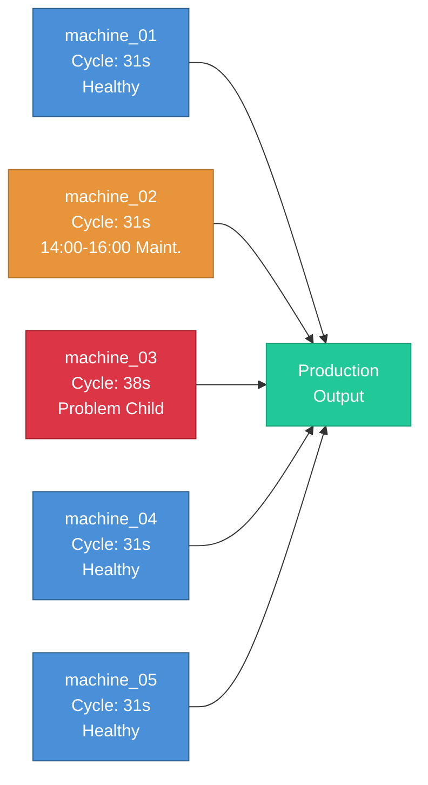
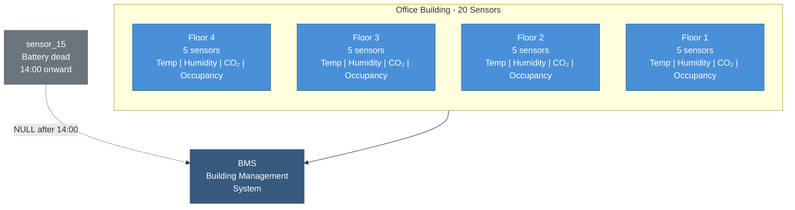
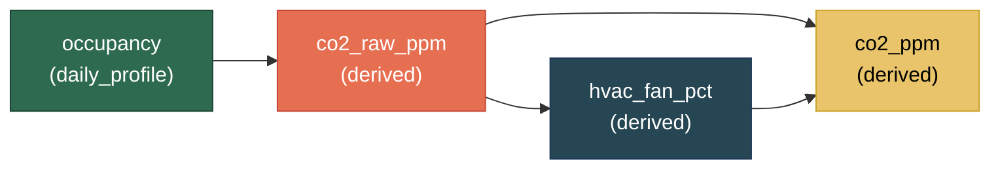
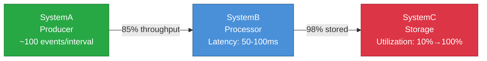

# Foundational Patterns (1–8)

These 8 patterns cover the core simulation features. Start here — every later pattern builds on concepts introduced in this section.

!!! info "Prerequisites"
    Before diving in, make sure you've completed [Getting Started](../getting_started.md) and understand [Core Concepts](../core_concepts.md).

---

## Pattern 1: Build Before Sources Exist {#pattern-1}

**Industry:** General | **Difficulty:** Beginner

!!! tip "What you'll learn"
    - **Simulation as a bronze source** — use `format: simulation` in a read node to generate data instead of reading from a file or database
    - **Full medallion pipeline** — bronze (simulated) → silver (transform) → gold (aggregate) in one config
    - **The format swap** — when real data arrives, change `format: simulation` to `format: csv` and delete the simulation block. Silver and gold stay unchanged.

**The most common pattern.** Simulate what your upstream source will look like, build the full pipeline (transforms, validation, write), then swap bronze to real data later - silver and gold stay unchanged.

This is the entire point of simulation: **decouple pipeline development from data availability.** You don't need to wait for IT to provision a database connection or for a vendor to send sample files. Define what the data *should* look like, build everything downstream, and swap in the real source when it's ready. One line changes (`format: simulation` to `format: csv`), everything else stays the same.

- **Bronze node** - the simulated source. This is where you define the shape of your upstream data: column names, types, distributions, and volume. When real data arrives, this is the only node that changes.
- **Silver node** - transforms and validation. Derive new columns, apply business rules, validate data quality. This layer is completely independent of where the data came from.
- **Gold node** - aggregations and business-ready output. Summarize, pivot, or reshape for dashboards and reports.

!!! info "Why these parameter values?"
    - **`row_count: 720`:** 30 days of hourly data - enough to build and test transforms without generating an unnecessarily large dataset.
    - **`seed: 42`:** Makes the simulation reproducible. Run it twice, get the same data - useful for debugging transforms.
    - **`unit_price` with normal distribution (mean 45, std 25):** Most orders cluster around $45 with a realistic tail of expensive items, rather than a flat uniform spread.
    - **`product` weights `[0.40, 0.30, 0.20, 0.10]`:** Simulates a Pareto-like distribution where Widget_A is the bestseller and Premium_Z is a niche product.

```yaml
project: sales_pipeline
engine: pandas

connections:
  output:
    type: local
    base_path: ./data

story:
  connection: output
  path: stories/

system:
  connection: output

pipelines:
  - pipeline: sales
    nodes:
      # ── Bronze: Simulated source ──────────────────────────
      - name: raw_orders
        read:
          connection: null
          format: simulation
          options:
            simulation:
              scope:
                start_time: "2026-01-01T00:00:00Z"
                timestep: "1h"
                row_count: 720        # 30 days of hourly data
                seed: 42
              entities:
                count: 1
                id_prefix: "source_"
              columns:
                - name: order_id
                  data_type: int
                  generator: {type: sequential, start: 10001}
                - name: timestamp
                  data_type: timestamp
                  generator: {type: timestamp}
                - name: customer_id
                  data_type: string
                  generator: {type: uuid, version: 4}
                - name: product
                  data_type: string
                  generator:
                    type: categorical
                    values: [Widget_A, Widget_B, Gadget_X, Premium_Z]
                    weights: [0.40, 0.30, 0.20, 0.10]
                - name: quantity
                  data_type: int
                  generator: {type: range, min: 1, max: 20}
                - name: unit_price
                  data_type: float
                  generator:
                    type: range
                    min: 9.99
                    max: 149.99
                    distribution: normal
                    mean: 45.00
                    std_dev: 25.00
        write:
          connection: output
          format: parquet
          path: bronze/orders.parquet
          mode: overwrite

      # ── Silver: Transform (unchanged when bronze goes live) ──
      - name: clean_orders
        read:
          connection: output
          format: parquet
          path: bronze/orders.parquet
        transform:
          steps:
            - operation: derive_columns
              params:
                derivations:
                  line_total: "quantity * unit_price"
                  order_tier: >
                    CASE
                      WHEN quantity * unit_price > 500 THEN 'high'
                      WHEN quantity * unit_price > 100 THEN 'medium'
                      ELSE 'low'
                    END
        validation:
          mode: warn
          tests:
            - type: not_null
              columns: [order_id, timestamp, customer_id]
            - type: range
              column: unit_price
              min: 0.0
              max: 1000.0
        write:
          connection: output
          format: parquet
          path: silver/orders.parquet
          mode: overwrite

      # ── Gold: Aggregation (unchanged when bronze goes live) ──
      - name: daily_summary
        read:
          connection: output
          format: parquet
          path: silver/orders.parquet
        transform:
          steps:
            - operation: aggregate
              params:
                group_by: [product]
                aggregations:
                  line_total: "sum"
                  order_id: "count"
        write:
          connection: output
          format: parquet
          path: gold/daily_product_summary.parquet
          mode: overwrite
```

!!! example "▶️ Run it"
    Standalone YAML: [`oneshot/01_sales_pipeline.yaml`](https://github.com/henryodibi11/Odibi/blob/main/examples/simulation_patterns/oneshot/01_sales_pipeline.yaml) | [`datalake/01_sales_pipeline.yaml`](https://github.com/henryodibi11/Odibi/blob/main/examples/simulation_patterns/datalake/01_sales_pipeline.yaml)

!!! example "What the output looks like"
    This config generates **720 rows** (720 timesteps x 1 entity). Here's a sample from the bronze layer:

    | order_id | timestamp            | customer_id                          | product   | quantity | unit_price |
    |----------|----------------------|--------------------------------------|-----------|----------|------------|
    | 10001    | 2026-01-01 00:00:00  | a3f7c2d1-8e4b-4f6a-9c1d-5b8e2f7a3c0d | Widget_A  | 7        | 42.30      |
    | 10002    | 2026-01-01 01:00:00  | b9e1d4f6-2a7c-4b3e-8d5f-1c9a6e4b7d2f | Widget_B  | 3        | 67.15      |
    | 10003    | 2026-01-01 02:00:00  | c5a8f3b2-6d1e-4c9a-7b4f-3e2d8a5c1f6b | Widget_A  | 12       | 31.88      |

    After silver transforms, `line_total` and `order_tier` columns appear. The gold layer aggregates by product - four rows with total revenue and order count per product.

!!! info "📊 What does the chart look like?"
    **Recommended chart:** `px.bar` for gold layer (revenue by product) or `px.histogram` for unit_price distribution

    **X-axis:** product | **Y-axis:** sum of line_total | **Color/facet:** product

    **Expected visual shape:** Bar chart with 4 bars (Widget_A, Widget_B, Gadget_X, Premium_Z). Widget_A should be tallest (~40% of orders). A histogram of `unit_price` shows a bell curve centered around $45 with a right tail — most items are modest, a few are expensive.

    **Verification check:** Widget_A revenue > Widget_B > Gadget_X > Premium_Z (matching the 0.40/0.30/0.20/0.10 weights). Total row count = 720.

**When real data arrives:** change the bronze node's `format: simulation` to `format: csv` (or `delta`, or `sql`), point it at your real connection, and delete the `simulation` block. Silver and gold nodes don't change at all.

**What makes this realistic:**

- **The medallion architecture is production-ready.** Bronze, silver, and gold aren't simulation concepts - they're the same layers you'll use with real data. Building them now means zero rework later.
- **Validation catches problems early.** The `not_null` and `range` tests on the silver layer will catch the same issues in real data that they catch in simulated data.
- **The format swap is a one-line change.** When your real CSV or database connection is ready, change `format: simulation` to `format: csv` and remove the `simulation` block. Everything downstream stays identical.

!!! example "Try this"
    - Change `row_count` to `168` (one week) and re-run - notice the gold aggregation still works unchanged
    - Add a `chaos` block under `simulation` with `outlier_rate: 0.01` and see how validation catches the bad rows
    - Add a `discount_pct` column with `generator: {type: range, min: 0, max: 25}` and derive a `net_total` column: `"quantity * unit_price * (1 - discount_pct / 100)"`
    - **Try the format swap:** Copy the config, change bronze to `format: csv`, remove the `simulation` block, and point it at any CSV with the same columns. Silver and gold run without changes.

!!! tip "What would you do with this data?"
    - **Pipeline development** - Build and test your full ETL pipeline before the source system is ready. When the real data arrives, swap one line and deploy.
    - **Stakeholder demos** - Show dashboards and reports with realistic data while the real integration is still in progress.
    - **Validation testing** - Prove that your data quality checks work by injecting chaos into the simulation and confirming the validation layer catches it.

> 📖 **Learn more:** [Getting Started](../getting_started.md) — Build your first simulation in 5 minutes | [Core Concepts](../core_concepts.md) — How scope, entities, and columns work together

!!! example "Content extraction"
    **Core insight:** Simulation decouples pipeline development from data availability. You build, test, and validate the full pipeline before the real source exists.

    **Real-world problem:** Data engineers wait weeks for IT to provision connections. Pipeline development stalls while upstream systems are being built.

    **Why it matters:** If you build against hand-crafted mock CSVs, you're testing against data that doesn't behave like the real thing. Production surprises follow.

    **Hook:** "Most data engineers wait for the data. I build the pipeline first and generate the data myself."

    **YouTube angle:** 5-minute demo: build a full bronze-silver-gold pipeline with no data source. Then swap one line and go live.

!!! tip "Combine with"
    - **Pattern 36** - Add chaos to test your validation rules
    - **Pattern 4** - Add incremental mode for continuous feeds
    - **Pattern 6** - Scale to millions of rows for load testing

---

## Pattern 2: Manufacturing Production Line {#pattern-2}

**Industry:** Manufacturing | **Difficulty:** Beginner

!!! tip "What you'll learn"
    - **`entity_overrides`** — give individual entities different behavior (e.g., an older machine runs slower)
    - **`scheduled_events`** — force specific values during time windows (e.g., a maintenance shutdown)
    - **`chaos`** — inject outliers and duplicate rows to simulate real-world data imperfections

A production line is a sequence of machines that each perform a step in a manufacturing process. In real facilities, every machine has slightly different characteristics - an older machine runs slower, a newer one has tighter tolerances, and they all need maintenance at different times. This pattern simulates a single shift across 5 machines, where one is aging and underperforming, and another goes down for scheduled maintenance mid-shift.

The three key odibi features here are `entity_overrides` (give one machine different behavior), `scheduled_events` (force a maintenance shutdown at a specific time), and `chaos` (inject the kind of data glitches you'd see from real PLC systems).

- **machine_01, _02, _04, _05** - healthy machines operating within spec. Cycle times around 31 seconds, 8-15 units per interval, low defect counts.
- **machine_03** - the "problem child." An older machine with slower cycle times (mean 38s vs 31s), lower output (5-10 units vs 8-15), and higher defect rates (up to 5 per interval vs 2). This is the machine the shift supervisor keeps an eye on.
- **machine_02 maintenance window** - a scheduled 2-hour maintenance shutdown from 14:00 to 16:00. During this window, status is forced to "Maintenance" and units_produced is forced to 0.



!!! info "Units and terms in this pattern"
    **Cycle time (seconds)** - How long it takes a machine to complete one production cycle. Lower is faster. A healthy machine averages 31 seconds; the aging machine_03 averages 38 seconds.

    **Defect count** - Number of defective units produced per 5-minute interval. A well-maintained machine produces 0-2 defects; machine_03 produces up to 5.

    **PLC (Programmable Logic Controller)** - The computer that controls a machine and sends telemetry data. PLCs occasionally retransmit readings, which is why `duplicate_rate: 0.005` exists in the chaos config.

!!! info "Why these parameter values?"
    - **`timestep: 5m`:** Most manufacturing MES (Manufacturing Execution Systems) collect data every 1-10 minutes. Five-minute intervals balance resolution with file size.
    - **`cycle_time_sec` normal distribution (mean 31, std 1.5):** Production machines are consistent but not perfect. A 1.5-second standard deviation means 95% of readings fall between 28-34 seconds.
    - **machine_03 mean 38s, std 3.0:** An aging machine is both slower *and* less consistent - wider standard deviation reflects wear-related variability.
    - **Status weights `[0.80, 0.10, 0.07, 0.03]`:** Machines spend most of their time running (80%), with occasional idle periods, changeovers, and rare errors - matching typical OEE (Overall Equipment Effectiveness) profiles.
    - **`outlier_rate: 0.01`, `duplicate_rate: 0.005`:** Low chaos rates. Real PLC data has occasional sensor spikes and retransmissions, but it's mostly clean.

```yaml
project: production_line
engine: pandas

connections:
  output:
    type: local
    base_path: ./data

story:
  connection: output
  path: stories/

system:
  connection: output

pipelines:
  - pipeline: production
    nodes:
      - name: machine_telemetry
        read:
          connection: null
          format: simulation
          options:
            simulation:
              scope:
                start_time: "2026-03-10T06:00:00Z"
                end_time: "2026-03-10T22:00:00Z"    # One shift: 6am–10pm
                timestep: "5m"
                seed: 42
              entities:
                count: 5
                id_prefix: "machine_"
              columns:
                - name: machine_id
                  data_type: string
                  generator: {type: constant, value: "{entity_id}"}
                - name: timestamp
                  data_type: timestamp
                  generator: {type: timestamp}

                - name: cycle_time_sec
                  data_type: float
                  generator:
                    type: range
                    min: 28.0
                    max: 35.0
                    distribution: normal
                    mean: 31.0
                    std_dev: 1.5
                  entity_overrides:
                    machine_03:             # Older machine — slower
                      type: range
                      min: 34.0
                      max: 45.0
                      distribution: normal
                      mean: 38.0
                      std_dev: 3.0

                - name: units_produced
                  data_type: int
                  generator: {type: range, min: 8, max: 15}
                  entity_overrides:
                    machine_03:
                      type: range
                      min: 5
                      max: 10

                - name: defect_count
                  data_type: int
                  generator: {type: range, min: 0, max: 2}
                  entity_overrides:
                    machine_03:             # Higher defect rate
                      type: range
                      min: 0
                      max: 5

                - name: status
                  data_type: string
                  generator:
                    type: categorical
                    values: [Running, Idle, Changeover, Error]
                    weights: [0.80, 0.10, 0.07, 0.03]

              # machine_02 maintenance shutdown 14:00–16:00
              scheduled_events:
                - type: forced_value
                  entity: machine_02
                  column: status
                  value: Maintenance
                  start_time: "2026-03-10T14:00:00Z"
                  end_time: "2026-03-10T16:00:00Z"
                - type: forced_value
                  entity: machine_02
                  column: units_produced
                  value: 0
                  start_time: "2026-03-10T14:00:00Z"
                  end_time: "2026-03-10T16:00:00Z"

              chaos:
                outlier_rate: 0.01
                outlier_factor: 3.0
                duplicate_rate: 0.005
        write:
          connection: output
          format: parquet
          path: bronze/production_telemetry.parquet
          mode: overwrite
```

!!! example "▶️ Run it"
    Standalone YAML: [`oneshot/02_production_line.yaml`](https://github.com/henryodibi11/Odibi/blob/main/examples/simulation_patterns/oneshot/02_production_line.yaml) | [`datalake/02_production_line.yaml`](https://github.com/henryodibi11/Odibi/blob/main/examples/simulation_patterns/datalake/02_production_line.yaml)

!!! example "What the output looks like"
    This config generates **960 rows** (192 timesteps x 5 machines). Here's a snapshot at 14:30, during machine_02's maintenance window:

    | machine_id  | timestamp            | cycle_time_sec | units_produced | defect_count | status      |
    |-------------|----------------------|----------------|----------------|--------------|-------------|
    | machine_01  | 2026-03-10 14:30:00  | 30.8           | 12             | 1            | Running     |
    | machine_02  | 2026-03-10 14:30:00  | 31.2           | 0              | 0            | Maintenance |
    | machine_03  | 2026-03-10 14:30:00  | 39.7           | 7              | 3            | Running     |
    | machine_04  | 2026-03-10 14:30:00  | 31.5           | 11             | 0            | Running     |
    | machine_05  | 2026-03-10 14:30:00  | 29.9           | 14             | 1            | Running     |

    Notice machine_02 shows 0 units during maintenance, and machine_03's cycle time is noticeably slower with more defects.

!!! info "📊 What does the chart look like?"
    **Recommended chart:** `px.line` with `color='machine_id'`

    **X-axis:** timestamp | **Y-axis:** cycle_time_sec | **Color/facet:** machine_id

    **Expected visual shape:** Four machines cluster around 31 seconds. `machine_03` runs visibly higher at ~38 seconds with more scatter (std_dev 3.0 vs 1.5). `machine_02` shows a flat gap from 14:00-16:00 where `units_produced` drops to 0 and `status` becomes "Maintenance." Occasional chaos spikes appear as sharp vertical jumps on any machine.

    **Verification check:** machine_03 cycle_time mean should be ~38s (vs ~31s for others). machine_02 units_produced = 0 during 14:00-16:00. Total rows = 5 machines × 192 timesteps = 960.

**What makes this realistic:**

- **machine_03 is visibly different.** Slower cycle times, lower output, and more defects create a clear signal that stands out in analysis - exactly like a real aging machine on a production floor.
- **Maintenance creates a data gap, not missing data.** machine_02 doesn't disappear during maintenance - it reports status "Maintenance" with zero production. This is how real MES systems behave: the machine is still reporting, it's just not producing.
- **Chaos simulates PLC behavior.** The 1% outlier rate creates the occasional wild reading you'd see from a noisy sensor, and 0.5% duplicates simulate the retransmissions that happen when PLC communication hiccups.
- **Normal distribution on cycle times** clusters values around the mean with realistic variation, rather than the flat spread you'd get from a uniform distribution.

!!! example "Try this"
    - Add a 6th machine with `entity_overrides` for a brand-new machine (faster cycle times, e.g., mean 28s, and `{type: constant, value: 0}` for defect_count)
    - Move the maintenance window to 10:00-11:00 and add a second maintenance event for `machine_04`
    - Increase `outlier_rate` to `0.05` and notice how the data becomes less trustworthy - then think about what validation tests you'd add
    - Add an `oee_pct` derived column: `"(units_produced / 15.0) * 100"` to calculate a simplified OEE metric per interval

!!! tip "What would you do with this data?"
    - **OEE dashboard** - Calculate Overall Equipment Effectiveness per machine: availability x performance x quality. machine_03 will score lowest - proving the metric works before real data flows.
    - **Predictive maintenance** - Use the difference between machine_03's degraded cycle times and healthy baselines to train a model that flags machines approaching failure.
    - **Shift reporting** - Aggregate units_produced and defect_count by machine and hour to build the shift summary report your floor supervisors need.

> 📖 **Learn more:** [Advanced Features](../advanced_features.md) — Deep dive on entity overrides, scheduled events, and chaos configuration

!!! example "Content extraction"
    **Core insight:** Entity overrides let you model behavioral variation - old machines run hotter, break more, and produce differently from new ones. One config, multiple behaviors.

    **Real-world problem:** Manufacturing engineers need test data for MES dashboards, but every machine on the floor behaves differently. Uniform test data misses the variation that matters.

    **Why it matters:** If your anomaly detection trains on uniform data, it won't recognize that machine_03's higher temperature is normal for that asset - it'll flag every reading.

    **Hook:** "Five machines, one YAML config. Each one behaves differently - just like a real production floor."

    **YouTube angle:** How to simulate a production line where the old machine runs hot and breaks down more - entity overrides explained.

!!! tip "Combine with"
    - **Pattern 21** - Add SPC validation to catch quality issues
    - **Pattern 5** - Add degradation trends to simulate aging
    - **Pattern 22** - Add downtime events for maintenance modeling

---

## Pattern 3: IoT Sensor Network {#pattern-3}

**Industry:** Building Management | **Difficulty:** Beginner

!!! tip "What you'll learn"
    - **`daily_profile`** — simulate time-of-day patterns (occupancy rises in the morning, dips at lunch, drops at night)
    - **`derived` from another column** — make CO2 a function of occupancy instead of an independent random value
    - **`random_walk` with `mean_reversion`** — simulate controlled processes where values drift but get pulled back to a setpoint (like HVAC-controlled temperature)
    - **`entity_overrides`** — pin sensors to specific floors and permanently disable capabilities on specific sensors
    - **`null_rate`** — simulate occasional signal dropout on sensors that have the capability
    - **`scheduled_events` with no `end_time`** — create permanent failures (sensor battery dies and never recovers)

Modern buildings are full of wireless sensors - temperature, humidity, CO2, occupancy - feeding a Building Management System (BMS) that controls HVAC, lighting, and ventilation. In practice, occupancy follows a predictable daily rhythm (empty at night, busy during the day, lunch dip), CO2 rises and falls with occupancy, not every sensor measures every metric (some lack humidity capability), sensors fail unpredictably (battery death, connectivity loss), and the HVAC system creates a characteristic "controlled drift" pattern in temperature data.

This pattern simulates 20 sensors across 4 floors of an office building over 24 hours. The key teaching points are how `daily_profile` creates realistic time-of-day occupancy curves, how `derived` columns make CO2 respond to occupancy instead of being an independent random value, how `entity_overrides` pins sensors to physical locations and models hardware differences, how `random_walk` with `mean_reversion` creates the look of an HVAC-controlled environment, how `null_rate` models random signal glitches, and how scheduled events with no `end_time` create permanent failures.

- **20 sensors** - pinned to 4 floors via `entity_overrides` (5 per floor). Each sensor reports temperature, humidity, CO2, and occupancy every 5 minutes.
- **Floor** - assigned per sensor using `entity_overrides` with `constant` generators. A sensor is physically installed on one floor — it doesn't move between readings.
- **Occupancy** - uses `daily_profile` to follow a realistic office rhythm: near-zero overnight, morning ramp-up, lunch dip, afternoon peak, evening decline. `precision: 0` ensures integer headcounts (you can't have 18.2 people in a room).
- **Temperature** - controlled by HVAC via `random_walk` with `mean_reversion: 0.15`. The value drifts naturally but gets pulled back toward the setpoint, creating the sawtooth-like pattern you see in real building data.
- **Humidity** - 3 sensors (sensor_04, sensor_12, sensor_18) permanently lack this capability via `entity_overrides` that set the generator to `{type: constant, value: null}`. The remaining sensors have a small `null_rate: 0.02` for occasional signal dropout.
- **CO2** - derived from occupancy, not independent. Each person in the room contributes approximately 25 ppm above the 450 ppm baseline (per ASHRAE steady-state figures for standard office ventilation). A small random jitter models natural variation from door openings, movement, and HVAC cycling.
- **sensor_15** - battery dies at 14:00 and never recovers. All readings — including occupancy — go to NULL permanently (scheduled event with no `end_time`).



!!! info "Units and terms in this pattern"
    **CO2 (ppm)** - Carbon dioxide concentration in parts per million. Outdoor air is about 420 ppm, but even an empty office with HVAC stays around 450 ppm due to recirculated air. A well-ventilated occupied office stays under 800 ppm. Above 1000 ppm, people start to feel drowsy and concentration drops.

    **Mean reversion** - A statistical property where values drift but get pulled back toward a target. In building data, the HVAC system is the "pull" - when temperature rises too high, the AC kicks in and pulls it back.

    **null_rate** - The fraction of values that will be randomly NULL per reading. A `null_rate: 0.02` means 2% of rows will have NULL for that column - simulating occasional signal glitches. For permanent capability gaps, use `entity_overrides` with `{type: constant, value: null}` instead.

!!! info "Why these parameter values?"
    - **`count: 20`:** A typical 4-floor office building might have 5-10 sensors per floor. Twenty sensors is realistic without generating an overwhelming dataset.
    - **Occupancy `daily_profile`:** The anchor points define a typical office day — 1 person overnight (security guard), ramping to 19 by 8am, dipping to 15 at lunch (people leave the floor), peaking at 22 in the afternoon, and dropping back to 2 by 10pm. `precision: 0` ensures you get whole numbers — occupancy is a headcount, not a measurement. `noise: 1.5` adds ±1-2 people of jitter so it doesn't look perfectly scripted every day. `volatility: 3.0` means each day's anchor targets shift independently by ±3 people (normal distribution), so Monday might peak at 21 and Tuesday at 17. Over a year of data, no two days look identical.
    - **CO2 `450 + occupancy * 25`:** The 450 ppm baseline is what an empty office reads — outdoor air (~420 ppm) plus residual from HVAC recirculation. The 25 ppm per person comes from ASHRAE steady-state calculations assuming standard office ventilation (7.5 L/s/person). So 20 people → ~950 ppm, which is in the "acceptable" range. `random() * 20` adds 0-20 ppm of natural variation.
    - **Temperature `mean_reversion: 0.15`:** A moderate pull-back rate. Lower values (0.05) let temperature wander further from the setpoint; higher values (0.3+) make it almost constant. 0.15 creates a visible but controlled drift.
    - **`entity_overrides` on humidity:** 3 sensors permanently lack humidity (older hardware). This is modeled with `{type: constant, value: null}` overrides — not `null_rate`, which would randomly drop values on every sensor. The small `null_rate: 0.02` handles occasional signal glitches on the sensors that *do* have humidity hardware.
    - **`outlier_rate: 0.005`:** Very low. Wireless sensor networks have occasional transmission errors, but modern BMS protocols include error checking, so corrupt readings are rare.

```yaml
project: building_sensors
engine: pandas

connections:
  output:
    type: local
    base_path: ./data

story:
  connection: output
  path: stories/

system:
  connection: output

pipelines:
  - pipeline: bms
    nodes:
      - name: sensor_readings
        read:
          connection: null
          format: simulation
          options:
            simulation:
              scope:
                start_time: "2026-03-10T00:00:00Z"
                end_time: "2026-03-11T00:00:00Z"    # 24 hours
                timestep: "5m"
                seed: 42
              entities:
                count: 20
                id_prefix: "sensor_"
              columns:
                - name: sensor_id
                  data_type: string
                  generator: {type: constant, value: "{entity_id}"}
                - name: timestamp
                  data_type: timestamp
                  generator: {type: timestamp}

                # Floor — sensors are physically installed on one floor
                - name: floor
                  data_type: string
                  generator: {type: constant, value: "Floor_1"}
                  entity_overrides:
                    sensor_01: {type: constant, value: "Floor_1"}
                    sensor_02: {type: constant, value: "Floor_1"}
                    sensor_03: {type: constant, value: "Floor_1"}
                    sensor_04: {type: constant, value: "Floor_1"}
                    sensor_05: {type: constant, value: "Floor_1"}
                    sensor_06: {type: constant, value: "Floor_2"}
                    sensor_07: {type: constant, value: "Floor_2"}
                    sensor_08: {type: constant, value: "Floor_2"}
                    sensor_09: {type: constant, value: "Floor_2"}
                    sensor_10: {type: constant, value: "Floor_2"}
                    sensor_11: {type: constant, value: "Floor_3"}
                    sensor_12: {type: constant, value: "Floor_3"}
                    sensor_13: {type: constant, value: "Floor_3"}
                    sensor_14: {type: constant, value: "Floor_3"}
                    sensor_15: {type: constant, value: "Floor_3"}
                    sensor_16: {type: constant, value: "Floor_4"}
                    sensor_17: {type: constant, value: "Floor_4"}
                    sensor_18: {type: constant, value: "Floor_4"}
                    sensor_19: {type: constant, value: "Floor_4"}
                    sensor_20: {type: constant, value: "Floor_4"}

                # Temperature with mean reversion — HVAC keeps it controlled
                - name: temperature_c
                  data_type: float
                  generator:
                    type: random_walk
                    start: 22.0
                    min: 16.0
                    max: 30.0
                    volatility: 0.3
                    mean_reversion: 0.15     # HVAC pulls back to setpoint
                    precision: 1

                # Humidity — 3 sensors lack this capability (older hardware)
                - name: humidity_pct
                  data_type: float
                  generator:
                    type: range
                    min: 30.0
                    max: 70.0
                    distribution: normal
                    mean: 45.0
                    std_dev: 8.0
                  null_rate: 0.02            # 2% random dropout (signal glitches)
                  entity_overrides:
                    sensor_04: {type: constant, value: null}
                    sensor_12: {type: constant, value: null}
                    sensor_18: {type: constant, value: null}

                # Occupancy — follows a realistic daily office rhythm
                - name: occupancy
                  data_type: int
                  generator:
                    type: daily_profile
                    min: 0
                    max: 25
                    precision: 0
                    noise: 1.5
                    volatility: 3.0
                    profile:
                      "00:00": 1       # Overnight — security guard only
                      "06:00": 3       # Early arrivals
                      "08:00": 19      # Morning ramp-up
                      "10:00": 22      # Mid-morning peak
                      "12:00": 15      # Lunch — people leave the floor
                      "13:00": 22      # Afternoon return
                      "17:00": 14      # Evening departure begins
                      "19:00": 4       # Late workers
                      "22:00": 2       # Cleaning crew

                # CO2 — derived from occupancy (not independent)
                # Each person adds ~25 ppm above the 450 ppm baseline (ASHRAE)
                - name: co2_ppm
                  data_type: int
                  generator:
                    type: derived
                    expression: "None if occupancy is None else round(450 + occupancy * 25 + random() * 20, 0)"

              # sensor_15 battery died — no data after 14:00
              # When a sensor dies, ALL readings go NULL — not just some
              scheduled_events:
                - type: forced_value
                  entity: sensor_15
                  column: temperature_c
                  value: null
                  start_time: "2026-03-10T14:00:00Z"
                - type: forced_value
                  entity: sensor_15
                  column: humidity_pct
                  value: null
                  start_time: "2026-03-10T14:00:00Z"
                - type: forced_value
                  entity: sensor_15
                  column: occupancy
                  value: null
                  start_time: "2026-03-10T14:00:00Z"
                - type: forced_value
                  entity: sensor_15
                  column: co2_ppm
                  value: null
                  start_time: "2026-03-10T14:00:00Z"

              chaos:
                outlier_rate: 0.005
                outlier_factor: 2.5
                duplicate_rate: 0.003
        write:
          connection: output
          format: parquet
          path: bronze/building_sensors.parquet
          mode: overwrite
```

!!! example "▶️ Run it"
    Standalone YAML: [`oneshot/03_iot_sensors.yaml`](https://github.com/henryodibi11/Odibi/blob/main/examples/simulation_patterns/oneshot/03_iot_sensors.yaml) | [`datalake/03_iot_sensors.yaml`](https://github.com/henryodibi11/Odibi/blob/main/examples/simulation_patterns/datalake/03_iot_sensors.yaml)

!!! example "What the output looks like"
    This config generates **5,760 rows** (288 timesteps x 20 sensors). Here's a snapshot showing the variety across sensors and times of day:

    | sensor_id  | timestamp            | floor   | temperature_c | humidity_pct | occupancy | co2_ppm |
    |------------|----------------------|---------|---------------|--------------|-----------|---------|
    | sensor_01  | 2026-03-10 03:00:00  | Floor_1 | 21.8          | 42.1         | 1         | 474     |
    | sensor_01  | 2026-03-10 09:00:00  | Floor_1 | 22.4          | 43.2         | 20        | 963     |
    | sensor_01  | 2026-03-10 12:00:00  | Floor_1 | 22.1          | 44.8         | 15        | 837     |
    | sensor_04  | 2026-03-10 09:00:00  | Floor_1 | 21.8          | NULL         | 19        | 935     |
    | sensor_15  | 2026-03-10 15:00:00  | Floor_3 | NULL          | NULL         | NULL      | NULL    |

    Notice: at 3am occupancy is 1 (security guard) and CO2 is low (474 ppm). By 9am occupancy has ramped to 20 and CO2 has risen to 963 ppm — because CO2 is derived from occupancy, they move together. At lunch (12:00), occupancy dips to 15 and CO2 drops accordingly. sensor_04 has NULL humidity permanently (older hardware). sensor_15 shows NULL for everything after 14:00 (battery death) — including occupancy and CO2.

!!! info "📊 What does the chart look like?"
    **Recommended chart:** `px.line` with `color='sensor_id'` (filter to one floor for clarity)

    **X-axis:** timestamp | **Y-axis:** occupancy | **Color/facet:** sensor_id

    **Expected visual shape:** A textbook office occupancy curve — flat near 1 overnight, ramps to ~19 at 8am, peaks at ~22 mid-morning, dips to ~15 at lunch, returns to ~22 in afternoon, tapers to ~4 by 7pm, drops to ~2 by 10pm. `co2_ppm` tracks the same shape with a vertical offset (450 ppm baseline + 25 per person). `sensor_15` flatlines to null after 14:00 on all channels — the "battery died" event.

    **Verification check:** sensor_04, sensor_12, sensor_18 should have `humidity_pct = null` for all rows (structural nulls). sensor_15 should have nulls on ALL columns after 14:00. co2_ppm at peak occupancy ≈ 450 + 22×25 = 1000 ppm.

**What makes this realistic:**

- **Occupancy follows a daily rhythm, not random noise.** The `daily_profile` generator creates the pattern you'd actually see in a real building — near-empty overnight, a morning ramp-up, a lunch dip, and an evening decline. A `range` generator would give you random headcounts at 3am, which doesn't happen in real buildings.
- **CO2 tracks occupancy because it physically depends on it.** Using a `derived` expression (`450 + occupancy * 25`) means CO2 rises when people arrive and falls when they leave — exactly like a real building. An independent random walk for CO2 would produce readings that don't correlate with occupancy, which would look wrong to anyone who works in facilities management.
- **HVAC-controlled temperature looks right.** `random_walk` with `mean_reversion` creates the characteristic pattern you see in real BMS data — temperature drifts 1-2 degrees, then the system kicks in and pulls it back. A flat constant would look fake; a pure random walk would look uncontrolled.
- **Floors are pinned, not random.** Each sensor is physically installed on one floor via `entity_overrides`. A `categorical` generator would randomly change the floor every reading — that's not how real sensors work.
- **Missing capabilities vs. signal glitches are modeled separately.** `entity_overrides` on humidity permanently disables 3 sensors (older hardware without humidity chips) — a structural gap. The small `null_rate: 0.02` on the base column simulates occasional signal dropout on sensors that *do* have the capability. sensor_15's battery death is a third type — a *failure* modeled via scheduled events that nulls ALL columns. Your pipeline needs to handle all three.
- **Low chaos rates keep the data trustworthy.** 0.5% outliers and 0.3% duplicates are barely noticeable, which is exactly what real sensor data looks like — mostly clean with occasional glitches.

!!! example "Try this"
    - Increase entity count to `50` and see how the data scales
    - Add `weekend_scale: 0.15` to the occupancy profile and generate a Saturday — watch CO2 drop with it
    - Add a scheduled HVAC failure on Floor_2: force `temperature_c` to `null` for sensors 5-10 between 16:00-18:00
    - Add a derived `co2_status` column: `"'high' if co2_ppm > 800 else 'normal'"` to practice chaining derived columns
    - Change the occupancy profile to model a 24/7 data center (flat occupancy, no lunch dip) and see how CO2 changes

!!! tip "What would you do with this data?"
    - **Sensor health monitoring** - Detect sensor_15's battery death by flagging sensors where all columns go NULL simultaneously. Build alerts for sensors that haven't reported in 30+ minutes.
    - **Floor-level comfort analysis** - Aggregate temperature and CO2 by floor and hour. Which floors run hot? Where does CO2 spike above 800 ppm during peak hours?
    - **Missing data reporting** - Quantify the NULL rate by sensor and column. sensor_04/12/18 should be 100% NULL on humidity (no capability); a sudden jump on other sensors indicates a problem.

> 📖 **Learn more:** [Generators Reference](../generators.md) — All `random_walk` parameters including `mean_reversion` | [Advanced Features](../advanced_features.md) — Scheduled events and chaos config

!!! example "Content extraction"
    **Core insight:** Real building data has physical relationships — CO2 depends on occupancy, occupancy follows daily patterns, and sensor failures affect all readings at once. Modeling these relationships (not just random values) teaches students to think about data causality, not just data shape.

    **Real-world problem:** IoT platform engineers need realistic test data for alerting and dashboard development. Data where CO2 spikes at 3am with zero occupancy would immediately be flagged as fake by anyone in facilities management.

    **Why it matters:** If your pipeline assumes CO2 and occupancy are independent, your anomaly detection will fire on normal lunch dips and miss actual ventilation failures.

    **Hook:** "Real sensors drift, spike, and go offline. If your test data doesn't, your pipeline isn't tested."

    **YouTube angle:** Building a realistic IoT sensor network in YAML: random walks, null injection, and scheduled downtime.

!!! tip "Combine with"
    - **Pattern 3b** - Extend this pattern with HVAC feedback columns (fan speed responding to CO2)
    - **Pattern 26** - Add geographic positioning with the geo generator
    - **Pattern 7** - Add incremental mode for continuous monitoring
    - **Pattern 36** - Stress test with aggressive chaos settings

---

## Pattern 3b: HVAC Feedback Loop {#pattern-3b}

**Industry:** Building Management | **Difficulty:** Intermediate | **Builds on:** [Pattern 3](#pattern-3)

!!! tip "What you'll learn"
    - **Derived column chaining** — build a multi-step calculation where each column feeds the next
    - **Feedback modeling** — simulate how a control system (HVAC) responds to a measured value (CO2) that is itself driven by another variable (occupancy)
    - **Making data tell a story** — when you look at the output, you can follow the causal chain: people arrive → CO2 rises → HVAC works harder → actual CO2 stays controlled

This pattern extends Pattern 3 by adding HVAC response columns that show the building's ventilation system reacting to CO2 levels. Instead of one derived column (CO2 from occupancy), you build a **four-column causal chain**:

1. **Occupancy** → how many people are on the floor (daily profile)
2. **Raw CO2** → what CO2 would be from occupancy alone (derived)
3. **HVAC fan speed** → how hard the ventilation system works to compensate (derived from raw CO2)
4. **Actual CO2** → what sensors actually read after HVAC dilution (derived from raw CO2 and fan speed)

This is a realistic model of demand-controlled ventilation (DCV), where the HVAC system monitors CO2 and adjusts airflow automatically. The data shows the feedback loop: more people → more CO2 → fan ramps up → CO2 gets pulled back down.



!!! info "The expressions explained"

    **`co2_raw_ppm`** — `450 + occupancy * 25 + random() * 20`

    - **450** = baseline CO2 in an empty office (outdoor air ~420 ppm + HVAC recirculation)
    - **occupancy × 25** = each person adds ~25 ppm at steady state. This is the ASHRAE figure for standard office ventilation at 7.5 L/s/person. At 20 people, raw CO2 would be ~950 ppm.
    - **random() × 20** = 0–20 ppm of natural variation from door openings, movement, and HVAC cycling

    **`hvac_fan_pct`** — `min(100, max(20, round((co2_raw_ppm - 450) / 5.5, 0)))`

    - **co2_raw_ppm - 450** = the CO2 above baseline (the part caused by people)
    - **/ 5.5** = scaling factor that maps CO2-above-baseline to fan percentage. At 550 ppm above baseline (25 people), this gives ~100%.
    - **max(20, ...)** = the fan never goes below 20% — HVAC always provides minimum ventilation even in an empty building
    - **min(100, ...)** = the fan caps at 100% — it can't go beyond full speed

    **`co2_ppm`** — `max(420, round(co2_raw_ppm - (hvac_fan_pct * 0.8) + random() * 10, 0))`

    - Takes the raw CO2 and subtracts what the HVAC removes
    - **hvac_fan_pct × 0.8** = each 1% of fan speed removes approximately 0.8 ppm. At 100% fan speed, the HVAC removes ~80 ppm.
    - **random() × 10** = small noise from HVAC cycling (dampers opening/closing, fan speed fluctuations)
    - **max(420, ...)** = CO2 can never go below outdoor air levels (~420 ppm)

    The net effect: at full occupancy (25 people), raw CO2 is ~1075 ppm, but the HVAC at 100% fan pulls it down to ~995 ppm — keeping the building in the "borderline" zone, which is realistic for a fully occupied floor.

!!! info "Why these parameter values?"
    - **The 25 ppm per person** comes from ASHRAE Standard 62.1 steady-state calculations for office spaces with standard ventilation (7.5 L/s per person). This assumes the HVAC is running at its baseline rate.
    - **The 5.5 scaling factor** is calibrated so that 25 people (550 ppm above baseline) maps to ~100% fan speed. In a real DCV system, the controller ramps the fan from minimum to maximum as CO2 rises from baseline to ~1000 ppm.
    - **The 0.8 ppm removal per fan percent** means at 100% speed the HVAC removes ~80 ppm. This is a simplified model — real HVAC systems have more complex airflow dynamics — but it produces data that tells the right story: the fan works harder as occupancy increases, and the actual CO2 is always lower than the raw CO2.
    - **The 20% minimum fan speed** represents the minimum outdoor air requirement. Even an empty building needs ventilation for air quality, moisture control, and pressurization.

```yaml
project: building_sensors_hvac
engine: pandas

connections:
  output:
    type: local
    base_path: ./data

story:
  connection: output
  path: stories/

system:
  connection: output

pipelines:
  - pipeline: bms_hvac
    nodes:
      - name: sensor_readings
        read:
          connection: null
          format: simulation
          options:
            simulation:
              scope:
                start_time: "2026-03-10T00:00:00Z"
                end_time: "2026-03-11T00:00:00Z"    # 24 hours
                timestep: "5m"
                seed: 42
              entities:
                count: 20
                id_prefix: "sensor_"
              columns:
                - name: sensor_id
                  data_type: string
                  generator: {type: constant, value: "{entity_id}"}
                - name: timestamp
                  data_type: timestamp
                  generator: {type: timestamp}

                # Floor assignment (same as Pattern 3)
                - name: floor
                  data_type: string
                  generator: {type: constant, value: "Floor_1"}
                  entity_overrides:
                    sensor_01: {type: constant, value: "Floor_1"}
                    sensor_02: {type: constant, value: "Floor_1"}
                    sensor_03: {type: constant, value: "Floor_1"}
                    sensor_04: {type: constant, value: "Floor_1"}
                    sensor_05: {type: constant, value: "Floor_1"}
                    sensor_06: {type: constant, value: "Floor_2"}
                    sensor_07: {type: constant, value: "Floor_2"}
                    sensor_08: {type: constant, value: "Floor_2"}
                    sensor_09: {type: constant, value: "Floor_2"}
                    sensor_10: {type: constant, value: "Floor_2"}
                    sensor_11: {type: constant, value: "Floor_3"}
                    sensor_12: {type: constant, value: "Floor_3"}
                    sensor_13: {type: constant, value: "Floor_3"}
                    sensor_14: {type: constant, value: "Floor_3"}
                    sensor_15: {type: constant, value: "Floor_3"}
                    sensor_16: {type: constant, value: "Floor_4"}
                    sensor_17: {type: constant, value: "Floor_4"}
                    sensor_18: {type: constant, value: "Floor_4"}
                    sensor_19: {type: constant, value: "Floor_4"}
                    sensor_20: {type: constant, value: "Floor_4"}

                # Temperature (same as Pattern 3)
                - name: temperature_c
                  data_type: float
                  generator:
                    type: random_walk
                    start: 22.0
                    min: 16.0
                    max: 30.0
                    volatility: 0.3
                    mean_reversion: 0.15
                    precision: 1

                # Humidity (same as Pattern 3)
                - name: humidity_pct
                  data_type: float
                  generator:
                    type: range
                    min: 30.0
                    max: 70.0
                    distribution: normal
                    mean: 45.0
                    std_dev: 8.0
                  null_rate: 0.02
                  entity_overrides:
                    sensor_04: {type: constant, value: null}
                    sensor_12: {type: constant, value: null}
                    sensor_18: {type: constant, value: null}

                # === THE FEEDBACK CHAIN ===

                # Step 1: Occupancy follows a daily office rhythm
                - name: occupancy
                  data_type: int
                  generator:
                    type: daily_profile
                    min: 0
                    max: 25
                    precision: 0
                    noise: 1.5
                    volatility: 3.0
                    profile:
                      "00:00": 1
                      "06:00": 3
                      "08:00": 19
                      "10:00": 22
                      "12:00": 15
                      "13:00": 22
                      "17:00": 14
                      "19:00": 4
                      "22:00": 2

                # Step 2: Raw CO2 — what CO2 would be from people alone
                - name: co2_raw_ppm
                  data_type: int
                  generator:
                    type: derived
                    expression: "None if occupancy is None else round(450 + occupancy * 25 + random() * 20, 0)"

                # Step 3: HVAC fan speed — responds to raw CO2
                # 20% minimum (always-on), ramps to 100% at high CO2
                - name: hvac_fan_pct
                  data_type: int
                  generator:
                    type: derived
                    expression: "None if co2_raw_ppm is None else min(100, max(20, round((co2_raw_ppm - 450) / 5.5, 0)))"

                # Step 4: Actual CO2 after HVAC dilution
                - name: co2_ppm
                  data_type: int
                  generator:
                    type: derived
                    expression: "None if co2_raw_ppm is None or hvac_fan_pct is None else max(420, round(co2_raw_ppm - (hvac_fan_pct * 0.8) + random() * 10, 0))"

              # sensor_15 battery died — ALL readings go NULL
              scheduled_events:
                - type: forced_value
                  entity: sensor_15
                  column: temperature_c
                  value: null
                  start_time: "2026-03-10T14:00:00Z"
                - type: forced_value
                  entity: sensor_15
                  column: humidity_pct
                  value: null
                  start_time: "2026-03-10T14:00:00Z"
                - type: forced_value
                  entity: sensor_15
                  column: occupancy
                  value: null
                  start_time: "2026-03-10T14:00:00Z"
                - type: forced_value
                  entity: sensor_15
                  column: co2_raw_ppm
                  value: null
                  start_time: "2026-03-10T14:00:00Z"
                - type: forced_value
                  entity: sensor_15
                  column: hvac_fan_pct
                  value: null
                  start_time: "2026-03-10T14:00:00Z"
                - type: forced_value
                  entity: sensor_15
                  column: co2_ppm
                  value: null
                  start_time: "2026-03-10T14:00:00Z"

              chaos:
                outlier_rate: 0.005
                outlier_factor: 2.5
                duplicate_rate: 0.003
        write:
          connection: output
          format: parquet
          path: bronze/building_sensors_hvac.parquet
          mode: overwrite
```

!!! example "▶️ Run it"
    Standalone YAML: [`oneshot/03b_hvac_feedback.yaml`](https://github.com/henryodibi11/Odibi/blob/main/examples/simulation_patterns/oneshot/03b_hvac_feedback.yaml) | [`datalake/03b_hvac_feedback.yaml`](https://github.com/henryodibi11/Odibi/blob/main/examples/simulation_patterns/datalake/03b_hvac_feedback.yaml)

!!! example "What the output looks like"
    The feedback chain is visible in the data — watch how the columns move together:

    | sensor_id | timestamp           | occupancy | co2_raw_ppm | hvac_fan_pct | co2_ppm |
    |-----------|---------------------|-----------|-------------|--------------|---------|
    | sensor_01 | 2026-03-10 03:00:00 | 1         | 480         | 20           | 469     |
    | sensor_01 | 2026-03-10 09:00:00 | 20        | 963         | 93           | 897     |
    | sensor_01 | 2026-03-10 12:00:00 | 15        | 837         | 70           | 786     |
    | sensor_01 | 2026-03-10 17:00:00 | 14        | 808         | 65           | 759     |
    | sensor_01 | 2026-03-10 22:00:00 | 2         | 505         | 20           | 494     |

    **Read the story in the data:** At 3am, 1 person is in the building. Raw CO2 is low (480 ppm), so the HVAC runs at minimum (20%). By 9am, 20 people have arrived — raw CO2 jumps to 963, the fan ramps to 93%, and it pulls actual CO2 down to 897. At lunch (12:00), people leave (15), CO2 drops, and the fan eases back. By 10pm, only 2 people remain and the HVAC is back to minimum.

!!! info "📊 What does the chart look like?"
    **Recommended chart:** `px.line` overlaying `co2_raw_ppm` and `co2_ppm` on the same chart

    **X-axis:** timestamp | **Y-axis:** ppm | **Color/facet:** column name (co2_raw vs co2_actual)

    **Expected visual shape:** Two curves with the SAME shape but a GAP between them — `co2_raw_ppm` always above `co2_ppm`. The gap IS the HVAC's contribution. The gap widens during peak occupancy (more fan effort) and narrows overnight (fan at minimum 20%). `hvac_fan_pct` on a secondary y-axis mirrors the occupancy curve: low overnight, high during business hours.

    **Verification check:** `co2_ppm` should NEVER exceed `co2_raw_ppm`. `hvac_fan_pct` should never go below 20% (the floor) or above 100%. At peak occupancy, fan should be near 90-100%.

**What makes this realistic:**

- **The fan responds proportionally, not on/off.** Real DCV systems ramp fan speed smoothly based on CO2 readings, not binary high/low. The expression `(co2_raw_ppm - 450) / 5.5` creates a linear ramp that matches how variable frequency drives (VFDs) control HVAC fans in modern buildings.
- **The HVAC can't fully compensate at peak occupancy.** At 25 people, raw CO2 is ~1075 ppm and the fan at 100% only removes ~80 ppm, leaving actual CO2 around 995 ppm. This is realistic — a fully occupied floor *does* run higher CO2 than a half-occupied one, even with HVAC working at full capacity.
- **The minimum fan speed is never zero.** A 20% floor means the building always has some ventilation, even at 3am. This matches building codes that require minimum outdoor air rates regardless of occupancy.
- **Actual CO2 is always lower than raw CO2.** The HVAC always helps — you'll never see actual CO2 *above* raw CO2 in the data. This constraint is physically correct and immediately visible in the output.

!!! example "Try this"
    - Add a **scheduled HVAC failure**: force `hvac_fan_pct` to `0` on Floor_2 sensors between 10:00-14:00. Watch `co2_ppm` spike because the raw CO2 passes through unfiltered. This is the kind of anomaly your pipeline should detect.
    - Add a `comfort_index` derived column: `"'good' if co2_ppm < 800 else ('fair' if co2_ppm < 1000 else 'poor')"` to practice chaining another derived column on top of the feedback chain.
    - Compare `co2_raw_ppm` vs `co2_ppm` in a chart — the gap between them IS the HVAC's contribution. Wider gap = fan working harder.

!!! tip "What would you do with this data?"
    - **HVAC efficiency monitoring** — Track the ratio of `co2_ppm / co2_raw_ppm` over time. If it creeps toward 1.0, the HVAC is losing effectiveness (clogged filters, failing fan, leaky ducts).
    - **Energy optimization** — `hvac_fan_pct` directly correlates with electricity consumption. Identify floors or time periods where the fan runs high and occupancy is low — that's wasted energy.
    - **Predictive maintenance** — If `hvac_fan_pct` is at 100% but `co2_ppm` is still above 1000 ppm, the system can't keep up. Flag these events for maintenance review.

!!! tip "Combine with"
    - **Pattern 7** - Add incremental mode to generate a week of data and watch the daily pattern repeat
    - **Pattern 5** - Add `trend` to the fan speed to simulate filter degradation over time

> 📖 **Learn more:** [Generators Reference](../generators.md#daily_profile) — `daily_profile` parameters | [Generators Reference](../generators.md#derived) — Derived expression syntax and context variables

---

## Pattern 4: Order / Transaction Data {#pattern-4}

**Industry:** E-commerce | **Difficulty:** Beginner

!!! tip "What you'll learn"
    - **`incremental: stateful`** — each pipeline run generates the *next* batch of data, picking up where the last run stopped (no overlaps, no gaps)
    - **`derived` expressions with conditionals** — calculate new columns using Python `if/else` logic on other columns
    - **Named entities** — use `names: [web, mobile, store, partner]` instead of `count: 4` for human-readable entity IDs

Every business has transactions. Whether it's an e-commerce platform, a retail chain, or a B2B distributor, the pattern is the same: orders flow in from multiple channels, each with an amount, a status, and metadata about the customer and payment method. This pattern simulates that stream with realistic distributions and incremental daily feeds.

The key feature here is `incremental: stateful`, which lets you run the pipeline repeatedly - each run generates the *next* day of orders and appends them to the output file with no overlaps and no gaps. This is how you'd build a pipeline for a real order stream where data arrives daily.

- **web, mobile, store, partner** - four named sales channels. Using `names` instead of `count` gives you human-readable entity IDs that map directly to business concepts.
- **amount** - normally distributed around $65 with a long tail of high-value orders. Most orders are modest; a few are large.
- **order_tier** - derived from amount using conditional logic. No transform step needed - the simulation generates it directly.
- **status weights** - 82% completed, 10% pending, 5% cancelled, 3% refunded. These ratios match typical e-commerce benchmarks.

!!! info "Units and terms in this pattern"
    **Incremental mode (stateful)** - The system catalog remembers the last timestamp generated. The next run starts from where the previous one stopped. Combined with `mode: append` on the write, this creates a continuously growing dataset with no gaps.

    **Named entities** - Instead of `count: 5` (which produces `entity_01`, `entity_02`, etc.), `names: [web, mobile, store, partner]` creates entities with business-meaningful IDs.

!!! info "Why these parameter values?"
    - **`timestep: 2m`:** At 2-minute intervals across 4 channels, each day produces ~2,880 orders. That's realistic for a mid-size e-commerce operation.
    - **`amount` normal distribution (mean 65, std 45):** Creates the classic long-tail order distribution - most orders are $20-$110, with an occasional $300+ order. Uniform would make every order equally likely, which doesn't match real behavior.
    - **Status weights `[0.82, 0.10, 0.05, 0.03]`:** Industry benchmarks show ~80-85% order completion rates, ~5% cancellations, and ~2-3% refunds for healthy e-commerce operations.
    - **`mode: append`:** Each run adds to the existing file. After 30 runs, you have a month of order data - exactly how a production pipeline works.

```yaml
project: order_stream
engine: pandas

connections:
  output:
    type: local
    base_path: ./data

story:
  connection: output
  path: stories/

system:
  connection: output

pipelines:
  - pipeline: orders
    nodes:
      - name: daily_orders
        read:
          connection: null
          format: simulation
          options:
            simulation:
              scope:
                start_time: "2026-03-01T00:00:00Z"
                end_time: "2026-03-02T00:00:00Z"    # 1 day per run
                timestep: "2m"
                seed: 42
              entities:
                names: [web, mobile, store, partner]
              columns:
                - name: order_id
                  data_type: int
                  generator: {type: sequential, start: 100001}
                - name: source
                  data_type: string
                  generator: {type: constant, value: "{entity_id}"}
                - name: timestamp
                  data_type: timestamp
                  generator: {type: timestamp}
                - name: customer_id
                  data_type: string
                  generator: {type: uuid, version: 4}

                - name: amount
                  data_type: float
                  generator:
                    type: range
                    min: 5.00
                    max: 500.00
                    distribution: normal
                    mean: 65.00
                    std_dev: 45.00

                - name: status
                  data_type: string
                  generator:
                    type: categorical
                    values: [completed, pending, cancelled, refunded]
                    weights: [0.82, 0.10, 0.05, 0.03]

                - name: payment_method
                  data_type: string
                  generator:
                    type: categorical
                    values: [credit_card, debit_card, paypal, apple_pay, bank_transfer]
                    weights: [0.40, 0.25, 0.15, 0.12, 0.08]

                # Derived tier based on amount thresholds
                - name: order_tier
                  data_type: string
                  generator:
                    type: derived
                    expression: >
                      'platinum' if amount > 300
                      else 'gold' if amount > 150
                      else 'silver' if amount > 50
                      else 'bronze'

          incremental:
            mode: stateful
            column: timestamp
        write:
          connection: output
          format: parquet
          path: bronze/orders.parquet
          mode: append
```

!!! example "▶️ Run it"
    Standalone YAML: [`oneshot/04_order_stream.yaml`](https://github.com/henryodibi11/Odibi/blob/main/examples/simulation_patterns/oneshot/04_order_stream.yaml) | [`datalake/04_order_stream.yaml`](https://github.com/henryodibi11/Odibi/blob/main/examples/simulation_patterns/datalake/04_order_stream.yaml)

!!! example "What the output looks like"
    This config generates **2,880 rows** per run (720 timesteps x 4 channels). Here's a sample:

    | order_id | source  | timestamp            | customer_id                          | amount | status    | payment_method | order_tier |
    |----------|---------|----------------------|--------------------------------------|--------|-----------|----------------|------------|
    | 100001   | web     | 2026-03-01 00:00:00  | d4e8f2a1-7b3c-4d6e-9f1a-2c5b8d3e7f0a | 72.40  | completed | credit_card    | silver     |
    | 100002   | mobile  | 2026-03-01 00:00:00  | a1b2c3d4-5e6f-7a8b-9c0d-1e2f3a4b5c6d | 23.15  | completed | apple_pay      | bronze     |
    | 100003   | store   | 2026-03-01 00:00:00  | f9e8d7c6-b5a4-3210-fedc-ba9876543210 | 312.50 | completed | debit_card     | platinum   |

    Run it again and the next batch starts at 2026-03-02 00:00:00 - no gaps, no overlaps.

!!! info "📊 What does the chart look like?"
    **Recommended chart:** `px.histogram` of `amount` or `px.pie` of `status`

    **X-axis:** amount (for histogram) | **Y-axis:** count | **Color/facet:** source

    **Expected visual shape:** Histogram of `amount` shows a bell curve centered at ~$65 with a right tail extending to $500 — most orders are modest, a few are large. A pie chart of `status` shows a dominant 82% "completed" wedge with small slices for pending (10%), cancelled (5%), and refunded (3%). Bar chart of `order_tier` counts shows "bronze" and "silver" dominating since most orders cluster below $150.

    **Verification check:** ~82% of rows should have status="completed". Run it twice — the second run should start at the next day's timestamp with no overlap. Total rows per run = 720 × 4 channels = 2,880.

**What makes this realistic:**

- **Named entities map to business concepts.** `web`, `mobile`, `store`, `partner` are immediately meaningful to anyone reading the data - no need to look up what `entity_03` means.
- **Amount distribution matches real behavior.** Normal distribution clusters most orders around $65 with a natural tail of high-value orders. Uniform distribution would make a $5 order just as likely as a $500 order, which doesn't reflect real purchasing patterns.
- **Derived tier logic runs at generation time.** The `order_tier` column is computed from `amount` during simulation - no separate transform step needed. This demonstrates that simulation columns can reference each other.
- **Incremental mode creates a growing dataset.** Each run appends the next day. After 30 runs, you have a full month of order history with no manual date management.

!!! example "Try this"
    - Add a `wholesale` channel to the `names` list and see a 5th source appear
    - Change the `amount` distribution to `uniform` and compare - notice how `normal` is more realistic (most orders cluster around the mean)
    - Add a `discount_pct` column with `{type: range, min: 0, max: 30}` and derive a `net_amount` column: `"amount * (1 - discount_pct / 100)"`
    - Run the pipeline 3 times and inspect the output - each run adds the next day with no overlaps

!!! tip "What would you do with this data?"
    - **Channel performance comparison** - Revenue by channel, conversion rates, average order value. Which channel brings the most revenue? Which has the highest cancellation rate?
    - **Payment method trends** - Track payment method distribution over time. Is Apple Pay growing? Are bank transfers declining?
    - **Order tier analysis** - What percentage of revenue comes from platinum-tier orders? Use this to justify loyalty programs or premium shipping options.

> 📖 **Learn more:** [Incremental Mode](../incremental.md) — How stateful simulation uses the system catalog to track progress between runs

!!! example "Content extraction"
    **Core insight:** Incremental mode with stateful persistence turns a one-shot generator into a continuous data feed. Each run produces new data that starts where the last run ended.

    **Real-world problem:** Analytics teams need continuous demo data for dashboards, but static datasets don't show time-based patterns or test append logic.

    **Why it matters:** Without incremental mode, each pipeline run regenerates the same data. Your dashboard shows the same day forever instead of accumulating history.

    **Hook:** "My simulation remembers where it left off. Run it daily and it looks like a live transaction stream."

    **YouTube angle:** How to build a live-updating dashboard demo with synthetic data - incremental simulation explained.

!!! tip "Combine with"
    - **Pattern 7** - Full dashboard feed with Delta Lake append
    - **Pattern 31** - Add retail-specific product mix
    - **Pattern 1** - The full medallion swap pattern

---

## Pattern 5: Equipment Degradation and Maintenance {#pattern-5}

**Industry:** Maintenance / Reliability | **Difficulty:** Intermediate

!!! tip "What you'll learn"
    - **`trend`** — add a slow directional drift to a random walk (e.g., efficiency degrades over time due to fouling)
    - **`recurrence` + `duration`** — schedule recurring cleaning cycles instead of manually specifying each start/end time
    - **Scheduled events as cleaning cycles** — use `parameter_override` events to reset a degraded value back to baseline

Heat exchangers are everywhere in industry - refineries, chemical plants, power stations, HVAC systems, even your car radiator. Their job is simple: transfer heat from one fluid to another without the fluids mixing. A shell-and-tube heat exchanger, for example, runs hot fluid through a bundle of tubes while cool fluid flows around the outside of the tubes inside a shell. The temperature difference between the two fluids drives heat transfer.

The problem is **fouling**. Over time, deposits build up on the heat transfer surfaces - mineral scale from hard water, coke from thermal decomposition, biological growth in cooling water systems, or corrosion products from the metal itself. This layer of deposits acts as insulation, reducing the heat transfer coefficient and forcing the equipment to work harder to achieve the same duty. A clean heat exchanger might operate at 95% efficiency; after months of fouling, that drops to 75% or lower. The gap between design efficiency and actual efficiency represents wasted energy - and real money.

The solution is **cleaning cycles**. In many facilities, this is CIP (Clean-In-Place) - circulating a chemical cleaning solution through the exchanger without disassembling it. After cleaning, efficiency jumps back to near-design levels, and the fouling cycle starts again. The pattern is characteristic: a slow decline punctuated by sharp recoveries, creating a sawtooth curve over time.

This pattern simulates three heat exchangers over 30 days. Two get recurring cleaning cycles; one is neglected and degrades continuously. The simulation uses `trend` for gradual degradation and recurring `parameter_override` scheduled events to reset efficiency during cleaning.

- **HX_01** - cleaned every 15 days starting day 15. Efficiency degrades gradually due to fouling (trend: -0.01 per hour), then jumps back to 94% during each 4-hour cleaning window. After cleaning, the fouling cycle restarts. Uses `recurrence: "15d"` with `duration: "4h"` instead of manual start/end times.
- **HX_02** - cleaned every 15 days starting day 16. Same behavior as HX_01 but one day later, simulating a staggered maintenance schedule (you can't clean everything at once - the plant still needs to run).
- **HX_03** - never cleaned. Its efficiency degrades continuously for the full 30 days, dropping well below the other two. This is the exchanger that eventually triggers an unplanned shutdown when efficiency gets too low to maintain process temperatures.
- **design_efficiency_pct** - the constant 95% target. The gap between design and actual efficiency represents wasted energy.
- **energy_loss_kw** - derived from the gap between design and actual efficiency. Every percentage point of lost efficiency costs energy (and money).
- **needs_cleaning** - a boolean flag that triggers when efficiency drops below 80%. In a real facility, this would generate a work order in the CMMS (Computerized Maintenance Management System).

!!! info "Units and terms in this pattern"
    **Fouling** - The accumulation of unwanted deposits on heat transfer surfaces. Types include scaling (mineral deposits from hard water), coking (carbonized organic material at high temperatures), biofouling (algae and bacteria in cooling water), and corrosion fouling (oxide layers from metal degradation). Each type has different removal methods.

    **Heat transfer coefficient (U-value)** - Measured in W/m2-K (watts per square meter per degree Kelvin). A clean shell-and-tube exchanger might have U = 500 W/m2-K. Heavy fouling can drop this to U = 200 W/m2-K - a 60% reduction in heat transfer capability. The efficiency percentage in this simulation is a simplified proxy for U-value degradation.

    **CIP (Clean-In-Place)** - Cleaning the exchanger by circulating chemicals (acid, caustic, or specialized solvents) through it without disassembly. A typical CIP takes 2-6 hours. The alternative is mechanical cleaning, which requires pulling the tube bundle out of the shell - a multi-day job that costs 5-10x more.

    **Fouling factor (Rf)** - An engineering parameter added to heat exchanger design calculations to account for expected fouling. Units are m2-K/W. TEMA (Tubular Exchanger Manufacturers Association) publishes standard fouling factors for different services. A higher Rf means thicker deposits and worse performance.

    **Design efficiency vs actual efficiency** - Design efficiency is what the exchanger delivers when clean and operating at design conditions. Actual efficiency is what it delivers right now, with whatever fouling has accumulated. The gap between them is the cost of not cleaning.

!!! info "Why these parameter values?"
    - **`trend: -0.01`:** At hourly intervals, this produces a ~7 percentage-point efficiency drop over 30 days. That's realistic for moderate fouling in cooling water service. Aggressive services (crude oil preheat, for example) might see `trend: -0.05` or worse.
    - **No `mean_reversion`:** Fouling is a one-way process — deposits accumulate and efficiency only goes down until you clean. Adding mean_reversion would make efficiency unrealistically bounce back on its own. The `trend` parameter alone produces the correct monotonic decline.
    - **`start: 94.0` (not 95.0):** Even a "clean" exchanger doesn't operate at 100% of design. The 1-point gap represents baseline performance losses from age, slight misalignment, and the minimum fouling that persists even after cleaning.
    - **`recurrence: "15d"` with `duration: "4h"`:** Instead of manually specifying start/end times for each cleaning cycle, recurrence repeats the event automatically every 15 days. Add `jitter: "2d"` for realistic scheduling variation.
    - **Cleaning resets to 94.0:** CIP doesn't restore an exchanger to brand-new condition - it removes most deposits but not all. Resetting to 94% (not 95%) reflects this practical reality.
    - **`min: 60.0`:** A hard floor. In practice, an exchanger below 60% efficiency would be shut down for mechanical cleaning or replacement. This prevents the simulation from generating unrealistically low values.
    - **HX_03 never cleaned:** This is the control case. Comparing HX_03's continuous decline to HX_01/HX_02's sawtooth pattern shows the value of preventive maintenance - a common analysis in reliability engineering.

```yaml
project: heat_exchanger_monitoring
engine: pandas

connections:
  output:
    type: local
    base_path: ./data

story:
  connection: output
  path: stories/

system:
  connection: output

pipelines:
  - pipeline: hx_monitoring
    nodes:
      - name: hx_data
        read:
          connection: null
          format: simulation
          options:
            simulation:
              scope:
                start_time: "2026-01-01T00:00:00Z"
                timestep: "1h"
                row_count: 720            # 30 days
                seed: 42
              entities:
                names: [HX_01, HX_02, HX_03]
              columns:
                - name: equipment_id
                  data_type: string
                  generator: {type: constant, value: "{entity_id}"}
                - name: timestamp
                  data_type: timestamp
                  generator: {type: timestamp}

                # Design efficiency — the target we're degrading from
                - name: design_efficiency_pct
                  data_type: float
                  generator: {type: constant, value: 95.0}

                # Actual efficiency — random walk with negative trend (fouling)
                # No mean_reversion: fouling is one-way degradation, not oscillation
                - name: actual_efficiency_pct
                  data_type: float
                  generator:
                    type: random_walk
                    start: 94.0
                    min: 60.0
                    max: 95.0
                    volatility: 0.2
                    trend: -0.01           # Gradual fouling
                    precision: 1

                # Derived: energy loss from degradation
                - name: energy_loss_kw
                  data_type: float
                  generator:
                    type: derived
                    expression: "max(0, (design_efficiency_pct - actual_efficiency_pct) * 2.5)"

                # Derived: maintenance flag
                - name: needs_cleaning
                  data_type: boolean
                  generator:
                    type: derived
                    expression: "actual_efficiency_pct < 80.0"

              # CIP cleaning cycles using recurrence
              scheduled_events:
                - type: parameter_override
                  entity: HX_01
                  column: actual_efficiency_pct
                  value: 94.0
                  start_time: "2026-01-15T08:00:00Z"
                  recurrence: "15d"
                  duration: "4h"
                - type: parameter_override
                  entity: HX_02
                  column: actual_efficiency_pct
                  value: 94.0
                  start_time: "2026-01-16T08:00:00Z"
                  recurrence: "15d"
                  duration: "4h"
        write:
          connection: output
          format: parquet
          path: bronze/heat_exchangers.parquet
          mode: overwrite
```

!!! example "▶️ Run it"
    Standalone YAML: [`oneshot/05_degradation.yaml`](https://github.com/henryodibi11/Odibi/blob/main/examples/simulation_patterns/oneshot/05_degradation.yaml) | [`datalake/05_degradation.yaml`](https://github.com/henryodibi11/Odibi/blob/main/examples/simulation_patterns/datalake/05_degradation.yaml)

!!! example "What the output looks like"
    This config generates **2,160 rows** (720 timesteps x 3 exchangers). Here's a comparison at three points in time showing HX_01's cleaning cycle and HX_03's continuous decline:

    **Day 1 (all exchangers similar):**

    | equipment_id | timestamp            | design_efficiency_pct | actual_efficiency_pct | energy_loss_kw | needs_cleaning |
    |--------------|----------------------|-----------------------|-----------------------|----------------|----------------|
    | HX_01        | 2026-01-01 00:00:00  | 95.0                  | 93.8                  | 3.0            | False          |
    | HX_02        | 2026-01-01 00:00:00  | 95.0                  | 93.5                  | 3.8            | False          |
    | HX_03        | 2026-01-01 00:00:00  | 95.0                  | 93.9                  | 2.8            | False          |

    **Day 15 (HX_01 just cleaned, HX_03 degrading):**

    | equipment_id | timestamp            | design_efficiency_pct | actual_efficiency_pct | energy_loss_kw | needs_cleaning |
    |--------------|----------------------|-----------------------|-----------------------|----------------|----------------|
    | HX_01        | 2026-01-15 10:00:00  | 95.0                  | 94.0                  | 2.5            | False          |
    | HX_02        | 2026-01-15 10:00:00  | 95.0                  | 86.2                  | 22.0           | False          |
    | HX_03        | 2026-01-15 10:00:00  | 95.0                  | 84.7                  | 25.8           | False          |

    **Day 30 (HX_03 approaching shutdown threshold):**

    | equipment_id | timestamp            | design_efficiency_pct | actual_efficiency_pct | energy_loss_kw | needs_cleaning |
    |--------------|----------------------|-----------------------|-----------------------|----------------|----------------|
    | HX_01        | 2026-01-30 00:00:00  | 95.0                  | 87.1                  | 19.8           | False          |
    | HX_02        | 2026-01-30 00:00:00  | 95.0                  | 87.8                  | 18.0           | False          |
    | HX_03        | 2026-01-30 00:00:00  | 95.0                  | 78.3                  | 41.8           | True           |

    The sawtooth pattern is clearly visible: HX_01 and HX_02 show a sharp recovery at cleaning, while HX_03 declines continuously. By day 30, HX_03 has triggered the `needs_cleaning` flag.

!!! info "📊 What does the chart look like?"
    **Recommended chart:** `px.line` with `color='equipment_id'`

    **X-axis:** timestamp | **Y-axis:** actual_efficiency_pct | **Color/facet:** equipment_id

    **Expected visual shape:** Classic **sawtooth pattern** — gradual downward slope from fouling (trend: -0.01 per timestep) interrupted by sharp vertical jumps back to ~94% at each CIP cleaning event. `HX_01` and `HX_02` show regular cleaning cycles every ~15 days. `HX_03` uses condition-based cleaning and may dip deeper before triggering. `energy_loss_kw` mirrors efficiency inversely — as efficiency drops, energy loss climbs linearly.

    **Verification check:** `needs_cleaning` should flip to `true` when `actual_efficiency_pct` drops below 80%. After a CIP event, efficiency should jump back to ~94%. The `energy_loss_kw` = `(design - actual) × 2.5` — verify with a spot check.

**What makes this realistic:**

- **The sawtooth degradation curve is the real pattern.** If you plot actual_efficiency_pct over time, HX_01 and HX_02 show the classic fouling-then-cleaning sawtooth, while HX_03 shows a continuous decline. This is exactly what you'd see in a reliability engineer's monitoring dashboard.
- **`trend` without `mean_reversion` models one-way degradation.** Fouling only gets worse until you clean — there's no natural recovery. Using `trend: -0.01` alone produces the correct monotonic decline. If you added mean_reversion, efficiency would unrealistically bounce back between cleanings.
- **Cleaning doesn't restore to 100%.** Resetting to 94% instead of 95% reflects the practical reality that CIP removes most deposits but not all. Over many cleaning cycles, the baseline slowly drops - a real phenomenon called "irreversible fouling" that eventually requires mechanical cleaning or tube replacement.
- **Energy loss is a direct dollar figure.** The `energy_loss_kw` column translates abstract efficiency percentages into concrete energy waste. A reliability engineer can multiply this by the cost of energy ($0.08-0.15/kWh) and hours of operation to calculate the cost of deferred maintenance - often the argument that gets cleaning budgets approved.
- **The neglected exchanger tells a story.** HX_03's continuous decline is the cost of skipping maintenance. By day 30, it's wasting 40+ kW compared to a clean exchanger - and approaching the efficiency floor where process temperatures can't be maintained.

!!! example "Try this"
    - Change `trend` to `-0.05` to simulate aggressive fouling (crude oil preheat service) and watch efficiency drop within days instead of weeks
    - Add a 4th heat exchanger (`HX_04`) with a cleaning event on day 10 *and* day 25 - simulate a high-fouling service that needs more frequent cleaning
    - Add a `cost_per_hour` derived column: `"energy_loss_kw * 0.12"` to estimate the dollar cost of fouling per hour
    - Add a `fouling_rate` derived column: `"max(0, prev('actual_efficiency_pct', 94.0) - actual_efficiency_pct)"` to calculate the instantaneous rate of efficiency loss

!!! tip "What would you do with this data?"
    - **Optimal cleaning schedule** - Plot efficiency vs. time for each exchanger and calculate the total energy cost of fouling. Compare the cost of cleaning (labor + chemicals + downtime) against the energy savings. The crossover point is your optimal cleaning interval.
    - **Predictive maintenance model** - Train a model on the efficiency decline rate to predict when each exchanger will hit the 80% threshold. Schedule cleaning *before* the `needs_cleaning` flag triggers, avoiding emergency shutdowns.
    - **Fouling rate comparison** - If you add exchangers with different fouling rates (by varying `trend`), you can identify which services cause the fastest degradation and prioritize capital projects (e.g., replacing a shell-and-tube with a plate exchanger that's easier to clean).
    - **Maintenance ROI dashboard** - Compare HX_03's cumulative energy waste against HX_01/HX_02's post-cleaning performance to quantify the value of the cleaning program.

> 📖 **Learn more:** [Generators Reference](../generators.md) — `random_walk` parameters including `trend` and `mean_reversion_to`

!!! example "Content extraction"
    **Core insight:** The trend parameter models slow, persistent drift - fouling, wear, calibration loss. Combined with recurring parameter_override events, you get realistic sawtooth degradation-and-recovery cycles.

    **Real-world problem:** Predictive maintenance teams need training data that shows progressive failure. Point-in-time snapshots don't capture the degradation trajectory.

    **Why it matters:** If your ML model has never seen gradual degradation, it can't distinguish normal variation from the slow decline that precedes equipment failure.

    **Hook:** "Equipment doesn't fail suddenly. It degrades. Here's how to simulate the slow decline from YAML."

    **YouTube angle:** Predictive maintenance data from YAML: simulating equipment degradation with trend and mean_reversion_to.

!!! tip "Combine with"
    - **Pattern 2** - Add entity overrides for machines aging at different rates
    - **Pattern 22** - Add downtime events when degradation hits thresholds
    - **Pattern 14** - Add scheduled cleaning cycles

---

## Pattern 6: Stress Test at Scale {#pattern-6}

**Industry:** Data Engineering | **Difficulty:** Beginner

!!! tip "What you'll learn"
    - **Scaling with scope** — combine high entity counts with high row counts to generate millions of rows
    - **Minimal column config** — you only need a few columns to stress-test your infrastructure

At some point you need to stop worrying about what your data looks like and start worrying about whether your pipeline can handle the volume. That's what this pattern is for - pure scale testing. No fancy domain logic, no cross-entity references, just raw row generation to stress-test your infrastructure.

The config below generates 100,000 rows (10 entities x 10,000 rows each) with only 4 columns. That's intentionally minimal - when you're testing write performance, memory usage, or partitioning strategy, you don't need a complex schema. You need volume.

- **10 devices** - generic entities that generate rows in parallel. Scale `count` up to 100, 1000, or 10,000 to multiply your row count
- **1-second timestep** - the fastest practical interval. Combined with 10,000 rows, that's about 2.8 hours of data per entity
- **4 columns** - device_id, timestamp, a random value, and a categorical status. Just enough schema to test partitioning by status or time

!!! info "Why these parameter values?"
    - **10 entities x 10,000 rows = 100K total:** Big enough to measure pipeline performance, small enough to finish in seconds on Pandas. Scale from here.
    - **1-second timestep:** Matches high-frequency IoT/SCADA data rates. Tests timestamp indexing performance.
    - **Status weights [90%, 8%, 2%]:** Skewed distribution tests how well partitioning handles uneven partition sizes (the `ok` partition will be 45x larger than `error`).

```yaml
project: stress_test
engine: pandas

connections:
  output:
    type: local
    base_path: ./data

story:
  connection: output
  path: stories/

system:
  connection: output

pipelines:
  - pipeline: stress
    nodes:
      - name: scale_data
        read:
          connection: null
          format: simulation
          options:
            simulation:
              scope:
                start_time: "2026-01-01T00:00:00Z"
                timestep: "1s"
                row_count: 10000
                seed: 42
              entities:
                count: 10
                id_prefix: "device_"
              columns:
                - name: device_id
                  data_type: string
                  generator: {type: constant, value: "{entity_id}"}
                - name: timestamp
                  data_type: timestamp
                  generator: {type: timestamp}
                - name: value
                  data_type: float
                  generator: {type: range, min: 0, max: 100}
                - name: status
                  data_type: string
                  generator:
                    type: categorical
                    values: [ok, warn, error]
                    weights: [0.90, 0.08, 0.02]
        write:
          connection: output
          format: parquet
          path: bronze/stress_test.parquet
          mode: overwrite
```

!!! example "▶️ Run it"
    Standalone YAML: [`oneshot/06_stress_test.yaml`](https://github.com/henryodibi11/Odibi/blob/main/examples/simulation_patterns/oneshot/06_stress_test.yaml) | [`datalake/06_stress_test.yaml`](https://github.com/henryodibi11/Odibi/blob/main/examples/simulation_patterns/datalake/06_stress_test.yaml)

!!! example "What the output looks like"
    This config generates **100,000 rows** (10 entities x 10,000 rows). Here's a sample:

    | device_id  | timestamp            | value  | status |
    |------------|----------------------|--------|--------|
    | device_01  | 2026-01-01 00:00:00  | 47.3   | ok     |
    | device_01  | 2026-01-01 00:00:01  | 82.1   | ok     |
    | device_01  | 2026-01-01 00:00:02  | 15.9   | warn   |
    | device_05  | 2026-01-01 00:00:00  | 63.4   | ok     |
    | device_10  | 2026-01-01 00:00:00  | 91.2   | error  |

    The data is intentionally boring - that's the point. You're testing infrastructure, not domain logic. What matters is: did all 100K rows land in the Parquet file? How fast? How big is the file?

!!! info "📊 What does the chart look like?"
    **Recommended chart:** Not primarily visual — this is a performance/scale pattern.

    **Expected visual shape:** The output looks identical to smaller simulations but with many more rows. The key metric is generation time and file size, not chart shape.

    **Verification check:** Row count should match `entity_count × row_count`. File size should scale linearly. Generation time may reveal performance bottlenecks at high entity counts.

**Tips for scale testing:**

- **Use Spark engine for >1M rows** - set `engine: spark` in your pipeline config
- **Add partitioning** for Delta Lake writes: `partition_by: [date_column]`
- **Test compaction** - write 10M rows in small batches, then run `OPTIMIZE`
- **Z-ordering** - test query performance with `z_order_by: [device_id]`
- **Memory planning** - 10M rows x 4 columns is roughly 400MB in memory (Pandas) or distributed (Spark)
- **Incremental stress** - run 10 times with `row_count: 1000` to test append performance

!!! example "Try this"
    - **Go big:** Increase `count` to `10000` for 100M rows - but switch to `engine: spark` first. Pandas will run out of memory.
    - **Test partitioning:** Add `partition_by: [status]` to your write config and compare query performance with and without partitions.
    - **Benchmark your machine:** Time the generation with `time odibi run scale_test.yaml` and compare Pandas vs Spark at different scales.

!!! tip "What would you do with this data?"
    - **Write performance benchmarking** - Compare Parquet vs Delta vs CSV write times at 100K, 1M, 10M rows
    - **Partitioning strategy validation** - Test partition pruning performance on different column choices
    - **Memory profiling** - Monitor RAM usage during generation to find your machine's practical limit for Pandas
    - **Incremental append testing** - Run 10 times with `mode: append` and measure how write time changes as the file grows

> 📖 **Learn more:** [Core Concepts](../core_concepts.md) — How `scope` controls data volume

!!! example "Content extraction"
    **Core insight:** Simulation scales linearly: 100 entities x 10,000 rows = 1 million rows from the same YAML config. This tests your pipeline, Delta Lake compaction, and Spark performance.

    **Real-world problem:** Data platform engineers need to validate performance before production data arrives. You can't wait for a million real records to find out your partition strategy is wrong.

    **Why it matters:** If you've only tested with 1,000 rows, the first million-row production batch will reveal performance problems you could have caught in simulation.

    **Hook:** "One million rows from one YAML config. That's your load test - no production data required."

    **YouTube angle:** Stress testing Delta Lake with synthetic data: generate 10 million rows and test compaction, Z-ordering, and query performance.

!!! tip "Combine with"
    - **Pattern 7** - Add incremental mode for continuous stress testing
    - **Pattern 38** - Add multi-source merge for platform testing
    - **Pattern 1** - Verify the full medallion pipeline at scale

---

## Pattern 7: Daily Dashboard Feed {#pattern-7}

**Industry:** Analytics | **Difficulty:** Intermediate

!!! tip "What you'll learn"
    - **Incremental + Delta Lake append** — each run generates the next day of data and appends it to a Delta table, creating a continuously growing dataset
    - **Dashboard-ready simulation** — connect a BI tool to the output and it looks like real streaming data

Here's a scenario every data engineer faces: your stakeholder wants a live dashboard, but the production data pipeline isn't ready yet. You need something that looks real enough to build and demo the dashboard now, then seamlessly swap to real data later.

This pattern solves that by combining simulation with incremental mode. Each pipeline run generates exactly one day of data and appends it to a Delta table. Schedule it with cron or Airflow, and your dashboard updates daily with fresh data - indistinguishable from a real feed. When production data arrives, swap the read node and the dashboard doesn't change at all.

- **3 plants** - plant_north, plant_south, plant_east generate independent KPI streams. Each plant produces 96 rows per day (15-minute intervals)
- **4 KPIs** - throughput (tons), quality (%), energy (kWh), and downtime (minutes) cover the core operational metrics any manufacturing dashboard would show
- **Incremental mode** - `incremental: stateful` remembers the last timestamp and picks up from there on the next run. No overlaps, no gaps.

!!! info "Units and terms in this pattern"
    **Incremental mode (stateful)** - The pipeline remembers where it left off between runs. The system catalog stores the high-water mark (last timestamp), and the next run starts from there. This is how real production pipelines avoid reprocessing data.

    **Delta table** - An open-source storage format that supports ACID transactions, time travel, and efficient appends. Writing with `mode: append` adds new rows without rewriting the entire dataset.

    **KPI (Key Performance Indicator)** - The handful of metrics that tell you whether a plant/process/business is healthy. Throughput, quality, energy, and downtime are the "big four" for manufacturing operations.

!!! info "Why these parameter values?"
    - **15-minute timestep, 96 rows/day:** Standard SCADA/MES reporting interval. Fine enough for trend analysis, coarse enough to keep file sizes manageable.
    - **Throughput 80-160 tons:** Typical range for a mid-size manufacturing plant. The `random_walk` with `mean_reversion: 0.1` keeps it drifting realistically around 120 tons.
    - **Quality 92-99.5%:** Most manufacturing plants operate above 95% quality. The normal distribution centers at 97% with occasional dips.
    - **Energy derived from throughput:** `throughput_tons * 8.5` creates a realistic correlation - more production means more energy. The `random() * 20` noise adds the variability you'd see from equipment efficiency differences.

```yaml
project: dashboard_feed
engine: pandas

connections:
  output:
    type: local
    base_path: ./data

story:
  connection: output
  path: stories/

system:
  connection: output

pipelines:
  - pipeline: daily_feed
    nodes:
      - name: kpi_data
        read:
          connection: null
          format: simulation
          options:
            simulation:
              scope:
                start_time: "2026-03-01T00:00:00Z"
                timestep: "15m"
                row_count: 96             # 24 hours at 15-min intervals
                seed: 42
              entities:
                names: [plant_north, plant_south, plant_east]
              columns:
                - name: plant_id
                  data_type: string
                  generator: {type: constant, value: "{entity_id}"}
                - name: timestamp
                  data_type: timestamp
                  generator: {type: timestamp}

                - name: throughput_tons
                  data_type: float
                  generator:
                    type: random_walk
                    start: 120.0
                    min: 80.0
                    max: 160.0
                    volatility: 2.0
                    mean_reversion: 0.1
                    precision: 1

                - name: quality_pct
                  data_type: float
                  generator:
                    type: range
                    min: 92.0
                    max: 99.5
                    distribution: normal
                    mean: 97.0
                    std_dev: 1.5

                - name: energy_kwh
                  data_type: float
                  generator:
                    type: derived
                    expression: "throughput_tons * 8.5 + (random() - 0.5) * 20"

                - name: downtime_min
                  data_type: int
                  generator: {type: range, min: 0, max: 15}

          incremental:
            mode: stateful
            column: timestamp

        write:
          connection: output
          format: delta
          path: gold/plant_kpis
          mode: append
```

!!! example "▶️ Run it"
    Standalone YAML: [`oneshot/07_dashboard_feed.yaml`](https://github.com/henryodibi11/Odibi/blob/main/examples/simulation_patterns/oneshot/07_dashboard_feed.yaml) | [`datalake/07_dashboard_feed.yaml`](https://github.com/henryodibi11/Odibi/blob/main/examples/simulation_patterns/datalake/07_dashboard_feed.yaml)

!!! example "What the output looks like"
    After one run, you get **288 rows** (96 timesteps x 3 plants). After 7 daily runs, the Delta table has 2,016 rows - a week of operational data:

    | plant_id     | timestamp            | throughput_tons | quality_pct | energy_kwh | downtime_min |
    |--------------|----------------------|-----------------|-------------|------------|--------------|
    | plant_north  | 2026-03-01 00:00:00  | 118.5           | 97.2        | 1017.3     | 3            |
    | plant_south  | 2026-03-01 00:00:00  | 121.3           | 96.8        | 1041.1     | 0            |
    | plant_east   | 2026-03-01 00:00:00  | 119.7           | 98.1        | 1007.5     | 7            |
    | plant_north  | 2026-03-01 00:15:00  | 117.2           | 97.5        | 1006.2     | 0            |

    Notice how energy correlates with throughput (that's the derived expression), quality stays tight around 97%, and downtime is sporadic. This is exactly what a stakeholder's dashboard would show.

!!! info "📊 What does the chart look like?"
    **Recommended chart:** `px.line` of the metric column over time

    **X-axis:** timestamp | **Y-axis:** metric value | **Color/facet:** entity_id

    **Expected visual shape:** A continuous random walk line that grows with each pipeline run. The critical thing to check: **no gaps and no overlaps** between runs. Each run's segment should start exactly where the previous one ended. The line should be smooth across run boundaries.

    **Verification check:** Sort by timestamp and verify that consecutive timestamps are exactly one `timestep` apart, even across runs. No duplicate timestamps, no missing intervals.

**How to use this as a dashboard feed:**

1. Schedule the pipeline with cron: `odibi run dashboard_feed.yaml` daily
2. Each run generates the next 24 hours (incremental mode picks up from the last timestamp)
3. Dashboard connects to `./data/gold/plant_kpis` (Delta table)
4. New data appears daily - looks like real streaming data to stakeholders

!!! example "Try this"
    - **Higher resolution:** Change `timestep` to `5m` for 288 rows/day instead of 96. More granular trends, larger dataset.
    - **Add a plant:** Add `plant_west` to the `names` list. The dashboard picks up the new plant automatically.
    - **Calculate efficiency:** Add an `efficiency_pct` derived column: `"min(100, throughput_tons / (energy_kwh / 8.5) * 100)"` to show energy efficiency as a KPI.

!!! tip "What would you do with this data?"
    - **Executive dashboard** - Connect Power BI or Grafana to the Delta table and build a real-time plant operations dashboard with throughput, quality, and energy KPIs
    - **Anomaly detection prototype** - Train a model on 30 days of simulated data to flag unusual throughput or energy patterns before deploying on real data
    - **Report automation** - Build weekly summary reports (average throughput, total downtime, energy cost) that run against the Delta table
    - **Stakeholder demo** - Show leadership a working dashboard with realistic data while you wait for IT to provision production data access

> 📖 **Learn more:** [Incremental Mode](../incremental.md) — How the system catalog tracks high-water marks between runs

!!! example "Content extraction"
    **Core insight:** Incremental simulation with Delta Lake append creates a continuously updating data source that's indistinguishable from a real feed to everything downstream.

    **Real-world problem:** Demo dashboards go stale after the first meeting. Stakeholders want to see live-updating data, but real sources aren't available yet.

    **Why it matters:** A static demo loses credibility the moment someone asks "is this updating?" Incremental mode means the answer is always yes.

    **Hook:** "Schedule this YAML pipeline daily. Your dashboard updates automatically. Nobody knows the data is synthetic."

    **YouTube angle:** How to build a live demo dashboard with no real data source - scheduled YAML pipeline with incremental mode.

!!! tip "Combine with"
    - **Pattern 4** - Add transactional data alongside KPIs
    - **Pattern 1** - The full medallion architecture
    - **Pattern 6** - Scale to production volumes

---

## Pattern 8: Multi-System Integration Test {#pattern-8}

**Industry:** Data Engineering | **Difficulty:** Advanced

!!! tip "What you'll learn"
    - **Cross-entity references** — use `EntityName.column_name` syntax in derived expressions to reference another entity's value at the same timestamp
    - **`prev()` for accumulation** — track a running total (like storage utilization) that grows over time
    - **Multi-system data flow** — model Producer → Processor → Storage with realistic throughput loss at each stage

In the real world, systems don't exist in isolation. Your data platform has producers feeding processors feeding storage layers, and each stage loses some data along the way. A message broker drops 2% of messages. A stream processor handles 85% of the throughput before backpressure kicks in. A storage layer fills up over time.

This pattern models that cascading dependency using cross-entity references. System A produces events, System B processes a fraction of them (with latency that increases under load), and System C stores what survives - with utilization creeping upward over 24 hours. It's the simplest possible model of a real data pipeline's flow and loss characteristics.

- **SystemA_Producer** - generates raw events at a variable rate (40-180 events/interval). This is your Kafka topic, API endpoint, or sensor network - the source of truth.
- **SystemB_Processor** - consumes 85% of System A's output. The 15% loss represents messages that time out, get filtered, or hit processing errors. Latency increases with System A's load (backpressure).
- **SystemC_Storage** - stores 98% of what System B processed. The 2% gap represents write failures, dedup, or schema validation drops. Storage utilization accumulates over time using `prev()`.



!!! info "Units and terms in this pattern"
    **Cross-entity reference** - The `EntityName.column_name` syntax lets one entity read another entity's value at the same timestep. `SystemA_Producer.output_rate` in System B's expression means "use whatever System A produced at this timestep." Entity generation order matters - System A must be generated before System B.

    **Backpressure** - When a downstream system can't keep up with upstream volume, latency increases. The expression `50 + (SystemA_Producer.output_rate * 0.3)` models this - higher upstream volume means higher processing latency.

    **Accumulation with `prev()`** - `prev('storage_utilization_pct', 10.0)` reads the previous timestep's value. Adding to it each timestep creates a running total that grows over time - like a storage system filling up.

!!! info "Why these parameter values?"
    - **85% throughput at System B:** A realistic processing yield. Real stream processors lose 5-20% of messages to timeouts, validation failures, and backpressure.
    - **98% storage at System C:** Storage systems are more reliable than processors, but still drop ~2% to write conflicts, schema issues, or dedup.
    - **Latency = 50 + output_rate * 0.3:** Base latency of 50ms plus a load-dependent component. At output_rate=100, latency is ~80ms. At 180 (peak), it's ~104ms. This is realistic for a batch processing step.
    - **Storage utilization starts at 10%:** The `prev()` accumulation means utilization grows from 10% toward 100% over the 24-hour window. At 144 timesteps, it rises about 0.001 * records_stored per step.

```yaml
project: integration_test
engine: pandas

connections:
  output:
    type: local
    base_path: ./data

story:
  connection: output
  path: stories/

system:
  connection: output

pipelines:
  - pipeline: multi_system
    nodes:
      - name: system_data
        read:
          connection: null
          format: simulation
          options:
            simulation:
              scope:
                start_time: "2026-03-10T00:00:00Z"
                timestep: "10m"
                row_count: 144            # 24 hours
                seed: 42
              entities:
                names: [SystemA_Producer, SystemB_Processor, SystemC_Storage]
              columns:
                - name: system_id
                  data_type: string
                  generator: {type: constant, value: "{entity_id}"}
                - name: timestamp
                  data_type: timestamp
                  generator: {type: timestamp}

                # System A: produces raw events
                - name: events_produced
                  data_type: int
                  generator: {type: range, min: 50, max: 200}

                - name: output_rate
                  data_type: float
                  generator:
                    type: random_walk
                    start: 100.0
                    min: 40.0
                    max: 180.0
                    volatility: 3.0
                    mean_reversion: 0.08

                # System B: processes System A's output with conversion factor
                - name: processed_count
                  data_type: float
                  generator:
                    type: derived
                    expression: >
                      SystemA_Producer.output_rate * 0.85
                      if entity_id == 'SystemB_Processor'
                      else 0

                # System B: processing latency depends on load
                - name: latency_ms
                  data_type: float
                  generator:
                    type: derived
                    expression: >
                      50 + (SystemA_Producer.output_rate * 0.3)
                      if entity_id == 'SystemB_Processor'
                      else 0

                # System C: stores what System B processed
                - name: records_stored
                  data_type: float
                  generator:
                    type: derived
                    expression: >
                      SystemB_Processor.processed_count * 0.98
                      if entity_id == 'SystemC_Storage'
                      else 0

                # System C: storage utilization
                - name: storage_utilization_pct
                  data_type: float
                  generator:
                    type: derived
                    expression: >
                      min(100, prev('storage_utilization_pct', 10.0) + SystemC_Storage.records_stored * 0.001)
                      if entity_id == 'SystemC_Storage'
                      else 0
        write:
          connection: output
          format: parquet
          path: bronze/integration_test.parquet
          mode: overwrite
```

!!! example "▶️ Run it"
    Standalone YAML: [`oneshot/08_multi_system.yaml`](https://github.com/henryodibi11/Odibi/blob/main/examples/simulation_patterns/oneshot/08_multi_system.yaml) | [`datalake/08_multi_system.yaml`](https://github.com/henryodibi11/Odibi/blob/main/examples/simulation_patterns/datalake/08_multi_system.yaml)

!!! example "What the output looks like"
    This generates **432 rows** (144 timesteps x 3 entities). Here's one timestep across all three systems - notice how values cascade:

    | system_id            | timestamp            | events_produced | output_rate | processed_count | latency_ms | records_stored | storage_utilization_pct |
    |----------------------|----------------------|-----------------|-------------|-----------------|------------|----------------|-------------------------|
    | SystemA_Producer     | 2026-03-10 00:00:00  | 127             | 98.5        | 0.0             | 0.0        | 0.0            | 0.0                     |
    | SystemB_Processor    | 2026-03-10 00:00:00  | 142             | 105.2       | 83.7            | 79.6       | 0.0            | 0.0                     |
    | SystemC_Storage      | 2026-03-10 00:00:00  | 89              | 112.3       | 0.0             | 0.0        | 82.0           | 10.1                    |

    The key insight: only System B has non-zero `processed_count` (it references System A), and only System C has non-zero `records_stored` (it references System B). The `if entity_id ==` conditionals keep each metric on the right entity. Storage utilization starts at 10% and climbs throughout the day.

!!! info "📊 What does the chart look like?"
    **Recommended chart:** `px.line` with `color='system_id'` (filter to show only each system's relevant metric)

    **X-axis:** timestamp | **Y-axis:** output_rate / processed_count / records_stored | **Color/facet:** system_id

    **Expected visual shape:** Three traces at different levels — `output_rate` (Producer) is the highest, wandering between 40-180. `processed_count` (Processor) tracks at ~85% of output_rate. `records_stored` (Storage) tracks at ~98% of processed_count. `storage_utilization_pct` is a **monotonically increasing** curve that starts at 10% and climbs steadily, never decreasing.

    **Verification check:** `processed_count` ≈ `output_rate × 0.85`. `records_stored` ≈ `processed_count × 0.98`. `storage_utilization_pct` should never decrease (it only accumulates via `prev()`). Total rows = 3 entities × 144 timesteps = 432.

**What makes this realistic:**

- **Cascading data flow mirrors real architectures.** `SystemB_Processor.processed_count` = 85% of `SystemA_Producer.output_rate` is how Kafka consumers, stream processors, and ETL pipelines actually work - you never process 100% of upstream volume.
- **Load-dependent latency is real backpressure.** `latency_ms` increases with System A's load. In a real system, when Kafka throughput spikes, your Spark Structured Streaming job's processing time increases proportionally.
- **Storage fills up over time.** The `prev()` accumulation means `storage_utilization_pct` grows from 10% toward 100% over the 24-hour window. This is exactly how disk monitoring dashboards look - a slow upward ramp until someone adds capacity or purges old data.
- **The 2% storage drop is realistic.** Schema validation failures, duplicate detection, and write conflicts cause small but consistent data loss at the storage layer.

!!! example "Try this"
    - **Extend the chain:** Add a `SystemD_Archive` entity that stores 99.5% of `SystemC_Storage.records_stored` - model a data warehouse archival layer
    - **Add alerting:** Add a `latency_alarm` derived column: `"latency_ms > 100 if entity_id == 'SystemB_Processor' else False"` to flag when backpressure becomes a problem
    - **Simulate traffic spikes:** Change `SystemA_Producer.output_rate` to use `shock_rate: 0.05` to simulate bursty traffic and watch how latency reacts downstream

!!! tip "What would you do with this data?"
    - **Data pipeline SLA monitoring** - Calculate end-to-end throughput (System C records_stored / System A output_rate) and track whether your pipeline meets its delivery SLA
    - **Capacity planning** - Use the storage utilization trend to predict when you'll hit 100% and need to scale storage
    - **Backpressure alerting** - Set thresholds on `latency_ms` and build alerts that fire before the processor falls too far behind
    - **Data loss auditing** - Compare total records produced vs. stored to quantify pipeline loss rate over time

> 📖 **Learn more:** [Advanced Features](../advanced_features.md) — Cross-entity references and entity generation order | [Stateful Functions](../stateful_functions.md) — `prev()` for accumulation patterns

!!! example "Content extraction"
    **Core insight:** Cross-entity references model real-world dependencies where downstream systems consume upstream outputs. The dependency DAG is resolved automatically.

    **Real-world problem:** Integration test data is usually created manually with spreadsheets. It doesn't reflect the actual dependencies between systems.

    **Why it matters:** If System B's test data doesn't depend on System A's output, you're not testing integration - you're testing two isolated systems.

    **Hook:** "Three systems, each depending on the one before it. One YAML config. The dependency graph resolves itself."

    **YouTube angle:** Multi-system integration testing with synthetic data: cross-entity references and dependency DAGs explained.

!!! tip "Combine with"
    - **Pattern 9** - A more complex cascade with 5 treatment stages
    - **Pattern 25** - Cross-station flow in manufacturing
    - **Pattern 36** - Add chaos to test failure propagation

---

!!! abstract "Tips for Realistic Simulation"

    - **Match real-world distributions.** Use `normal` for measurements (temperature, weight, cycle time). Use `categorical` with weighted probabilities for statuses and categories. Use `uniform` only when values are truly random.

    - **Use `random_walk` for anything that changes gradually.** Temperature, pressure, stock levels, efficiency — these don't jump randomly between values. Random walk with `mean_reversion` produces the smooth, correlated time series you see in real SCADA/IoT data.

    - **Add chaos conservatively.** Real data isn't random noise. Use 0.5–2% outlier rates and 0.3–1% duplicate rates. If your chaos settings produce data that looks obviously fake, dial them back.

    - **Use entity overrides to create "problem" entities.** Old equipment runs slower, bad sensors report wider ranges, overloaded channels drop more data. One or two problem entities make the dataset much more realistic than uniform behavior.

    - **Use scheduled events for operational realism.** Shifts, maintenance windows, outages, setpoint changes — these create the time-based patterns that real operations data has. A simulation without events is a simulation without a story.

    - **Use incremental mode for anything time-based.** Daily feeds, streaming data, dashboard demos — `incremental: stateful` ensures each run picks up where the last one left off with no discontinuities.

    - **Validate simulated data the same way you'd validate real data.** Run the same `validation` tests on simulated data that you'll run on production data. If your validation catches problems in simulation, it will catch them in production too.

---

**Next:** [Process & Chemical Engineering Patterns (9–15)](process_engineering.md) →
