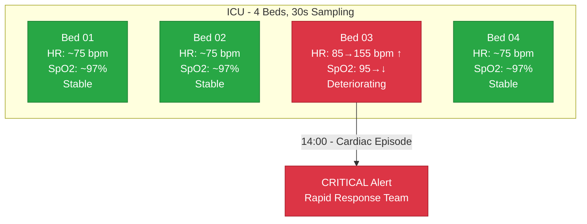
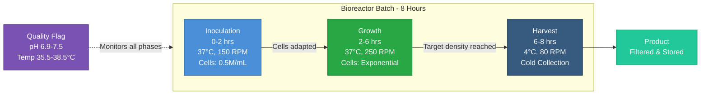

# Healthcare & Life Sciences (29–30)

Clinical monitoring and pharmaceutical manufacturing patterns. These patterns show high-frequency data collection, alarm threshold logic, and batch process recipes with phase transitions.

!!! info "Prerequisites"
    These patterns build on [Foundational Patterns 1–8](foundations.md). Pattern 29 uses high-frequency timesteps; Pattern 30 uses `prev()` and `scheduled_events` extensively — see [Stateful Functions](../stateful_functions.md) and [Advanced Features](../advanced_features.md).

---

## Pattern 29: ICU Patient Vitals {#pattern-29}

**Industry:** Healthcare | **Difficulty:** Advanced

!!! tip "What you'll learn"
    - **High-frequency data** — 30-second timestep with 2880 rows (24 hours) tests pipeline performance with dense time series. Also demonstrates deriving multi-condition clinical alerts from vital sign thresholds.

If you've ever walked into an ICU, the first thing you notice is the sound. Every bedside monitor is beeping, tracing waveforms, and logging numbers every few seconds. Heart rate, blood oxygen, blood pressure, respiratory rate, temperature - all streaming continuously. That data is the lifeline for nurses and physicians who need to catch a patient going downhill before it becomes a code blue.

The challenge isn't collecting the data - modern bedside monitors do that automatically at 15- to 30-second intervals. The challenge is making sense of it. A single ICU bed generates over 2,800 readings in a 24-hour shift. Multiply that by a 20-bed unit and you're drowning in numbers. That's where clinical early warning scores come in - algorithms that combine multiple vital signs into a single "how worried should I be?" number. The most common is the Modified Early Warning Score (MEWS), which assigns points based on how far each vital sign deviates from normal.

This pattern simulates 4 ICU beds over 24 hours at 30-second resolution - 11,520 total rows. Three patients are stable. One - Patient_Bed_03 - is slowly deteriorating with rising heart rate (tachycardia) and falling blood oxygen (desaturation), culminating in a forced cardiac episode at 14:00 when heart rate spikes to 155 bpm for 15 minutes. The `critical_alert` column applies MEWS-style thresholds to flag when a patient crosses from NORMAL to WARNING to CRITICAL - exactly the kind of alert that triggers a rapid response team in a real hospital.

- **Patient_Bed_01** - stable patient. Heart rate hovers around 75 bpm with gentle random walk variation. SpO2 stays comfortably above 95%. This is your baseline - what a recovering patient looks like on the monitor.
- **Patient_Bed_02** - also stable, running the same parameter envelope as Bed 01. Two stable patients let you see natural physiological variation without confusing it with clinical deterioration.
- **Patient_Bed_03** - the deteriorating patient. Heart rate starts elevated at 85 bpm with a positive trend (`trend: 0.02`), and SpO2 starts lower at 95% with a negative trend (`trend: -0.005`). Over hours, this patient drifts toward alarm thresholds. At 14:00, a scheduled event forces heart rate to 155 bpm for 15 minutes - simulating the cardiac episode the trends were building toward.
- **Patient_Bed_04** - stable, same as Beds 01 and 02. Three stable patients against one deteriorating patient is realistic - in a real ICU, most patients are stable at any given time, and the clinical challenge is spotting the one who isn't.



!!! info "Units and terms in this pattern"
    **HR (Heart Rate)** - beats per minute (bpm). Normal resting range is 60-100 bpm. Above 100 is tachycardia (the heart is working too hard). Below 50 is bradycardia (the heart may not be pumping enough blood). ICU patients often run slightly high due to stress, pain, or medications.

    **SpO2 (Peripheral Oxygen Saturation)** - percentage of hemoglobin molecules carrying oxygen, measured by a pulse oximeter clipped to the fingertip. Normal is 95-100%. Below 92% is concerning. Below 88% is dangerous - the patient's tissues aren't getting enough oxygen.

    **Blood Pressure (Systolic/Diastolic)** - measured in mmHg. Systolic is the peak pressure when the heart contracts; diastolic is the resting pressure between beats. Normal is around 120/80. The difference between them (pulse pressure) matters clinically - a narrowing pulse pressure can indicate shock.

    **RR (Respiratory Rate)** - breaths per minute. Normal is 12-20. Above 20 suggests the body is compensating for something (pain, hypoxia, acidosis). Below 10 could mean respiratory depression.

    **Temperature** - measured in Celsius. Normal is 36.5-37.5C. Above 38.5C is fever, which in an ICU patient could signal infection or sepsis.

    **MEWS (Modified Early Warning Score)** - a bedside scoring system that assigns 0-3 points for each vital sign based on how far it deviates from normal. Total score of 5+ typically triggers a rapid response team call.

!!! info "Why these parameter values?"
    - **30-second timestep:** Real ICU monitors sample continuously, but data is typically logged at 15-30 second intervals for charting and analytics. This gives 2,880 rows per bed per day - realistic data density for pipeline stress testing.
    - **HR start 75, mean_reversion 0.1:** A stable patient's heart rate naturally fluctuates but gravitates back to its resting rate. The 0.1 reversion strength means it takes roughly 10 timesteps (5 minutes) to pull halfway back - physiologically reasonable.
    - **SpO2 start 97, volatility 0.3:** SpO2 is inherently less volatile than heart rate - healthy lungs maintain saturation in a tight band. The low volatility with strong mean_reversion (0.2) keeps it realistic.
    - **Patient_Bed_03 trend 0.02 on HR:** Over 2,880 timesteps, this adds roughly +57 bpm to the random walk's central tendency. Combined with a start of 85 bpm, the patient drifts into tachycardia territory over 12-16 hours - a clinically realistic deterioration timeline.
    - **Patient_Bed_03 trend -0.005 on SpO2:** A slow oxygen desaturation that drops roughly 14 percentage points over 24 hours. Starting at 95%, the patient hits the WARNING threshold (92%) around hour 10 and the CRITICAL threshold (88%) around hour 16.
    - **Forced cardiac episode at 14:00 (155 bpm, 15 minutes):** This simulates the kind of acute event the trends were building toward - a sustained tachycardic episode that would trigger CRITICAL alerts and a rapid response call. 155 bpm for 15 minutes is serious but survivable.
    - **Diastolic derived as 65% of systolic + noise:** This maintains a realistic pulse pressure of roughly 35-45 mmHg. In real patients, the systolic-diastolic relationship isn't random - it's governed by cardiac output and vascular resistance.
    - **Outlier rate 0.002 (0.2%):** Sensor artifacts in ICU monitors are real - a patient moves their arm, the SpO2 probe slips off a finger, an electrode gets wet. These rare but real glitches test whether your downstream analytics can handle noisy clinical data.

```yaml
project: icu_monitoring
engine: pandas

connections:
  output:
    type: local
    base_path: ./data

story:
  connection: output
  path: stories/

system:
  connection: output

pipelines:
  - pipeline: icu_vitals
    nodes:
      - name: vitals_data
        read:
          connection: null
          format: simulation
          options:
            simulation:
              scope:
                start_time: "2026-03-10T00:00:00Z"
                timestep: "30s"
                row_count: 2880           # 24 hours
                seed: 42
              entities:
                names: [Patient_Bed_01, Patient_Bed_02, Patient_Bed_03, Patient_Bed_04]
              columns:
                - name: bed_id
                  data_type: string
                  generator: {type: constant, value: "{entity_id}"}
                - name: timestamp
                  data_type: timestamp
                  generator: {type: timestamp}

                # Heart rate — normal ~75 bpm
                - name: heart_rate_bpm
                  data_type: float
                  generator:
                    type: random_walk
                    start: 75
                    min: 40
                    max: 180
                    volatility: 1.5
                    mean_reversion: 0.1
                    precision: 0
                  entity_overrides:
                    Patient_Bed_03:        # Deteriorating — HR trending up
                      type: random_walk
                      start: 85
                      min: 40
                      max: 180
                      volatility: 2.0
                      mean_reversion: 0.05
                      trend: 0.02
                      precision: 0

                # Systolic blood pressure
                - name: blood_pressure_sys
                  data_type: float
                  generator:
                    type: random_walk
                    start: 120
                    min: 70
                    max: 200
                    volatility: 2.0
                    mean_reversion: 0.1
                    precision: 0

                # Diastolic ~65% of systolic
                - name: blood_pressure_dia
                  data_type: float
                  generator:
                    type: derived
                    expression: "round(blood_pressure_sys * 0.65 + random() * 5, 0)"

                # SpO2 — normal ~97%
                - name: spo2_pct
                  data_type: float
                  generator:
                    type: random_walk
                    start: 97
                    min: 80
                    max: 100
                    volatility: 0.3
                    mean_reversion: 0.2
                    precision: 0
                  entity_overrides:
                    Patient_Bed_03:        # Deteriorating — SpO2 drifting down
                      type: random_walk
                      start: 95
                      min: 80
                      max: 100
                      volatility: 0.5
                      mean_reversion: 0.2
                      trend: -0.005
                      precision: 0

                # Respiratory rate — normal ~16 breaths/min
                - name: respiratory_rate
                  data_type: float
                  generator:
                    type: range
                    min: 12
                    max: 24
                    distribution: normal
                    mean: 16
                    std_dev: 2

                # Body temperature
                - name: temperature_c
                  data_type: float
                  generator:
                    type: random_walk
                    start: 37.0
                    min: 35.5
                    max: 40.0
                    volatility: 0.05
                    mean_reversion: 0.15
                    precision: 1

                # Clinical alert based on MEWS-style thresholds
                - name: critical_alert
                  data_type: string
                  generator:
                    type: derived
                    expression: "'CRITICAL' if heart_rate_bpm > 150 or heart_rate_bpm < 45 or spo2_pct < 88 or blood_pressure_sys > 180 or blood_pressure_sys < 80 else 'WARNING' if heart_rate_bpm > 120 or spo2_pct < 92 or blood_pressure_sys > 160 else 'NORMAL'"

              # Cardiac episode — Patient_Bed_03 HR spikes to 155 for 15 minutes
              scheduled_events:
                - type: forced_value
                  entity: Patient_Bed_03
                  column: heart_rate_bpm
                  value: 155
                  start_time: "2026-03-10T14:00:00Z"
                  end_time: "2026-03-10T14:15:00Z"

              chaos:
                outlier_rate: 0.002       # Sensor artifacts
                outlier_factor: 1.5

        write:
          connection: output
          format: parquet
          path: bronze/icu_vitals.parquet
          mode: overwrite
```

!!! example "What the output looks like"
    This config generates **11,520 rows** (2,880 timesteps x 4 patients). Here's a snapshot of Patient_Bed_03's deterioration - notice how heart rate climbs and SpO2 drops over the day, then the cardiac episode hits at 14:00:

    | bed_id          | timestamp            | heart_rate_bpm | blood_pressure_sys | blood_pressure_dia | spo2_pct | respiratory_rate | temperature_c | critical_alert |
    |-----------------|----------------------|----------------|--------------------|--------------------|----------|------------------|---------------|----------------|
    | Patient_Bed_03  | 2026-03-10 00:00:00  | 85             | 122                | 82                 | 95       | 17               | 37.0          | NORMAL         |
    | Patient_Bed_03  | 2026-03-10 06:00:00  | 102            | 118                | 80                 | 93       | 15               | 37.2          | NORMAL         |
    | Patient_Bed_03  | 2026-03-10 10:00:00  | 118            | 125                | 84                 | 91       | 19               | 37.4          | WARNING        |
    | Patient_Bed_03  | 2026-03-10 14:00:00  | 155            | 130                | 87                 | 89       | 21               | 37.6          | CRITICAL       |
    | Patient_Bed_03  | 2026-03-10 14:15:00  | 155            | 128                | 86                 | 88       | 22               | 37.5          | CRITICAL       |
    | Patient_Bed_01  | 2026-03-10 14:00:00  | 74             | 119                | 80                 | 97       | 16               | 37.0          | NORMAL         |

    The key thing to notice: Patient_Bed_03's heart rate climbs from 85 to 118 bpm over 10 hours, hitting WARNING. Then the scheduled cardiac episode forces it to 155 bpm at 14:00 - CRITICAL. Meanwhile, Patient_Bed_01 is sitting at 74 bpm, completely fine. This is exactly the needle-in-a-haystack problem that clinical early warning systems are designed to solve.

**What makes this realistic:**

- **30-second sampling matches real ICU monitor rates.** Most bedside monitors (Philips IntelliVue, GE CARESCAPE) sample continuously but log data at 15-30 second intervals for clinical information systems. This gives you the same data density a real hospital data warehouse would see.
- **Mean reversion keeps vitals in physiological range.** A healthy heart rate doesn't just wander randomly - the body's autonomic nervous system actively pulls it back toward a setpoint. The `mean_reversion: 0.1` parameter models exactly this homeostatic regulation. SpO2 is even more tightly controlled (`mean_reversion: 0.2`) because the body prioritizes oxygenation.
- **Patient_Bed_03's dual deterioration is clinically realistic.** In real patients, tachycardia and desaturation often occur together - the heart speeds up to compensate for dropping oxygen. The rising HR trend (`0.02`) and falling SpO2 trend (`-0.005`) model this compensatory relationship. An experienced nurse would see these trends hours before the crisis and start interventions.
- **The MEWS thresholds in `critical_alert` match clinical practice.** HR > 120 as WARNING and > 150 as CRITICAL, SpO2 < 92% as WARNING and < 88% as CRITICAL - these are the actual cutoffs used in rapid response team activation criteria at most hospitals.
- **Diastolic derived from systolic maintains realistic pulse pressure.** In real cardiovascular physiology, diastolic pressure isn't independent of systolic - they're both driven by the same cardiac cycle. The `blood_pressure_sys * 0.65 + random() * 5` expression keeps the pulse pressure (systolic minus diastolic) in the realistic 35-45 mmHg range.
- **11,520 total rows stress-test your pipeline.** Four patients at 2,880 rows each is a small ICU, but the data volume is enough to reveal performance issues in aggregation queries, rolling window calculations, and real-time dashboards.

!!! example "Try this"
    - **Build a numeric MEWS score:** Add an `ews_score` derived column: `"int(heart_rate_bpm > 120) + int(spo2_pct < 92) + int(blood_pressure_sys > 160 or blood_pressure_sys < 90) + int(respiratory_rate > 20 or respiratory_rate < 10) + int(temperature_c > 38.5)"`. Each vital sign contributes 0 or 1 point. Score of 3+ triggers a rapid response call.
    - **Accelerate the deterioration:** Change Patient_Bed_03's SpO2 trend to `-0.01` for a faster desaturation - the patient will hit CRITICAL in 8 hours instead of 16. Watch how much earlier the WARNING alerts fire.
    - **Add a nurse call column:** Add a `nurse_call` boolean derived from `"critical_alert == 'CRITICAL'"`. In a real hospital, this would trigger an audible alarm at the nursing station.
    - **Add sepsis screening:** Add a `sepsis_screen` derived column: `"'POSITIVE' if heart_rate_bpm > 90 and temperature_c > 38.0 and respiratory_rate > 20 else 'NEGATIVE'"`. This implements a simplified SIRS (Systemic Inflammatory Response Syndrome) criteria check - two of three criteria met suggests possible sepsis.

!!! tip "What would you do with this data?"
    Once you have this dataset, here are real analyses you could build:

    - **Clinical deterioration dashboard** - Plot Patient_Bed_03's heart rate and SpO2 as dual-axis time series. Overlay the WARNING and CRITICAL threshold lines. This is the exact view a charge nurse would have on their central monitoring station.
    - **Alert fatigue analysis** - Count how many NORMAL/WARNING/CRITICAL alerts fire per hour across all beds. In real hospitals, alarm fatigue is a patient safety crisis - nurses hear hundreds of alarms per shift and start ignoring them. Can you tune the thresholds to reduce false alarms without missing the real event?
    - **Retrospective event analysis** - Filter to Patient_Bed_03 in the 6 hours before the cardiac episode. Were there subtle signs in the trend that a machine learning model could have caught earlier than the threshold-based alerts? This is exactly the research question driving clinical AI.
    - **Multi-patient correlation** - During the cardiac episode at 14:00, do the stable patients' vitals change at all? In a real ICU, staff responding to one patient's crisis sometimes means other patients get less attention - a subtle but important staffing analysis.

> 📖 **Learn more:** [Generators Reference](../generators.md) — Random walk with mean_reversion_to and trend parameters

---

## Pattern 30: Pharmaceutical Batch Records {#pattern-30}

**Industry:** Pharmaceutical | **Difficulty:** Advanced

!!! tip "What you'll learn"
    - **`sequential` generator** — for batch numbering. **`prev()` for growth curve modeling** — viable cell count doubles over time. **Scheduled events for recipe phase transitions** — inoculation → growth → harvest.

I'm a chemical engineer who built this, and I need to tell you - pharma batch records are where process engineering meets regulatory paranoia. Every single data point in a biopharmaceutical batch is a legal document. Under 21 CFR Part 11 (the FDA's electronic records regulation), you need to prove that your data is attributable, legible, contemporaneous, original, and accurate - the ALCOA principle. If you can't trace exactly what happened at every minute of a batch, that batch gets destroyed. We're talking about biologic drugs that cost $50,000-$100,000 per batch to manufacture.

This pattern simulates a mammalian cell culture process - the kind used to make monoclonal antibodies, which are among the most valuable drugs in the world. The workhorse cell line is CHO (Chinese Hamster Ovary) cells, grown in stainless steel bioreactors that maintain extremely tight control over temperature, pH, and dissolved oxygen. The cells are living factories - they literally secrete the drug protein into the culture medium as they grow.

A batch runs through three distinct phases, each with different operating parameters. This is the ISA-88 batch control model - the same standard used by every major pharma company's automation system:

- **Inoculation (hours 0-2)** - you seed the bioreactor with a small volume of cells from a seed train flask. The reactor is at 37C (body temperature - these are mammalian cells, after all), pH is tightly controlled at 7.2, and agitation is gentle at 150 RPM. You don't want to shear the cells while they're adapting to their new environment. Cell density is low - around 0.5 million cells per mL.
- **Growth (hours 2-6)** - the exponential phase. The cells have adapted and are now dividing rapidly. This is where `prev()` shines - each timestep's cell count is the previous count multiplied by a growth factor of roughly 1.01 (0.8-1.2% growth per 5-minute interval). Agitation increases to 250 RPM because the denser culture needs more oxygen transfer. Dissolved oxygen is the limiting factor here - if DO drops below 30%, cells start dying. The specific growth rate of CHO cells in this phase is typically 0.02-0.04 per hour.
- **Harvest (hours 6-8)** - the reactor temperature drops to 4C (cold harvest). This isn't just turning the heater off - it's actively chilling the entire vessel to preserve both the cells and the product protein. Agitation drops to 80 RPM - just enough to keep the culture suspended. The product is harvested by filtration or centrifugation shortly after.

This pattern overlaps with Pattern 14 (batch reactor), but where Pattern 14 models chemical reaction kinetics (temperature, pressure, conversion), this one models biological growth kinetics (cell viability, nutrient consumption, product accumulation). Different science, different regulatory framework, different failure modes.



!!! info "Units and terms in this pattern"
    **CHO cells (Chinese Hamster Ovary)** - the most widely used mammalian cell line for biopharmaceutical production. They're the workhorse of the industry because they grow well in suspension culture and can be engineered to produce human-compatible proteins.

    **Viable cells (million/mL)** - the count of living cells per milliliter of culture. "Viable" means they're alive and metabolically active, as opposed to dead cells that are still floating around. Measured by trypan blue exclusion or automated cell counters. A typical CHO culture starts at 0.5M/mL and can reach 20-50M/mL at harvest.

    **Dissolved oxygen (DO %)** - the percentage of oxygen saturation in the culture medium. Cells consume oxygen for metabolism, so DO drops as cell density increases. Below 30% is risky - cells switch to anaerobic metabolism, which produces toxic byproducts (lactate, ammonia) that kill the culture.

    **pH** - acidity/alkalinity on a 0-14 scale. CHO cells need pH 7.0-7.4 to thrive. Real bioreactors use CO2 sparging to lower pH and base addition (NaOH or NaHCO3) to raise it - a PID control loop running continuously.

    **RPM (Revolutions Per Minute)** - agitation speed of the impeller inside the bioreactor. Higher RPM means better oxygen transfer but also higher shear stress on cells. Finding the balance is critical - too slow and cells suffocate, too fast and cells get ripped apart.

    **GMP (Good Manufacturing Practice)** - the regulatory framework governing pharmaceutical manufacturing. Every process parameter must be within validated ranges, every deviation must be investigated, and every batch record must be reviewed before the product can be released. 21 CFR Part 11 extends GMP to electronic records.

    **ISA-88** - the international standard for batch process control. It defines how recipes are structured into phases (inoculation, growth, harvest), operations, and unit procedures. Every pharma automation system follows this model.

!!! info "Why these parameter values?"
    - **5-minute timestep, 96 rows per entity:** Pharma batch records are typically logged at 1-5 minute intervals. The 5-minute resolution gives enough detail to see phase transitions and growth curves without generating overwhelming data volumes. 96 rows covers an 8-hour batch - short for a real CHO culture (which runs 10-14 days) but perfect for demonstrating the concept.
    - **Temperature 37.0C, volatility 0.1, mean_reversion 0.2:** CHO cells are mammalian - they want body temperature. Real bioreactors hold temperature within +/- 0.5C using jacketed cooling/heating systems. The tight volatility and strong mean reversion model this PID-controlled behavior. During harvest, scheduled events force the temperature to 4C - real cold harvest to preserve product stability.
    - **pH 7.2, volatility 0.02, mean_reversion 0.15:** pH control is the most critical loop in a bioreactor. The extremely low volatility (0.02) reflects that real bioreactors adjust pH every few seconds using CO2 and base addition. The 6.9-7.5 quality limits in the `quality_flag` are actual GMP specification ranges.
    - **Cell growth expression `prev() * (1.0 + 0.008 + random() * 0.004)`:** This models a specific growth rate of roughly 0.01 per 5-minute interval, which translates to about 0.12 per hour - slightly high for CHO cells (typical is 0.02-0.04/hr) but compressed to fit the 8-hour simulation window. The `random() * 0.004` adds biological noise - real cell growth isn't perfectly smooth.
    - **Yield target of 50M cells/mL:** This is a reasonable target for a high-density CHO culture. Modern fed-batch processes can achieve 20-50M viable cells/mL. The `yield_pct` column gives operators a simple percentage to track against their batch target.
    - **Agitation 150 -> 250 -> 80 RPM across phases:** Inoculation is gentle (cells are fragile during adaptation). Growth phase increases agitation for oxygen mass transfer (more cells = more oxygen demand). Harvest drops agitation to minimize cell lysis during collection - you want intact cells, not broken ones releasing proteases that degrade your product.
    - **Quality flag limits (35.5-38.5C, pH 6.9-7.5):** These are typical GMP process parameter ranges. Any `out_of_spec` reading triggers an investigation under the deviation management system. Three out-of-spec readings in a row and the batch is likely rejected.

```yaml
project: pharma_batch
engine: pandas

connections:
  output:
    type: local
    base_path: ./data

story:
  connection: output
  path: stories/

system:
  connection: output

pipelines:
  - pipeline: batch_records
    nodes:
      - name: batch_data
        read:
          connection: null
          format: simulation
          options:
            simulation:
              scope:
                start_time: "2026-03-10T00:00:00Z"
                timestep: "5m"
                row_count: 96             # 8 hours
                seed: 42
              entities:
                names: [Batch_2026_001, Batch_2026_002]
              columns:
                - name: batch_id
                  data_type: string
                  generator: {type: constant, value: "{entity_id}"}
                - name: timestamp
                  data_type: timestamp
                  generator: {type: timestamp}

                # Sequential batch record number
                - name: batch_number
                  data_type: int
                  generator:
                    type: sequential
                    start: 1
                    step: 1

                # Phase — overridden by scheduled events
                - name: phase
                  data_type: string
                  generator: {type: constant, value: "inoculation"}

                # Reactor temperature — tightly controlled
                - name: reactor_temp_c
                  data_type: float
                  generator:
                    type: random_walk
                    start: 37.0
                    min: 35.0
                    max: 39.0
                    volatility: 0.1
                    mean_reversion: 0.2
                    precision: 1

                # pH — tightly controlled around 7.2
                - name: ph
                  data_type: float
                  generator:
                    type: random_walk
                    start: 7.2
                    min: 6.8
                    max: 7.6
                    volatility: 0.02
                    mean_reversion: 0.15
                    precision: 2

                # Dissolved oxygen
                - name: dissolved_o2_pct
                  data_type: float
                  generator:
                    type: range
                    min: 30
                    max: 80
                    distribution: normal
                    mean: 55
                    std_dev: 8

                # Agitation speed — overridden by scheduled events
                - name: agitation_rpm
                  data_type: int
                  generator: {type: constant, value: 150}

                # Viable cell count — exponential growth via prev()
                - name: viable_cells_million
                  data_type: float
                  generator:
                    type: derived
                    expression: "round(max(0.1, prev('viable_cells_million', 0.5) * (1.0 + 0.008 + random() * 0.004)), 2)"

                # Yield against target cell density (50M cells/mL = 100%)
                - name: yield_pct
                  data_type: float
                  generator:
                    type: derived
                    expression: "round(min(100, viable_cells_million / 50.0 * 100), 1)"

                # GMP quality flag — process parameter limits
                - name: quality_flag
                  data_type: string
                  generator:
                    type: derived
                    expression: "'out_of_spec' if ph < 6.9 or ph > 7.5 or reactor_temp_c < 35.5 or reactor_temp_c > 38.5 else 'in_spec'"

              # Recipe phase transitions via scheduled events
              scheduled_events:
                # Phase 2: Growth (hours 2–6) — increase agitation for O2 transfer
                - type: forced_value
                  entity: null
                  column: phase
                  value: "growth"
                  start_time: "2026-03-10T02:00:00Z"
                  end_time: "2026-03-10T06:00:00Z"
                - type: forced_value
                  entity: null
                  column: agitation_rpm
                  value: 250
                  start_time: "2026-03-10T02:00:00Z"
                  end_time: "2026-03-10T06:00:00Z"

                # Phase 3: Harvest (hours 6–8) — cool down, reduce agitation
                - type: forced_value
                  entity: null
                  column: phase
                  value: "harvest"
                  start_time: "2026-03-10T06:00:00Z"
                  end_time: "2026-03-10T08:00:00Z"
                - type: forced_value
                  entity: null
                  column: agitation_rpm
                  value: 80
                  start_time: "2026-03-10T06:00:00Z"
                  end_time: "2026-03-10T08:00:00Z"
                - type: forced_value
                  entity: null
                  column: reactor_temp_c
                  value: 4.0
                  start_time: "2026-03-10T06:00:00Z"
                  end_time: "2026-03-10T08:00:00Z"

        write:
          connection: output
          format: parquet
          path: bronze/pharma_batch.parquet
          mode: overwrite
```

!!! example "What the output looks like"
    This config generates **192 rows** (96 timesteps x 2 batches). Here's a snapshot of one batch across the three phases - notice how cell count grows exponentially during the growth phase, and temperature drops to 4C at harvest:

    | batch_id       | timestamp            | batch_number | phase        | reactor_temp_c | ph   | dissolved_o2_pct | agitation_rpm | viable_cells_million | yield_pct | quality_flag |
    |----------------|----------------------|--------------|--------------|----------------|------|------------------|---------------|----------------------|-----------|--------------|
    | Batch_2026_001 | 2026-03-10 00:00:00  | 1            | inoculation  | 37.0           | 7.20 | 58.3             | 150           | 0.50                 | 1.0       | in_spec      |
    | Batch_2026_001 | 2026-03-10 01:30:00  | 19           | inoculation  | 36.9           | 7.19 | 52.1             | 150           | 0.58                 | 1.2       | in_spec      |
    | Batch_2026_001 | 2026-03-10 03:00:00  | 37           | growth       | 37.1           | 7.21 | 48.7             | 250           | 0.79                 | 1.6       | in_spec      |
    | Batch_2026_001 | 2026-03-10 05:00:00  | 61           | growth       | 36.8           | 7.18 | 41.2             | 250           | 1.45                 | 2.9       | in_spec      |
    | Batch_2026_001 | 2026-03-10 06:30:00  | 79           | harvest      | 4.0            | 7.22 | 62.5             | 80            | 1.89                 | 3.8       | in_spec      |
    | Batch_2026_001 | 2026-03-10 07:55:00  | 96           | harvest      | 4.0            | 7.20 | 65.8             | 80            | 2.12                 | 4.2       | in_spec      |

    The key thing to notice: viable cells grow from 0.5M to over 2M during the 8-hour window. Temperature is rock-solid at 37C during inoculation and growth (PID control), then drops to exactly 4C at harvest (forced value). Agitation jumps from 150 to 250 RPM when growth phase starts, then drops to 80 at harvest. This is exactly what a real batch record looks like in a manufacturing execution system (MES).

**What makes this realistic:**

- **Cell growth via `prev()` follows exponential kinetics.** The expression `prev() * (1.0 + 0.008 + random() * 0.004)` is a discrete-time approximation of the Monod growth equation. Each timestep, the cell population grows by 0.8-1.2% - compounding over 96 timesteps, this produces the exponential curve you see in real CHO culture growth logs. The randomness in the growth factor models biological variability - not every cell divides at exactly the same rate.
- **Recipe phases change via scheduled events - this is ISA-88.** In a real bioreactor, the automation system (DeltaV, Emerson, Siemens) executes a batch recipe with discrete phase transitions. The `scheduled_events` mirror exactly how a recipe manager works: at hour 2, switch to growth phase and crank up agitation. At hour 6, switch to harvest and start cooling. No gradual transitions - these are discrete control actions.
- **pH and temperature with tight volatility model PID control loops.** A real bioreactor's temperature control loop adjusts the jacket coolant every few seconds to hold 37.0C +/- 0.5C. The `volatility: 0.1` and `mean_reversion: 0.2` on temperature produce exactly this behavior - small fluctuations that never stray far from setpoint. pH is even tighter (`volatility: 0.02`) because pH control is the most sensitive loop in the system.
- **Quality flag implements real GMP specification limits.** The 35.5-38.5C temperature range and 6.9-7.5 pH range are actual process parameter specifications you'd see in a batch record. Any `out_of_spec` reading triggers an OOS investigation under the site's deviation management system - a formal process that can take weeks and cost thousands of dollars.
- **Yield calculated against target cell density is a standard biopharma KPI.** Every batch has a target - often expressed as cells/mL at harvest. The `yield_pct` column (viable cells / 50M target * 100) is the number the manufacturing manager looks at first when reviewing a batch record. Below 80% and you're investigating; below 50% and the batch might be rejected.
- **Cold harvest at 4C preserves product quality.** Proteins denature at elevated temperatures. By chilling the reactor to 4C before harvesting, you slow down proteolytic enzymes that would degrade your drug product. This is universal practice in biopharmaceutical manufacturing - every harvest is a cold harvest.

!!! example "Try this"
    - **Add nutrient feeding:** Add a `feed_rate_ml_hr` column that increases during growth phase using `scheduled_events` - force it to 0 during inoculation, 50 during growth, and 0 during harvest. In real fed-batch processes, glucose and amino acid feeds are critical to sustaining exponential growth.
    - **Add metabolic byproducts:** Add a `co2_pct` column derived from viable cells: `"viable_cells_million * 0.1 + random() * 0.5"`. CO2 is a metabolic waste product - more cells means more CO2, which drives pH down. This is why pH control gets harder as the culture grows.
    - **Add cell viability tracking:** Add a `viability_pct` column: `"max(70, 99.5 - viable_cells_million * 0.5 + random() * 2)"`. In real cultures, viability starts near 100% and gradually declines as nutrients deplete and waste products accumulate. Viability below 80% at harvest is a concern.
    - **Trigger an OOS investigation:** Add validation to catch `quality_flag == 'out_of_spec'` rows and route them to a quarantine table. In GMP manufacturing, every OOS event requires a documented investigation before the batch can be released.

!!! tip "What would you do with this data?"
    Once you have this dataset, here are real analyses you could build:

    - **Batch record review dashboard** - Plot temperature, pH, DO, and viable cells on a multi-panel time series chart with phase boundaries marked as vertical lines. Overlay the GMP specification limits as horizontal bands. This is exactly what a quality reviewer sees when they approve a batch for release.
    - **Growth curve fitting** - Fit an exponential model to the viable cell data and extract the specific growth rate. Compare between Batch_2026_001 and Batch_2026_002. Are they growing at the same rate? Batch-to-batch consistency is a key quality metric in pharma manufacturing.
    - **OOS trending** - Track how many `out_of_spec` readings occur per batch over time. A rising OOS rate could indicate equipment degradation (aging pH probe, drifting temperature sensor) or process drift. This is the kind of trending that GMP requires but most sites do poorly.
    - **Process capability analysis** - Calculate Cp and Cpk for temperature and pH against their specification limits. A Cpk > 1.33 means your process is well-controlled. Below 1.0 and you're routinely hitting spec limits - a red flag for regulators during inspections.

> 📖 **Learn more:** [Stateful Functions](../stateful_functions.md) — `prev()` for growth curves | [Advanced Features](../advanced_features.md) — Scheduled events for recipe phases

---

← [Environmental & Agriculture (26–28)](environmental.md) | [Business & IT (31–35)](business_it.md) →
