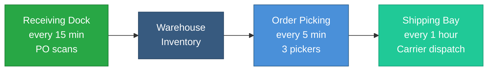
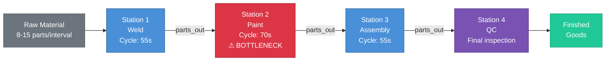

# Manufacturing & Operations (21–25)

Discrete manufacturing, logistics, quality control, and supply chain patterns. These patterns show how to simulate production data with validation gates, multi-pipeline projects, and cross-station flows.

!!! info "Prerequisites"
    These patterns build on [Foundational Patterns 1–8](foundations.md). Pattern 2 (Manufacturing Production Line) is the starting point for this category.

---

## Pattern 21: Packaging Line with SPC {#pattern-21}

**Industry:** Food & Beverage | **Difficulty:** Intermediate

!!! tip "What you'll learn"
    - **Validation on simulated data** — run the same validation tests on simulated data that you'd run on production data. This closes the loop: simulate → validate → fix your validation rules → go live with confidence.

Statistical Process Control is one of those topics that sounds intimidating until you realize it's really just "draw some lines on a chart and panic if the dots go outside." Every food and beverage packaging line has the same fear: are we putting enough product in the box? Too little and you're breaking the law (legal minimum weight). Too much and you're giving away product for free. SPC gives you a way to watch the process in real time and catch problems before the regulators or the accountants do.

This pattern simulates a single packaging line running an 8-hour shift at roughly 60 packages per minute. Fill weight is the critical parameter - it's normally distributed around a 500g target, just like a real filling machine that's been properly set up. But we don't stop at generating data. The real power here is the `validation` section: we define the same quality gates you'd apply to production data, test them on simulated data, and tune the thresholds before a single real package hits the line. If your validation rules quarantine too many good rows (false positives) or miss bad ones (false negatives), you'd rather find out in simulation than in production.

The simulation also generates seal pressure, label positioning, throughput, and a derived reject flag. Chaos outliers at a rate of 0.008 (about 4 per shift) create realistic process upsets - a jammed filler, a pressure transient, or a label misalignment - that should trigger your validation rules.

- **Line_01** - a single packaging line. In practice you'd have multiple lines, but SPC analysis is always done per-line. One line is all you need to demonstrate the validation workflow.
- **fill_weight_g** - the critical-to-quality (CTQ) parameter. Normally distributed around 500g with a standard deviation of 1.2g, simulating a well-centered filling machine.
- **seal_pressure_bar** - the sealing jaw pressure. Uses a random walk because seal pressure drifts as the machine warms up and as the seal jaws wear through the shift.
- **label_position_mm** - deviation from center. Normally distributed around zero. Values beyond +/- 0.8mm trigger a reject.
- **packages_per_min** - throughput rate. A healthy line runs 55-65 ppm with a target of 60.
- **reject_flag** - a derived boolean that fires when fill weight is out of spec OR the label is misaligned. This is the "red light" on the operator's HMI.

!!! info "Units and terms in this pattern"
    **SPC (Statistical Process Control)** - A method for monitoring a process using control charts. You plot measurements over time with a center line (target) and upper/lower control limits (typically at 3 standard deviations). Points outside the limits signal that the process has shifted.

    **Cp / Cpk (Process Capability Indices)** - Numbers that tell you how well your process fits within specification limits. Cp measures potential capability (spread vs. spec width). Cpk accounts for centering. A Cpk of 1.33 or higher means the process is comfortably within spec.

    **UCL / LCL (Upper/Lower Control Limits)** - The 3-sigma boundaries on a control chart. For this line: UCL = 500 + 3(1.2) = 503.6g, LCL = 500 - 3(1.2) = 496.4g. Points beyond these limits are statistically unlikely to be normal variation.

    **OEE (Overall Equipment Effectiveness)** - Availability x Performance x Quality. A world-class OEE for packaging is 85%+. This simulation focuses on the Quality component (reject rate).

    **Legal minimum weight** - Regulations (like the USDA Fair Packaging and Labeling Act) require that the average net weight meets or exceeds the declared weight. Underfilling is a compliance violation.

!!! info "Why these parameter values?"
    - **Fill weight std_dev 1.2g around 500g:** This gives a coefficient of variation of 0.24%, typical for a modern volumetric or gravimetric filler. A poorly maintained filler might show 2-3g standard deviation.
    - **Validation range 496-504g (not the 3-sigma limits):** The validation range is tighter than the statistical control limits. This is intentional - you want to catch product that's drifting toward the limits *before* it gets there.
    - **Seal pressure random walk with mean_reversion 0.15:** Seal jaws warm up during operation and the rubber degrades, but the machine's PLC actively tries to hold setpoint. Mean reversion models that PLC correction loop.
    - **Outlier rate 0.008 (about 4 per shift):** Real packaging lines experience 2-5 process upsets per shift from jams, material changes, or operator adjustments. The 2.5x outlier factor creates fills that are clearly out of spec.
    - **Label tolerance +/- 0.8mm:** Tighter than you might expect, but modern labeling equipment is precise. Misaligned labels cause retail rejection even if the product inside is fine.

```yaml
project: packaging_spc
engine: pandas

connections:
  output:
    type: local
    base_path: ./data

story:
  connection: output
  path: stories/

system:
  connection: output

pipelines:
  - pipeline: packaging
    nodes:
      - name: spc_data
        read:
          connection: null
          format: simulation
          options:
            simulation:
              scope:
                start_time: "2026-03-10T06:00:00Z"
                timestep: "1m"
                row_count: 480            # 8-hour shift
                seed: 42
              entities:
                names: [Line_01]
              columns:
                - name: line_id
                  data_type: string
                  generator: {type: constant, value: "{entity_id}"}
                - name: timestamp
                  data_type: timestamp
                  generator: {type: timestamp}

                # Fill weight clustered around 500g (SPC target)
                - name: fill_weight_g
                  data_type: float
                  generator:
                    type: range
                    min: 495.0
                    max: 505.0
                    distribution: normal
                    mean: 500.0
                    std_dev: 1.2

                - name: seal_pressure_bar
                  data_type: float
                  generator:
                    type: random_walk
                    start: 3.0
                    min: 2.0
                    max: 4.5
                    volatility: 0.1
                    mean_reversion: 0.15
                    precision: 2

                # Label deviation from center
                - name: label_position_mm
                  data_type: float
                  generator:
                    type: range
                    min: -1.0
                    max: 1.0
                    distribution: normal
                    mean: 0.0
                    std_dev: 0.3

                - name: packages_per_min
                  data_type: float
                  generator:
                    type: range
                    min: 55.0
                    max: 65.0
                    distribution: normal
                    mean: 60.0
                    std_dev: 2.0

                # Reject if fill weight out of spec or label misaligned
                - name: reject_flag
                  data_type: boolean
                  generator:
                    type: derived
                    expression: "fill_weight_g < 497 or fill_weight_g > 503 or abs(label_position_mm) > 0.8"

              chaos:
                outlier_rate: 0.008       # ~4 outliers per shift
                outlier_factor: 2.5

        validation:
          mode: warn
          tests:
            - type: range
              column: fill_weight_g
              min: 496.0
              max: 504.0
              on_fail: quarantine
            - type: not_null
              columns: [fill_weight_g, seal_pressure_bar]
              on_fail: quarantine
          quarantine:
            connection: output
            path: quarantine/packaging_rejects
            add_columns:
              rejection_reason: true
              rejected_at: true

        write:
          connection: output
          format: parquet
          path: bronze/packaging_spc.parquet
          mode: overwrite
```

!!! example "What the output looks like"
    This config generates **480 rows** (one per minute for an 8-hour shift). Here's a snapshot showing the line running normally and then a chaos outlier at 06:03:

    | line_id | timestamp            | fill_weight_g | seal_pressure_bar | label_position_mm | packages_per_min | reject_flag |
    |---------|----------------------|---------------|-------------------|-------------------|------------------|-------------|
    | Line_01 | 2026-03-10 06:00:00  | 500.12        | 3.01              | 0.05              | 59.8             | false       |
    | Line_01 | 2026-03-10 06:01:00  | 499.87        | 3.04              | -0.18             | 61.2             | false       |
    | Line_01 | 2026-03-10 06:02:00  | 500.45        | 2.98              | 0.22              | 60.1             | false       |
    | Line_01 | 2026-03-10 06:03:00  | 496.31        | 2.95              | 0.91              | 58.4             | true        |
    | Line_01 | 2026-03-10 06:04:00  | 500.08        | 3.02              | -0.07             | 60.5             | false       |

    Row 4 is the interesting one. Fill weight dropped to 496.31g (below the 497g reject threshold) and the label drifted to 0.91mm (beyond the 0.8mm tolerance). The `reject_flag` fires, and the validation engine quarantines this row. In production, this is the package that gets kicked off the line by the rejection mechanism.

**What makes this realistic:**

- **SPC-style fill weight with tight normal distribution (sigma = 1.2g) around a 500g target** - this matches the capability of a properly calibrated volumetric or gravimetric filler. The standard deviation is the machine's fingerprint - every filler has one, and operators track it obsessively.
- **Validation tests catch the same issues you'd catch in production** - out-of-range fills and null sensor readings are the two most common failure modes. Testing these rules on simulated data before going live prevents embarrassing false-positive storms on day one.
- **Quarantine mode isolates bad rows into a separate table instead of dropping them** - you can investigate rejects later, calculate reject rates, and determine whether the rejects were real quality issues or overly aggressive validation rules.
- **Chaos outlier_rate 0.008 generates occasional fill weight spikes** that trigger the validation rules - about 4 per shift, matching real-world upset frequency on a well-maintained line.

!!! example "Try this"
    - **Tighten the spec:** Change the validation range to `min: 498, max: 502` and see more rows quarantined. This simulates a premium product with tighter tolerances - you'll discover whether your process capability (Cpk) can support the tighter spec.
    - **Add control chart columns:** Add a UCL/LCL derived column: `"500 + 3 * 1.2"` and `"500 - 3 * 1.2"` for the 3-sigma control limits. Now you can plot an X-bar chart directly from the output.
    - **Simulate a bad batch:** Change `outlier_rate` to `0.02` for a "filler nozzle clogging" scenario and watch the quarantine table fill up. Compare the quarantine rate against your target OEE.

!!! tip "What would you do with this data?"
    Once you have this dataset, here are real analyses you could build:

    - **X-bar/R control chart** - Plot fill weight over time with the UCL (503.6g) and LCL (496.4g). Flag Western Electric rules violations (2-of-3 beyond 2-sigma, 8 consecutive points on one side of center). This is the chart that hangs on the wall next to every packaging line.
    - **Process capability study** - Calculate Cp and Cpk from the simulated data. With a 1.2g standard deviation and a +/- 5g spec window, you should get Cpk around 1.39 - just above the 1.33 threshold that most quality systems require.
    - **Reject rate Pareto** - Use the quarantine table to categorize rejects by failure mode (fill weight vs. label position vs. null sensor). In real SPC, 80% of rejects come from one root cause.
    - **Validation rule tuning** - Compare quarantine rates at different thresholds (496-504 vs. 497-503 vs. 498-502). Find the sweet spot where you catch real defects without quarantining good product.

> 📖 **Learn more:** [Validation Tests](../../validation/tests.md) — All 11 validation test types and quarantine configuration

!!! example "Content extraction"
    **Core insight:** Validation on simulated data closes the loop - simulate messy data, validate it, tune your quality gates, THEN go live. You'd rather find false positives in simulation than in production.

    **Real-world problem:** Quality engineers need to test SPC rules and validation thresholds before the packaging line starts running. Getting the thresholds wrong means rejecting good product or passing bad product.

    **Why it matters:** If your range validation catches too few outliers, bad product ships. If it catches too many, you waste good product. Simulation lets you tune the boundary before it matters.

    **Hook:** "Test your quality gates on synthetic data. If they fail here, they'll fail in production. Better to know now."

    **YouTube angle:** "SPC on synthetic data: simulate a packaging line, apply validation rules, and tune thresholds before the first real package."

!!! tip "Combine with"
    - Pattern 2 (add entity overrides for machines with different quality profiles)
    - Pattern 36 (aggressive chaos to stress-test validation rules)
    - Pattern 1 (full medallion architecture with validation at each layer)

---

## Pattern 22: CNC Machine Shop {#pattern-22}

**Industry:** Discrete Manufacturing | **Difficulty:** Intermediate

!!! tip "What you'll learn"
    - **`downtime_events` in chaos config** — unlike `scheduled_events` (which you plan), downtime_events simulate *unplanned* outages where no data is generated at all (missing rows, not null values)

If you've ever walked through a CNC machine shop, the first thing you notice is the sound - a constant hum of spindles, punctuated by the staccato of tool changes. CNC (Computer Numerical Control) machines are the backbone of discrete manufacturing. They run G-code programs that tell the machine exactly where to move, how fast to spin, and how deep to cut. The operator's job isn't to run the machine - it's to keep the machine running. And that means watching tool wear like a hawk.

Here's the thing about cutting tools: they don't fail suddenly. They degrade. Every part you cut removes a tiny bit of the tool's edge. Surface finish gets rougher. Dimensional accuracy drifts. Eventually the tool is worn enough that the parts it produces are out of spec - and if you don't catch it, you've just scrapped a batch of expensive parts. The industry standard is to track tool wear percentage and trigger a tool change at 80% wear - that gives you margin before quality degrades unacceptably.

This pattern simulates a 3-machine shop running an 8-hour shift. Two CNC mills and one lathe, each cutting parts at a 1-minute cadence. The lathe runs at lower spindle speeds than the mills (800-3000 RPM vs. 1000-6000 RPM) because lathes are turning large-diameter stock. Tool wear trends upward with every part, surface finish degrades as a function of wear, and CNC_Mill_02 has an unplanned 45-minute downtime event where the machine stops reporting entirely - no null values, just missing rows, exactly what happens when a machine crashes or a breaker trips.

- **CNC_Lathe_01** - a turning center running at lower spindle speeds (800-3000 RPM). Lathes turn cylindrical parts - shafts, bushings, threaded fittings. The slower speed matches the physics: larger diameter stock requires lower RPM to maintain safe surface speed.
- **CNC_Mill_01** - a healthy milling center at 1000-6000 RPM. Mills cut flat surfaces, pockets, and complex 3D contours. This machine runs the full shift without issues.
- **CNC_Mill_02** - the problem machine. Identical specs to Mill_01, but it goes offline at 09:30 for 45 minutes. When it comes back, it picks up where it left off - but those 45 missing rows are the signal that something went wrong.

!!! info "Units and terms in this pattern"
    **Spindle speed (RPM)** - How fast the cutting tool (mill) or workpiece (lathe) rotates. Higher RPM means faster cutting but more heat. The right speed depends on material - aluminum cuts at 2-3x the RPM of steel.

    **Feed rate (mm/min)** - How fast the tool moves through the material. Too slow and you waste time. Too fast and you break the tool or get a rough finish. Feed rate and spindle speed together determine chip load - the amount of material each tooth removes per revolution.

    **Tool wear (%)** - A percentage tracking cumulative tool degradation. 0% is a fresh tool, 100% is completely worn. Most shops change tools at 70-85% to avoid producing scrap parts.

    **Surface finish Ra (micrometers)** - Roughness average, measured in micrometers. Lower is smoother. Typical values: rough machining 3.2-6.3 um, finish machining 0.8-1.6 um, ground surfaces 0.2-0.4 um. In this simulation, fresh-tool finish starts at about 0.5 um and degrades with wear.

    **Downtime event** - An unplanned machine stoppage. Unlike scheduled maintenance (which appears in your calendar), downtime events are surprises - a tool breaks, a servo faults, a coolant leak trips a safety interlock. The defining characteristic is *missing data*, not null values.

!!! info "Why these parameter values?"
    - **Spindle speed 1000-6000 RPM for mills, 800-3000 RPM for lathe:** These ranges cover typical aluminum and mild steel cutting. Hardened steel or titanium would use lower speeds. The entity override for the lathe reflects real machining physics - larger workpiece diameters need lower RPM.
    - **Tool wear trend 0.05 with mean_reversion 0.01:** The very low mean reversion means wear is mostly one-directional (tools don't heal themselves). The trend value means wear increases by roughly 0.05% per minute - a fresh tool reaches 80% wear in about 26 hours of cutting, which is realistic for carbide inserts on mild steel.
    - **Surface finish expression `0.5 + tool_wear_pct * 0.02`:** This linear relationship is a simplification, but it captures the key behavior: a fresh tool at 5% wear gives Ra = 0.6 um (excellent), while a worn tool at 80% gives Ra = 2.1 um (approaching the reject threshold for many finish specs).
    - **45-minute downtime on CNC_Mill_02:** Long enough to be significant (nearly 10% of the shift) but short enough that production recovers. In a real shop, a 45-minute unplanned stop might be a crashed tool requiring cleanup and re-homing.

```yaml
project: cnc_machine_shop
engine: pandas

connections:
  output:
    type: local
    base_path: ./data

story:
  connection: output
  path: stories/

system:
  connection: output

pipelines:
  - pipeline: cnc
    nodes:
      - name: cnc_data
        read:
          connection: null
          format: simulation
          options:
            simulation:
              scope:
                start_time: "2026-03-10T06:00:00Z"
                timestep: "1m"
                row_count: 480            # 8-hour shift
                seed: 42
              entities:
                names: [CNC_Lathe_01, CNC_Mill_01, CNC_Mill_02]
              columns:
                - name: machine_id
                  data_type: string
                  generator: {type: constant, value: "{entity_id}"}
                - name: timestamp
                  data_type: timestamp
                  generator: {type: timestamp}

                # Spindle speed — lathe runs slower than mills
                - name: spindle_speed_rpm
                  data_type: float
                  generator:
                    type: random_walk
                    start: 3000.0
                    min: 1000.0
                    max: 6000.0
                    volatility: 50.0
                    mean_reversion: 0.1
                    precision: 0
                  entity_overrides:
                    CNC_Lathe_01:
                      type: random_walk
                      start: 1500.0
                      min: 800.0
                      max: 3000.0
                      volatility: 50.0
                      mean_reversion: 0.1
                      precision: 0

                - name: feed_rate_mm_min
                  data_type: float
                  generator:
                    type: random_walk
                    start: 200.0
                    min: 50.0
                    max: 500.0
                    volatility: 5.0
                    mean_reversion: 0.1
                    precision: 0

                # Tool wear trends upward — real degradation
                - name: tool_wear_pct
                  data_type: float
                  generator:
                    type: random_walk
                    start: 5.0
                    min: 0.0
                    max: 100.0
                    volatility: 0.3
                    mean_reversion: 0.01
                    trend: 0.05
                    precision: 1

                - name: part_count
                  data_type: int
                  generator: {type: sequential, start: 1, step: 1}

                # Surface finish degrades with tool wear
                - name: surface_finish_um
                  data_type: float
                  generator:
                    type: derived
                    expression: "0.5 + tool_wear_pct * 0.02 + random() * 0.1"

                - name: tool_change_needed
                  data_type: boolean
                  generator:
                    type: derived
                    expression: "tool_wear_pct > 80"

              chaos:
                outlier_rate: 0.005
                outlier_factor: 2.0
                # Unplanned downtime — CNC_Mill_02 goes offline for 45 min
                downtime_events:
                  - entity: CNC_Mill_02
                    start_time: "2026-03-10T09:30:00Z"
                    end_time: "2026-03-10T10:15:00Z"

        write:
          connection: output
          format: parquet
          path: bronze/cnc_shop.parquet
          mode: overwrite
```

!!! example "What the output looks like"
    This config generates **1,440 rows** (480 per machine x 3 machines), minus the 45 missing rows from CNC_Mill_02's downtime. Here's a snapshot showing the three machines at the same timestamp, plus the gap where Mill_02 goes dark:

    | machine_id    | timestamp            | spindle_speed_rpm | feed_rate_mm_min | tool_wear_pct | part_count | surface_finish_um | tool_change_needed |
    |---------------|----------------------|-------------------|------------------|---------------|------------|-------------------|--------------------|
    | CNC_Lathe_01  | 2026-03-10 06:00:00  | 1512              | 198              | 5.2           | 1          | 0.60              | false              |
    | CNC_Mill_01   | 2026-03-10 06:00:00  | 3015              | 203              | 5.1           | 1          | 0.61              | false              |
    | CNC_Mill_02   | 2026-03-10 06:00:00  | 2987              | 197              | 5.3           | 1          | 0.61              | false              |
    | CNC_Mill_02   | 2026-03-10 09:29:00  | 3102              | 210              | 15.8          | 210        | 0.82              | false              |
    | *(no row)*    | *09:30 - 10:14*      | *--*              | *--*             | *--*          | *--*       | *--*              | *--*               |
    | CNC_Mill_02   | 2026-03-10 10:15:00  | 3045              | 205              | 16.1          | 211        | 0.83              | false              |

    Notice the gap: CNC_Mill_02 simply has no rows between 09:30 and 10:14. The part_count jumps from 210 to 211 because the sequential counter doesn't know about the gap - that's the telltale sign of unplanned downtime in real MES data.

**What makes this realistic:**

- **Tool wear trends upward (trend: 0.05)** - real cutting tools degrade with every part. The nearly-zero mean reversion (0.01) means wear is essentially monotonic - you can't un-wear a tool. This creates a dataset where time-series models can learn the degradation curve and predict when a tool change is needed.
- **Surface finish degrades with wear** - the expression `0.5 + tool_wear_pct * 0.02` creates a direct correlation between wear and quality. This is physically accurate: a duller tool tears the material instead of shearing it cleanly, leaving a rougher surface.
- **Downtime events create missing rows, not null values** - this is the critical distinction. When a CNC machine faults, its controller stops sending data entirely. Your data pipeline will see a gap in timestamps. If you're doing downtime analysis, you need to detect these gaps - and this simulation gives you realistic ones to test against.
- **Sequential part_count provides traceability** - each part gets a unique number per machine, just like a real MES (Manufacturing Execution System). The counter doesn't pause during downtime, so the gap in part numbers is another signal of lost production.
- **Lathe runs at lower spindle speeds than mills (entity override)** - this matches real machining physics. A lathe spinning a 100mm diameter shaft at 1500 RPM has a surface speed of about 470 m/min. A mill with a 20mm cutter at 3000 RPM has a surface speed of about 188 m/min. Different machines, different envelopes.

!!! example "Try this"
    - **Add coolant monitoring:** Add a `coolant_temp_c` column using `random_walk` (start=22, min=20, max=45, volatility=0.3) that rises during cuts. Coolant temperature climbing above 35C is an early warning of coolant degradation or flow restriction.
    - **Accelerate tool wear:** Change `trend` to `0.1` for faster tool wear and watch `tool_change_needed` trigger earlier in the shift. This simulates cutting a harder material like stainless steel or Inconel.
    - **Stack downtime events:** Add a second downtime event for `CNC_Lathe_01` at a different time window. Now you can test whether your downtime detection logic works when multiple machines go down.

!!! tip "What would you do with this data?"
    Once you have this dataset, here are real analyses you could build:

    - **Tool life prediction** - Fit a regression model to tool_wear_pct vs. part_count. Predict when each machine will hit 80% wear and schedule proactive tool changes. This is the core of predictive maintenance for CNC.
    - **Surface finish trending** - Plot surface_finish_um over time per machine. Set an alert at 1.6 um (the typical finish machining spec limit). How many parts can you cut before surface finish exceeds spec?
    - **Downtime detection algorithm** - Write logic that detects timestamp gaps per machine. Calculate downtime duration, frequency, and impact on OEE. The 45-minute gap on CNC_Mill_02 should be the first thing your algorithm finds.
    - **Machine comparison** - Compare spindle speed, feed rate, and tool wear across all three machines. The lathe should have a distinctly different operating profile than the mills.

> 📖 **Learn more:** [Advanced Features](../advanced_features.md) — Chaos config and downtime events

!!! example "Content extraction"
    **Core insight:** downtime_events in chaos simulate real equipment failures - entire rows removed during outage windows. This is different from null injection (missing values) or forced_value (scheduled maintenance).

    **Real-world problem:** Manufacturing engineers need OEE (Overall Equipment Effectiveness) test data that includes real downtime patterns, not just running-state metrics.

    **Why it matters:** OEE availability calculation depends on correctly identifying downtime periods. If your test data never has gaps, your availability calculation is untested.

    **Hook:** "Real machines break down. Downtime events remove entire rows - not just null values. That's how you test OEE calculations."

    **YouTube angle:** "Simulating machine downtime: chaos engineering for manufacturing data, with OEE calculation walkthrough."

!!! tip "Combine with"
    - Pattern 2 (add entity overrides for machines with different reliability)
    - Pattern 5 (add degradation leading up to failures)
    - Pattern 21 (add SPC validation on quality metrics)

---

## Pattern 23: Warehouse Inventory Tracking {#pattern-23}

**Industry:** Logistics | **Difficulty:** Intermediate

!!! tip "What you'll learn"
    - **Multi-pipeline project** — one project config with multiple pipelines (receiving, picking, shipping). Each pipeline generates different data, showing how a real warehouse has multiple data streams.

Walk into any warehouse and you'll see three things happening at the same time: trucks pulling up to receiving docks, pickers racing through the aisles with scanners, and shipments stacking up at the shipping bays. These aren't three views of the same process - they're three separate processes running on different schedules, generating different data, and feeding into different tables. A warehouse management system (WMS) treats them as independent data streams, and your data pipeline should too.

This pattern uses odibi's multi-pipeline feature to model all three streams in a single project config. The receiving pipeline scans inbound purchase orders every 15 minutes. The picking pipeline logs individual picks every 5 minutes (picks happen fast - that's where the volume is). The shipping pipeline records outbound shipments hourly (fewer but heavier records). Three pipelines, three granularities, three output tables - but one project with shared connections. This is how real warehouse data works, and it's a common pattern for any business that has multiple operational data streams.

The SKU distribution follows an ABC-style weighting: SKU_A accounts for 30% of all transactions, while SKU_E is only 10%. This mirrors the Pareto principle that every warehouse manager knows - a small number of SKUs drive the majority of your volume.

- **receiving pipeline** - models inbound dock operations. One dock scanning purchase orders every 15 minutes. Each scan captures the SKU, quantity received, and condition (good, damaged, or partial). 92% of receipts arrive in good condition - that 5% damage rate and 3% partial rate are realistic for general merchandise.
- **picks pipeline** - models order picking with three pickers (picker_A, picker_B, picker_C). Picks happen every 5 minutes with a 98% accuracy rate - the industry benchmark for a well-run warehouse. Pick time averages 45 seconds with a normal distribution, capturing the variability between easy floor-level picks and harder high-shelf retrieval.
- **shipping pipeline** - models outbound shipments from a single bay on an hourly cadence. Each shipment gets a UUID, a carrier (weighted toward FedEx and UPS), a package count, and a weight.



!!! info "Units and terms in this pattern"
    **WMS (Warehouse Management System)** - Software that tracks inventory, directs picking, and manages shipping. Think of it as the warehouse's nervous system. Examples: Manhattan Associates, Blue Yonder, or even a well-built spreadsheet for smaller operations.

    **SKU (Stock Keeping Unit)** - A unique identifier for each distinct product. SKU_A might be "Widget, Blue, 12-pack." The weighted distribution (30/25/20/15/10) models ABC analysis - fast movers get picked more often.

    **Pick accuracy** - The percentage of picks where the correct item and quantity are pulled. Industry best practice is 99%+. The 98% in this simulation represents a good but not world-class operation, generating enough errors to be interesting for quality analysis.

    **FIFO / LIFO** - First In First Out / Last In First Out. Most warehouses use FIFO to prevent product aging. This simulation doesn't model lot-level inventory, but the receiving timestamps give you the data to build FIFO tracking.

    **Cycle counting** - Periodically counting a subset of inventory instead of doing a full physical count. The receiving and picking data streams give you the transaction history needed to identify discrepancies.

!!! info "Why these parameter values?"
    - **Three different timesteps (15m, 5m, 1h):** These match real WMS cadences. Receiving is event-driven (trucks arrive sporadically, scanned in batches). Picking is high-frequency (pickers are constantly scanning). Shipping is batch-oriented (shipments are consolidated and dispatched in waves).
    - **Pick accuracy 98% (boolean, true_probability 0.98):** This is slightly below best-in-class (99.5%+) to generate enough errors for analysis. At 2% error rate with 576 picks per day (3 pickers x 192 scans), you'll get about 11-12 pick errors per day - enough to build a meaningful error analysis.
    - **SKU weights [0.30, 0.25, 0.20, 0.15, 0.10]:** This follows the ABC distribution. In a real warehouse, "A" items (top 20% of SKUs) drive 80% of picks. The 30% weight on SKU_A simulates a fast mover that dominates the pick queue.
    - **Condition weights [0.92, 0.05, 0.03]:** A 5% damage rate is realistic for general merchandise. Fragile goods (glass, electronics) might see 8-10%. Robust goods (canned food, hardware) might see 1-2%.

```yaml
project: warehouse_ops
engine: pandas

connections:
  output:
    type: local
    base_path: ./data

story:
  connection: output
  path: stories/

system:
  connection: output

pipelines:
  # ── Pipeline 1: Receiving Dock ──────────────────────────
  - pipeline: receiving
    nodes:
      - name: receiving_data
        read:
          connection: null
          format: simulation
          options:
            simulation:
              scope:
                start_time: "2026-03-10T06:00:00Z"
                timestep: "15m"
                row_count: 64             # 16 hours (6am–10pm)
                seed: 42
              entities:
                count: 1
                id_prefix: "dock_"
              columns:
                - name: dock_id
                  data_type: string
                  generator: {type: constant, value: "{entity_id}"}
                - name: timestamp
                  data_type: timestamp
                  generator: {type: timestamp}
                - name: po_number
                  data_type: int
                  generator: {type: sequential, start: 50001}
                - name: sku
                  data_type: string
                  generator:
                    type: categorical
                    values: [SKU_A, SKU_B, SKU_C, SKU_D, SKU_E]
                    weights: [0.30, 0.25, 0.20, 0.15, 0.10]
                - name: quantity_received
                  data_type: int
                  generator:
                    type: range
                    min: 10
                    max: 500
                    distribution: normal
                    mean: 100
                    std_dev: 50
                - name: condition
                  data_type: string
                  generator:
                    type: categorical
                    values: [good, damaged, partial]
                    weights: [0.92, 0.05, 0.03]
        write:
          connection: output
          format: parquet
          path: bronze/warehouse_receiving.parquet
          mode: overwrite

  # ── Pipeline 2: Order Picking ──────────────────────────
  - pipeline: picks
    nodes:
      - name: pick_data
        read:
          connection: null
          format: simulation
          options:
            simulation:
              scope:
                start_time: "2026-03-10T06:00:00Z"
                timestep: "5m"
                row_count: 192            # 16 hours
                seed: 43
              entities:
                names: [picker_A, picker_B, picker_C]
              columns:
                - name: picker_id
                  data_type: string
                  generator: {type: constant, value: "{entity_id}"}
                - name: timestamp
                  data_type: timestamp
                  generator: {type: timestamp}
                - name: order_number
                  data_type: int
                  generator: {type: sequential, start: 80001}
                - name: sku
                  data_type: string
                  generator:
                    type: categorical
                    values: [SKU_A, SKU_B, SKU_C, SKU_D, SKU_E]
                    weights: [0.30, 0.25, 0.20, 0.15, 0.10]
                - name: quantity_picked
                  data_type: int
                  generator: {type: range, min: 1, max: 50}
                - name: pick_time_sec
                  data_type: float
                  generator:
                    type: range
                    min: 15.0
                    max: 120.0
                    distribution: normal
                    mean: 45.0
                    std_dev: 15.0
                - name: pick_accuracy
                  data_type: boolean
                  generator: {type: boolean, true_probability: 0.98}
        write:
          connection: output
          format: parquet
          path: bronze/warehouse_picks.parquet
          mode: overwrite

  # ── Pipeline 3: Shipping ──────────────────────────
  - pipeline: shipping
    nodes:
      - name: shipping_data
        read:
          connection: null
          format: simulation
          options:
            simulation:
              scope:
                start_time: "2026-03-10T06:00:00Z"
                timestep: "1h"
                row_count: 16             # 16 hours
                seed: 44
              entities:
                count: 1
                id_prefix: "bay_"
              columns:
                - name: bay_id
                  data_type: string
                  generator: {type: constant, value: "{entity_id}"}
                - name: timestamp
                  data_type: timestamp
                  generator: {type: timestamp}
                - name: shipment_id
                  data_type: string
                  generator: {type: uuid, version: 4}
                - name: carrier
                  data_type: string
                  generator:
                    type: categorical
                    values: [FedEx, UPS, USPS, LTL_Freight]
                    weights: [0.35, 0.30, 0.20, 0.15]
                - name: packages
                  data_type: int
                  generator: {type: range, min: 1, max: 50}
                - name: weight_kg
                  data_type: float
                  generator:
                    type: range
                    min: 2.0
                    max: 200.0
                    distribution: normal
                    mean: 25.0
                    std_dev: 20.0
        write:
          connection: output
          format: parquet
          path: bronze/warehouse_shipping.parquet
          mode: overwrite
```

!!! example "What the output looks like"
    This config generates three separate tables. Here's a snapshot from each:

    **Receiving (64 rows):**

    | dock_id | timestamp            | po_number | sku   | quantity_received | condition |
    |---------|----------------------|-----------|-------|-------------------|-----------|
    | dock_0  | 2026-03-10 06:00:00  | 50001     | SKU_A | 112               | good      |
    | dock_0  | 2026-03-10 06:15:00  | 50002     | SKU_B | 85                | good      |
    | dock_0  | 2026-03-10 06:30:00  | 50003     | SKU_A | 143               | damaged   |

    **Picks (576 rows - 192 per picker):**

    | picker_id | timestamp            | order_number | sku   | quantity_picked | pick_time_sec | pick_accuracy |
    |-----------|----------------------|--------------|-------|-----------------|---------------|---------------|
    | picker_A  | 2026-03-10 06:00:00  | 80001        | SKU_C | 12              | 38.2          | true          |
    | picker_B  | 2026-03-10 06:00:00  | 80001        | SKU_A | 5               | 52.7          | true          |
    | picker_C  | 2026-03-10 06:00:00  | 80001        | SKU_A | 22              | 41.1          | false         |

    **Shipping (16 rows):**

    | bay_id | timestamp            | shipment_id                          | carrier | packages | weight_kg |
    |--------|----------------------|--------------------------------------|---------|----------|-----------|
    | bay_0  | 2026-03-10 06:00:00  | a1b2c3d4-e5f6-4789-abcd-ef0123456789 | FedEx   | 23       | 31.4      |

    Three tables, three cadences, three schemas. Your downstream analytics can join them on timestamp ranges and SKU to build a complete picture of warehouse throughput.

**What makes this realistic:**

- **Three separate data streams at different granularities (15m, 5m, 1h)** - real warehouses have multiple systems running at different cadences. The receiving dock doesn't care about your picking schedule, and shipping dispatches in waves independent of both.
- **Pick accuracy uses boolean generator with 98% true probability** - this matches industry pick accuracy benchmarks for a well-run operation. The 2% error rate generates enough mispicks to make error analysis meaningful without swamping the data.
- **SKU distribution is weighted (Pareto-style)** - the top SKU accounts for 30% of volume, following the 80/20 rule that dominates warehouse operations. This means your ABC analysis on the simulated data will show the same patterns you'd see in real WMS exports.
- **Each pipeline writes to a separate output** - just like real WMS data flows to separate tables. This forces your downstream pipeline to handle schema differences and time alignment.

!!! example "Try this"
    - **Scale the team:** Add more pickers (`picker_D`, `picker_E`) and compare pick times across workers. In a real warehouse, you'd use this to identify training needs or ergonomic issues with specific zones.
    - **Add a returns stream:** Add a `returns` pipeline with a 30m timestep for processing customer returns. Returns are the bane of warehouse operations - they're unpredictable, require inspection, and mess up your inventory counts.
    - **Add receiving validation:** Add validation to the receiving pipeline: `type: range, column: quantity_received, min: 1`. A zero-quantity receipt is a data entry error that should be caught before it corrupts your inventory balance.

!!! tip "What would you do with this data?"
    Once you have this dataset, here are real analyses you could build:

    - **Picker performance dashboard** - Compare pick_time_sec and pick_accuracy across pickers. Identify the fastest picker and the most accurate one (they're often different people). Calculate picks per hour per picker.
    - **SKU velocity analysis** - Count picks per SKU to validate the ABC distribution. Are your fast movers (SKU_A) slotted in the most accessible locations? This analysis drives warehouse slotting optimization.
    - **Inbound-to-outbound flow time** - Join receiving and shipping on time windows to estimate how long inventory sits in the warehouse. Shorter dwell time means better cash flow.
    - **Damage rate trending** - Track the condition column in receiving over time. A rising damage rate might indicate a problem with a specific supplier or carrier.

> 📖 **Learn more:** [Core Concepts](../core_concepts.md) — Scope, entities, and how multiple pipelines share a project

!!! example "Content extraction"
    **Core insight:** Multi-pipeline projects model real-world systems where different data sources feed into a unified view. Receipts and issues are separate processes that both affect the same inventory balance.

    **Real-world problem:** Logistics teams need inventory test data that shows the full picture - receipts, issues, stock levels, reorder triggers - not just a snapshot.

    **Why it matters:** Inventory analytics that doesn't integrate receipts and issues can't predict stockouts or overstock. The material balance (in - out = change) is the foundation.

    **Hook:** "Warehouse inventory is just a material balance. Receipts come in, issues go out, and prev() tracks what's left."

    **YouTube angle:** "Inventory tracking from first principles: multi-pipeline simulation of receipts, issues, and running stock balance."

!!! tip "Combine with"
    - Pattern 15 (tank farm inventory uses the same integration pattern)
    - Pattern 8 (cross-entity refs for multi-warehouse transfers)
    - Pattern 7 (incremental mode for daily inventory snapshots)

---

## Pattern 24: Food Safety / Cold Chain Monitoring {#pattern-24}

**Industry:** Food & Beverage | **Difficulty:** Intermediate

!!! tip "What you'll learn"
    - **`email` generator** for alert recipients — generates realistic email addresses tied to entity names
    - **Deriving alarm escalation** from temperature thresholds — a single column drives `normal`, `warning`, and `critical` alert levels

If you've ever worked in food distribution, you know the cold chain is the one thing that keeps you up at night. From the moment a refrigerated truck picks up product at the processing plant to the moment it lands in a retail cooler, the temperature must stay below 5 degrees Celsius. One excursion - one 30-minute window where the thermometer creeps above that line - and you're looking at a potential HACCP violation, a product recall, or worse. The FDA Food Safety Modernization Act (FSMA) made this explicit: if you transport food, you must monitor and document the temperature throughout the journey.

This pattern simulates 24 hours of cold chain monitoring across four entities: two refrigerated trucks and two warehouse zones. The trucks and warehouse zones have fundamentally different thermal behavior. A warehouse zone has massive insulation, stable HVAC, and rarely sees temperature swings. A truck is a tin box on wheels - it gets hit by sun, opens its doors at every stop, and has a compressor that cycles on and off. That's why Truck_01 has higher volatility (0.6 vs. 0.3) and a wider temperature range (up to 18C vs. 15C). It's more likely to breach the 5C threshold, and when it does, the excursion lasts longer because the compressor takes time to recover.

The simulation also models a scheduled event: Truck_02 stops at a loading dock from 14:00 to 14:30, forcing the doors open. This is a realistic scenario - every delivery requires opening the doors, and every door-open event causes a temperature spike. The question for your data pipeline is: can you detect this excursion, route the alert to the right person, and escalate appropriately?

- **Truck_01** - a refrigerated truck with poor insulation. Higher volatility (0.6) and wider temperature range (up to 18C). This truck will generate more temperature excursions than the warehouse zones. Think of it as an aging reefer unit that needs replacement.
- **Truck_02** - a better-maintained truck with the same base parameters as the warehouse zones. It has a scheduled loading dock stop at 14:00 that forces the doors open for 30 minutes - a predictable excursion that your alert system should handle gracefully (warning, not panic).
- **Warehouse_Zone_A / Zone_B** - two cold storage zones with stable thermal profiles. Volatility of 0.3 and a max of 15C. These should rarely breach 5C unless a compressor fails or a dock door is left open.

!!! info "Units and terms in this pattern"
    **HACCP (Hazard Analysis Critical Control Points)** - A systematic food safety framework required by the FDA. Cold chain monitoring is a critical control point - temperature is the hazard, 5C is the critical limit, and continuous logging is the monitoring procedure.

    **Temperature excursion** - Any period where the product temperature exceeds the critical limit (5C for most chilled foods). Even a brief excursion can accelerate bacterial growth. Regulators look at both the peak temperature and the duration of the excursion.

    **FSMA (FDA Food Safety Modernization Act)** - US federal law that shifted food safety from reactive (respond to outbreaks) to preventive (monitor and prevent). FSMA requires temperature monitoring during transport with documented corrective actions for excursions.

    **Time-temperature indicator (TTI)** - A device that changes color irreversibly when exposed to temperatures above a threshold for too long. The `temp_excursion` derived column in this simulation is the digital equivalent.

    **Alert escalation** - A tiered response system. "Normal" means everything is fine. "Warning" (>5C) means someone should check the unit. "Critical" (>8C) means product safety is compromised and immediate action is required. The `alert_level` column models this escalation.

!!! info "Why these parameter values?"
    - **Target temperature 2C with excursion threshold at 5C:** This gives a 3-degree buffer. Chilled foods (dairy, fresh meat, prepared meals) must stay between 0C and 5C per FDA guidelines. The 2C target is conservative - it gives the system room to drift without breaching the limit.
    - **Truck_01 volatility 0.6 vs. warehouse 0.3:** Trucks experience more thermal disturbance than warehouses. Solar load, door openings, highway driving vs. city stops, ambient temperature changes - all of these hit trucks harder. The 2x volatility ratio is a reasonable approximation.
    - **Door open probability 5%:** Over a 24-hour period with 288 readings, that's about 14 door-open events. Real cold storage doors open for receiving, picking, and loading - 5% is typical for a moderately busy facility.
    - **Loading dock stop (14:00-14:30):** A 30-minute forced door-open event at a loading dock. This is long enough to cause a meaningful temperature spike (doors open = warm air rushes in) but short enough that the compressor should recover within an hour. Your alert system should detect the spike and correlate it with the door-open event.
    - **Outlier rate 0.005:** Sensor glitches are rare in modern cold chain monitoring (IoT sensors are reliable), but they do happen. A 0.5% rate means about 1-2 spurious readings per day per entity.

```yaml
project: cold_chain
engine: pandas

connections:
  output:
    type: local
    base_path: ./data

story:
  connection: output
  path: stories/

system:
  connection: output

pipelines:
  - pipeline: cold_chain
    nodes:
      - name: cold_chain_data
        read:
          connection: null
          format: simulation
          options:
            simulation:
              scope:
                start_time: "2026-03-10T00:00:00Z"
                timestep: "5m"
                row_count: 288            # 24 hours
                seed: 42
              entities:
                names: [Truck_01, Truck_02, Warehouse_Zone_A, Warehouse_Zone_B]
              columns:
                - name: unit_id
                  data_type: string
                  generator: {type: constant, value: "{entity_id}"}
                - name: timestamp
                  data_type: timestamp
                  generator: {type: timestamp}

                # Cold chain target ~2°C
                - name: temperature_c
                  data_type: float
                  generator:
                    type: random_walk
                    start: 2.0
                    min: -5.0
                    max: 15.0
                    volatility: 0.3
                    mean_reversion: 0.15
                    precision: 1
                  entity_overrides:
                    Truck_01:             # Worse insulation
                      type: random_walk
                      start: 2.0
                      min: -3.0
                      max: 18.0
                      volatility: 0.6
                      mean_reversion: 0.15
                      precision: 1

                - name: humidity_pct
                  data_type: float
                  generator:
                    type: range
                    min: 80.0
                    max: 95.0
                    distribution: normal
                    mean: 88.0
                    std_dev: 3.0

                # Doors open 5% of the time
                - name: door_open
                  data_type: boolean
                  generator: {type: boolean, true_probability: 0.05}

                # Food safety limit: >5°C is an excursion
                - name: temp_excursion
                  data_type: boolean
                  generator:
                    type: derived
                    expression: "temperature_c > 5.0"

                # Alert routing — realistic emails per entity
                - name: alert_recipient
                  data_type: string
                  generator:
                    type: email
                    domain: "coldfresh.example.com"
                    pattern: "{entity}_{index}"

                # Escalation levels from temperature
                - name: alert_level
                  data_type: string
                  generator:
                    type: derived
                    expression: "'critical' if temperature_c > 8.0 else 'warning' if temperature_c > 5.0 else 'normal'"

              # Truck_02 loading dock stop — doors forced open, temp spikes
              scheduled_events:
                - type: forced_value
                  entity: Truck_02
                  column: door_open
                  value: true
                  start_time: "2026-03-10T14:00:00Z"
                  end_time: "2026-03-10T14:30:00Z"

              chaos:
                outlier_rate: 0.005
                outlier_factor: 2.0

        write:
          connection: output
          format: parquet
          path: bronze/cold_chain.parquet
          mode: overwrite
```

!!! example "What the output looks like"
    This config generates **1,152 rows** (288 timesteps x 4 entities). Here's a snapshot comparing a truck and a warehouse zone at the same time, plus the loading dock event:

    | unit_id          | timestamp            | temperature_c | humidity_pct | door_open | temp_excursion | alert_recipient                    | alert_level |
    |------------------|----------------------|---------------|--------------|-----------|----------------|------------------------------------|-------------|
    | Warehouse_Zone_A | 2026-03-10 00:00:00  | 2.1           | 87.3         | false     | false          | warehouse_zone_a_0@coldfresh.example.com | normal      |
    | Warehouse_Zone_B | 2026-03-10 00:00:00  | 1.9           | 89.1         | false     | false          | warehouse_zone_b_0@coldfresh.example.com | normal      |
    | Truck_01         | 2026-03-10 00:00:00  | 2.3           | 86.5         | false     | false          | truck_01_0@coldfresh.example.com   | normal      |
    | Truck_02         | 2026-03-10 14:00:00  | 4.8           | 91.2         | true      | false          | truck_02_0@coldfresh.example.com   | normal      |
    | Truck_02         | 2026-03-10 14:15:00  | 6.3           | 92.8         | true      | true           | truck_02_0@coldfresh.example.com   | warning     |
    | Truck_02         | 2026-03-10 14:30:00  | 5.1           | 90.4         | false     | true           | truck_02_0@coldfresh.example.com   | warning     |

    Notice the loading dock event: Truck_02's doors are forced open at 14:00, temperature climbs through 5C by 14:15 (triggering the excursion flag and a "warning" alert), and starts recovering once the doors close at 14:30. The email addresses are auto-generated per entity - ready for alert routing.

**What makes this realistic:**

- **Cold chain has tight temperature bands (target 2C, excursion at 5C)** - this matches HACCP food safety requirements for chilled products. The 3-degree buffer between target and limit is what gives operators time to react before product safety is compromised.
- **Door open events cause temperature spikes** - the loading dock stop forces `door_open: true` for 30 minutes, and the temperature naturally rises because the random walk's volatility keeps pushing it upward without the compressor being able to compensate for the open door. This is exactly what happens at every delivery stop.
- **Email generator creates realistic alert routing addresses** tied to each entity - `truck_01_0@coldfresh.example.com` is the kind of address a cold chain monitoring platform would use to route alerts to the driver or facility manager responsible for that unit.
- **Truck vs. warehouse have different thermal profiles** - Truck_01 has 2x the volatility of the warehouse zones, wider temperature range, and is more likely to breach. This mirrors the fundamental difference between mobile and stationary refrigeration - warehouses are thermally stable, trucks are not.

!!! example "Try this"
    - **Track excursion duration:** Add a `time_out_of_range` column using `prev()`: `"prev('time_out_of_range', 0) + 5 if temperature_c > 5.0 else 0"` to track accumulated minutes above threshold. HACCP requires documenting not just that an excursion happened, but how long it lasted.
    - **Add product zones:** Add a `product_zone` categorical column (`[frozen, chilled, ambient]` with weights `[0.5, 0.4, 0.1]`). Different product zones have different critical limits - frozen is -18C, not 5C.
    - **Tighten the threshold:** Change the excursion threshold to 4C and see how many more alerts fire. Some premium products (sushi-grade fish, certain biologics) require tighter limits.

!!! tip "What would you do with this data?"
    Once you have this dataset, here are real analyses you could build:

    - **HACCP compliance report** - Count temperature excursions per entity, calculate excursion duration in minutes, and flag any entity that exceeded the critical limit for more than 30 cumulative minutes. This is the report your quality team submits to auditors.
    - **Truck vs. warehouse comparison** - Compare excursion frequency and duration between trucks and warehouse zones. If Truck_01 has 5x more excursions than the warehouse, that's your capital case for replacing the reefer unit.
    - **Door-open correlation analysis** - Cross-reference door_open events with temperature spikes. Calculate the average temperature recovery time after a door closes. This tells you whether the compressor is adequately sized.
    - **Alert volume analysis** - Count alerts by level (normal/warning/critical) per entity per day. High alert volume on a specific unit might indicate a failing compressor, while high alert volume across all units might indicate a system-wide calibration issue.

> 📖 **Learn more:** [Generators Reference](../generators.md) — Email generator and boolean generator parameters

!!! example "Content extraction"
    **Core insight:** The email generator creates realistic contact records for alert routing. Combined with temperature thresholds, this simulates a complete cold chain monitoring system with notification logic.

    **Real-world problem:** Food safety managers need cold chain test data that includes breach events and alert routing. Compliance audits require proof that the monitoring system works.

    **Why it matters:** A cold chain breach that isn't detected costs product, customer trust, and potentially regulatory action. Testing the detection logic on synthetic data prevents real losses.

    **Hook:** "Cold chain monitoring isn't just temperature logging. It's breach detection, alert routing, and compliance documentation. Simulate all three."

    **YouTube angle:** "Cold chain simulation: temperature monitoring, breach detection, and email alerts in a food safety pipeline."

!!! tip "Combine with"
    - Pattern 3 (add sensor dropouts with null_rate for unreliable loggers)
    - Pattern 2 (entity overrides for trucks with different insulation quality)
    - Pattern 36 (add chaos for sensor calibration drift)

---

## Pattern 25: Assembly Line Stations {#pattern-25}

**Industry:** Automotive | **Difficulty:** Advanced

!!! tip "What you'll learn"
    - **Cross-entity for station-to-station flow** — parts flow from Station_1 → Station_2 → Station_3 → QC. Each station's output becomes the next station's input using `Entity.column` references. This models a real assembly line where bottlenecks propagate downstream.

Every assembly line has a bottleneck. Eliyahu Goldratt wrote an entire book about it - *The Goal* - and coined the Theory of Constraints: the throughput of any system is limited by its slowest step. You can optimize every other station to perfection, but if the paint booth takes 70 seconds per unit while welding takes 55 seconds, you will never produce faster than the paint booth allows. Parts pile up waiting for paint, and everything downstream starves. This is the single most important concept in production engineering, and this pattern lets you simulate it.

This is the most advanced pattern in the manufacturing collection. Four stations - weld, paint, assembly, and QC - are connected in series using cross-entity references. Raw material enters Station 1 (Weld) at a rate of 8-15 parts per 5-minute interval. Each station processes what it receives, loses some to scrap, and passes the rest downstream. The key feature is the `parts_in` column: Station 1 generates it randomly, but Stations 2-4 pull their `parts_in` directly from the upstream station's `parts_out`. If the paint station scraps more parts or runs a slower cycle, everything downstream feels it immediately.

The paint station is deliberately configured as the bottleneck: its cycle time averages 70 seconds (vs. 55 for the others) with higher variability (std_dev 8 vs. 5). This means Station 3 (Assembly) is constantly starved for parts, even though Assembly itself is fast enough to handle more. Your data will show this clearly - cumulative output at Assembly will always lag behind Weld, and the gap grows over the shift. That's the Theory of Constraints in action.

- **Station_1_Weld** - the first station. Raw material enters here at 8-15 parts per interval. Welding is fast (mean cycle time 55s) and relatively consistent. Some scrap from weld defects (spatter, porosity), but this station sets the pace for the entire line.
- **Station_2_Paint** - the bottleneck. Mean cycle time of 70 seconds with higher variability (std_dev 8s). Paint booths are inherently slower because paint needs time to cure, and environmental conditions (humidity, temperature) affect quality. This station constrains the entire line's output.
- **Station_3_Assembly** - final mechanical assembly. Fast cycle time, but it can only work on what Paint sends it. Even though Assembly *could* process parts faster, it's starved by the bottleneck upstream. This is visible in the data as matching cumulative output between Paint and Assembly.
- **Station_4_QC** - quality inspection at the end of the line. QC sees everything the line produces and catches final defects. Its `parts_in` equals Assembly's `parts_out`, and its own scrap rate represents the final rejection rate.



!!! info "Units and terms in this pattern"
    **Cycle time** - The time it takes one station to process one unit. In this simulation, cycle times are per-interval averages measured in seconds. A 55-second cycle time at a 5-minute interval means the station can theoretically process about 5 parts per interval.

    **Takt time** - The rate at which you *need* to produce to meet customer demand. Takt = available time / customer demand. If the customer needs 800 units per shift and you have 480 minutes, takt time is 36 seconds. Any station with a cycle time above takt is a bottleneck.

    **WIP (Work In Progress)** - Parts that have entered the line but haven't finished. When the bottleneck slows down, WIP piles up in front of it. High WIP means long lead times and tied-up capital.

    **Scrap rate** - The percentage of parts that enter a station but don't exit as good parts. Calculated as `(parts_in - parts_out) / parts_in`. The `safe_div` function in the expression handles the divide-by-zero case when a station receives no parts.

    **Cumulative output** - A running total of `parts_out` per station, calculated using `prev()`. This lets you plot production curves and compare stations. In a balanced line, all stations' cumulative output curves track closely. When there's a bottleneck, downstream curves flatten.

    **Theory of Constraints (TOC)** - Goldratt's management philosophy: identify the bottleneck, exploit it (run it at maximum capacity), subordinate everything else to it (don't overproduce upstream), and elevate it (invest in capacity at the constraint). This simulation gives you the data to practice all four steps.

!!! info "Why these parameter values?"
    - **Parts_in 8-15 for Station 1:** This represents raw material arriving in batches every 5 minutes. The uniform distribution (no normal curve) simulates batch-fed material from a staging area, not a continuous flow.
    - **Cycle time 55s default, 70s for paint:** The 15-second gap creates a clear bottleneck. Paint is slower because of cure time, environmental controls, and the precision required for automotive finishes. The higher std_dev (8 vs. 5) reflects paint's sensitivity to humidity and booth temperature.
    - **Scrap expression `max(0, parts_in - int(random() * 2))`:** Each station loses 0 or 1 part per interval to scrap. This is a ~5-10% scrap rate at typical throughput, which is realistic for automotive manufacturing. The `max(0, ...)` prevents negative parts.
    - **Cumulative output using `prev('cumulative_output', 0) + parts_out`:** The stateful `prev()` function creates a running counter per entity. This is essential for production tracking - you need to know total output at any point in the shift, not just the instantaneous rate.
    - **Chaos outlier_rate 0.003 with factor 1.5:** Assembly lines are tightly controlled environments, so outliers are rare and moderate. A 1.5x factor on cycle time or parts count is enough to flag an anomaly without creating physically impossible values.

```yaml
project: assembly_line
engine: pandas

connections:
  output:
    type: local
    base_path: ./data

story:
  connection: output
  path: stories/

system:
  connection: output

pipelines:
  - pipeline: assembly
    nodes:
      - name: station_data
        read:
          connection: null
          format: simulation
          options:
            simulation:
              scope:
                start_time: "2026-03-10T06:00:00Z"
                timestep: "5m"
                row_count: 96             # 8-hour shift
                seed: 42
              entities:
                names: [Station_1_Weld, Station_2_Paint, Station_3_Assembly, Station_4_QC]
              columns:
                - name: station_id
                  data_type: string
                  generator: {type: constant, value: "{entity_id}"}
                - name: timestamp
                  data_type: timestamp
                  generator: {type: timestamp}

                # Parts entering the station
                # Station_1 gets raw material; downstream stations pull from upstream
                - name: parts_in
                  data_type: int
                  generator:
                    type: range
                    min: 8
                    max: 15
                  entity_overrides:
                    Station_2_Paint:
                      type: derived
                      expression: "Station_1_Weld.parts_out"
                    Station_3_Assembly:
                      type: derived
                      expression: "Station_2_Paint.parts_out"
                    Station_4_QC:
                      type: derived
                      expression: "Station_3_Assembly.parts_out"

                # Cycle time — paint station is the bottleneck
                - name: cycle_time_sec
                  data_type: float
                  generator:
                    type: range
                    min: 45.0
                    max: 75.0
                    distribution: normal
                    mean: 55.0
                    std_dev: 5.0
                  entity_overrides:
                    Station_2_Paint:       # Bottleneck — slower cycle
                      type: range
                      min: 50.0
                      max: 90.0
                      distribution: normal
                      mean: 70.0
                      std_dev: 8.0

                # Some scrap at each station
                - name: parts_out
                  data_type: int
                  generator:
                    type: derived
                    expression: "max(0, parts_in - int(random() * 2))"

                # Running total of output per station
                - name: cumulative_output
                  data_type: int
                  generator:
                    type: derived
                    expression: "prev('cumulative_output', 0) + parts_out"

                # Scrap rate from actual in/out
                - name: scrap_rate
                  data_type: float
                  generator:
                    type: derived
                    expression: "safe_div(parts_in - parts_out, parts_in, 0)"

              chaos:
                outlier_rate: 0.003
                outlier_factor: 1.5

        write:
          connection: output
          format: parquet
          path: bronze/assembly_line.parquet
          mode: overwrite
```

!!! example "What the output looks like"
    This config generates **384 rows** (96 timesteps x 4 stations). Here's a snapshot at one timestep across all four stations - notice how parts decrease through the line:

    | station_id         | timestamp            | parts_in | cycle_time_sec | parts_out | cumulative_output | scrap_rate |
    |--------------------|----------------------|----------|----------------|-----------|-------------------|------------|
    | Station_1_Weld     | 2026-03-10 06:00:00  | 12       | 53.2           | 11        | 11                | 0.083      |
    | Station_2_Paint    | 2026-03-10 06:00:00  | 11       | 72.4           | 10        | 10                | 0.091      |
    | Station_3_Assembly | 2026-03-10 06:00:00  | 10       | 56.8           | 9         | 9                 | 0.100      |
    | Station_4_QC       | 2026-03-10 06:00:00  | 9        | 54.1           | 8         | 8                 | 0.111      |

    The cascade is visible in one row: 12 parts enter Weld, 11 survive to Paint, 10 to Assembly, 9 to QC, 8 exit as finished goods. That's a 33% total yield loss across four stations. By mid-shift, cumulative output tells a clearer story - Station 1 might show 500 cumulative parts while Station 4 shows only 380, and the gap is entirely explained by the paint station bottleneck and cumulative scrap.

**What makes this realistic:**

- **Parts flow downstream via cross-entity references** - Station 1's `parts_out` becomes Station 2's `parts_in`. This is the physical reality of a production line: you can't paint a part that hasn't been welded. The `Entity.column` syntax creates this dependency declaratively.
- **Bottleneck at the paint station (mean cycle time 70s vs 55s) constrains all downstream stations** - even though Assembly and QC are fast enough to handle more, they can only process what Paint sends them. This is Goldratt's constraint in action - the line's throughput equals the bottleneck's throughput, no matter how fast everything else runs.
- **Scrap rate is calculated from actual parts_in minus parts_out, not generated randomly** - the `safe_div` expression means your scrap rate is a real metric derived from the data, not an artificial number. This is how real MES systems calculate scrap.
- **Cumulative output uses `prev()` for a running total** - you can see exactly how many parts each station has produced over the shift. Plot all four cumulative curves on the same chart and the gap between them shows where parts are being lost.
- **Entity generation order (Station_1 through Station_4) ensures upstream data exists before downstream stations reference it** - odibi processes entities in the order they're listed, so Station 2 can reference Station 1's data because Station 1 was already generated. This ordering requirement mirrors the physical flow of the line.

!!! example "Try this"
    - **Extend the line:** Add a `Station_5_Pack` station that pulls from `Station_4_QC.parts_out`. Packaging is the final step before shipping - now you can track yield from raw material to boxed product. How many parts survive all five stations?
    - **Flag the bottleneck:** Add a `bottleneck_flag` derived column: `"cycle_time_sec > 65"` to flag slow cycles. Filter the output for `bottleneck_flag == true` and you'll see that Station_2_Paint dominates the results. That's your constraint.
    - **Stress the paint station:** Make the paint station even worse by increasing scrap: `"max(0, parts_in - int(random() * 3))"`. This simulates paint quality issues (runs, sags, orange peel) that increase rejection rate. Watch how Assembly and QC output drops proportionally.

!!! tip "What would you do with this data?"
    Once you have this dataset, here are real analyses you could build:

    - **Bottleneck identification** - Compare average cycle time and cumulative output across stations. The station with the highest cycle time and lowest cumulative output is your constraint. In this simulation, it should always be Station_2_Paint.
    - **Line balancing analysis** - Calculate the difference between each station's cycle time and the takt time (target rate). Stations far below takt have excess capacity that's being wasted. This analysis drives decisions about re-allocating labor or splitting operations.
    - **Cumulative output chart** - Plot cumulative_output over time for all four stations on the same axis. In a perfectly balanced line, the curves overlap. The gap between Station 1 and Station 4 represents total yield loss - a number that directly translates to revenue impact.
    - **Scrap rate Pareto** - Calculate average scrap rate by station. Which station is losing the most parts? If it's the paint station (likely), your capital improvement budget should focus there first - TOC says invest at the constraint.
    - **WIP estimation** - At any timestamp, calculate `Station_1.cumulative_output - Station_4.cumulative_output`. That difference is the approximate WIP on the line. Rising WIP means the bottleneck is getting worse.

> 📖 **Learn more:** [Advanced Features](../advanced_features.md) — Cross-entity references and entity generation order

!!! example "Content extraction"
    **Core insight:** Cross-entity station-to-station flow models the sequential dependency of an assembly line. Each station's input is the previous station's output, with realistic throughput loss at each step.

    **Real-world problem:** Manufacturing engineers need line balancing test data that shows bottlenecks, station-to-station variation, and cumulative throughput loss.

    **Why it matters:** An assembly line model where stations are independent can't reveal bottlenecks. The slowest station determines line throughput - cross-entity refs model that constraint.

    **Hook:** "An assembly line is a pipeline. Each station depends on the one before it. Cross-entity references model that naturally."

    **YouTube angle:** "Assembly line simulation: cross-entity station flow, bottleneck identification, and line balancing with odibi."

!!! tip "Combine with"
    - Pattern 9 (wastewater cascade uses the same multi-stage pattern)
    - Pattern 2 (add entity overrides for stations with different capabilities)
    - Pattern 22 (add downtime events for station failures)

---

← [Energy & Utilities Patterns (16-20)](energy_utilities.md) | [Environmental Patterns (26-28)](environmental.md) →
