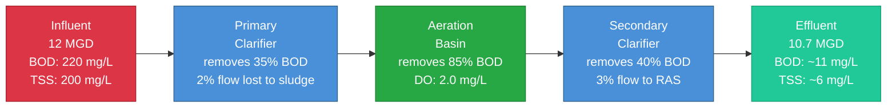
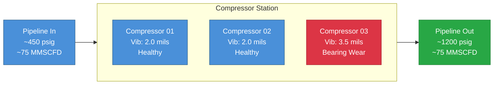
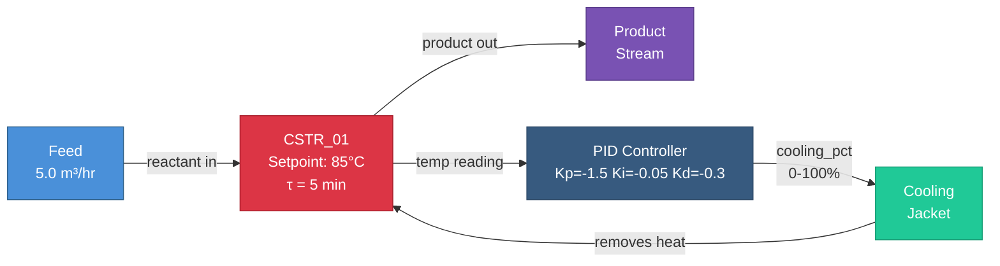
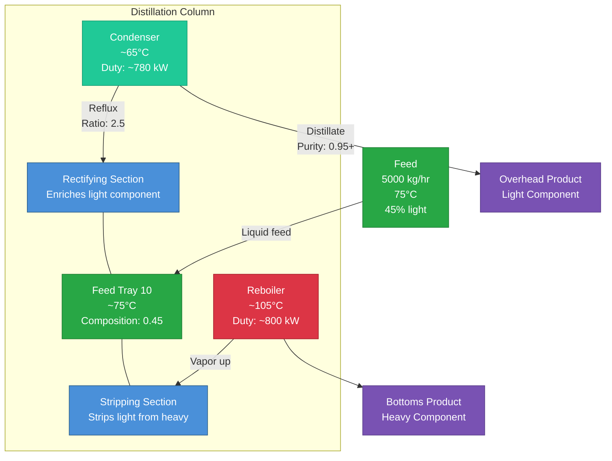
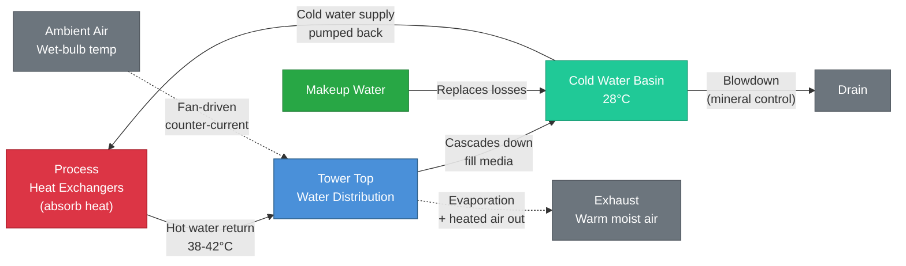
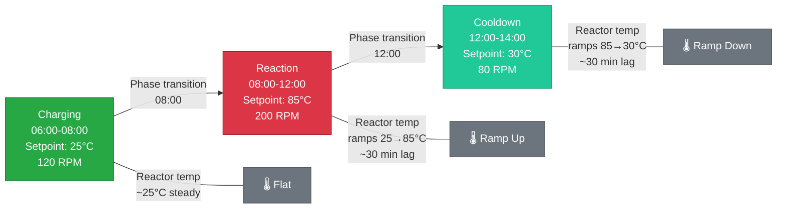
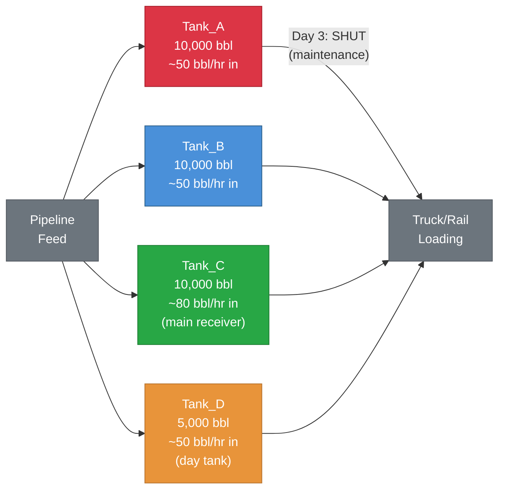

# Process & Chemical Engineering (9–15)

These patterns model real-world process systems — treatment plants, compressor stations, reactors, distillation columns, cooling towers, batch operations, and tank farms. They use odibi's most powerful simulation features: `pid()` control, `ema()` smoothing, `shock` events, cross-entity cascades, and scheduled operations.

!!! info "Prerequisites"
    These patterns build on [Foundational Patterns 1–8](foundations.md). You should also be familiar with [Stateful Functions](../stateful_functions.md) (`prev`, `ema`, `pid`) and [Advanced Features](../advanced_features.md) (cross-entity references, scheduled events).

---

## Pattern 9: Wastewater Treatment Plant {#pattern-9}

**Industry:** Environmental Engineering | **Difficulty:** Intermediate

!!! tip "What you'll learn"
    - **Cross-entity cascade** - each treatment stage references the upstream stage's output using `Entity.column` syntax, so flow and concentrations propagate realistically through the plant
    - **`entity_overrides`** - give each entity (stage) a completely different generator for the same column. Influent uses `random_walk`, downstream stages use `derived` expressions that multiply upstream values by removal fractions

Every city has one, and most people never think about it: the wastewater treatment plant. When you flush a toilet or run a sink, that water travels through sewers to a facility that cleans it well enough to discharge into a river, lake, or ocean. The goal is to remove organic matter and suspended particles before the water goes back into the environment.

A treatment plant is essentially a series of stages, each one removing a fraction of the pollution. Dirty water enters one end, and clean water exits the other. Here's what each stage does:

- **Influent** - raw sewage arriving at the plant. This is the dirtiest the water will be. Flow varies throughout the day (high in the morning when people shower, low at 3 AM), and spikes during rainstorms when stormwater enters the sewer system.
- **Primary Clarifier** - a large, slow-moving tank where heavy solids settle to the bottom by gravity. No chemistry, no biology, just physics. The settled material (called *primary sludge*) is pumped out for separate processing. This stage removes roughly 50% of suspended solids and 35% of organic matter.
- **Aeration Basin** - the biological heart of the plant. Air is pumped into the water to feed bacteria that literally eat the dissolved organic matter. This is where most of the pollution removal happens. The bacteria need dissolved oxygen (DO) to survive - if DO drops too low, they die and the plant fails. Operators monitor DO constantly.
- **Secondary Clarifier** - another settling tank, but this time the solids being removed are biological floc (clumps of bacteria from the aeration basin). The settled material is either returned to the aeration basin (to maintain the bacteria population) or wasted as excess sludge.
- **Effluent** - the treated water leaving the plant. By this point, 97%+ of organic matter has been removed. The water must meet discharge permit limits (typically BOD < 30 mg/L and TSS < 30 mg/L) before it's released to the receiving water body.



!!! info "Units and terms in this pattern"
    **BOD (Biochemical Oxygen Demand)** - How much oxygen microorganisms need to break down organic matter in the water. Higher BOD = dirtier water. Think of it as a "how polluted is this?" score.

    **TSS (Total Suspended Solids)** - The weight of tiny particles floating in the water - dirt, organic matter, bacteria. Measured by filtering a sample and weighing what's caught.

    **DO (Dissolved Oxygen)** - How much oxygen is dissolved in the water, like how carbonation is CO₂ dissolved in soda. Bacteria in the aeration basin need 1.5-4.0 mg/L to stay alive and working.

    **mg/L (milligrams per liter)** - A concentration unit. 1 mg/L = 1 part per million. A typical influent BOD of 220 mg/L means 220 milligrams of oxygen-demanding material in every liter of wastewater.

    **MGD (million gallons per day)** - Flow rate. A 12 MGD plant processes 12 million gallons of wastewater per day - a typical mid-size municipal plant serving ~100,000 people.

    **pH** - Acidity/alkalinity on a 0-14 scale. 7.0 is neutral. Wastewater is typically near-neutral (6.8-7.5). Extreme pH kills the bacteria in the aeration basin.

!!! info "Why these parameter values?"
    - **Influent BOD 180-280 mg/L:** This is typical *municipal* wastewater (residential + commercial). Industrial wastewater can be 2,000-10,000+ mg/L - a completely different challenge. We simulate the municipal case here.
    - **Influent TSS 150-300 mg/L:** Matches EPA design guidance for conventional activated sludge plants.
    - **Primary removes ~35% BOD, ~50% TSS:** Gravity settling is good at catching heavy particles but can't remove dissolved organics - that's what biology is for.
    - **Aeration removes ~85% of remaining BOD:** The biological process is the workhorse. The 0.15 multiplier in the config means only 15% of what enters the aeration basin survives - 85% is consumed by bacteria.
    - **Flow decreases 1-5% per stage:** Each stage removes some water as sludge. The 0.98, 0.95, 0.97, 0.99 multipliers reflect that the aeration basin loses the most water (5%) because biological sludge is wasted there.
    - **DO highest in aeration (0.5-4.0 mg/L), residual downstream:** Dissolved oxygen is only actively managed in the aeration basin where blowers inject air. Influent and Primary have essentially zero DO (anaerobic/anoxic conditions). Secondary retains ~60% of aeration's DO since the water was just aerated. Effluent retains ~80% of Secondary's DO, giving a realistic 1-2 mg/L residual at discharge — enough to support the receiving water body.
    - **Storm event at 2 AM (18.5 MGD):** Rainstorms send stormwater into combined sewers, spiking influent flow. 2 AM is realistic - storms don't wait for business hours. The surge tests whether the plant can handle hydraulic overload without washing out the biology.

```yaml
project: wastewater_treatment
engine: pandas

connections:
  output:
    type: local
    base_path: ./data

story:
  connection: output
  path: stories/

system:
  connection: output

pipelines:
  - pipeline: wwtp
    nodes:
      - name: treatment_data
        read:
          connection: null
          format: simulation
          options:
            simulation:
              scope:
                start_time: "2026-03-01T00:00:00Z"
                timestep: "15m"
                row_count: 672            # 7 days
                seed: 42
              entities:
                names: [Influent, Primary, Aeration, Secondary, Effluent]
              columns:
                - name: stage_id
                  data_type: string
                  generator: {type: constant, value: "{entity_id}"}
                - name: timestamp
                  data_type: timestamp
                  generator: {type: timestamp}

                # Influent flow — diurnal variation via random walk
                - name: flow_mgd
                  data_type: float
                  generator:
                    type: random_walk
                    start: 12.0
                    min: 6.0
                    max: 20.0
                    volatility: 0.3
                    mean_reversion: 0.05
                    precision: 2
                  entity_overrides:
                    Primary:
                      type: derived
                      expression: "Influent.flow_mgd * 0.98"
                    Aeration:
                      type: derived
                      expression: "Primary.flow_mgd * 0.95"
                    Secondary:
                      type: derived
                      expression: "Aeration.flow_mgd * 0.97"
                    Effluent:
                      type: derived
                      expression: "Secondary.flow_mgd * 0.99"

                # BOD concentration — decreases through treatment
                - name: bod_mg_l
                  data_type: float
                  generator:
                    type: range
                    min: 180.0
                    max: 280.0
                    distribution: normal
                    mean: 220.0
                    std_dev: 25.0
                  entity_overrides:
                    Primary:
                      type: derived
                      expression: "Influent.bod_mg_l * 0.65"
                    Aeration:
                      type: derived
                      expression: "Primary.bod_mg_l * 0.15"
                    Secondary:
                      type: derived
                      expression: "Aeration.bod_mg_l * 0.60"
                    Effluent:
                      type: derived
                      expression: "Secondary.bod_mg_l * 0.85"

                # TSS — total suspended solids
                - name: tss_mg_l
                  data_type: float
                  generator:
                    type: range
                    min: 150.0
                    max: 300.0
                    distribution: normal
                    mean: 200.0
                    std_dev: 30.0
                  entity_overrides:
                    Primary:
                      type: derived
                      expression: "Influent.tss_mg_l * 0.50"
                    Aeration:
                      type: derived
                      expression: "Primary.tss_mg_l * 0.30"
                    Secondary:
                      type: derived
                      expression: "Aeration.tss_mg_l * 0.25"
                    Effluent:
                      type: derived
                      expression: "Secondary.tss_mg_l * 0.80"

                # DO — actively managed in aeration, residual downstream
                - name: do_mg_l
                  data_type: float
                  generator:
                    type: constant
                    value: 0.0
                  entity_overrides:
                    Aeration:
                      type: random_walk
                      start: 2.0
                      min: 0.5
                      max: 4.0
                      volatility: 0.1
                      mean_reversion: 0.2
                      precision: 2
                    Secondary:
                      type: derived
                      expression: "Aeration.do_mg_l * 0.6"
                    Effluent:
                      type: derived
                      expression: "Secondary.do_mg_l * 0.8"

                # pH — relatively stable through treatment
                - name: ph
                  data_type: float
                  generator:
                    type: range
                    min: 6.8
                    max: 7.5
                    distribution: normal
                    mean: 7.1
                    std_dev: 0.15

              # Storm event — surge flow for 6 hours
              scheduled_events:
                - type: forced_value
                  entity: Influent
                  column: flow_mgd
                  value: 18.5
                  start_time: "2026-03-04T02:00:00Z"
                  end_time: "2026-03-04T08:00:00Z"

              chaos:
                outlier_rate: 0.003
                outlier_factor: 2.0
        write:
          connection: output
          format: parquet
          path: bronze/wwtp_data.parquet
          mode: overwrite
```

!!! example "▶️ Run it"
    Standalone YAML: [`oneshot/09_wastewater.yaml`](https://github.com/henryodibi11/Odibi/blob/main/examples/simulation_patterns/oneshot/09_wastewater.yaml) | [`datalake/09_wastewater.yaml`](https://github.com/henryodibi11/Odibi/blob/main/examples/simulation_patterns/datalake/09_wastewater.yaml)

!!! example "What the output looks like"
    This config generates **3,360 rows** (672 timesteps x 5 entities). Here's a snapshot of one timestep across all five stages - notice how flow decreases and BOD drops dramatically:

    | stage_id  | timestamp            | flow_mgd | bod_mg_l | tss_mg_l | do_mg_l | ph   |
    |-----------|----------------------|----------|----------|----------|---------|------|
    | Influent  | 2026-03-01 00:00:00  | 12.00    | 218.3    | 195.7    | 0.0     | 7.12 |
    | Primary   | 2026-03-01 00:00:00  | 11.76    | 141.9    | 97.8     | 0.0     | 7.08 |
    | Aeration  | 2026-03-01 00:00:00  | 11.17    | 21.3     | 29.4     | 2.34    | 7.15 |
    | Secondary | 2026-03-01 00:00:00  | 10.84    | 12.8     | 7.3      | 1.40    | 7.05 |
    | Effluent  | 2026-03-01 00:00:00  | 10.73    | 10.8     | 5.9      | 1.12    | 7.09 |

    The key thing to notice: BOD drops from 218 mg/L (raw sewage) to about 11 mg/L (clean enough to discharge). That's 95% removal. Flow drops from 12.0 to 10.7 MGD because each stage pulls out sludge. Dissolved oxygen peaks in Aeration (where the blowers run) and carries through at diminishing levels to the effluent — an operator would see that 1.12 mg/L residual DO and know the biology upstream is doing its job.

!!! info "📊 What does the chart look like?"
    **Recommended chart:** `px.line` with `color='stage_id'`

    **X-axis:** timestamp | **Y-axis:** bod_mg_l | **Color/facet:** stage_id

    **Expected visual shape:** Five cascading lines at progressively lower levels — Influent wanders around ~220 mg/L, Primary around ~143, Aeration drops dramatically to ~21, Secondary to ~13, and Effluent to ~11. The lines maintain their relative spacing throughout. On Day 4, the Influent `flow_mgd` shows a flat plateau at 18.5 MGD (the storm event) that propagates as a visible bump through downstream stages. DO (`do_mg_l`) shows Aeration with an active random walk (0.5-4.0), Secondary at ~60% of Aeration, Effluent at ~80% of Secondary, while Influent and Primary sit flat at 0.

    **Verification check:** Effluent BOD should stay below 30 mg/L (the permit limit). Flow should decrease from Influent to Effluent (mass balance). DO should be 0 for Influent and Primary, active in Aeration, and residual in Secondary/Effluent.

**What makes this realistic:**

- **The cascade is the real process.** In a real plant, water physically flows from one stage to the next. The cross-entity references (`Influent.flow_mgd * 0.98`) model exactly that - what leaves one stage enters the next, minus what's removed as sludge. This is the mass balance principle: *what goes in must come out somewhere*.
- **BOD goes from ~220 mg/L to ~5 mg/L effluent** - that's a 97% overall removal rate, which matches a well-operated activated sludge plant. If your simulated effluent BOD is above 30 mg/L, you'd be violating your discharge permit - the same concern a real operator has.
- **The storm event at 2 AM is hydraulic stress testing.** Real plants have a design capacity (say 12 MGD average, 20 MGD peak). When a rainstorm pushes flow to 18.5 MGD, the residence time in each tank drops - water moves through faster, giving bacteria less time to do their job. BOD removal efficiency drops. This is exactly what operators worry about during wet weather.
- **Dissolved oxygen cascades downstream from aeration.** The aeration basin is where blowers actively inject air (DO 0.5-4.0 mg/L). Influent and Primary have zero DO — raw sewage is anaerobic. Secondary retains ~60% of aeration's DO because the water was just aerated, and Effluent retains ~80% of Secondary's. This gives a realistic 1-2 mg/L residual at discharge. An operator checking the effluent DO would see this and know the biology upstream is working.
- **pH stays in a tight band (6.8-7.5)** - municipal wastewater is naturally buffered near neutral. Wild pH swings indicate industrial discharge into the sewer system, which is a different (and much harder) problem.

!!! example "Try this"
    - **Add ammonia treatment:** Add an `ammonia_mg_l` column starting at 25-40 mg/L in the influent (typical municipal). Nitrification happens in the aeration basin - multiply by 0.10 for 90% removal. Ammonia is toxic to fish, so effluent limits are strict (often < 2 mg/L).
    - **Add disinfection:** Add a `chlorine_residual` column on the Effluent stage only (use `entity_overrides` with `range` generator 0.5-2.0 mg/L). Real plants chlorinate effluent to kill pathogens before discharge.
    - **Add diurnal flow variation:** Replace the Influent `flow_mgd` random walk with a `daily_profile` generator anchored at 8 MGD overnight and 15 MGD during morning peak (6-9 AM when people shower). Real influent flow follows a predictable daily curve — the random walk captures variability but misses the time-of-day structure.
    - **Stress the storm:** Increase the storm duration to 12 hours and watch how downstream BOD removal degrades - the biology can't keep up when water rushes through too fast. This is the kind of scenario real operators drill for.

!!! tip "What would you do with this data?"
    Once you have this dataset, here are real analyses you could build:

    - **NPDES compliance dashboard** - Plot effluent BOD and TSS against the 30 mg/L permit limit. Flag any timestep where effluent exceeds the limit. This is the report every plant operator submits to the EPA monthly.
    - **Storm impact analysis** - Filter to the storm event window and compare stage-by-stage removal efficiency vs. normal conditions. Did the biology survive the hydraulic surge?
    - **Stage efficiency trending** - Calculate removal percentage at each stage over 7 days. A declining trend at the aeration stage could indicate a failing blower or insufficient biomass.
    - **Anomaly detection model** - Train a model on "normal" operating data, then use the storm event and chaos outliers as test cases. Can your model flag process upsets before they cause permit violations?

> 📖 **Learn more:** [Advanced Features](../advanced_features.md) - Cross-entity references and how entity generation order determines data availability

!!! example "Content extraction"
    **Core insight:** A treatment plant is a cascade - each stage depends on the previous stage's output. Cross-entity references enforce physical constraints automatically: effluent can't be dirtier than influent.

    **Real-world problem:** Environmental engineers need test data for SCADA dashboards and permit compliance reports. Real plant data is regulated and hard to share.

    **Why it matters:** A simulation that doesn't model the cascade produces physically impossible data - flows that increase downstream, concentrations that rise after treatment.

    **Hook:** "I simulated a wastewater treatment plant in 80 lines of YAML. Five stages, realistic removal rates, and a storm event at 2 AM."

    **YouTube angle:** "How a wastewater plant actually works - explained through a simulation config. Chemical engineer teaches environmental engineering AND data engineering."

!!! tip "Combine with"
    - **Pattern 8** - simpler cross-entity example to learn the syntax first
    - **Pattern 36** - add chaos to test SCADA data quality
    - **Pattern 7** - add incremental mode for continuous plant monitoring

---

## Pattern 10: Compressor Station Monitoring {#pattern-10}

**Industry:** Oil & Gas | **Difficulty:** Intermediate

!!! tip "What you'll learn"
    - **`shock_rate` and `shock_bias`** — add sudden process upsets to a random walk. `shock_rate` controls how often shocks happen; `shock_bias` controls direction (+1.0 = always up, -1.0 = always down, 0.0 = either direction)
    - **`trend` for gradual wear** — a small positive trend on vibration simulates bearing degradation over time

Natural gas doesn't move itself. When gas leaves a production field or processing plant, it enters a transmission pipeline at high pressure - but friction and elevation changes bleed off that pressure over distance. Every 40 to 100 miles, a compressor station re-pressurizes the gas so it keeps flowing. Without these stations, the gas would literally stop. Think of them as the heart of the pipeline - they're what keeps the blood pumping.

Each station typically has multiple centrifugal compressor units - big machines with impellers spinning at 10,000+ RPM that physically squeeze the gas to a higher pressure. In this simulation, we model a station with three units. Three is a common arrangement because it gives you N+1 redundancy: two compressors can handle the full station load, so one can always be down for maintenance without shutting the station. That matters when you're moving gas worth hundreds of thousands of dollars per day.

The two things that keep compressor station operators up at night are *surge* and *bearing failure*. Compressor surge is what happens when flow through the machine drops below a critical threshold - gas reverses direction through the impeller, causing a violent pressure spike that can destroy the compressor in seconds. Bearing failure is slower but just as dangerous - vibration gradually increases over weeks or months as the bearing surfaces degrade, and if you miss the signs, you get a catastrophic failure with shrapnel inside the machine. This pattern simulates both: sudden surge events via `shock_rate` and gradual bearing wear via `trend`.

- **Compressor_01** - a healthy unit operating within normal parameters. Suction pressure around 450 psig, discharge around 1200 psig, vibration low and stable. This is your baseline - what "good" looks like.
- **Compressor_02** - also healthy, running the same operating envelope as Unit 01. Having two identical healthy units lets you see natural variation between machines without confusing it with degradation.
- **Compressor_03** - the problem child. This unit has a bearing that's already showing wear. It starts with higher vibration (3.5 mils vs. 2.0 mils for the others) and degrades faster (`trend: 0.005` vs. `0.002`). By the end of the 24-hour window, this unit may be approaching alarm levels while the others are still fine.



!!! info "Units and terms in this pattern"
    **psig (pounds per square inch, gauge)** - Pressure measured relative to atmospheric pressure. 450 psig means 450 PSI above what the atmosphere is pushing on you. For context, your car tires run at about 35 psig - pipeline gas is at 450+.

    **mils (thousandths of an inch)** - The standard unit for vibration displacement on rotating machinery. 1 mil = 0.001 inches. A healthy centrifugal compressor typically vibrates below 2.0 mils. Above 5.0 mils, you're in alarm territory per API 670. Above 8.0 mils, the machine should be tripped (emergency shutdown).

    **MMSCFD (million standard cubic feet per day)** - Gas flow rate normalized to standard conditions (60 degrees F, 14.7 psia). "Standard" means we adjust for temperature and pressure so we're comparing apples to apples. A single pipeline compressor unit might push 20-35 MMSCFD.

    **Compression ratio** - Discharge pressure divided by suction pressure. For centrifugal compressors, this should stay below about 4:1 per stage. Higher ratios mean the machine is working harder, generating more heat, and getting closer to surge.

    **Compressor surge** - The most dangerous operating condition for a centrifugal compressor. When flow drops too low relative to the pressure ratio, gas reverses direction through the impeller. The result is a violent hammering that can destroy the machine in seconds. Anti-surge control systems exist to prevent this, but upsets still happen.

    **Bearing temperature** - Measured in degrees Fahrenheit at the bearing housing. Normal is 160-200 degrees F. Above 250 degrees F typically triggers an automatic shutdown per API 670. Rising bearing temperature combined with rising vibration is the classic signature of impending bearing failure.

!!! info "Why these parameter values?"
    - **Suction pressure 400-500 psig, discharge 1100-1400 psig:** These are realistic values for a pipeline booster station. The compression ratio works out to about 2.5:1 to 2.7:1 - well within the safe operating range for a single-stage centrifugal compressor.
    - **Vibration starts at 2.0 mils (healthy) and 3.5 mils (degraded):** API 670 sets the alarm level at roughly 5.0 mils for centrifugal compressors. Starting at 2.0 mils means Units 01 and 02 have plenty of margin. Unit 03 at 3.5 mils is already in the "watch" zone - it hasn't triggered an alarm yet, but experienced operators would notice the trend.
    - **`trend: 0.002` (healthy) vs. `0.005` (degraded):** Over 288 timesteps (24 hours), Unit 01 vibration increases by about 0.6 mils. Unit 03 increases by about 1.4 mils - meaning it could go from 3.5 to nearly 5.0 mils and hit the alarm within a single day. That's realistic for a bearing in the final stage of degradation.
    - **`shock_rate: 0.03` on discharge pressure:** A 3% chance of surge per 5-minute interval means you'll see roughly 8-9 surge events in a 24-hour window. That's aggressive - a real station with that many surges would be shut down for investigation - but it gives you plenty of data points to analyze.
    - **`shock_bias: 1.0`:** Surge always drives pressure upward. In a real surge, gas reverses and slams into the discharge piping, causing a momentary pressure spike. It never causes a pressure drop on the discharge side - so `shock_bias: 1.0` (always up) is physically correct.
    - **Bearing temperature 160-250 degrees F:** Normal operating range for journal bearings in centrifugal compressors. The 250 degrees F max in the config matches the typical high-high trip setpoint.
    - **Flow 15-35 MMSCFD:** Reasonable for a single centrifugal compressor unit on a transmission pipeline. Total station throughput of ~75 MMSCFD (3 units) is a typical mid-size booster station.
    - **Chaos outlier_rate 0.008, outlier_factor 2.5:** Sensor glitches happen on compressors - vibration probes get oil splashes, pressure transmitters spike from electrical interference. 0.8% outlier rate is low enough to be realistic but frequent enough to test your data quality logic.

```yaml
project: compressor_station
engine: pandas

connections:
  output:
    type: local
    base_path: ./data

story:
  connection: output
  path: stories/

system:
  connection: output

pipelines:
  - pipeline: compressors
    nodes:
      - name: compressor_data
        read:
          connection: null
          format: simulation
          options:
            simulation:
              scope:
                start_time: "2026-03-10T00:00:00Z"
                timestep: "5m"
                row_count: 288            # 24 hours
                seed: 42
              entities:
                names: [Compressor_01, Compressor_02, Compressor_03]
              columns:
                - name: unit_id
                  data_type: string
                  generator: {type: constant, value: "{entity_id}"}
                - name: timestamp
                  data_type: timestamp
                  generator: {type: timestamp}

                - name: suction_pressure_psig
                  data_type: float
                  generator:
                    type: random_walk
                    start: 450.0
                    min: 400.0
                    max: 500.0
                    volatility: 1.5
                    mean_reversion: 0.1
                    precision: 1

                # Discharge pressure — occasional upward spikes (surge)
                - name: discharge_pressure_psig
                  data_type: float
                  generator:
                    type: random_walk
                    start: 1200.0
                    min: 1100.0
                    max: 1400.0
                    volatility: 3.0
                    mean_reversion: 0.08
                    precision: 1
                    shock_rate: 0.03        # 3% chance of surge per timestep
                    shock_magnitude: 50.0   # Up to 50 PSI spike
                    shock_bias: 1.0         # Always upward — surge never goes down

                # Compression ratio = discharge / suction
                - name: compression_ratio
                  data_type: float
                  generator:
                    type: derived
                    expression: "round(discharge_pressure_psig / suction_pressure_psig, 2)"

                # Vibration — slow upward trend (bearing wear)
                - name: vibration_mils
                  data_type: float
                  generator:
                    type: random_walk
                    start: 2.0
                    min: 0.5
                    max: 8.0
                    volatility: 0.15
                    mean_reversion: 0.05
                    trend: 0.002           # Gradual bearing wear
                    precision: 2
                  entity_overrides:
                    Compressor_03:          # Worse bearing
                      type: random_walk
                      start: 3.5
                      min: 1.0
                      max: 8.0
                      volatility: 0.25
                      mean_reversion: 0.03
                      trend: 0.005         # Faster degradation
                      precision: 2

                - name: bearing_temp_f
                  data_type: float
                  generator:
                    type: random_walk
                    start: 180.0
                    min: 160.0
                    max: 250.0
                    volatility: 1.0
                    mean_reversion: 0.1
                    precision: 1

                - name: flow_mmscfd
                  data_type: float
                  generator:
                    type: random_walk
                    start: 25.0
                    min: 15.0
                    max: 35.0
                    volatility: 0.5
                    mean_reversion: 0.1
                    precision: 2

                # Vibration alarm threshold
                - name: vibration_alarm
                  data_type: boolean
                  generator:
                    type: derived
                    expression: "vibration_mils > 5.0"

              chaos:
                outlier_rate: 0.008
                outlier_factor: 2.5
        write:
          connection: output
          format: parquet
          path: bronze/compressor_data.parquet
          mode: overwrite
```

!!! example "▶️ Run it"
    Standalone YAML: [`oneshot/10_compressor.yaml`](https://github.com/henryodibi11/Odibi/blob/main/examples/simulation_patterns/oneshot/10_compressor.yaml) | [`datalake/10_compressor.yaml`](https://github.com/henryodibi11/Odibi/blob/main/examples/simulation_patterns/datalake/10_compressor.yaml)

!!! example "What the output looks like"
    This config generates **864 rows** (288 timesteps x 3 entities). Here's a snapshot of one timestep across all three compressors - notice how Compressor_03's vibration is already elevated:

    | unit_id        | timestamp            | suction_pressure_psig | discharge_pressure_psig | compression_ratio | vibration_mils | bearing_temp_f | flow_mmscfd | vibration_alarm |
    |----------------|----------------------|-----------------------|-------------------------|-------------------|----------------|----------------|-------------|-----------------|
    | Compressor_01  | 2026-03-10 00:00:00  | 451.2                 | 1198.4                  | 2.66              | 2.03           | 181.4          | 24.87       | False           |
    | Compressor_02  | 2026-03-10 00:00:00  | 448.7                 | 1203.1                  | 2.68              | 1.95           | 179.8          | 25.31       | False           |
    | Compressor_03  | 2026-03-10 00:00:00  | 452.5                 | 1195.9                  | 2.64              | 3.54           | 183.2          | 24.52       | False           |

    Here's what to look for: all three units have similar pressures and flow - they're doing the same job. But Compressor_03's vibration is already 3.54 mils compared to ~2.0 mils for the healthy units. By the end of the 24-hour window, you'll see Unit 03's vibration climbing toward 5.0 mils while the others stay below 3.0 mils. And watch for the occasional surge event - a row where `discharge_pressure_psig` jumps 30-50 PSI above its neighbors. Those spikes are the `shock_rate` and `shock_bias` parameters at work.

!!! info "📊 What does the chart look like?"
    **Recommended chart:** `px.line` with `color='compressor_id'`

    **X-axis:** timestamp | **Y-axis:** discharge_pressure | **Color/facet:** compressor_id

    **Expected visual shape:** A random walk baseline with sudden vertical spikes superimposed — these are the shock events. Shocks appear as sharp jumps that immediately recover back to the random walk baseline. The shock_bias determines whether spikes go up (positive) or down (negative). Between shocks, the signal looks like a typical random walk with mean reversion.

    **Verification check:** Shocks should be visually distinct from normal random walk noise — they're sudden, large, and short-lived. The frequency of shocks should roughly match the configured `shock_rate`.

**What makes this realistic:**

- **Surge is always upward - because physics.** `shock_bias: 1.0` on discharge pressure means surges only spike up, never down. In a real surge, gas reverses through the impeller and slams into the discharge piping, creating a momentary pressure spike. The suction side would see the opposite effect (a dip), but the discharge side always goes up. Setting `shock_bias: 1.0` captures this asymmetry.
- **Vibration trends capture real degradation mechanics.** `trend: 0.002` on vibration simulates what happens as bearing surfaces degrade over time - the rougher surfaces create more vibration. This is the principle behind predictive maintenance: if you can catch the upward trend early enough, you schedule a bearing change during planned downtime instead of dealing with a catastrophic mid-operation failure.
- **Compressor_03 is the machine you'd flag in a real vibration analysis program.** Higher starting vibration (3.5 mils vs. 2.0 mils) plus faster trend (`0.005` vs. `0.002`) via `entity_overrides` means this unit has already consumed most of its safe operating margin. A vibration analyst would put this machine on a weekly watch list.
- **Compression ratio is derived, not generated independently.** Because `compression_ratio` uses a `derived` expression (`discharge / suction`), it responds naturally to surge events. When discharge spikes during a surge, the ratio spikes too - exactly what you'd see on a real control system display. Independent generation would miss this correlation entirely.
- **Vibration alarm at 5.0 mils matches API 670.** The American Petroleum Institute's Standard 670 defines alarm and trip setpoints for rotating machinery vibration. 5.0 mils is a common alarm level for centrifugal compressors. The boolean `vibration_alarm` column gives you a ready-made flag for dashboarding.

!!! example "Try this"
    - **Simulate intermittent bearing impacts:** Add `shock_rate: 0.02` to `Compressor_03`'s vibration via `entity_overrides`. Real bearing defects cause periodic impacts as the damaged surface passes through the load zone - this creates sudden vibration spikes on top of the gradual trend. It's the difference between "bearing is wearing" and "bearing has a defect."
    - **Build a maintenance trigger:** Add a `maintenance_needed` derived column: `"vibration_mils > 4.0 and bearing_temp_f > 200"`. In practice, operators don't act on a single metric - they look for correlated symptoms. High vibration *and* high temperature together is a much stronger signal than either alone.
    - **Test bidirectional upsets:** Change `shock_bias` to `0.0` for bidirectional pressure upsets and compare the data. With `shock_bias: 0.0`, you'll get both pressure spikes and dips. Dips aren't physically realistic for surge, but they could represent other upsets like valve trips or sudden load changes. Compare the two datasets to see how directional bias affects your anomaly detection logic.

!!! tip "What would you do with this data?"
    Once you have this dataset, here are real analyses you could build:

    - **Predictive maintenance model** - Plot vibration trend by unit over the 24-hour window. Fit a linear regression to each unit's vibration data and extrapolate when each would hit the 5.0 mil alarm threshold. Compressor_03 should hit it within hours; the healthy units should show weeks or months of remaining life. This is the core of condition-based maintenance.
    - **Surge event dashboard** - Identify every timestep where `discharge_pressure_psig` jumps by more than 30 PSI from the previous reading. Count surge events per unit per hour, plot them on a timeline, and correlate with flow rate. Real anti-surge controllers log these events - your dashboard would look just like theirs.
    - **Compression efficiency analysis** - Plot compression ratio vs. flow for each unit. A healthy compressor follows a predictable curve (the compressor map). Points that fall off the curve indicate mechanical problems, fouling, or control issues.
    - **Alarm rate trending** - Count how many 5-minute intervals per hour have `vibration_alarm = True` for each unit. A unit that starts the day with zero alarms and ends with 30% alarm rate is telling you something urgent. This is the kind of KPI a control room operator watches on their screen.
    - **Anomaly detection with chaos outliers** - The 0.8% outlier rate creates realistic sensor noise. Build a model that distinguishes real process upsets (surge events, bearing degradation) from sensor artifacts (outliers). This is the hard problem in industrial data science - and having labeled "chaos" data lets you validate your approach.

> 📖 **Learn more:** [Generators Reference](../generators.md) — `random_walk` shock parameters (`shock_rate`, `shock_magnitude`, `shock_bias`)

!!! example "Content extraction"
    **Core insight:** Shock events model real process upsets - pressure surges, seal failures, thermal events. The shock_rate/shock_magnitude/shock_bias parameters let you control frequency, severity, and direction.

    **Real-world problem:** Operations engineers need alarm management test data that includes realistic process upsets, not just steady-state noise.

    **Why it matters:** If your alarm system has never seen a realistic pressure surge followed by recovery, the first real upset will either flood operators with alarms or miss the event entirely.

    **Hook:** "Pressure surges don't follow normal distributions. They're sudden, directional, and recoverable. Here's how to simulate them."

    **YouTube angle:** "Simulating process upsets: shock events, directional bias, and alarm logic in a compressor station."

!!! tip "Combine with"
    - **Pattern 5** - add degradation trends for compressor fouling
    - **Pattern 11** - add PID control for pressure regulation
    - **Pattern 22** - add downtime events for maintenance windows

---

## Pattern 11: CSTR with PID Control {#pattern-11}

**Industry:** Chemical Engineering | **Difficulty:** Advanced

!!! tip "What you'll learn"
    - **`pid()` function** — a built-in PID controller that calculates control output from process variable and setpoint, with proportional, integral, and derivative terms
    - **First-order dynamics with `prev()`** — model how a process variable (temperature) responds to inputs with realistic lag, not instant jumps
    - **Combining `pid()` and `prev()`** — the controller reads the previous temperature, calculates a new cooling output, and the process responds with first-order dynamics

If you've ever watched a YouTube video of a chemical plant and wondered what all those pipes, valves, and control panels are doing - this is it. A CSTR (Continuous Stirred-Tank Reactor) is one of the most common reactor types in the chemical industry. Feed flows in continuously, product flows out continuously, and a big impeller keeps everything mixed so the temperature and concentration are uniform throughout the vessel. Think of it like a very precise, very dangerous blender that never stops.

The catch? The reaction inside this reactor is exothermic - it releases heat. Left unchecked, the temperature would climb until you hit thermal runaway, which is exactly as bad as it sounds (think Bhopal, T2 Laboratories). So you wrap the reactor in a cooling jacket, pump cold water through it, and use a PID controller to automatically adjust how much cooling you apply. The PID controller is the unsung hero of every chemical plant - it reads the current temperature, compares it to the setpoint, and calculates how much to open or close the cooling valve. Thousands of times a day, without complaint.

This pattern simulates that entire control loop: feed enters the reactor, generates heat, the PID controller reads the temperature, adjusts the cooling valve, and the reactor temperature responds with realistic first-order dynamics. At hour 4, a feed disturbance (flow ramps up to 5.8 m3/hr over 15 minutes via `transition: ramp`) forces more heat into the system, and you get to watch the controller fight to bring temperature back to setpoint. It's the same scenario a process engineer would test during commissioning.

### Process breakdown

This simulation has a single entity representing one reactor:

- **CSTR_01** - a jacketed continuous stirred-tank reactor running an exothermic reaction at 85 degrees C
    - **`reactor_id`** - identifier for the reactor unit
    - **`timestamp`** - one-minute intervals over 8 hours (480 rows)
    - **`temp_setpoint_c`** - the target temperature the PID controller is trying to maintain (85 degrees C)
    - **`feed_flow_m3_hr`** - volumetric flow rate of reactant entering the vessel. This is the disturbance variable - changes in feed flow change how much heat the reaction generates
    - **`heat_generation_kw`** - thermal energy released by the reaction, derived as `feed_flow * 10 kW per m3/hr`. More feed means more reactant means more heat
    - **`cooling_pct`** - the PID controller's output: how far open the cooling water valve is (0% = closed, 100% = fully open). This is what the controller manipulates to keep temperature at setpoint
    - **`reactor_temp_c`** - the actual reactor temperature, calculated each timestep using first-order dynamics. This is the process variable the controller is watching
    - **`temp_error_c`** - the difference between setpoint and actual temperature. Positive means too cold, negative means too hot
    - **`high_temp_alarm`** - boolean flag that fires when temperature exceeds 90 degrees C. In a real plant, this would trigger an audible alarm and potentially an automatic shutdown



!!! info "Units and terms in this pattern"
    **CSTR (Continuous Stirred-Tank Reactor)** - A vessel where reactants flow in continuously, products flow out continuously, and an impeller keeps the contents perfectly mixed. "Perfectly mixed" means the temperature and concentration are the same everywhere inside the tank - unlike a plug-flow reactor where conditions change along the length.

    **Exothermic reaction** - A chemical reaction that releases heat. The opposite (absorbs heat) is endothermic. Exothermic reactions are the dangerous ones from a control perspective - if cooling fails, the reaction heats up, which makes it go faster, which makes more heat, which makes it go even faster. That positive feedback loop is thermal runaway.

    **PID controller** - Proportional-Integral-Derivative controller. The most common automatic controller in industry. P responds to current error (how far off are we?), I accumulates past error (have we been off for a while?), D predicts future error (are we heading the wrong way?). Together they produce a control output that drives the process variable toward setpoint.

    **Kp, Ki, Kd** - The three tuning parameters of a PID controller. Kp is the proportional gain, Ki is the integral gain, Kd is the derivative gain. Getting these right is an art - too aggressive and the system oscillates, too conservative and it responds too slowly.

    **Setpoint (SP)** - The target value for the process variable. Here, 85 degrees C. The controller's entire job is to keep the process variable at this number.

    **Process variable (PV)** - The measured value the controller is trying to control. Here, reactor temperature.

    **First-order dynamics** - A mathematical model where the process responds to changes exponentially, not instantly. Characterized by a time constant (tau). After one time constant, the process has completed 63% of its total response. After three time constants, about 95%.

    **Time constant (tau)** - How fast the process responds. tau = 300s (5 minutes) means if you suddenly change the cooling, the temperature takes about 5 minutes to get 63% of the way to its new steady state. Larger reactors have larger time constants.

    **kW (kilowatt)** - A unit of power (energy per time). Here, heat generation is measured in kW. 50 kW of heat generation is roughly equivalent to running 50 space heaters inside the reactor.

    **m3/hr (cubic meters per hour)** - Volumetric flow rate. 5.0 m3/hr is about 22 gallons per minute - a modest flow for an industrial reactor.

!!! info "Why these parameter values?"
    - **Setpoint 85 degrees C:** A common operating temperature for many organic reactions (esterification, polymerization). High enough to drive the reaction at a useful rate, low enough to stay well below solvent boiling points and thermal decomposition temperatures.
    - **Kp=-1.5, Ki=-0.05, Kd=-0.3 (negative for reverse-acting cooling):** These are moderate tuning values for a reverse-acting temperature loop with a 5-minute time constant. The negative signs are critical — this is a cooling controller, so when temperature rises above setpoint, we need MORE cooling output (see the "Why are the PID gains negative?" callout below). |Kp|=1.5 gives reasonable proportional response without being overly aggressive. |Ki|=0.05 is slow enough to eliminate steady-state offset without causing integral windup. |Kd|=0.3 provides some anticipatory action for disturbance rejection. These are realistic first-pass tuning values for a jacketed reactor cooling loop.
    - **tau = 300s (5 minutes):** Typical for a medium-size jacketed reactor (roughly 1-5 m3 volume). Smaller reactors respond faster (tau < 60s), larger reactors slower (tau > 600s). The 5-minute time constant means temperature changes are gradual, not instantaneous - exactly how real reactors behave.
    - **Heat generation = feed_flow * 10 kW per m3/hr:** A simplified but physically reasonable model. At 5.0 m3/hr, that's 50 kW of heat generation - comparable to a moderately exothermic reaction like an esterification. Highly exothermic reactions (nitration, polymerization) can generate 10x more.
    - **Feed flow 4.0-6.0 m3/hr with disturbance to 5.8:** The normal operating range is narrow (plus or minus 20% of nominal). The ramped disturbance to 5.8 m3/hr at hour 4 (`transition: ramp`) represents a gradual upstream change - maybe a feed pump switching over or an upstream tank level controller opening a valve. Real process upsets ramp over minutes, not instantly. This 16% increase in feed flow creates a 16% increase in heat generation, which is enough to challenge the controller without being catastrophic.
    - **dt=60 in PID:** Matches the 1-minute simulation timestep. In a real plant, PID controllers typically execute every 0.1-1.0 seconds, but the dynamics here are slow enough that 1-minute sampling is adequate for demonstration.
    - **output_min=0, output_max=100:** Physical valve constraints. A valve can't be less than 0% open or more than 100% open. Without these limits, the PID math could calculate negative values (impossible) or values above 100 (also impossible). This is called anti-windup protection.

```yaml
project: cstr_pid_control
engine: pandas

connections:
  output:
    type: local
    base_path: ./data

story:
  connection: output
  path: stories/

system:
  connection: output

pipelines:
  - pipeline: reactor
    nodes:
      - name: cstr_data
        read:
          connection: null
          format: simulation
          options:
            simulation:
              scope:
                start_time: "2026-03-10T06:00:00Z"
                timestep: "1m"
                row_count: 480            # 8 hours
                seed: 42
              entities:
                names: [CSTR_01]
              columns:
                - name: reactor_id
                  data_type: string
                  generator: {type: constant, value: "{entity_id}"}
                - name: timestamp
                  data_type: timestamp
                  generator: {type: timestamp}

                # Setpoint — target temperature
                - name: temp_setpoint_c
                  data_type: float
                  generator: {type: constant, value: 85.0}

                # Feed flow — the disturbance variable
                - name: feed_flow_m3_hr
                  data_type: float
                  generator:
                    type: random_walk
                    start: 5.0
                    min: 4.0
                    max: 6.0
                    volatility: 0.1
                    mean_reversion: 0.1
                    precision: 2

                # Heat generated by reaction (more feed = more heat)
                - name: heat_generation_kw
                  data_type: float
                  generator:
                    type: derived
                    expression: "feed_flow_m3_hr * 10.0"

                # PID controller output — cooling water valve position
                # Reverse-acting: temp ABOVE setpoint = MORE cooling (negative Kp)
                # Uses prev() to read previous temperature (avoids circular dependency)
                - name: cooling_pct
                  data_type: float
                  generator:
                    type: derived
                    expression: >
                      pid(pv=prev('reactor_temp_c', 85.0), sp=temp_setpoint_c,
                      Kp=-1.5, Ki=-0.05, Kd=-0.3, dt=60,
                      output_min=0, output_max=100)

                # Reactor temperature — first-order response
                # τ = 300s (5-min time constant), Δt = 60s
                # Heat input from reaction, cooling from jacket, ambient loss
                - name: reactor_temp_c
                  data_type: float
                  generator:
                    type: derived
                    expression: >
                      prev('reactor_temp_c', 85.0)
                      + (60.0/300.0) * (heat_generation_kw * 0.5
                      - cooling_pct * 0.3
                      - (prev('reactor_temp_c', 85.0) - 25.0) * 0.1)

                # Error for trending
                - name: temp_error_c
                  data_type: float
                  generator:
                    type: derived
                    expression: "temp_setpoint_c - reactor_temp_c"

                # High temperature alarm
                - name: high_temp_alarm
                  data_type: boolean
                  generator:
                    type: derived
                    expression: "reactor_temp_c > 95.0"

              # Feed disturbance at hour 4 — ramps up over 15 minutes
              scheduled_events:
                - type: forced_value
                  entity: CSTR_01
                  column: feed_flow_m3_hr
                  value: 5.8
                  start_time: "2026-03-10T10:00:00Z"
                  duration: "1h"
                  transition: ramp
        write:
          connection: output
          format: parquet
          path: bronze/cstr_data.parquet
          mode: overwrite
```

!!! example "▶️ Run it"
    Standalone YAML: [`oneshot/11_cstr_pid.yaml`](https://github.com/henryodibi11/Odibi/blob/main/examples/simulation_patterns/oneshot/11_cstr_pid.yaml) | [`datalake/11_cstr_pid.yaml`](https://github.com/henryodibi11/Odibi/blob/main/examples/simulation_patterns/datalake/11_cstr_pid.yaml)

!!! example "What the output looks like"
    This config generates **480 rows** (480 timesteps x 1 entity). Here's a snapshot showing the controller in action - first at steady state, then during the feed disturbance at hour 4:

    | reactor_id | timestamp            | temp_setpoint_c | feed_flow_m3_hr | heat_generation_kw | cooling_pct | reactor_temp_c | temp_error_c | high_temp_alarm |
    |------------|----------------------|-----------------|-----------------|---------------------|-------------|----------------|--------------|-----------------|
    | CSTR_01    | 2026-03-10 06:00:00  | 85.0            | 5.02            | 50.2                | 48.3        | 84.9           | 0.1          | false           |
    | CSTR_01    | 2026-03-10 06:30:00  | 85.0            | 4.87            | 48.7                | 46.1        | 85.1           | -0.1         | false           |
    | CSTR_01    | 2026-03-10 10:00:00  | 85.0            | 5.80            | 58.0                | 52.7        | 85.4           | -0.4         | false           |
    | CSTR_01    | 2026-03-10 10:05:00  | 85.0            | 5.80            | 58.0                | 61.2        | 86.8           | -1.8         | false           |
    | CSTR_01    | 2026-03-10 10:15:00  | 85.0            | 5.80            | 58.0                | 72.4        | 87.3           | -2.3         | false           |
    | CSTR_01    | 2026-03-10 10:30:00  | 85.0            | 5.80            | 58.0                | 78.9        | 86.5           | -1.5         | false           |
    | CSTR_01    | 2026-03-10 11:30:00  | 85.0            | 5.11            | 51.1                | 50.2        | 85.1           | -0.1         | false           |

    The story unfolds in the data: during normal operation (06:00-10:00), temperature hovers near 85 degrees C and the cooling valve sits around 48%. When the feed disturbance begins ramping at 10:00, heat generation climbs from ~50 kW toward 58 kW over 15 minutes. The PID controller reacts - you can see `cooling_pct` climbing from 52% to nearly 79% as it opens the valve to reject the extra heat. Temperature overshoots to about 87 degrees C before the controller brings it back. By 11:30, everything is settled again. That overshoot-then-recovery signature is exactly what you'd see on a real DCS trend screen.

!!! info "📊 What does the chart look like?"
    **Recommended chart:** `px.line` overlaying `reactor_temp_c` and `temp_setpoint_c`

    **X-axis:** timestamp | **Y-axis:** temperature (°C) | **Secondary Y-axis:** cooling_pct

    **Expected visual shape:** Two overlapping lines — the flat setpoint at 85°C and the reactor temperature hugging it closely. During normal operation (06:00-10:00), temperature oscillates within ±1°C of setpoint. At hour 4 (10:00), the feed disturbance ramps up and temperature **overshoots** to ~87°C before the controller brings it back — this overshoot-then-recovery is the classic PID response. `cooling_pct` on a secondary y-axis shows the inverse: it ramps from ~48% to ~79% during the disturbance, then settles back. `temp_error_c` oscillates around zero with a negative dip during the disturbance.

    **Verification check:** Temperature should NEVER run away — if it keeps climbing past 90°C, your PID gains are wrong (probably positive instead of negative). The overshoot during the feed disturbance should be 2-5°C, not 10+°C. `high_temp_alarm` should be false for the entire simulation (unless you misconfigure the gains).

**What makes this realistic:**

- **The PID controller reads previous temperature** (`prev('reactor_temp_c', 85.0)`) - just like a real controller that samples, calculates, then acts. There's always a one-scan delay between measurement and action. This is not a modeling shortcut; it's how real control systems work.
- **Reactor temperature responds with first-order dynamics (tau=5 min)** - it doesn't jump to the new value instantly. The expression `prev() + (dt/tau) * (driving forces)` is a discrete approximation of the first-order ODE that governs heat transfer in a jacketed vessel. This is textbook chemical engineering.
- **More feed generates more heat generates higher temperature generates more cooling** - the entire causal chain is modeled. Feed flow is the disturbance, heat generation is the effect, temperature is the process variable, and cooling is the manipulated variable. This is the classic cascade you'd draw on a whiteboard in any process control class.
- **The feed disturbance at hour 4 ramps up gradually** (`transition: ramp`) rather than jumping instantly — real process upsets rarely happen as instant step changes. An upstream valve opening or a feed pump switching produces a ramp, not a step. This tests the controller's ability to reject a realistic load disturbance.
- **`output_min=0, output_max=100` constrains the valve to 0-100%** - a real valve can't go beyond fully open or fully closed. Without these limits, the PID integral term could "wind up" to absurd values, and when the disturbance clears, the controller would take forever to unwind. This anti-windup protection is critical in real installations.

!!! warning "Why are the PID gains negative?"

    This is the most common PID mistake in simulation. Odibi's `pid()` calculates `error = setpoint - process_variable`:

    - Temperature **above** setpoint (too hot) makes error **negative**
    - Temperature **below** setpoint (too cold) makes error **positive**

    For a **cooling** controller, when the reactor is too hot, we need **more** cooling output - not less. With positive `Kp`, a negative error produces negative output, which gets clamped to 0. The cooling shuts off exactly when you need it most.

    **Negative gains flip the response:** `Kp=-1.5` times error `-5.0` equals output `+7.5` - the cooling valve opens. This is called **reverse-acting** control. Heating controllers use positive gains (direct-acting).

    | Controller type | PV above SP means... | Gains |
    |-----------------|----------------------|-------|
    | Cooling valve, fan, vent | Need MORE output | Negative |
    | Heater, steam valve | Need LESS output | Positive |
    | Drain pump | Need MORE output | Negative |
    | Fill valve | Need LESS output | Positive |

    If your PID output is stuck at 0 or 100 and the process is running away, check your sign convention first.

!!! example "Try this"
    - **Make the controller too aggressive:** Change `Kp` to `5.0` and watch the temperature oscillate around setpoint instead of settling smoothly. This is what happens when a new engineer tunes a loop "for fast response" without considering stability. In a real plant, oscillating temperature means oscillating product quality.
    - **Remove integral action:** Set `Ki` to `0` and notice a steady-state offset - the temperature never quite reaches 85 degrees C. This is the fundamental limitation of P-only control: it can reduce error but can't eliminate it. Every process control textbook has a chapter on why you need the I term.
    - **Add a second reactor:** Create `CSTR_02` with different tuning (say Kp=1.5, Ki=0.15, Kd=0.2) and compare their responses to the same disturbance. One will be tighter but more oscillatory; the other will be smoother but slower. This tradeoff is the core of controller tuning.
    - **Simulate cooling failure:** Add a `scheduled_event` that forces `cooling_pct` to `0` for 10 minutes. Watch the temperature climb - this is the start of a thermal runaway scenario. How high does it get before the controller recovers?

!!! tip "What would you do with this data?"
    Once you have this dataset, here are real analyses you could build:

    - **Controller performance dashboard** - Plot `reactor_temp_c` vs. `temp_setpoint_c` over time. Calculate IAE (Integral of Absolute Error) and ISE (Integral of Squared Error) as quantitative measures of how well the controller is performing. Process engineers use these metrics to compare tuning strategies.
    - **Disturbance rejection analysis** - Zoom into the hour-4 feed disturbance. Measure the peak overshoot, the settling time (how long until temperature is back within 0.5 degrees C of setpoint), and the total integrated error. These are the KPIs for controller tuning.
    - **Alarm frequency report** - Count how many minutes `high_temp_alarm` is active. If alarms fire too often, operators get "alarm fatigue" and start ignoring them. If they never fire, the threshold might be too loose. Real plants audit alarm rates quarterly.
    - **PID tuning optimization** - Run the simulation with different Kp/Ki/Kd combinations and plot the resulting temperature profiles. Find the tuning that minimizes overshoot while keeping settling time under 15 minutes. This is exactly how auto-tuning software works.
    - **Predictive maintenance model** - If you add a slow drift to the cooling effectiveness (multiply `cooling_pct * 0.3` by a decreasing factor over time to simulate fouling), you can train a model to detect when the cooling jacket needs cleaning before temperature control degrades.

> 📖 **Learn more:** [Stateful Functions](../stateful_functions.md) — `pid()` parameters and anti-windup | [Process Simulation](../process_simulation.md) — PID control theory and tuning guidelines

!!! example "Content extraction"
    **Core insight:** pid() in YAML implements a real discrete PID controller with anti-windup. Negative gains for reverse-acting loops (cooling = more output lowers temperature) is exactly how industrial controllers work.

    **Real-world problem:** Process control engineers need realistic closed-loop data for tuning studies and control system validation. Open-loop test data can't test controller behavior.

    **Why it matters:** If your PID sign convention is wrong, the controller drives the process away from setpoint instead of toward it. This is the most common PID bug in simulation.

    **Hook:** "I defined a PID controller in YAML. Negative gains for cooling. Anti-windup. It converges on setpoint - no Python required."

    **YouTube angle:** "PID control explained through YAML: direct vs reverse acting, anti-windup, and why your gains need to be negative for cooling."

!!! tip "Combine with"
    - **Pattern 13** - add EMA smoothing before the PID input
    - **Pattern 14** - add scheduled setpoint changes for batch operations
    - **Pattern 28** - another PID example in a greenhouse context

---

## Pattern 12: Distillation Column {#pattern-12}

**Industry:** Chemical Engineering | **Difficulty:** Advanced

!!! tip "What you'll learn"
    - **`mean_reversion_to` with a dynamic column** — make a random walk track another *changing* column, not just a fixed start value. Here, the mid-column temperature tracks the feed temperature as it varies.
    - **Multiple correlated process variables** — feed conditions affect overhead purity, condenser duty tracks reboiler duty, and column ΔP indicates flooding

If you've ever watched a pot of water boil, you've seen distillation in action. The steam rising off the pot is pure water - it left behind the dissolved minerals, salts, and whatever else was in the liquid. Now imagine doing that on an industrial scale, inside a vertical tower packed with trays, and instead of water you're separating a mixture of two chemicals with different boiling points. That's a distillation column.

The concept is beautifully simple. You heat a liquid mixture at the bottom. The lighter component (lower boiling point) vaporizes first and rises up the column. The heavier component (higher boiling point) stays liquid and flows down. At the top, you condense the vapor back to liquid and collect your purified light product. At the bottom, you collect the heavy product. Every tray in between is a mini-separation step where rising vapor meets falling liquid, and they exchange molecules - the light stuff goes up, the heavy stuff goes down.

But here's where it gets interesting from a data perspective. A distillation column is never at perfect steady state. Feed temperature drifts. Feed composition changes when upstream processes shift. The reflux ratio adjusts. And all of these ripple through the column in ways that show up in your temperature profile, your product purities, and your pressure drop. This pattern captures all of that - a 24-hour window of a binary column separating a light/heavy organic mixture (think methanol/water or similar), including a feed composition upset at noon that tests how the column responds.

- **Feed conditions (feed_temp_c, feed_flow_kg_hr, feed_composition)** - the independent variables that drive everything. Feed enters the column at tray 10 (the mid-point). Temperature, flow rate, and composition all drift naturally via random walks, simulating a real upstream process that is never perfectly steady.
- **Reflux ratio** - the fraction of condensed overhead product that gets sent back into the column instead of being collected. Higher reflux means better separation but more energy cost. It's the main operator knob for controlling product purity. Typical values of 2.0-4.0 for a binary system.
- **Reboiler duty (reboiler_duty_kw)** - the heat input at the column bottom, provided by steam or a fired heater. This is what boils the liquid and generates the vapor traffic that drives separation. More duty means more boilup, more vapor, and more energy consumption.
- **Tray 10 temperature (tray_10_temp_c)** - the temperature at the feed tray. This is the most important temperature in the column because it tracks the feed conditions and tells you where the composition profile is sitting. In this simulation, it uses `mean_reversion_to: feed_temp_c` to dynamically follow feed temperature - exactly as it would in a real column.
- **Overhead and bottoms temperatures** - the temperatures at the top and bottom of the column. Overhead runs around 65 degrees C (near the boiling point of the light component) and bottoms around 105 degrees C (near the boiling point of the heavy component). These bracket the column's operating range.
- **Overhead purity** - the mole fraction of light component in the distillate product. The target is 0.95+ (95%+ pure). It depends on both the reflux ratio and the feed composition - the McCabe-Thiele relationship in action.
- **Condenser duty (condenser_duty_kw)** - the heat removed at the top to condense the overhead vapor. Energy balance says this should roughly equal the reboiler duty plus the feed enthalpy contribution. The `0.85` factor in the derived expression accounts for heat losses and feed pre-heat effects.
- **Column pressure drop (column_dp_kpa)** - the differential pressure across all the trays. This tells you how hard vapor is pushing against the liquid flowing down. Normal is 8-14 kPa. Above 16 kPa, you're approaching the flood point.
- **Flooding risk** - a boolean alarm. When column DP exceeds 16 kPa, vapor velocity is so high that liquid can't flow downward anymore. The trays back up with liquid, separation collapses, and product goes off-spec. Flooding is one of the fastest ways to lose a distillation column.



!!! info "Units and terms in this pattern"
    **Feed composition (mole fraction)** - The fraction of the feed that is the light (more volatile) component. A value of 0.45 means 45% light component by moles. The rest is the heavy component. This single number determines how hard the column has to work.

    **Reflux ratio** - Liquid returned to the column divided by liquid taken as product. A reflux ratio of 2.5 means for every 1 kg of distillate you collect, you send 2.5 kg back into the column. Higher reflux gives better separation but costs more energy. There's a minimum reflux below which the desired separation is impossible, no matter how many trays you have.

    **Reboiler duty (kW)** - The heat input at the column base. The reboiler is essentially a heat exchanger that boils the liquid at the bottom of the column. Steam is the most common heat source. Typical values for a column this size are 600-1000 kW.

    **Condenser duty (kW)** - The heat removed at the column top to turn vapor back into liquid. By conservation of energy, condenser duty is roughly equal to reboiler duty plus the enthalpy the feed brings in. Cooling water is the most common heat sink.

    **Overhead purity (mole fraction)** - The purity of the distillate product. A value of 0.95 means 95% light component. For many applications, 95%+ is considered good separation. Pharmaceutical and semiconductor applications may require 99.9%+.

    **Column DP / pressure drop (kPa)** - The differential pressure measured across the column's tray stack. Each tray adds a small resistance to vapor flow. Total DP is the sum across all trays and tells you the vapor traffic intensity. Normal operating range is 8-14 kPa for this column.

    **Flooding** - The catastrophic failure mode of a distillation column. When vapor velocity exceeds the capacity of the trays, liquid can no longer flow downward by gravity. Trays fill with liquid, separation stops, and product purity crashes. The column literally chokes. DP above 16 kPa is the warning threshold.

    **McCabe-Thiele** - The classic graphical method for designing distillation columns. It relates the reflux ratio, feed composition, and desired product purities to the number of theoretical stages needed. Higher reflux means fewer stages but more energy. There's always a tradeoff.

    **Tray temperature** - Each tray in the column has a characteristic temperature determined by the composition of the liquid on it. Tracking tray 10 (the feed tray) is standard practice because it's the most sensitive indicator of feed condition changes.

!!! info "Why these parameter values?"
    - **Feed composition 0.35-0.55 (centered at 0.45):** A 45% light component feed is a moderately difficult separation - not so rich that the column barely has to work, not so lean that it struggles. This range is typical for organic binary systems like methanol/water or ethanol/water.
    - **Feed temperature 65-85 degrees C:** This puts the feed between the boiling points of the light component (~65 degrees C overhead) and the heavy component (~105 degrees C bottoms). A feed at 75 degrees C is partially vaporized on entry, which is a common design choice called "partially flashed feed."
    - **Feed flow 4000-6000 kg/hr:** A mid-size column. Small enough to be a single-unit operation but large enough that the energy costs matter. The 20 kg/hr volatility gives realistic drift without wild swings.
    - **Reflux ratio 1.5-4.0 (centered at 2.5):** For a binary system with this feed composition, the minimum reflux ratio is roughly 1.2-1.5. Operating at 2.5 gives about 1.7 times the minimum - a typical design margin that balances separation quality against energy cost.
    - **Reboiler duty 600-1000 kW:** Consistent with the feed flow and reflux ratio. At 5000 kg/hr feed and reflux ratio 2.5, you need roughly 800 kW to generate enough vapor traffic for good separation.
    - **Overhead purity expression `0.95 + (reflux_ratio - 2.5) * 0.02 - (feed_composition - 0.45) * 0.1`:** This captures the McCabe-Thiele relationship in a simple linear model. More reflux improves purity (+0.02 per unit of reflux). Richer feed makes separation harder (-0.1 per unit of composition increase). The `min(0.99, max(0.85, ...))` clamps keep purity physically realistic.
    - **Condenser duty = `reboiler_duty_kw * 0.85 + feed_flow_kg_hr * 0.02`:** The 0.85 factor accounts for heat losses (~5%) and the fact that a partially vaporized feed brings its own enthalpy into the column. The feed flow term adds the feed enthalpy contribution - more feed means more total energy to process.
    - **Column DP 8-20 kPa with flooding at 16 kPa:** Each tray contributes about 0.5-1.0 kPa of pressure drop. A 20-tray column at normal operation gives 10-14 kPa total DP. Above 16 kPa means vapor velocity is approaching the entrainment limit - liquid droplets are being carried upward instead of flowing down.
    - **Feed composition upset to 0.55 at hour 12:** A step change in feed composition from 0.45 to 0.55 is a significant upset - the column suddenly has to handle 22% more light component. This tests whether the reflux ratio is adequate and whether overhead purity can be maintained. In a real plant, this could happen when a feed tank switches or an upstream reactor changes conversion.

```yaml
project: distillation_column
engine: pandas

connections:
  output:
    type: local
    base_path: ./data

story:
  connection: output
  path: stories/

system:
  connection: output

pipelines:
  - pipeline: distillation
    nodes:
      - name: column_data
        read:
          connection: null
          format: simulation
          options:
            simulation:
              scope:
                start_time: "2026-03-10T00:00:00Z"
                timestep: "5m"
                row_count: 288            # 24 hours
                seed: 42
              entities:
                names: [Column_01]
              columns:
                - name: column_id
                  data_type: string
                  generator: {type: constant, value: "{entity_id}"}
                - name: timestamp
                  data_type: timestamp
                  generator: {type: timestamp}

                # Feed conditions — these are the independent variables
                - name: feed_temp_c
                  data_type: float
                  generator:
                    type: random_walk
                    start: 75.0
                    min: 65.0
                    max: 85.0
                    volatility: 0.5
                    mean_reversion: 0.08
                    precision: 1

                - name: feed_flow_kg_hr
                  data_type: float
                  generator:
                    type: random_walk
                    start: 5000.0
                    min: 4000.0
                    max: 6000.0
                    volatility: 20.0
                    mean_reversion: 0.1
                    precision: 0

                - name: feed_composition
                  data_type: float
                  generator:
                    type: random_walk
                    start: 0.45
                    min: 0.35
                    max: 0.55
                    volatility: 0.005
                    mean_reversion: 0.05
                    precision: 3

                # Operating parameters
                - name: reflux_ratio
                  data_type: float
                  generator:
                    type: random_walk
                    start: 2.5
                    min: 1.5
                    max: 4.0
                    volatility: 0.05
                    mean_reversion: 0.1
                    precision: 2

                - name: reboiler_duty_kw
                  data_type: float
                  generator:
                    type: random_walk
                    start: 800.0
                    min: 600.0
                    max: 1000.0
                    volatility: 5.0
                    mean_reversion: 0.1
                    precision: 0

                # Mid-column temp tracks feed temp (dynamic mean_reversion_to)
                - name: tray_10_temp_c
                  data_type: float
                  generator:
                    type: random_walk
                    start: 82.0
                    min: 70.0
                    max: 95.0
                    volatility: 0.3
                    mean_reversion: 0.15
                    mean_reversion_to: feed_temp_c
                    precision: 1

                - name: overhead_temp_c
                  data_type: float
                  generator:
                    type: random_walk
                    start: 65.0
                    min: 55.0
                    max: 75.0
                    volatility: 0.2
                    mean_reversion: 0.12
                    precision: 1

                - name: bottoms_temp_c
                  data_type: float
                  generator:
                    type: random_walk
                    start: 105.0
                    min: 95.0
                    max: 115.0
                    volatility: 0.3
                    mean_reversion: 0.1
                    precision: 1

                # Overhead purity depends on reflux and feed composition
                - name: overhead_purity
                  data_type: float
                  generator:
                    type: derived
                    expression: >
                      min(0.99, max(0.85,
                      0.95 + (reflux_ratio - 2.5) * 0.02
                      - (feed_composition - 0.45) * 0.1))

                # Energy balance: condenser duty tracks reboiler
                - name: condenser_duty_kw
                  data_type: float
                  generator:
                    type: derived
                    expression: "reboiler_duty_kw * 0.85 + feed_flow_kg_hr * 0.02"

                # Column pressure drop — indicates flooding
                - name: column_dp_kpa
                  data_type: float
                  generator:
                    type: random_walk
                    start: 12.0
                    min: 8.0
                    max: 20.0
                    volatility: 0.2
                    mean_reversion: 0.1
                    precision: 1

                - name: flooding_risk
                  data_type: boolean
                  generator:
                    type: derived
                    expression: "column_dp_kpa > 16.0"

              # Feed composition upset at hour 12
              scheduled_events:
                - type: forced_value
                  entity: Column_01
                  column: feed_composition
                  value: 0.55
                  start_time: "2026-03-10T12:00:00Z"
                  end_time: "2026-03-10T14:00:00Z"
        write:
          connection: output
          format: parquet
          path: bronze/distillation_data.parquet
          mode: overwrite
```

!!! example "▶️ Run it"
    Standalone YAML: [`oneshot/12_distillation.yaml`](https://github.com/henryodibi11/Odibi/blob/main/examples/simulation_patterns/oneshot/12_distillation.yaml) | [`datalake/12_distillation.yaml`](https://github.com/henryodibi11/Odibi/blob/main/examples/simulation_patterns/datalake/12_distillation.yaml)

!!! example "What the output looks like"
    This config generates **288 rows** (288 timesteps x 1 entity). Here's a snapshot showing normal operation, then the feed composition upset hitting at hour 12:

    | column_id  | timestamp            | feed_temp_c | feed_flow_kg_hr | feed_composition | reflux_ratio | reboiler_duty_kw | tray_10_temp_c | overhead_temp_c | bottoms_temp_c | overhead_purity | condenser_duty_kw | column_dp_kpa | flooding_risk |
    |------------|----------------------|-------------|-----------------|------------------|--------------|------------------|----------------|-----------------|----------------|-----------------|-------------------|---------------|---------------|
    | Column_01  | 2026-03-10 00:00:00  | 75.0        | 5000            | 0.450            | 2.50         | 800              | 82.0           | 65.0            | 105.0          | 0.950           | 780               | 12.0          | false         |
    | Column_01  | 2026-03-10 06:00:00  | 73.8        | 5042            | 0.443            | 2.53         | 812              | 78.1           | 64.7            | 104.3          | 0.951           | 790               | 11.8          | false         |
    | Column_01  | 2026-03-10 12:00:00  | 76.2        | 4978            | 0.550            | 2.48         | 795              | 80.4           | 65.3            | 105.8          | 0.940           | 776               | 12.4          | false         |
    | Column_01  | 2026-03-10 13:00:00  | 77.1        | 5015            | 0.550            | 2.55         | 808              | 81.9           | 65.8            | 106.2          | 0.941           | 787               | 13.1          | false         |
    | Column_01  | 2026-03-10 15:00:00  | 74.5        | 4962            | 0.447            | 2.47         | 791              | 77.3           | 64.9            | 104.7          | 0.950           | 772               | 11.9          | false         |

    Watch what happens at noon: feed composition jumps from 0.443 to 0.550 (the scheduled upset forces it to the max). Overhead purity drops from 0.951 to 0.940 - the column can't separate as cleanly when it suddenly gets 22% more light component. The reboiler and condenser duties stay roughly the same because the operator hasn't adjusted them yet. By 15:00, when the upset clears, purity recovers. That purity dip during the composition upset is exactly what a column board operator would see on the DCS and start calling people about.

!!! info "📊 What does the chart look like?"
    **Recommended chart:** `px.line` overlaying `tray_10_temp_c` and `feed_temp_c`

    **X-axis:** timestamp | **Y-axis:** temperature (°C) | **Color/facet:** column (tray_10 vs feed)

    **Expected visual shape:** `tray_10_temp_c` tracks `feed_temp_c` via `mean_reversion_to` — like a dog on a leash. The feed temperature drifts slowly (random walk), and the tray temperature follows with a lag. `overhead_purity_frac` hovers near 0.95 with occasional dips correlated with feed composition changes. `column_dp_kpa` stays in the 8-14 kPa range; if it spikes above 16 kPa, `flooding_risk` goes true.

    **Verification check:** `tray_10_temp_c` should always be between `overhead_temp_c` (~65°C) and `bottoms_temp_c` (~105°C). `condenser_duty_kw` should roughly track `reboiler_duty_kw × 0.85`. If `flooding_risk` is always true, your `column_dp_kpa` range is too high.

**What makes this realistic:**

- **`tray_10_temp_c` uses `mean_reversion_to: feed_temp_c`** - this is the key feature of this pattern. In a real column, the feed tray temperature is dominated by the feed conditions. When feed temperature drifts up, the mid-column profile shifts up with it. The `mean_reversion: 0.15` rate means tray 10 tracks feed temperature with a slight lag - exactly like the thermal inertia of a real tray holding several hundred kilograms of liquid.
- **Overhead purity depends on reflux ratio and feed composition** - this is the McCabe-Thiele relationship simplified to a linear model. In reality, the relationship is nonlinear (plotted on an x-y diagram with equilibrium curves), but for small perturbations around the design point, a linear approximation is surprisingly accurate. More reflux (+0.02 per unit) improves purity. Richer feed (-0.1 per unit) makes separation harder because there's more light component to deal with.
- **Condenser duty tracks reboiler duty** - the first law of thermodynamics says energy in equals energy out. The reboiler puts energy in at the bottom; the condenser takes it out at the top. The 0.85 factor is not arbitrary - it accounts for heat losses through the column shell (~5%) and the fact that a partially vaporized feed contributes its own enthalpy (the `feed_flow_kg_hr * 0.02` term). In a real column, operators use the condenser/reboiler duty ratio as a quick check that the energy balance is closing.
- **Column DP > 16 kPa signals flooding risk** - this is a real operational limit derived from tray hydraulics. Each tray creates a pressure drop as vapor forces its way through the liquid on the tray (via sieve holes or valve caps). When total DP exceeds the design limit, vapor velocity is high enough to entrain liquid droplets upward - the beginning of flooding. Real columns have DP transmitters alarmed at exactly this kind of threshold.
- **Feed composition upset at noon** - this is the most common upset in a real distillation operation. Feed tanks switch, upstream reactors change conversion, or a different feedstock arrives. The column must handle these composition swings without losing product quality. A 10-percentage-point jump (0.45 to 0.55) is aggressive but not unrealistic for a plant with multiple feed sources.

!!! example "Try this"
    - **Increase reflux for better purity:** Change `reflux_ratio` start to `3.5` and watch `overhead_purity` climb toward 0.97. This is the classic tradeoff every distillation engineer faces - you can always get better purity by increasing reflux, but you're paying for it in reboiler steam and condenser cooling water. At some point, the incremental purity improvement isn't worth the energy cost.
    - **Add a flooding scenario:** Add a `scheduled_event` that forces `reboiler_duty_kw` to `1000` for two hours. Higher reboiler duty means more vapor, which pushes column DP up. Watch `flooding_risk` flip to true and think about what an operator would do - they'd cut the reboiler duty back immediately, accepting lower purity to save the column.
    - **Add a reboiler temperature column:** Add a `reboiler_temp_c` column as a derived expression: `bottoms_temp_c + reboiler_duty_kw * 0.01`. This simulates the temperature driving force across the reboiler - the steam side must be hotter than the process side for heat to flow.
    - **Build a two-column train:** Add `Column_02` that processes the bottoms product from `Column_01`. Use `entity_overrides` to give Column_02 a different feed composition (lower light component, since Column_01 already removed most of it). This is how real refineries work - crude oil goes through a series of columns, each one pulling off a different fraction.

!!! tip "What would you do with this data?"
    Once you have this dataset, here are real analyses you could build:

    - **Product quality dashboard** - Plot `overhead_purity` over time with the 0.95 spec limit as a reference line. Flag any timestep where purity drops below spec. Calculate the percentage of time the column is "in spec" - this is the yield metric that plant managers care about.
    - **Energy efficiency trending** - Calculate the specific energy consumption: `reboiler_duty_kw / feed_flow_kg_hr`. Track this over time. A rising trend means the column is using more energy per unit of product, which could indicate tray fouling, feed quality degradation, or suboptimal reflux settings.
    - **Flooding risk analysis** - Plot `column_dp_kpa` as a time series with the 16 kPa threshold highlighted. Count the number of flooding events per shift. Correlate flooding episodes with reboiler duty and feed flow - which operating condition is pushing the column toward its hydraulic limit?
    - **Feed upset impact assessment** - Zoom into the hour-12 composition upset. Measure how long it takes for overhead purity to recover after the upset clears. This "recovery time" is a key performance indicator for column control strategy. Compare it against different reflux ratio settings to find the optimal response.
    - **McCabe-Thiele validation** - Plot `overhead_purity` vs. `reflux_ratio` colored by `feed_composition`. You should see the expected trend: higher reflux improves purity, richer feed degrades it. If the simulated data matches the McCabe-Thiele predictions, your model is behaving correctly.

> 📖 **Learn more:** [Generators Reference](../generators.md) — `mean_reversion_to` for dynamic setpoint tracking | [Process Simulation](../process_simulation.md) — Energy balance examples

!!! example "Content extraction"
    **Core insight:** mean_reversion_to creates dynamic setpoint tracking - a process variable that follows a changing reference column rather than reverting to a static start value. This models real control system behavior.

    **Real-world problem:** Distillation operators need training data that shows how column temperatures respond to feed changes and reflux adjustments.

    **Why it matters:** Static setpoint simulation can't show the dynamic response to process changes. Real columns track changing conditions - simulation should too.

    **Hook:** "mean_reversion_to lets a column temperature chase a changing setpoint. That's how real distillation control works."

    **YouTube angle:** "Dynamic setpoint tracking in simulation: how mean_reversion_to models a distillation column following feed composition changes."

!!! tip "Combine with"
    - **Pattern 5** - add tray fouling with the trend parameter
    - **Pattern 9** - connect to a downstream treatment system
    - **Pattern 11** - add PID control for reflux ratio

---

## Pattern 13: Cooling Tower {#pattern-13}

**Industry:** Utilities | **Difficulty:** Intermediate

!!! tip "What you'll learn"
    - **`ema()` for signal smoothing** — Exponential Moving Average filters noisy sensor readings to produce a clean trending signal, exactly like a DCS trending pen. The `alpha` parameter controls how much smoothing: lower alpha = smoother but slower to respond
    - **`safe_div()` for safe division** — avoid division-by-zero errors in derived expressions when denominators could be zero
    - **`mean_reversion_to` for temperature tracking** — cold water supply temperature tracks ambient temperature because that's the thermodynamic limit

Every industrial facility generates waste heat. Whether it's a refinery cracking crude oil, a data center running thousands of servers, or a chemical plant running exothermic reactions, that heat has to go somewhere. Cooling towers are the answer. They're those big structures you see at power plants and factories - sometimes the iconic hyperbolic concrete ones, more often the rectangular mechanical-draft ones with fans on top. Their job is simple: take hot water from the process, cool it down, and send it back.

Here's how it works. Hot water returns from the plant's heat exchangers and gets sprayed or distributed across the top of the tower. It cascades down through "fill media" - corrugated plastic sheets designed to maximize surface area. Meanwhile, big fans blow air upward through the falling water (this is called counter-current flow). As the air contacts the water, some of the water evaporates, and evaporation absorbs enormous amounts of heat. The cooled water collects in a basin at the bottom and gets pumped right back to the process heat exchangers. It's a continuous loop, running 24/7/365.

The catch? You're constantly losing water to evaporation - that's the whole cooling mechanism. You also lose water to "blowdown" (intentionally draining some water to keep mineral concentrations from building up and scaling your equipment) and drift (tiny droplets carried away by the air). All of that lost water has to be replaced with fresh "makeup water." Managing this water balance is one of the key operational challenges. Too little blowdown and your pipes scale up. Too much and you're wasting water and chemicals.

- **CT_01** - a standard cooling tower serving the plant's general process cooling needs. Return water temperature around 38 degrees C, representing a typical heat exchanger load. This is your baseline - normal operations with a moderate heat rejection duty.
- **CT_02** - a cooling tower serving a heavier process load, perhaps a large condenser or a particularly demanding heat exchanger. Return water comes back hotter (42 degrees C vs. 38 degrees C for CT_01), meaning this tower has to work harder. Same physical design, but the higher thermal load changes the operating profile - higher fan speeds, more makeup water, and tighter approach temperatures.



!!! info "Units and terms in this pattern"
    **Approach temperature** - The difference between the cold water leaving the tower and the ambient wet-bulb temperature. This is the key performance metric. A lower approach means the tower is doing a better job - it's getting the water closer to the theoretical minimum temperature. Typical values: 5-10 degrees C. A tower can never cool water below wet-bulb temperature - that's the thermodynamic limit.

    **Range** - The difference between the hot water entering the tower and the cold water leaving. This tells you how much heat the tower is actually removing. Typical values: 5-15 degrees C. Range = return_temp - supply_temp.

    **Cycles of concentration** - The ratio of dissolved mineral solids in the circulating water vs. the fresh makeup water. As water evaporates, minerals stay behind and concentrate. At 4 cycles, the circulating water has 4x the mineral content of the makeup water. Higher cycles mean less water wasted (good for cost) but more scaling and corrosion risk (bad for equipment). Typical target: 3-6 cycles.

    **Blowdown** - Water intentionally drained from the basin to control mineral concentration. The formula: Blowdown = Makeup / (Cycles - 1). If you stop blowdown, minerals concentrate until scale clogs your heat exchangers and the whole system degrades.

    **Makeup water** - Fresh water added to replace everything lost to evaporation, blowdown, and drift. In a large cooling tower, makeup water flow can be hundreds of gallons per minute.

    **Fan speed (%)** - Controls airflow through the tower and thus cooling capacity. 0% = fan off (natural draft only), 100% = maximum airflow. Modern towers use VFDs (variable frequency drives) for smooth speed control rather than simple on/off. Higher fan speed = more evaporation = more cooling = more water consumption.

    **EMA (Exponential Moving Average) smoothing** - A filtering technique where each new reading contributes only a fraction (alpha) to the smoothed value. With alpha=0.1, each new data point contributes 10% and the previous smoothed value contributes 90%. This is exactly how a DCS trending pen with a filter constant works - it removes noise while preserving the underlying trend.

    **Wet-bulb temperature** - The lowest temperature air can reach through evaporative cooling alone. It depends on both air temperature and humidity. On a dry day, wet-bulb is well below dry-bulb (lots of evaporative cooling potential). On a humid day, they converge (less potential). Cooling towers are thermodynamically limited by wet-bulb temperature.

    **gpm (gallons per minute)** - Flow rate for makeup water and blowdown. A mid-size industrial cooling tower might use 50-200 gpm of makeup water.

!!! info "Why these parameter values?"
    - **Ambient temp 20-40 degrees C, start 30 degrees C:** Represents a warm climate or summer conditions. The slow `mean_reversion: 0.02` and low `volatility: 0.2` create a gradual diurnal drift - ambient temperature doesn't jump around, it changes slowly over hours.
    - **Supply temp tracks ambient via `mean_reversion_to`:** The cold water leaving the tower can't go below ambient wet-bulb temperature. By having supply_temp_c revert toward ambient_temp_c, we enforce this thermodynamic constraint naturally. The higher `mean_reversion: 0.1` means supply temperature responds to ambient changes, but with lag - just like a real tower.
    - **Return temp 38 degrees C (CT_01) vs. 42 degrees C (CT_02):** CT_02 serves a heavier heat load. A 4-degree difference in return water temperature is realistic - it could be a bigger heat exchanger, a more exothermic process, or simply a higher circulation rate through a hotter piece of equipment.
    - **`ema()` with alpha=0.1:** Strong smoothing. Each new raw reading only moves the smoothed value by 10%. This matches a typical DCS trending filter where you want to see the trend but not react to every sensor blip. Alpha=0.3 would be less smooth (more responsive), alpha=0.03 would be very smooth (slow to respond).
    - **Fan speed 0-100%, volatility 2.0:** Fan speed changes are bigger than temperature changes because operators (or the control system) actively adjust fan speed in response to cooling demand. The high `mean_reversion: 0.15` keeps it from drifting to extremes for too long.
    - **Cycles of concentration 2.0-8.0, start 4.0:** A target of 4 cycles is common in industrial cooling. Below 3, you're wasting water. Above 6, scaling risk increases significantly. The slow `volatility: 0.05` reflects that cycles change gradually as water chemistry shifts over hours.
    - **Makeup water derived from range and fan speed:** More cooling (higher range) means more evaporation, which means more makeup. Higher fan speed also increases evaporation. The formula `range_c * 0.5 + fan_speed_pct * 0.1` is a simplified but directionally correct model of this relationship.
    - **`safe_div()` in blowdown:** The formula Makeup / (Cycles - 1) blows up if cycles = 1. While unlikely in practice (it would mean zero mineral concentration buildup), `safe_div()` returns 0 instead of crashing. Defensive engineering.
    - **1-minute timestep, 1440 rows:** 24 hours of data at 1-minute resolution. This matches real DCS historian data collection rates for critical utility systems. High-frequency enough to see transients, long enough to see diurnal patterns.

```yaml
project: cooling_tower
engine: pandas

connections:
  output:
    type: local
    base_path: ./data

story:
  connection: output
  path: stories/

system:
  connection: output

pipelines:
  - pipeline: cooling
    nodes:
      - name: tower_data
        read:
          connection: null
          format: simulation
          options:
            simulation:
              scope:
                start_time: "2026-03-10T00:00:00Z"
                timestep: "1m"
                row_count: 1440          # 24 hours
                seed: 42
              entities:
                names: [CT_01, CT_02]
              columns:
                - name: tower_id
                  data_type: string
                  generator: {type: constant, value: "{entity_id}"}
                - name: timestamp
                  data_type: timestamp
                  generator: {type: timestamp}

                # Ambient temp — slow diurnal drift
                - name: ambient_temp_c
                  data_type: float
                  generator:
                    type: random_walk
                    start: 30.0
                    min: 20.0
                    max: 40.0
                    volatility: 0.2
                    mean_reversion: 0.02
                    precision: 1

                # Cold water out — tracks ambient (thermodynamic limit)
                - name: supply_temp_c
                  data_type: float
                  generator:
                    type: random_walk
                    start: 28.0
                    min: 22.0
                    max: 35.0
                    volatility: 0.4
                    mean_reversion: 0.1
                    mean_reversion_to: ambient_temp_c
                    precision: 1

                # Hot water return from process
                - name: return_temp_c
                  data_type: float
                  generator:
                    type: random_walk
                    start: 38.0
                    min: 30.0
                    max: 45.0
                    volatility: 0.5
                    mean_reversion: 0.08
                    precision: 1
                  entity_overrides:
                    CT_02:                 # Heavier process load
                      type: random_walk
                      start: 42.0
                      min: 33.0
                      max: 48.0
                      volatility: 0.5
                      mean_reversion: 0.08
                      precision: 1

                # Raw approach temperature (noisy)
                - name: raw_approach_c
                  data_type: float
                  generator:
                    type: derived
                    expression: "supply_temp_c - ambient_temp_c"

                # EMA-smoothed approach for trending
                - name: smooth_approach_c
                  data_type: float
                  generator:
                    type: derived
                    expression: "ema('raw_approach_c', alpha=0.1, default=raw_approach_c)"

                # Cooling range
                - name: range_c
                  data_type: float
                  generator:
                    type: derived
                    expression: "return_temp_c - supply_temp_c"

                - name: fan_speed_pct
                  data_type: float
                  generator:
                    type: random_walk
                    start: 60.0
                    min: 0.0
                    max: 100.0
                    volatility: 2.0
                    mean_reversion: 0.15
                    precision: 0

                # Makeup water — evaporation drives it
                - name: makeup_water_gpm
                  data_type: float
                  generator:
                    type: derived
                    expression: "range_c * 0.5 + fan_speed_pct * 0.1"

                - name: cycles_of_concentration
                  data_type: float
                  generator:
                    type: random_walk
                    start: 4.0
                    min: 2.0
                    max: 8.0
                    volatility: 0.05
                    mean_reversion: 0.1
                    precision: 1

                # Blowdown — safe_div avoids division by zero
                - name: blowdown_gpm
                  data_type: float
                  generator:
                    type: derived
                    expression: "safe_div(makeup_water_gpm, cycles_of_concentration - 1, 0)"

                # Cooling efficiency
                - name: efficiency_pct
                  data_type: float
                  generator:
                    type: derived
                    expression: >
                      min(100, max(0,
                      safe_div(range_c, max(return_temp_c - ambient_temp_c, 0.1), 0) * 100))
        write:
          connection: output
          format: parquet
          path: bronze/cooling_tower.parquet
          mode: overwrite
```

!!! example "▶️ Run it"
    Standalone YAML: [`oneshot/13_cooling_tower.yaml`](https://github.com/henryodibi11/Odibi/blob/main/examples/simulation_patterns/oneshot/13_cooling_tower.yaml) | [`datalake/13_cooling_tower.yaml`](https://github.com/henryodibi11/Odibi/blob/main/examples/simulation_patterns/datalake/13_cooling_tower.yaml)

!!! example "What the output looks like"
    This config generates **2,880 rows** (1,440 timesteps x 2 entities). Here's a snapshot of both towers at the same moment - notice how CT_02's heavier load shows up across multiple columns:

    | tower_id | timestamp            | ambient_temp_c | supply_temp_c | return_temp_c | raw_approach_c | smooth_approach_c | range_c | fan_speed_pct | makeup_water_gpm | cycles_of_concentration | blowdown_gpm | efficiency_pct |
    |----------|----------------------|----------------|---------------|---------------|----------------|-------------------|---------|---------------|------------------|-------------------------|--------------|----------------|
    | CT_01    | 2026-03-10 06:00:00  | 27.3           | 28.8          | 37.5          | 1.5            | 2.1               | 8.7     | 58            | 10.15            | 4.2                    | 3.17         | 85.3           |
    | CT_02    | 2026-03-10 06:00:00  | 27.3           | 29.4          | 42.8          | 2.1            | 2.8               | 13.4    | 72            | 13.90            | 3.8                    | 4.96         | 86.5           |

    The key things to notice: both towers share the same ambient temperature (they're at the same plant), but CT_02 has a hotter return (42.8 vs. 37.5 degrees C) because it serves a heavier process load. That higher thermal duty cascades through everything - CT_02 has a bigger range (13.4 vs. 8.7 degrees C), runs its fan harder (72% vs. 58%), and consumes more makeup water (13.9 vs. 10.2 gpm). The smooth_approach_c values differ from raw_approach_c because the EMA filter is lagging behind the instantaneous readings. This is exactly what you'd see on a real DCS screen - a jumpy raw signal and a smooth trending pen side by side.

!!! info "📊 What does the chart look like?"
    **Recommended chart:** `px.line` overlaying raw `outlet_temp_c` and `ema(outlet_temp_c)` smoothed version

    **X-axis:** timestamp | **Y-axis:** temperature (°C) | **Color/facet:** raw vs smoothed

    **Expected visual shape:** Two curves with the same general shape but different noise levels. The raw signal is jagged (high-frequency noise from sensor readings). The EMA-smoothed version is visibly smoother, following the trend but lagging behind sharp moves. The gap between them during a fast temperature change shows the EMA's time lag — this is the tradeoff between noise filtering and responsiveness.

    **Verification check:** The EMA curve should NEVER lead the raw signal — it always lags. The smoothed curve should stay within the raw signal's envelope. If the EMA looks identical to the raw, alpha is too high (not enough smoothing).

**What makes this realistic:**

- **The thermodynamic limit is enforced.** `supply_temp_c` tracks `ambient_temp_c` via `mean_reversion_to` - a cooling tower physically cannot cool water below the ambient wet-bulb temperature. When ambient rises on a hot afternoon, supply temperature rises too. This is the single most important constraint in cooling tower performance and it's baked right into the simulation.
- **EMA smoothing matches real DCS behavior.** `ema('raw_approach_c', alpha=0.1)` filters the noisy raw approach temperature into a clean trending signal. In a real control room, operators never make decisions on raw sensor readings - they watch the filtered trend. Alpha=0.1 means the smoothed value is 90% history and 10% new reading, which is typical for a slowly-changing process variable like approach temperature.
- **`safe_div()` is defensive engineering.** The blowdown formula `Makeup / (Cycles - 1)` would divide by zero if cycles of concentration ever hit exactly 1.0. That's unlikely in practice, but the `safe_div()` function handles it gracefully by returning 0 instead of crashing the simulation. This is the same kind of protective logic you'd see in a real PLC or DCS calculation block.
- **CT_02's heavier load creates a different operating profile.** Using `entity_overrides` to give CT_02 a higher return temperature (42 degrees C vs. 38 degrees C) is a simple change that realistically cascades through every derived column - bigger range, more makeup water, more blowdown, different efficiency. Two towers, same config structure, different operating realities.
- **Makeup water tracks the physics.** The expression `range_c * 0.5 + fan_speed_pct * 0.1` approximates real cooling tower water balance: more cooling (higher range) means more evaporation, and higher fan speed increases evaporation rate. The actual relationship is more complex (it involves latent heat of vaporization and air humidity), but this captures the directional behavior.
- **Efficiency has physical bounds.** The efficiency formula uses `min(100, max(0, ...))` to clamp the result between 0% and 100% - you can't have negative efficiency or more than 100% heat removal. The `safe_div()` inside prevents division by zero if return temperature equals ambient temperature (zero driving force).

!!! example "Try this"
    - **Tune the EMA filter:** Change `alpha` to `0.3` (less smoothing, faster response) and `0.03` (heavy smoothing, very slow response). Plot `raw_approach_c` vs `smooth_approach_c` to see the tradeoff between responsiveness and noise rejection. This is a real tuning decision that instrument engineers make when configuring DCS trending displays.
    - **Add water chemistry monitoring:** Add a `conductivity_us_cm` column using `random_walk` with `mean_reversion_to: cycles_of_concentration`. Conductivity directly tracks dissolved solids concentration - it's the primary online measurement operators use to decide when to increase blowdown. Typical range: 500-3000 uS/cm.
    - **Add basin level control:** Add a `basin_level_pct` column using `prev()` where level rises with makeup water inflow and drops with blowdown and evaporation losses. A dropping basin level triggers a makeup water valve to open wider - classic level control.
    - **Add a fan trip event:** Use `scheduled_events` to force `fan_speed_pct` to 0 for 30 minutes (fan failure). Watch how supply temperature rises toward return temperature - with no airflow, the tower provides almost no cooling. This is the scenario that keeps utility engineers up at night during summer peak loads.

!!! tip "What would you do with this data?"
    Once you have this dataset, here are real analyses you could build:

    - **Approach temperature trending** - Plot smooth_approach_c over 24 hours for both towers. Rising approach temperature over days or weeks indicates fouling on the fill media or degraded fan performance. This is the number-one predictive maintenance signal for cooling towers.
    - **Water balance audit** - Compare makeup_water_gpm against the theoretical value (evaporation + blowdown + drift). If actual makeup consistently exceeds theoretical, you have a leak in the basin or piping. Water costs add up fast.
    - **CT_01 vs. CT_02 benchmarking** - Normalize both towers by heat load (range x flow) and compare efficiency. If one tower consistently underperforms the other at similar loads, it needs maintenance. This is how reliability engineers prioritize outage work.
    - **Diurnal pattern analysis** - Overlay ambient temperature and fan speed over 24 hours. You should see fan speed rise during hot afternoons and drop at night. If the control system isn't following this pattern, the VFD or temperature controller may be misconfigured.
    - **Blowdown optimization** - Plot cycles_of_concentration vs. blowdown_gpm. Find the sweet spot where you maximize cycles (save water) without exceeding the scaling threshold for your water chemistry. Every additional cycle saved reduces makeup water consumption by roughly 20%.

> 📖 **Learn more:** [Stateful Functions](../stateful_functions.md) — `ema()` parameters and how smoothing works

!!! example "Content extraction"
    **Core insight:** ema() filters noisy sensor readings into clean signals. In real plants, raw sensor data is always noisy - you need smoothing before it's useful for control or trending.

    **Real-world problem:** Process engineers see noisy raw data in historians and need to understand what filtering was applied. Smooth test data doesn't teach them to recognize noise vs. signal.

    **Why it matters:** If your dashboard shows raw sensor data without smoothing, operators will chase noise. If it shows only smoothed data, they'll miss real transients.

    **Hook:** "Raw sensor data is always noisy. EMA smoothing separates the signal from the noise - and you can see both in the same simulation."

    **YouTube angle:** "Signal vs noise: using EMA smoothing on simulated sensor data, with side-by-side raw and filtered plots."

!!! tip "Combine with"
    - **Pattern 11** - feed smoothed data into a PID controller
    - **Pattern 26** - add EMA to weather station readings
    - **Pattern 3** - add null_rate for sensor dropout alongside noise

---

## Pattern 14: Batch Reactor with Recipe {#pattern-14}

**Industry:** Pharma / Chemical Engineering | **Difficulty:** Advanced

!!! tip "What you'll learn"
    - **Scheduled events for recipe phases** — use multiple `forced_value` events to change setpoints at specific times, simulating a multi-phase batch recipe (Charge → React → Cool Down)
    - **First-order dynamics tracking setpoints** — `prev()` creates a realistic temperature ramp (the reactor doesn't jump from 25°C to 85°C instantly — it ramps up over minutes)

Not all chemical processes run continuously. Sometimes you're not making a river of product - you're making a batch. You load your ingredients, run a recipe, pull the product out, clean the vessel, and start over. This is how pharma companies make drugs, how specialty chemical plants make adhesives and coatings, and how polymer plants make custom resin formulations. If a CSTR is a conveyor belt, a batch reactor is a kitchen oven: you put stuff in, set the temperature, wait, and take stuff out.

The industry standard for batch control is ISA-88 (also called S88), and it organizes batch operations into recipes made of phases. Each phase has a specific purpose: fill the reactor, heat it up, hold at temperature while the chemistry happens, cool it down, and discharge the product. What makes batch data interesting from an analytics perspective is that everything changes at phase boundaries - temperature setpoints jump, agitation speeds shift, and the control system has to drive the process to a completely new operating point. The transition between phases is where the most interesting dynamics happen.

This pattern simulates a single batch reactor running a 3-phase recipe over 8 hours. The reactor starts cold, heats up to reaction temperature, holds there while the chemistry runs, then cools back down. It's the simplest meaningful batch simulation you can build, and it demonstrates a critical concept: real processes have thermal inertia. When you tell a reactor to go from 25 degrees C to 85 degrees C, it doesn't teleport there - it ramps up over 30+ minutes because the reactor vessel, the liquid inside it, and the jacket fluid all have thermal mass. The `prev()` function with a first-order time constant captures this beautifully.

- **Reactor_01** - a single jacketed batch reactor running one complete batch cycle. The reactor starts in the **charging** phase at 06:00 (filling with raw materials at 25 degrees C, moderate agitation at 120 RPM to keep the feed mixed). At 08:00, the recipe transitions to the **reaction** phase (setpoint jumps to 85 degrees C, agitator ramps to 200 RPM for maximum heat and mass transfer). At 12:00, the reaction is complete and the **cooldown** phase begins (setpoint drops to 30 degrees C, agitator slows to 80 RPM to prevent thermal stress). The batch ends at 14:00.
- **reactor_id** / **timestamp** - entity identifier and time index at 1-minute resolution (480 rows total)
- **temp_setpoint_c** - the target temperature for each phase (25, 85, or 30 degrees C), changed by scheduled events at phase boundaries
- **agitator_rpm** - agitation speed (120, 200, or 80 RPM), also driven by scheduled events
- **batch_phase** - a string label ("charging", "reaction", "cooldown") for filtering and grouping
- **reactor_temp_c** - the actual reactor temperature, which follows the setpoint with first-order dynamics (tau = 600 seconds). This is the key column - it shows the realistic ramp-up and ramp-down behavior
- **pressure_bar** - reactor pressure, which rises above 1 bar when temperature exceeds 60 degrees C (simulating vapor pressure or gas evolution)
- **jacket_temp_c** - heating/cooling jacket temperature, which leads the reactor during heat-up (+5 degrees C above reactor) and lags during cooldown (-5 degrees C below reactor)



!!! info "Units and terms in this pattern"
    **Batch reactor** - A closed vessel that processes a fixed quantity of material through a sequence of steps, then discharges the finished product. Unlike a CSTR (Continuous Stirred-Tank Reactor) which runs 24/7 with continuous feed and discharge, a batch reactor operates in discrete cycles: load, process, unload, clean, repeat.

    **Recipe phases** - The sequential steps that make up a batch operation. In ISA-88 (S88) terminology, a recipe is a hierarchy: procedure > unit procedure > operation > phase. In this simplified simulation, we model three phases: charging, reaction, and cooldown. Each phase has its own setpoints for temperature, agitation, and other operating parameters.

    **Charging** - The first phase of a batch. Raw materials are loaded into the reactor at ambient temperature. Agitation runs at moderate speed (120 RPM) to keep the incoming materials mixed and prevent stratification. No heating yet - you want everything loaded before you start spending energy.

    **Reaction** - The main processing phase where the chemistry happens. Temperature is raised to the reaction setpoint (85 degrees C in this case) and agitation is maximized (200 RPM) to ensure good heat transfer from the jacket to the liquid and good mass transfer between reactants. This phase typically accounts for the majority of the batch cycle time.

    **Cooldown** - After the reaction is complete, the reactor contents must be cooled before they can be safely discharged. Cooling fluid flows through the jacket, and agitation is reduced (80 RPM) to prevent thermal stress on the product. Some reactions produce heat-sensitive products that degrade if cooled too slowly, so cooldown rate can be just as important as heat-up rate.

    **Setpoint** - The target value for a controlled variable. When the temperature setpoint changes from 25 to 85 degrees C, the control system starts driving heat into the jacket. The actual reactor temperature doesn't match the setpoint instantly - it ramps toward it with a time lag determined by the system's thermal mass.

    **Time constant (tau)** - The parameter that describes how quickly a system responds to a setpoint change. A tau of 600 seconds (10 minutes) means the reactor temperature reaches 63% of the way to a new setpoint in 10 minutes, 86% in 20 minutes, and 95% in 30 minutes (3 x tau). Larger reactors with more liquid have larger time constants because there's more thermal mass to heat up or cool down.

    **First-order response** - The mathematical model for how the reactor temperature tracks the setpoint: `temp_new = temp_old + (dt/tau) * (setpoint - temp_old)`. This is the discrete-time form of the differential equation dT/dt = (T_setpoint - T) / tau. It's the simplest physically meaningful dynamic model and it captures the essential behavior: fast initial response that slows as you approach the setpoint.

    **Agitator RPM** - Rotational speed of the impeller (mixer) inside the reactor. Higher RPM means better mixing, which improves heat transfer (getting heat from the jacket into the bulk liquid) and mass transfer (ensuring reactants contact each other). Typical industrial reactors run 50-300 RPM depending on size and viscosity.

    **Jacket temperature** - The temperature of the heating/cooling fluid circulating through the jacket that surrounds the reactor vessel. During heat-up, the jacket must be hotter than the reactor contents (heat flows from hot to cold). During cooldown, the jacket must be cooler. The 5 degree C offset in this simulation is a simplified but reasonable model of the driving force.

    **Pressure (bar)** - Force per unit area inside the reactor. At low temperatures, the reactor is near atmospheric (1.0 bar). Above 60 degrees C, vapor pressure of solvents or gas evolution from the chemical reaction increases pressure. The 0.02 bar per degree C model is simplified but representative of a reactor with a moderate-volatility solvent.

!!! info "Why these parameter values?"
    - **Tau = 600 seconds (10-minute time constant):** This is realistic for a medium-sized jacketed reactor (say 2,000-5,000 liters). The reactor vessel is steel, the liquid inside has significant heat capacity, and the jacket has its own thermal mass. All of that adds up to a system that takes about 30 minutes (3 x tau) to reach 95% of a new setpoint. A small lab reactor might have tau = 60 seconds; a large production reactor could be tau = 1800 seconds or more.
    - **Setpoint of 85 degrees C for reaction:** This is a moderate reaction temperature - hot enough for many organic chemistry reactions (esterifications, condensation polymerizations, pharmaceutical intermediates) but well below the boiling point of most common solvents. It keeps things interesting without requiring pressurized operation.
    - **Agitator at 200 RPM (reaction) vs. 80 RPM (cooldown) vs. 120 RPM (charging):** During reaction, you want maximum mixing for heat and mass transfer. During cooldown, you slow down to reduce shear stress on the product (some polymers or crystal suspensions are shear-sensitive). During charging, moderate speed keeps incoming material from pooling.
    - **Pressure = 1.0 + max(0, (T - 60)) * 0.02 bar:** Below 60 degrees C, the reactor is essentially at atmospheric pressure. Above 60 degrees C, each degree adds 0.02 bar. At the reaction temperature of 85 degrees C, that gives 1.0 + 25 * 0.02 = 1.5 bar. This is low-pressure operation - no special pressure vessel rating required. The 60 degrees C threshold approximates the boiling point onset of a mixed solvent system.
    - **Jacket temp = reactor_temp +/- 5 degrees C:** The jacket must provide a temperature driving force for heat transfer. During heat-up, the jacket runs 5 degrees C hotter than the reactor (jacket is the heat source). During cooldown, the jacket runs 5 degrees C cooler (jacket is the heat sink). In reality, the offset depends on the heat transfer area, overall heat transfer coefficient, and heat duty, but 5 degrees C is a reasonable average for a well-designed system.
    - **Charging phase: 2 hours (06:00-08:00):** Loading raw materials into a batch reactor takes time - pumping liquids, charging solids through a manway, verifying weights. Two hours is typical for a complex recipe with multiple raw materials.
    - **Reaction phase: 4 hours (08:00-12:00):** Many industrial reactions need 2-6 hours of hold time at temperature. The 4-hour window gives the first-order dynamics time to fully ramp up and reach steady-state at 85 degrees C, plus several hours of steady operation.
    - **Cooldown phase: 2 hours (12:00-14:00):** Cooling from 85 to 30 degrees C takes time, especially since you don't want to thermal-shock the product. Two hours gives a moderate cooling rate of about 0.5 degrees C per minute during the steepest part of the curve.

```yaml
project: batch_reactor
engine: pandas

connections:
  output:
    type: local
    base_path: ./data

story:
  connection: output
  path: stories/

system:
  connection: output

pipelines:
  - pipeline: batch
    nodes:
      - name: batch_data
        read:
          connection: null
          format: simulation
          options:
            simulation:
              scope:
                start_time: "2026-03-10T06:00:00Z"
                timestep: "1m"
                row_count: 480            # 8 hours
                seed: 42
              entities:
                names: [Reactor_01]
              columns:
                - name: reactor_id
                  data_type: string
                  generator: {type: constant, value: "{entity_id}"}
                - name: timestamp
                  data_type: timestamp
                  generator: {type: timestamp}

                # These constants get overridden by scheduled events
                - name: temp_setpoint_c
                  data_type: float
                  generator: {type: constant, value: 25.0}

                - name: agitator_rpm
                  data_type: int
                  generator: {type: constant, value: 120}

                - name: batch_phase
                  data_type: string
                  generator: {type: constant, value: "charging"}

                # Reactor temperature — first-order response to setpoint
                # τ = 600s (10-min time constant), Δt = 60s
                - name: reactor_temp_c
                  data_type: float
                  generator:
                    type: derived
                    expression: >
                      prev('reactor_temp_c', 25.0)
                      + (60.0/600.0) * (temp_setpoint_c - prev('reactor_temp_c', 25.0))

                # Pressure rises with temperature (ideal gas behavior)
                - name: pressure_bar
                  data_type: float
                  generator:
                    type: derived
                    expression: "1.0 + max(0, (reactor_temp_c - 60.0)) * 0.02"

                # Jacket temp leads/lags reactor temp
                - name: jacket_temp_c
                  data_type: float
                  generator:
                    type: derived
                    expression: >
                      reactor_temp_c + 5.0
                      if reactor_temp_c < temp_setpoint_c
                      else reactor_temp_c - 5.0

              # ── Recipe Phases via Scheduled Events ──
              scheduled_events:
                # Phase 2: Reaction (08:00–12:00) — heat up, high agitation
                - type: forced_value
                  entity: Reactor_01
                  column: temp_setpoint_c
                  value: 85.0
                  start_time: "2026-03-10T08:00:00Z"
                  end_time: "2026-03-10T12:00:00Z"
                - type: forced_value
                  entity: Reactor_01
                  column: agitator_rpm
                  value: 200
                  start_time: "2026-03-10T08:00:00Z"
                  end_time: "2026-03-10T12:00:00Z"
                - type: forced_value
                  entity: Reactor_01
                  column: batch_phase
                  value: "reaction"
                  start_time: "2026-03-10T08:00:00Z"
                  end_time: "2026-03-10T12:00:00Z"

                # Phase 3: Cooldown (12:00–14:00) — cool down, slow agitation
                - type: forced_value
                  entity: Reactor_01
                  column: temp_setpoint_c
                  value: 30.0
                  start_time: "2026-03-10T12:00:00Z"
                  end_time: "2026-03-10T14:00:00Z"
                - type: forced_value
                  entity: Reactor_01
                  column: agitator_rpm
                  value: 80
                  start_time: "2026-03-10T12:00:00Z"
                  end_time: "2026-03-10T14:00:00Z"
                - type: forced_value
                  entity: Reactor_01
                  column: batch_phase
                  value: "cooldown"
                  start_time: "2026-03-10T12:00:00Z"
                  end_time: "2026-03-10T14:00:00Z"
        write:
          connection: output
          format: parquet
          path: bronze/batch_reactor.parquet
          mode: overwrite
```

!!! example "▶️ Run it"
    Standalone YAML: [`oneshot/14_batch_reactor.yaml`](https://github.com/henryodibi11/Odibi/blob/main/examples/simulation_patterns/oneshot/14_batch_reactor.yaml) | [`datalake/14_batch_reactor.yaml`](https://github.com/henryodibi11/Odibi/blob/main/examples/simulation_patterns/datalake/14_batch_reactor.yaml)

!!! example "What the output looks like"
    This config generates **480 rows** (480 timesteps x 1 entity). Here's a snapshot showing key moments - the steady charging phase, the start of the reaction ramp, mid-reaction at full temperature, and the beginning of cooldown:

    | reactor_id  | timestamp            | temp_setpoint_c | agitator_rpm | batch_phase | reactor_temp_c | pressure_bar | jacket_temp_c |
    |-------------|----------------------|-----------------|--------------|-------------|----------------|--------------|---------------|
    | Reactor_01  | 2026-03-10 07:00:00  | 25.0            | 120          | charging    | 25.0           | 1.00         | 20.0          |
    | Reactor_01  | 2026-03-10 08:05:00  | 85.0            | 200          | reaction    | 30.8           | 1.00         | 35.8          |
    | Reactor_01  | 2026-03-10 08:30:00  | 85.0            | 200          | reaction    | 56.2           | 1.00         | 61.2          |
    | Reactor_01  | 2026-03-10 09:00:00  | 85.0            | 200          | reaction    | 76.4           | 1.33         | 81.4          |
    | Reactor_01  | 2026-03-10 10:00:00  | 85.0            | 200          | reaction    | 84.3           | 1.49         | 89.3          |
    | Reactor_01  | 2026-03-10 12:05:00  | 30.0            | 80           | cooldown    | 79.8           | 1.40         | 74.8          |
    | Reactor_01  | 2026-03-10 13:00:00  | 30.0            | 80           | cooldown    | 42.1           | 1.00         | 37.1          |

    Watch the temperature lag in action. At 08:05 (five minutes into the reaction phase), the setpoint is already 85.0 degrees C but the reactor has only climbed from 25.0 to about 30.8. That's the first-order dynamics at work - with dt/tau = 0.1, only 10% of the gap closes each minute. By 08:30, the reactor has reached about 56 degrees C (halfway there), and by 09:00 it's at 76 degrees C (getting close). It doesn't truly settle near 85 degrees C until around 08:40-08:50, roughly 30 minutes after the setpoint change - exactly 3 x tau. Notice how pressure stays at 1.0 bar until the reactor crosses 60 degrees C, then starts climbing. And the jacket temperature is always 5 degrees C above the reactor during heat-up (driving heat in) and 5 degrees C below during cooldown (pulling heat out).

!!! info "📊 What does the chart look like?"
    **Recommended chart:** `px.line` with vertical lines at phase transitions

    **X-axis:** timestamp | **Y-axis:** reactor_temp_c | **Color/facet:** entity_id

    **Expected visual shape:** A series of flat plateaus at different temperatures — each recipe phase has a different setpoint, and the reactor holds at each one. Transitions between phases show a ramp (temperature climbing or dropping) that takes several timesteps to complete (first-order dynamics). The `prev()` function creates smooth transitions rather than instant jumps. Each phase change in `scheduled_events` corresponds to a visible step in the temperature trace.

    **Verification check:** Temperature should settle at each phase's setpoint within ~5 time constants (tau). If temperature oscillates wildly between phases, PID tuning is too aggressive.

**What makes this realistic:**

- **Temperature ramp via `prev()` with first-order dynamics** - The expression `prev('reactor_temp_c', 25.0) + (60.0/600.0) * (temp_setpoint_c - prev('reactor_temp_c', 25.0))` is the discrete form of dT/dt = (T_sp - T) / tau. With dt/tau = 0.1, the reactor corrects 10% of the remaining error each minute. This means a setpoint change from 25 to 85 degrees C (a 60-degree step) produces a temperature that rises 6 degrees in the first minute, 5.4 degrees in the second, 4.9 degrees in the third - the classic exponential approach. A real jacketed reactor behaves exactly this way because heat must transfer through the jacket wall, through the boundary layer, and into the bulk liquid. Each of those resistances adds to the time constant.
- **Pressure rises only above 60 degrees C** - The `max(0, (reactor_temp_c - 60.0)) * 0.02` expression keeps pressure at 1.0 bar during charging and the early part of heat-up, then increases it linearly once the reactor crosses 60 degrees C. This models vapor pressure of the solvent system - below 60 degrees C, the liquid is well below its bubble point and there's negligible vapor pressure. Above 60 degrees C, solvent starts to vaporize or dissolved gases evolve, pushing pressure up. The 0.02 bar per degree C slope gives 1.5 bar at 85 degrees C - low-pressure operation that doesn't require exotic metallurgy or thick vessel walls.
- **Jacket temperature leads and lags** - During heat-up, the jacket is 5 degrees C hotter than the reactor because heat flows from hot to cold (the jacket is the heat source). During cooldown, the jacket is 5 degrees C cooler because now the jacket is the heat sink. This flip happens automatically via the conditional expression. In a real system, the jacket temperature is controlled by blending hot and cold utility fluids, and the offset depends on the heat transfer area and duty. The 5-degree offset is a reasonable average.
- **Agitator speed matches process needs** - 200 RPM during reaction provides the turbulent mixing needed for good heat transfer coefficients and ensures reactants contact each other. 80 RPM during cooldown reduces shear (important for shear-sensitive products like polymer suspensions or crystal slurries) while still maintaining enough circulation to prevent hot spots. 120 RPM during charging is moderate - enough to incorporate incoming feed without splashing.
- **Phase labels enable analytics** - The `batch_phase` column lets you group by phase in your analysis: calculate average temperature per phase, time-in-phase, or compare performance across batches. This is exactly how batch historians (like OSIsoft PI Batch or Honeywell PHD) organize data in production systems.

!!! example "Try this"
    - **Add a second reactor with staggered timing:** Create `Reactor_02` with recipe phases offset by 2 hours (charging at 08:00, reaction at 10:00, cooldown at 14:00). In real plants, reactors are staggered so that one is always in the reaction phase while another is charging or discharging - this maximizes throughput. Use `entity_overrides` or additional scheduled events targeting `Reactor_02` to set the offset.
    - **Speed up or slow down the thermal response:** Change the time constant from `600` to `300` (5 minutes - a small lab reactor) and watch the temperature ramp happen in 15 minutes instead of 30. Or change it to `1200` (20 minutes - a large production reactor) and see the ramp stretch to an hour. This is the single most impactful parameter for realism.
    - **Add a reaction conversion column:** Add a `conversion_pct` column using `prev()`: `"min(100, prev('conversion_pct', 0) + 0.5)"` - this models a zero-order reaction where conversion increases by 0.5% per minute during the reaction phase. In 4 hours (240 minutes), conversion reaches min(100, 120) = 100%. You could make it first-order instead: `"min(100, prev('conversion_pct', 0) + 0.1 * (100 - prev('conversion_pct', 0)))"` for a reaction that slows down as it approaches completion.
    - **Model a temperature overshoot:** In real reactors, exothermic reactions generate their own heat. Add a heat-of-reaction term: modify `reactor_temp_c` to include `+ 0.05 * conversion_rate` where conversion_rate is the derivative of conversion. During the early reaction phase when conversion is accelerating, the reactor temperature will overshoot the setpoint temporarily - a common headache for batch operators.

!!! tip "What would you do with this data?"
    Once you have this dataset, here are real analyses you could build:

    - **Batch cycle time analysis** - Measure the actual time the reactor takes to reach within 2 degrees C of the setpoint after each phase transition. Compare this to the theoretical 3-tau prediction (30 minutes). If the real batch takes longer, the heat transfer surfaces might be fouled or the jacket utility supply is undersized. This is a key KPI in pharma manufacturing where batch cycle time directly impacts throughput.
    - **Golden batch profiling** - Plot temperature vs. time for this batch and overlay it on the "ideal" profile (the setpoint trajectory). Calculate the root-mean-square deviation between actual and setpoint at each timestep. In pharma, this comparison against a golden batch profile is a regulatory requirement (FDA 21 CFR Part 11) - batches that deviate too far from the approved profile may need to be discarded.
    - **Phase transition detection** - Build an algorithm that detects phase boundaries from the data alone (without using the `batch_phase` label). Look for simultaneous step changes in `temp_setpoint_c` and `agitator_rpm`. This is useful when you're analyzing historical data from a system that doesn't log phase labels - you have to infer the recipe structure from the process variables.
    - **Energy consumption estimation** - Calculate the heat duty required during the reaction phase: Q = m * Cp * dT/dt. With the 1-minute temperature data, you can compute the instantaneous heat rate and integrate it over the heat-up period to get total energy consumed per batch. Compare batches to find which ones use more energy (possible insulation degradation or jacket fouling).
    - **Pressure-temperature correlation** - Plot `pressure_bar` vs. `reactor_temp_c` and verify the linear relationship above 60 degrees C. In a real reactor, deviations from this expected P-T curve could indicate a leak (pressure lower than expected), an unexpected side reaction producing extra gas (pressure higher than expected), or a blocked vent.

> 📖 **Learn more:** [Advanced Features](../advanced_features.md) — Scheduled events with `forced_value` | [Process Simulation](../process_simulation.md) — First-order system dynamics

!!! example "Content extraction"
    **Core insight:** Scheduled events model recipe phases - setpoint changes, hold periods, ramp rates. This is exactly how real batch control systems (ISA-88) work.

    **Real-world problem:** Pharma and specialty chemical engineers need batch record test data that shows phase transitions, not just steady-state operation.

    **Why it matters:** Batch analytics depends on detecting phase boundaries. If your test data is one continuous steady state, your phase detection logic is untested.

    **Hook:** "A batch recipe is a sequence of setpoint changes. Scheduled events model exactly that - ISA-88 in YAML."

    **YouTube angle:** "Batch reactor simulation: recipe phases, setpoint changes, and hold periods - modeled with scheduled events."

!!! tip "Combine with"
    - **Pattern 30** - pharma batch records with sequential IDs
    - **Pattern 11** - add PID control within each recipe phase
    - **Pattern 5** - add degradation between cleaning cycles

---

## Pattern 15: Tank Farm Inventory {#pattern-15}

**Industry:** Oil & Gas / Logistics | **Difficulty:** Intermediate

!!! tip "What you'll learn"
    - **`prev()` for material balance integration** — the tank level at time *t* equals the level at time *t-1* plus inflow minus outflow. This is the discrete form of the mass balance equation: `dV/dt = Q_in - Q_out`
    - **Physical clamping with `min()` and `max()`** — tank level can't go below 0 or above capacity, so we clamp the derived expression

If you've ever driven past an oil refinery or fuel terminal, you've seen a tank farm - those clusters of giant cylindrical steel tanks sitting behind bermed walls. They look simple. They're just big containers, right? But managing tank farm inventory is one of the most critical operations in the oil and gas supply chain. Get it wrong and you either overflow a tank (environmental disaster, regulatory nightmare) or run one empty (production shutdown, broken supply commitments). The people who run tank farms obsess over one thing: knowing exactly how much product is in each tank, right now, and where it's headed.

The fundamental equation is almost embarrassingly simple: what's in the tank right now equals what was in it 15 minutes ago, plus what flowed in, minus what flowed out. That's it. That's the entire material balance. But the simplicity is deceptive - when you have four tanks with independent inflows from a pipeline and outflows to trucks and rail cars, each with different capacities and different operating profiles, the interactions get interesting fast. Especially when something goes wrong, like a valve that needs maintenance and shuts off outflow on one tank for 12 hours. Now that tank is only receiving product with nowhere for it to go. The level climbs steadily. If the operator isn't watching, the high-level alarm trips. If they ignore that? Overfill. That's the scenario this pattern simulates.

This config models a small terminal or refinery tank farm with 4 storage tanks over 7 days at 15-minute gauging intervals. Here's what each tank represents:

- **Tank_A (10,000 bbl)** - Standard storage tank. Receives pipeline product at ~50 bbl/hr and ships out at ~45 bbl/hr. On Day 3, the outflow valve is shut down for 12 hours of maintenance - this is the key event in the simulation. With inflow continuing and outflow at zero, Tank_A's level rises steadily. This is exactly the kind of scenario that triggers high-level alarms if operators aren't paying attention.
- **Tank_B (10,000 bbl)** - Another standard tank with similar flow rates. Operates normally throughout the simulation - it's your "baseline" tank for comparison against Tank_A's maintenance event.
- **Tank_C (10,000 bbl)** - The main receiving tank. Starts at 80 bbl/hr inflow (vs. 50 for the others) and has a higher max flow rate (140 bbl/hr). This is the tank closest to the pipeline header, receiving the bulk of incoming product before it's redistributed.
- **Tank_D (5,000 bbl)** - A smaller tank, maybe a day tank or a slop tank. At half the capacity of the others, its level percentage swings faster for the same flow rates, so its alarms trigger more frequently. This shows how tank sizing directly affects operational sensitivity.



!!! info "Units and terms in this pattern"
    **Barrels (bbl)** - The standard unit of volume in the oil and gas industry. 1 barrel = 42 US gallons = ~159 liters. When someone says a tank holds 10,000 bbl, that's 420,000 gallons.

    **Inflow / Outflow (bbl/hr)** - Flow rates into and out of a tank, measured in barrels per hour. The difference between inflow and outflow determines whether the tank level is rising or falling.

    **Material balance** - The conservation equation: Level[t] = Level[t-1] + (Inflow - Outflow) x dt. What goes in minus what comes out equals the change in inventory. This is the fundamental law of tank farm operations.

    **Level clamping** - The expression `max(0, min(capacity, ...))` prevents physically impossible states. A tank can't hold less than zero barrels or more than its capacity. In a real tank, overfill protection systems (relief valves, overflow piping) enforce the upper limit.

    **High/Low level alarms** - Threshold alerts. High-level alarm at 85% warns the operator that the tank is getting full - time to reduce inflow or increase outflow. Low-level alarm at 15% warns that the tank is getting empty - time to increase inflow or reduce outflow. These are safety-critical signals.

    **API 2350** - The American Petroleum Institute standard for *Overfill Protection for Storage Tanks*. It defines alarm setpoints, operator response times, and instrumentation requirements. The 85% high-level alarm in this pattern comes directly from API 2350 recommendations.

    **Tank gauging** - Measuring the level in a tank. Modern systems use radar or servo gauges that report level every few seconds, but for inventory management purposes, readings are typically recorded every 15 minutes. That's the timestep in this simulation.

!!! info "Why these parameter values?"
    - **10,000 bbl capacity:** A standard mid-size storage tank. Smaller terminals might have 5,000-20,000 bbl tanks. Major crude oil terminals can have 500,000+ bbl tanks, but those operate on different timescales.
    - **Tank_D at 5,000 bbl:** Half the capacity of the others. This could be a day tank (holding one day's production for immediate use), a slop tank (collecting off-spec product), or simply a smaller tank in an older section of the farm. Its smaller size means it responds faster to flow imbalances.
    - **Inflow at ~50 bbl/hr, Tank_C at ~80 bbl/hr:** At 50 bbl/hr, a 10,000 bbl tank fills from empty in about 200 hours (~8 days). Tank_C at 80 bbl/hr is the primary receiving point - it gets more product from the pipeline and redistributes to the others. The higher volatility (4.0 vs 3.0) reflects more frequent pipeline scheduling changes.
    - **Outflow at ~45 bbl/hr:** Slightly less than inflow on average, so tanks tend to slowly fill over time. This is realistic - terminals typically receive product continuously from a pipeline but ship out in batches (a truck takes 2-3 hours to load, then there's a gap until the next one).
    - **0.25 in the level expression:** This is the timestep conversion. Flows are in bbl/hr, but the timestep is 15 minutes = 0.25 hours. So `(inflow - outflow) * 0.25` converts the hourly rate to the actual volume change per timestep.
    - **Hi alarm at 85%, Lo alarm at 15%:** Industry standard per API 2350. The 85% threshold gives operators time to react before the tank reaches 95% (the "critical high" level where automatic shutdown systems engage). The 15% threshold prevents running the tank dry, which can damage pumps and introduce air into the product.
    - **Temperature 60-95 F:** Product temperature matters for safety (hot product creates vapor pressure in the tank headspace) and for custody transfer (volume corrections are temperature-dependent - oil expands when hot). The slow random walk (volatility 0.5, mean_reversion 0.05) reflects that bulk liquid temperature changes gradually.
    - **12-hour maintenance window on Tank_A:** Valve maintenance on Day 3 from 06:00 to 18:00. This is a realistic duration for a valve replacement or inspection. The key effect: outflow goes to zero, but inflow continues, so the tank level rises at the full inflow rate (~50 bbl/hr x 0.25 = ~12.5 bbl per timestep). Over 12 hours (48 timesteps), that's potentially ~600 bbl of additional inventory.

```yaml
project: tank_farm
engine: pandas

connections:
  output:
    type: local
    base_path: ./data

story:
  connection: output
  path: stories/

system:
  connection: output

pipelines:
  - pipeline: inventory
    nodes:
      - name: tank_data
        read:
          connection: null
          format: simulation
          options:
            simulation:
              scope:
                start_time: "2026-03-01T00:00:00Z"
                timestep: "15m"
                row_count: 672            # 7 days
                seed: 42
              entities:
                names: [Tank_A, Tank_B, Tank_C, Tank_D]
              columns:
                - name: tank_id
                  data_type: string
                  generator: {type: constant, value: "{entity_id}"}
                - name: timestamp
                  data_type: timestamp
                  generator: {type: timestamp}

                # Tank capacity (barrels)
                - name: capacity_bbl
                  data_type: float
                  generator: {type: constant, value: 10000.0}
                  entity_overrides:
                    Tank_D:               # Smaller tank
                      type: constant
                      value: 5000.0

                # Inflow from pipeline
                - name: inflow_bbl_hr
                  data_type: float
                  generator:
                    type: random_walk
                    start: 50.0
                    min: 0.0
                    max: 120.0
                    volatility: 3.0
                    mean_reversion: 0.1
                    precision: 1
                  entity_overrides:
                    Tank_C:               # Busier receiving tank
                      type: random_walk
                      start: 80.0
                      min: 20.0
                      max: 140.0
                      volatility: 4.0
                      mean_reversion: 0.08
                      precision: 1

                # Outflow to truck/rail
                - name: outflow_bbl_hr
                  data_type: float
                  generator:
                    type: random_walk
                    start: 45.0
                    min: 0.0
                    max: 100.0
                    volatility: 4.0
                    mean_reversion: 0.08
                    precision: 1

                # Tank level — material balance integration
                # Δt = 15 min = 0.25 hr (flows in bbl/hr)
                - name: level_bbl
                  data_type: float
                  generator:
                    type: derived
                    expression: >
                      max(0, min(capacity_bbl,
                      prev('level_bbl', 5000)
                      + (inflow_bbl_hr - outflow_bbl_hr) * 0.25))

                - name: level_pct
                  data_type: float
                  generator:
                    type: derived
                    expression: "round(level_bbl / capacity_bbl * 100, 1)"

                # Alarms at industry-standard setpoints
                - name: high_level_alarm
                  data_type: boolean
                  generator:
                    type: derived
                    expression: "level_pct > 85.0"

                - name: low_level_alarm
                  data_type: boolean
                  generator:
                    type: derived
                    expression: "level_pct < 15.0"

                - name: temperature_f
                  data_type: float
                  generator:
                    type: random_walk
                    start: 75.0
                    min: 60.0
                    max: 95.0
                    volatility: 0.5
                    mean_reversion: 0.05
                    precision: 1

              # Tank_A outflow stops for maintenance — level will rise
              scheduled_events:
                - type: forced_value
                  entity: Tank_A
                  column: outflow_bbl_hr
                  value: 0
                  start_time: "2026-03-03T06:00:00Z"
                  end_time: "2026-03-03T18:00:00Z"
        write:
          connection: output
          format: parquet
          path: bronze/tank_farm.parquet
          mode: overwrite
```

!!! example "▶️ Run it"
    Standalone YAML: [`oneshot/15_tank_farm.yaml`](https://github.com/henryodibi11/Odibi/blob/main/examples/simulation_patterns/oneshot/15_tank_farm.yaml) | [`datalake/15_tank_farm.yaml`](https://github.com/henryodibi11/Odibi/blob/main/examples/simulation_patterns/datalake/15_tank_farm.yaml)

!!! example "What the output looks like"
    This config generates **2,688 rows** (672 timesteps x 4 entities). Here's a snapshot of all four tanks at the same moment during normal operations:

    | tank_id | timestamp            | capacity_bbl | inflow_bbl_hr | outflow_bbl_hr | level_bbl | level_pct | high_level_alarm | low_level_alarm | temperature_f |
    |---------|----------------------|--------------|---------------|----------------|-----------|-----------|------------------|-----------------|---------------|
    | Tank_A  | 2026-03-02 12:00:00  | 10000.0      | 52.3          | 47.8           | 5284.1    | 52.8      | False            | False           | 74.2          |
    | Tank_B  | 2026-03-02 12:00:00  | 10000.0      | 48.7          | 43.1           | 5312.6    | 53.1      | False            | False           | 76.8          |
    | Tank_C  | 2026-03-02 12:00:00  | 10000.0      | 83.4          | 51.2           | 6102.3    | 61.0      | False            | False           | 73.5          |
    | Tank_D  | 2026-03-02 12:00:00  | 5000.0       | 49.1          | 46.3           | 2687.4    | 53.7      | False            | False           | 75.1          |

    Now here's the interesting part - Tank_A during the maintenance window on Day 3, when outflow is forced to zero. Watch the level climb:

    | tank_id | timestamp            | capacity_bbl | inflow_bbl_hr | outflow_bbl_hr | level_bbl | level_pct | high_level_alarm | low_level_alarm | temperature_f |
    |---------|----------------------|--------------|---------------|----------------|-----------|-----------|------------------|-----------------|---------------|
    | Tank_A  | 2026-03-03 06:00:00  | 10000.0      | 51.8          | 0.0            | 5490.2    | 54.9      | False            | False           | 74.6          |
    | Tank_A  | 2026-03-03 09:00:00  | 10000.0      | 54.2          | 0.0            | 6138.7    | 61.4      | False            | False           | 75.1          |
    | Tank_A  | 2026-03-03 12:00:00  | 10000.0      | 49.6          | 0.0            | 6785.3    | 67.9      | False            | False           | 74.8          |
    | Tank_A  | 2026-03-03 15:00:00  | 10000.0      | 53.1          | 0.0            | 7412.8    | 74.1      | False            | False           | 75.3          |
    | Tank_A  | 2026-03-03 17:45:00  | 10000.0      | 50.7          | 0.0            | 8104.5    | 81.0      | False            | False           | 74.9          |

    See how `outflow_bbl_hr` is locked at 0.0 for the entire maintenance window? The level rises from ~5,490 bbl to ~8,100 bbl over 12 hours - roughly 600 bbl of accumulated product with nowhere to go. At 81%, it's approaching the 85% high-level alarm threshold. If the maintenance ran a few hours longer, that alarm would fire. This is exactly the scenario that API 2350 overfill protection standards are designed to prevent.

!!! info "📊 What does the chart look like?"
    **Recommended chart:** `px.line` with `color='tank_id'`

    **X-axis:** timestamp | **Y-axis:** tank_level_pct | **Color/facet:** tank_id

    **Expected visual shape:** Independent random-walk-like curves for each tank, but integrated via `prev()` — the level at time t equals the previous level plus inflow minus outflow. Lines should wander within the 10-90% bounds (operational limits). You'll see each tank taking its own path — some filling, some draining, occasionally hitting the min/max limits and bouncing back.

    **Verification check:** Tank levels should NEVER go below 0% or above 100% (the `min`/`max` clamps). The level at any point should equal the sum of all previous inflow-outflow deltas plus the starting level. Multiple tanks should show independent trajectories.

**What makes this realistic:**

- **Material balance is the real equation.** `prev('level_bbl', 5000) + (inflow_bbl_hr - outflow_bbl_hr) * 0.25` is exactly how tank farm operators and inventory management systems calculate level changes. The `prev()` function gives you the level from the last timestep, and you add the net flow multiplied by the time interval (0.25 hours = 15 minutes). This is the discrete form of the continuous integral dV/dt = Q_in - Q_out.
- **Physical clamping prevents impossible states.** `max(0, min(capacity_bbl, ...))` ensures a tank can't go below empty or above full. In a real tank, this is enforced by physics (you can't pump out what isn't there) and overfill protection systems (high-high level shutdowns, relief valves). The simulation respects these hard limits the same way reality does.
- **15-minute timestep matches industry practice.** Tank gauging systems (radar, servo, or float gauges) can read level continuously, but inventory management systems typically record and reconcile every 15 minutes. This is the standard interval for custody transfer calculations and inventory reporting per API MPMS Chapter 17 (Marine Measurement) and general terminal operations.
- **Hi/Lo alarms at 85% and 15% follow API 2350.** These aren't arbitrary numbers. API 2350 (Overfill Protection for Storage Tanks) defines multiple alarm levels: high alarm at ~85% gives operators time to respond, critical high at ~95% triggers automatic shutdown systems. The 15% low alarm prevents running tanks dry, which can cavitate pumps and introduce air into the product stream.
- **Tank_D at 5,000 bbl responds faster.** Same flow rates, half the capacity. A 50 bbl/hr net inflow fills Tank_D from 50% to 85% in about 70 hours, but takes 140 hours for a 10,000 bbl tank. Smaller tanks are operationally more demanding - they need more frequent attention and tighter scheduling of truck and rail loadings.
- **Tank_A's maintenance event creates a realistic operational scenario.** Shutting outflow to zero for 12 hours while inflow continues is exactly what happens during valve maintenance, pump repair, or meter proving. The steadily rising level is a textbook example of why tank farms need continuous monitoring and alarm management. An operator who isn't watching Tank_A during that maintenance window is heading for trouble.
- **Temperature monitoring reflects real product quality concerns.** Stored petroleum products change temperature slowly (large thermal mass), which is why the random walk has low volatility (0.5) and gentle mean reversion (0.05). But temperature matters - it affects vapor pressure in the tank headspace (safety), volume calculations for custody transfer (oil expands ~0.04% per degree F), and product specification compliance.

!!! example "Try this"
    - **Track net flow direction:** Add a `net_flow_bbl_hr` derived column: `"inflow_bbl_hr - outflow_bbl_hr"` to see the instantaneous rate of change. Positive means the tank is filling, negative means it's draining. Plot this over time and you'll see it oscillate around a small positive value (tanks tend to slowly fill) - except during Tank_A's maintenance, where it jumps to the full inflow rate.
    - **Estimate time to full:** Add a `days_to_full` column: `"safe_div((capacity_bbl - level_bbl), max(inflow_bbl_hr - outflow_bbl_hr, 0.1), 999) / 24"` to estimate how many days until the tank is full at the current net flow rate. This is a real calculation that tank farm schedulers run constantly to plan truck and rail loadouts. Watch how this value plummets for Tank_A during the maintenance window.
    - **Test a smaller tank:** Change Tank_D capacity to `3000` and watch how quickly alarms trigger. A 3,000 bbl tank with 50 bbl/hr inflow and 45 bbl/hr outflow fills at ~5 bbl/hr net, which means it goes from 50% to 85% in about 210 hours. But if outflow dips below inflow for a few hours, the alarm triggers much faster than on a 10,000 bbl tank.
    - **Add a second maintenance event:** Add another `scheduled_event` forcing Tank_C's inflow to 0 for 6 hours (pipeline maintenance on the main feed). Tank_C has the highest inflow, so cutting it off creates the opposite problem - the level drops as outflow continues with no incoming product. Watch for the low-level alarm.

!!! tip "What would you do with this data?"
    Once you have this dataset, here are real analyses you could build:

    - **Inventory reconciliation** - Compare calculated level (from flow meters: level = prev + inflow - outflow) against measured level (from tank gauges). If they diverge, you either have a metering error, a leak, or product theft. This is the single most important analysis in terminal operations and is required for custody transfer accounting.
    - **Alarm frequency analysis** - Count how often each tank triggers high or low alarms per week. Tank_D should alarm more often than the others (smaller tank, same flow rates). If one tank alarms significantly more than its peers, it might need rebalanced flow scheduling or a capacity upgrade.
    - **Maintenance impact assessment** - Isolate Tank_A's data during the outflow shutdown window and calculate the rate of level rise. Compare this to the predicted rise (inflow x 0.25 per timestep). If the actual rise exceeds the prediction, there's unaccounted inflow - maybe a leaking cross-connection valve from another tank.
    - **Optimal scheduling** - Use the level trends across all four tanks to find the best time to schedule truck loadings. Ideally, you load trucks when tanks are above 60% and avoid scheduling during periods when tanks are approaching low-level alarms. This is a classic operations research problem in terminal logistics.
    - **Temperature correction for custody transfer** - Apply API MPMS Chapter 11 temperature correction factors to convert observed volume (at tank temperature) to standard volume (at 60 degrees F). A tank reading 8,000 bbl at 90 degrees F actually contains less product at standard conditions than the same reading at 70 degrees F. This correction is legally required for commercial transactions.

> 📖 **Learn more:** [Stateful Functions](../stateful_functions.md) — `prev()` for integration and accumulation patterns | [Process Simulation](../process_simulation.md) — Material balance theory and examples

!!! example "Content extraction"
    **Core insight:** prev() integrates flow rates into tank levels over time - the discrete approximation of a material balance. This is the fundamental building block of any inventory or accumulation system.

    **Real-world problem:** Logistics and operations teams need realistic inventory data that shows filling, draining, and transfers. Snapshot data doesn't capture the dynamics.

    **Why it matters:** If your inventory model doesn't integrate flows over time, it can't predict when a tank will be full or empty. Level alarms depend on the rate of change, not just the current level.

    **Hook:** "prev() is just a material balance. What comes in minus what goes out equals what accumulates. Tank levels from first principles."

    **YouTube angle:** "Material balance in YAML: tracking tank levels from inflow and outflow rates using prev() for state integration."

!!! tip "Combine with"
    - **Pattern 23** - warehouse inventory with receipts and issues
    - **Pattern 8** - cross-entity references for tank-to-tank transfers
    - **Pattern 7** - incremental mode for continuous inventory tracking

---

← [Foundational Patterns (1–8)](foundations.md) | [Energy & Utilities Patterns (16–20)](energy_utilities.md) →
