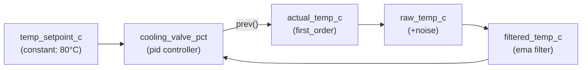

# Simulation Execution Playbook

**Zero-thinking system for building process simulations in Odibi.**

Look at a real-world system → classify it → apply a pattern → done.

!!! example "Why this matters"
    Most simulation guides start with transfer functions and Laplace transforms. By the time you finish reading, you've forgotten what you wanted to build. This playbook works differently: you observe behavior, pick a pattern, paste the YAML, tune 1-2 numbers, and you're generating realistic data. Every pattern is tested, every YAML block is copy-pasteable, and every parameter has a "start here" value. If you can describe what happens when you turn a knob, you can build a simulation.

!!! info "Prerequisites"
    This playbook assumes you understand [Core Concepts](core_concepts.md) (scope, entities, columns) and have read the [Stateful Functions](stateful_functions.md) reference for `prev()`, `ema()`, `pid()`, and `delay()`. If not, start there — this page builds on them.

---

## Overview

Odibi simulations work by evaluating expressions **row by row**, where each row represents one moment in time.

**What "row by row" means:**

Your simulation config defines a `scope.timestep` (e.g., `"1m"` for 1 minute). Odibi generates one row per timestep — so if you have 200 rows at a 1-minute timestep, you get 200 minutes of simulated data. Each row's values are calculated from:

- **Current inputs** — generators like `random_walk` produce a new value each row
- **Previous state** — the `prev()` function reads the *previous* row's value, giving each row memory of what came before

This memory is all you need to simulate any dynamic system. A tank "remembers" its level. A temperature "remembers" where it was. A PID controller "remembers" its accumulated error.

**The core loop:**

```
For each timestep (row):
    For each entity (independent):
        For each column (in dependency order):
            Evaluate expression using current inputs + prev() for state
        Save all column values → these become prev() values for the next row
```

**What this playbook gives you:**

| Section | What It Does | When To Use It |
|---|---|---|
| [Decision System](#1-decision-system) | Classify behavior → pick pattern | First. Always first |
| [Core Patterns](#2-core-pattern-library) | 5 building blocks with YAML | When building any single variable |
| [Parameter Intuition](#3-parameter-intuition-guide) | Tune without guessing | When outputs don't look right |
| [Composing Systems](#4-system-composition) | Wire patterns together | When building multi-variable systems |
| [Real-World Systems](#5-complete-real-world-systems) | Full worked examples | When you need an end-to-end reference |
| [Validation](#6-validation-playbook) | Verify behavior is realistic | After building, before trusting |
| [Troubleshooting](#7-troubleshooting) | Fix broken simulations | When something goes wrong |
| [Anti-Patterns](#8-anti-patterns) | Common mistakes to avoid | Before you start and when stuck |
| [Mental Models](#9-one-line-mental-models) | Quick rules for fast decisions | Anytime, from memory |
| [Architecture Map](#10-mapping-to-odibi-architecture) | Connect to pipelines, validation, Delta | When integrating into a real pipeline |

---

## 1. Decision System

**Input:** "I changed X. What does the output do?"

**Output:** Which pattern to use.

```
                  What does the output do?
                          │
          ┌───────────────┼───────────────┐
          ▼               ▼               ▼
     It settles       It ramps       It oscillates
     to a new         up/down        before settling
     steady value     indefinitely
          │               │               │
          ▼               ▼               ▼
     FIRST_ORDER     INTEGRATOR     SECOND_ORDER
          │
          │   Does it respond late?
          │──────── YES ────────► DEAD_TIME + FIRST_ORDER
          │
          │   Is it instant?
          └──────── YES ────────► GAIN (no dynamics)
```

### Quick-Fire Classification Table

| You observe... | Pattern | Example | Time to implement |
|---|---|---|---|
| Output gradually approaches a new value | [`first_order`](#22-first_order-the-default) | Room temp chasing thermostat setting | 30 seconds |
| Output keeps increasing/decreasing as long as input is applied | [`integrator`](#23-integrator-accumulator) | Tank filling, inventory accumulating | 30 seconds |
| Output overshoots then settles | [`second_order`](#24-second_order-overshoot--settle) | Pressure vessel filling, spring-mass system | 1 minute |
| Output responds, but only after a delay | [`dead_time`](#25-dead_time-transport-delay) | Pipeline transport, conveyor belt | 1 minute |
| Output changes instantly and proportionally | [`gain`](#21-gain-static) | Valve position → flow (immediate) | 15 seconds |

!!! tip "The 80% rule"
    **When in doubt, use `first_order`.** It covers 80% of real systems. Temperature, pressure, flow, concentration — they all settle gradually. Start with first-order and only switch if the behavior clearly doesn't match.

### Decision Examples

| Real-World Scenario | What Happens | Classification |
|---|---|---|
| Turn up the heater | Room temp rises gradually toward new setting | `first_order` |
| Open the inlet valve on a tank | Level keeps rising until you close it | `integrator` |
| Slam a spring-loaded pressure relief | Pressure bounces before settling | `second_order` |
| Pump chemical through 100m pipe | Nothing happens for 30 seconds, then flow appears | `dead_time` |
| Double the pump RPM | Flow doubles immediately | `gain` |
| Increase server request rate | CPU temp rises over minutes | `first_order` |
| Add items to warehouse | Inventory keeps growing | `integrator` |
| Hit the brakes on a truck with suspension | Truck rocks forward/back, then stops | `second_order` |

---

## 2. Core Pattern Library

Each pattern follows the same structure: what it looks like → when to use it → the expression → complete YAML → how to tune it → row-by-row trace showing what happens.

---

### 2.1 GAIN (Static)

**Behavior:** Output changes instantly and proportionally to input. No dynamics, no memory, no lag.

**What it looks like over time:** Output perfectly mirrors input, just scaled. If you plot both on the same chart, they move in lockstep.

**When to use:**

- Valve position → immediate flow rate
- Voltage → current through a resistor
- Price × quantity = revenue
- Sensor reading with a known calibration offset
- Any relationship where "if I know the input, I immediately know the output"

**Operations/Manufacturing examples:**

- Pump RPM → flow (when response is nearly instant)
- Electrical load → current draw
- Recipe multiplier → batch size

**The Expression:**

```python
output = process_gain * input_value
```

No `prev()` needed — there's no state to track.

**YAML:**

```yaml
columns:
  - name: valve_pct
    data_type: float
    generator:
      type: random_walk
      start: 50.0
      min: 0.0
      max: 100.0
      step_size: 3.0

  # Flow is instantly proportional to valve position
  - name: flow_m3_hr
    data_type: float
    generator:
      type: derived
      expression: "0.2 * valve_pct"
      # gain = 0.2 → valve at 100% produces 20 m³/hr
```

**Row-by-row trace:**

| Row | valve_pct | flow_m3_hr | How |
|-----|-----------|------------|-----|
| 1 | 50.0 | 10.0 | 0.2 × 50 |
| 2 | 53.0 | 10.6 | 0.2 × 53 |
| 3 | 48.0 | 9.6 | 0.2 × 48 |
| 4 | 55.0 | 11.0 | 0.2 × 55 |

No lag, no memory. Output tracks input perfectly.

**Tunable Parameters:**

| Parameter | Role | Typical Values | Effect |
|---|---|---|---|
| `gain` | Output per unit input | System-specific. Examples: 0.2 (m³/hr per %), 1.8 (°F per °C), 9.81 (N per kg) | Higher = more output per input unit |

**With offset (bias):**

```yaml
expression: "0.2 * valve_pct + 2.0"
# gain = 0.2, bias = 2.0 → 0% valve still produces 2 m³/hr (leakage)
```

**With nonlinearity (square-root valve characteristic):**

```yaml
expression: "20.0 * (valve_pct / 100.0) ** 0.5"
# Square-root characteristic: flow increases steeply at low openings, flattens at high openings
```

---

### 2.2 FIRST_ORDER (The Default)

**Behavior:** Output gradually chases a target. Moves fast at first (large error), then slows down as it gets closer. Always settles to the target. Never overshoots.

**What it looks like over time:** An exponential approach — a curve that starts steep and flattens out. After ~5 time constants, it's essentially at the target value.

```
target ─ ─ ─ ─ ─ ─ ─ ─ ─ ─ ─ ─ ─ ─ ─ ─ ─ ─ ─
                                    ___________
                              _____/
                         ____/
                    ___/
               ___/
          ___/
     ___/
____/
start
```

**When to use:**

- Temperature responding to heater/cooler
- CPU temperature responding to load change
- Battery charging (voltage approach)
- Room temperature chasing thermostat
- Sensor with first-order filter lag
- Any "it takes time to get there" response

**Operations/Manufacturing examples:**

- Heater → tank temperature
- Cooling water valve → jacket temperature
- Fan speed → duct temperature
- Steam valve → heat exchanger outlet
- Electrical load step → motor temperature rise

**The Expression:**

```python
y[t] = prev('y', y0) + alpha * (target - prev('y', y0))
```

Where:

- `alpha = dt / tau` (timestep ÷ time constant)
- `dt` = your simulation timestep in the same units as `tau`
- `tau` = time constant (time for 63% of the step response)
- `target` = what the output is trying to reach (can be a static value or another column)

**YAML — Simple (tracking a wandering target):**

```yaml
columns:
  - name: target_temp_c
    data_type: float
    generator:
      type: random_walk
      start: 75.0
      min: 60.0
      max: 90.0

  - name: actual_temp_c
    data_type: float
    generator:
      type: derived
      expression: "prev('actual_temp_c', 25.0) + 0.2 * (target_temp_c - prev('actual_temp_c', 25.0))"
      # alpha = 0.2 → dt/tau = 60s/300s → 5-min time constant at 1-min steps
```

**YAML — With process gain (input scaling):**

```yaml
columns:
  - name: heater_pct
    data_type: float
    generator:
      type: random_walk
      start: 50.0
      min: 0.0
      max: 100.0

  - name: tank_temp_c
    data_type: float
    generator:
      type: derived
      expression: "prev('tank_temp_c', 25.0) + 0.2 * (0.5 * heater_pct - prev('tank_temp_c', 25.0))"
      # gain = 0.5 → heater at 100% → temp settles at 50°C
      # alpha = 0.2 → 5-min time constant at 1-min steps
```

**Row-by-row trace (step from 25°C toward target 75°C, alpha=0.2):**

| Row | prev('actual_temp_c') | target | error | alpha × error | actual_temp_c |
|-----|----------------------|--------|-------|---------------|---------------|
| 1 | 25.0 (default) | 75.0 | 50.0 | 10.0 | 35.0 |
| 2 | 35.0 | 75.0 | 40.0 | 8.0 | 43.0 |
| 3 | 43.0 | 75.0 | 32.0 | 6.4 | 49.4 |
| 4 | 49.4 | 75.0 | 25.6 | 5.12 | 54.52 |
| 5 | 54.52 | 75.0 | 20.48 | 4.10 | 58.62 |

Notice: error shrinks by 20% each step (because alpha = 0.2). After ~15 steps (~5 time constants), the temperature is within 1°C of 75°C.

**Tunable Parameters:**

| Parameter | Role | Typical Range | Start Here | Effect |
|---|---|---|---|---|
| `alpha` (dt/τ) | Response speed per step | 0.01 – 0.5 | 0.1 | Low = sluggish, smooth. High = snappy, tracks fast |
| `process_gain` | Steady-state output per unit input | System-specific | 1.0 | Scales the target: `target = process_gain × input`. Not the same as PID Kp — this is a property of the physical system, not the controller |

**Alpha quick reference (for 1-minute timestep):**

| alpha | tau (time constant) | 63% response time | Feels like |
|-------|--------------------|--------------------|------------|
| 0.01 | 100 min | 100 min | Glacially slow (building thermal mass) |
| 0.05 | 20 min | 20 min | Slow (large tank heating) |
| 0.1 | 10 min | 10 min | Moderate (typical process) |
| 0.2 | 5 min | 5 min | Responsive (small vessel) |
| 0.5 | 2 min | 2 min | Fast (sensor lag, small heat sink) |

!!! warning "Keep alpha ≤ 0.5"
    Values above 0.5 cause the output to oscillate around the target. Values above 1.0 diverge and blow up. If you need faster response, reduce your timestep (`scope.timestep`) instead of increasing alpha.

---

### 2.3 INTEGRATOR (Accumulator)

**Behavior:** Output ramps up or down as long as input is nonzero. No natural settling point. Keeps going forever unless clamped.

**What it looks like over time:** A line (or wobbly line) that trends upward or downward. Unlike first-order, it never flattens out on its own — it needs an external constraint (tank overflow, empty, physical limit) or a controller to stop it.

```
    ↑ output
    │        /
    │       /
    │      /          ← constant positive rate = straight line up
    │     /
    │    /
    │   /
    │  /
    │ /
    └──────────────→ time
```

**When to use:**

- Tank level (inflow − outflow = rate of change)
- Inventory (receipts − shipments)
- Equipment runtime hours
- Distance traveled (speed × time)
- Bank account balance (deposits − withdrawals)
- Cumulative energy consumption (kWh)
- Batch weight accumulation

**Operations/Manufacturing examples:**

- Water tank fill level
- Raw material silo level
- Cumulative production count
- Equipment operating hours for PM scheduling
- Waste accumulation in a holding tank

**The Expression:**

```python
y[t] = prev('y', y0) + rate * dt
```

Where:

- `rate` = how fast the output is changing (can be a computed net rate like `inflow - outflow`)
- `dt` = timestep conversion factor to align units

**YAML — Simple counter:**

```yaml
columns:
  - name: runtime_hours
    data_type: float
    generator:
      type: derived
      expression: "prev('runtime_hours', 0) + (1/60)"
      # Accumulates 1/60 hour per 1-minute timestep
```

**YAML — Tank level with physical limits:**

```yaml
columns:
  - name: inflow_m3_hr
    data_type: float
    generator:
      type: random_walk
      start: 5.0
      min: 2.0
      max: 8.0
      step_size: 0.5

  - name: outflow_m3_hr
    data_type: float
    generator:
      type: random_walk
      start: 5.0
      min: 3.0
      max: 7.0
      step_size: 0.5

  - name: level_m3
    data_type: float
    generator:
      type: derived
      expression: "max(0, min(100, prev('level_m3', 50.0) + (inflow_m3_hr - outflow_m3_hr) * (5/60)))"
      # dt = 5/60 hr (5-min timestep, flows in m³/hr)
      # Clamped to [0, 100] m³ (physical tank limits)
```

**Row-by-row trace (5-min timestep, dt = 5/60 hr):**

| Row | prev('level_m3') | inflow | outflow | net rate | Δlevel | level_m3 (clamped) |
|-----|-----------------|--------|---------|----------|--------|-------------------|
| 1 | 50.0 (default) | 6.0 | 4.5 | 1.5 | +0.125 | 50.125 |
| 2 | 50.125 | 6.5 | 5.0 | 1.5 | +0.125 | 50.250 |
| 3 | 50.250 | 5.0 | 6.0 | −1.0 | −0.083 | 50.167 |
| 4 | 50.167 | 4.0 | 7.0 | −3.0 | −0.250 | 49.917 |

**Tunable Parameters:**

| Parameter | Role | Typical Range | Start Here | Effect |
|---|---|---|---|---|
| `gain` | Rate multiplier | System-specific | 1.0 | Scales how fast the level changes per unit of net rate |
| `dt` | Timestep conversion | Must match `scope.timestep` | Calculate from units | Wrong dt = wrong accumulation rate |
| `min` / `max` (clamp) | Physical bounds | System-specific | 0 / tank capacity | Prevents impossible values |

!!! warning "Always clamp integrators"
    Integrators have **no natural limit**. Without `max(lower, min(upper, ...))`, your tank level will go to infinity or negative infinity. Real tanks overflow or run dry — model that.

!!! tip "Self-regulating integrators"
    A tank with a gravity drain naturally self-regulates: outflow increases with level. Model this by making outflow proportional to `prev('level')`:

    ```yaml
    - name: outflow_m3_hr
      data_type: float
      generator:
        type: derived
        expression: "max(0, 0.1 * prev('level_m3', 50.0))"
        # Drain coefficient = 0.1 → at level=80, outflow = 8 m³/hr
    ```

    This creates a **self-regulating integrator** that naturally stabilizes without a controller. See [System 2](#system-2-tank-level-with-self-regulating-drain-integrator--gain) for a complete worked example.

---

### 2.4 SECOND_ORDER (Overshoot + Settle)

**Behavior:** Output overshoots the target, oscillates back and forth, then gradually settles. More "bouncy" than first-order.

**What it looks like over time:**

```
    ↑ output
    │
    │        ____
    │       /    \             ___
target─── /──────\───────────/───── ─ ─ ─ ─
    │   /         \         /
    │  /           \_______/
    │ /
    │/
    └──────────────────────────────→ time
       overshoot   undershoot   settled
```

**When to use:**

- Pressure vessels (gas compression/expansion)
- Spring-mass-damper systems
- Underdamped PID control loops
- Mechanical resonance (vibrating equipment)
- Hydraulic systems with momentum

**Operations/Manufacturing examples:**

- Pressure vessel during rapid filling
- Conveyor belt starting/stopping (inertia)
- Hydraulic cylinder position
- Robot arm position control
- Building HVAC with poorly tuned controller

**The Expression (velocity form):**

Two columns work together — one tracks the rate of change ("velocity"), the other tracks the actual value ("position"):

```python
velocity[t] = prev('velocity', 0) + beta * (target - prev('y', y0)) - damping * prev('velocity', 0)
y[t]        = prev('y', y0) + velocity[t]
```

Where:

- `beta` = restoring force / spring stiffness (how aggressively it tries to reach the target)
- `damping` = friction / energy dissipation (how quickly oscillations die out)

**YAML:**

```yaml
columns:
  - name: target_pressure_bar
    data_type: float
    generator:
      type: constant
      value: 10.0

  # Hidden velocity state (rate of pressure change)
  - name: pressure_velocity
    data_type: float
    generator:
      type: derived
      expression: "prev('pressure_velocity', 0) + 0.04 * (target_pressure_bar - prev('vessel_pressure_bar', 5.0)) - 0.3 * prev('pressure_velocity', 0)"
      # beta = 0.04 (spring stiffness)
      # damping = 0.3

  # Actual pressure output
  - name: vessel_pressure_bar
    data_type: float
    generator:
      type: derived
      expression: "max(0, prev('vessel_pressure_bar', 5.0) + pressure_velocity)"
```

**Row-by-row trace (step from 5.0 bar toward target 10.0 bar):**

| Row | prev(velocity) | prev(pressure) | error | beta×error | damping×vel | new velocity | new pressure |
|-----|---------------|----------------|-------|------------|-------------|-------------|-------------|
| 1 | 0 | 5.00 | 5.00 | +0.200 | 0 | 0.200 | 5.20 |
| 2 | 0.200 | 5.20 | 4.80 | +0.192 | 0.060 | 0.332 | 5.53 |
| 3 | 0.332 | 5.53 | 4.47 | +0.179 | 0.100 | 0.411 | 5.94 |
| 4 | 0.411 | 5.94 | 4.06 | +0.162 | 0.123 | 0.450 | 6.39 |
| 5 | 0.450 | 6.39 | 3.61 | +0.144 | 0.135 | 0.459 | 6.85 |
| 6 | 0.459 | 6.85 | 3.15 | +0.126 | 0.138 | 0.447 | 7.30 |
| 7 | 0.447 | 7.30 | 2.70 | +0.108 | 0.134 | 0.421 | 7.72 |
| 8 | 0.421 | 7.72 | 2.28 | +0.091 | 0.126 | 0.386 | 8.11 |
| 9 | 0.386 | 8.11 | 1.89 | +0.076 | 0.116 | 0.346 | 8.45 |
| 10 | 0.346 | 8.45 | 1.55 | +0.062 | 0.104 | 0.304 | 8.76 |
| 12 | 0.263 | 9.02 | 0.98 | +0.039 | 0.079 | 0.223 | 9.24 |
| 15 | 0.153 | 9.58 | 0.42 | +0.017 | 0.046 | 0.124 | 9.71 |
| 20 | 0.043 | 9.98 | 0.02 | +0.001 | 0.013 | 0.031 | 10.01 |
| 25 | 0.003 | 10.06 | −0.06 | −0.002 | 0.001 | −0.000 | 10.06 |

**Reading this trace:** Velocity (rate of change) builds up in rows 1–5, peaks at row 5 (~0.459), then declines. Pressure crosses 10.0 bar around row 20, slightly overshoots to ~10.06, then settles. With damping=0.3, the overshoot is minimal (~1.2%). Lower damping (e.g., 0.15) would produce a more dramatic overshoot — around 27% — with visible oscillation before settling.

**Tunable Parameters:**

| Parameter | Role | Typical Range | Start Here | Effect |
|---|---|---|---|---|
| `beta` | Restoring force / spring constant | 0.01 – 0.1 | 0.04 | Low = slow oscillation. High = fast oscillation |
| `damping` | Friction / energy dissipation | 0.1 – 0.9 | 0.3 | Low = more bounce. High = less bounce |

**Damping behavior guide:**

| Damping | Overshoot | Oscillations | Behavior Name | Looks Like |
|---|---|---|---|---|
| 0.05–0.15 | Large (50%+) | Many (5+) | Underdamped | Ringing bell |
| 0.2–0.4 | Moderate (10-30%) | 2-3 | Slightly underdamped | Truck suspension |
| 0.5–0.7 | Small (< 10%) | 0-1 | Near critically damped | Closing door |
| 0.8–1.0 | None | 0 | Overdamped | Heavy door with closer |

!!! tip "When to use second-order vs first-order"
    If you don't need overshoot, don't use second-order — it's more complex and uses an extra column. Use first-order and save the complexity for where it matters. Second-order is for when **overshoot is the behavior you want to model**.

---

### 2.5 DEAD_TIME (Transport Delay)

**Behavior:** Output is a time-shifted copy of the input. Nothing happens for N steps, then the effect appears. Often combined with first-order dynamics after the delay.

**What it looks like over time:**

```
input:    ────────┐
                  │
                  └─────────────────
                  ↑ step change

output:   ────────────────┐
                          │            ← N steps later
                          └─────────
                          ↑ delayed response
```

**When to use:**

- Fluid transport through a long pipe
- Conveyor belt moving material from point A to point B
- Network latency (command sent, response arrives later)
- Batch processing queue (job submitted, result available later)
- Chemical analysis sample transport (take sample → lab result)

**Operations/Manufacturing examples:**

- Pipeline transport delay (pump station → delivery point)
- Paint drying time (spray → dry → inspect)
- Oven/kiln transit time (enter → exit)
- Sample analysis turnaround

**The Expression:**

Odibi provides a built-in `delay()` stateful function that maintains a ring buffer of past values per entity:

```python
delayed_value = delay('column_name', steps, default)
```

**Full signature:** `delay('column_name', steps, default_value)`

| Parameter | Type | Required | Description |
|-----------|------|----------|-------------|
| `column` | string | Yes | Column name to delay (must be quoted) |
| `steps` | int | Yes | Number of timesteps to look back (≥ 1) |
| `default` | any | Yes | Value to return during the initial fill period (first N rows) |

**How it works internally:** `delay()` stores the last N+1 values in a ring buffer (per entity, per column). On each row, it appends the current value and returns the oldest value in the buffer. During the first N rows, the buffer isn't full yet, so it returns the default.

**YAML — Pure dead time (5-step delay):**

```yaml
columns:
  - name: input_signal
    data_type: float
    generator:
      type: random_walk
      start: 50.0
      min: 0.0
      max: 100.0

  # Output is exactly the input from 5 steps ago
  - name: delayed_signal
    data_type: float
    generator:
      type: derived
      expression: "delay('input_signal', 5, 50.0)"
      # Returns 50.0 for the first 5 rows, then tracks input from 5 steps ago
```

**YAML — Dead time + first-order response (the common real-world case):**

```yaml
columns:
  - name: input_signal
    data_type: float
    generator:
      type: random_walk
      start: 50.0
      min: 0.0
      max: 100.0

  # Step 1: delay the input by 5 timesteps
  - name: delayed_input
    data_type: float
    generator:
      type: derived
      expression: "delay('input_signal', 5, 50.0)"

  # Step 2: first-order response to the delayed signal
  - name: output_signal
    data_type: float
    generator:
      type: derived
      expression: "prev('output_signal', 50.0) + 0.15 * (delayed_input - prev('output_signal', 50.0))"
      # First-order dynamics AFTER the dead time
```

**YAML — Pipeline transport with step-change testing:**

`scheduled_events` is a top-level simulation key (not per-column). Use `start_time` / `end_time`:

```yaml
scope:
  start_time: "2026-01-01T00:00:00Z"
  timestep: "1m"
  row_count: 120

columns:
  - name: pump_command
    data_type: float
    generator:
      type: constant
      value: 50.0

  # Pipeline transport: 10-minute dead time, then first-order response
  - name: delivery_flow
    data_type: float
    generator:
      type: derived
      expression: "prev('delivery_flow', 10.0) + 0.15 * (delay('pump_command', 10, 50.0) * 0.2 - prev('delivery_flow', 10.0))"
      # delay('pump_command', 10, 50.0) = pump command from 10 minutes ago
      # 0.2 = process gain (100% pump → 20 m³/hr)
      # 0.15 = first-order alpha

# Step change: pump jumps from 50% → 80% at 10 minutes, returns at 40 minutes
scheduled_events:
  - type: forced_value
    column: pump_command
    value: 80.0
    start_time: "2026-01-01T00:10:00Z"
    end_time: "2026-01-01T00:40:00Z"
```

**Row-by-row trace (5-step delay):**

| Row | input_signal | delay() returns | Why |
|-----|-------------|-----------------|-----|
| 1 | 60.0 | 50.0 (default) | Only 1 past value stored — not yet 5 steps of history |
| 2 | 62.0 | 50.0 (default) | 2 past values stored |
| 3 | 55.0 | 50.0 (default) | 3 past values stored |
| 4 | 58.0 | 50.0 (default) | 4 past values stored |
| 5 | 61.0 | 50.0 (default) | 5 past values stored — buffer just filled |
| 6 | 59.0 | **60.0** | Returns row 1's input (6 − 5 = row 1) |
| 7 | 63.0 | **62.0** | Returns row 2's input (7 − 5 = row 2) |
| 8 | 57.0 | **55.0** | Returns row 3's input (8 − 5 = row 3) |

**Key insight:** The first 5 rows return the default (the buffer is filling up). Starting at row 6, every output equals the input from exactly 5 rows earlier — continuously, at every point in the simulation. This is true dead time.

**Tunable Parameters:**

| Parameter | Role | Typical Range | Start Here | Effect |
|---|---|---|---|---|
| `steps` | Number of dead timesteps in `delay()` | 1 – 50 | 5–10 | More = longer silence before response |
| `alpha` | Post-delay first-order response speed | 0.05 – 0.3 | 0.15 | Combined with `delay()` for realistic shape |

!!! tip "delay() vs prev()"
    `prev()` looks back exactly 1 row. `delay()` looks back N rows using an internal ring buffer. Use `prev()` for dynamic state (integrators, first-order responses). Use `delay()` for transport delays where the output is a time-shifted copy of the input.

!!! info "delay() and incremental mode"
    When using `incremental.mode: stateful`, the delay buffer is persisted between runs along with all other stateful function state. Run 2 picks up the full buffer from Run 1 — no discontinuity.

---

## 3. Parameter Intuition Guide

### Master Parameter Table

| Parameter | What It Controls | Low Value (e.g., 0.05) | High Value (e.g., 0.5+) | Start Here |
|---|---|---|---|---|
| **alpha** (dt/τ) | Fraction of error corrected per step | Sluggish, slow to react, very smooth curves | Snappy, tracks target tightly, more responsive | 0.1 |
| **process_gain** | Steady-state output per unit input | Small output per input change | Large output per input change | 1.0 |
| **beta** | Restoring force (2nd order only) | Slow, lazy oscillation | Fast, aggressive oscillation | 0.04 |
| **damping** | Energy dissipation (2nd order only) | Heavy oscillation, rings for many cycles | Quick settling, nearly first-order | 0.3 |
| **steps** (delay) | Dead time steps via `delay()` | Short delay, nearly immediate | Long delay, output feels disconnected from input | 5 |

### How Alpha Relates to Physical Time Constants

Your alpha value is determined by your system's time constant and your chosen timestep:

```
alpha = dt / tau

dt   = your simulation timestep (scope.timestep converted to same units as tau)
tau  = system time constant (time to reach 63% of final value)
```

| System | Typical tau | At 1-min timestep (alpha) | At 5-min timestep (alpha) |
|---|---|---|---|
| Flow control valve | 10–60 seconds | 1.0–6.0 ⚠️ **use smaller timestep** | — |
| Small tank temperature | 2–10 minutes | 0.1–0.5 ✅ | 0.5–2.5 ⚠️ |
| Large vessel temperature | 10–30 minutes | 0.03–0.1 ✅ | 0.17–0.5 ✅ |
| Building HVAC | 30–120 minutes | 0.008–0.03 ✅ | 0.04–0.17 ✅ |
| Chemical reaction (composition) | 5–60 minutes | 0.02–0.2 ✅ | 0.08–1.0 ⚠️ |

!!! warning "If alpha > 0.5, reduce your timestep"
    `alpha = dt/tau`. If tau is small relative to dt, alpha goes above 0.5 and the simulation oscillates. The fix is **always** to reduce timestep, never to force a large alpha.

### How to Calculate dt for Unit Conversion

The most common mistake in simulation is mismatched units between flow rates and timestep. Here's the conversion table:

| scope.timestep | dt for flows in m³/hr | dt for flows in m³/min | dt for flows in L/s |
|---|---|---|---|
| `1s` | 1/3600 | 1/60 | 1 |
| `1m` | 1/60 | 1 | 60 |
| `5m` | 5/60 | 5 | 300 |
| `1h` | 1 | 60 | 3600 |

**Rule:** `dt` converts "rate × dt = amount accumulated per timestep."

```yaml
# Flows in m³/hr, timestep = 5 minutes
expression: "prev('level', 50) + (inflow_m3_hr - outflow_m3_hr) * (5/60)"
#                                                                  ^^^^^^
#                                                          5 min ÷ 60 min/hr
```

### PID Tuning Quick Guide

When using `pid()`, start conservative and adjust:

| Step | Action | Typical Values |
|---|---|---|
| 1. **P only** | Set `Kp`, `Ki=0`, `Kd=0` | Start at Kp = ±1.0 |
| 2. **Add I** | Set `Ki = Kp / 10` | Eliminates steady-state offset |
| 3. **Add D** (optional) | Set `Kd = Kp / 4` | Reduces oscillation |

**Sign convention:**

- **Direct-acting** (more output → higher PV): use positive Kp, Ki, Kd
- **Reverse-acting** (more output → lower PV, e.g., cooling): use **negative** Kp, Ki, Kd

**Match dt to timestep:**

```yaml
# scope.timestep: "1m"  →  pid(dt=60)
# scope.timestep: "5m"  →  pid(dt=300)
# scope.timestep: "1h"  →  pid(dt=3600)
```

!!! warning "pid(dt=...) must match your timestep in seconds"
    If `scope.timestep: "5m"` but you write `pid(dt=60)`, the controller will over-correct by 5×. This is the #1 PID debugging issue.

---

## 4. System Composition

### How to Wire Patterns Together

Real systems are made of multiple interacting variables. Each variable uses one of the 5 core patterns, and they're connected through expressions.

**The composition process:**

1. **List your variables** — what are the inputs, states, and outputs?
2. **Classify each one** — which core pattern does each variable use?
3. **Draw the dependency arrows** — which variables feed into which?
4. **Break cycles with `prev()`** — any feedback loop needs at least one `prev()` reference
5. **Write the YAML** — one column per variable, in any order (Odibi resolves dependencies)

### Composition Rules

| Rule | Why | Example |
|---|---|---|
| One pattern per column | Keeps each expression simple and debuggable | Temperature = first_order. Level = integrator. Not both in one expression |
| Break feedback loops with `prev()` | Avoids circular dependency errors | Controller reads `prev('temperature')`, not `temperature` |
| Match units across connections | Different units silently produce wrong numbers | If flow is m³/hr and timestep is 5 min, multiply by `(5/60)` |
| Clamp outputs at physical limits | Prevents impossible values from propagating | `max(0, min(100, ...))` for levels, percentages |
| Build and validate one variable at a time | Isolate problems before they compound | Get the integrator working before adding the PID |

### Dependency Graph Notation

Throughout this section, arrows show data flow:

```
A ──► B        means: B's expression uses A's current value
A ──►(prev) B  means: B's expression uses prev('A')
A ◄──► B       means: feedback loop (at least one side uses prev())
```

---

## 5. Complete Real-World Systems

Three complete systems, from simple to complex. Each includes the dependency graph, YAML config, pattern classification, and explanation of emergent behavior.

---

### System 1: Pump → Flow (Gain + First-Order)

**Scenario:** An operator sets a pump speed (0–100%). The flow doesn't change instantly — it takes about 30 seconds to reach the new value. Maximum flow at 100% speed is 20 m³/hr.

**Dependency graph:**

```
pump_speed_pct ────► flow_m3_hr
  (random_walk)      (first_order chasing gain × input)
```

**Pattern classification:**

| Variable | Pattern | Why |
|---|---|---|
| `pump_speed_pct` | Input (`random_walk`) | Operator-driven, wanders |
| `flow_m3_hr` | `gain` × `first_order` | Proportional + lagged response |

**Complete YAML:**

```yaml
read:
  connection: null
  format: simulation
  options:
    simulation:
      scope:
        start_time: "2026-01-01T00:00:00Z"
        timestep: "1m"
        row_count: 200
        seed: 42

      entities:
        names: [pump_01]

      columns:
        - name: timestamp
          data_type: timestamp
          generator:
            type: timestamp

        - name: entity_id
          data_type: string
          generator:
            type: constant
            value: "{entity_id}"

        # Operator sets pump speed (0-100%)
        - name: pump_speed_pct
          data_type: float
          generator:
            type: random_walk
            start: 50.0
            min: 0.0
            max: 100.0
            step_size: 2.0

        # Flow responds with first-order lag
        # Max flow = 20 m³/hr at 100% → process_gain = 0.2
        # Real tau = 30s, but with 1-min timestep: dt/tau = 60/30 = 2.0 ⚠️ too high for stability!
        # Compromise: use alpha = 0.3 → effective tau = 60/0.3 = 200s (slower than reality, but stable)
        # For true 30s response, you'd need scope.timestep: "5s" with alpha = 5/30 = 0.17
        - name: flow_m3_hr
          data_type: float
          generator:
            type: derived
            expression: "max(0, prev('flow_m3_hr', 10.0) + 0.3 * (0.2 * pump_speed_pct - prev('flow_m3_hr', 10.0)))"
```

**How behavior emerges:**

1. Pump speed wanders randomly between 0–100%
2. Flow target = `0.2 × speed` (gain converts speed → flow)
3. Actual flow chases the target with alpha=0.3 (closes 30% of the gap each minute)
4. Flow is always ≥ 0 (physical constraint — can't flow backwards)
5. At steady state with speed=50%: flow ≈ 0.2 × 50 = 10 m³/hr ✅

**Step-change validation:**

If pump speed jumps from 50% → 80%:

- Target flow changes: 0.2 × 80 = 16 m³/hr
- After 1 step: 10 + 0.3 × (16 − 10) = 11.8 m³/hr
- After 5 steps: ≈ 15.3 m³/hr (within 5% of target)
- After 10 steps: ≈ 15.97 m³/hr (essentially at target)

---

### System 2: Tank Level with Self-Regulating Drain (Integrator + Gain)

**Scenario:** A tank receives variable inflow from upstream. Outflow is gravity-driven — the higher the level, the faster it drains. Level integrates the difference. Tank capacity is 100 m³.

**Dependency graph:**

```
inflow_m3_hr ─────────────────────┐
  (random_walk)                   │
                                  ├──► level_m3 (integrator, clamped)
outflow_m3_hr ◄──(prev)───── level_m3
  (gain × prev(level))           │
                                  ├──► level_pct (gain)
                                  │
                                  └──► level_alarm (derived boolean)
```

**Pattern classification:**

| Variable | Pattern | Why |
|---|---|---|
| `inflow_m3_hr` | Input (`random_walk`) | Upstream process, variable |
| `outflow_m3_hr` | `gain` × `prev(level)` | Gravity-driven, proportional to head |
| `level_m3` | `integrator` (clamped) | Accumulates net flow |
| `level_pct` | `gain` | Simple unit conversion |
| `level_alarm` | Derived boolean | Threshold check |

**Complete YAML:**

```yaml
read:
  connection: null
  format: simulation
  options:
    simulation:
      scope:
        start_time: "2026-01-01T00:00:00Z"
        timestep: "5m"
        row_count: 500
        seed: 42

      entities:
        names: [tank_01]

      columns:
        - name: timestamp
          data_type: timestamp
          generator:
            type: timestamp

        - name: entity_id
          data_type: string
          generator:
            type: constant
            value: "{entity_id}"

        # Inflow varies with upstream process
        - name: inflow_m3_hr
          data_type: float
          generator:
            type: random_walk
            start: 8.0
            min: 4.0
            max: 12.0
            step_size: 0.5
            mean_reversion: 0.05

        # Outflow is head-driven: more level → more drain
        # Drain coefficient = 0.1 → at level=80, outflow = 8 m³/hr
        - name: outflow_m3_hr
          data_type: float
          generator:
            type: derived
            expression: "max(0, 0.1 * prev('level_m3', 50.0))"

        # Tank level integrates (inflow - outflow) over time
        - name: level_m3
          data_type: float
          generator:
            type: derived
            expression: "max(0, min(100, prev('level_m3', 50.0) + (inflow_m3_hr - outflow_m3_hr) * (5/60)))"
            # dt = 5/60 hr (5-min timestep, flows in m³/hr)
            # Clamped to [0, 100] m³

        # Percent full (tank capacity = 100 m³, so level_m3 / 100 * 100 = level_m3)
        # If your tank capacity were different (e.g., 500 m³), use: level_m3 / 500 * 100
        - name: level_pct
          data_type: float
          generator:
            type: derived
            expression: "level_m3 / 100.0 * 100.0"

        # High/low level alarm
        - name: level_alarm
          data_type: string
          generator:
            type: derived
            expression: "'HIGH' if level_m3 > 90 else ('LOW' if level_m3 < 10 else 'NORMAL')"
```

**How behavior emerges:**

1. Inflow wanders randomly between 4–12 m³/hr (mean-reverting around 8)
2. Outflow = `0.1 × level`. At level 80 → outflow = 8 m³/hr
3. **Natural equilibrium:** Level stabilizes where outflow matches inflow. If inflow averages 8 m³/hr, level settles around 80 m³ (because 0.1 × 80 = 8) — **without any controller!**
4. This is a **self-regulating integrator** — the gravity drain creates a natural feedback
5. Clamps at [0, 100] prevent impossible levels
6. Alarm column provides operational awareness

**Why this matters:** Self-regulating integrators are extremely common in real systems (tanks with gravity drains, batteries with voltage-dependent charge rates, queues with load-dependent processing). Recognizing this pattern saves you from adding unnecessary PID controllers.

---

### System 3: Temperature Control Loop (Full Feedback System)

**Scenario:** A reactor has a constant heat source (exothermic reaction at ~95°C equilibrium). A PID controller drives a cooling valve (0–100%) to maintain temperature setpoint at 80°C. The temperature sensor is noisy, so an EMA filter smooths the signal before the controller sees it.

**This is the canonical Odibi simulation pattern:** Process → Sensor → Filter → Controller → Actuator → Process (loop).

**Dependency graph:**



**Pattern classification:**

| Variable | Pattern | Odibi Function | Role |
|---|---|---|---|
| `temp_setpoint_c` | `constant` | Generator | What we want |
| `actual_temp_c` | `first_order` | `prev()` | True process physics |
| `raw_temp_c` | `prev()` + noise | `prev()` + `random()` | Noisy measurement |
| `filtered_temp_c` | EMA smoothing | `ema()` | Clean signal for controller |
| `cooling_valve_pct` | PID controller | `pid()` | Control action |

**Complete YAML:**

```yaml
read:
  connection: null
  format: simulation
  options:
    simulation:
      scope:
        start_time: "2026-01-01T00:00:00Z"
        timestep: "1m"
        row_count: 300
        seed: 42

      entities:
        names: [reactor_01]

      columns:
        - name: timestamp
          data_type: timestamp
          generator:
            type: timestamp

        - name: entity_id
          data_type: string
          generator:
            type: constant
            value: "{entity_id}"

        # === SETPOINT ===
        - name: temp_setpoint_c
          data_type: float
          generator:
            type: constant
            value: 80.0

        # === PROCESS: reactor temperature ===
        # Heat source at 95°C equilibrium without cooling
        # Cooling valve removes heat: 0.3°C per % valve
        # First-order dynamics: alpha = 0.05 (dt/tau = 60s/1200s → 20-min time constant)
        - name: actual_temp_c
          data_type: float
          generator:
            type: derived
            expression: "prev('actual_temp_c', 85.0) + 0.05 * (95.0 - prev('cooling_valve_pct', 50) * 0.3 - prev('actual_temp_c', 85.0))"

        # === SENSOR: noisy measurement ===
        - name: raw_temp_c
          data_type: float
          generator:
            type: derived
            expression: "prev('actual_temp_c', 85.0) + (random() - 0.5) * 4"
            # ±2°C measurement noise band

        # === FILTER: EMA smoothing ===
        - name: filtered_temp_c
          data_type: float
          generator:
            type: derived
            expression: "ema('raw_temp_c', 0.3, 85.0)"
            # alpha=0.3 → moderate smoothing (30% current + 70% history)

        # === CONTROLLER: PID output ===
        - name: cooling_valve_pct
          data_type: float
          generator:
            type: derived
            expression: "pid(pv=filtered_temp_c, sp=temp_setpoint_c, Kp=-2.0, Ki=-0.1, Kd=-0.5, dt=60, output_min=0, output_max=100)"
            # Reverse-acting (negative gains): more cooling output → lower temp
            # dt=60 matches 1-min timestep

      # Optional: inject sensor chaos for additional realism
      chaos:
        outlier_rate: 0.005
        outlier_factor: 3.0
```

**How behavior emerges step by step:**

1. **Startup:** Reactor starts at 85°C (above 80°C setpoint). PID calculates error = SP − PV = 80 − 85 = **−5** (negative error means "too hot")
2. **Controller acts:** Negative Kp × negative error = positive output → PID opens cooling valve (Kp=−2.0 × error=−5 = +10 → valve opens)
3. **Process responds:** `actual_temp_c` drops via first-order dynamics toward `(95 - valve% × 0.3)`
4. **Sensor reports:** `raw_temp_c` = actual temp ± 2°C noise
5. **Filter smooths:** `filtered_temp_c` = EMA of noisy signal (cleaner reading for PID)
6. **PID adjusts:** As temp approaches setpoint, error shrinks, valve output reduces
7. **Steady state:** System balances when `95 - valve% × 0.3 ≈ 80`, so valve ≈ 50%
8. **Integral eliminates offset:** Ki ensures final temp equals exactly 80°C, not 80 ± something

**Expected steady-state values:**

| Variable | Steady-State Value | Why |
|---|---|---|
| actual_temp_c | 80.0°C ± 0.5 | PID integral eliminates offset |
| raw_temp_c | 80.0°C ± 2.0 | Measurement noise on top |
| filtered_temp_c | 80.0°C ± 0.7 | EMA reduces noise by ~70% |
| cooling_valve_pct | ~50% | Balances heat source at 95°C |

---

## 6. Validation Playbook

### Step-Change Test Protocol

The fastest way to verify a simulation produces realistic behavior.

**Method:** Set the input to a constant, let the system reach steady state, then abruptly change the input. Observe the response shape.

**Using `scheduled_events` for automated step-change testing:**

`scheduled_events` is a **top-level** simulation key (sibling of `scope:`, `entities:`, `columns:`), not nested under individual columns. It uses `start_time` / `end_time` fields:

```yaml
scope:
  start_time: "2026-01-01T00:00:00Z"
  timestep: "1m"
  row_count: 120

columns:
  - name: pump_speed_pct
    data_type: float
    generator:
      type: constant
      value: 50.0

  # ... other columns that respond to pump_speed_pct ...

# Step test: force pump from 50% → 80% for 30 minutes
scheduled_events:
  - type: forced_value
    column: pump_speed_pct
    value: 80.0
    start_time: "2026-01-01T01:00:00Z"    # After 1 hour of steady state
    end_time: "2026-01-01T01:30:00Z"      # Hold for 30 min, then return to 50%
```

**What you get:** A clean "before → step → response → return" trace for each downstream variable.

### The 6-Point Check

For every simulation, verify all six:

| # | Check | What You're Looking For | Pass Criteria | How To Verify |
|---|---|---|---|---|
| 1 | **Direction** | Does output move the right way when input changes? | Increase input → output increases (or decreases for reverse-acting) | Visual: plot input and output on same chart |
| 2 | **Speed** | Does it respond at the right speed? | Reaches ~63% of final value in 1 time constant (1/α steps) | Count rows from step to 63% response |
| 3 | **Settling** | Does it reach steady state? | Output stops changing within 5 time constants (5/α steps) | Check last 20 rows are within 2% of target |
| 4 | **Overshoot** | Does it overshoot? | first_order: never. second_order/PID: < 20% of step size | Measure peak vs final value |
| 5 | **Bounds** | Does it stay within physical limits? | No negative levels, no percentages > 100 | `df['level'].min() >= 0` |
| 6 | **Independence** | Do multiple entities run independently? | Same config, different trajectories | Run 2+ entities, compare traces |

### Expected Step Response by Pattern

| Pattern | Response Shape | Time to 63% | Time to Settle (±2%) | Overshoot |
|---|---|---|---|---|
| `gain` | Instant jump | 0 steps | 0 steps | None |
| `first_order` | Exponential approach | 1/α steps | 5/α steps | None |
| `integrator` | Constant-slope ramp | N/A (keeps ramping) | Never | N/A |
| `second_order` | Overshoot → oscillate → settle | ~π/(2×√beta) steps | 10–20/β steps | Depends on damping |
| `dead_time + first_order` | Flat for lag steps, then exponential | lag + 1/α steps | lag + 5/α steps | None |

### Runnable Validation Configs

Each config below is a self-contained simulation you can run and compare against the expected values. If your output doesn't match, something is misconfigured.

**How to run any validation config:**

```python
from odibi.config import SimulationConfig
from odibi.simulation import SimulationEngine
import yaml

config_dict = yaml.safe_load(open("my_validation.yaml"))
config = SimulationConfig(**config_dict)
rows = SimulationEngine(config).generate()
for i, r in enumerate(rows):
    print(f"Row {i+1}: {r}")
```

#### Validation 1: First-Order Step Response

```yaml
scope:
  start_time: "2026-01-01T00:00:00Z"
  timestep: "1m"
  row_count: 20
  seed: 42
columns:
  - name: timestamp
    data_type: timestamp
    generator:
      type: timestamp
  - name: target
    data_type: float
    generator:
      type: constant
      value: 100.0
  - name: temperature
    data_type: float
    generator:
      type: derived
      expression: "prev('temperature', 50.0) + 0.1 * (target - prev('temperature', 50.0))"
```

!!! success "Expected Output"
    | Row | temperature | % of step |
    |-----|-------------|-----------|
    | 1   | 55.00       | 10%       |
    | 5   | 70.48       | 41%       |
    | 10  | 82.57       | 65% ← 1/alpha steps, expect ~63% |
    | 15  | 89.71       | 79%       |
    | 20  | 93.92       | 88%       |

    **What to check:** Direction (up ✅), speed (63% at row 10 ✅), no overshoot (never exceeds 100 ✅), monotonically increasing ✅.

#### Validation 2: Clamped Integrator

```yaml
scope:
  start_time: "2026-01-01T00:00:00Z"
  timestep: "1m"
  row_count: 20
  seed: 42
columns:
  - name: timestamp
    data_type: timestamp
    generator:
      type: timestamp
  - name: flow_rate
    data_type: float
    generator:
      type: constant
      value: 6.0
  - name: level_m3
    data_type: float
    generator:
      type: derived
      expression: "max(0, min(100, prev('level_m3', 50.0) + flow_rate * (1/60)))"
```

!!! success "Expected Output"
    | Row | level_m3 | Δ per step |
    |-----|----------|------------|
    | 1   | 50.10    | +0.10      |
    | 5   | 50.50    | +0.10      |
    | 10  | 51.00    | +0.10      |
    | 15  | 51.50    | +0.10      |
    | 20  | 52.00    | +0.10      |

    **What to check:** Constant rate of 6.0 × (1/60) = 0.10 m³ per step ✅. Perfectly linear ✅. Clamped at [0, 100] (would stop at 100 if run long enough) ✅.

#### Validation 3: Second-Order with Overshoot

```yaml
scope:
  start_time: "2026-01-01T00:00:00Z"
  timestep: "1m"
  row_count: 40
  seed: 42
columns:
  - name: timestamp
    data_type: timestamp
    generator:
      type: timestamp
  - name: target
    data_type: float
    generator:
      type: constant
      value: 10.0
  - name: velocity
    data_type: float
    generator:
      type: derived
      expression: "prev('velocity', 0) + 0.04 * (target - prev('pressure', 5.0)) - 0.15 * prev('velocity', 0)"
  - name: pressure
    data_type: float
    generator:
      type: derived
      expression: "max(0, prev('pressure', 5.0) + velocity)"
```

!!! success "Expected Output"
    | Row | pressure | velocity | Behavior |
    |-----|----------|----------|----------|
    | 1   | 5.20     | 0.200    | Rising fast |
    | 5   | 7.24     | 0.620    | Velocity near peak |
    | 10  | 10.11    | 0.474    | Just crossed target |
    | 16  | 11.33    | 0.021    | **Peak overshoot** (27% of step) |
    | 26  | 10.01    | −0.132   | Crosses back through target |
    | 40  | 9.91     | 0.043    | Oscillating toward 10.0 |

    **What to check:** Overshoot past 10.0 ✅ (peaks at ~11.33), oscillation ✅ (crosses target twice), gradually settling ✅. With damping=0.15 you get clear oscillation — increase to 0.3 for less bounce.

#### Validation 4: Dead Time + First Order

```yaml
scope:
  start_time: "2026-01-01T00:00:00Z"
  timestep: "1m"
  row_count: 25
  seed: 42
columns:
  - name: timestamp
    data_type: timestamp
    generator:
      type: timestamp
  - name: input_signal
    data_type: float
    generator:
      type: constant
      value: 80.0
  - name: delayed_input
    data_type: float
    generator:
      type: derived
      expression: "delay('input_signal', 5, 50.0)"
  - name: output
    data_type: float
    generator:
      type: derived
      expression: "prev('output', 10.0) + 0.15 * (delayed_input * 0.2 - prev('output', 10.0))"
```

!!! success "Expected Output"
    Input is 80 from row 1, but `delay()` returns the default (50) for the first 5 rows.
    Steady state before: 50 × 0.2 = 10.0. Steady state after: 80 × 0.2 = 16.0.

    | Row | delayed_input | output | Behavior |
    |-----|---------------|--------|----------|
    | 1–5 | 50.0         | 10.00  | Flat — delay buffer filling |
    | 6   | 80.0          | 10.90  | Delay expires, output starts rising |
    | 10  | 80.0          | 13.34  | 56% of step toward 16.0 |
    | 15  | 80.0          | 14.82  | 80% of step |
    | 20  | 80.0          | 15.48  | 91% of step |
    | 25  | 80.0          | 15.77  | 96% of step, nearly settled |

    **What to check:** Flat for 5 rows (dead time) ✅, then first-order rise ✅. Total delay = 5 steps dead time + ~10 steps dynamic response ✅. No overshoot ✅.

### Sanity Check Checklist

```
✅ Step up input → output goes up (or down for reverse-acting)
✅ Remove input → output returns toward baseline
✅ Output stays within physical bounds at all times
✅ Two entities with same config produce different (but similar-shaped) trajectories
✅ Restarting with incremental.mode: stateful continues without jumps
✅ At steady state, integrator input-output rates balance (net rate ≈ 0)
✅ PID output doesn't oscillate between min and max (sign of excessive gains)
✅ EMA output is smoother than raw input (otherwise alpha is too high)
✅ Units are consistent (check dt conversions between rate and timestep)
```

### Validating with Incremental Mode

When using `incremental.mode: stateful`, verify continuity across runs:

```yaml
read:
  connection: null
  format: simulation
  options:
    simulation:
      scope:
        start_time: "2026-01-01T00:00:00Z"
        timestep: "1m"
        row_count: 60   # 1 hour per run
        seed: 42
      columns:
        - name: level_m3
          data_type: float
          generator:
            type: derived
            expression: "prev('level_m3', 50.0) + inflow - outflow"
  incremental:
    mode: stateful
    column: timestamp
```

**Expected behavior across runs:**

```
Run 1: level starts at 50.0, ends at 63.2  →  state saved
Run 2: level starts at 63.2, ends at 58.7  →  state saved   ← NO JUMP
Run 3: level starts at 58.7, ...            →  continuous
```

Without `stateful` mode, each run restarts from `prev('level_m3', 50.0)` = 50.0, creating a visible discontinuity.

---

## 7. Troubleshooting

### Output oscillates wildly

**Symptoms:** Values swing back and forth, getting larger each step. Chart looks like a zigzag.

**Cause:** `alpha > 0.5` or PID gains too aggressive.

**Fix:**

1. Check alpha: if `dt/tau > 0.5`, **reduce timestep** (make `scope.timestep` smaller)
2. Check PID gains: halve `Kp` and `Ki` until oscillation stops
3. If second-order: increase `damping` toward 0.5–0.7

### Integration drifting to infinity

**Symptoms:** Level or cumulative value grows without bound (or goes deeply negative).

**Cause:** Missing clamp, or inflow/outflow not balanced.

**Fix:**

1. Add clamping: `max(0, min(100, ...))`
2. Verify mass/energy balance: at steady state, inflow ≈ outflow
3. Check unit conversion: `flow_m3_hr * (5/60)` not `flow_m3_hr * 5`
4. Consider adding a self-regulating drain: `outflow = coeff * prev('level')`

### PID not converging to setpoint

**Symptoms:** Temperature (or other PV) stays offset from setpoint by a constant amount.

**Cause:** Missing integral action (`Ki=0`) or mismatched `dt`.

**Fix:**

1. Verify `Ki ≠ 0` — proportional-only control always has steady-state offset
2. Check `dt` matches `scope.timestep` in seconds
3. Check gain sign: cooling systems need **negative** Kp/Ki/Kd
4. Increase Ki slowly (Ki = Kp/10 is a good starting point)

### PID output chatters (rapidly jumps between min and max)

**Symptoms:** Valve position bounces between 0% and 100% every few steps.

**Cause:** Derivative term amplifying sensor noise, or gains too aggressive.

**Fix:**

1. Set `Kd=0` (most common fix — many real systems use PI only)
2. Apply `ema()` to the measurement before feeding it to `pid()`
3. Reduce `Kp` by 50%
4. Verify `anti_windup=True` (default)

### First row produces None or unexpected value

**Symptoms:** First row of output is `None`, `NaN`, or a strange number.

**Cause:** Missing default in `prev()` call.

**Fix:**

```yaml
# ❌ Bad: no default
expression: "prev('level') + inflow"

# ✅ Good: always provide a sensible default
expression: "prev('level', 50.0) + inflow"
```

### Circular dependency error

**Symptoms:** Error message about circular dependencies during config validation.

**Cause:** Column A uses column B's current value, and column B uses column A's current value.

**Fix:** Break the cycle by making one side use `prev()`:

```yaml
# ❌ Circular: both use each other's CURRENT value
- name: level
  expression: "prev('level', 5) + flow_in - flow_out"
- name: flow_out
  expression: "level * 0.1"           # ← uses CURRENT level

# ✅ Fixed: outflow uses PREVIOUS level
- name: level
  expression: "prev('level', 5) + flow_in - flow_out"
- name: flow_out
  expression: "prev('level', 5) * 0.1"   # ← uses PREVIOUS level
```

### Cross-entity reference error

**Symptoms:** `AttributeError: Entity 'Tank_A' row not yet available`

**Cause:** The referenced entity hasn't been generated yet for the current timestamp.

**Fix:**

1. Ensure both entities are defined with `names:` (not `count:`)
2. Odibi resolves entity order automatically — but check that the reference isn't in a `prev()` call (`prev('Tank_A.level')` is **not supported**)
3. Use current-row cross-entity values: `Tank_A.outlet_flow` (not `prev('Tank_A.outlet_flow')`)

See [Advanced Features — Cross-Entity References](advanced_features.md#cross-entity-references) for full details.

---

## 8. Anti-Patterns

### The Deadly Ten

| # | Anti-Pattern | Why It Fails | Do This Instead |
|---|---|---|---|
| 1 | **Translating textbook equations directly** | Continuous-time equations (Laplace, ODEs) need discretization. Copy-paste breaks or produces wrong behavior | Use the discrete `prev()` patterns in this playbook — they're already discretized and tested |
| 2 | **Starting with 10 interacting variables** | Can't debug anything when everything interacts. Impossible to tell which variable is wrong | Start with 1 input → 1 output. Validate the step response. Add one variable at a time |
| 3 | **Missing physical constraints** | Integrators blow up to infinity, percentages go negative, temperatures go absolute zero | Always `max(lower, min(upper, ...))` on integrators and bounded quantities |
| 4 | **Using alpha > 0.5** | `dt/tau > 0.5` makes first-order oscillate. `> 1.0` diverges exponentially | Keep alpha ≤ 0.5. If you need faster response, reduce `scope.timestep` |
| 5 | **Trying to be physically perfect** | Spending hours matching exact Kp values to real equipment data you don't have | Match *behavior shape* — does it settle? overshoot? How fast? Tune until the chart looks right to an operator |
| 6 | **Circular deps without prev()** | Column A uses current B, B uses current A → validation error | Break the cycle: at least one side must use `prev('other_column', default)` |
| 7 | **Mismatched dt in pid()** | `scope.timestep: "5m"` but `pid(dt=60)` → controller over-corrects by 5× | `dt` in `pid()` must equal timestep **in seconds**: 5m → `dt=300` |
| 8 | **Derivative on raw noise** | `Kd` amplifies noise → valve chatters between 0% and 100% | Apply `ema()` first, feed filtered signal to `pid()`, or set `Kd=0` |
| 9 | **No default in prev()** | First row has no previous value → `None` propagates through all dependent calculations | Always: `prev('column_name', sensible_default)` |
| 10 | **Forgetting unit conversion** | Flows in m³/hr, timestep in minutes → accumulation rate wrong by 60× | Explicitly convert: `flow_m3_hr * (5/60)` for a 5-minute step |

### How to Spot Anti-Patterns in Your Output

| What You See in the Data | Likely Anti-Pattern | Quick Fix |
|---|---|---|
| Values go to ±infinity | #3 (missing clamp) or #4 (alpha > 1) | Add `max(min(...))`, reduce alpha |
| First row is `None` or `NaN` | #9 (no default) | Add default to `prev()` |
| Wild oscillation | #4 (high alpha) or #8 (Kd on noise) | Reduce alpha or Kd |
| PID output stuck at 0% or 100% | #7 (wrong dt) or #5 (extreme gains) | Fix dt, reduce gains |
| Level accumulates wrong amount | #10 (unit mismatch) | Check dt conversion factor |
| Circular dependency error | #6 (missing prev) | Wrap one reference in `prev()` |

---

## 9. One-Line Mental Models

Ten rules you can memorize and apply from memory:

1. **First-order is the default.** If you don't know what pattern to use, use first-order. It covers 80% of real systems.

2. **Simulate behavior, not equations.** Match the shape of the curve, not the textbook formula. If the chart looks right to an operator, it's right.

3. **If it settles, it's first-order. If it ramps, it's an integrator.** This single distinction classifies most variables.

4. **If it bounces, it's second-order.** Add a velocity column and a damping term. If it doesn't bounce, don't bother with second-order.

5. **Always clamp integrators.** Tanks can't go negative. Valves can't exceed 100%. Batteries can't charge past full. Every integrator needs `max(lower, min(upper, ...))`.

6. **alpha controls speed, gain controls magnitude.** `alpha` = how fast you get there. `gain` = where "there" is. Don't confuse them.

7. **Start simple, validate, then add.** One input, one output, one step test. Get the shape right. Then add the next variable.

8. **prev() breaks all cycles.** Any circular dependency is fixed by referencing the previous row's value instead of the current row's value.

9. **Noise goes on the sensor, not the process.** Add `(random() - 0.5) * band` to the *measurement*, not the *physics*. The actual temperature is smooth; the thermocouple reading is noisy.

10. **If the chart looks wrong, trust your eyes.** Tune parameters until an operator would look at the chart and say "yeah, that looks like our plant." Your intuition is the best validator.

---

## 10. Mapping to Odibi Architecture

### Simulation ↔ Odibi Component Map

| Simulation Concept | Odibi Feature | Where in YAML | Documentation |
|---|---|---|---|
| Process dynamics | `prev()` in `derived` expressions | `columns[].generator.type: derived` | [Stateful Functions](stateful_functions.md) |
| Input signals | `random_walk`, `constant`, `daily_profile` | `columns[].generator.type: random_walk` | [Generators](generators.md) |
| Physical bounds | `max(0, min(100, ...))` in expressions | Inside `expression:` string | This page |
| Step-change testing | `scheduled_events` | Top-level `scheduled_events:` (sibling of `columns:`) | [Advanced Features](advanced_features.md#scheduled-events) |
| Multi-entity simulation | `entities.names: [a, b, c]` | Top-level `entities:` block | [Core Concepts](core_concepts.md#entities-who-generates-data) |
| Cross-entity references | `Entity.column` dot notation | Inside `expression:` string | [Advanced Features](advanced_features.md#cross-entity-references) |
| Continuous operation | `incremental.mode: stateful` | `read.incremental` | [Incremental Mode](incremental.md) |
| Noise injection | `random()` in expressions | Inside `expression:` string | [Generators — derived](generators.md#derived) |
| Sensor smoothing | `ema()` stateful function | Inside `expression:` string | [Stateful Functions](stateful_functions.md#emacolumn-alpha-default-exponential-moving-average) |
| Feedback control | `pid()` stateful function | Inside `expression:` string | [Stateful Functions](stateful_functions.md#pidpv-sp-kp-ki-kd-dt-pid-controller) |
| Transport delay | `delay()` stateful function | Inside `expression:` string | This page ([Dead Time](#25-dead_time-transport-delay)) |
| Data quality chaos | `chaos:` block | Top-level `chaos:` | [Advanced Features](advanced_features.md#chaos-engineering) |
| Per-entity variation | `entity_overrides` | `columns[].entity_overrides` | [Core Concepts](core_concepts.md#entity_overrides-per-entity-customization) |
| Behavioral events | `scheduled_events` | Top-level `scheduled_events:` (sibling of `columns:`) | [Advanced Features](advanced_features.md#scheduled-events) |

### Reusable Pattern Templates

Copy-paste these templates. Replace the UPPERCASE placeholders with your values.

**Template: First-Order Response**

```yaml
# First-order response: output chases (gain × input) with time lag
# Replace: COL_NAME, DEFAULT, ALPHA, TARGET_EXPR
- name: COL_NAME
  data_type: float
  generator:
    type: derived
    expression: "prev('COL_NAME', DEFAULT) + ALPHA * (TARGET_EXPR - prev('COL_NAME', DEFAULT))"
```

??? example "Filled-in: Tank temperature chasing heater setpoint"
    ```yaml
    - name: tank_temp_c
      data_type: float
      generator:
        type: derived
        expression: "prev('tank_temp_c', 25.0) + 0.1 * (heater_setpoint_c - prev('tank_temp_c', 25.0))"
    ```

**Template: Clamped Integrator**

```yaml
# Integrator: output accumulates rate over time, clamped to [MIN, MAX]
# Replace: COL_NAME, DEFAULT, RATE_EXPR, DT_FACTOR, MIN_VAL, MAX_VAL
- name: COL_NAME
  data_type: float
  generator:
    type: derived
    expression: "max(MIN_VAL, min(MAX_VAL, prev('COL_NAME', DEFAULT) + (RATE_EXPR) * DT_FACTOR))"
```

??? example "Filled-in: Water tank level with 5-min timestep"
    ```yaml
    - name: level_m3
      data_type: float
      generator:
        type: derived
        expression: "max(0, min(100, prev('level_m3', 50.0) + (inflow_m3_hr - outflow_m3_hr) * (5/60)))"
    ```

**Template: Second-Order (Two Columns)**

```yaml
# Second-order: overshoot + oscillation + settling
# Replace: VEL_NAME, COL_NAME, DEFAULT, BETA, DAMPING, TARGET_EXPR
- name: VEL_NAME
  data_type: float
  generator:
    type: derived
    expression: "prev('VEL_NAME', 0) + BETA * (TARGET_EXPR - prev('COL_NAME', DEFAULT)) - DAMPING * prev('VEL_NAME', 0)"

- name: COL_NAME
  data_type: float
  generator:
    type: derived
    expression: "prev('COL_NAME', DEFAULT) + VEL_NAME"
```

??? example "Filled-in: Pressure vessel with moderate damping"
    ```yaml
    - name: pressure_velocity
      data_type: float
      generator:
        type: derived
        expression: "prev('pressure_velocity', 0) + 0.04 * (target_pressure_bar - prev('vessel_pressure_bar', 5.0)) - 0.3 * prev('pressure_velocity', 0)"

    - name: vessel_pressure_bar
      data_type: float
      generator:
        type: derived
        expression: "max(0, prev('vessel_pressure_bar', 5.0) + pressure_velocity)"
    ```

**Template: PID Control Loop (Three Columns)**

```yaml
# PID-controlled first-order process
# Replace: PV_NAME, SP_NAME, MV_NAME, PV_DEFAULT, HEAT_SOURCE, MV_GAIN, ALPHA, Kp, Ki, Kd, DT_SEC

# Process variable (first-order dynamics)
- name: PV_NAME
  data_type: float
  generator:
    type: derived
    expression: "prev('PV_NAME', PV_DEFAULT) + ALPHA * (HEAT_SOURCE - prev('MV_NAME', 50) * MV_GAIN - prev('PV_NAME', PV_DEFAULT))"

# Filtered measurement (optional — remove if sensor isn't noisy)
- name: PV_NAME_filtered
  data_type: float
  generator:
    type: derived
    expression: "ema('PV_NAME', 0.3, PV_DEFAULT)"

# Controller output
- name: MV_NAME
  data_type: float
  generator:
    type: derived
    expression: "pid(pv=PV_NAME_filtered, sp=SP_NAME, Kp=Kp, Ki=Ki, Kd=Kd, dt=DT_SEC, output_min=0, output_max=100)"
```

??? example "Filled-in: Reactor cooling loop with 1-min timestep"
    ```yaml
    # Reactor temp (heat source at 95°C, cooling valve removes heat)
    - name: actual_temp_c
      data_type: float
      generator:
        type: derived
        expression: "prev('actual_temp_c', 85.0) + 0.05 * (95.0 - prev('cooling_valve_pct', 50) * 0.3 - prev('actual_temp_c', 85.0))"

    # Smoothed measurement
    - name: filtered_temp_c
      data_type: float
      generator:
        type: derived
        expression: "ema('actual_temp_c', 0.3, 85.0)"

    # PID controller (reverse-acting: negative gains for cooling)
    - name: cooling_valve_pct
      data_type: float
      generator:
        type: derived
        expression: "pid(pv=filtered_temp_c, sp=temp_setpoint_c, Kp=-2.0, Ki=-0.1, Kd=-0.5, dt=60, output_min=0, output_max=100)"
    ```

**Template: Noisy Sensor**

```yaml
# Simulated noisy sensor reading on top of true process value
# Replace: SENSOR_NAME, PROCESS_COL, DEFAULT, NOISE_BAND
- name: SENSOR_NAME
  data_type: float
  generator:
    type: derived
    expression: "prev('PROCESS_COL', DEFAULT) + (random() - 0.5) * NOISE_BAND"
    # NOISE_BAND = total peak-to-peak noise (e.g., 4.0 for ±2°C)
```

??? example "Filled-in: Noisy thermocouple reading"
    ```yaml
    - name: raw_temp_c
      data_type: float
      generator:
        type: derived
        expression: "prev('actual_temp_c', 85.0) + (random() - 0.5) * 4"
    ```

### Complete Pipeline Integration

Simulation data feeds directly into standard Odibi pipelines — the simulation is a `read` source, and downstream nodes apply transforms, validation, and writes as usual:

```yaml
pipelines:
  - name: process_simulation_pipeline
    nodes:
      # Node 1: Generate simulation data
      - name: generate_data
        read:
          connection: null
          format: simulation
          options:
            simulation:
              scope:
                start_time: "2026-01-01T00:00:00Z"
                timestep: "1m"
                row_count: 1440    # 1 day
                seed: 42
              entities:
                names: [reactor_01, reactor_02]
              columns:
                - name: timestamp
                  data_type: timestamp
                  generator:
                    type: timestamp
                - name: entity_id
                  data_type: string
                  generator:
                    type: constant
                    value: "{entity_id}"
                - name: actual_temp_c
                  data_type: float
                  generator:
                    type: derived
                    expression: "prev('actual_temp_c', 85.0) + 0.05 * (95.0 - prev('cooling_valve_pct', 50) * 0.3 - prev('actual_temp_c', 85.0))"
                - name: cooling_valve_pct
                  data_type: float
                  generator:
                    type: derived
                    expression: "pid(pv=actual_temp_c, sp=80.0, Kp=-2.0, Ki=-0.1, Kd=0.0, dt=60, output_min=0, output_max=100)"
        write:
          connection: local_storage
          format: delta
          path: "bronze/reactor_data"

      # Node 2: Add quality flags and alarms
      - name: enrich_data
        depends_on: [generate_data]
        transform:
          steps:
            - operation: derive_columns
              params:
                expressions:
                  temp_in_spec: "CASE WHEN actual_temp_c BETWEEN 75 AND 85 THEN 1 ELSE 0 END"
                  temp_alarm: "CASE WHEN actual_temp_c > 90 THEN 'HIGH' WHEN actual_temp_c < 70 THEN 'LOW' ELSE 'NORMAL' END"
                  valve_saturated: "CASE WHEN cooling_valve_pct >= 99 OR cooling_valve_pct <= 1 THEN 1 ELSE 0 END"
        write:
          connection: local_storage
          format: delta
          path: "silver/reactor_enriched"
```

This connects the simulation playbook directly to Odibi's full pipeline ecosystem — simulated data becomes a first-class data source that feeds into transforms, validation, quality gates, and writes.

---

## Related Documentation

- **[Core Concepts](core_concepts.md)** — Scope, entities, columns fundamentals
- **[Generators Reference](generators.md)** — All 13 generator types with parameters and examples
- **[Stateful Functions](stateful_functions.md)** — `prev()`, `ema()`, `pid()`, `delay()` complete reference
- **[Advanced Features](advanced_features.md)** — Cross-entity references, scheduled events, chaos engineering
- **[Process Control & ChemE](process_simulation.md)** — Chemical engineering scenarios, material/energy balances
- **[Incremental Mode](incremental.md)** — Continuous data generation with state persistence
- **[Patterns & Recipes](patterns/index.md)** — 38 ready-made simulation recipes across domains
