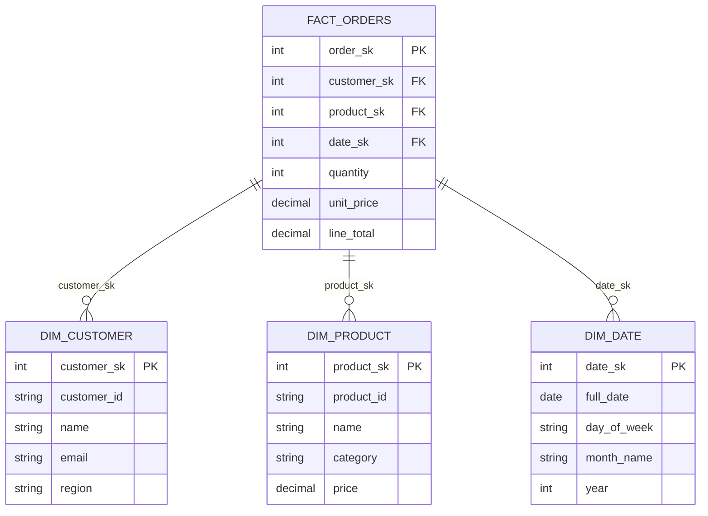

# Introduction to Dimensional Modeling

Welcome to the Odibi dimensional modeling tutorial series. This comprehensive guide will teach you how to build a complete data warehouse using dimensional modeling techniques, from scratch.

**Prerequisites:** Basic SQL knowledge and familiarity with data concepts like tables and columns.

**What You'll Build:** A complete star schema for a retail sales system, plus a semantic layer for business intelligence.

---

## What is Dimensional Modeling?

**Dimensional modeling** is a technique for organizing data to make it easy to query and understand. It was developed by Ralph Kimball and is the foundation of most data warehouses today.

Think of it like organizing a library:
- **Facts** are like the checkout receipts—they record what happened (a book was borrowed)
- **Dimensions** are like the card catalogs—they describe the who, what, where, and when

---

## The Star Schema

The most common dimensional model is the **star schema**, named because it looks like a star when diagrammed:



The **fact table** sits in the center and contains measurements (quantities, amounts, counts). The **dimension tables** surround it and provide context (who bought it, what was purchased, when did it happen).

---

## Facts vs Dimensions: The Grocery Receipt Analogy

Imagine you're at a grocery store and you get a receipt:

```
═══════════════════════════════════════
   FRESH FOODS MARKET
   Store #42 - Downtown
   Date: Jan 15, 2024  Time: 2:34 PM
   Cashier: Maria
═══════════════════════════════════════
   
   Organic Milk 1 gal       $4.99
   Wheat Bread              $3.49
   Bananas 2.5 lb           $1.87
   Cheddar Cheese           $5.99
   
   ─────────────────────────────────────
   SUBTOTAL                $16.34
   TAX                      $0.82
   TOTAL                   $17.16
   
   Paid: VISA ****1234
   
   Thank you for shopping with us!
═══════════════════════════════════════
```

**Facts (the measurements):**
- Quantity of each item
- Price of each item
- Total amount

**Dimensions (the context):**
- **Who:** The customer (you)
- **What:** The products (milk, bread, bananas, cheese)
- **Where:** The store (#42, Downtown)
- **When:** The date and time
- **How:** The payment method (VISA)

In a data warehouse, we'd model this as:

| Concept | Fact or Dimension? | Example Columns |
|---------|-------------------|-----------------|
| The line items | **Fact** | quantity, unit_price, line_total |
| The customer | **Dimension** | name, email, loyalty_tier |
| The product | **Dimension** | product_name, category, brand |
| The store | **Dimension** | store_name, city, region |
| The date | **Dimension** | day_of_week, month, year |

---

## Why Surrogate Keys?

You might wonder: *"If customers already have a customer_id, why do we need another key?"*

Good question! Here's why we use **surrogate keys** (like `customer_sk`) instead of natural keys (like `customer_id`):

### Problem 1: Business Keys Change

Imagine your source system uses email as the customer identifier. What happens when a customer changes their email?

**Using natural key (email):**
```sql
-- Old orders are orphaned!
SELECT * FROM orders WHERE customer_email = 'alice@oldmail.com';  -- No longer exists
SELECT * FROM customers WHERE email = 'alice@oldmail.com';        -- Record was updated to new email
```

**Using surrogate key:**
```sql
-- Customer SK never changes, even if email does
SELECT * FROM fact_orders WHERE customer_sk = 42;     -- Still works!
SELECT * FROM dim_customer WHERE customer_sk = 42;    -- Returns current info
```

### Problem 2: Tracking History (SCD Type 2)

When you need to track historical changes, surrogate keys become essential:

**Customer Data Over Time:**

| customer_sk | customer_id | email | valid_from | valid_to | is_current |
|-------------|-------------|-------|------------|----------|------------|
| 42 | C001 | alice@oldmail.com | 2023-01-01 | 2024-01-15 | false |
| 157 | C001 | alice@newmail.com | 2024-01-15 | NULL | true |

The same customer (C001) has two dimension rows with different surrogate keys. Orders placed before Jan 15 link to SK=42 (capturing the email at that time). Orders after link to SK=157.

### Problem 3: Performance

- Surrogate keys are simple integers (4 bytes)
- Natural keys can be long strings (variable length)
- Integer joins are much faster than string joins

### Problem 4: Multi-Source Integration

When combining data from multiple systems:

| Source System | Customer ID |
|---------------|-------------|
| CRM | CUST-00042 |
| E-commerce | user_42 |
| Support | 42 |

With surrogate keys, all three become customer_sk = 42, regardless of source format.

---

## The Unknown Member Problem

What happens when a fact record references a dimension that doesn't exist?

**Scenario:** An order arrives with `customer_id = 'C999'`, but there's no customer with that ID in the dimension table.

**Without unknown member:**
```sql
-- This join loses the order entirely!
SELECT o.*, c.name
FROM fact_orders o
JOIN dim_customer c ON o.customer_sk = c.customer_sk
WHERE o.order_id = 'ORD999';
-- Returns: (no rows)
```

**With unknown member (customer_sk = 0):**

| customer_sk | customer_id | name | email |
|-------------|-------------|------|-------|
| 0 | -1 | Unknown | Unknown |
| 1 | C001 | Alice Johnson | alice@example.com |
| 2 | C002 | Bob Smith | bob@example.com |

Now orphan orders get assigned to customer_sk = 0:

```sql
SELECT o.*, c.name
FROM fact_orders o
JOIN dim_customer c ON o.customer_sk = c.customer_sk
WHERE o.order_id = 'ORD999';
-- Returns: order data with name = 'Unknown'
```

The order isn't lost—it's explicitly marked as having an unknown customer, which you can investigate later.

---

## SCD Types: Handling Changes

When dimension data changes, how should you handle it? There are three common strategies:

### SCD Type 0: Never Update

The dimension never changes after initial load. Use for truly static data.

**Example:** ISO country codes, fixed reference data

| country_sk | country_code | country_name |
|------------|--------------|--------------|
| 1 | USA | United States |
| 2 | CAN | Canada |

### SCD Type 1: Overwrite

Update the dimension in place. History is lost, but you always see current data.

**Example:** Customer email (you only care about current contact info)

**Before:**

| customer_sk | customer_id | email |
|-------------|-------------|-------|
| 1 | C001 | alice@oldmail.com |

**After (email changed):**

| customer_sk | customer_id | email |
|-------------|-------------|-------|
| 1 | C001 | alice@newmail.com |

### SCD Type 2: Track History

Create a new row for each version. Full audit trail preserved.

**Example:** Customer address (for accurate point-in-time reporting)

**Before:**

| customer_sk | customer_id | city | valid_from | valid_to | is_current |
|-------------|-------------|------|------------|----------|------------|
| 1 | C001 | Chicago | 2020-01-01 | NULL | true |

**After (customer moved):**

| customer_sk | customer_id | city | valid_from | valid_to | is_current |
|-------------|-------------|------|------------|----------|------------|
| 1 | C001 | Chicago | 2020-01-01 | 2024-01-15 | false |
| 42 | C001 | Seattle | 2024-01-15 | NULL | true |

---

## What You'll Build in This Tutorial Series

By the end of this series, you'll have built:

### Part 1: Dimensional Modeling Foundations
1. **Introduction** (this tutorial) - Core concepts
2. **Dimension Pattern** - Build customer dimension with SCD 0/1/2
3. **Date Dimension Pattern** - Generate complete date dimension
4. **Fact Pattern** - Build fact table with SK lookups
5. **Aggregation Pattern** - Build pre-aggregated tables
6. **Full Star Schema** - Complete working example

### Part 2: Semantic Layer
7. **Semantic Layer Intro** - What and why
8. **Defining Metrics** - Revenue, counts, averages
9. **Defining Dimensions** - Regions, dates, hierarchies
10. **Querying Metrics** - "revenue BY region" syntax
11. **Materializing Metrics** - Pre-compute for dashboards
12. **Semantic Full Example** - Complete semantic layer

### Part 3: Data Quality
13. **FK Validation** - Ensure referential integrity

---

## Sample Data

Throughout these tutorials, we'll use consistent sample data representing a retail business:

### Customers (12 rows)

| customer_id | name | email | region | city |
|-------------|------|-------|--------|------|
| C001 | Alice Johnson | alice@example.com | North | Chicago |
| C002 | Bob Smith | bob@example.com | South | Houston |
| C003 | Carol White | carol@example.com | North | Detroit |
| C004 | David Brown | david@example.com | East | New York |
| C005 | Emma Davis | emma@example.com | West | Seattle |
| C006 | Frank Miller | frank@example.com | South | Miami |
| C007 | Grace Lee | grace@example.com | East | Boston |
| C008 | Henry Wilson | henry@example.com | West | Portland |
| C009 | Ivy Chen | ivy@example.com | North | Minneapolis |
| C010 | Jack Taylor | jack@example.com | South | Dallas |
| C011 | Karen Martinez | karen@example.com | East | Philadelphia |
| C012 | Leo Anderson | leo@example.com | West | Denver |

### Products (10 rows)

| product_id | name | category | price |
|------------|------|----------|-------|
| P001 | Laptop Pro 15 | Electronics | $1,299.99 |
| P002 | Wireless Mouse | Electronics | $29.99 |
| P003 | Office Chair | Furniture | $249.99 |
| P004 | USB-C Hub | Electronics | $49.99 |
| P005 | Standing Desk | Furniture | $599.99 |
| P006 | Mechanical Keyboard | Electronics | $149.99 |
| P007 | Monitor 27" | Electronics | $399.99 |
| P008 | Desk Lamp | Furniture | $45.99 |
| P009 | Webcam HD | Electronics | $79.99 |
| P010 | Filing Cabinet | Furniture | $189.99 |

### Orders (30 rows across 14 days)

Sample orders spanning January 15-28, 2024, with various quantities and statuses.

---

## What You Learned

In this introduction, you learned:

- **Dimensional modeling** organizes data into facts and dimensions
- **Star schemas** put the fact table in the center, surrounded by dimensions
- **Facts** contain measurements (quantities, amounts)
- **Dimensions** provide context (who, what, where, when)
- **Surrogate keys** solve problems with changing business keys and enable history tracking
- **Unknown members** prevent orphan records from being lost
- **SCD Types** define how to handle dimension changes (0=static, 1=overwrite, 2=history)

---

## Next Steps

Ready to build your first dimension table?

**Next:** [Dimension Pattern Tutorial](./02_dimension_pattern.md) - Build a customer dimension with SCD support

---

## Navigation

| Previous | Up | Next |
|----------|----|----|
| - | [Tutorials](../getting_started.md) | [Dimension Pattern](./02_dimension_pattern.md) |
