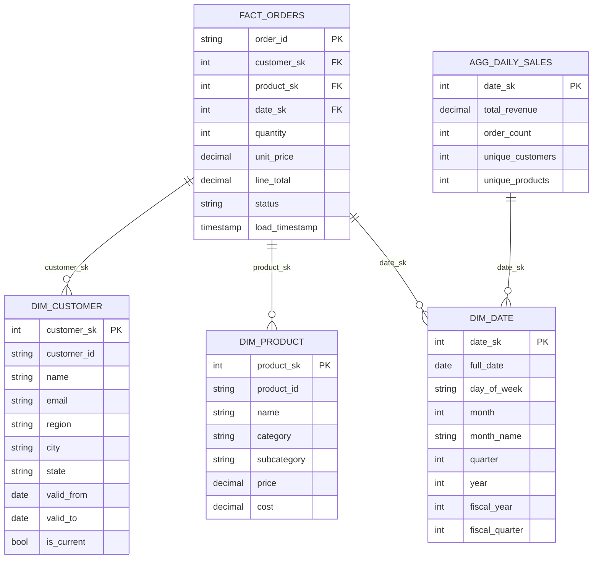
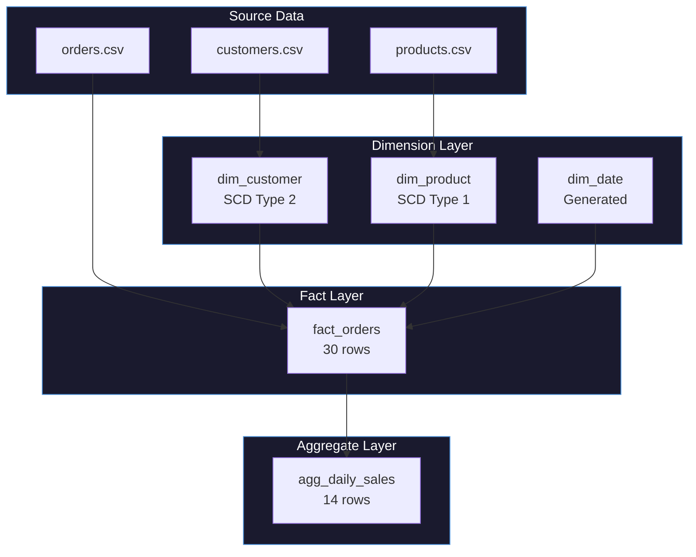

# Full Star Schema Tutorial

In this tutorial, you'll build a complete star schema from start to finish, combining all the patterns from previous tutorials into a single, cohesive data warehouse.

**What You'll Build:**
- `dim_customer` - Customer dimension (SCD2)
- `dim_product` - Product dimension (SCD1)
- `dim_date` - Date dimension (generated)
- `fact_orders` - Orders fact table
- `agg_daily_sales` - Daily sales aggregate

---

## The Complete Star Schema



---

## Source Data Files

All source data is in `examples/tutorials/dimensional_modeling/data/`:

### customers.csv (12 rows)

| customer_id | name | email | region | city | state |
|-------------|------|-------|--------|------|-------|
| C001 | Alice Johnson | alice@example.com | North | Chicago | IL |
| C002 | Bob Smith | bob@example.com | South | Houston | TX |
| C003 | Carol White | carol@example.com | North | Detroit | MI |
| C004 | David Brown | david@example.com | East | New York | NY |
| C005 | Emma Davis | emma@example.com | West | Seattle | WA |
| C006 | Frank Miller | frank@example.com | South | Miami | FL |
| C007 | Grace Lee | grace@example.com | East | Boston | MA |
| C008 | Henry Wilson | henry@example.com | West | Portland | OR |
| C009 | Ivy Chen | ivy@example.com | North | Minneapolis | MN |
| C010 | Jack Taylor | jack@example.com | South | Dallas | TX |
| C011 | Karen Martinez | karen@example.com | East | Philadelphia | PA |
| C012 | Leo Anderson | leo@example.com | West | Denver | CO |

### products.csv (10 rows)

| product_id | name | category | subcategory | price | cost |
|------------|------|----------|-------------|-------|------|
| P001 | Laptop Pro 15 | Electronics | Computers | 1299.99 | 850.00 |
| P002 | Wireless Mouse | Electronics | Accessories | 29.99 | 12.00 |
| P003 | Office Chair | Furniture | Seating | 249.99 | 120.00 |
| P004 | USB-C Hub | Electronics | Accessories | 49.99 | 22.00 |
| P005 | Standing Desk | Furniture | Desks | 599.99 | 320.00 |
| P006 | Mechanical Keyboard | Electronics | Accessories | 149.99 | 65.00 |
| P007 | Monitor 27" | Electronics | Displays | 399.99 | 210.00 |
| P008 | Desk Lamp | Furniture | Lighting | 45.99 | 18.00 |
| P009 | Webcam HD | Electronics | Accessories | 79.99 | 35.00 |
| P010 | Filing Cabinet | Furniture | Storage | 189.99 | 95.00 |

### orders.csv (30 rows)

| order_id | customer_id | product_id | order_date | quantity | unit_price | status |
|----------|-------------|------------|------------|----------|------------|--------|
| ORD001 | C001 | P001 | 2024-01-15 | 1 | 1299.99 | completed |
| ORD002 | C001 | P002 | 2024-01-15 | 2 | 29.99 | completed |
| ORD003 | C002 | P003 | 2024-01-16 | 1 | 249.99 | completed |
| ORD004 | C003 | P004 | 2024-01-16 | 3 | 49.99 | completed |
| ORD005 | C004 | P005 | 2024-01-17 | 1 | 599.99 | completed |
| ORD006 | C005 | P006 | 2024-01-17 | 1 | 149.99 | completed |
| ORD007 | C006 | P007 | 2024-01-18 | 2 | 399.99 | completed |
| ORD008 | C007 | P008 | 2024-01-18 | 4 | 45.99 | completed |
| ORD009 | C008 | P009 | 2024-01-19 | 1 | 79.99 | completed |
| ORD010 | C009 | P010 | 2024-01-19 | 1 | 189.99 | completed |
| ORD011 | C010 | P001 | 2024-01-20 | 1 | 1299.99 | completed |
| ORD012 | C011 | P002 | 2024-01-20 | 5 | 29.99 | completed |
| ORD013 | C012 | P003 | 2024-01-21 | 2 | 249.99 | completed |
| ORD014 | C001 | P004 | 2024-01-21 | 1 | 49.99 | completed |
| ORD015 | C002 | P005 | 2024-01-22 | 1 | 599.99 | pending |
| ORD016 | C003 | P006 | 2024-01-22 | 2 | 149.99 | completed |
| ORD017 | C004 | P007 | 2024-01-23 | 1 | 399.99 | completed |
| ORD018 | C005 | P008 | 2024-01-23 | 3 | 45.99 | completed |
| ORD019 | C006 | P009 | 2024-01-24 | 2 | 79.99 | completed |
| ORD020 | C007 | P010 | 2024-01-24 | 1 | 189.99 | completed |
| ORD021 | C008 | P001 | 2024-01-25 | 1 | 1299.99 | completed |
| ORD022 | C009 | P002 | 2024-01-25 | 3 | 29.99 | completed |
| ORD023 | C010 | P003 | 2024-01-26 | 1 | 249.99 | cancelled |
| ORD024 | C011 | P004 | 2024-01-26 | 2 | 49.99 | completed |
| ORD025 | C012 | P005 | 2024-01-27 | 1 | 599.99 | completed |
| ORD026 | C001 | P006 | 2024-01-27 | 1 | 149.99 | completed |
| ORD027 | C002 | P007 | 2024-01-28 | 1 | 399.99 | completed |
| ORD028 | C003 | P008 | 2024-01-28 | 2 | 45.99 | completed |
| ORD029 | C004 | P009 | 2024-01-15 | 1 | 79.99 | completed |
| ORD030 | C005 | P010 | 2024-01-16 | 1 | 189.99 | completed |

---

## Complete YAML Configuration

Here's the full pipeline that builds everything:

```yaml
# File: examples/tutorials/dimensional_modeling/star_schema.yaml
project: retail_star_schema
engine: pandas

connections:
  source:
    type: file
    path: ./examples/tutorials/dimensional_modeling/data
  warehouse:
    type: file
    path: ./warehouse

story:
  connection: warehouse
  path: stories

system:
  connection: warehouse
  path: _system_catalog

pipelines:
  # ==========================================
  # PIPELINE 1: Build all dimensions
  # ==========================================
  - pipeline: build_dimensions
    description: "Build customer, product, and date dimensions"
    nodes:
      # ------------------------------------------
      # Customer Dimension (SCD Type 2)
      # ------------------------------------------
      - name: dim_customer
        description: "Customer dimension with full history tracking"
        read:
          connection: source
          path: customers.csv
          format: csv
        
        pattern:
          type: dimension
          params:
            natural_key: customer_id
            surrogate_key: customer_sk
            scd_type: 2
            track_cols:
              - name
              - email
              - region
              - city
              - state
            target: warehouse.dim_customer
            valid_from_col: valid_from
            valid_to_col: valid_to
            is_current_col: is_current
            unknown_member: true
            audit:
              load_timestamp: true
              source_system: "crm"
        
        write:
          connection: warehouse
          path: dim_customer
          format: parquet
          mode: overwrite
      
      # ------------------------------------------
      # Product Dimension (SCD Type 1)
      # ------------------------------------------
      - name: dim_product
        description: "Product dimension with overwrite updates"
        read:
          connection: source
          path: products.csv
          format: csv
        
        pattern:
          type: dimension
          params:
            natural_key: product_id
            surrogate_key: product_sk
            scd_type: 1
            track_cols:
              - name
              - category
              - subcategory
              - price
              - cost
            target: warehouse.dim_product
            unknown_member: true
            audit:
              load_timestamp: true
              source_system: "inventory"
        
        write:
          connection: warehouse
          path: dim_product
          format: parquet
          mode: overwrite
      
      # ------------------------------------------
      # Date Dimension (Generated)
      # ------------------------------------------
      - name: dim_date
        description: "Date dimension covering Jan 2024"
        pattern:
          type: date_dimension
          params:
            start_date: "2024-01-01"
            end_date: "2024-01-31"
            fiscal_year_start_month: 7
            unknown_member: true
        
        write:
          connection: warehouse
          path: dim_date
          format: parquet
          mode: overwrite

  # ==========================================
  # PIPELINE 2: Build fact tables
  # ==========================================
  - pipeline: build_facts
    description: "Build fact_orders with SK lookups"
    nodes:
      # Load dimensions into context
      - name: dim_customer
        read:
          connection: warehouse
          path: dim_customer
          format: parquet
      
      - name: dim_product
        read:
          connection: warehouse
          path: dim_product
          format: parquet
      
      - name: dim_date
        read:
          connection: warehouse
          path: dim_date
          format: parquet
      
      # ------------------------------------------
      # Orders Fact Table
      # ------------------------------------------
      - name: fact_orders
        description: "Orders fact with all dimension lookups"
        depends_on: [dim_customer, dim_product, dim_date]
        read:
          connection: source
          path: orders.csv
          format: csv
        
        pattern:
          type: fact
          params:
            grain: [order_id]
            dimensions:
              - source_column: customer_id
                dimension_table: dim_customer
                dimension_key: customer_id
                surrogate_key: customer_sk
                scd2: true
              - source_column: product_id
                dimension_table: dim_product
                dimension_key: product_id
                surrogate_key: product_sk
              - source_column: order_date
                dimension_table: dim_date
                dimension_key: full_date
                surrogate_key: date_sk
            orphan_handling: unknown
            measures:
              - quantity
              - unit_price
              - line_total: "quantity * unit_price"
            audit:
              load_timestamp: true
              source_system: "pos"
        
        write:
          connection: warehouse
          path: fact_orders
          format: parquet
          mode: overwrite

  # ==========================================
  # PIPELINE 3: Build aggregates
  # ==========================================
  - pipeline: build_aggregates
    description: "Build daily sales aggregate"
    nodes:
      # ------------------------------------------
      # Daily Sales Aggregate
      # ------------------------------------------
      - name: agg_daily_sales
        description: "Daily sales summary"
        read:
          connection: warehouse
          path: fact_orders
          format: parquet
        
        pattern:
          type: aggregation
          params:
            grain: [date_sk]
            measures:
              - name: total_revenue
                expr: "SUM(line_total)"
              - name: order_count
                expr: "COUNT(*)"
              - name: unique_customers
                expr: "COUNT(DISTINCT customer_sk)"
              - name: unique_products
                expr: "COUNT(DISTINCT product_sk)"
              - name: avg_order_value
                expr: "AVG(line_total)"
            audit:
              load_timestamp: true
        
        write:
          connection: warehouse
          path: agg_daily_sales
          format: parquet
          mode: overwrite
```

---

## Running the Pipeline

Run the pipelines in order:

```bash
# Build dimensions first
odibi run --config star_schema.yaml --pipeline build_dimensions

# Then build facts (requires dimensions)
odibi run --config star_schema.yaml --pipeline build_facts

# Finally build aggregates (requires facts)
odibi run --config star_schema.yaml --pipeline build_aggregates
```

Or run everything:

```bash
odibi run --config star_schema.yaml
```

---

## Final Table Schemas and Sample Data

### dim_customer (13 rows)

**Schema:**

| Column | Type | Description |
|--------|------|-------------|
| customer_sk | int | Surrogate key |
| customer_id | string | Natural key |
| name | string | Customer name |
| email | string | Email address |
| region | string | Geographic region |
| city | string | City |
| state | string | State code |
| valid_from | timestamp | Version start date |
| valid_to | timestamp | Version end date (NULL if current) |
| is_current | boolean | Current version flag |
| load_timestamp | timestamp | ETL load time |
| source_system | string | Source system name |

**Sample Data (13 rows):**

| customer_sk | customer_id | name | email | region | city | is_current |
|-------------|-------------|------|-------|--------|------|------------|
| 0 | -1 | Unknown | Unknown | Unknown | Unknown | true |
| 1 | C001 | Alice Johnson | alice@example.com | North | Chicago | true |
| 2 | C002 | Bob Smith | bob@example.com | South | Houston | true |
| 3 | C003 | Carol White | carol@example.com | North | Detroit | true |
| 4 | C004 | David Brown | david@example.com | East | New York | true |
| 5 | C005 | Emma Davis | emma@example.com | West | Seattle | true |
| 6 | C006 | Frank Miller | frank@example.com | South | Miami | true |
| 7 | C007 | Grace Lee | grace@example.com | East | Boston | true |
| 8 | C008 | Henry Wilson | henry@example.com | West | Portland | true |
| 9 | C009 | Ivy Chen | ivy@example.com | North | Minneapolis | true |
| 10 | C010 | Jack Taylor | jack@example.com | South | Dallas | true |
| 11 | C011 | Karen Martinez | karen@example.com | East | Philadelphia | true |
| 12 | C012 | Leo Anderson | leo@example.com | West | Denver | true |

### dim_product (11 rows)

**Schema:**

| Column | Type | Description |
|--------|------|-------------|
| product_sk | int | Surrogate key |
| product_id | string | Natural key |
| name | string | Product name |
| category | string | Product category |
| subcategory | string | Product subcategory |
| price | decimal | List price |
| cost | decimal | Unit cost |
| load_timestamp | timestamp | ETL load time |
| source_system | string | Source system name |

**Sample Data (11 rows):**

| product_sk | product_id | name | category | subcategory | price | cost |
|------------|------------|------|----------|-------------|-------|------|
| 0 | -1 | Unknown | Unknown | Unknown | 0.00 | 0.00 |
| 1 | P001 | Laptop Pro 15 | Electronics | Computers | 1299.99 | 850.00 |
| 2 | P002 | Wireless Mouse | Electronics | Accessories | 29.99 | 12.00 |
| 3 | P003 | Office Chair | Furniture | Seating | 249.99 | 120.00 |
| 4 | P004 | USB-C Hub | Electronics | Accessories | 49.99 | 22.00 |
| 5 | P005 | Standing Desk | Furniture | Desks | 599.99 | 320.00 |
| 6 | P006 | Mechanical Keyboard | Electronics | Accessories | 149.99 | 65.00 |
| 7 | P007 | Monitor 27" | Electronics | Displays | 399.99 | 210.00 |
| 8 | P008 | Desk Lamp | Furniture | Lighting | 45.99 | 18.00 |
| 9 | P009 | Webcam HD | Electronics | Accessories | 79.99 | 35.00 |
| 10 | P010 | Filing Cabinet | Furniture | Storage | 189.99 | 95.00 |

### dim_date (32 rows for January + unknown)

**Sample Data (first 15 rows):**

| date_sk | full_date | day_of_week | month_name | quarter_name | year | fiscal_year | fiscal_quarter |
|---------|-----------|-------------|------------|--------------|------|-------------|----------------|
| 0 | 1900-01-01 | Unknown | Unknown | Unknown | 0 | 0 | 0 |
| 20240101 | 2024-01-01 | Monday | January | Q1 | 2024 | 2024 | 3 |
| 20240102 | 2024-01-02 | Tuesday | January | Q1 | 2024 | 2024 | 3 |
| 20240103 | 2024-01-03 | Wednesday | January | Q1 | 2024 | 2024 | 3 |
| 20240104 | 2024-01-04 | Thursday | January | Q1 | 2024 | 2024 | 3 |
| 20240105 | 2024-01-05 | Friday | January | Q1 | 2024 | 2024 | 3 |
| 20240106 | 2024-01-06 | Saturday | January | Q1 | 2024 | 2024 | 3 |
| 20240107 | 2024-01-07 | Sunday | January | Q1 | 2024 | 2024 | 3 |
| 20240108 | 2024-01-08 | Monday | January | Q1 | 2024 | 2024 | 3 |
| 20240109 | 2024-01-09 | Tuesday | January | Q1 | 2024 | 2024 | 3 |
| 20240110 | 2024-01-10 | Wednesday | January | Q1 | 2024 | 2024 | 3 |
| 20240111 | 2024-01-11 | Thursday | January | Q1 | 2024 | 2024 | 3 |
| 20240112 | 2024-01-12 | Friday | January | Q1 | 2024 | 2024 | 3 |
| 20240113 | 2024-01-13 | Saturday | January | Q1 | 2024 | 2024 | 3 |
| 20240114 | 2024-01-14 | Sunday | January | Q1 | 2024 | 2024 | 3 |

### fact_orders (30 rows)

**Schema:**

| Column | Type | Description |
|--------|------|-------------|
| order_id | string | Order identifier (grain) |
| customer_sk | int | Customer surrogate key |
| product_sk | int | Product surrogate key |
| date_sk | int | Date surrogate key |
| quantity | int | Quantity ordered |
| unit_price | decimal | Price per unit |
| line_total | decimal | Calculated: quantity × unit_price |
| status | string | Order status |
| load_timestamp | timestamp | ETL load time |
| source_system | string | Source system name |

**Sample Data (first 15 rows):**

| order_id | customer_sk | product_sk | date_sk | quantity | unit_price | line_total | status |
|----------|-------------|------------|---------|----------|------------|------------|--------|
| ORD001 | 1 | 1 | 20240115 | 1 | 1299.99 | 1299.99 | completed |
| ORD002 | 1 | 2 | 20240115 | 2 | 29.99 | 59.98 | completed |
| ORD003 | 2 | 3 | 20240116 | 1 | 249.99 | 249.99 | completed |
| ORD004 | 3 | 4 | 20240116 | 3 | 49.99 | 149.97 | completed |
| ORD005 | 4 | 5 | 20240117 | 1 | 599.99 | 599.99 | completed |
| ORD006 | 5 | 6 | 20240117 | 1 | 149.99 | 149.99 | completed |
| ORD007 | 6 | 7 | 20240118 | 2 | 399.99 | 799.98 | completed |
| ORD008 | 7 | 8 | 20240118 | 4 | 45.99 | 183.96 | completed |
| ORD009 | 8 | 9 | 20240119 | 1 | 79.99 | 79.99 | completed |
| ORD010 | 9 | 10 | 20240119 | 1 | 189.99 | 189.99 | completed |
| ORD011 | 10 | 1 | 20240120 | 1 | 1299.99 | 1299.99 | completed |
| ORD012 | 11 | 2 | 20240120 | 5 | 29.99 | 149.95 | completed |
| ORD013 | 12 | 3 | 20240121 | 2 | 249.99 | 499.98 | completed |
| ORD014 | 1 | 4 | 20240121 | 1 | 49.99 | 49.99 | completed |
| ORD015 | 2 | 5 | 20240122 | 1 | 599.99 | 599.99 | pending |

### agg_daily_sales (14 rows)

**Sample Data (all 14 rows):**

| date_sk | total_revenue | order_count | unique_customers | unique_products | avg_order_value |
|---------|---------------|-------------|------------------|-----------------|-----------------|
| 20240115 | 1439.96 | 3 | 2 | 3 | 479.99 |
| 20240116 | 589.95 | 3 | 3 | 3 | 196.65 |
| 20240117 | 749.98 | 2 | 2 | 2 | 374.99 |
| 20240118 | 983.94 | 2 | 2 | 2 | 491.97 |
| 20240119 | 269.98 | 2 | 2 | 2 | 134.99 |
| 20240120 | 1449.94 | 2 | 2 | 2 | 724.97 |
| 20240121 | 549.97 | 2 | 2 | 2 | 274.99 |
| 20240122 | 899.97 | 2 | 2 | 2 | 449.99 |
| 20240123 | 537.96 | 2 | 2 | 2 | 268.98 |
| 20240124 | 349.97 | 2 | 2 | 2 | 174.99 |
| 20240125 | 1389.96 | 2 | 2 | 2 | 694.98 |
| 20240126 | 349.97 | 2 | 2 | 2 | 174.99 |
| 20240127 | 749.98 | 2 | 2 | 2 | 374.99 |
| 20240128 | 491.97 | 2 | 2 | 2 | 245.99 |

---

## Sample Analytical Queries

### Revenue by Region

```sql
SELECT 
    c.region,
    COUNT(DISTINCT f.order_id) AS orders,
    SUM(f.line_total) AS revenue
FROM fact_orders f
JOIN dim_customer c ON f.customer_sk = c.customer_sk
WHERE c.is_current = true
GROUP BY c.region
ORDER BY revenue DESC;
```

| region | orders | revenue |
|--------|--------|---------|
| North | 8 | 2,599.87 |
| West | 7 | 2,629.88 |
| South | 7 | 2,449.92 |
| East | 8 | 2,023.87 |

### Revenue by Category

```sql
SELECT 
    p.category,
    COUNT(*) AS orders,
    SUM(f.line_total) AS revenue,
    AVG(f.line_total) AS avg_order
FROM fact_orders f
JOIN dim_product p ON f.product_sk = p.product_sk
GROUP BY p.category
ORDER BY revenue DESC;
```

| category | orders | revenue | avg_order |
|----------|--------|---------|-----------|
| Electronics | 18 | 6,619.63 | 367.76 |
| Furniture | 12 | 3,183.91 | 265.33 |

### Daily Trend with Day of Week

```sql
SELECT 
    d.full_date,
    d.day_of_week,
    a.total_revenue,
    a.order_count
FROM agg_daily_sales a
JOIN dim_date d ON a.date_sk = d.date_sk
ORDER BY a.date_sk;
```

### Top Customers

```sql
SELECT 
    c.name,
    c.region,
    COUNT(*) AS orders,
    SUM(f.line_total) AS total_spent
FROM fact_orders f
JOIN dim_customer c ON f.customer_sk = c.customer_sk
WHERE c.is_current = true
GROUP BY c.customer_sk, c.name, c.region
ORDER BY total_spent DESC
LIMIT 5;
```

| name | region | orders | total_spent |
|------|--------|--------|-------------|
| Alice Johnson | North | 4 | 1,559.95 |
| Bob Smith | South | 3 | 1,049.97 |
| Carol White | North | 3 | 541.93 |
| David Brown | East | 3 | 1,079.97 |
| Emma Davis | West | 3 | 477.97 |

---

## Data Flow Diagram



---

## What You Learned

In this tutorial, you learned:

- How to **combine all patterns** into a complete star schema
- The **order of operations**: dimensions first, then facts, then aggregates
- How to **organize pipelines** for maintainability
- **Pipeline dependencies** using `depends_on`
- How to **query the completed star schema** for analytics

---

## Congratulations!

You've built a complete dimensional data warehouse! This foundation can scale to handle millions of rows and complex business requirements.

---

## Next Steps

Now that you have a working star schema, let's add a semantic layer to make querying even easier.

**Next:** [Semantic Layer Introduction](./07_semantic_layer_intro.md)

---

## Navigation

| Previous | Up | Next |
|----------|----|----|
| [Aggregation Pattern](./05_aggregation_pattern.md) | [Tutorials](../getting_started.md) | [Semantic Layer Intro](./07_semantic_layer_intro.md) |
