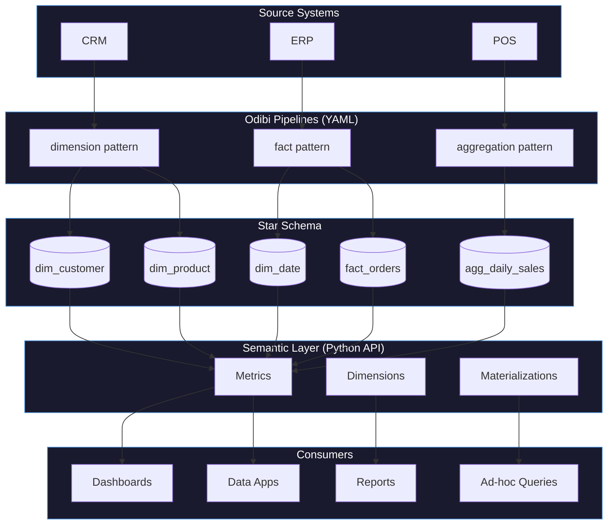
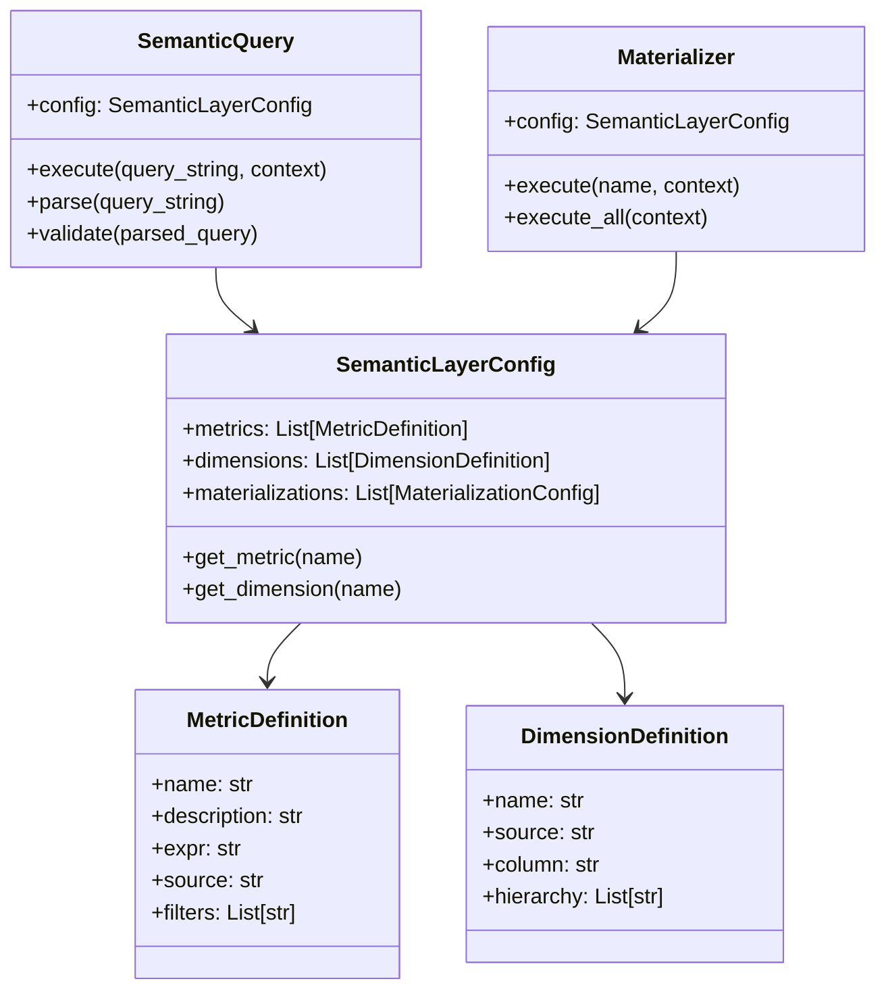

# Semantic Layer Introduction

In this tutorial, you'll learn what a semantic layer is, why it's valuable, and how it sits on top of your star schema to provide a business-friendly query interface.

**What You'll Learn:**
- What is a semantic layer?
- Why not just write SQL?
- Metrics, dimensions, and materializations
- When to use pipelines vs semantic layer

---

## What is a Semantic Layer?

A **semantic layer** is a translation layer between your raw data and your business users. It defines business concepts (like "revenue" or "active customers") once, and lets everyone query them consistently.

Think of it like a glossary for your data:

| Business Term | Technical Definition |
|---------------|---------------------|
| Revenue | `SUM(line_total)` from `fact_orders` where `status = 'completed'` |
| Order Count | `COUNT(*)` from `fact_orders` |
| Active Customer | Customer with order in last 90 days |
| North Region | `region = 'North'` in `dim_customer` |

Without a semantic layer, everyone writes their own SQL—and everyone might calculate "revenue" differently.

---

## The Problem: Inconsistent Definitions

### Without Semantic Layer

**Marketing team:**
```sql
-- "Revenue" = all orders
SELECT SUM(line_total) AS revenue FROM fact_orders;
-- Result: $9,803.54
```

**Finance team:**
```sql
-- "Revenue" = only completed orders
SELECT SUM(line_total) AS revenue 
FROM fact_orders 
WHERE status = 'completed';
-- Result: $8,953.56
```

**Executive dashboard:**
```sql
-- "Revenue" = completed orders, excluding discounts
SELECT SUM(line_total * 0.95) AS revenue 
FROM fact_orders 
WHERE status = 'completed';
-- Result: $8,505.88
```

**Result:** Three different "revenue" numbers in the same meeting. Chaos.

### With Semantic Layer

```python
# Everyone uses the same metric definition
result = query.execute("revenue", context)
# Result: $8,953.56 (always)
```

The semantic layer enforces a single, governed definition of "revenue."

---

## Why Not Just Write SQL?

SQL is powerful, but it has limitations for business users:

| Challenge | Without Semantic Layer | With Semantic Layer |
|-----------|----------------------|---------------------|
| **Complex joins** | Users must know table relationships | Automatic join handling |
| **Consistent definitions** | Everyone writes their own | Define once, use everywhere |
| **Filter logic** | Repeated in every query | Embedded in metric definition |
| **Aggregation errors** | Easy to make mistakes | Pre-validated expressions |
| **Self-service** | Requires SQL expertise | Business-friendly syntax |
| **Governance** | No central control | Single source of truth |

---

## How the Semantic Layer Fits

The semantic layer sits on top of your star schema:



**Odibi Pipelines** build the data (dimensions, facts, aggregates).
**Semantic Layer** defines how to query the data (metrics, dimensions, materializations).

---

## Core Concepts

### Metrics

A **metric** is a measurable value that can be aggregated. It answers "how much?" or "how many?"

```yaml
metrics:
  - name: revenue
    description: "Total revenue from completed orders"
    expr: "SUM(line_total)"
    source: fact_orders
    filters:
      - "status = 'completed'"
```

Examples:
- Revenue (`SUM(line_total)`)
- Order Count (`COUNT(*)`)
- Average Order Value (`AVG(line_total)`)
- Unique Customers (`COUNT(DISTINCT customer_sk)`)

### Dimensions

A **dimension** is an attribute for grouping and filtering. It answers "by what?" or "for what?"

```yaml
dimensions:
  - name: region
    source: dim_customer
    column: region
```

Examples:
- Region (North, South, East, West)
- Category (Electronics, Furniture)
- Month (January, February, ...)
- Day of Week (Monday, Tuesday, ...)

### Materializations

A **materialization** pre-computes metrics at a specific grain and saves them to a table. It answers "what should be pre-calculated for dashboards?"

```yaml
materializations:
  - name: monthly_revenue_by_region
    metrics: [revenue, order_count]
    dimensions: [region, month]
    output: gold/agg_monthly_revenue
    schedule: "0 2 1 * *"  # Monthly
```

---

## When to Use What

| Task | Solution |
|------|----------|
| Build dimension tables from source | Odibi Pipeline: `dimension` pattern |
| Build fact tables from source | Odibi Pipeline: `fact` pattern |
| Build scheduled aggregates | Odibi Pipeline: `aggregation` pattern |
| Ad-hoc metric queries | Semantic Layer: `SemanticQuery` |
| Self-service analytics | Semantic Layer with dimensions |
| Dashboard metrics | Semantic Layer: `Materializer` |

### Pipelines vs Semantic Layer

**Use Pipelines when:**
- Building the star schema from source data
- Scheduled ETL/ELT processes
- Transforming and cleaning data
- Generating surrogate keys

**Use Semantic Layer when:**
- Defining business metrics consistently
- Enabling self-service analytics
- Pre-computing dashboard metrics
- Creating a governed metric catalog

---

## Unified Project API (Recommended)

The simplest way to use the semantic layer is through the unified `Project` API. This connects your pipelines and semantic layer seamlessly:

### 1. Add Semantic Config to odibi.yaml

```yaml
# odibi.yaml
project: my_warehouse
engine: pandas

connections:
  gold:
    type: delta
    path: /mnt/data/gold

pipelines:
  - pipeline: build_warehouse
    nodes:
      - name: fact_orders
        write: { connection: gold, table: fact_orders }
      - name: dim_customer
        write: { connection: gold, table: dim_customer }

# Semantic layer at project level
semantic:
  metrics:
    - name: revenue
      expr: "SUM(line_total)"
      source: $build_warehouse.fact_orders    # References node's write target
      filters:
        - "status = 'completed'"
  
  dimensions:
    - name: region
      source: $build_warehouse.dim_customer   # No path duplication!
      column: region
```

### 2. Query with Two Lines of Code

```python
from odibi import Project

project = Project.load("odibi.yaml")
result = project.query("revenue BY region")
print(result.df)
```

That's it! The `Project` class:
- Reads connections and pipelines from your YAML
- Resolves `$build_warehouse.fact_orders` → node's write path
- Auto-loads Delta tables when queried
- No manual `context.register()` calls needed

---

## Manual Approach

If you prefer more control, you can use the semantic layer components directly.

## Example: Revenue Metric

Let's see how a simple metric works:

### 1. Define the Metric

```python
from odibi.semantics import MetricDefinition

revenue = MetricDefinition(
    name="revenue",
    description="Total revenue from completed orders",
    expr="SUM(line_total)",
    source="fact_orders",
    filters=["status = 'completed'"]
)
```

### 2. Create the Config

```python
from odibi.semantics import SemanticLayerConfig, DimensionDefinition

config = SemanticLayerConfig(
    metrics=[revenue],
    dimensions=[
        DimensionDefinition(
            name="region",
            source="dim_customer",
            column="region"
        )
    ]
)
```

### 3. Query the Metric

```python
from odibi.semantics import SemanticQuery

query = SemanticQuery(config)

# Total revenue
result = query.execute("revenue", context)
print(result.df)
# | revenue    |
# |------------|
# | 8,953.56   |

# Revenue by region
result = query.execute("revenue BY region", context)
print(result.df)
# | region | revenue  |
# |--------|----------|
# | North  | 2,549.88 |
# | South  | 2,349.93 |
# | East   | 1,923.88 |
# | West   | 2,129.87 |
```

---

## The Query Syntax

Semantic queries use a simple, business-friendly syntax:

```
metric1, metric2 BY dimension1, dimension2 WHERE condition
```

**Examples:**

| Query | Meaning |
|-------|---------|
| `"revenue"` | Total revenue |
| `"revenue BY region"` | Revenue grouped by region |
| `"revenue, order_count BY region"` | Multiple metrics by region |
| `"revenue BY region, month"` | Revenue by region and month |
| `"revenue BY region WHERE year = 2024"` | Filtered revenue by region |

---

## Benefits Summary

| Benefit | Description |
|---------|-------------|
| **Consistency** | One definition of "revenue" everywhere |
| **Governance** | Central control over metric logic |
| **Self-Service** | Business users query without SQL |
| **Performance** | Pre-computed materializations for dashboards |
| **Discoverability** | Metrics are documented and cataloged |
| **Maintainability** | Change definition once, updates everywhere |

---

## Architecture Overview



---

## What You Learned

In this tutorial, you learned:

- A **semantic layer** translates business concepts into technical queries
- It ensures **consistent definitions** across all users
- **Metrics** are measurable values (SUM, COUNT, AVG)
- **Dimensions** are grouping attributes (region, category, date)
- **Materializations** pre-compute metrics for performance
- Pipelines **build** the data; semantic layer **queries** it
- The query syntax is simple: `"metric BY dimension WHERE filter"`

---

## Next Steps

Now let's learn how to define metrics in detail.

**Next:** [Defining Metrics](./08_defining_metrics.md)

---

## Navigation

| Previous | Up | Next |
|----------|----|----|
| [Full Star Schema](./06_full_star_schema.md) | [Tutorials](../getting_started.md) | [Defining Metrics](./08_defining_metrics.md) |

---

## Reference

For complete documentation, see: [Semantic Layer Overview](../../semantics/index.md)
