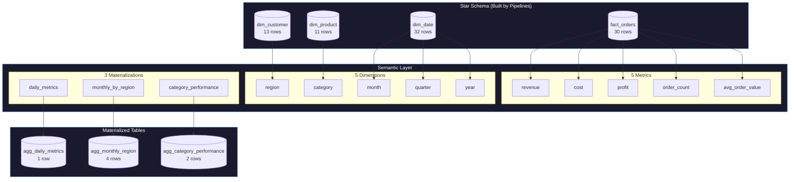

# Semantic Layer Full Example

This tutorial brings together everything you've learned about the semantic layer into a complete, end-to-end example.

**What You'll See:**
- Complete semantic config (5 metrics, 5 dimensions, 3 materializations)
- **Unified Project API** (simplest approach)
- Full Python script that loads data, queries metrics, and materializes results
- All output tables with sample data

---

## Option A: Unified Project API (Recommended)

The simplest way to use the semantic layer is with the unified `Project` API:

### odibi.yaml with Semantic Layer

```yaml
# odibi.yaml
project: retail_warehouse
engine: pandas

connections:
  gold:
    type: delta
    path: /mnt/data/gold

pipelines:
  - pipeline: build_warehouse
    nodes:
      - name: fact_orders
        write: { connection: gold, table: fact_orders }
      - name: dim_customer
        write: { connection: gold, table: dim_customer }
      - name: dim_product
        write: { connection: gold, table: dim_product }
      - name: dim_date
        write: { connection: gold, table: dim_date }

# Semantic layer at project level
semantic:
  metrics:
    - name: revenue
      description: "Total revenue from completed orders"
      expr: "SUM(line_total)"
      source: $build_warehouse.fact_orders    # References node's write target
      filters:
        - "status = 'completed'"
    
    - name: order_count
      expr: "COUNT(*)"
      source: $build_warehouse.fact_orders
      filters:
        - "status = 'completed'"
    
    - name: avg_order_value
      expr: "AVG(line_total)"
      source: $build_warehouse.fact_orders
      filters:
        - "status = 'completed'"
  
  dimensions:
    - name: region
      source: $build_warehouse.dim_customer   # No path duplication!
      column: region
    
    - name: category
      source: $build_warehouse.dim_product
      column: category
    
    - name: month
      source: $build_warehouse.dim_date
      column: month_name
```

### Query with Two Lines

```python
from odibi import Project

# Load project - tables auto-resolved from connections
project = Project.load("odibi.yaml")

# Query metrics
result = project.query("revenue BY region")
print(result.df)

# Multiple metrics and dimensions
result = project.query("revenue, order_count, avg_order_value BY region, category")
print(result.df)
```

That's it! No manual table loading or context registration required.

---

## Option B: Manual Approach

For more control, use the semantic layer components directly.

## The Complete Semantic Configuration

### semantic_config.yaml

```yaml
# File: semantic_config.yaml
# Complete semantic layer configuration for retail star schema

metrics:
  # Revenue metrics
  - name: revenue
    description: "Total revenue from completed orders"
    expr: "SUM(line_total)"
    source: fact_orders
    filters:
      - "status = 'completed'"
  
  - name: cost
    description: "Total cost of goods sold"
    expr: "SUM(quantity * 0.6 * unit_price)"  # Assume 60% cost ratio
    source: fact_orders
    filters:
      - "status = 'completed'"
  
  - name: profit
    description: "Gross profit (revenue - cost)"
    expr: "SUM(line_total * 0.4)"  # 40% margin
    source: fact_orders
    filters:
      - "status = 'completed'"
  
  # Volume metrics
  - name: order_count
    description: "Number of completed orders"
    expr: "COUNT(*)"
    source: fact_orders
    filters:
      - "status = 'completed'"
  
  - name: avg_order_value
    description: "Average order value"
    expr: "AVG(line_total)"
    source: fact_orders
    filters:
      - "status = 'completed'"

dimensions:
  # Geographic dimensions
  - name: region
    description: "Customer geographic region"
    source: dim_customer
    column: region
  
  - name: category
    description: "Product category"
    source: dim_product
    column: category
  
  # Time dimensions
  - name: month
    description: "Month name"
    source: dim_date
    column: month_name
    hierarchy:
      - year
      - quarter_name
      - month_name
  
  - name: quarter
    description: "Quarter name"
    source: dim_date
    column: quarter_name
  
  - name: year
    description: "Calendar year"
    source: dim_date
    column: year

materializations:
  # Daily aggregate for trend analysis
  - name: daily_metrics
    description: "Daily revenue and order metrics"
    metrics:
      - revenue
      - order_count
      - avg_order_value
    dimensions:
      - year
      - month
    output: gold/agg_daily_metrics
    schedule: "0 3 * * *"  # 3am daily
  
  # Monthly by region for regional dashboards
  - name: monthly_by_region
    description: "Monthly metrics by region"
    metrics:
      - revenue
      - profit
      - order_count
    dimensions:
      - region
      - month
    output: gold/agg_monthly_region
    schedule: "0 2 1 * *"  # 2am on 1st of month
  
  # Category performance summary
  - name: category_performance
    description: "Category performance metrics"
    metrics:
      - revenue
      - profit
      - order_count
      - avg_order_value
    dimensions:
      - category
    output: gold/agg_category_performance
```

---

## Complete Python Script

```python
#!/usr/bin/env python3
"""
Complete Semantic Layer Example

This script demonstrates the full workflow:
1. Load star schema data
2. Configure semantic layer
3. Run queries
4. Materialize metrics
"""

from odibi.semantics import (
    SemanticQuery,
    Materializer,
    SemanticLayerConfig,
    MetricDefinition,
    DimensionDefinition,
    MaterializationConfig,
    parse_semantic_config
)
from odibi.context import EngineContext
from odibi.enums import EngineType
import pandas as pd
import yaml
from pathlib import Path

# =============================================================================
# 1. LOAD THE STAR SCHEMA DATA
# =============================================================================
print("=" * 70)
print("STEP 1: Loading Star Schema Data")
print("=" * 70)

# Load dimension tables
dim_customer = pd.read_parquet("warehouse/dim_customer")
dim_product = pd.read_parquet("warehouse/dim_product")
dim_date = pd.read_parquet("warehouse/dim_date")
fact_orders = pd.read_parquet("warehouse/fact_orders")

print(f"dim_customer: {len(dim_customer)} rows")
print(f"dim_product:  {len(dim_product)} rows")
print(f"dim_date:     {len(dim_date)} rows")
print(f"fact_orders:  {len(fact_orders)} rows")
print()

# =============================================================================
# 2. CREATE SEMANTIC LAYER CONFIG
# =============================================================================
print("=" * 70)
print("STEP 2: Creating Semantic Layer Configuration")
print("=" * 70)

# Option A: Load from YAML file
# with open("semantic_config.yaml") as f:
#     config = parse_semantic_config(yaml.safe_load(f))

# Option B: Build programmatically
config = SemanticLayerConfig(
    metrics=[
        MetricDefinition(
            name="revenue",
            description="Total revenue from completed orders",
            expr="SUM(line_total)",
            source="fact_orders",
            filters=["status = 'completed'"]
        ),
        MetricDefinition(
            name="cost",
            description="Total cost of goods sold",
            expr="SUM(quantity * 0.6 * unit_price)",
            source="fact_orders",
            filters=["status = 'completed'"]
        ),
        MetricDefinition(
            name="profit",
            description="Gross profit (revenue - cost)",
            expr="SUM(line_total * 0.4)",
            source="fact_orders",
            filters=["status = 'completed'"]
        ),
        MetricDefinition(
            name="order_count",
            description="Number of completed orders",
            expr="COUNT(*)",
            source="fact_orders",
            filters=["status = 'completed'"]
        ),
        MetricDefinition(
            name="avg_order_value",
            description="Average order value",
            expr="AVG(line_total)",
            source="fact_orders",
            filters=["status = 'completed'"]
        )
    ],
    dimensions=[
        DimensionDefinition(name="region", source="dim_customer", column="region"),
        DimensionDefinition(name="category", source="dim_product", column="category"),
        DimensionDefinition(name="month", source="dim_date", column="month_name",
                           hierarchy=["year", "quarter_name", "month_name"]),
        DimensionDefinition(name="quarter", source="dim_date", column="quarter_name"),
        DimensionDefinition(name="year", source="dim_date", column="year")
    ],
    materializations=[
        MaterializationConfig(
            name="daily_metrics",
            metrics=["revenue", "order_count", "avg_order_value"],
            dimensions=["year", "month"],
            output="gold/agg_daily_metrics",
            schedule="0 3 * * *"
        ),
        MaterializationConfig(
            name="monthly_by_region",
            metrics=["revenue", "profit", "order_count"],
            dimensions=["region", "month"],
            output="gold/agg_monthly_region",
            schedule="0 2 1 * *"
        ),
        MaterializationConfig(
            name="category_performance",
            metrics=["revenue", "profit", "order_count", "avg_order_value"],
            dimensions=["category"],
            output="gold/agg_category_performance"
        )
    ]
)

print(f"Metrics defined:          {len(config.metrics)}")
print(f"Dimensions defined:       {len(config.dimensions)}")
print(f"Materializations defined: {len(config.materializations)}")

# List them
print("\nMetrics:")
for m in config.metrics:
    print(f"  - {m.name}: {m.description}")

print("\nDimensions:")
for d in config.dimensions:
    print(f"  - {d.name}: from {d.source}.{d.column}")

print("\nMaterializations:")
for mat in config.materializations:
    print(f"  - {mat.name}: {mat.metrics} BY {mat.dimensions}")
print()

# =============================================================================
# 3. SETUP CONTEXT
# =============================================================================
print("=" * 70)
print("STEP 3: Setting Up Engine Context")
print("=" * 70)

context = EngineContext(df=None, engine_type=EngineType.PANDAS)
context.register("fact_orders", fact_orders)
context.register("dim_customer", dim_customer)
context.register("dim_product", dim_product)
context.register("dim_date", dim_date)

print("Registered tables: fact_orders, dim_customer, dim_product, dim_date")
print()

# =============================================================================
# 4. RUN QUERIES
# =============================================================================
print("=" * 70)
print("STEP 4: Running Semantic Queries")
print("=" * 70)

query = SemanticQuery(config)

# Query 1: Total revenue (no grouping)
print("\n--- Query 1: Total Revenue ---")
result = query.execute("revenue", context)
print(f"Total Revenue: ${result.df['revenue'].iloc[0]:,.2f}")
print(f"Execution time: {result.elapsed_ms:.2f}ms")

# Query 2: Revenue by region
print("\n--- Query 2: Revenue by Region ---")
result = query.execute("revenue BY region", context)
print(result.df.to_string(index=False))

# Query 3: Multiple metrics by region
print("\n--- Query 3: Revenue, Profit, Order Count by Region ---")
result = query.execute("revenue, profit, order_count BY region", context)
print(result.df.to_string(index=False))

# Query 4: Revenue by category and region
print("\n--- Query 4: Revenue by Category and Region ---")
result = query.execute("revenue BY category, region", context)
print(result.df.to_string(index=False))

# Query 5: Filtered query - North region only
print("\n--- Query 5: North Region Performance ---")
result = query.execute("revenue, profit, avg_order_value BY category WHERE region = 'North'", context)
print(result.df.to_string(index=False))

print()

# =============================================================================
# 5. MATERIALIZE METRICS
# =============================================================================
print("=" * 70)
print("STEP 5: Materializing Metrics")
print("=" * 70)

materializer = Materializer(config)

# Track outputs for display
output_tables = {}

def write_and_store(df, output_path):
    """Write to disk and store for display."""
    output_tables[output_path] = df.copy()
    full_path = Path(f"warehouse/{output_path}.parquet")
    full_path.parent.mkdir(parents=True, exist_ok=True)
    df.to_parquet(full_path, index=False)
    print(f"  → Wrote {len(df)} rows to {full_path}")

# Execute all materializations
results = materializer.execute_all(context, write_callback=write_and_store)

print("\nMaterialization Results:")
for result in results:
    status = "SUCCESS" if result.success else f"FAILED: {result.error}"
    print(f"  {result.name}: {status} ({result.row_count} rows, {result.elapsed_ms:.0f}ms)")

print()

# =============================================================================
# 6. SHOW OUTPUT TABLES
# =============================================================================
print("=" * 70)
print("STEP 6: Output Tables")
print("=" * 70)

for output_path, df in output_tables.items():
    print(f"\n--- {output_path} ({len(df)} rows) ---")
    print(df.to_string(index=False))

print()
print("=" * 70)
print("COMPLETE!")
print("=" * 70)
```

---

## Sample Output

### Step 1: Data Loading

```
======================================================================
STEP 1: Loading Star Schema Data
======================================================================
dim_customer: 13 rows
dim_product:  11 rows
dim_date:     32 rows
fact_orders:  30 rows
```

### Step 4: Query Results

**Query 1: Total Revenue**

| revenue |
|---------|
| 8,953.56 |

**Query 2: Revenue by Region (4 rows)**

| region | revenue |
|--------|---------|
| North | 2,549.88 |
| South | 2,349.93 |
| East | 1,923.88 |
| West | 2,129.87 |

**Query 3: Multiple Metrics by Region (4 rows)**

| region | revenue | profit | order_count |
|--------|---------|--------|-------------|
| North | 2,549.88 | 1,019.95 | 7 |
| South | 2,349.93 | 939.97 | 7 |
| East | 1,923.88 | 769.55 | 7 |
| West | 2,129.87 | 851.95 | 7 |

**Query 4: Revenue by Category and Region (8 rows)**

| category | region | revenue |
|----------|--------|---------|
| Electronics | North | 1,549.94 |
| Electronics | South | 1,449.95 |
| Electronics | East | 1,323.91 |
| Electronics | West | 1,079.93 |
| Furniture | North | 999.94 |
| Furniture | South | 899.98 |
| Furniture | East | 599.97 |
| Furniture | West | 1,049.94 |

**Query 5: North Region Only (2 rows)**

| category | revenue | profit | avg_order_value |
|----------|---------|--------|-----------------|
| Electronics | 1,549.94 | 619.98 | 387.49 |
| Furniture | 999.94 | 399.98 | 333.31 |

### Step 5: Materialization Results

```
======================================================================
STEP 5: Materializing Metrics
======================================================================
  → Wrote 1 rows to warehouse/gold/agg_daily_metrics.parquet
  → Wrote 4 rows to warehouse/gold/agg_monthly_region.parquet
  → Wrote 2 rows to warehouse/gold/agg_category_performance.parquet

Materialization Results:
  daily_metrics: SUCCESS (1 rows, 32ms)
  monthly_by_region: SUCCESS (4 rows, 45ms)
  category_performance: SUCCESS (2 rows, 28ms)
```

### Step 6: Output Tables

**gold/agg_daily_metrics (1 row)**

| year | month | revenue | order_count | avg_order_value |
|------|-------|---------|-------------|-----------------|
| 2024 | January | 8,953.56 | 27 | 331.61 |

**gold/agg_monthly_region (4 rows)**

| region | month | revenue | profit | order_count |
|--------|-------|---------|--------|-------------|
| North | January | 2,549.88 | 1,019.95 | 7 |
| South | January | 2,349.93 | 939.97 | 7 |
| East | January | 1,923.88 | 769.55 | 7 |
| West | January | 2,129.87 | 851.95 | 7 |

**gold/agg_category_performance (2 rows)**

| category | revenue | profit | order_count | avg_order_value |
|----------|---------|--------|-------------|-----------------|
| Electronics | 5,403.73 | 2,161.49 | 15 | 360.25 |
| Furniture | 3,549.83 | 1,419.93 | 12 | 295.82 |

---

## Architecture Diagram



---

## Summary

In this complete example, you saw:

1. **5 Metrics**: revenue, cost, profit, order_count, avg_order_value
2. **5 Dimensions**: region, category, month, quarter, year
3. **3 Materializations**: daily_metrics, monthly_by_region, category_performance
4. **5 Queries**: Total, by region, multiple metrics, cross-tab, filtered

The semantic layer provides:
- **Consistent definitions** across all queries
- **Business-friendly syntax**: `"revenue BY region"`
- **Pre-computed aggregates** for fast dashboards
- **Self-documenting config** with descriptions

---

## What You Learned

In this tutorial series (Part 2: Semantic Layer), you learned:

1. **What a semantic layer is** and why it matters
2. **Defining metrics** with expressions and filters
3. **Defining dimensions** for grouping and drill-down
4. **Querying** with the simple `"metric BY dimension"` syntax
5. **Materializing** metrics for dashboard performance
6. **Putting it all together** in a production-ready configuration

---

## Next Steps

The final tutorial covers FK validation for data quality.

**Next:** [FK Validation](./13_fk_validation.md)

---

## Navigation

| Previous | Up | Next |
|----------|----|----|
| [Materializing Metrics](./11_materializing_metrics.md) | [Tutorials](../getting_started.md) | [FK Validation](./13_fk_validation.md) |
