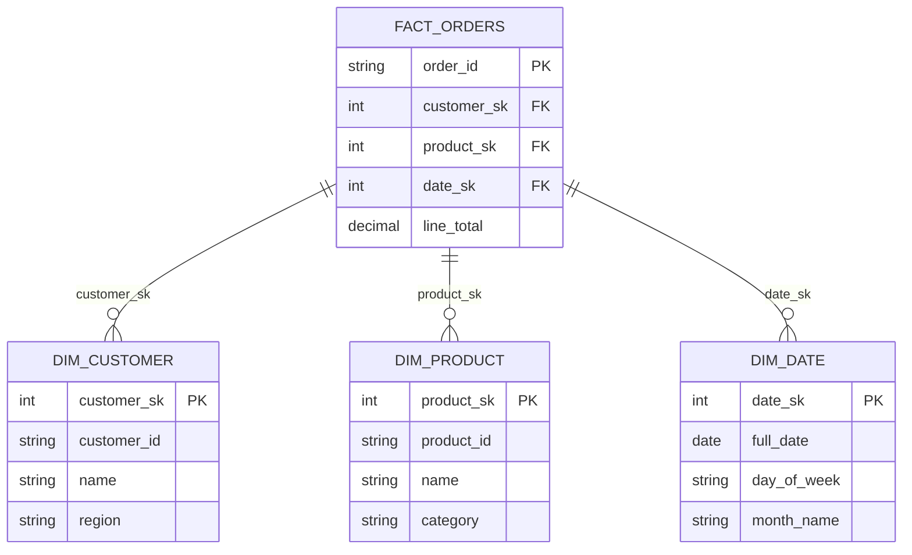

# FK Validation Tutorial

In this tutorial, you'll learn how to validate foreign key relationships between fact and dimension tables to ensure data quality.

**What You'll Learn:**
- Why validate foreign keys
- Defining relationships
- Detecting orphan records
- Handling orphans with different strategies
- Generating lineage diagrams

---

## Why Validate Foreign Keys?

In a star schema, fact tables reference dimension tables via foreign keys. But what happens when:
- A customer places an order, but the customer isn't in `dim_customer`?
- An order references a product that was never loaded?
- A date value doesn't exist in the date dimension?

These are called **orphan records**—facts that reference non-existent dimensions.

**Problems with orphans:**
- Reports show "Unknown" values
- Counts and sums may be incorrect
- Data quality issues go undetected
- Downstream analytics are unreliable

**FK validation** helps you detect, report, and handle these issues.

---

## Source Data

We'll use the fact_orders table with some intentional orphan records:

### fact_orders (35 rows including 5 orphans)

| order_id | customer_sk | product_sk | date_sk | line_total | status |
|----------|-------------|------------|---------|------------|--------|
| ORD001 | 1 | 1 | 20240115 | 1299.99 | completed |
| ORD002 | 1 | 2 | 20240115 | 59.98 | completed |
| ... | ... | ... | ... | ... | ... |
| ORD030 | 5 | 10 | 20240116 | 189.99 | completed |
| **ORD031** | **99** | 1 | 20240117 | 1299.99 | completed |
| **ORD032** | **88** | 2 | 20240118 | 29.99 | completed |
| **ORD033** | **77** | 3 | 20240119 | 249.99 | completed |
| **ORD034** | **66** | 4 | 20240120 | 49.99 | completed |
| **ORD035** | **55** | 5 | 20240121 | 599.99 | completed |

**Orphan records:** ORD031-ORD035 have customer_sk values (99, 88, 77, 66, 55) that don't exist in dim_customer.

### dim_customer (13 rows)

| customer_sk | customer_id | name |
|-------------|-------------|------|
| 0 | -1 | Unknown |
| 1 | C001 | Alice Johnson |
| 2 | C002 | Bob Smith |
| ... | ... | ... |
| 12 | C012 | Leo Anderson |

Note: customer_sk values 55, 66, 77, 88, 99 do NOT exist.

---

## Step 1: Define Relationships

First, declare the FK relationships in your star schema:

### Python Code

```python
from odibi.validation.fk import RelationshipConfig, RelationshipRegistry

# Define all FK relationships
relationships = [
    RelationshipConfig(
        name="orders_to_customers",
        fact="fact_orders",
        dimension="dim_customer",
        fact_key="customer_sk",
        dimension_key="customer_sk",
        nullable=False,
        on_violation="error"
    ),
    RelationshipConfig(
        name="orders_to_products",
        fact="fact_orders",
        dimension="dim_product",
        fact_key="product_sk",
        dimension_key="product_sk",
        nullable=False,
        on_violation="error"
    ),
    RelationshipConfig(
        name="orders_to_dates",
        fact="fact_orders",
        dimension="dim_date",
        fact_key="date_sk",
        dimension_key="date_sk",
        nullable=True,  # Pending orders may not have dates
        on_violation="warn"
    )
]

# Create registry
registry = RelationshipRegistry(relationships=relationships)
```

### YAML Alternative

```yaml
# relationships.yaml
relationships:
  - name: orders_to_customers
    fact: fact_orders
    dimension: dim_customer
    fact_key: customer_sk
    dimension_key: customer_sk
    nullable: false
    on_violation: error
  
  - name: orders_to_products
    fact: fact_orders
    dimension: dim_product
    fact_key: product_sk
    dimension_key: product_sk
    nullable: false
    on_violation: error
  
  - name: orders_to_dates
    fact: fact_orders
    dimension: dim_date
    fact_key: date_sk
    dimension_key: date_sk
    nullable: true
    on_violation: warn
```

### RelationshipConfig Fields

| Field | Type | Required | Description |
|-------|------|----------|-------------|
| `name` | str | Yes | Unique identifier |
| `fact` | str | Yes | Fact table name |
| `dimension` | str | Yes | Dimension table name |
| `fact_key` | str | Yes | FK column in fact |
| `dimension_key` | str | Yes | PK/SK column in dimension |
| `nullable` | bool | No | Whether nulls are allowed (default: false) |
| `on_violation` | str | No | Action: "error", "warn", "filter" (default: "error") |

---

## Step 2: Validate a Clean Fact Table

Let's first validate a fact table with NO orphans:

### Python Code

```python
from odibi.validation.fk import FKValidator
from odibi.context import EngineContext
from odibi.enums import EngineType
import pandas as pd

# Load data
fact_orders = pd.read_parquet("warehouse/fact_orders")  # Clean data - 30 rows
dim_customer = pd.read_parquet("warehouse/dim_customer")
dim_product = pd.read_parquet("warehouse/dim_product")
dim_date = pd.read_parquet("warehouse/dim_date")

# Setup context
context = EngineContext(df=None, engine_type=EngineType.PANDAS)
context.register("dim_customer", dim_customer)
context.register("dim_product", dim_product)
context.register("dim_date", dim_date)

# Create validator
validator = FKValidator(registry)

# Validate
report = validator.validate_fact(fact_orders, "fact_orders", context)

# Check results
print(f"All valid: {report.all_valid}")
print(f"Total relationships: {report.total_relationships}")
print(f"Valid relationships: {report.valid_relationships}")
```

### Validation Report (Clean Data)

```
All valid: True
Total relationships: 3
Valid relationships: 3

Relationship: orders_to_customers
  Status: VALID
  Total rows: 30
  Orphan count: 0

Relationship: orders_to_products
  Status: VALID
  Total rows: 30
  Orphan count: 0

Relationship: orders_to_dates
  Status: VALID
  Total rows: 30
  Orphan count: 0
```

---

## Step 3: Validate with Orphan Records

Now let's validate the data with 5 orphan records:

### Python Code

```python
# Load data with orphans
fact_orders_dirty = pd.read_csv("data/orders_with_orphans.csv")

# This has 35 rows - 5 with invalid customer_sk values

# Validate
report = validator.validate_fact(fact_orders_dirty, "fact_orders", context)

print(f"All valid: {report.all_valid}")
print(f"Orphan records found: {len(report.orphan_records)}")
```

### Validation Report (With Orphans)

```
All valid: False
Total relationships: 3
Valid relationships: 2
Orphan records found: 5

Relationship: orders_to_customers
  Status: INVALID
  Total rows: 35
  Orphan count: 5
  Orphan values (sample):
    - customer_sk = 99 (1 occurrence)
    - customer_sk = 88 (1 occurrence)
    - customer_sk = 77 (1 occurrence)
    - customer_sk = 66 (1 occurrence)
    - customer_sk = 55 (1 occurrence)

Relationship: orders_to_products
  Status: VALID
  Total rows: 35
  Orphan count: 0

Relationship: orders_to_dates
  Status: VALID
  Total rows: 35
  Orphan count: 0
```

### Detailed Orphan Records

```python
# Get the orphan records
for orphan in report.orphan_records:
    print(f"Order {orphan.order_id}: customer_sk={orphan.customer_sk} not found")
```

| order_id | customer_sk | reason |
|----------|-------------|--------|
| ORD031 | 99 | Not found in dim_customer |
| ORD032 | 88 | Not found in dim_customer |
| ORD033 | 77 | Not found in dim_customer |
| ORD034 | 66 | Not found in dim_customer |
| ORD035 | 55 | Not found in dim_customer |

---

## Step 4: Handle Orphans with Different Strategies

### Strategy 1: Error (Default)

Raise an exception when orphans are found:

```python
from odibi.validation.fk import validate_fk_on_load

try:
    validated_df = validate_fk_on_load(
        fact_df=fact_orders_dirty,
        relationships=relationships,
        context=context,
        on_failure="error"
    )
except ValueError as e:
    print(f"Validation failed: {e}")
```

**Output:**

```
Validation failed: FK validation found 5 orphan records:
  - orders_to_customers: 5 orphans (customer_sk: 99, 88, 77, 66, 55)
```

**Use case:** Strict data quality—fail the pipeline if any orphans exist.

### Strategy 2: Warn

Log a warning but continue processing:

```python
import logging

logging.basicConfig(level=logging.WARNING)

validated_df = validate_fk_on_load(
    fact_df=fact_orders_dirty,
    relationships=relationships,
    context=context,
    on_failure="warn"
)

print(f"Returned {len(validated_df)} rows (including orphans)")
```

**Output:**

```
WARNING:odibi.validation.fk:FK validation found 5 orphan records for orders_to_customers
  Orphan values: customer_sk in [99, 88, 77, 66, 55]
Returned 35 rows (including orphans)
```

**Use case:** Log issues for investigation but don't block processing.

### Strategy 3: Filter

Remove orphan records from the result:

```python
validated_df = validate_fk_on_load(
    fact_df=fact_orders_dirty,
    relationships=relationships,
    context=context,
    on_failure="filter"
)

print(f"Before: {len(fact_orders_dirty)} rows")
print(f"After:  {len(validated_df)} rows")
print(f"Filtered: {len(fact_orders_dirty) - len(validated_df)} orphan rows")
```

**Output:**

```
Before: 35 rows
After:  30 rows
Filtered: 5 orphan rows
```

**Before (35 rows):**

| order_id | customer_sk | line_total |
|----------|-------------|------------|
| ORD001 | 1 | 1299.99 |
| ORD002 | 1 | 59.98 |
| ... | ... | ... |
| ORD030 | 5 | 189.99 |
| ORD031 | **99** | 1299.99 |
| ORD032 | **88** | 29.99 |
| ORD033 | **77** | 249.99 |
| ORD034 | **66** | 49.99 |
| ORD035 | **55** | 599.99 |

**After (30 rows - orphans removed):**

| order_id | customer_sk | line_total |
|----------|-------------|------------|
| ORD001 | 1 | 1299.99 |
| ORD002 | 1 | 59.98 |
| ... | ... | ... |
| ORD030 | 5 | 189.99 |

**Use case:** Silently exclude bad data (use with caution—you may lose legitimate records).

---

## Step 5: Generate Lineage from Relationships

The relationship registry can generate a lineage graph:

### Python Code

```python
lineage = registry.generate_lineage()
print(lineage)
```

### Output

```python
{
    'fact_orders': ['dim_customer', 'dim_product', 'dim_date']
}
```

### Mermaid Diagram

```python
# Generate mermaid diagram code
mermaid_code = registry.to_mermaid()
print(mermaid_code)
```



---

## Complete Example

Here's a complete script for FK validation:

```python
#!/usr/bin/env python3
"""
FK Validation Example

This script demonstrates:
1. Defining FK relationships
2. Validating a fact table
3. Handling orphan records
4. Generating lineage
"""

from odibi.validation.fk import (
    RelationshipConfig,
    RelationshipRegistry,
    FKValidator,
    validate_fk_on_load
)
from odibi.context import EngineContext
from odibi.enums import EngineType
import pandas as pd

# =============================================================================
# 1. LOAD DATA
# =============================================================================
print("=" * 60)
print("Step 1: Load Data")
print("=" * 60)

# Clean fact data
fact_orders = pd.read_parquet("warehouse/fact_orders")
print(f"fact_orders: {len(fact_orders)} rows")

# Fact data with orphans
fact_orders_dirty = pd.read_csv(
    "examples/tutorials/dimensional_modeling/data/orders_with_orphans.csv"
)
print(f"fact_orders_dirty: {len(fact_orders_dirty)} rows (5 orphans)")

# Dimensions
dim_customer = pd.read_parquet("warehouse/dim_customer")
dim_product = pd.read_parquet("warehouse/dim_product")
dim_date = pd.read_parquet("warehouse/dim_date")
print()

# =============================================================================
# 2. DEFINE RELATIONSHIPS
# =============================================================================
print("=" * 60)
print("Step 2: Define Relationships")
print("=" * 60)

relationships = [
    RelationshipConfig(
        name="orders_to_customers",
        fact="fact_orders",
        dimension="dim_customer",
        fact_key="customer_sk",
        dimension_key="customer_sk",
        on_violation="error"
    ),
    RelationshipConfig(
        name="orders_to_products",
        fact="fact_orders",
        dimension="dim_product",
        fact_key="product_sk",
        dimension_key="product_sk",
        on_violation="error"
    ),
    RelationshipConfig(
        name="orders_to_dates",
        fact="fact_orders",
        dimension="dim_date",
        fact_key="date_sk",
        dimension_key="date_sk",
        on_violation="warn"
    )
]

registry = RelationshipRegistry(relationships=relationships)
print(f"Defined {len(relationships)} relationships")
print()

# =============================================================================
# 3. SETUP CONTEXT
# =============================================================================
context = EngineContext(df=None, engine_type=EngineType.PANDAS)
context.register("dim_customer", dim_customer)
context.register("dim_product", dim_product)
context.register("dim_date", dim_date)

# =============================================================================
# 4. VALIDATE CLEAN DATA
# =============================================================================
print("=" * 60)
print("Step 3: Validate Clean Data")
print("=" * 60)

validator = FKValidator(registry)
report = validator.validate_fact(fact_orders, "fact_orders", context)

print(f"All valid: {report.all_valid}")
print(f"Relationships checked: {report.total_relationships}")
print(f"Valid: {report.valid_relationships}")
print()

# =============================================================================
# 5. VALIDATE DIRTY DATA
# =============================================================================
print("=" * 60)
print("Step 4: Validate Data with Orphans")
print("=" * 60)

report = validator.validate_fact(fact_orders_dirty, "fact_orders", context)

print(f"All valid: {report.all_valid}")
print(f"Orphan records: {len(report.orphan_records)}")

for result in report.results:
    status = "VALID" if result.valid else "INVALID"
    print(f"\n  {result.relationship_name}: {status}")
    print(f"    Total rows: {result.total_rows}")
    print(f"    Orphans: {result.orphan_count}")
    if not result.valid:
        print(f"    Orphan values: {result.orphan_values[:5]}")
print()

# =============================================================================
# 6. DEMONSTRATE HANDLING STRATEGIES
# =============================================================================
print("=" * 60)
print("Step 5: Orphan Handling Strategies")
print("=" * 60)

# Filter strategy
filtered_df = validate_fk_on_load(
    fact_df=fact_orders_dirty,
    relationships=[relationships[0]],  # Just customer relationship
    context=context,
    on_failure="filter"
)

print(f"\nFilter Strategy:")
print(f"  Before: {len(fact_orders_dirty)} rows")
print(f"  After:  {len(filtered_df)} rows")
print(f"  Removed: {len(fact_orders_dirty) - len(filtered_df)} orphan rows")
print()

# =============================================================================
# 7. GENERATE LINEAGE
# =============================================================================
print("=" * 60)
print("Step 6: Generate Lineage")
print("=" * 60)

lineage = registry.generate_lineage()
print(f"Lineage: {lineage}")

print("\nDimensions referenced by fact_orders:")
for dim in lineage.get("fact_orders", []):
    print(f"  → {dim}")

print()
print("=" * 60)
print("COMPLETE!")
print("=" * 60)
```

---

## What You Learned

In this tutorial, you learned:

- **Why FK validation matters**: Orphan records cause data quality issues
- **Defining relationships**: Specify fact, dimension, and key columns
- **Validating facts**: Use FKValidator to detect orphans
- **Handling strategies**:
  - `error`: Fail the pipeline (strict)
  - `warn`: Log and continue (monitoring)
  - `filter`: Remove orphans (permissive)
- **Generating lineage**: Visualize table relationships

---

## Congratulations!

You've completed the entire dimensional modeling tutorial series!

**What you built:**
- Part 1: Complete star schema (dimensions, facts, aggregates)
- Part 2: Semantic layer (metrics, dimensions, materializations)
- Part 3: FK validation (data quality)

You now have all the tools to build production-ready dimensional data warehouses with Odibi.

---

## Navigation

| Previous | Up | Next |
|----------|----|----|
| [Semantic Full Example](./12_semantic_full_example.md) | [Tutorials](../getting_started.md) | - |

---

## Reference

For complete documentation, see: [FK Validation Reference](../../validation/fk.md)
