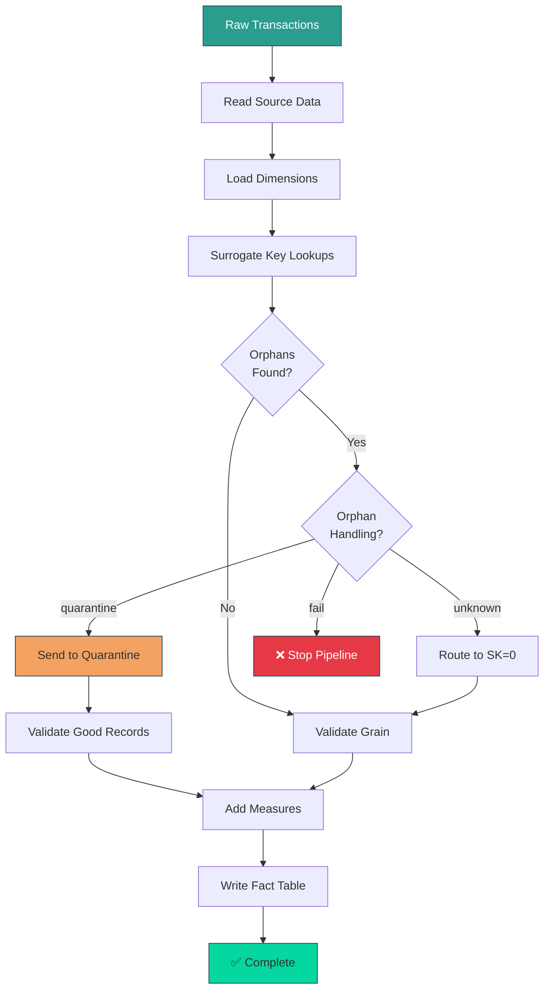
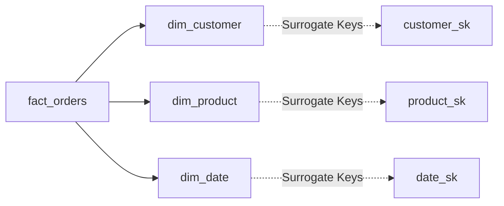
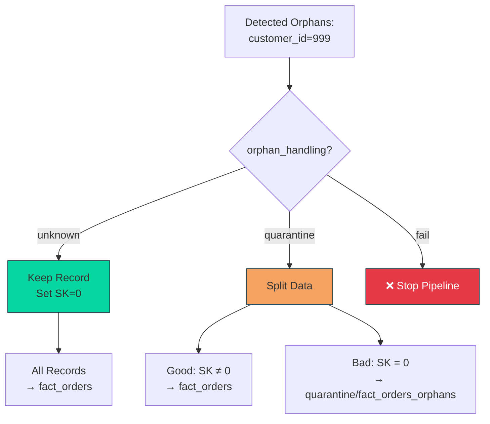
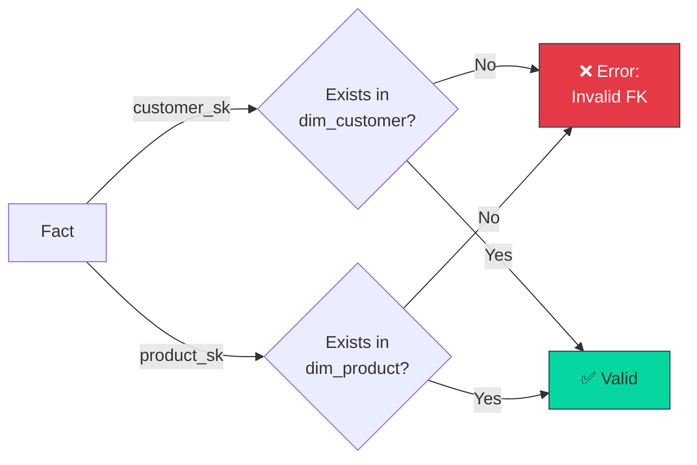

# Fact Table Build Flow

> How the `fact` pattern builds star schema fact tables with surrogate key lookups and orphan handling.

---

## High-Level Flow



---

## Detailed Step-by-Step

### **Step 1: Read Source Data**

```yaml
read:
  connection: bronze
  table: raw_orders
```

**Input:**
| order_id | customer_id | product_id | quantity | amount | order_date |
|----------|-------------|------------|----------|--------|------------|
| 1001 | 101 | 501 | 2 | 150.00 | 2025-01-01 |
| 1002 | 102 | 502 | 1 | 75.00 | 2025-01-02 |
| 1003 | 999 | 503 | 3 | 200.00 | 2025-01-03 |

**Note:** `customer_id = 999` doesn't exist in dimension (orphan).

---

### **Step 2: Load Dimensions**

Pattern automatically loads referenced dimensions:



**Dimensions Loaded:**
- `dim_customer` (for `customer_id` → `customer_sk` lookup)
- `dim_product` (for `product_id` → `product_sk` lookup)
- `dim_date` (for `order_date` → `date_sk` lookup)

---

### **Step 3: Surrogate Key Lookups**

**dim_customer:**
| customer_sk | customer_id | name | city |
|-------------|-------------|------|------|
| 0 | NULL | Unknown | Unknown |
| 1001 | 101 | Alice | Portland |
| 1002 | 102 | Bob | Seattle |

**Join Logic:**
```sql
SELECT 
    orders.*,
    COALESCE(dim_customer.customer_sk, 0) as customer_sk
FROM orders
LEFT JOIN dim_customer 
    ON orders.customer_id = dim_customer.customer_id
    AND dim_customer.is_current = TRUE  -- SCD2: get current version
```

**Result After Lookups:**
| order_id | customer_id | customer_sk | product_sk | date_sk | quantity | amount |
|----------|-------------|-------------|------------|---------|----------|--------|
| 1001 | 101 | **1001** | 5001 | 20250101 | 2 | 150.00 |
| 1002 | 102 | **1002** | 5002 | 20250102 | 1 | 75.00 |
| 1003 | 999 | **0** | 5003 | 20250103 | 3 | 200.00 |

**Note:** Order 1003 got `customer_sk = 0` (unknown member).

---

### **Step 4: Orphan Handling**



**Configuration:**

```yaml
pattern:
  type: fact
  params:
    orphan_handling: unknown  # or: quarantine, fail
```

| Mode | Behavior | Use When |
|------|----------|----------|
| `unknown` | Keep orphans, set SK=0 | Orphans expected, report shows "Unknown Customer" |
| `quarantine` | Split good/bad records | Orphans rare, need manual review |
| `fail` | Stop pipeline | Orphans indicate data quality issue |

---

### **Step 5: Grain Validation**

Verify no duplicates on grain columns:

```yaml
params:
  grain: [order_id, line_item_id]
```

```sql
SELECT order_id, line_item_id, COUNT(*) as cnt
FROM fact_orders
GROUP BY order_id, line_item_id
HAVING COUNT(*) > 1;
```

If duplicates found → ❌ Error (grain violation).

---

### **Step 6: Add Measures**

Keep numeric measures, degenerate dimensions:

```yaml
params:
  measures: [quantity, amount, discount]
  degenerate_dimensions: [order_number, invoice_id]
```

**Final Fact Table:**
| order_sk | customer_sk | product_sk | date_sk | order_number | quantity | amount |
|----------|-------------|------------|---------|--------------|----------|--------|
| 1 | 1001 | 5001 | 20250101 | ORD-1001 | 2 | 150.00 |
| 2 | 1002 | 5002 | 20250102 | ORD-1002 | 1 | 75.00 |
| 3 | **0** | 5003 | 20250103 | ORD-1003 | 3 | 200.00 |

**Columns:**
- **Surrogate keys:** `customer_sk`, `product_sk`, `date_sk`
- **Measures:** `quantity`, `amount`
- **Degenerate dimensions:** `order_number` (doesn't need separate dimension)

---

## FK Validation

Optional: Validate all SKs exist in dimensions.

```yaml
params:
  validate_foreign_keys: true
```



**Checks:**
- All `customer_sk` values (except 0) exist in `dim_customer.customer_sk`
- All `product_sk` values (except 0) exist in `dim_product.product_sk`
- All `date_sk` values exist in `dim_date.date_sk`

---

## Complete YAML Example

```yaml
nodes:
  - name: fact_orders
    depends_on: [dim_customer, dim_product, dim_date]
    
    read:
      connection: bronze
      table: raw_orders
    
    pattern:
      type: fact
      params:
        # Grain (primary key of fact)
        grain: [order_id, line_item_id]
        
        # Dimension lookups
        dimensions:
          - source_column: customer_id
            dimension_table: dim_customer
            dimension_key: customer_id
            surrogate_key: customer_sk
          
          - source_column: product_id
            dimension_table: dim_product
            dimension_key: product_id
            surrogate_key: product_sk
          
          - source_column: order_date
            dimension_table: dim_date
            dimension_key: date_id
            surrogate_key: date_sk
        
        # Orphan handling
        orphan_handling: unknown  # SK=0 for missing dimension members
        
        # Measures (numeric facts)
        measures: [quantity, amount, discount]
        
        # Degenerate dimensions (IDs in fact, no separate table)
        degenerate_dimensions: [order_number, invoice_id]
        
        # Optional FK validation
        validate_foreign_keys: true
    
    write:
      connection: gold
      format: delta
      table: fact_orders
      mode: append
```

---

## Querying the Fact Table

### **Star Schema Join**

```sql
SELECT 
    d.name as customer_name,
    p.product_name,
    dt.date,
    f.quantity,
    f.amount
FROM fact_orders f
JOIN dim_customer d ON f.customer_sk = d.customer_sk
JOIN dim_product p ON f.product_sk = p.product_sk
JOIN dim_date dt ON f.date_sk = dt.date_sk
WHERE dt.year = 2025
  AND dt.month = 1;
```

### **Unknown Members**

```sql
SELECT *
FROM fact_orders
WHERE customer_sk = 0;  -- Orphan orders
```

### **Aggregation**

```sql
SELECT 
    dt.year,
    dt.month,
    SUM(f.amount) as total_revenue,
    SUM(f.quantity) as total_units
FROM fact_orders f
JOIN dim_date dt ON f.date_sk = dt.date_sk
GROUP BY dt.year, dt.month
ORDER BY dt.year, dt.month;
```

---

## Common Pitfalls

### ❌ **Wrong: No Unknown Member in Dimensions**

```yaml
# BAD: dim_customer has no SK=0
# Result: Orphans get NULL SK → breaks BI tools
```

### ✅ **Right: Create Unknown Member**

```yaml
# GOOD: Dimension pattern creates SK=0
pattern:
  type: dimension
  params:
    unknown_member: true
```

---

### ❌ **Wrong: Incorrect Grain**

```yaml
# BAD: Missing line_item_id
grain: [order_id]
# Result: Duplicates if order has multiple line items
```

### ✅ **Right: Complete Grain**

```yaml
# GOOD: Order + line item
grain: [order_id, line_item_id]
```

---

### ❌ **Wrong: Natural Keys in Fact**

```yaml
# BAD: Using customer_id (natural key)
SELECT customer_id FROM fact_orders
# Problem: Which version of customer? (SCD2)
```

### ✅ **Right: Surrogate Keys in Fact**

```yaml
# GOOD: Using customer_sk (surrogate key)
SELECT customer_sk FROM fact_orders
# Benefit: Points to exact version at transaction time
```

---

## Related

- [Fact Pattern](../patterns/fact.md) - Full documentation
- [Dimension Pattern](../patterns/dimension.md) - How dimensions work
- [SCD2 Timeline](scd2_timeline.md) - History tracking explained
- [Example: Fact Table](../examples/canonical/04_fact_table.md) - Working example

---

[← Back to Visuals](README.md) | [Architecture](odibi_architecture.md) | [Run Lifecycle](run_lifecycle.md)
