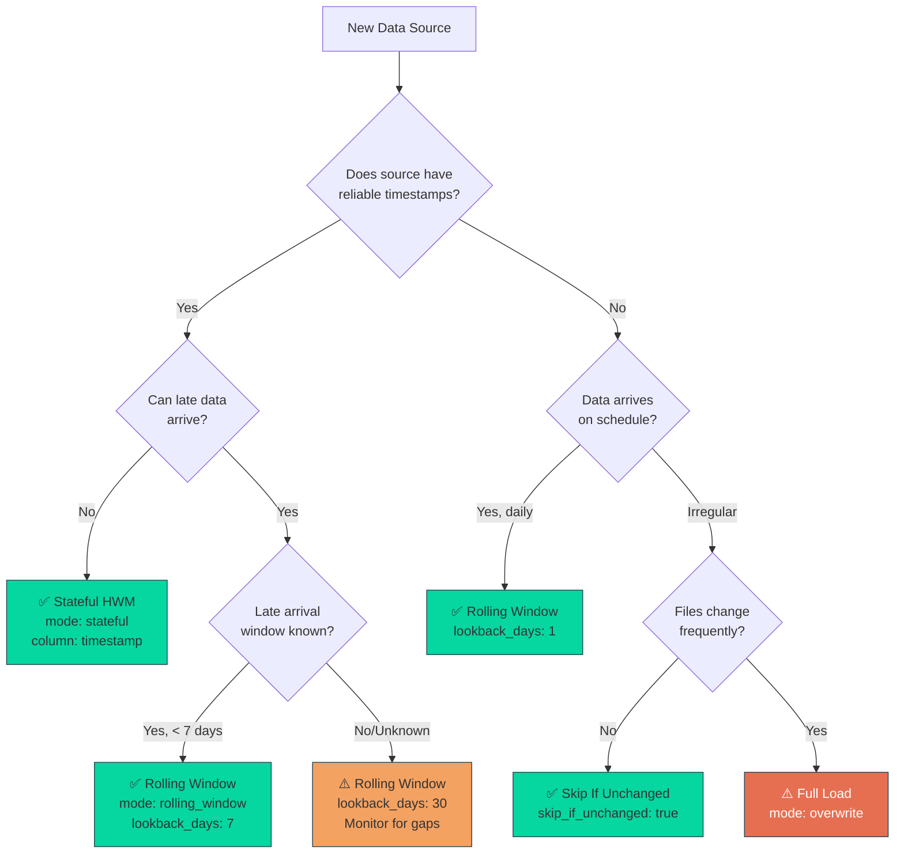
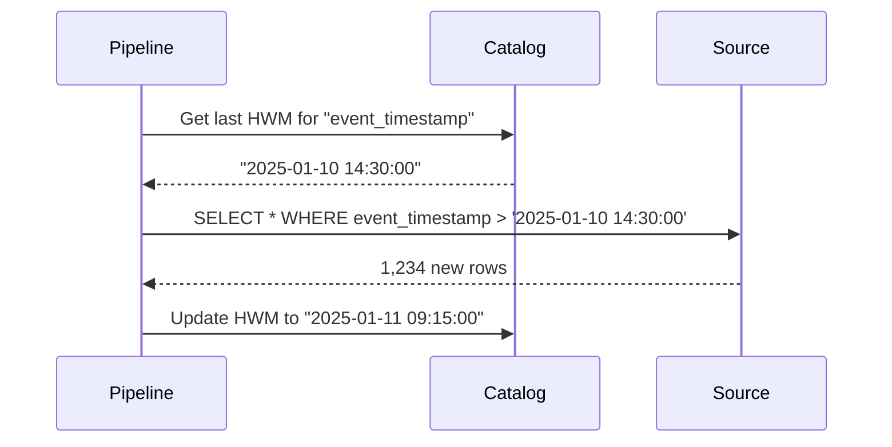
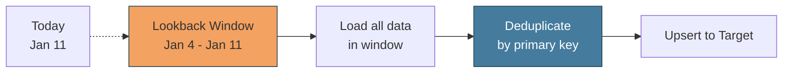
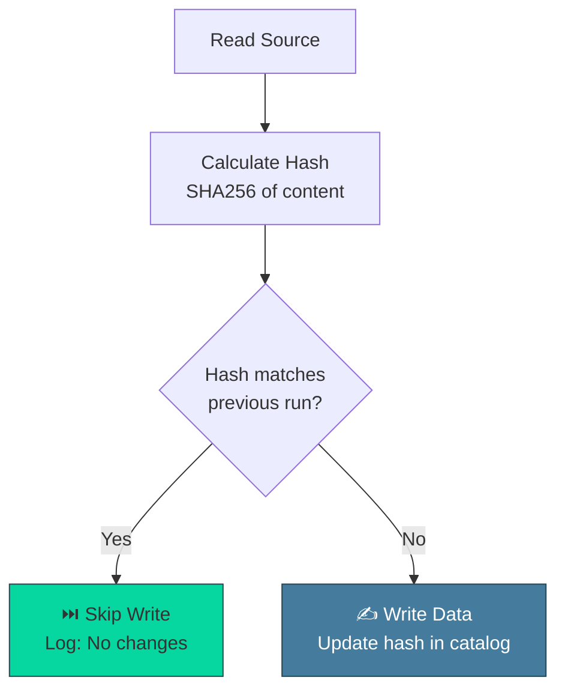

# Incremental Loading Decision Tree

> Choose the right incremental pattern for your data source.

---

## Decision Tree



---

## Pattern Comparison

| Pattern | Use When | Pros | Cons | Example |
|---------|----------|------|------|---------|
| **Stateful HWM** | Source has reliable `updated_at` or `timestamp` | Exact, efficient | Can miss late data | Event logs, sensor data |
| **Rolling Window** | Late-arriving data common | Catches late data | Reprocesses some rows | Lab results, batch systems |
| **Skip If Unchanged** | Static files (configs, lookups) | Skips unnecessary writes | File-level only | Currency rates, product catalogs |
| **Full Load** | Small tables, frequently changing | Simple, always fresh | Inefficient for large data | Reference data < 10K rows |

---

## Configuration Examples

### 1. Stateful (Exact Incremental)

```yaml
read:
  connection: source
  path: events.csv
  options:
    incremental:
      mode: stateful
      column: event_timestamp  # Must be reliable
      initial_value: "1970-01-01"  # First run: load from this date
```

**How It Works:**


---

### 2. Rolling Window (Safety Buffer)

```yaml
read:
  connection: source
  path: lab_results.csv
  options:
    incremental:
      mode: rolling_window
      lookback_days: 7  # Reprocess last 7 days
```

**How It Works:**


**Trade-off:** Reprocesses 7 days of data each run, but catches late arrivals.

---

### 3. Skip If Unchanged (Hash-Based)

```yaml
write:
  connection: silver
  path: product_catalog
  format: parquet
  skip_if_unchanged: true  # Compare content hash
```

**How It Works:**


---

### 4. Hybrid: Stateful + Deduplication

For best of both worlds:

```yaml
read:
  options:
    incremental:
      mode: stateful
      column: updated_at

transformer:
  transformer: deduplicate
  params:
    keys: [id]
    order_by: [updated_at DESC]  # Keep latest
```

---

## Real-World Examples

### Example 1: SCADA Sensor Tags
```
Data: 1-second resolution, timestamped
Pattern: Stateful HWM
Reason: Timestamps are reliable, no late data
```

```yaml
incremental:
  mode: stateful
  column: tag_timestamp
  initial_value: "2025-01-01 00:00:00"
```

---

### Example 2: Quality Lab Results
```
Data: Results arrive 2-48 hours after sampling
Pattern: Rolling Window (3 days)
Reason: Late arrivals are common
```

```yaml
incremental:
  mode: rolling_window
  lookback_days: 3
```

Then deduplicate by `sample_id`:

```yaml
transformer:
  transformer: deduplicate
  params:
    keys: [sample_id]
    order_by: [result_timestamp DESC]
```

---

### Example 3: Daily Batch Reports
```
Data: Daily CSV dump, no timestamps in data
Pattern: Rolling Window (1 day) or Filename Pattern
Reason: Predictable schedule
```

**Option A: Rolling Window**
```yaml
incremental:
  mode: rolling_window
  lookback_days: 1
```

**Option B: Filename Pattern**
```yaml
read:
  path: reports/daily_*.csv
  options:
    file_pattern: "daily_{date}.csv"
    date_format: "%Y%m%d"
```

---

### Example 4: Product Catalog (Weekly Update)
```
Data: CSV file updated weekly, small (< 5K rows)
Pattern: Skip If Unchanged
Reason: File rarely changes, small size
```

```yaml
write:
  skip_if_unchanged: true
```

---

## State Management

All incremental modes use the **System Catalog** to track state:

```bash
# View current state
odibi catalog state odibi.yaml

# Output:
# Node: load_events
# State: {"event_timestamp": "2025-01-11 09:15:00"}
# Updated: 2025-01-11 10:00:00

# Reset state (force full reload):
# Delete the state JSON file or remove the node's meta_state entry,
# then re-run the pipeline.
```

---

## Common Pitfalls

### ❌ Wrong: No Deduplication with Rolling Window

```yaml
# BAD: Rolling window without dedupe = duplicates
incremental:
  mode: rolling_window
  lookback_days: 7

write:
  mode: append  # ❌ Appends duplicates!
```

### ✅ Right: Dedupe or Upsert

```yaml
# GOOD: Dedupe before write
transformer:
  transformer: deduplicate
  params:
    keys: [id]

write:
  mode: overwrite  # Overwrites silver table
```

Or use merge:

```yaml
# GOOD: Upsert (merge)
write:
  mode: upsert
  options:
    keys: [id]
```

---

### ❌ Wrong: Stateful HWM on Unreliable Column

```yaml
# BAD: Using row insert time (not business event time)
incremental:
  mode: stateful
  column: _row_inserted_at  # ❌ Can skip late-arriving business events
```

### ✅ Right: Use Business Timestamp

```yaml
# GOOD: Use business event time + rolling window for safety
incremental:
  mode: rolling_window  # or stateful if late data impossible
  lookback_days: 1
```

---

## Decision Checklist

Use this checklist to choose your pattern:

- [ ] **Does source have a reliable timestamp column?**
  - Yes → Consider stateful
  - No → Consider rolling window or full load

- [ ] **Can data arrive late?**
  - Yes → Use rolling window
  - No → Stateful is safe

- [ ] **Is the dataset small (< 10K rows)?**
  - Yes → Full load is acceptable
  - No → Must use incremental

- [ ] **Do you need to reprocess historical windows?**
  - Yes → Delete the state entry (or state JSON file) and re-run with a new `initial_value`
  - No → Stick with current HWM

- [ ] **Is data immutable after creation?**
  - Yes → Append-only pattern (Bronze layer)
  - No → Upsert/merge pattern (Silver layer)

---

## Related Patterns

- [Incremental Stateful Pattern](../patterns/incremental_stateful.md) - Full guide
- [Windowed Reprocess Pattern](../patterns/windowed_reprocess.md) - Reprocessing historical windows
- [Smart Read Pattern](../patterns/smart_read.md) - Advanced file detection
- [System Catalog](../features/catalog.md) - State management deep dive

---

[← Back to Visuals](README.md) | [Architecture Diagram](odibi_architecture.md)
