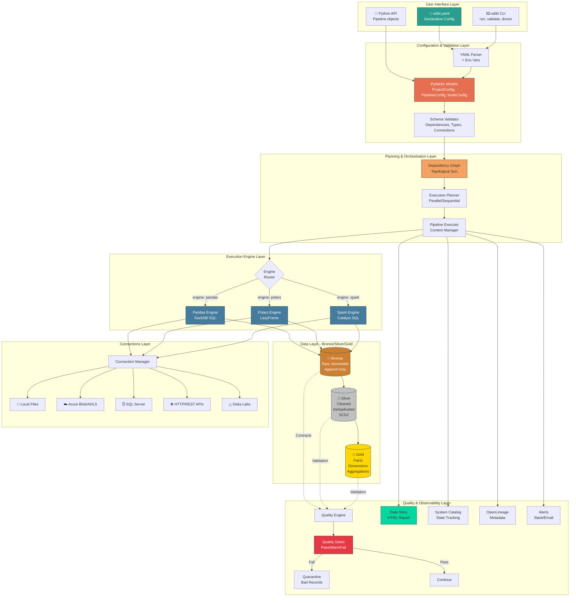
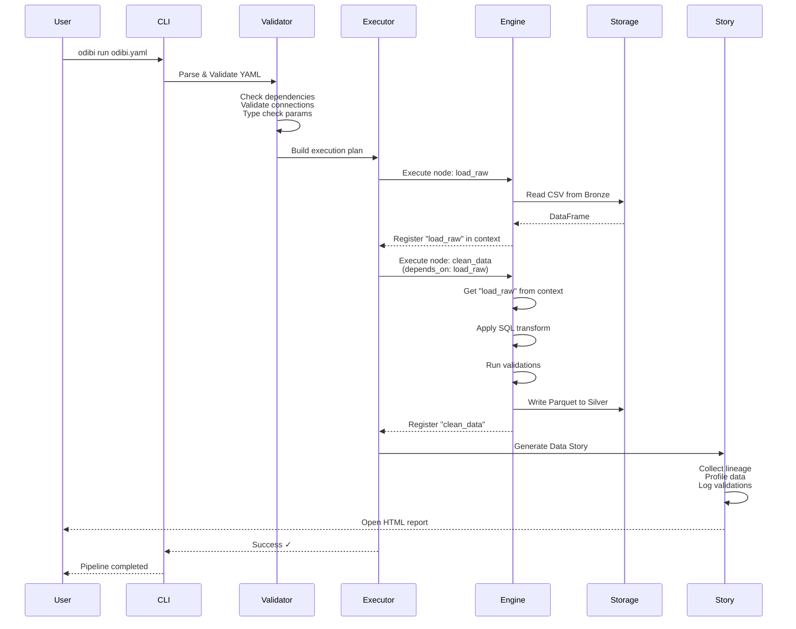
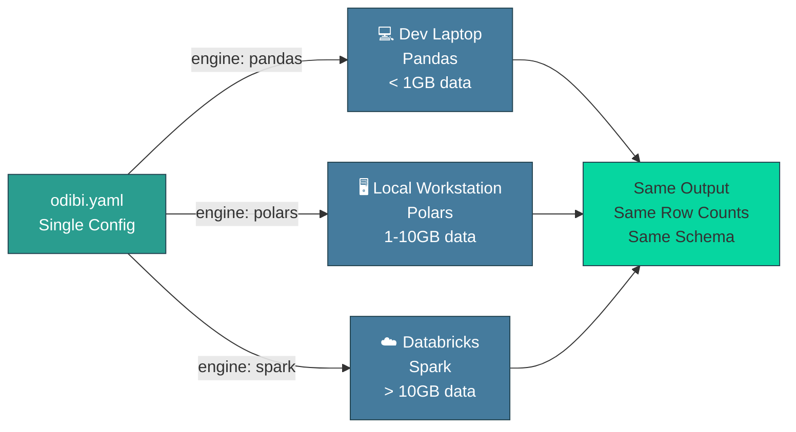
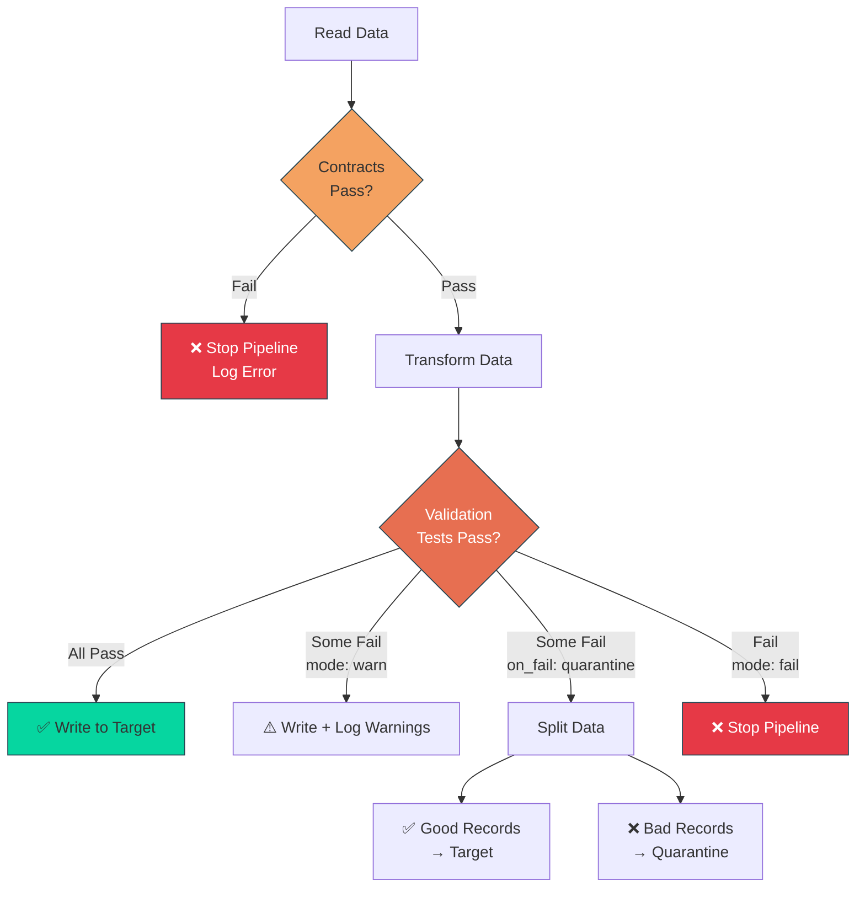

# Odibi in One Picture

> The complete Odibi architecture from YAML to execution.

---

## System Architecture

---

## Data Flow Example

Here's how a typical pipeline execution flows:

---

## Engine Parity Principle

The same YAML config runs on **all three engines** with identical results:

---

## Quality Layer Detail

---

## Key Takeaways

### 1. **Three Layers**
- **Configuration Layer**: YAML → Pydantic models → validation
- **Execution Layer**: DAG → Engine → Storage
- **Observability Layer**: Story + State + Lineage + Alerts

### 2. **Engine Abstraction**
One config, three engines. Develop locally (Pandas), deploy to prod (Spark).

### 3. **Quality First**
Contracts check **inputs**. Validations check **outputs**. Gates decide **what happens on failure**.

### 4. **Medallion Pattern**
- **Bronze**: Raw truth (immutable)
- **Silver**: Cleaned context (SCD2, deduplication)
- **Gold**: Business insights (facts, aggregations)

### 5. **Observable by Default**
Every run generates a Data Story. No extra work required.

---

## Related

- [The Definitive Guide](../guides/the_definitive_guide.md) - Deep dive into each layer
- [Philosophy](../philosophy.md) - Design principles
- [Engine Parity Table](../reference/PARITY_TABLE.md) - Feature comparison

---

[← Back to Journeys](../journeys/README.md)
