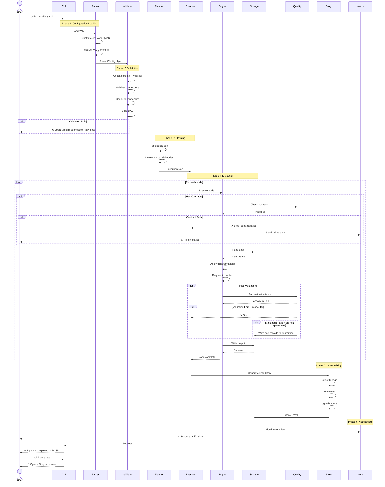
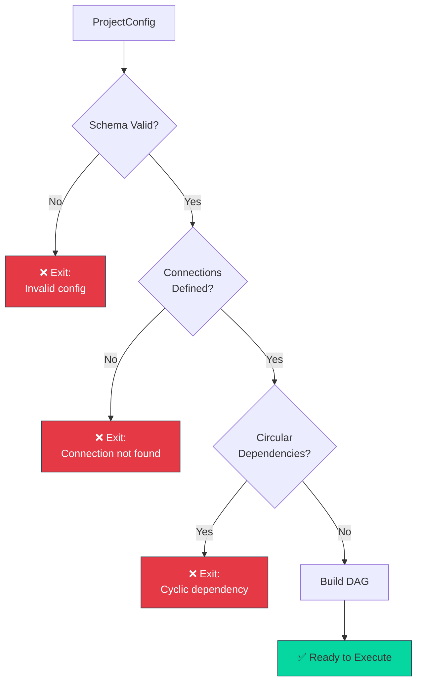
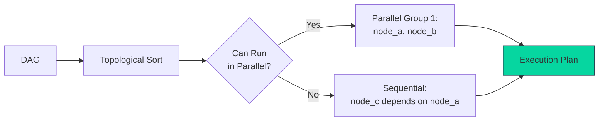
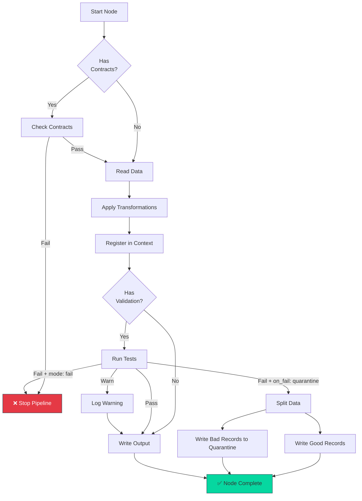
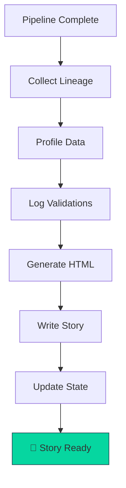
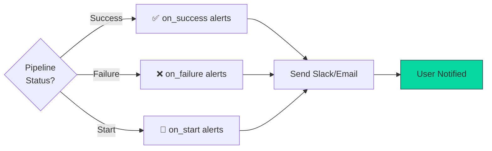
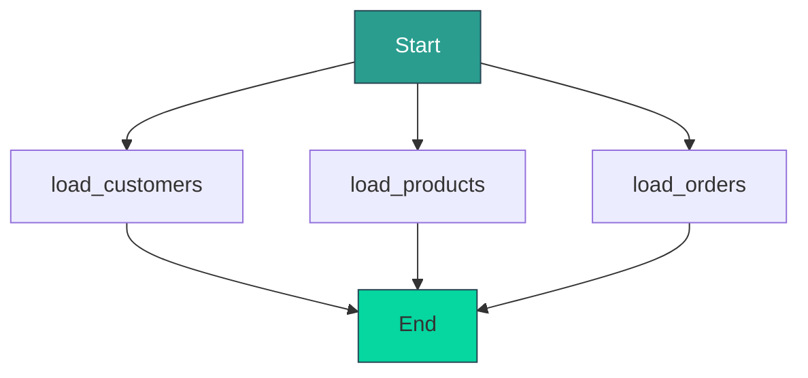

# Odibi Run Lifecycle

> What happens when you run `odibi run odibi.yaml`? This diagram shows the complete execution flow.

---

## Complete Lifecycle Sequence



---

## Phase Breakdown

### **Phase 1: Configuration Loading** (< 1 second)

```mermaid
graph TD
    A[odibi.yaml] --> B[YAML Parser]
    B --> C{Environment<br/>Variables?}
    C -->|Yes| D[Substitute ${VAR}]
    C -->|No| E[Continue]
    D --> E
    E --> F{YAML Anchors?}
    F -->|Yes| G[Resolve &refs]
    F -->|No| H[Pydantic Models]
    G --> H
    H --> I[ProjectConfig]
    
    style I fill:#06d6a0,stroke:#264653,color:#333
```

**What happens:**
- Read `odibi.yaml` from disk
- Replace `${DB_HOST}` with environment variable values
- Resolve YAML anchors (`&default_write`)
- Parse into Pydantic models (type-safe)

**Failures:**
- ❌ YAML syntax error
- ❌ Missing environment variable
- ❌ Invalid YAML structure

---

### **Phase 2: Validation** (< 1 second)



**Checks:**
- Pydantic schema validation (types, required fields)
- All `connection:` references exist in `connections:`
- All `depends_on:` references exist
- No circular dependencies (A → B → A)
- Transformer parameters valid

**Failures:**
- ❌ Missing required field
- ❌ Invalid transformer name
- ❌ Undefined connection
- ❌ Cycle detected in DAG

---

### **Phase 3: Planning** (< 1 second)



**Planning decisions:**
- Which nodes can run in parallel?
- What order to execute sequential nodes?
- How to manage context/state between nodes?

**Example:**
```
Execution Plan:
1. Parallel: [load_customers, load_products]
2. Sequential: [clean_customers] (depends on load_customers)
3. Parallel: [dim_customer, dim_product]
4. Sequential: [fact_sales] (depends on dim_customer, dim_product)
```

---

### **Phase 4: Execution** (Bulk of time)



**Per-Node Flow:**
1. **Contracts** (input validation) → Fail fast if bad data
2. **Read** → Load from connection
3. **Transform** → SQL, Python functions, patterns
4. **Context** → Register DataFrame for downstream nodes
5. **Validation** (output tests) → Check quality
6. **Write** → Save to target

---

### **Phase 5: Observability** (< 5 seconds)



**Story Generation:**
- **Lineage:** DAG visualization (Mermaid)
- **Profile:** Row counts, schema, sample data
- **Validations:** Test results, warnings, errors
- **Execution Log:** Timing, errors, stack traces
- **Explanations:** Business logic from YAML

**State Tracking:**
- Update high-water marks (HWM) for incremental loading
- Record run timestamp
- Track node success/failure

---

### **Phase 6: Notifications** (< 1 second)



---

## Error Handling

### **Fail Fast (Default)**

```
Error in node "clean_customers" → Stop entire pipeline
```

**Use when:** Critical data (financial, compliance)

---

### **Continue on Error**

```yaml
nodes:
  - name: optional_enrichment
    on_error: continue  # Log error, continue pipeline
```

**Use when:** Nice-to-have transformations

---

### **Retry with Backoff**

```yaml
retry:
  enabled: true
  max_attempts: 3
  backoff: exponential  # 1s, 2s, 4s
```

**Use when:** Network blips, transient errors

---

## Performance Optimization

### **Parallel Execution**

Nodes with no dependencies run in parallel automatically:



All 3 nodes run **simultaneously**.

---

### **Caching**

```yaml
nodes:
  - name: dim_customer
    cache: true  # Reused by multiple fact tables
```

DataFrame stays in memory for downstream nodes.

---

### **Incremental Loading**

Only process new data:

```
First run:  1,000,000 rows (5 minutes)
Second run: 1,000 rows (2 seconds)
```

See [Incremental Decision Tree](incremental_decision_tree.md).

---

## CLI Options

```bash
# Standard run
odibi run odibi.yaml

# Dry-run (validate without writing)
odibi run odibi.yaml --dry-run

# Run specific node only
odibi run odibi.yaml --node clean_customers

# Set environment
odibi run odibi.yaml --env production

```

---

## Debugging Tools

### **Pre-flight Checks**

```bash
# Validate YAML schema
odibi validate odibi.yaml

# Check environment health
odibi doctor

# Visualize DAG
odibi graph odibi.yaml
```

### **Post-mortem**

```bash
# View last story
odibi story last

# Check state
odibi catalog state odibi.yaml

# Read execution logs
cat .odibi/logs/odibi_20250111_143000.log
```

---

## Related

- [How to Read a Data Story](../guides/how_to_read_a_story.md) - Interpret execution results
- [Troubleshooting Guide](../troubleshooting.md) - Common errors
- [CLI Master Guide](../guides/cli_master_guide.md) - All CLI commands

---

[← Back to Visuals](README.md) | [Architecture](odibi_architecture.md) | [SCD2 Timeline](scd2_timeline.md)
