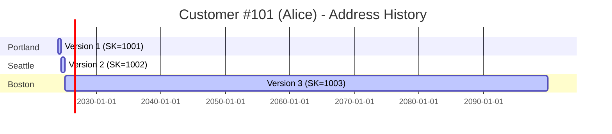
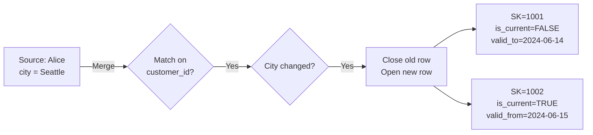
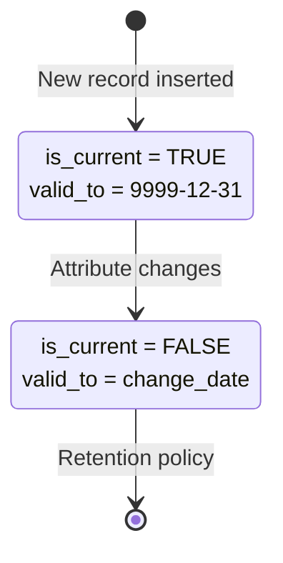

# SCD2 Timeline Anatomy

> Understanding how Slowly Changing Dimension Type 2 tracks history over time.

---

## What is SCD2?

**SCD Type 2** creates a new row for every change to tracked attributes, preserving complete history.

**Example:** Customer "Alice" changes her address twice.

---

## Timeline Visualization



---

## Table Evolution

### **Initial Load (2024-01-01)**

Customer moves to Portland.

| customer_sk | customer_id | name | city | is_current | valid_from | valid_to | is_deleted |
|-------------|-------------|------|------|------------|------------|----------|------------|
| 1001 | 101 | Alice | Portland | TRUE | 2024-01-01 | 9999-12-31 | FALSE |

**Explanation:**
- `customer_sk = 1001` → Surrogate key (unique, never reused)
- `customer_id = 101` → Natural key (from source system)
- `is_current = TRUE` → This is the active version
- `valid_to = 9999-12-31` → No end date yet (current record)

---

### **First Change (2024-06-15)**

Customer moves to Seattle.



**Result:**

| customer_sk | customer_id | name | city | is_current | valid_from | valid_to | is_deleted |
|-------------|-------------|------|------|------------|------------|----------|------------|
| 1001 | 101 | Alice | Portland | **FALSE** | 2024-01-01 | **2024-06-14** | FALSE |
| **1002** | 101 | Alice | **Seattle** | **TRUE** | **2024-06-15** | 9999-12-31 | FALSE |

**Key Changes:**
- Row 1 (SK=1001): `is_current → FALSE`, `valid_to → 2024-06-14`
- Row 2 (SK=1002): **New row** with Seattle, `is_current → TRUE`

---

### **Second Change (2025-01-10)**

Customer moves to Boston.

| customer_sk | customer_id | name | city | is_current | valid_from | valid_to | is_deleted |
|-------------|-------------|------|------|------------|------------|----------|------------|
| 1001 | 101 | Alice | Portland | FALSE | 2024-01-01 | 2024-06-14 | FALSE |
| 1002 | 101 | Alice | Seattle | **FALSE** | 2024-06-15 | **2025-01-09** | FALSE |
| **1003** | 101 | Alice | **Boston** | **TRUE** | **2025-01-10** | 9999-12-31 | FALSE |

Now we have **3 versions** of customer 101, each with its own surrogate key.

---

## SCD2 State Diagram



---

## Tracked vs Non-Tracked Columns

Not all columns need history tracking. Choose wisely.

| Column Type | Track Changes? | Example |
|-------------|----------------|---------|
| **Tracked** | ✅ Yes (creates new version) | `address`, `email`, `tier`, `status` |
| **Non-Tracked** | ❌ No (update in place) | `phone`, `last_login`, `preferences` |
| **Fixed** | 🔒 Never changes | `customer_id`, `signup_date`, `birth_date` |

**Example YAML:**

```yaml
pattern:
  type: dimension
  params:
    natural_key: customer_id
    surrogate_key: customer_sk
    scd_type: 2
    track_cols: [name, email, city, tier]  # Only these trigger new versions
```

---

## Querying SCD2 Tables

### **Get Current State**

```sql
SELECT *
FROM dim_customer
WHERE is_current = TRUE;
```

Returns 1 row per customer (latest version).

---

### **Get Historical State (Point-in-Time)**

"What was Alice's address on 2024-10-01?"

```sql
SELECT *
FROM dim_customer
WHERE customer_id = 101
  AND valid_from <= '2024-10-01'
  AND valid_to >= '2024-10-01';
```

Returns:
| customer_sk | customer_id | name | city | valid_from | valid_to |
|-------------|-------------|------|------|------------|----------|
| 1002 | 101 | Alice | Seattle | 2024-06-15 | 2025-01-09 |

---

### **Get Full History**

```sql
SELECT customer_id, city, valid_from, valid_to, is_current
FROM dim_customer
WHERE customer_id = 101
ORDER BY valid_from;
```

Returns:
| customer_id | city | valid_from | valid_to | is_current |
|-------------|------|------------|----------|------------|
| 101 | Portland | 2024-01-01 | 2024-06-14 | FALSE |
| 101 | Seattle | 2024-06-15 | 2025-01-09 | FALSE |
| 101 | Boston | 2025-01-10 | 9999-12-31 | TRUE |

---

## Common Patterns

### **Delete Detection**

If a customer is deleted from source:

| customer_sk | customer_id | name | city | is_current | is_deleted |
|-------------|-------------|------|------|------------|------------|
| 1003 | 101 | Alice | Boston | **FALSE** | **TRUE** |

```yaml
pattern:
  type: dimension
  params:
    detect_deletes: true
    deleted_flag_col: is_deleted
```

---

### **Unknown Member (SK=0)**

For orphan fact records (customer not in dimension):

| customer_sk | customer_id | name | city | is_current |
|-------------|-------------|------|------|------------|
| **0** | **NULL** | **Unknown** | **Unknown** | TRUE |

```yaml
pattern:
  type: dimension
  params:
    unknown_member: true  # Creates SK=0 row
```

Fact records reference SK=0 when customer_id is missing.

---

## SCD2 vs SCD1

| Feature | SCD1 (Overwrite) | SCD2 (Versioned) |
|---------|------------------|------------------|
| **History** | ❌ No | ✅ Yes |
| **Storage** | Small | Large |
| **Queries** | Simple | Moderate |
| **Use Case** | Latest state only | Audit, compliance, trends |

**When to use SCD2:**
- Compliance requirements (GDPR, SOX)
- Trend analysis (how has customer tier changed?)
- Slowly changing attributes (address, status)

**When to use SCD1:**
- Non-critical attributes (preferences, UI settings)
- High-frequency changes (no value in history)
- Storage constraints

---

## Odibi SCD2 Example

```yaml
nodes:
  - name: dim_customer
    read:
      connection: bronze
      table: raw_customers
    
    pattern:
      type: dimension
      params:
        natural_key: customer_id
        surrogate_key: customer_sk
        scd_type: 2
        track_cols: [name, email, city, tier]
        effective_from_col: valid_from
        effective_to_col: valid_to
        current_flag_col: is_current
        deleted_flag_col: is_deleted
        detect_deletes: true
        unknown_member: true
    
    write:
      connection: silver
      format: delta
      table: dim_customer
      mode: overwrite
```

**First run:** Inserts all customers with `is_current = TRUE`  
**Second run:** Detects changes, closes old rows, opens new rows  
**Third run:** Detects deletes, sets `is_deleted = TRUE`

---

## Pitfalls to Avoid

### ❌ **Wrong: No Surrogate Keys**

```yaml
# BAD: Using natural key in fact table
fact_orders:
  customer_id: 101  # ❌ Which version of customer?
```

### ✅ **Right: Use Surrogate Keys**

```yaml
# GOOD: Using surrogate key
fact_orders:
  customer_sk: 1002  # ✅ Exact version (Seattle address)
```

---

### ❌ **Wrong: Tracking Too Many Columns**

```yaml
# BAD: Tracking high-frequency changes
track_cols: [name, email, city, tier, last_login, page_views]
# Creates new version on every login!
```

### ✅ **Right: Track Only Business-Critical Changes**

```yaml
# GOOD: Only track meaningful changes
track_cols: [name, email, city, tier]
```

---

### ❌ **Wrong: No Unknown Member**

Facts referencing SK=NULL break BI tools.

### ✅ **Right: Unknown Member Handling**

```yaml
params:
  unknown_member: true  # Creates SK=0 for orphans
```

---

## Related

- [Dimension Pattern](../patterns/dimension.md) - Full implementation guide
- [SCD2 Pattern](../patterns/scd2.md) - Deep dive
- [Fact Pattern](../patterns/fact.md) - How facts use surrogate keys
- [Example: SCD2 Dimension](../examples/canonical/03_scd2_dimension.md) - Working example

---

[← Back to Visuals](README.md) | [Architecture](odibi_architecture.md) | [Incremental Decision Tree](incremental_decision_tree.md)
