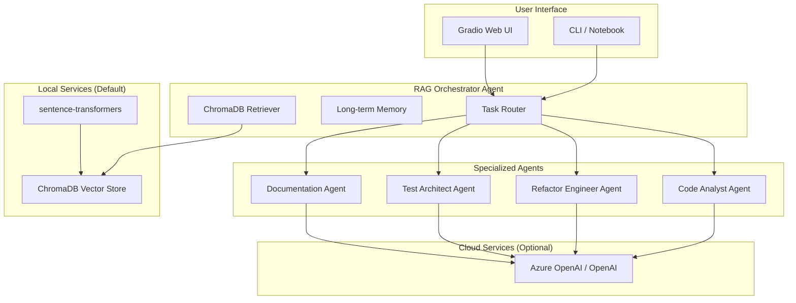

# Odibi AI Agent Suite

A multi-agent system for understanding, testing, documenting, and improving the Odibi data engineering framework.

**Key Features:**
- **Local-first**: ChromaDB + sentence-transformers for local RAG (no cloud required)
- **Azure OpenAI**: Optional, for chat and embeddings
- **687 tests passing** with full cycle execution and memory systems

## Assistant Modes

The assistant supports three operating modes:

| Mode | Description | User Interaction |
|------|-------------|------------------|
| **Interactive** | Answer questions, help author YAML, explain errors, suggest fixes | Real-time conversation |
| **Guided Execution** | Run specific pipelines, validate configs, perform regression checks | User-initiated cycles |
| **Scheduled Assistant** | Background work overnight with bounded cycles | Hands-off, auditable |

### Interactive Mode (Default)

Standard conversational AI assistant. Answer questions, help with YAML configuration, explain errors, and suggest fixes. No background execution.

### Guided Execution Mode

Run specific, user-initiated cycles:
- Validate configurations
- Run pipelines
- Perform regression checks
- Single cycle, step-by-step execution

### Scheduled Assistant Mode

The assistant can be assigned background work:
- Work is governed, finite, and auditable
- No infinite loops
- Explicit stop conditions
- Produces morning summaries

Language in the UI reflects:
- "Work overnight"
- "Run background cycles"
- "Scheduled improvements"

**NOT** used:
- "Autonomous AI"
- "Self-directed"
- "Independent reasoning"

## Architecture Overview



## Agents

### Core Agents

| Agent | Role | Capabilities |
|-------|------|--------------|
| **Code Analyst (CAA)** | Understanding | Parse modules, extract classes/functions, build dependency graph, identify engine-specific logic |
| **Refactor Engineer (REA)** | Improvement | Suggest cleanups, improve type hints, optimize Pydantic models, validate match/case patterns |
| **Test Architect (TAA)** | Testing | Generate unit/integration tests, create synthetic data, test SCD transformations |
| **Documentation (DA)** | Documentation | Generate API docs, YAML schema docs, tutorials, architecture diagrams |
| **Orchestrator (ROA)** | Coordination | Route tasks, coordinate multi-agent workflows, synthesize outputs |

### Cycle Agents (Scheduled Assistant Mode)

| Agent | Role | Permissions |
|-------|------|-------------|
| **Environment** | Validates WSL, Java, Spark, Python env | Read-only, can execute tasks |
| **User** | Uses Odibi exactly like a human engineer | Cannot edit source, can execute |
| **Observer** | Reads logs and classifies pain points | Read-only |
| **Improvement** | May modify Odibi source code (gated) | Can edit source |
| **Reviewer** | Approves or rejects improvements | Read-only |
| **Regression Guard** | Re-runs golden projects, detects regressions | Can execute tasks |
| **Project** | Proposes projects (coverage-driven) | Read-only |
| **Curriculum** | Orders projects by difficulty | Can write memories |
| **Convergence** | Detects learning plateau | Can write memories |
| **Product Observer** | Captures product signals | Read-only |
| **UX Friction** | Identifies unnecessary friction | Read-only |

## Cycle Model

A **Cycle** is a bounded unit of work with the following properties:
- **Finite** - Fixed 10-step sequence
- **Deterministic** - Same inputs produce same outputs
- **Logged** - Every step is recorded
- **Interruptible** - Can pause and resume
- **Has explicit stop conditions** - Never runs forever

### Cycle Steps

1. **Environment Validation** - Check WSL, Java, Spark, Python
2. **Project Selection** - Choose a project based on coverage
3. **User Execution** - Run Odibi pipelines like a human would
4. **Observation** - Classify failures and pain points
5. **Improvement Proposal** - Suggest code changes (gated)
6. **Review** - Approve or reject improvements
7. **Regression Checks** - Re-run golden projects
8. **Memory Persistence** - Store learnings
9. **Summary Generation** - Create morning summary
10. **Exit** - Cycle ends

The assistant **MUST** stop after a cycle completes.

## Execution Boundary

All execution happens via `run_task.sh` in WSL:

```bash
# Run environment check
./scripts/run_task.sh env-check

# Run a pipeline
./scripts/run_task.sh pipeline run config.yaml

# Run tests
./scripts/run_task.sh pytest tests/ -v

# Run linter
./scripts/run_task.sh ruff check .
```

Agents MUST NOT:
- Control mouse or keyboard
- Click UI elements
- Run Windows-native commands
- Install global Windows software

## Key Features

- **Multi-Agent System** - Specialized agents for analysis, refactoring, testing, docs
- **Three Assistant Modes** - Interactive, Guided Execution, Scheduled Assistant
- **Cycle Execution** - Bounded, deterministic, logged background work
- **Local-First RAG** - ChromaDB + sentence-transformers for local code search
- **Long-Term Memory** - Remembers decisions, learnings, and preferences across sessions
- **Flexible Models** - Use OpenAI, Azure OpenAI, or any compatible provider
- **Databricks Ready** - REST-only API for enterprise deployment

## Quick Start

### Prerequisites

1. Python 3.9+
2. (Optional) OpenAI API key or Azure OpenAI for LLM chat

### Installation

```bash
pip install odibi[agents]
# or
pip install chromadb sentence-transformers gradio
```

### Launch the UI

```python
import sys
sys.path.insert(0, "d:/odibi")

from agents.ui import launch
launch(working_project="d:/odibi")
```

Or from a Jupyter notebook, just run the above.

### Index the Codebase (Automatic)

The codebase is automatically indexed on first use. To force re-index:

```python
from agents import ensure_index
store = ensure_index(odibi_root="d:/odibi", force=True)
```

### Interactive CLI

Run the interactive CLI:
```bash
python -m odibi.agents.pipelines.agent_runner
```

Commands:
- `/quit` - Exit
- `/reset` - Reset conversation
- `/agent <role>` - Switch to specific agent
- `/audit <name>` - Full audit of a component

### Python API

```python
import os
from odibi.agents import AgentRunner, AzureConfig

config = AzureConfig(
    openai_api_key=os.getenv("AZURE_OPENAI_API_KEY"),
    search_api_key=os.getenv("AZURE_SEARCH_API_KEY"),
)

runner = AgentRunner(config)

# Ask questions (orchestrator routes automatically)
response = runner.ask("How does the NodeExecutor work?")
print(response.content)

# Use specific agents
from odibi.agents import AgentRole

response = runner.ask(
    "Generate tests for the SCD transformer",
    agent_role=AgentRole.TEST_ARCHITECT
)
```

### Databricks Usage

```python
# In Databricks notebook
from odibi.agents.pipelines.agent_runner import run_databricks_agent

result = run_databricks_agent(
    query="Explain dependency resolution in SparkWorkflowNode",
    agent_role="code_analyst",
    odibi_root="/Workspace/odibi"
)

print(result["content"])
```

## Example Workflows

### 1. Audit a Transformer

```python
audit = runner.audit_transformer("derive_columns")
print(audit["analysis"])      # Code analysis
print(audit["improvements"])  # Refactoring suggestions
print(audit["tests"])         # Generated tests
print(audit["documentation"]) # Documentation
```

### 2. Generate SCD Tests

```python
tests = runner.generate_scd_tests()
print(tests)  # Complete pytest test suite
```

### 3. Document Config Schema

```python
docs = runner.document_config_schema()
print(docs)  # Full YAML schema documentation
```

### 4. Multi-Agent Workflow

```python
workflow = [
    {"query": "Explain existing transformer patterns", "agent": "code_analyst"},
    {"query": "Suggest implementation for 'deduplicate' transformer", "agent": "refactor_engineer"},
    {"query": "Generate tests for the transformer", "agent": "test_architect"},
    {"query": "Document the transformer", "agent": "documentation"},
]

responses = runner.run_workflow(workflow)
```

## Azure Configuration

### Flexible Model Support

The agent suite supports **any Azure OpenAI model** you've deployed. The deployment name is whatever **you named it** when creating the deployment in Azure AI Studio/Foundry.

> **Important:** `chat_deployment` and `embedding_deployment` are your **deployment names**, not model names. If you deployed GPT-4o and named it `"my-gpt4"`, use `"my-gpt4"`.

Configure via environment variables or constructor arguments:

```bash
# Environment variables
export AZURE_OPENAI_ENDPOINT="https://your-resource.openai.azure.com/"
export AZURE_OPENAI_API_KEY="your-key"
export AZURE_OPENAI_CHAT_DEPLOYMENT="gpt-4o"           # or gpt-4.1, gpt-35-turbo, etc.
export AZURE_OPENAI_EMBEDDING_DEPLOYMENT="text-embedding-3-large"  # or ada-002
export AZURE_SEARCH_ENDPOINT="https://your-search.search.windows.net"
export AZURE_SEARCH_API_KEY="your-key"
export AZURE_SEARCH_INDEX="odibi-code"
```

```python
# Python configuration
from odibi.agents import AzureConfig

# Option 1: Load from environment
config = AzureConfig.from_env()

# Option 2: Explicit configuration
config = AzureConfig(
    openai_endpoint="https://my-resource.openai.azure.com/",
    openai_api_key="...",
    chat_deployment="gpt-4o",                    # Any chat model
    embedding_deployment="text-embedding-3-large", # Any embedding model
    embedding_dimensions=3072,                    # Match your model
    search_endpoint="https://my-search.search.windows.net",
    search_api_key="...",
    search_index="my-odibi-index",
)

# Option 3: Override specific settings
config = AzureConfig.from_env()
config.chat_deployment = "gpt-35-turbo"  # Use cheaper model
```

### Supported Models

Use any model you've deployed. Common choices:

| Model Type | Azure Model Name | Dimensions | Notes |
|------------|------------------|------------|-------|
| **Chat** | gpt-4.1 | - | Latest GPT-4 |
| **Chat** | gpt-4o | - | GPT-4 Optimized |
| **Chat** | gpt-4o-mini | - | Fast, cheaper |
| **Chat** | gpt-35-turbo | - | Cost-effective |
| **Embedding** | text-embedding-3-large | 3072 | Best quality |
| **Embedding** | text-embedding-3-small | 1536 | Good balance |
| **Embedding** | text-embedding-ada-002 | 1536 | Legacy |

> Your deployment name can be anything (e.g., `my-chat-model`). The dimensions are auto-detected if your deployment name contains `ada`, `3-large`, or `3-small`. Otherwise, set `embedding_dimensions` explicitly.

### CLI Model Selection

```bash
# Interactive CLI with custom model
python -m odibi.agents.pipelines.agent_runner --chat-model gpt-4o

# Indexing with custom embedding model
python -m odibi.agents.pipelines.indexer --embedding-model text-embedding-ada-002
```

## Long-Term Memory

The agent suite includes a memory system that persists across sessions:

### What It Remembers
- **Decisions** - Design choices and rationale
- **Learnings** - Bug fixes, patterns, insights
- **Preferences** - Your coding style and conventions
- **TODOs** - Things to do later
- **Context** - What you were working on

### Memory Commands (CLI)
```bash
/save              # Save session memories now
/recall <query>    # Search past memories
/remember <text>   # Manually save a memory
/memories          # Show recent memories
```

### Memory API
```python
# Manually remember something
runner.remember(
    content="We decided to use match/case for operation dispatch",
    summary="Use match/case for operations",
    memory_type=MemoryType.DECISION,
    tags=["pattern", "refactoring"],
    importance=0.9,
)

# Recall relevant memories
memories = runner.recall("how do we handle SCD transformations?")

# Auto-save session learnings on exit
runner.save_session_memories()  # Extracts key info via LLM
```

### Memory Storage

Memories can be stored using any Odibi connection:

```python
from odibi.agents.core.memory import MemoryManager

# Local (default)
manager = MemoryManager(backend_type="local")

# ADLS via Odibi connection
manager = MemoryManager(
    backend_type="odibi",
    connection=connections["adls"],
    engine=pandas_engine,
    path_prefix="agent/memories",
)

# Delta table (for Databricks)
manager = MemoryManager(
    backend_type="delta",
    connection=connections["silver"],
    engine=spark_engine,
    table_path="system.agent_memories",
)
```

| Backend | Storage Location | Best For |
|---------|-----------------|----------|
| `local` | JSON files in `.odibi/memories/` | Development, simple usage |
| `odibi` | Any Odibi connection (ADLS, blob, etc.) | Cloud storage, shared access |
| `delta` | Delta table | Databricks, Spark environments |

### Index Schema

The `odibi-code` index stores:

| Field | Type | Description |
|-------|------|-------------|
| `id` | String | Unique chunk identifier |
| `file_path` | String | Relative file path |
| `module_name` | String | Python module name |
| `chunk_type` | String | module, class, function, method |
| `name` | String | Symbol name |
| `content` | String | Source code |
| `docstring` | String | Docstring if present |
| `signature` | String | Function/class signature |
| `parent_class` | String | Parent class for methods |
| `imports` | Collection | Import statements |
| `dependencies` | Collection | Called functions/classes |
| `line_start` | Int32 | Starting line number |
| `line_end` | Int32 | Ending line number |
| `engine_type` | String | pandas, spark, polars, or empty |
| `tags` | Collection | Auto-generated tags |
| `content_vector` | Vector | 3072-dim embedding |

## Gradio UI

A conversational interface for interacting with the agents. Works locally and in Databricks.

### Quick Start

```python
# Local - opens in browser
from odibi.agents.ui import launch
launch()

# Databricks notebook - renders inline
from odibi.agents.ui import launch
launch()

# Custom options
launch(server_port=7860, share=True)
```

### Features

| Feature | Description |
|---------|-------------|
| **Settings Panel** | Configure LLM endpoint, model, API key; memory backend; browse project.yaml connections |
| **Chat Interface** | Conversational AI with tool execution and agent routing |
| **Memory Panel** | View, search, and save memories with type badges |
| **Tool Execution** | Read files, grep/glob search, run pytest/ruff/odibi commands |
| **Confirmation Dialogs** | Approve file writes and shell commands before execution |

### Configuration

Settings are saved to `.odibi/agent_config.yaml`:

```yaml
llm:
  endpoint: https://api.openai.com/v1  # Any OpenAI-compatible endpoint
  model: gpt-4o
  api_type: openai  # or azure
memory:
  backend_type: local  # or odibi, delta
  connection_name: adls_memories
  path_prefix: agent/memories
project:
  odibi_root: d:/odibi
```

### Supported LLM Providers

The UI works with any OpenAI-compatible API:

| Provider | Endpoint | Notes |
|----------|----------|-------|
| **OpenAI** | `https://api.openai.com/v1` | Use `sk-...` API key |
| **Azure OpenAI** | `https://your-resource.openai.azure.com` | Auto-detects Azure |
| **Ollama** | `http://localhost:11434/v1` | Local, no key needed |
| **LM Studio** | `http://localhost:1234/v1` | Local, any key works |
| **vLLM** | `http://localhost:8000/v1` | Self-hosted |
| **Together AI** | `https://api.together.xyz/v1` | Cloud provider |

### Requirements

```bash
pip install odibi[agents]
# or
pip install gradio>=4.0.0 requests>=2.28.0
```

### Running Tests

```bash
cd agents/ui/tests
python run_tests.py -v
```

## File Structure

```
odibi/agents/
├── __init__.py           # Package exports
├── README.md             # This file
├── core/
│   ├── __init__.py
│   ├── agent_base.py     # Base agent class and registry
│   ├── azure_client.py   # Azure REST API clients
│   ├── memory.py         # Memory system
│   ├── memory_backends.py # Storage backends (local, odibi, delta)
│   └── code_parser.py    # Python AST parser
├── prompts/
│   ├── __init__.py
│   ├── code_analyst.py   # CAA implementation
│   ├── refactor_engineer.py  # REA implementation
│   ├── test_architect.py # TAA implementation
│   ├── documentation.py  # DA implementation
│   └── orchestrator.py   # ROA implementation
├── pipelines/
│   ├── __init__.py
│   ├── indexer.py        # Code indexing pipeline
│   └── agent_runner.py   # Agent execution
├── ui/
│   ├── __init__.py       # UI exports (launch, create_app)
│   ├── app.py            # Main Gradio application
│   ├── config.py         # Settings load/save
│   ├── components/
│   │   ├── chat.py       # Chat interface
│   │   ├── settings.py   # Settings panel
│   │   └── memories.py   # Memory viewer
│   └── tools/
│       ├── file_tools.py # Read/write files
│       ├── search_tools.py # Grep/glob search
│       └── shell_tools.py # Command execution
└── examples/
    ├── __init__.py
    └── example_workflows.py  # Example use cases
```

## Design Principles

The agent system follows Odibi's philosophy:

1. **Declarative over imperative** - Agents are configured, not hardcoded
2. **Explicit over implicit** - All routing logic is visible
3. **Composition over inheritance** - Agents compose via orchestrator
4. **REST API only** - No SDK dependencies for Databricks compatibility
5. **Fail-fast** - Clear errors with actionable suggestions

## Constraints

- All code uses REST API (no Azure SDK) for Databricks compatibility
- Uses snake_case naming convention
- Type hints on all functions
- Google-style docstrings
- Pydantic for configuration validation

## Extending the System

### Add a New Agent

1. Create prompt file in `prompts/`:
```python
NEW_AGENT_SYSTEM_PROMPT = """..."""

class NewAgent(OdibiAgent):
    def __init__(self, config: AzureConfig):
        super().__init__(
            config=config,
            system_prompt=NEW_AGENT_SYSTEM_PROMPT,
            role=AgentRole.NEW_ROLE,  # Add to enum
        )

    def process(self, context: AgentContext) -> AgentResponse:
        ...
```

2. Register in orchestrator:
```python
AgentRegistry.register(NewAgent(config))
```

3. Add routing keywords in orchestrator:
```python
ROUTING_KEYWORDS = {
    AgentRole.NEW_ROLE: ["keyword1", "keyword2"],
    ...
}
```

### Custom Workflows

```python
workflow = [
    {"query": "Step 1", "agent": "code_analyst"},
    {"query": "Step 2 based on Step 1", "agent": "refactor_engineer"},
    # Add more steps...
]

responses = runner.run_workflow(workflow)
```

## Troubleshooting

### "No relevant code found"

1. Ensure the codebase is indexed:
   ```bash
   python -m odibi.agents.pipelines.indexer
   ```

2. Check Azure AI Search index exists and has documents

### "Azure OpenAI request failed"

1. Verify API key is set correctly
2. Check deployment names match configuration
3. Ensure quota is available

### "Agent not registered"

1. Ensure `create_agent_suite(config)` is called
2. Check AgentRegistry contains all agents

## Running Safely Unattended

The Scheduled Assistant mode is designed for safe, unattended operation:

### Safety Guarantees

1. **Finite Cycles** - Every cycle has exactly 10 steps and stops
2. **Gated Improvements** - Code changes require explicit review step
3. **Regression Checks** - Golden projects prevent breaking changes
4. **Convergence Detection** - System pauses when learning plateaus
5. **Full Auditability** - Every action is logged with artifacts

### Configuration for Unattended Use

```python
from agents.pipelines.agent_runner import AgentRunner, AgentRunnerConfig, ScheduledConfig

config = AgentRunnerConfig(
    odibi_root="d:/odibi",
    scheduled=ScheduledConfig(
        enabled=True,
        max_cycles=3,                    # Run up to 3 cycles
        max_improvements_per_cycle=2,    # Max 2 improvements per cycle
        max_runtime_hours=8,             # Stop after 8 hours
        stop_on_convergence=True,        # Stop if no progress
        project_root="d:/odibi/examples",
        golden_projects=["golden/test1.yaml", "golden/test2.yaml"],
    ),
)

runner = AgentRunner(azure_config, config)
state = runner.run_scheduled_cycle()
```

### Morning Summary

After scheduled work completes, review the morning summary:

```python
summary = runner.get_morning_summary()
print(f"Cycles completed: {summary['cycles_completed']}")
print(f"Improvements approved: {summary.get('improvements_approved', 0)}")
print(f"Regressions detected: {summary.get('regressions_detected', 0)}")
print(f"Convergence reached: {summary.get('convergence_reached', False)}")
```

### What You Should Review

1. **Approved Improvements** - Verify they're correct
2. **Regression Reports** - Understand any failures
3. **Convergence Status** - Decide if more cycles needed
4. **Memory Artifacts** - Check stored learnings

### Non-Goals (Strict)

The scheduled assistant will **NEVER**:
- Auto-approve its own changes
- Run indefinitely without stopping
- Modify code without the review step
- Bypass the execution boundary (run_task.sh)
- Install software globally
- Access the network without explicit configuration

## License

MIT License - same as Odibi
