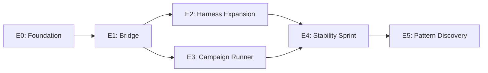

# Odibi Agent Improvement Roadmap

**Created:** 2025-12-16  
**Status:** Planning  
**Goal:** Autonomous agent that improves odibi stability through iterative learning

---

## Vision

A solo data engineer needs leverage. The agent runs campaigns overnight, finds bugs, fixes them, and makes odibi more stable — without human intervention. The human reviews results when available, not during execution.

---

## Architecture Overview

```
┌─────────────────────────────────────────────────────────────────────────────┐
│                              TRUST HIERARCHY                                 │
├─────────────────────────────────────────────────────────────────────────────┤
│                                                                             │
│  🔒 SACRED SOURCE (D:\odibi\odibi)                                         │
│     │  • Never touched by agent                                             │
│     │  • Human syncs Master back here manually                              │
│     │                                                                       │
│     ▼                                                                       │
│  🎯 MASTER CLONE (improve_odibi/master/)                                   │
│     │  • Cloned from Sacred once (human-triggered)                          │
│     │  • Agent promotes passing changes here                                │
│     │  • Snapshots before each promotion                                    │
│     │                                                                       │
│     ▼                                                                       │
│  🧪 SANDBOXES (improve_odibi/sandboxes/cycle_XXX/)                         │
│     │  • Cloned from Master each cycle                                      │
│     │  • Agent experiments freely                                           │
│     │  • Destroyed after cycle                                              │
│     │                                                                       │
│     ▼                                                                       │
│  🧠 MEMORY (improve_odibi/memory/)                                         │
│        • Lessons learned (what worked, what failed)                         │
│        • Persists across sandboxes                                          │
│        • Prevents repeating mistakes                                        │
│                                                                             │
└─────────────────────────────────────────────────────────────────────────────┘
```

---

## Phase Overview

| Phase | Name | Goal | Status |
|-------|------|------|--------|
| **E0** | Foundation | Create improvement environment infrastructure | ✅ Complete |
| **E1** | Bridge | Connect agents to odibi execution | ✅ Complete |
| **E2** | Harness Expansion | Create comprehensive learning harness configs | ✅ Complete |
| **E3** | Campaign Runner | Orchestrate multi-cycle autonomous runs | ✅ Complete |
| **E4** | Stability Sprint | Run campaigns, fix bugs, stabilize odibi | 🔄 Next |
| **E5** | Pattern Discovery | Identify gaps, add patterns from real usage | Future |

---

## Phase E0: Foundation

**Goal:** Create the improvement environment infrastructure

### E0.1: Directory Structure

Create the portable improvement environment:

```
D:\improve_odibi\                    # IMPROVEMENT_ROOT (configurable)
├── master\                          # Blessed working copy
│   └── odibi\                       # Clone of D:\odibi\odibi
├── sandboxes\                       # Disposable experiment clones
│   ├── cycle_001\
│   ├── cycle_002\
│   └── ...
├── snapshots\                       # Master rollback points
│   ├── before_cycle_005.tar.gz
│   └── before_cycle_010.tar.gz
├── memory\                          # Persistent lessons
│   ├── lessons.jsonl                # What worked/failed
│   ├── patterns.jsonl               # Discovered patterns
│   └── avoided_issues.jsonl         # Don't repeat these
├── reports\                         # Cycle reports
│   ├── cycle_001_report.md
│   └── ...
├── stories\                         # Execution traces
│   └── ...
├── config.yaml                      # Environment configuration
└── status.json                      # Current state
```

### E0.2: Configuration Schema

```yaml
# improve_odibi/config.yaml
environment:
  version: "1.0.0"
  created_at: "2025-12-16T00:00:00Z"

source:
  sacred_repo: "D:/odibi/odibi"      # NEVER touched
  auto_reset_master: false            # NEVER automatic

gates:
  require_ruff_clean: true
  require_pytest_pass: true
  require_odibi_validate: true
  require_golden_projects: true

stop_conditions:
  max_cycles: 10
  max_hours: 4
  convergence_cycles: 3               # Stop if 3 cycles learn nothing

commands:
  test: "python -m pytest tests/ -v"
  lint: "python -m ruff check odibi/"
  validate: "python -m odibi validate {file}"

snapshots:
  enabled: true
  max_snapshots: 10
  compress: true
```

### E0.3: Core Classes

```python
# agents/improve/environment.py

@dataclass
class ImprovementEnvironment:
    """Manages the Sacred → Master → Sandbox hierarchy."""

    sacred_repo: Path          # D:\odibi\odibi (NEVER touched)
    environment_root: Path     # D:\improve_odibi
    config: EnvironmentConfig

    def initialize(self) -> None:
        """Create environment structure, clone Master from Sacred."""

    def create_sandbox(self, cycle_id: str) -> SandboxInfo:
        """Clone Master to new sandbox for experiment."""

    def promote_to_master(self, sandbox: SandboxInfo, diff: str) -> bool:
        """If tests pass, apply sandbox changes to Master."""

    def snapshot_master(self, cycle_id: str) -> Path:
        """Create rollback point before promotion."""

    def rollback_master(self, snapshot: Path) -> None:
        """Restore Master to previous snapshot."""

    def destroy_sandbox(self, sandbox: SandboxInfo) -> None:
        """Clean up sandbox after cycle."""
```

### E0.4: Deliverables

- [ ] `agents/improve/` directory structure
- [ ] `ImprovementEnvironment` class
- [ ] `EnvironmentConfig` Pydantic model
- [ ] `SandboxInfo` dataclass
- [ ] CLI: `python -m agents.improve init --source D:/odibi/odibi --root D:/improve_odibi`
- [ ] Tests: Environment creation, sandbox lifecycle, snapshot/rollback

### E0.5: Success Criteria

- [ ] Can initialize environment from any source repo
- [ ] Can create/destroy sandboxes
- [ ] Can snapshot and rollback Master
- [ ] Sacred repo is NEVER modified
- [ ] All paths are configurable (portable)

---

## Phase E1: Bridge

**Goal:** Connect the agent system to odibi pipeline execution

### E1.1: Pipeline Runner

```python
# agents/improve/runner.py

class OdibiPipelineRunner:
    """Runs odibi pipelines in a sandbox and captures results."""

    def __init__(self, sandbox_path: Path):
        self.sandbox_path = sandbox_path

    def run_pipeline(self, config_path: str) -> PipelineResult:
        """Run odibi pipeline, capture story output."""
        # Uses subprocess to run: python -m odibi run {config}

    def run_tests(self) -> TestResult:
        """Run pytest, capture pass/fail."""

    def run_lint(self) -> LintResult:
        """Run ruff, capture errors."""

    def validate_config(self, config_path: str) -> ValidationResult:
        """Run odibi validate, capture result."""

    def run_golden_projects(self) -> list[GoldenResult]:
        """Run learning harness configs, check for regressions."""
```

### E1.2: Story Parser

```python
# agents/improve/story_parser.py

class StoryParser:
    """Parse odibi story markdown files into structured data."""

    def parse(self, story_path: Path) -> ParsedStory:
        """Extract structured data from story markdown."""

    def get_failures(self, story: ParsedStory) -> list[NodeFailure]:
        """Extract failed nodes with error details."""

    def get_success_rate(self, story: ParsedStory) -> float:
        """Calculate node success percentage."""
```

### E1.3: Result Aggregator

```python
# agents/improve/results.py

@dataclass
class CycleResult:
    """Complete results from one improvement cycle."""

    cycle_id: str
    sandbox_path: Path
    started_at: datetime
    completed_at: datetime

    # Pipeline results
    pipelines_run: int
    pipelines_passed: int
    pipelines_failed: int

    # Test results
    tests_passed: int
    tests_failed: int

    # Lint results
    lint_errors: int

    # Golden project results
    golden_passed: int
    golden_failed: int

    # Changes made
    files_modified: list[str]
    diff: str

    # Decision
    promoted: bool
    rejection_reason: Optional[str]
```

### E1.4: Deliverables

- [ ] `OdibiPipelineRunner` class
- [ ] `StoryParser` class
- [ ] `CycleResult` dataclass
- [ ] Integration with existing `ExecutionGateway`
- [ ] Tests: Pipeline execution, story parsing, result aggregation

### E1.5: Success Criteria

- [ ] Can run odibi pipelines from agent code
- [ ] Can parse story output into structured data
- [ ] Can run tests/lint/validate in sandbox
- [ ] Results captured for decision making

---

## Phase E2: Harness Expansion

**Goal:** Create comprehensive learning harness configs to stress-test odibi

### E2.1: Coverage Audit

Current learning harness configs:
- `scale_join.odibi.yaml` - Tests joins
- `schema_drift.odibi.yaml` - Tests schema evolution
- `skew_test.odibi.yaml` - Tests null handling

Missing coverage:

| Category | What to Test | Priority |
|----------|--------------|----------|
| **Transformers** | All 40+ transformers | High |
| **Patterns** | All 6 patterns | High |
| **Edge Cases** | Empty data, nulls, type mismatches | High |
| **Engines** | Pandas/Spark/Polars parity | Medium |
| **Connections** | AzureADLS, AzureSQL read/write | Medium |
| **CLI** | All 14+ commands | Low |

### E2.2: Harness Generator

```python
# agents/improve/harness_generator.py

class HarnessGenerator:
    """Generate learning harness configs for untested scenarios."""

    def generate_transformer_test(self, transformer: str) -> str:
        """Generate YAML config to test a specific transformer."""

    def generate_pattern_test(self, pattern: str) -> str:
        """Generate YAML config to test a specific pattern."""

    def generate_edge_case_test(self, edge_case: EdgeCase) -> str:
        """Generate YAML config for edge case testing."""

    def list_coverage_gaps(self) -> list[CoverageGap]:
        """Identify what's not covered by existing harness configs."""
```

### E2.3: New Harness Configs to Create

```
.odibi/learning_harness/
├── README.md                          # Existing
├── scale_join.odibi.yaml              # Existing
├── schema_drift.odibi.yaml            # Existing  
├── skew_test.odibi.yaml               # Existing
│
│ # NEW - Transformer coverage
├── transform_filter.odibi.yaml        # filter_rows edge cases
├── transform_derive.odibi.yaml        # derive_columns expressions
├── transform_cast.odibi.yaml          # type casting edge cases
├── transform_aggregate.odibi.yaml     # aggregation edge cases
├── transform_window.odibi.yaml        # window functions
├── transform_dedupe.odibi.yaml        # deduplication strategies
│
│ # NEW - Pattern coverage
├── pattern_scd2.odibi.yaml            # SCD2 pattern edge cases
├── pattern_dimension.odibi.yaml       # Dimension pattern
├── pattern_fact.odibi.yaml            # Fact pattern with lookups
├── pattern_date_dim.odibi.yaml        # Date dimension generation
│
│ # NEW - Edge cases
├── edge_empty_data.odibi.yaml         # Empty DataFrames
├── edge_all_nulls.odibi.yaml          # All-null columns
├── edge_type_mismatch.odibi.yaml      # Type coercion failures
├── edge_unicode.odibi.yaml            # Unicode handling
└── edge_large_schema.odibi.yaml       # 100+ columns
```

### E2.4: Deliverables

- [ ] `HarnessGenerator` class
- [ ] Coverage gap analysis
- [ ] 15+ new harness configs (one per category above)
- [ ] Updated harness README
- [ ] Tests: Harness generation, config validation

### E2.5: Success Criteria

- [ ] Every transformer has at least one harness config
- [ ] Every pattern has at least one harness config
- [ ] Edge cases are covered
- [ ] All harness configs pass `odibi validate`

---

## Phase E3: Campaign Runner

**Goal:** Orchestrate multi-cycle autonomous improvement runs

### E3.1: Campaign Orchestrator

```python
# agents/improve/campaign.py

@dataclass
class CampaignConfig:
    """Configuration for an improvement campaign."""

    max_cycles: int = 10
    max_hours: float = 4.0
    convergence_threshold: int = 3

    # Promotion gates
    require_tests_pass: bool = True
    require_lint_clean: bool = True
    require_golden_pass: bool = True

    # Focus area (optional)
    focus_transformers: Optional[list[str]] = None
    focus_patterns: Optional[list[str]] = None


class CampaignRunner:
    """Run autonomous improvement campaigns."""

    def __init__(
        self,
        environment: ImprovementEnvironment,
        config: CampaignConfig,
    ):
        self.env = environment
        self.config = config
        self.memory = CampaignMemory(environment.memory_path)

    def run(self) -> CampaignResult:
        """Run improvement campaign until stop condition."""

        for cycle in range(self.config.max_cycles):
            # Check time budget
            if self.elapsed_hours() > self.config.max_hours:
                return self.finalize("TIME_BUDGET_EXHAUSTED")

            # Check convergence
            if self.is_converged():
                return self.finalize("CONVERGED")

            # Run one cycle
            result = self.run_cycle(cycle)

            # Record lessons
            self.memory.record(result)

        return self.finalize("MAX_CYCLES_REACHED")

    def run_cycle(self, cycle_num: int) -> CycleResult:
        """Run one improvement cycle."""

        cycle_id = f"cycle_{cycle_num:03d}"

        # 1. Query memory - what should we avoid?
        avoid_issues = self.memory.get_failed_approaches()

        # 2. Create sandbox
        sandbox = self.env.create_sandbox(cycle_id)

        try:
            # 3. Find something to work on
            task = self.find_work(sandbox, avoid_issues)

            if not task:
                return CycleResult(cycle_id, learning=False, reason="NO_WORK_FOUND")

            # 4. Attempt improvement
            improvement = self.attempt_improvement(sandbox, task)

            # 5. Validate improvement
            if self.validate(sandbox, improvement):
                # 6. Snapshot Master
                self.env.snapshot_master(cycle_id)

                # 7. Promote to Master
                self.env.promote_to_master(sandbox, improvement.diff)

                return CycleResult(cycle_id, learning=True, promoted=True)
            else:
                return CycleResult(cycle_id, learning=True, promoted=False)

        finally:
            # 8. Destroy sandbox
            self.env.destroy_sandbox(sandbox)

    def find_work(self, sandbox: SandboxInfo, avoid: list[str]) -> Optional[Task]:
        """Find next thing to work on."""

        # Option 1: Run harness, find failures
        failures = self.run_golden_projects(sandbox)
        if failures:
            return Task(type="FIX_FAILURE", target=failures[0])

        # Option 2: Run issue discovery
        issues = self.discover_issues(sandbox)
        new_issues = [i for i in issues if i.id not in avoid]
        if new_issues:
            return Task(type="FIX_ISSUE", target=new_issues[0])

        # Option 3: Expand coverage
        gaps = self.find_coverage_gaps(sandbox)
        if gaps:
            return Task(type="ADD_HARNESS", target=gaps[0])

        return None

    def is_converged(self) -> bool:
        """Check if we've stopped learning."""
        recent = self.memory.get_recent_cycles(self.config.convergence_threshold)
        return all(not c.learning for c in recent)
```

### E3.2: Campaign Memory

```python
# agents/improve/memory.py

class CampaignMemory:
    """Persistent memory across campaign cycles."""

    def __init__(self, memory_path: Path):
        self.lessons_file = memory_path / "lessons.jsonl"
        self.avoided_file = memory_path / "avoided_issues.jsonl"

    def record(self, result: CycleResult) -> None:
        """Record what happened this cycle."""

    def get_failed_approaches(self) -> list[str]:
        """Get list of things that didn't work - don't repeat."""

    def get_successful_patterns(self) -> list[str]:
        """Get list of things that worked - prefer these."""

    def get_recent_cycles(self, n: int) -> list[CycleResult]:
        """Get N most recent cycle results."""

    def query_similar(self, issue: str) -> list[Lesson]:
        """Find similar past issues and what we learned."""
```

### E3.3: Status Dashboard

```python
# agents/improve/status.py

class StatusTracker:
    """Track and report campaign status."""

    def update(self, cycle: CycleResult) -> None:
        """Update status.json after each cycle."""

    def get_summary(self) -> CampaignSummary:
        """Get current campaign summary."""

    def generate_report(self) -> str:
        """Generate markdown report of progress."""
```

```json
// improve_odibi/status.json
{
  "campaign_id": "campaign_2025_12_16",
  "status": "RUNNING",
  "started_at": "2025-12-16T22:00:00Z",
  "current_cycle": 7,
  "cycles_completed": 6,
  "improvements_promoted": 4,
  "improvements_rejected": 2,
  "master_changes": 12,
  "last_promotion": "2025-12-16T23:45:00Z",
  "convergence_counter": 1,
  "issues_avoided": ["duplicate_join_bug", "null_handling_v1"],
  "elapsed_hours": 1.75
}
```

### E3.4: Deliverables

- [ ] `CampaignRunner` class
- [ ] `CampaignConfig` Pydantic model
- [ ] `CampaignMemory` class
- [ ] `StatusTracker` class
- [ ] CLI: `python -m agents.improve run --config campaign.yaml`
- [ ] Tests: Campaign lifecycle, memory persistence, convergence detection

### E3.5: Success Criteria

- [ ] Can run multi-cycle campaigns autonomously
- [ ] Stops on time/cycle/convergence limits
- [ ] Memory prevents repeating failed approaches
- [ ] Status is always queryable
- [ ] Master only updated when ALL gates pass

---

## Phase E4: Stability Sprint

**Goal:** Add LLM "brain" to campaigns, then run overnight autonomous improvement

### E4.1: ImprovementBrain (LLM Integration)

Create `agents/improve/brain.py` - the LLM-powered code fixer:

```python
class ImprovementBrain:
    """LLM-powered code improvement within sandboxes."""

    def __init__(
        self,
        llm_client: LLMClient,
        max_attempts_per_sandbox: int = 3,
    ):
        ...

    def improve_sandbox(
        self,
        sandbox: SandboxInfo,
        gate_result: GateCheckResult,
        avoid_issues: list[str],
        campaign_goal: str,
        run_gates: Callable,
    ) -> tuple[GateCheckResult, int]:
        """Try to fix gate failures using LLM.

        Returns final gate result and number of attempts used.
        """
```

**Key integration points:**
- Uses `agents/ui/llm_client.py` (provider-agnostic: OpenAI, Azure, Ollama)
- Uses `agents/core/execution.py` ExecutionGateway for file tools
- Inner loop: analyze failure → LLM proposes fix → apply → re-run gates
- Bounded attempts prevent infinite loops

### E4.2: CampaignRunner + Brain Integration

Update `CampaignRunner.run_cycle()` to use the brain:

```python
def run_cycle(self, cycle_num: int) -> CycleResult:
    sandbox = self._env.create_sandbox(cycle_id)
    try:
        # Initial gate check
        gate_result = self.check_gates(sandbox)

        # If gates fail, try LLM improvement
        if not gate_result.all_passed and self._config.enable_llm_improvements:
            gate_result, attempts = self._brain.improve_sandbox(
                sandbox=sandbox,
                gate_result=gate_result,
                avoid_issues=self._memory.get_failed_approaches(),
                campaign_goal=self._config.goal,
                run_gates=self.check_gates,
            )

        # Promote if all gates pass
        if gate_result.all_passed:
            self._env.snapshot_master(cycle_id)
            self._env.promote_to_master(sandbox)
            ...
    finally:
        self._env.destroy_sandbox(sandbox)
```

### E4.3: CampaignConfig Updates

Add to `CampaignConfig`:

```python
# LLM improvement settings
enable_llm_improvements: bool = True
max_improvement_attempts_per_cycle: int = 3
llm_model: str = "gpt-4o-mini"  # or "o4-mini", "claude-3-5-sonnet", etc.
```

### E4.4: Prompting Strategy

System prompt for ImprovementBrain:

> You are an autonomous senior software engineer working in a sandbox.
>
> Objective: Make all promotion gates pass (tests, lint, golden projects).
>
> Constraints:
> - Prefer the smallest, safest change
> - Do not remove or weaken tests
> - Keep code style consistent
> - Use provided tools to inspect and edit files

User prompt includes:
- Gate failure details (test names, lint errors, golden project failures)
- Known bad approaches to avoid (from CampaignMemory)
- Campaign goal

### E4.5: CLI Extension

```bash
# Run campaign with LLM improvements enabled
python -m agents.improve run --root D:/improve_odibi \
    --max-cycles 10 --max-hours 4 \
    --llm-model gpt-4o-mini \
    --max-attempts 3
```

### E4.6: UI Integration

Add campaigns panel to existing Gradio UI (`agents/ui/`):

```python
# agents/ui/components/campaigns.py

class CampaignsPanel:
    """Campaign monitoring and control panel."""

    def render(self) -> gr.Column:
        """Render campaigns tab with:
        - Campaign status (running/stopped/completed)
        - Current cycle progress
        - Recent cycles table
        - Start/stop controls
        - Reports viewer
        """
```

**UI Components:**

| Component | Description |
|-----------|-------------|
| Status card | Campaign ID, status, elapsed time, cycles completed |
| Progress bar | Visual cycle/hour progress |
| Cycles table | Recent cycles with promoted/rejected, files changed |
| Controls | Start campaign button, stop button, refresh |
| Reports viewer | Markdown rendering of campaign reports |
| Live log | Stream LLM improvement attempts (optional) |

**Integration with app.py:**

```python
# Add to existing tabs
with gr.Tab("Campaigns"):
    campaigns_panel = CampaignsPanel(
        status_tracker=status_tracker,
        campaign_runner=campaign_runner,
    )
    campaigns_panel.render()
```

### E4.7: Deliverables

- [ ] `agents/improve/brain.py` - ImprovementBrain class
- [ ] CampaignRunner integration with inner improvement loop  
- [ ] Prompting templates for failure analysis
- [ ] CLI flags for LLM configuration
- [ ] `agents/ui/components/campaigns.py` - UI panel
- [ ] UI integration in `agents/ui/app.py`
- [ ] First successful LLM-powered campaign
- [ ] Bug fixes promoted to Master

### E4.8: Success Criteria

- [ ] Campaign can autonomously fix lint errors
- [ ] Campaign can autonomously fix simple test failures
- [ ] Memory prevents repeating failed approaches
- [ ] UI shows campaign status and progress
- [ ] odibi tests still pass (no regressions)
- [ ] Master has meaningful improvements over Sacred

### E4.8: Known Issues to Target

| Issue | Location | Type |
|-------|----------|------|
| `NotImplementedError` | `spark_engine.py:850` | Incomplete |
| `NotImplementedError` | `spark_engine.py:1584` | Incomplete |
| `NotImplementedError` | `diagnostics/manager.py:102` | Incomplete |
| Debug prints | `odibi/ui/app.py:159-192` | Cleanup |

---

## Phase E5: Pattern Discovery (Future)

**Goal:** Identify gaps in odibi from real usage, add patterns that solve real problems

### E5.1: Usage Analysis

```python
class UsageAnalyzer:
    """Analyze stories to find common patterns and gaps."""

    def find_common_patterns(self, stories: list[ParsedStory]) -> list[Pattern]:
        """What transformer sequences appear repeatedly?"""

    def find_failure_patterns(self, stories: list[ParsedStory]) -> list[FailurePattern]:
        """What kinds of errors happen repeatedly?"""

    def suggest_new_transformers(self) -> list[TransformerSuggestion]:
        """What transformers would simplify common workflows?"""
```

### E5.2: Gap Detection

- What do users try that fails?
- What requires too many steps?
- What's missing from Azure support?

### E5.3: Pattern Implementation

When a clear gap is identified:
1. Agent proposes new pattern/transformer
2. Generates tests
3. Implements in sandbox
4. Validates with harness
5. Promotes if all gates pass

---

## Dependencies



---

## Constraints (Enforced Always)

| Constraint | Enforcement |
|------------|-------------|
| Sacred repo NEVER touched | Path validation in all write operations |
| Azure only (no AWS/GCP) | Forbidden connection list in config |
| Stability before features | `allow_new_features: false` until E5 |
| All gates must pass | No promotion without tests + lint + golden |
| Memory prevents repeats | Query memory before each cycle |
| Time/cycle bounds | Hard limits in CampaignRunner |

---

## Success Metrics

| Metric | Target | How to Measure |
|--------|--------|----------------|
| Test pass rate | 100% | pytest exit code |
| Lint errors | 0 | ruff exit code |
| Harness coverage | 100% transformers | Coverage audit |
| Convergence | < 10 cycles | Cycles until no new learnings |
| Master improvements | > 0 | Git diff Sacred vs Master |
| No regressions | 0 | Golden project pass rate |

---

## Timeline

| Phase | Estimated Duration | Depends On |
|-------|-------------------|------------|
| E0: Foundation | 1-2 days | Nothing |
| E1: Bridge | 1-2 days | E0 |
| E2: Harness Expansion | 2-3 days | E1 |
| E3: Campaign Runner | 2-3 days | E1 |
| E4: Stability Sprint | Ongoing | E2, E3 |
| E5: Pattern Discovery | Future | E4 stable |

**Total to first autonomous campaign: ~7-10 days**

---

## Next Steps

1. [ ] Review and approve this roadmap
2. [ ] Start Phase E0: Create `agents/improve/` module
3. [ ] Test environment creation with real paths
4. [ ] Proceed to E1 once E0 is verified

---

*Document generated by Amp. Subject to human review and approval.*
